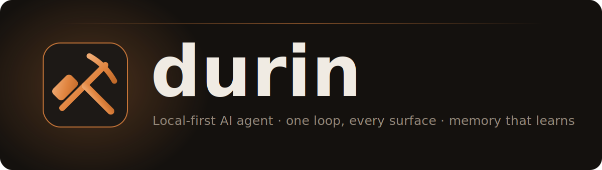
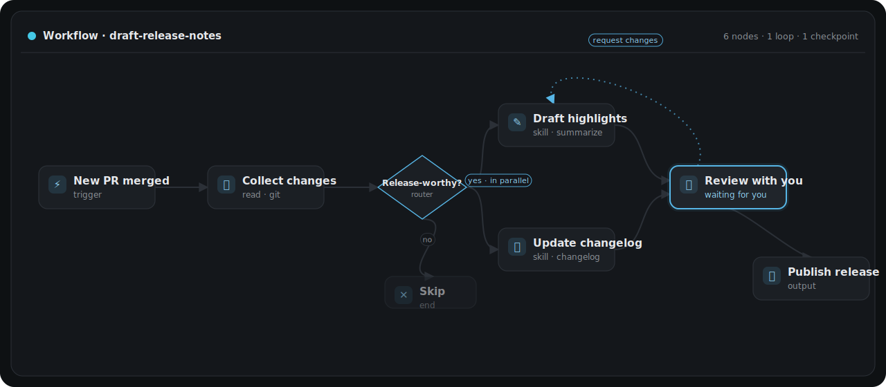
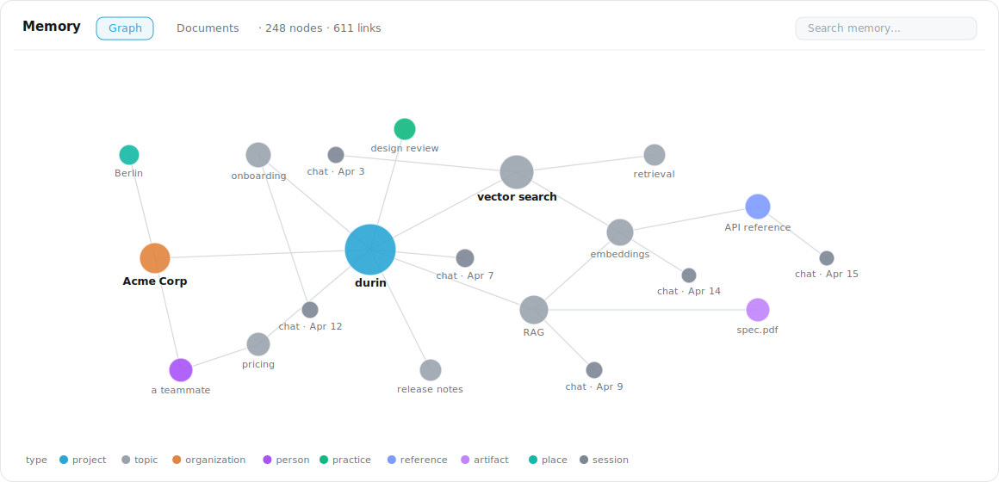
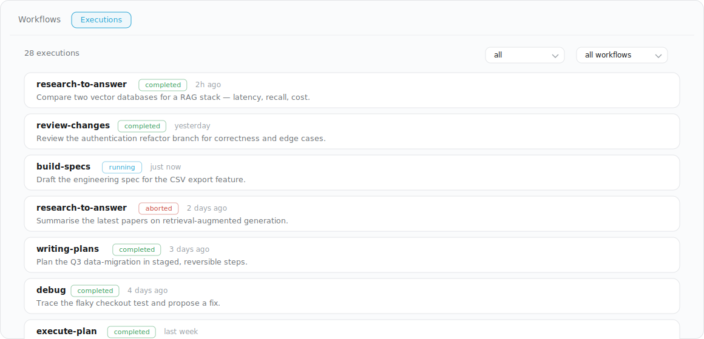

<p align="center">
  
</p>

<p align="center">
  <a href="https://pypi.org/project/durin-agent/"></a>
  
  <a href="LICENSE"></a>
</p>

**The problem with AI agents isn't that they forget — it's that they improvise.**
durin is built the other way around: it remembers your work, sharpens its own
skills, and runs on adaptable workflows that make it follow the exact steps *you*
define instead of inventing its own. Reliable execution you control — local-first,
on any model.

> durin is named for Tolkien's dwarf-king of Khazad-dûm; the mark is a dwarven
> anvil lit by a forge flame.

## Why durin

### Workflows that follow *your* steps

Left to itself, an LLM agent improvises a different path every time — great for
open-ended chat, unreliable for work you need done *a specific way*. durin lets you
pin it to **adaptable workflows**: visual graphs of nodes with routing, loops,
parallel branches, sub-flows, and human checkpoints. A task then runs the way you
designed it — every time. The agent can pause to ask you, resume exactly where it
stopped, and even **edit and improve a workflow on its own** (with an auto-revert
safety net). Few personal agents give you this much control over *how* the work
gets done.

<p align="center">
  
</p>

### A memory that's actually yours

durin builds an **entity graph** from your conversations — people, projects,
documents, decisions — and keeps it as plain markdown *you own*. Recall is instant
and offline: it searches an FTS + vector index **without an LLM in the hot path**,
so it's fast and private. Documents you hand it (PDF, Office, EPUB, web pages) land
in a separate **Library**, kept apart from everyday recall. The markdown is the
source of truth; the search indexes are derived and rebuildable. (Benchmarked at
LoCoMo ≈ 0.79.)

<p align="center">
  
</p>

### A skills ecosystem with guardrails

durin discovers skills from public marketplaces, **security-scans each one** for
scam/malware patterns before you run it, and connects MCP servers from a curated
catalog with one-click install and auto-detected OAuth. Its composition doctrine
keeps behaviour reliable — **prefer deterministic code, use workflows for
structure, treat skills as the through-line the agent follows** — and it sharpens
its own skills over time.

### See exactly what it's running

Every run — workflows, scheduled cron jobs, agent tasks — shows up in a live panel
with per-step detail, status, and the model used. Nothing happens in a black box:
watch a run, open a paused checkpoint, and pick up right where it stopped.

<p align="center">
  
</p>

### And more

- **Any model, or none.** 35 provider integrations — Anthropic, OpenAI, Gemini,
  NVIDIA, Mistral, DeepSeek, Groq, Z.AI, Qwen, Moonshot, and more, plus OpenRouter
  and other gateways that reach hundreds of models. Switch mid-conversation, or run
  fully local with Ollama / llama.cpp / vLLM / LM Studio.
- **Talk to it anywhere.** A CLI, a Textual TUI, a browser dashboard, and chat
  channels — Telegram, Slack, Discord, email, WhatsApp, WebSocket — all reach the
  same agent and the same memory.
- **Local-first & private.** Runs as a daemon on your own machine under
  `~/.durin/`; nothing phones home.
- **Personas, voice, and schedules.** Per-channel personas (a SOUL + a model),
  local speech-to-text and text-to-speech, and cron for scheduled work.

### …and it gets sharper while you sleep

A cold-path *dream* runs offline: it consolidates your conversations into the
memory graph and curates your skills, so durin quietly gets better at helping you
over time — without you lifting a finger.

## Quick start

```bash
uv tool install --prerelease allow durin-agent   # PyPI (uv picks a compatible Python)
durin onboard                    # interactive setup wizard
durin doctor                     # confirm setup is healthy
durin agent                      # launch the TUI
```

Run the gateway for the browser dashboard plus chat channels:

```bash
durin gateway start              # dashboard at http://127.0.0.1:8765
```

See the [install guide](docs/guide/install.md) for prerequisites, optional extras
(memory, local models, audio), and platform notes. For everyday and in-session
commands, see the [CLI reference](docs/guide/cli.md).

## Documentation

- [Install · configure · uninstall](docs/guide/install.md)
- [CLI & in-session commands](docs/guide/cli.md)
- [Configuration reference](docs/guide/configuration.md)
- [Providers & models](docs/guide/providers.md)
- [Channels](docs/guide/channels.md) — Telegram, Slack, Discord, email, and more
- [Documents & your knowledge](docs/guide/documents.md)
- [Workflows](docs/guide/workflows.md)
- [How it works (internals)](docs/internals/README.md)

## License

MIT
