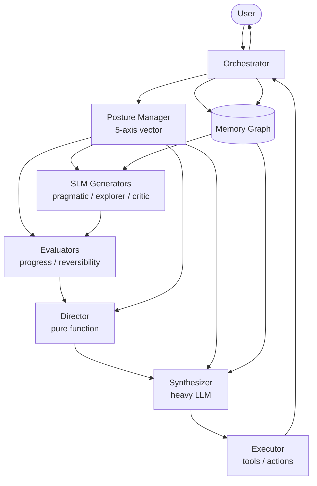
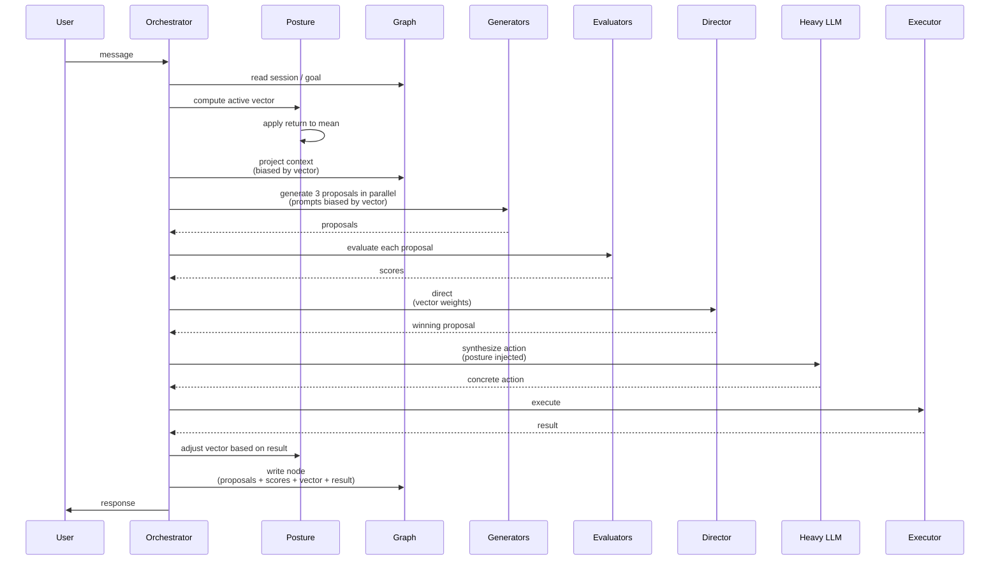
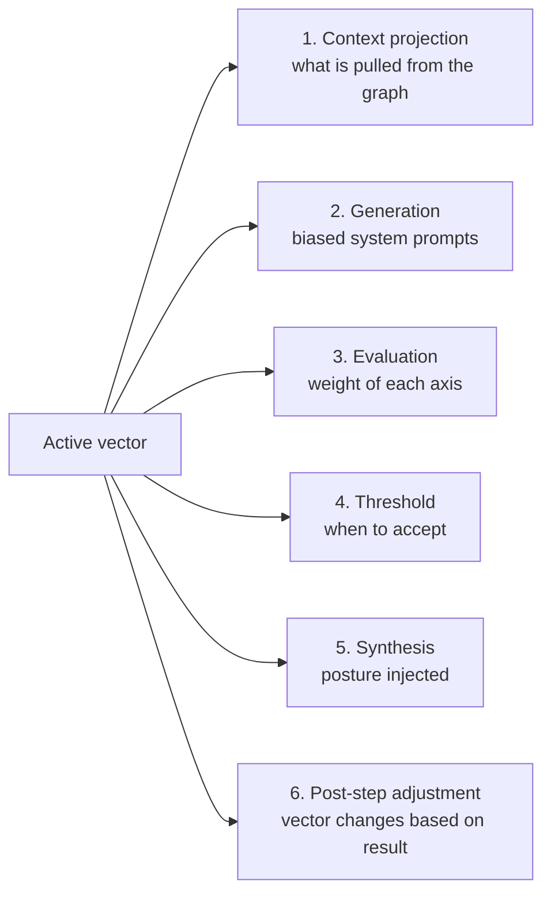
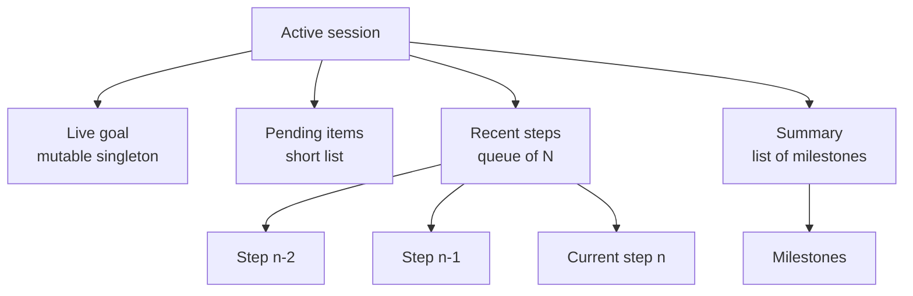
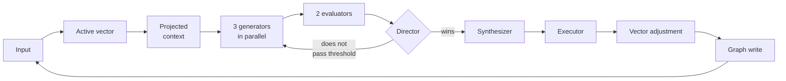

# Durin — General Design

> Agent with a guiding thread (posture) and structured memory (graph) to improve goal tracking and context management in short- and long-range tasks.

---

## 1. Motivation

Current LLM-based agents have two structural problems:

1. **They lack stable "character."** They change personality depending on the prompt, making them unpredictable across tasks and difficult to debug.
2. **They handle context poorly.** They accumulate tokens until they burst, then perform emergency compaction. Context is a trash can, not a useful projection.

Durin proposes solving both problems with two pieces:

- **Guiding thread**: a persistent weight vector representing the agent's "posture" that biases deliberation at each step. Inspired by Set-Point Theory and Whole Trait Theory.
- **Memory as a graph**: a persistent store with a live goal, pending items, recent steps, and accumulated summary. The context the LLM receives at each step is a **projection** of the graph, not a dump.

We don't seek super-intelligence or consciousness. We seek an agent that pursues goals with coherence and learns from its own experience.

---

## 2. Theoretical Foundations

### 2.1 Guiding thread — psychology

**Set-Point Theory** (Cummins, Headey & Wearing).
Each trait has a *set point* (baseline) and a *bandwidth* (oscillation range). Stimuli move the value, homeostatic mechanisms bring it back to the set point. Analogous to a thermostat.

**Whole Trait Theory** (Fleeson, 2001).
A trait is not a single value, it is a complete distribution of states. Each person has their own **mean** and **variance**. Variance is part of personality: two people with the same mean and different variance are different.

**Big Five / HEXACO**.
Five empirically validated dimensions: Openness, Conscientiousness, Extraversion, Agreeableness, Neuroticism. HEXACO adds Honesty-Humility (which in Durin is treated as a hard constraint, not a modulable trait).

**Moskowitz — flux, pulse, spin**.
Variability itself is a personal signature. The amount and shape of oscillations is stable information.

### 2.2 Guiding thread — neuroscience

**Global Workspace Theory** (Baars, Dehaene).
Cognition is parallel and unconscious. Multiple processes compete locally; the winner is broadcast globally and becomes "conscious." Salience for the current internal state decides what wins, not pure logic.

**Subsumption Architecture** (Rodney Brooks).
Simple behaviors stacked; intelligence emerges from interaction between layers. The "director" is not a homunculus: it is competition with bias.

### 2.3 Memory

**Working Memory** (Baddeley).
Active focus limited to 3-4 chunks. Everything else is accessed on demand.

**Episodic vs semantic memory**.
Concrete episodes (what happened) vs abstracted patterns (what type of thing usually happens). Consolidation during sleep abstracts patterns by crossing episodes.

**Prospective memory**.
Latent intentions triggered by contextual cues. For an agent: a list of pending items that don't occupy focus but activate when appropriate.

**Reconstructive gist**.
Human memory doesn't retrieve, it reconstructs. What we remember is a synthesis generated in the moment from fragments.

### 2.4 State of the art in AI (reviewed frameworks)

**CoALA** (paper, 2023). Standard taxonomy: working / episodic / semantic / procedural memory. Adopted by IBM, MongoDB, LangChain, Letta, Mem0.

**Letta / MemGPT** (Apache 2.0). Memory as operating system: layers with pagination. The agent lives inside its runtime (architectural lock-in).

**Graphiti / Zep** (Apache 2.0). Temporal graph with fact invalidation. Each fact has a validity window. It is a composable library, not a runtime.

**Mem0** (Apache 2.0). Hybrid vector + graph + key-value. Automatic consolidation.

**Episodic Memory is the Missing Piece** (paper, Feb 2026). Acknowledges that episodic-to-semantic consolidation remains the bottleneck.

### 2.5 State of the art — evolutionary + LLM

**Mind Evolution** (DeepMind, 2025). Genetic search with LLM as generator. Divergent thinking followed by convergent.

**FunSearch / AlphaEvolve** (DeepMind). Evolutionary + LLM discovering mathematical algorithms in production.

**MADE** (Nov 2025). Addresses the problem of LLM as biased judge. Separates specification (stable, external) from generation (where the LLM produces variation).

**EvoAgent**. Generates populations of agents with diverse biases via mutation/crossover.

**AdaptEvolve** (AMD). Dynamic model selection: SLM when sufficient, scales to large LLM only if needed. ~38% cost reduction with 97.5% of the quality.

### 2.6 What **nobody is doing** and where the differential value lies

- **Persistent guiding thread that biases all deliberation** (not just the final output).
- **Dynamic graph projection to context at each iteration**, according to focus and posture.
- **Contrastive learning success vs failure** during consolidation.

These three absences in the state of the art are Durin's opportunity.

---

## 3. High-Level Design

### 3.1 Components

### 3.2 Flow of a step

### 3.3 The guiding thread in six moments

The posture vector is not decoration: it touches six points in the cycle.

### 3.4 The five axes

| Axis | Low <-> High | Function |
|---|---|---|
| Caution | Bold <-> Cautious | Weight of risk and reversibility |
| Exploration | Exploitation <-> Exploration | Try new vs use known |
| Depth | Fast <-> Deep | How much to invest in thinking before acting |
| Discipline | Improvisation <-> Method | Follow procedure vs adapt |
| Conformity | Challenge <-> Conformity | Accept the task vs object |

Each axis has:
- **Mean** (set point, stable personality)
- **Typical variance** (how much it normally moves)
- **Return force** (how quickly it returns to the mean)
- **Current value** (momentary state)

**Honesty** and other ethical constraints: hardcoded, outside the vector. Fixed weight 1, variance 0.

### 3.5 Graph structure

Each step node contains:
- Generated proposals (winner + discards)
- Evaluator scores
- Active posture vector at that moment
- Executed action
- Result (success / failure / ambiguity)
- Free notes

### 3.6 Simplified pipeline

---

## 4. Roadmap

### Phase 1 — MVP

- 5-axis vector with basic homeostasis.
- Graph with four node roles (goal, pending items, recent, summary).
- Three SLM generators.
- Two evaluators (progress, reversibility).
- Director by weighted sum.
- Synthesizer (large LLM, API or local).

### Phase 2

- More evaluator axes if failure modes justify it.
- Real edges in the graph (dependencies between steps).
- Hierarchical posture injection (plan / subplan / step).

### Phase 3

- Periodic consolidation ("sleep"): distills patterns from the episodic graph.
- Adjustment of vector means based on outcome history.
- Contrastive learning success vs failure.

### Phase 4 (speculative)

- Evolutionary exploration: populations of proposals with mutation/crossover.
- Multiple agents with different personalities collaborating.

---

## 5. Closed Decisions

- Domain: generalist.
- One personality per agent (no multi-profile for now).
- Each execution step adjusts current values of the vector, not means.
- Means, variances, and return forces are adjusted in the future (consolidation).
- Tech stack is irrelevant at this level; it changes every month.

---

## 6. Pending for Detailed Documents

**Doc 2 — Guiding thread in detail:**
- How the vector translates to behavior at each of the six moments.
- Vector update rules by stimulus type.
- Return to mean function.
- Hierarchical injection in long plans.

**Doc 3 — Memory in detail:**
- Exact schema of the step node.
- Projection rule: what from the graph enters the context, biased by vector.
- When a step is promoted to a summary milestone.
- Decay and invalidation.
