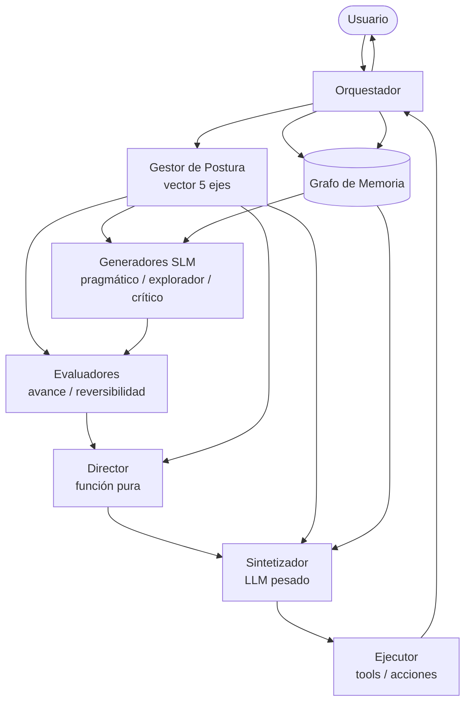
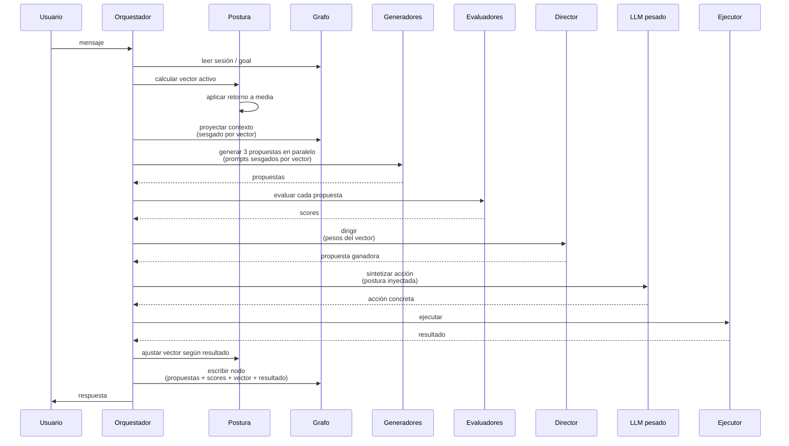
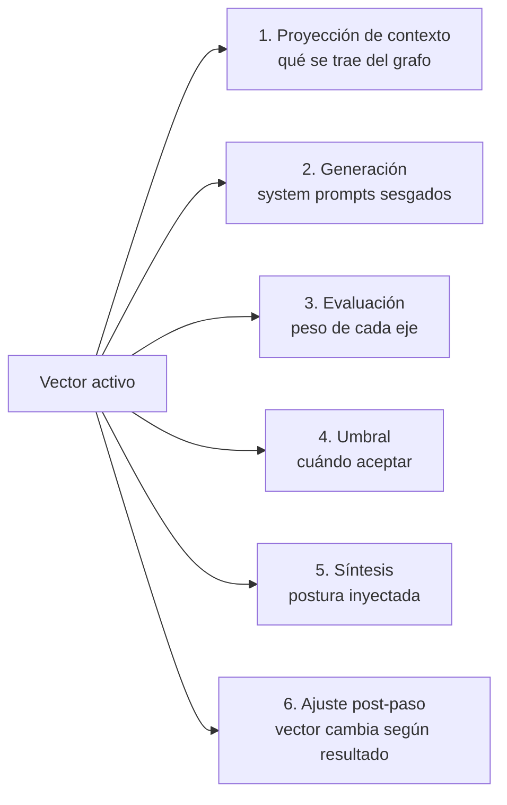
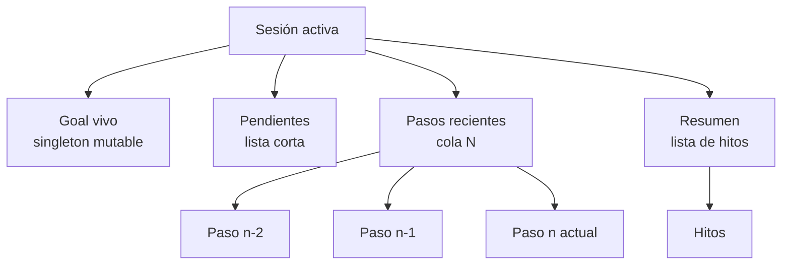
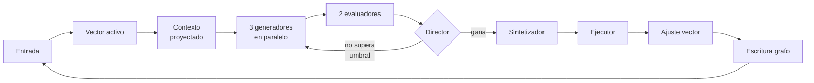

# Durin — Diseño general

> Agente con hilo conductor (postura) y memoria estructurada (grafo) para mejorar el seguimiento de objetivos y el manejo de contexto en tareas de corto y largo alcance.

---

## 1. Motivación

Los agentes basados en LLMs actuales tienen dos problemas estructurales:

1. **No tienen "carácter" estable.** Cambian de personalidad según el prompt, lo cual los hace impredecibles entre tareas y difíciles de depurar.
2. **Manejan mal el contexto.** Acumulan tokens hasta que estallan, y entonces compactan de emergencia. El contexto es un cubo de basura, no una proyección útil.

Durin propone resolver ambos problemas con dos piezas:

- **Hilo conductor**: un vector de pesos persistente que representa la "postura" del agente y sesga la deliberación en cada paso. Inspirado en Set-Point Theory y Whole Trait Theory.
- **Memoria como grafo**: un almacén persistente con goal vivo, pendientes, pasos recientes y resumen acumulado. El contexto que recibe el LLM en cada paso es una **proyección** del grafo, no un volcado.

No buscamos super-inteligencia ni conciencia. Buscamos un agente que persigue objetivos con coherencia y aprende de su propia experiencia.

---

## 2. Fundamentos teóricos

### 2.1 Hilo conductor — psicología

**Set-Point Theory** (Cummins, Headey & Wearing).
Cada rasgo tiene un *set point* (baseline) y un *bandwidth* (rango de oscilación). Estímulos mueven el valor, mecanismos homeostáticos lo traen de vuelta al set point. Análogo al termostato.

**Whole Trait Theory** (Fleeson, 2001).
Un rasgo no es un valor único, es una distribución completa de estados. Cada persona tiene **media** y **varianza** propias. La varianza es parte de la personalidad: dos personas con misma media y distinta varianza son distintas.

**Big Five / HEXACO**.
Cinco dimensiones empíricamente validadas: Openness, Conscientiousness, Extraversion, Agreeableness, Neuroticism. HEXACO agrega Honesty-Humility (que en Durin se trata como restricción dura, no rasgo modulable).

**Moskowitz — flux, pulse, spin**.
La variabilidad misma es firma personal. La cantidad y forma de las oscilaciones es información estable.

### 2.2 Hilo conductor — neurociencia

**Global Workspace Theory** (Baars, Dehaene).
La cognición es paralela e inconsciente. Múltiples procesos compiten localmente; el ganador se difunde globalmente y se vuelve "consciente". La saliencia para el estado interno actual decide qué gana, no la lógica pura.

**Subsumption Architecture** (Rodney Brooks).
Comportamientos simples apilados; la inteligencia emerge de la interacción entre capas. El "director" no es un homúnculo: es competencia con sesgo.

### 2.3 Memoria

**Working Memory** (Baddeley).
Foco activo limitado a 3-4 chunks. Todo lo demás se accede bajo demanda.

**Memoria episódica vs semántica**.
Episodios concretos (qué pasó) vs patrones abstraídos (qué tipo de cosa suele pasar). La consolidación durante el sueño abstrae patrones cruzando episodios.

**Memoria prospectiva**.
Intenciones latentes que se disparan por señales contextuales. Para un agente: lista de pendientes que no ocupan foco pero se activan cuando corresponde.

**Gist reconstructivo**.
La memoria humana no recupera, reconstruye. Lo que recordamos es una síntesis generada en el momento desde fragmentos.

### 2.4 Estado del arte en IA (frameworks revisados)

**CoALA** (paper, 2023). Taxonomía estándar: working / episodic / semantic / procedural memory. Adoptado por IBM, MongoDB, LangChain, Letta, Mem0.

**Letta / MemGPT** (Apache 2.0). Memoria como sistema operativo: capas con paginación. El agente vive dentro de su runtime (lock-in arquitectónico).

**Graphiti / Zep** (Apache 2.0). Grafo temporal con invalidación de hechos. Cada hecho tiene ventana de validez. Es biblioteca componible, no runtime.

**Mem0** (Apache 2.0). Híbrido vector + grafo + key-value. Consolidación automática.

**Episodic Memory is the Missing Piece** (paper, feb 2026). Reconoce que la consolidación episódica → semántica sigue siendo el cuello de botella.

### 2.5 Estado del arte — evolutivo + LLM

**Mind Evolution** (DeepMind, 2025). Búsqueda genética con LLM como generador. Pensamiento divergente seguido de convergente.

**FunSearch / AlphaEvolve** (DeepMind). Evolutivo + LLM descubriendo algoritmos matemáticos en producción.

**MADE** (nov 2025). Aborda el problema de LLM como juez sesgado. Separa especificación (estable, externa) de generación (donde el LLM produce variación).

**EvoAgent**. Genera poblaciones de agentes con sesgos diversos por mutación/crossover.

**AdaptEvolve** (AMD). Selección dinámica de modelo: SLM cuando alcanza, escala a LLM grande solo si hace falta. ~38% reducción de costo con 97.5% de la calidad.

### 2.6 Lo que **nadie está haciendo** y donde está el valor diferencial

- **Hilo conductor persistente que sesga toda la deliberación** (no solo el output final).
- **Proyección dinámica del grafo al contexto en cada iteración**, según foco y postura.
- **Aprendizaje contrastivo éxito vs fracaso** durante la consolidación.

Estas tres ausencias en el estado del arte son la oportunidad de Durin.

---

## 3. Diseño de alto nivel

### 3.1 Componentes

### 3.2 Flujo de un paso

### 3.3 El hilo conductor en seis momentos

El vector de postura no es decoración: toca seis puntos del ciclo.

### 3.4 Los cinco ejes

| Eje | Bajo ↔ Alto | Función |
|---|---|---|
| Cautela | Audaz ↔ Cauteloso | Peso del riesgo y reversibilidad |
| Exploración | Explotación ↔ Exploración | Probar nuevo vs usar lo conocido |
| Profundidad | Veloz ↔ Profundo | Cuánto invertir en pensar antes de actuar |
| Disciplina | Improvisación ↔ Método | Seguir procedimiento vs adaptar |
| Conformidad | Desafío ↔ Conformidad | Aceptar la tarea vs objetar |

Cada eje tiene:
- **Media** (set point, personalidad estable)
- **Varianza típica** (cuánto se mueve normalmente)
- **Fuerza de retorno** (qué tan rápido vuelve a la media)
- **Valor actual** (estado momentáneo)

**Honestidad** y otras restricciones éticas: hardcoded, fuera del vector. Peso fijo 1, varianza 0.

### 3.5 Estructura del grafo

Cada nodo de paso contiene:
- Propuestas generadas (ganadora + descartes)
- Scores de evaluadores
- Vector de postura activa en ese momento
- Acción ejecutada
- Resultado (éxito / fallo / ambigüedad)
- Notas libres

### 3.6 Pipeline simplificado

---

## 4. Roadmap

### Fase 1 — MVP

- Vector de 5 ejes con homeostasis básica.
- Grafo con cuatro roles de nodo (goal, pendientes, recientes, resumen).
- Tres generadores SLM.
- Dos evaluadores (avance, reversibilidad).
- Director por suma ponderada.
- Sintetizador (LLM grande, API o local).

### Fase 2

- Más ejes de evaluadores si los modos de fallo lo justifican.
- Aristas reales en el grafo (dependencias entre pasos).
- Inyección jerárquica de postura (plan / subplan / paso).

### Fase 3

- Consolidación periódica (el "sueño"): destila patrones del grafo episódico.
- Ajuste de medias del vector basado en historia de outcomes.
- Aprendizaje contrastivo éxito vs fracaso.

### Fase 4 (especulativa)

- Exploración evolutiva: poblaciones de propuestas con mutación/crossover.
- Múltiples agentes con personalidades distintas colaborando.

---

## 5. Decisiones cerradas

- Dominio: generalista.
- Una sola personalidad por agente (no multi-perfil por ahora).
- Cada paso de ejecución ajusta valores actuales del vector, no medias.
- Medias, varianzas y fuerzas de retorno se ajustan a futuro (consolidación).
- Stack técnico es irrelevante a este nivel; cambia cada mes.

---

## 6. Pendientes para los documentos detallados

**Doc 2 — Hilo conductor en detalle:**
- Cómo se traduce el vector a comportamiento en cada uno de los seis momentos.
- Reglas de actualización del vector por tipo de estímulo.
- Función de retorno a media.
- Inyección jerárquica en planes largos.

**Doc 3 — Memoria en detalle:**
- Esquema exacto del nodo de paso.
- Regla de proyección: qué del grafo entra al contexto, sesgado por vector.
- Cuándo se promueve un paso a hito del resumen.
- Decaimiento e invalidación.
