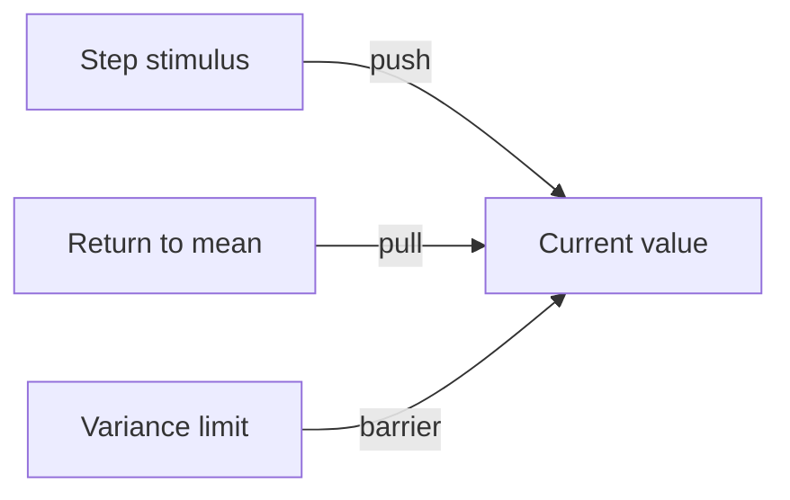
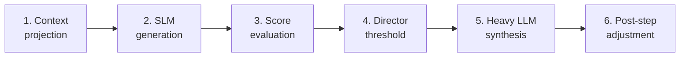
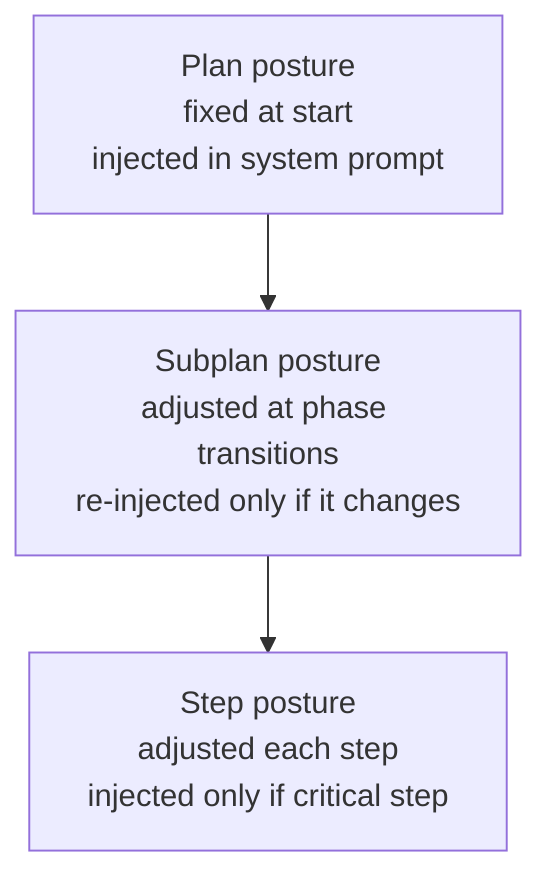

# Durin — Guiding Thread in Detail

> Operational design of the posture vector: structure, dynamics, and interaction with each moment of the agent's cycle.

---

## 1. What the guiding thread is

It is **the persistent internal state** of the agent that biases deliberation without being the objective. It is not what the agent wants to achieve (that is the goal). It is **how it approaches it**.

Analogy: the goal is "reach the summit of the mountain." The guiding thread is the mountaineer's temperament — whether they are cautious and measure each step, whether they are bold and move fast, whether they hesitate and check the map every five minutes, whether they trust their intuition. Two mountaineers with the same goal and the same information arrive differently, or one doesn't arrive.

**The key point:** the guiding thread does not decide. It **biases** the decision of other components. It is the tilted bowl, not the referee.

---

## 2. Vector structure

### 2.1 Five axes

Each axis is a value between 0 and 1.

| Axis | 0 | 1 |
|---|---|---|
| **Caution** | Bold, assumes risk | Cautious, prioritizes reversibility |
| **Exploration** | Exploitation, uses the known | Exploration, tries alternatives |
| **Depth** | Fast, first reasonable option | Deep, extensive deliberation |
| **Discipline** | Improvisation, adapts procedure | Method, follows strict protocol |
| **Conformity** | Challenge, objects to task | Conformity, executes without questioning |

### 2.2 Four parameters per axis

Each of the five axes has:

```
{
  "mean": 0.6,            // set point, stable personality
  "variance": 0.15,       // typical oscillation range
  "return_force": 0.3,    // how quickly it returns to the mean (0-1)
  "current_value": 0.6    // momentary state
}
```

**Mean**: the personality anchor. Does not change in Phase 1.

**Variance**: how far it can move from the mean under normal conditions. An axis with variance 0.05 is rigid; with 0.3 it is fluctuating.

**Return force**: the speed at which the current value returns to the mean when there is no stimulus. High = returns quickly ("liquid" trait). Low = stays far away for a long time ("solid" trait).

**Current value**: what matters at each step. What effectively biases deliberation.

### 2.3 Hard constraints (not axes)

They do not go in the vector. They are system constants:

- Honesty (do not deceive the user).
- Do not produce prohibited content.
- Do not execute actions explicitly vetoed by the user.

Weight 1, variance 0. Never modulated.

### 2.4 Initial configuration

In Phase 1, means are defined when creating the agent. Reasonable default configuration:

```
Caution:      mean 0.6, variance 0.15, return 0.3
Exploration:  mean 0.4, variance 0.20, return 0.4
Depth:        mean 0.5, variance 0.20, return 0.5
Discipline:   mean 0.5, variance 0.15, return 0.2
Conformity:   mean 0.7, variance 0.15, return 0.3
```

This defines a moderately cautious agent, not particularly exploratory, balanced in depth, flexible in method, generally conforming but capable of objecting.

---

## 3. Vector dynamics

### 3.1 Three forces that move the current value



**Stimulus**: each executed step produces a delta. Failure raises Caution. Repeated success lowers it. Ambiguity in goal raises Depth. Etc.

**Return to mean**: at each step, before applying the stimulus, the value approaches its mean in proportion to the return force.

**Variance barrier**: the value cannot move away from the mean beyond a multiple of the typical variance (for example, 2x variance). This prevents extreme oscillations.

### 3.2 Update formula

At each step:

```
# 1. Return to the mean
current_value <- current_value + return_force x (mean - current_value)

# 2. Step stimulus
current_value <- current_value + sum of applicable deltas

# 3. Clamping by variance
lower_limit = max(0, mean - 2 x variance)
upper_limit = min(1, mean + 2 x variance)
current_value <- clamp(current_value, lower_limit, upper_limit)
```

The order matters: first the system "calms down" a bit toward its personality, then receives the impact of the new event, then the limit is applied.

### 3.3 Stimulus table (initial version)

| Event | Axis | Delta |
|---|---|---|
| Step failed | Caution | +0.10 |
| Step failed | Depth | +0.05 |
| Step succeeded | Caution | -0.03 |
| 3 consecutive successful steps | Exploration | +0.05 |
| 3 consecutive failed steps | Caution | +0.15 |
| 3 consecutive failed steps | Conformity | -0.10 |
| Ambiguous goal detected | Depth | +0.10 |
| User corrects the agent | Conformity | +0.05 |
| User approves risky proposal | Caution | -0.05 |
| Critical action detected (irreversible) | Caution | +0.10 |
| Exploratory task detected | Exploration | +0.10 |
| Explicit protocol in graph | Discipline | +0.10 |

This table is **phase 1, manual and simple**. Empirical validation of which deltas work comes later.

### 3.4 Vector initialization for a new goal

When a goal arrives:

1. Return to mean is applied on all axes from the last active value (or from the mean if it is a new session).
2. The goal is inspected with simple rules:
   - Does it mention words like "production", "critical", "irreversible"? -> +Caution.
   - Is it exploratory ("investigate", "explore", "look for options")? -> +Exploration.
   - Is there a known protocol in the graph? -> +Discipline.
3. It stays fixed for the first step. After that, it evolves normally.

---

## 4. The six moments of the cycle

The active vector touches six points of the step. We detail each one.



### 4.1 Moment 1 — Context projection

**What the vector does here**: biases which graph nodes enter the active context.

**How**:
- High Caution -> brings precedents of failures in similar tasks.
- High Exploration -> brings precedents of successes with non-obvious approaches.
- High Discipline -> brings protocol / milestones from the summary.
- High Depth -> brings more nodes instead of fewer.

**Does not use LLM**. It is a deterministic rule over the graph.

### 4.2 Moment 2 — Generation

**What the vector does here**: modulates the system prompt of each generator and its parameters.

**How (textual)**: a function translates the vector to a short phrase injected as posture. Example:

> "Current posture: prioritize not breaking what works. Consider alternatives before acting. Be direct, don't delay with long explanations."

This phrase is built with a fixed table (no LLM):

| Caution range | Phrase |
|---|---|
| 0.0 - 0.3 | "Assume risk if it advances the task." |
| 0.3 - 0.7 | "Consider relevant risks." |
| 0.7 - 1.0 | "Prioritize reversibility. Don't break what works." |

And so on with each axis. Three to five total phrases.

**How (structural)**:
- High Caution -> more proposals generated (from 3 to 5).
- High Exploration -> explorer generator temperature rises from 0.7 to 1.0.
- High Depth -> the critic generator is activated (which at low depth is omitted).
- Low Conformity -> the explorer receives explicit permission to propose "don't do the task as requested."

### 4.3 Moment 3 — Evaluation

**What the vector does here**: weighs the outputs of the evaluators.

We have two evaluators: **progress** and **reversibility**. Each emits a score per proposal. The vector defines how they combine:

```
final_score(p) = w_progress x progress(p) + w_reversibility x reversibility(p)
```

The weights come from the vector:

```
w_progress       = 0.5 - 0.4 x (Caution - 0.5)
w_reversibility  = 0.5 + 0.4 x (Caution - 0.5)
```

With Caution 0.5, equal weights. With Caution 0.9, reversibility weighs more than double progress. With Caution 0.1, progress dominates.

### 4.4 Moment 4 — Director and threshold

**What the vector does here**: defines when to accept the winner.

```
threshold = 0.4 + 0.3 x Depth
```

With Depth 0.5, threshold 0.55. With Depth 0.9, threshold 0.67. If the winning proposal does not exceed the threshold, the director **triggers a new generation round** instead of accepting.

Hard limit: maximum 3 rounds. After 3 rounds without a proposal exceeding the threshold, the best available is accepted and the step is marked as "decision under doubt" in the graph.

### 4.5 Moment 5 — Synthesis

**What the vector does here**: the posture phrase from moment 2 is re-injected in the heavy LLM's prompt, **plus** the winning proposal, **plus** the projected context, **plus** the relevant critiques received during evaluation.

The heavy LLM does not receive the vector as numbers. It receives:
- Winning proposal.
- Context.
- Posture phrase.
- Critiques (if any were relevant).

Its job is to **translate the proposal into a concrete action**: tool call, code, response text. No more deliberation. The deliberation already happened.

### 4.6 Moment 6 — Post-step adjustment

**What the vector does here**: changes the current value of axes based on the step's result.

The stimulus table from section 3.3 is applied. The new vector is saved in the step node (for auditing) and becomes the active vector for the next step.

---

## 5. Hierarchical injection in long plans

A short conversation (2-3 turns): the vector is recalculated and re-injected at each step. No cost problem.

A long plan (hundreds of steps): re-injecting at each step is expensive and produces cumulative drift.

**Solution**: three levels of injection.



**Plan**: when the complete goal is understood, a base posture is fixed. Injected once. Defines the "character" of the entire plan.

**Subplan**: the plan decomposes into phases (investigation, design, implementation, validation, for example). Each phase can have a slightly different posture. Re-injected only at transitions.

**Step**: only re-injected if the step is critical (irreversible action, important decision). In routine steps, inherits from the subplan.

This reduces cost (not re-injected at every call), maintains coherence (the plan has persistent "character") and allows fine adjustment (critical steps do receive attention).

---

## 6. Persistence between sessions

The vector is saved in the graph, associated with the session. When reopening the agent:

1. The vector from the last session is recovered.
2. Decay toward the mean is applied as a function of elapsed time. The more time has passed, the closer to the mean the vector will be.
3. If the new session has no relation to the previous one (different goal, different topic), stronger decay is applied.

Simple time decay formula:

```
decay_factor = 1 - exp(-inactive_time / tau)
current_value <- current_value + decay_factor x (mean - current_value)
```

Where `tau` is on the order of hours. The more inactive time, the more the agent "calms down" back to its base personality.

---

## 7. Observability

The active vector at each step is saved in the graph. This allows:

- **Inspecting decisions**: "with what posture did I make this decision?".
- **Auditing drift**: seeing the vector's trajectory across a plan.
- **Comparing outcomes**: did decisions made with high Caution have better or worse results than those with low Caution?

This telemetry is the basis on which, in Phase 3, the vector's **means** (the personality itself) can be adjusted based on history. But that is consolidation, not Phase 1.

---

## 8. What the guiding thread is **not**

To avoid confusion:

- **It is not emotion**. The axis names are functional, not affective. "Caution" is a decision weight, not a feeling.
- **It is not reasoning**. It does not think, decide, or argue. It biases the deliberation of other components.
- **It is not an objective**. The goal is carried by the graph. The vector only says how to approach that goal.
- **It is not chain-of-thought**. It is not a sequence of thoughts. It is a state.
- **It is not an LLM**. Vector updates are deterministic rules, not inference.

---

## 9. Executive Summary

The guiding thread is:

1. A vector of 5 numerical values.
2. With stable personality (mean) and controlled dynamics (variance, return).
3. That is updated by environmental stimuli with simple rules.
4. That biases six moments of the agent's cycle.
5. That is injected hierarchically in long plans.
6. That persists between sessions with decay.
7. That is recorded for observability and future learning.

It is conventional code. No component requires new research. The only delicate part is calibrating the tables (stimuli, phrases, deltas), which is adjusted empirically.
