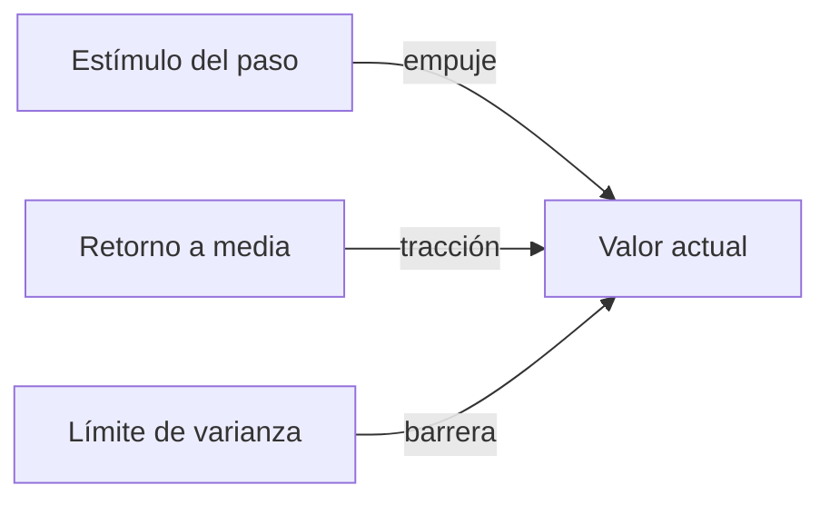
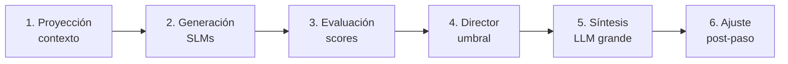
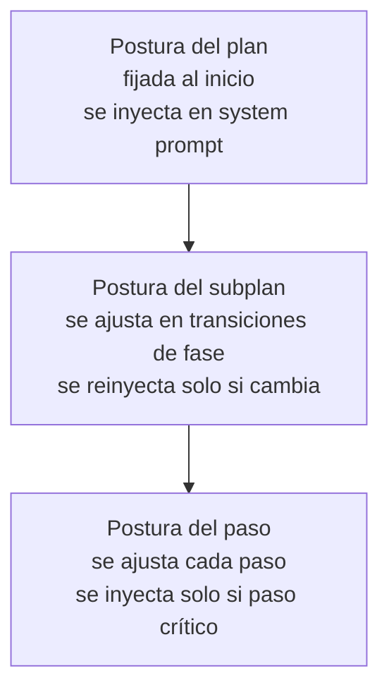

# Durin — Hilo conductor en detalle

> Diseño operativo del vector de postura: estructura, dinámica, e interacción con cada momento del ciclo del agente.

---

## 1. Qué es el hilo conductor

Es **el estado interno persistente** del agente que sesga la deliberación sin ser el objetivo. No es lo que el agente quiere lograr (eso es el goal). Es **cómo lo encara**.

Analogía: el goal es "llegar a la cima de la montaña". El hilo conductor es el temperamento del montañista — si es cauto y mide cada paso, si es audaz y va rápido, si duda y consulta el mapa cada cinco minutos, si confía en su intuición. Dos montañistas con el mismo goal y la misma información llegan distinto, o uno no llega.

**Lo importante:** el hilo conductor no decide. **Sesga** la decisión de otros componentes. Es el cuenco inclinado, no el árbitro.

---

## 2. Estructura del vector

### 2.1 Cinco ejes

Cada eje es un valor entre 0 y 1.

| Eje | 0 | 1 |
|---|---|---|
| **Cautela** | Audaz, asume riesgo | Cauteloso, prioriza reversibilidad |
| **Exploración** | Explotación, usa lo conocido | Exploración, prueba alternativas |
| **Profundidad** | Veloz, primera opción razonable | Profundo, deliberación extensa |
| **Disciplina** | Improvisación, adapta procedimiento | Método, sigue protocolo estricto |
| **Conformidad** | Desafío, objeta tarea | Conformidad, ejecuta sin cuestionar |

### 2.2 Cuatro parámetros por eje

Cada uno de los cinco ejes tiene:

```
{
  "media": 0.6,          // set point, personalidad estable
  "varianza": 0.15,      // rango típico de oscilación
  "fuerza_retorno": 0.3, // qué tan rápido vuelve a la media (0-1)
  "valor_actual": 0.6    // estado momentáneo
}
```

**Media**: el ancla de personalidad. No cambia en Fase 1.

**Varianza**: cuánto puede alejarse de la media en condiciones normales. Un eje con varianza 0.05 es rígido; con 0.3 es fluctuante.

**Fuerza de retorno**: velocidad con la que el valor actual vuelve a la media cuando no hay estímulo. Alta = vuelve rápido (rasgo "líquido"). Baja = se queda lejos por mucho tiempo (rasgo "sólido").

**Valor actual**: lo que importa en cada paso. Lo que efectivamente sesga la deliberación.

### 2.3 Restricciones duras (no son ejes)

No van al vector. Son constantes del sistema:

- Honestidad (no engañar al usuario).
- No producir contenido prohibido.
- No ejecutar acciones explícitamente vetadas por el usuario.

Peso 1, varianza 0. No se modulan nunca.

### 2.4 Configuración inicial

En Fase 1, las medias se definen al crear el agente. Configuración por defecto razonable:

```
Cautela:      media 0.6, varianza 0.15, retorno 0.3
Exploración:  media 0.4, varianza 0.20, retorno 0.4
Profundidad:  media 0.5, varianza 0.20, retorno 0.5
Disciplina:   media 0.5, varianza 0.15, retorno 0.2
Conformidad:  media 0.7, varianza 0.15, retorno 0.3
```

Esto define un agente moderadamente cauto, no especialmente explorador, balanceado en profundidad, flexible en método, generalmente conforme pero capaz de objetar.

---

## 3. Dinámica del vector

### 3.1 Tres fuerzas que mueven el valor actual



**Estímulo**: cada paso ejecutado produce un delta. Fallo sube Cautela. Éxito repetido la baja. Ambigüedad en goal sube Profundidad. Etc.

**Retorno a media**: en cada paso, antes de aplicar el estímulo, el valor se acerca a su media en proporción a la fuerza de retorno.

**Barrera de varianza**: el valor no puede alejarse de la media más allá de un múltiplo de la varianza típica (por ejemplo, 2× varianza). Esto evita oscilaciones extremas.

### 3.2 Fórmula de actualización

En cada paso:

```
# 1. Retorno a la media
valor_actual ← valor_actual + fuerza_retorno × (media − valor_actual)

# 2. Estímulo del paso
valor_actual ← valor_actual + Σ deltas_aplicables

# 3. Clamping por varianza
limite_inf = max(0, media − 2 × varianza)
limite_sup = min(1, media + 2 × varianza)
valor_actual ← clamp(valor_actual, limite_inf, limite_sup)
```

El orden importa: primero el sistema "se calma" un poco hacia su personalidad, después recibe el impacto del nuevo evento, después se aplica el límite.

### 3.3 Tabla de estímulos (versión inicial)

| Evento | Eje | Delta |
|---|---|---|
| Paso falló | Cautela | +0.10 |
| Paso falló | Profundidad | +0.05 |
| Paso exitoso | Cautela | −0.03 |
| 3 pasos exitosos seguidos | Exploración | +0.05 |
| 3 pasos fallidos seguidos | Cautela | +0.15 |
| 3 pasos fallidos seguidos | Conformidad | −0.10 |
| Goal ambiguo detectado | Profundidad | +0.10 |
| Usuario corrige al agente | Conformidad | +0.05 |
| Usuario aprueba propuesta riesgosa | Cautela | −0.05 |
| Acción crítica detectada (irreversible) | Cautela | +0.10 |
| Tarea exploratoria detectada | Exploración | +0.10 |
| Protocolo explícito en grafo | Disciplina | +0.10 |

Esta tabla es **fase 1, manual y simple**. La validación empírica de qué deltas funcionan llega después.

### 3.4 Inicialización del vector ante un goal nuevo

Cuando llega un goal:

1. Se aplica retorno a media en todos los ejes desde el último valor activo (o desde la media si es sesión nueva).
2. Se inspecciona el goal con reglas simples:
   - ¿Menciona palabras como "producción", "crítico", "irreversible"? → +Cautela.
   - ¿Es exploratorio ("investigá", "explorá", "buscá opciones")? → +Exploración.
   - ¿Hay protocolo conocido en el grafo? → +Disciplina.
3. Se queda fijado para el primer paso. Después, evoluciona normalmente.

---

## 4. Los seis momentos del ciclo

El vector activo toca seis puntos del paso. Detallamos cada uno.



### 4.1 Momento 1 — Proyección de contexto

**Qué hace el vector aquí**: sesga qué nodos del grafo entran al contexto activo.

**Cómo**:
- Cautela alta → trae precedentes de fallos en tareas similares.
- Exploración alta → trae precedentes de éxitos con enfoques no obvios.
- Disciplina alta → trae protocolo / hitos del resumen.
- Profundidad alta → trae más nodos en lugar de menos.

**No usa LLM**. Es regla determinista sobre el grafo.

### 4.2 Momento 2 — Generación

**Qué hace el vector aquí**: modula el system prompt de cada generador y sus parámetros.

**Cómo (textual)**: una función traduce el vector a una frase corta inyectada como postura. Ejemplo:

> "Postura actual: priorizá no romper lo que funciona. Considerá alternativas antes de actuar. Sé directo, no demores con explicaciones largas."

Esta frase se construye con tabla fija (no LLM):

| Rango de Cautela | Frase |
|---|---|
| 0.0 – 0.3 | "Asumí riesgo si avanza la tarea." |
| 0.3 – 0.7 | "Considerá riesgos relevantes." |
| 0.7 – 1.0 | "Priorizá reversibilidad. No rompas lo que funciona." |

Y así con cada eje. Tres a cinco frases totales.

**Cómo (estructural)**:
- Cautela alta → más propuestas generadas (de 3 a 5).
- Exploración alta → temperatura del generador explorador sube de 0.7 a 1.0.
- Profundidad alta → se activa el generador crítico (que en baja profundidad se omite).
- Conformidad baja → el explorador recibe permiso explícito para proponer "no hacer la tarea como está pedida".

### 4.3 Momento 3 — Evaluación

**Qué hace el vector aquí**: pesa las salidas de los evaluadores.

Tenemos dos evaluadores: **avance** y **reversibilidad**. Cada uno emite un score por propuesta. El vector define cómo se combinan:

```
score_final(p) = w_avance × avance(p) + w_reversibilidad × reversibilidad(p)
```

Los pesos vienen del vector:

```
w_avance         = 0.5 − 0.4 × (Cautela − 0.5)
w_reversibilidad = 0.5 + 0.4 × (Cautela − 0.5)
```

Con Cautela 0.5, pesos iguales. Con Cautela 0.9, reversibilidad pesa más del doble que avance. Con Cautela 0.1, avance domina.

### 4.4 Momento 4 — Director y umbral

**Qué hace el vector aquí**: define cuándo aceptar al ganador.

```
umbral = 0.4 + 0.3 × Profundidad
```

Con Profundidad 0.5, umbral 0.55. Con Profundidad 0.9, umbral 0.67. Si la propuesta ganadora no supera el umbral, el director **dispara una nueva ronda de generación** en lugar de aceptar.

Límite duro: máximo 3 rondas. Después de 3 rondas sin propuesta que supere umbral, se acepta la mejor disponible y se marca el paso como "decisión bajo duda" en el grafo.

### 4.5 Momento 5 — Síntesis

**Qué hace el vector aquí**: la frase de postura del momento 2 se vuelve a inyectar en el prompt del LLM pesado, **más** la propuesta ganadora, **más** el contexto proyectado, **más** las críticas relevantes recibidas durante la evaluación.

El LLM pesado no recibe el vector como números. Recibe:
- Propuesta ganadora.
- Contexto.
- Frase de postura.
- Críticas (si las hubo y son relevantes).

Su trabajo es **traducir la propuesta a acción concreta**: tool call, código, texto de respuesta. No deliberar más. La deliberación ya pasó.

### 4.6 Momento 6 — Ajuste post-paso

**Qué hace el vector aquí**: cambia el valor actual de los ejes según el resultado del paso.

Se aplica la tabla de estímulos de la sección 3.3. El nuevo vector queda guardado en el nodo del paso (para auditoría) y se vuelve el vector activo para el siguiente paso.

---

## 5. Inyección jerárquica en planes largos

Una conversación corta (2-3 turnos): el vector se recalcula y reinyecta en cada paso. No hay problema de costo.

Un plan largo (cientos de pasos): reinyectar en cada paso es caro y produce deriva acumulada.

**Solución**: tres niveles de inyección.



**Plan**: cuando se entiende el goal completo, se fija una postura base. Se inyecta una vez. Define el "carácter" del plan completo.

**Subplan**: el plan se descompone en fases (investigación, diseño, implementación, validación, por ejemplo). Cada fase puede tener postura ligeramente distinta. Se reinyecta solo en transiciones.

**Paso**: solo se reinyecta si el paso es crítico (acción irreversible, decisión importante). En pasos rutinarios, hereda del subplan.

Esto reduce el costo (no se reinyecta en cada llamada), mantiene coherencia (el plan tiene "carácter" persistente) y permite ajuste fino (los pasos críticos sí reciben atención).

---

## 6. Persistencia entre sesiones

El vector se guarda en el grafo, asociado a la sesión. Al volver a abrir el agente:

1. Se recupera el vector de la última sesión.
2. Se aplica decaimiento hacia la media en función del tiempo transcurrido. Cuanto más tiempo pasó, más cerca de la media estará el vector.
3. Si la sesión nueva no tiene relación con la anterior (goal distinto, otro tema), se aplica decaimiento más fuerte.

Fórmula simple de decaimiento por tiempo:

```
factor_decaimiento = 1 − exp(−tiempo_inactivo / tau)
valor_actual ← valor_actual + factor_decaimiento × (media − valor_actual)
```

Donde `tau` es del orden de horas. A más tiempo inactivo, el agente "se calma" de vuelta a su personalidad base.

---

## 7. Observabilidad

El vector activo en cada paso queda guardado en el grafo. Esto permite:

- **Inspeccionar decisiones**: "¿con qué postura tomé esta decisión?".
- **Auditar deriva**: ver la trayectoria del vector a lo largo de un plan.
- **Comparar outcomes**: ¿las decisiones tomadas con Cautela alta tuvieron mejor o peor resultado que las de Cautela baja?

Esta telemetría es la base sobre la cual, en Fase 3, se puede ajustar las **medias** del vector (la personalidad misma) basándose en historia. Pero eso es consolidación, no Fase 1.

---

## 8. Lo que el hilo conductor **no** es

Para evitar confusión:

- **No es emoción**. Los nombres de los ejes son funcionales, no afectivos. "Cautela" es un peso de decisión, no un sentimiento.
- **No es razonamiento**. No piensa, no decide, no argumenta. Sesga la deliberación de otros componentes.
- **No es objetivo**. El goal lo lleva el grafo. El vector solo dice cómo encarar ese goal.
- **No es chain-of-thought**. No es una secuencia de pensamientos. Es un estado.
- **No es un LLM**. La actualización del vector son reglas deterministas, no inferencia.

---

## 9. Resumen ejecutivo

El hilo conductor es:

1. Un vector de 5 valores numéricos.
2. Con personalidad estable (media) y dinámica controlada (varianza, retorno).
3. Que se actualiza por estímulos del entorno con reglas simples.
4. Que sesga seis momentos del ciclo del agente.
5. Que se inyecta jerárquicamente en planes largos.
6. Que persiste entre sesiones con decaimiento.
7. Que queda registrado para observabilidad y futuro aprendizaje.

Es código convencional. Ningún componente requiere investigación nueva. Lo único delicado es la calibración de las tablas (estímulos, frases, deltas), que se ajusta empíricamente.
