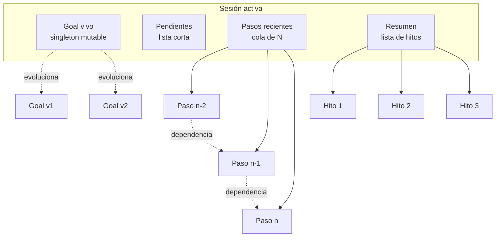
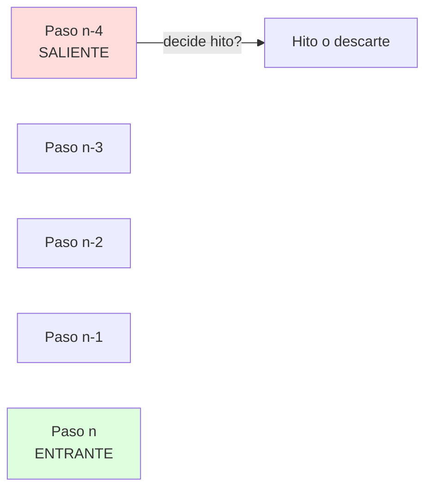
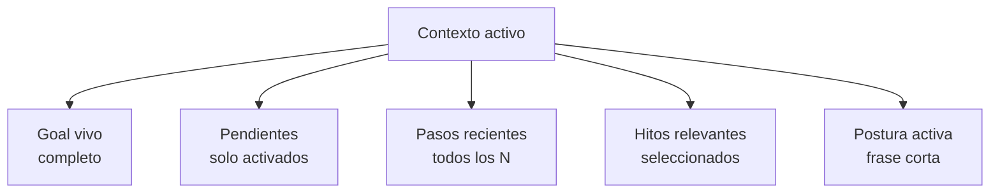
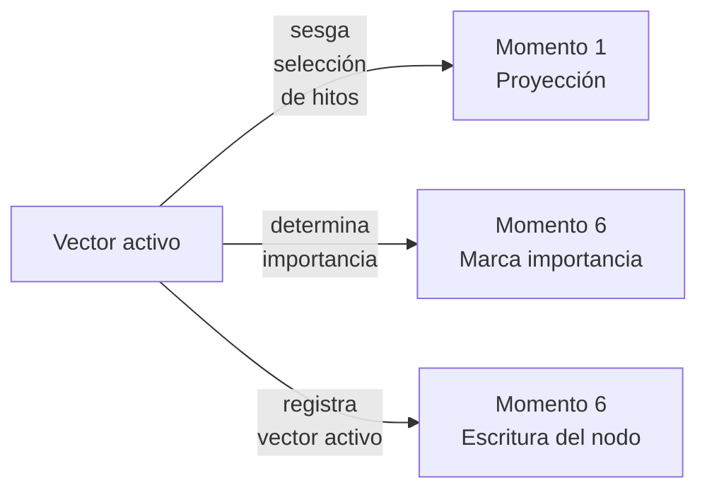

# Durin — Memoria en detalle

> Diseño operativo del sistema de memoria: estructura del grafo, esquema de nodos, proyección dinámica al contexto, y mecanismos de mantenimiento.

---

## 1. Qué resolvemos

Los agentes actuales tienen dos patologías con la memoria:

1. **El contexto es un volcado, no una proyección.** Acumulan tokens hasta estallar y compactan de emergencia. La compactación pierde lo importante porque ocurre tarde y sin criterio.
2. **La memoria es semánticamente plana.** Recuperan por similitud al paso actual, sin considerar trayectoria, dependencias entre pasos, ni el estado interno del agente.

Durin propone:

- **Memoria como grafo persistente**, con tipos de nodo claros y rol funcional.
- **Contexto como proyección dinámica** del grafo, recompuesta antes de cada paso, sesgada por la postura.
- **Compactación deliberada en cada paso**, no de emergencia.

No es base de datos vectorial con búsqueda semántica. Es un grafo con roles.

---

## 2. Inspiración biológica (corto)

Tres ideas de la neurociencia que guían el diseño:

**Foco activo limitado**: la memoria de trabajo humana sostiene 3–4 chunks. El resto es accesible bajo demanda, no presente.

**Gist reconstructivo**: lo que recordamos no es un log, es una reconstrucción desde fragmentos. Para un agente: el "resumen" del trabajo hecho no es una concatenación, es una lista de hitos.

**Memoria prospectiva**: las intenciones pendientes no ocupan foco, pero se disparan cuando aparece la señal contextual correcta.

Estas tres ideas definen tres tipos de nodo distintos.

---

## 3. Estructura del grafo

### 3.1 Vista general



### 3.2 Los cinco tipos de nodo

| Tipo | Cardinalidad | Propósito |
|---|---|---|
| **Sesión** | 1 activa | Contenedor; agrupa todo lo demás |
| **Goal vivo** | 1 por sesión, mutable | Lo que el agente persigue ahora |
| **Pendientes** | Lista corta | Intenciones latentes (memoria prospectiva) |
| **Pasos recientes** | Cola de N | Trabajo reciente con detalle completo |
| **Hitos** | Lista creciente | Resumen acumulado, gist destilado |

Cuatro tipos viven dentro de la sesión. El quinto (sesión) es el contenedor.

### 3.3 Cardinalidad y vencimiento

**Goal vivo**: uno solo. Cuando cambia, la versión anterior se guarda como histórico (no se borra). Permite reconstruir la deriva del entendimiento del problema.

**Pendientes**: máximo 10 a 15. Si la lista crece más, alguno se promociona a subgoal o se descarta. La lista se inspecciona antes de cada paso para ver si alguno se "dispara" por contexto.

**Pasos recientes**: cola FIFO. Tamaño N configurable (sugerencia inicial: N=5). Cuando entra el paso N+1, sale el más viejo. **Antes de salir**, ese paso decide si genera un hito.

**Hitos**: lista que crece pero acotada. Cada hito es una entrada compacta (1-3 frases). Si la lista pasa cierto umbral (sugerencia: 50), la consolidación periódica destila los más viejos a memoria semántica (Fase 3).

---

## 4. Esquema del nodo de paso

El nodo de paso es el centro del sistema. Todo lo demás se relaciona con él.

```yaml
PasoNode:
  id: uuid
  timestamp: datetime
  posicion_en_sesion: int

  # Contexto del paso
  goal_activo_id: ref
  vector_postura:
    cautela: float
    exploracion: float
    profundidad: float
    disciplina: float
    conformidad: float

  # Deliberación
  propuestas:
    - id: uuid
      generador: "pragmatico" | "explorador" | "critico"
      contenido: string
      scores:
        avance: float
        reversibilidad: float
      score_final: float
      gano: bool
  umbral_aplicado: float
  rondas_de_generacion: int
  marcado_decision_bajo_duda: bool

  # Ejecución
  accion_ejecutada: string
  herramientas_usadas: list
  resultado:
    estado: "exito" | "fallo" | "ambiguo"
    output: string
    error: string | null

  # Relaciones
  depende_de: list[ref a otros PasoNode]
  pendientes_creados: list[ref]
  pendientes_resueltos: list[ref]
  hito_generado: ref | null

  # Mantenimiento
  importancia: float  # 0-1, decide promoción a hito
  invalidado: bool
  razon_invalidacion: string | null
```

Tres cosas a notar:

1. **Las propuestas perdedoras se guardan**. No solo la ganadora. Esto es vital para aprendizaje contrastivo en Fase 3.
2. **El vector de postura se guarda en cada paso**. Permite auditar con qué disposición se tomó cada decisión.
3. **Las dependencias son explícitas**. "Este paso depende de aquel" es un campo, no se deduce.

---

## 5. Goal vivo

### 5.1 Estructura

```yaml
GoalVivo:
  contenido: string
  version: int
  versiones_anteriores: list[GoalVivo]
  criterios_completitud: list[string]
  estado: "activo" | "completado" | "abandonado"
```

### 5.2 Cuándo se reescribe

El goal se reescribe cuando:

- El usuario aporta información que refina el objetivo ("ah, también quiero que…").
- Un paso revela algo que cambia el alcance ("para hacer X primero hay que Y").
- El agente descubre que el goal original era ambiguo y propone una interpretación más precisa.

Cada reescritura guarda la versión anterior. El log de versiones es información valiosa.

### 5.3 Criterios de completitud

El goal vivo no es solo texto. Tiene una lista explícita de criterios. Ejemplo:

> Goal: "Migrar la base de datos a Postgres"
> Criterios:
> - Schema replicado y validado
> - Datos transferidos sin pérdida
> - Tests pasan contra la nueva base
> - Rollback documentado

El agente sabe que terminó cuando todos los criterios están marcados.

---

## 6. Pendientes (memoria prospectiva)

### 6.1 Estructura

```yaml
Pendiente:
  contenido: string
  origen: ref a PasoNode  # qué paso lo creó
  disparador: string  # condición que lo activa
  prioridad: "baja" | "media" | "alta"
  fecha_creacion: datetime
  vencimiento: datetime | null
  estado: "latente" | "activo" | "resuelto" | "descartado"
```

### 6.2 Cómo se disparan

Antes de cada paso, el orquestador revisa pendientes latentes y chequea si alguno se activa:

- **Por condición lógica**: "cuando termine el paso de validación, recordá actualizar la documentación".
- **Por similitud temática**: el paso actual menciona algo relacionado a un pendiente latente.
- **Por tiempo**: vencimiento próximo.

Los activados se inyectan en el contexto. Los demás siguen latentes.

### 6.3 Por qué no son sub-goals

Un pendiente no es parte del goal principal. Es una intención que apareció **durante** el trabajo y no se atiende ahora pero no se quiere perder. Si un pendiente crece en importancia, se promociona a subgoal explícito.

---

## 7. Pasos recientes (cola FIFO)

### 7.1 Cómo funciona la cola



Cuando entra un paso nuevo, sale el más viejo. **Antes de salir**, se decide si merece convertirse en hito.

### 7.2 Decisión de promoción a hito

El paso saliente se evalúa por importancia (campo del nodo). La importancia se asigna al cerrarse el paso, basada en:

- **¿Fue exitoso o falló?** Los fallos suelen ser más importantes para recordar que los éxitos.
- **¿Tuvo decisión bajo duda?** Importante.
- **¿Cambió el goal?** Muy importante.
- **¿Creó pendientes?** Importante.
- **¿Tocó algo crítico (acción irreversible)?** Importante.

Si la importancia supera un umbral (sugerencia inicial: 0.6), se genera un hito. El paso completo se mantiene accesible (no se borra), pero ya no ocupa la cola de recientes.

Si no supera el umbral, el paso pasa a "histórico no-destacado" y se accede solo bajo búsqueda explícita.

---

## 8. Hitos (resumen acumulado)

### 8.1 Estructura

```yaml
Hito:
  contenido: string  # 1-3 frases, gist del paso
  paso_origen: ref a PasoNode
  tipo: "decision" | "fallo" | "logro" | "cambio_goal" | "alerta"
  importancia: float
  timestamp: datetime
```

### 8.2 Cómo se redacta

El hito **no es un resumen del paso**. Es un **gist**: la esencia para recordar después.

Mal:
> "El paso ejecutó una migración de schema parcial y encontró 3 errores de tipo en columnas X, Y, Z. El usuario aprobó continuar con casteos explícitos."

Bien (hito):
> "Migración parcial requirió casteos explícitos en columnas con tipos incompatibles. Usuario aprobó."

La redacción la hace una llamada chica a un SLM con prompt fijo: "Resumí este paso en 1-3 frases, capturando solo lo que sería útil recordar después".

### 8.3 Tipos de hito

Distinguir tipos sirve para proyección posterior:

- **decision**: "elegí X sobre Y por motivo Z".
- **fallo**: "intentar X falló por motivo Y".
- **logro**: "completé X".
- **cambio_goal**: "el objetivo se refinó de X a Y".
- **alerta**: "descubrí que Z es un riesgo".

Cuando el contexto se proyecta, se pueden traer hitos filtrados por tipo según la postura activa.

---

## 9. Proyección dinámica al contexto

### 9.1 El problema

El grafo crece. El contexto que recibe el LLM es limitado. ¿Qué traemos en cada paso?

La respuesta convencional es "los nodos más similares semánticamente al paso actual". Esto es lo que hacen los frameworks actuales y es lo que queremos mejorar.

### 9.2 La regla de proyección

En cada paso, antes de generar, se arma el **contexto activo**. La composición:



**Goal vivo**: siempre completo. Texto + criterios + versión actual.

**Pendientes activados**: solo los que dispararon en esta iteración.

**Pasos recientes**: los N de la cola, completos.

**Hitos relevantes**: este es el momento donde el vector de postura sesga. Veremos cómo.

**Postura activa**: la frase corta derivada del vector.

### 9.3 Selección de hitos según postura

No traemos todos los hitos. Seleccionamos según:

**Criterio base (siempre activo)**: similitud temática al paso actual. Embeddings + k-NN sobre los hitos.

**Sesgo por postura**:

| Postura | Cómo sesga la selección de hitos |
|---|---|
| Cautela alta | Prioriza hitos tipo `fallo` y `alerta` |
| Cautela baja | Prioriza hitos tipo `logro` y `decision` |
| Exploración alta | Trae hitos diversos (anti-similitud parcial) |
| Exploración baja | Trae hitos de patrones repetidos |
| Profundidad alta | Trae más hitos (8-12) en lugar de menos (3-5) |
| Disciplina alta | Trae hitos tipo `decision` con procedimiento |
| Conformidad baja | Trae hitos tipo `alerta` y `cambio_goal` |

Esto es lo que hace que el contexto sea **dinámico**: la misma pregunta, con distinta postura, recibe distinto contexto.

### 9.4 Tamaño del contexto

El contexto activo está acotado por diseño, no por compactación. Presupuesto sugerido (tokens):

- Goal vivo: 200
- Pendientes activos: 200
- Pasos recientes (N=5): 1500
- Hitos seleccionados (5-10): 800
- Postura: 100
- **Total**: ~2800 tokens

El LLM grande de síntesis recibe esto + la propuesta ganadora + las críticas relevantes. Muy lejos de saturar incluso modelos con ventanas chicas.

---

## 10. Mantenimiento del grafo

### 10.1 Decaimiento de importancia

Cada nodo tiene un campo `importancia` (0-1). Con el tiempo, decae:

```
importancia ← importancia × exp(−tiempo_desde_creacion / tau)
```

Donde `tau` es del orden de días. Esto no borra nada; solo baja la prioridad. Nodos muy viejos quedan disponibles pero no llegan al contexto automáticamente.

Excepción: los hitos tipo `alerta` decaen mucho más lento (o no decaen). Las alertas son aprendizajes duros que el agente no quiere olvidar.

### 10.2 Invalidación

Distinto a decaer: cuando algo deja de ser cierto, se **invalida**. El nodo queda con `invalidado: true` y razón. No se borra (auditoría).

Casos de invalidación:

- Un paso revela que un hito anterior era incorrecto.
- El goal cambia y hitos del goal anterior dejan de aplicar.
- El usuario corrige una asunción que estaba reflejada en hitos.

Los nodos invalidados no entran al contexto por defecto. Solo entran si una búsqueda explícita los pide.

Inspiración: Graphiti hace exactamente esto con hechos de conversación. Acá lo extendemos a pasos y hitos.

### 10.3 Consolidación periódica (Fase 3, mencionada para completitud)

En Fase 3, un proceso fuera de línea revisa el grafo:

- Hitos viejos con baja importancia se compactan en patrones semánticos.
- Hitos similares se fusionan.
- Se intenta extraer patrones contrastivos (éxito vs fallo).

Esto produce **memoria semántica**: no episodios sino reglas generalizadas. Ejemplo: en lugar de 30 hitos sobre fallos de migración, un patrón "migraciones con conversión de tipos requieren validación previa".

Fuera del alcance de Fase 1.

---

## 11. Persistencia

Tecnología recomendada para Fase 1 (intercambiable):

- **Almacén principal**: grafo con propiedades (Neo4j, FalkorDB, o incluso SQLite con relaciones explícitas para empezar).
- **Embeddings para hitos**: índice vectorial pequeño (FAISS local, o pgvector si ya usás Postgres).
- **No hace falta** vectorial gigante. Los hitos son cientos a miles, no millones.

Lo importante no es la tecnología sino el esquema.

---

## 12. Cómo se integra con el hilo conductor

Recordar los seis momentos del ciclo donde la postura actúa. **Tres de ellos involucran directamente al grafo**:



**Momento 1 (proyección)**: el vector sesga qué hitos traemos. Detallado en sección 9.3.

**Momento 6a (marca de importancia)**: al cerrar el paso, el vector influencia el cálculo de importancia. Por ejemplo, en alta Cautela, los fallos reciben más importancia que en baja Cautela.

**Momento 6b (escritura)**: el vector activo en ese paso se guarda en el nodo. Es parte del registro, para auditoría y aprendizaje futuro.

La memoria y el hilo conductor son piezas separables pero **acopladas operativamente**. Por eso ambas son MVP — sin la otra, cada una vale menos.

---

## 13. Resumen ejecutivo

El sistema de memoria de Durin es:

1. **Un grafo**, no un volcado lineal. Con cinco tipos de nodo (sesión, goal, pendientes, pasos, hitos).
2. **Cada nodo tiene rol funcional**, no es solo un blob de texto.
3. **Cada paso guarda su vector de postura activa**, sus propuestas (ganadora y descartes), y sus dependencias.
4. **El contexto se proyecta dinámicamente** en cada paso, sesgado por la postura. No se compacta de emergencia.
5. **La compactación es deliberada y por paso**: al salir de la cola de recientes, cada paso decide si genera hito.
6. **El mantenimiento es activo**: decaimiento, invalidación, y a futuro consolidación.

Es ingeniería convencional sobre un esquema claro. Lo no convencional está en dos lugares específicos:

- **La proyección dinámica sesgada por postura** (sección 9.3).
- **El registro del vector de postura en cada paso** (sección 4).

Esos dos puntos son los que distinguen este sistema de cualquier RAG con memoria vectorial.
