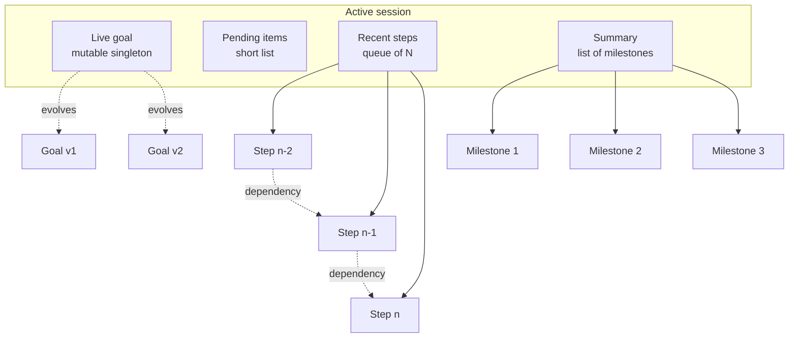
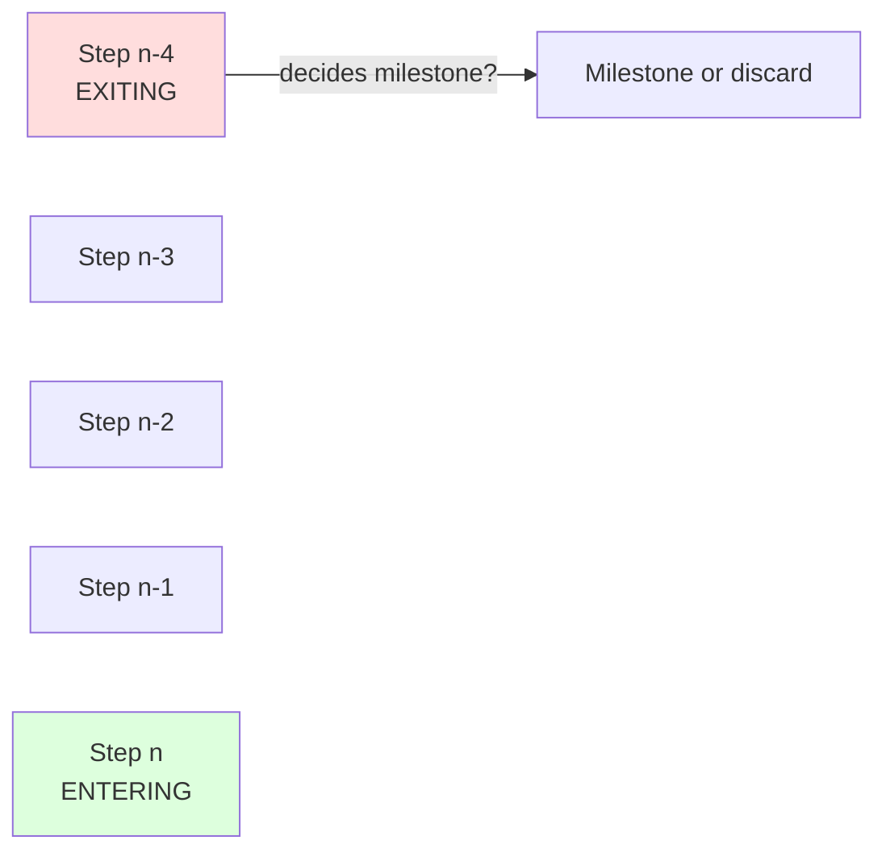
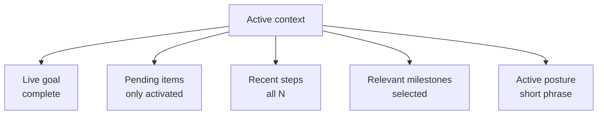
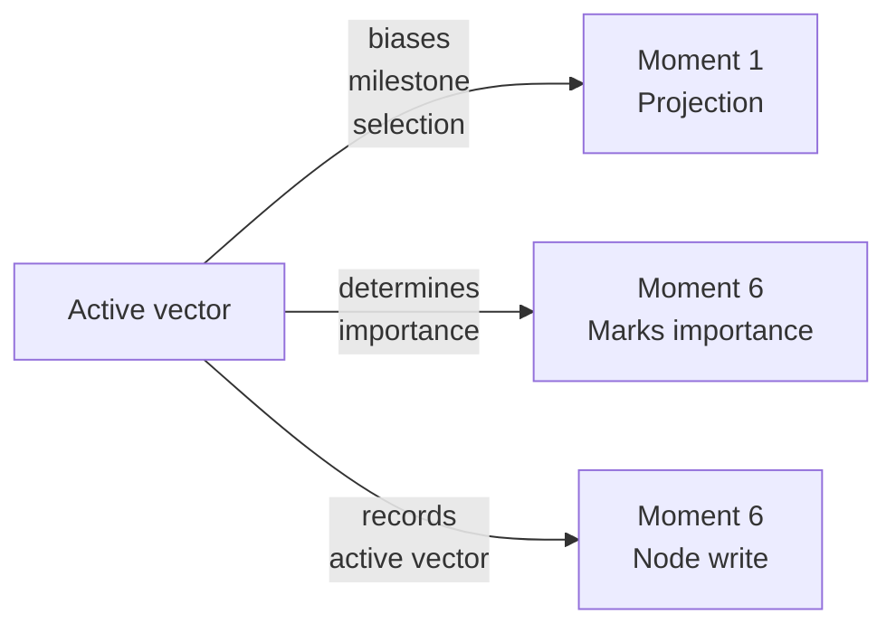

# Durin — Memory in Detail

> Operational design of the memory system: graph structure, node schema, dynamic projection to context, and maintenance mechanisms.

---

## 1. What we solve

Current agents have two pathologies with memory:

1. **Context is a dump, not a projection.** They accumulate tokens until they burst and perform emergency compaction. Compaction loses what's important because it occurs late and without criteria.
2. **Memory is semantically flat.** They retrieve by similarity to the current step, without considering trajectory, dependencies between steps, or the agent's internal state.

Durin proposes:

- **Memory as a persistent graph**, with clear node types and functional roles.
- **Context as a dynamic projection** of the graph, recomposed before each step, biased by posture.
- **Deliberate compaction at each step**, not emergency compaction.

It is not a vector database with semantic search. It is a graph with roles.

---

## 2. Biological inspiration (brief)

Three neuroscience ideas that guide the design:

**Limited active focus**: human working memory sustains 3-4 chunks. The rest is accessible on demand, not present.

**Reconstructive gist**: what we remember is not a log, it is a reconstruction from fragments. For an agent: the "summary" of work done is not a concatenation, it is a list of milestones.

**Prospective memory**: pending intentions do not occupy focus, but fire when the correct contextual cue appears.

These three ideas define three distinct node types.

---

## 3. Graph structure

### 3.1 General view



### 3.2 The five node types

| Type | Cardinality | Purpose |
|---|---|---|
| **Session** | 1 active | Container; groups everything else |
| **Live goal** | 1 per session, mutable | What the agent pursues now |
| **Pending items** | Short list | Latent intentions (prospective memory) |
| **Recent steps** | Queue of N | Recent work with full detail |
| **Milestones** | Growing list | Accumulated summary, distilled gist |

Four types live within the session. The fifth (session) is the container.

### 3.3 Cardinality and expiration

**Live goal**: only one. When it changes, the previous version is saved as history (not deleted). Allows reconstructing the drift of problem understanding.

**Pending items**: maximum 10 to 15. If the list grows beyond that, some are promoted to explicit subgoal or discarded. The list is inspected before each step to see if any "fires" by context.

**Recent steps**: FIFO queue. Configurable size N (initial suggestion: N=5). When step N+1 enters, the oldest exits. **Before exiting**, that step decides whether it generates a milestone.

**Milestones**: growing but bounded list. Each milestone is a compact entry (1-3 sentences). If the list passes a certain threshold (suggestion: 50), periodic consolidation distills the oldest ones into semantic memory (Phase 3).

---

## 4. Step node schema

The step node is the center of the system. Everything else relates to it.

```yaml
StepNode:
  id: uuid
  timestamp: datetime
  position_in_session: int

  # Step context
  active_goal_id: ref
  posture_vector:
    caution: float
    exploration: float
    depth: float
    discipline: float
    conformity: float

  # Deliberation
  proposals:
    - id: uuid
      generator: "pragmatic" | "explorer" | "critic"
      content: string
      scores:
        progress: float
        reversibility: float
      final_score: float
      won: bool
  applied_threshold: float
  generation_rounds: int
  marked_decision_under_doubt: bool

  # Execution
  executed_action: string
  tools_used: list
  result:
    state: "success" | "failure" | "ambiguous"
    output: string
    error: string | null

  # Relationships
  depends_on: list[ref to other StepNodes]
  pending_items_created: list[ref]
  pending_items_resolved: list[ref]
  milestone_generated: ref | null

  # Maintenance
  importance: float  # 0-1, decides promotion to milestone
  invalidated: bool
  invalidation_reason: string | null
```

Three things to note:

1. **Losing proposals are saved**. Not just the winner. This is vital for contrastive learning in Phase 3.
2. **The posture vector is saved at each step**. Allows auditing with what disposition each decision was made.
3. **Dependencies are explicit**. "This step depends on that one" is a field, not deduced.

---

## 5. Live goal

### 5.1 Structure

```yaml
LiveGoal:
  content: string
  version: int
  previous_versions: list[LiveGoal]
  completion_criteria: list[string]
  state: "active" | "completed" | "abandoned"
```

### 5.2 When it is rewritten

The goal is rewritten when:

- The user provides information that refines the objective ("oh, I also want it to...").
- A step reveals something that changes the scope ("to do X, first we need Y").
- The agent discovers that the original goal was ambiguous and proposes a more precise interpretation.

Each rewrite saves the previous version. The version log is valuable information.

### 5.3 Completion criteria

The live goal is not just text. It has an explicit list of criteria. Example:

> Goal: "Migrate the database to Postgres"
> Criteria:
> - Schema replicated and validated
> - Data transferred without loss
> - Tests pass against the new database
> - Rollback documented

The agent knows it is done when all criteria are checked off.

---

## 6. Pending items (prospective memory)

### 6.1 Structure

```yaml
PendingItem:
  content: string
  origin: ref to StepNode  # which step created it
  trigger: string  # condition that activates it
  priority: "low" | "medium" | "high"
  creation_date: datetime
  expiration: datetime | null
  state: "latent" | "active" | "resolved" | "discarded"
```

### 6.2 How they fire

Before each step, the orchestrator reviews latent pending items and checks if any activate:

- **By logical condition**: "when the validation step finishes, remember to update the documentation."
- **By thematic similarity**: the current step mentions something related to a latent pending item.
- **By time**: approaching expiration.

Activated items are injected into the context. The rest remain latent.

### 6.3 Why they are not sub-goals

A pending item is not part of the main goal. It is an intention that appeared **during** work and is not attended to now but should not be lost. If a pending item grows in importance, it is promoted to an explicit subgoal.

---

## 7. Recent steps (FIFO queue)

### 7.1 How the queue works



When a new step enters, the oldest exits. **Before exiting**, it is decided whether it deserves to become a milestone.

### 7.2 Milestone promotion decision

The exiting step is evaluated by importance (node field). Importance is assigned when the step closes, based on:

- **Did it succeed or fail?** Failures are usually more important to remember than successes.
- **Did it have a decision under doubt?** Important.
- **Did it change the goal?** Very important.
- **Did it create pending items?** Important.
- **Did it touch something critical (irreversible action)?** Important.

If importance exceeds a threshold (initial suggestion: 0.6), a milestone is generated. The complete step remains accessible (not deleted), but it no longer occupies the recent queue.

If it does not exceed the threshold, the step goes to "non-highlighted history" and is accessed only by explicit search.

---

## 8. Milestones (accumulated summary)

### 8.1 Structure

```yaml
Milestone:
  content: string  # 1-3 sentences, gist of the step
  source_step: ref to StepNode
  type: "decision" | "failure" | "achievement" | "goal_change" | "alert"
  importance: float
  timestamp: datetime
```

### 8.2 How it is drafted

The milestone **is not a step summary**. It is a **gist**: the essence to remember later.

Bad:
> "The step executed a partial schema migration and found 3 type errors in columns X, Y, Z. The user approved continuing with explicit casts."

Good (milestone):
> "Partial migration required explicit casts on columns with incompatible types. User approved."

The drafting is done by a small SLM call with a fixed prompt: "Summarize this step in 1-3 sentences, capturing only what would be useful to remember later."

### 8.3 Milestone types

Distinguishing types is useful for later projection:

- **decision**: "chose X over Y for reason Z."
- **failure**: "attempting X failed for reason Y."
- **achievement**: "completed X."
- **goal_change**: "the objective was refined from X to Y."
- **alert**: "discovered that Z is a risk."

When context is projected, milestones can be brought filtered by type according to the active posture.

---

## 9. Dynamic projection to context

### 9.1 The problem

The graph grows. The context the LLM receives is limited. What do we bring at each step?

The conventional answer is "the nodes most semantically similar to the current step." This is what current frameworks do and what we want to improve.

### 9.2 The projection rule

At each step, before generating, the **active context** is assembled. Its composition:



**Live goal**: always complete. Text + criteria + current version.

**Activated pending items**: only those that fired in this iteration.

**Recent steps**: all N from the queue, complete.

**Relevant milestones**: this is the moment where the posture vector biases. We will see how.

**Active posture**: the short phrase derived from the vector.

### 9.3 Milestone selection by posture

We do not bring all milestones. We select based on:

**Base criterion (always active)**: thematic similarity to the current step. Embeddings + k-NN over milestones.

**Posture bias**:

| Posture | How it biases milestone selection |
|---|---|
| High Caution | Prioritizes milestones of type `failure` and `alert` |
| Low Caution | Prioritizes milestones of type `achievement` and `decision` |
| High Exploration | Brings diverse milestones (partial anti-similarity) |
| Low Exploration | Brings milestones of repeated patterns |
| High Depth | Brings more milestones (8-12) instead of fewer (3-5) |
| High Discipline | Brings milestones of type `decision` with procedure |
| Low Conformity | Brings milestones of type `alert` and `goal_change` |

This is what makes the context **dynamic**: the same question, with a different posture, receives different context.

### 9.4 Context size

The active context is bounded by design, not by compaction. Suggested budget (tokens):

- Live goal: 200
- Active pending items: 200
- Recent steps (N=5): 1500
- Selected milestones (5-10): 800
- Posture: 100
- **Total**: ~2800 tokens

The synthesis heavy LLM receives this + the winning proposal + relevant critiques. Far from saturating even models with small windows.

---

## 10. Graph maintenance

### 10.1 Importance decay

Each node has an `importance` field (0-1). Over time, it decays:

```
importance <- importance x exp(-time_since_creation / tau)
```

Where `tau` is on the order of days. This does not delete anything; it only lowers priority. Very old nodes remain available but do not reach the context automatically.

Exception: milestones of type `alert` decay much more slowly (or do not decay). Alerts are hard-won learnings that the agent does not want to forget.

### 10.2 Invalidation

Different from decaying: when something ceases to be true, it is **invalidated**. The node is left with `invalidated: true` and a reason. It is not deleted (auditing).

Invalidation cases:

- A step reveals that a previous milestone was incorrect.
- The goal changes and milestones from the previous goal no longer apply.
- The user corrects an assumption that was reflected in milestones.

Invalidated nodes do not enter the context by default. They only enter if an explicit search requests them.

Inspiration: Graphiti does exactly this with conversation facts. Here we extend it to steps and milestones.

### 10.3 Periodic consolidation (Phase 3, mentioned for completeness)

In Phase 3, an offline process reviews the graph:

- Old milestones with low importance are compacted into semantic patterns.
- Similar milestones are merged.
- It attempts to extract contrastive patterns (success vs failure).

This produces **semantic memory**: not episodes but generalized rules. Example: instead of 30 milestones about migration failures, a pattern "migrations with type conversion require prior validation."

Outside the scope of Phase 1.

---

## 11. Persistence

Recommended technology for Phase 1 (interchangeable):

- **Main store**: property graph (Neo4j, FalkorDB, or even SQLite with explicit relationships to start).
- **Embeddings for milestones**: small vector index (local FAISS, or pgvector if already using Postgres).
- **No need** for a giant vector store. Milestones are hundreds to thousands, not millions.

What matters is not the technology but the schema.

---

## 12. How it integrates with the guiding thread

Recall the six moments of the cycle where posture acts. **Three of them directly involve the graph**:



**Moment 1 (projection)**: the vector biases which milestones we bring. Detailed in section 9.3.

**Moment 6a (importance marking)**: when closing the step, the vector influences the importance calculation. For example, at high Caution, failures receive more importance than at low Caution.

**Moment 6b (write)**: the active vector at that step is saved in the node. It is part of the record, for auditing and future learning.

Memory and the guiding thread are separable pieces but **operationally coupled**. That is why both are MVP — without the other, each is worth less.

---

## 13. Executive Summary

Durin's memory system is:

1. **A graph**, not a linear dump. With five node types (session, goal, pending items, steps, milestones).
2. **Each node has a functional role**, it is not just a text blob.
3. **Each step saves its active posture vector**, its proposals (winner and discards), and its dependencies.
4. **Context is dynamically projected** at each step, biased by posture. It is not emergency-compacted.
5. **Compaction is deliberate and per-step**: upon leaving the recent queue, each step decides whether to generate a milestone.
6. **Maintenance is active**: decay, invalidation, and future consolidation.

It is conventional engineering over a clear schema. The unconventional part is in two specific places:

- **Dynamic projection biased by posture** (section 9.3).
- **Recording the posture vector at each step** (section 4).

Those two points are what distinguish this system from any RAG with vector memory.
