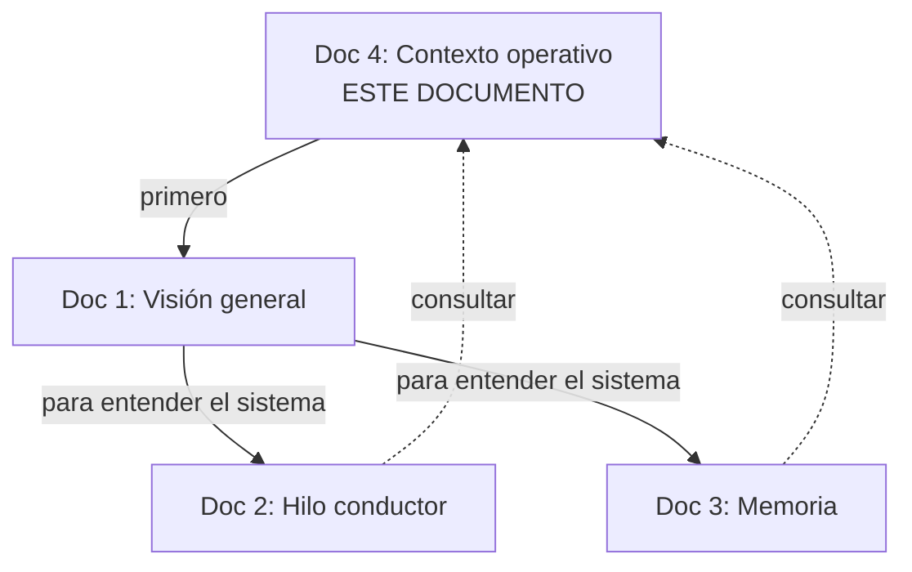

# Durin — Contexto operativo

> Este documento existe para que un agente (humano o AI) pueda operar sobre el proyecto Durin sin reconstruir el camino. Contiene lo que los tres documentos técnicos asumen como dado.

> **Leer este documento antes de los otros tres.**

---

## 1. Resumen en cinco líneas

Durin es un agente de trabajo con dos diferenciadores: un **vector de postura persistente** (hilo conductor) que sesga toda la deliberación, y una **memoria como grafo** con proyección dinámica al contexto. El objetivo no es super-inteligencia ni conciencia: es **mejorar el manejo de contexto y el seguimiento de objetivos**. Lo que diferencia este sistema de cualquier otro agente con memoria es que la memoria y el carácter del agente están acoplados: la postura sesga qué se recuerda y cómo se piensa, no solo cómo se responde. El stack técnico es intercambiable; lo que importa es la arquitectura.

---

## 2. Qué es y qué no es

**Durin es:**
- Un agente con carácter estable entre tareas.
- Un sistema de memoria con roles funcionales.
- Una arquitectura sobre LLMs, no un modelo nuevo.
- Código convencional con piezas deterministas y piezas con LLMs.

**Durin no es:**
- Una AGI ni un intento de conciencia.
- Un framework genérico de agentes.
- Un wrapper de RAG.
- Un sistema de "emociones" en sentido afectivo.
- Un competidor de Letta, AutoGen o LangGraph; opera en un nivel distinto.

---

## 3. Glosario de términos propios

| Término | Significado en Durin |
|---|---|
| **Hilo conductor** | Vector de 5 valores que representa la postura/disposición del agente. Persiste entre pasos. |
| **Postura** | Sinónimo operativo de hilo conductor. Es el estado, no una decisión. |
| **Eje** | Cada una de las 5 dimensiones del vector (Cautela, Exploración, Profundidad, Disciplina, Conformidad). |
| **Media** | Set point estable de un eje. Define la personalidad del agente. |
| **Varianza típica** | Cuánto se mueve normalmente un eje respecto a su media. Parte de la personalidad. |
| **Fuerza de retorno** | Velocidad con la que un eje vuelve a la media cuando cesa el estímulo. |
| **Valor actual** | El estado momentáneo de un eje. Lo que efectivamente sesga la deliberación en este paso. |
| **Estímulo** | Evento del paso que produce delta en uno o más ejes (fallo, éxito, ambigüedad, etc.). |
| **Director** | Función pura (no LLM) que combina scores y elige la propuesta ganadora. |
| **Generadores** | SLMs (pragmático, explorador, crítico) que producen propuestas en paralelo. |
| **Evaluadores** | Funciones que puntúan cada propuesta en un eje (avance, reversibilidad). |
| **Sintetizador** | LLM pesado que traduce la propuesta ganadora a acción concreta. |
| **Goal vivo** | El objetivo activo, mutable, con criterios de completitud explícitos. |
| **Pendiente** | Intención latente (memoria prospectiva) que se dispara por contexto. |
| **Paso** | Una iteración completa del ciclo: deliberación + ejecución + escritura. |
| **Hito** | Entrada compacta del resumen acumulado. Gist de un paso importante. |
| **Gist** | Resumen reconstructivo (no copia comprimida). 1-3 frases con la esencia. |
| **Proyección dinámica** | Selección de qué nodos del grafo entran al contexto en cada paso, sesgada por la postura. |
| **Inyección jerárquica** | Estrategia para planes largos: postura del plan / subplan / paso. |
| **Decisión bajo duda** | Paso aceptado tras agotar rondas sin superar umbral. Se marca en el grafo. |
| **Invalidación** | Marca de "ya no es cierto" en un nodo. No se borra, se desactiva. |
| **Consolidación** | Proceso periódico (Fase 3) que destila patrones del grafo episódico. |

---

## 4. Filosofía operativa

Estas son las anclas conceptuales del proyecto. Si una decisión de diseño futura las contradice, hay que defender el cambio explícitamente.

**El director no decide, filtra.**
No hay un LLM eligiendo entre opciones. Hay una función determinista que combina scores ponderados por la postura. La inteligencia emerge de la competencia con sesgo, no de un árbitro inteligente.

**El hilo conductor es estado, no decisión.**
La postura no se "calcula" cada paso desde cero. Vive entre pasos. Se actualiza por estímulos y se trae de vuelta por homeostasis. Es lo que crea continuidad de identidad.

**Lo que define entidad es la continuidad de estado interno, no la memoria de hechos.**
Dos agentes con el mismo grafo pero distinto vector activo se comportan distinto. La memoria es la biblioteca; la postura es quién la consulta.

**El LLM grande no delibera, traduce.**
Para cuando llega al sintetizador, la decisión ya está tomada. Su rol es convertir la propuesta ganadora en acción concreta. Si delibera, su sesgo pisa al resto.

**La diversidad la dan los prompts y las posturas, no los modelos.**
Tres generadores con el mismo modelo y prompts distintos pueden dar más diversidad que tres modelos distintos con el mismo prompt. El valor está en las posturas configuradas, no en el zoo de modelos.

**La memoria reconstruye, no recupera.**
El gist no es una copia comprimida. Es una síntesis hecha en el momento desde fragmentos. Por eso los hitos son 1-3 frases redactadas, no concatenaciones.

**La compactación es deliberada y por paso, no de emergencia.**
Cuando un paso sale de la cola de recientes, decide si genera hito. Es una decisión informada, no una compresión bajo presión.

**El stack técnico es irrelevante a la arquitectura.**
Qué SLM, qué base de datos, qué orquestador — cambian cada mes. La arquitectura (qué hace cada componente, cómo se conectan, qué se persiste) es lo que define al proyecto.

**No buscamos super-inteligencia.**
El objetivo es manejo de contexto y seguimiento de goal. Cualquier característica que se justifique con "es más inteligente" sin métrica concreta de manejo de contexto o seguimiento de goal debe revisarse.

---

## 5. Decisiones tomadas y descartadas

### 5.1 Tomadas (en orden cronológico aproximado)

| # | Decisión | Razón |
|---|---|---|
| 1 | Construir, no integrar herramientas existentes (Letta, etc.) | Lock-in arquitectónico y deuda técnica heredada |
| 2 | Dominio generalista (no especializado) | Validación más amplia del diseño |
| 3 | Vector de 5 ejes (no 3, no 10) | Big Five validado empíricamente |
| 4 | Honestidad como restricción dura, fuera del vector | No se modula nunca, peso fijo |
| 5 | Una sola personalidad por agente | Simplicidad en Fase 1 |
| 6 | Cada paso ajusta valor actual, no medias | Medias se ajustan en Fase 3 con consolidación |
| 7 | Tres generadores con SLMs (pragmático, explorador, crítico) | Mínimo para diversidad real sin costo excesivo |
| 8 | Dos evaluadores en ejes opuestos (avance, reversibilidad) | Un solo evaluador solo frena; necesitamos tensión |
| 9 | Director como función pura, sin LLM | Evita que el árbitro pise con su propio sesgo |
| 10 | Memoria como grafo con 5 tipos de nodo | Roles funcionales claros, no soup vectorial |
| 11 | Contexto como proyección dinámica, no volcado | Resuelve compactación de emergencia |
| 12 | Inyección jerárquica en planes largos | Reduce costo y deriva acumulada |
| 13 | Persistencia del vector entre sesiones con decaimiento | Continuidad de identidad sin rigidez |
| 14 | Guardar propuestas perdedoras en cada paso | Necesario para aprendizaje contrastivo (Fase 3) |
| 15 | Guardar vector activo en cada paso | Auditoría y telemetría |

### 5.2 Descartadas o pospuestas

| Decisión rechazada | Razón |
|---|---|
| Usar Letta como base | Lock-in: el agente vive dentro de su runtime |
| Usar solo un eje (reversibilidad) | Solo frena, no avanza. Agente paralizado |
| LLM grande como director / juez | Pisa con su sesgo. Por eso se usa función pura |
| Algoritmos evolutivos (Mind Evolution style) en Fase 1 | Necesitás medir baseline antes de optimizar variación |
| Múltiples personalidades configurables | Complejidad sin valor inmediato |
| Modificar medias del vector en Fase 1 | Necesitás historia suficiente para hacerlo bien |
| Modelar emociones (Plutchik, VAD, etc.) | Lenguaje confuso; "postura" es más operativo |
| Eje de Extraversión | Irrelevante para agente sin presencia social |
| Eje de Neuroticism | Ruido para agente sin emoción real |
| Eje de Persistencia/Flexibilidad | Emerge de combinaciones de otros ejes |
| Eje de Autonomía/Consulta | Interfaz, no rasgo |
| Eje de Reactividad afectiva | Solapado con persistencia, no aporta |
| SLM clasificador como paso 1 del flujo | Overkill; reglas heurísticas alcanzan |
| Memoria conversacional plana (RAG vectorial) | No captura trayectoria ni dependencias |

---

## 6. Anti-patrones

Cosas que parecen mejoras pero rompen el diseño. Si surgen en discusión, hay que reconocerlas.

### 6.1 Convertir el director en un LLM "más inteligente"

**Tentación**: "¿y si el director razona sobre las propuestas en lugar de solo sumar scores?"
**Por qué rompe**: el LLM en posición de juez pisa con su sesgo todas las opciones. Pierde la diversidad ganada en la generación.
**Solución correcta**: si las decisiones son demasiado simples, agregar más evaluadores (más ejes de score), no agregar inteligencia al director.

### 6.2 Hacer que el crítico vete propuestas

**Tentación**: "el crítico detecta riesgo, debería poder bloquear la propuesta directamente."
**Por qué rompe**: agente paralizado por el agente más conservador. Las críticas absolutas hacen que cualquier riesgo bloquee acción.
**Solución correcta**: el crítico suma señal negativa al score. Si la propuesta tiene mucho valor en otros ejes, gana igual. La fricción es buena; el veto, no.

### 6.3 Saturar el contexto con "todo lo relevante"

**Tentación**: "el grafo tiene mucha información valiosa, traigamos más al contexto."
**Por qué rompe**: el foco humano son 3-4 chunks. Un agente con 50 hitos cargados pierde el norte. Más contexto no es más comprensión.
**Solución correcta**: respetar el presupuesto de tokens del contexto activo. Si necesitás más información para un paso, consultá el grafo bajo demanda, no la cargues por defecto.

### 6.4 Hacer evaluadores "inteligentes"

**Tentación**: "el evaluador podría razonar sobre por qué la propuesta es reversible o no."
**Por qué rompe**: latencia, costo, y vuelve a meter sesgo deliberativo donde solo queríamos señal cruda.
**Solución correcta**: los evaluadores son estúpidos y rápidos. Emiten un número. Si necesitás matiz, lo agregás como otro eje, no como razonamiento dentro del evaluador.

### 6.5 Cambiar el stack y llamarlo arquitectura

**Tentación**: "este nuevo modelo es mejor, migremos toda la pila."
**Por qué rompe**: el stack es commodity. La arquitectura (qué hace cada componente, cómo se conectan) es la propiedad intelectual. Cambiar Qwen por Gemma no es decisión arquitectónica.
**Solución correcta**: tratar stack como configuración intercambiable. La arquitectura cambia solo si cambia qué hace algún componente, no qué modelo lo implementa.

### 6.6 Modelar el hilo conductor como "emociones"

**Tentación**: "estos ejes son básicamente miedo, curiosidad, etc. Llamémoslos así."
**Por qué rompe**: el lenguaje afectivo trae expectativas (afecto, valencia, embodiment) que el sistema no implementa. Confunde a quien lee el código y a quien diseña.
**Solución correcta**: nombres funcionales. "Cautela" es un peso de decisión, no un sentimiento. La inspiración psicológica es válida; el vocabulario afectivo no.

### 6.7 Compactar cuando el contexto se llena

**Tentación**: "el contexto está cerca del límite, comprimámoslo."
**Por qué rompe**: compactación de emergencia es exactamente el problema que queremos evitar.
**Solución correcta**: el contexto activo es acotado por diseño. Si está creciendo, algo está mal en la proyección. Revisar regla de proyección, no compactar.

### 6.8 Mezclar deliberación y traducción en el LLM grande

**Tentación**: "que el sintetizador decida también si la propuesta es buena."
**Por qué rompe**: vuelve a juntar el "qué" y el "cómo" en un solo lugar. Es el patrón actual de los LLMs que queremos romper.
**Solución correcta**: el sintetizador recibe una propuesta ya elegida y la traduce a acción. Si dudás de la propuesta, el lugar de decidir es el director, no el sintetizador.

---

## 7. Modos de fallo conocidos

Cosas que el sistema puede hacer mal. Documentadas para que quien opere reconozca los síntomas.

### 7.1 Deriva acumulada del vector

**Síntoma**: tras N pasos en un plan largo, el vector se alejó tanto de las medias que el agente "cambió de personalidad".
**Causa**: estímulos en una dirección sin retorno suficiente.
**Mitigación**: verificar fuerza de retorno; aplicar retorno reforzado entre subplanes; persistencia jerárquica.
**Cuándo aceptar**: si la deriva refleja aprendizaje legítimo del plan (entrar en zona crítica justifica más cautela), no hay que corregir.

### 7.2 Context poisoning

**Síntoma**: el agente se vuelve cada vez más conservador, evita acciones que antes hacía sin problema.
**Causa**: grafo lleno de hitos tipo `fallo` y `alerta`, proyección los trae siempre, postura sube Cautela en bucle.
**Mitigación**: decaimiento de importancia, balance entre hitos positivos y negativos en proyección, invalidación de alertas obsoletas.

### 7.3 Parálisis por umbral

**Síntoma**: ninguna propuesta supera el umbral, se agotan las rondas, el sistema acepta una "decisión bajo duda" detrás de otra.
**Causa**: umbral demasiado alto para la Profundidad activa, o problema realmente difícil.
**Mitigación**: revisar fórmula del umbral; permitir que tras dos pasos "bajo duda" consecutivos, el agente pause y consulte al usuario.

### 7.4 Empate persistente avance vs reversibilidad

**Síntoma**: el director recibe propuestas con scores casi idénticos. La elección final depende de detalles minúsculos. Comportamiento errático.
**Causa**: el problema actual está en un punto de equilibrio donde ambos ejes son igualmente válidos.
**Mitigación**: agregar regla de desempate (postura activa, antigüedad de propuesta, semilla aleatoria controlada); registrar en grafo para auditoría.

### 7.5 Pérdida de identidad

**Síntoma**: el agente se comporta muy distinto entre dos sesiones cercanas, sin justificación clara.
**Causa**: persistencia rota; decaimiento mal calibrado; el vector se reseteó en lugar de continuar.
**Mitigación**: verificar persistencia del vector entre sesiones; revisar `tau` del decaimiento; auditar el log de versiones del vector.

### 7.6 Saturación de pendientes

**Síntoma**: lista de pendientes crece sin que se resuelvan. El agente "promete" mucho y cumple poco.
**Causa**: pendientes creados sin criterio de disparo claro, o disparadores demasiado restrictivos.
**Mitigación**: límite duro a la lista; revisión periódica para promover algunos a subgoal o descartar; logging de pendientes "huérfanos".

### 7.7 Inflación de hitos

**Síntoma**: el resumen acumulado crece sin freno; selección de hitos relevantes se vuelve cada vez más costosa.
**Causa**: umbral de importancia para promoción demasiado bajo; cada paso parece importante.
**Mitigación**: ajustar umbral; consolidación periódica (Fase 3) que destila hitos viejos a memoria semántica.

### 7.8 Goal drift

**Síntoma**: el goal se reescribió tantas veces que el agente perdió de vista el objetivo original.
**Causa**: cambios incrementales sin chequeo contra goal raíz.
**Mitigación**: mantener "goal raíz" inmutable separado del "goal vivo" mutable; alertar cuando la deriva supera cierto umbral semántico.

---

## 8. Estado actual del proyecto

**Fase actual**: diseño cerrado. No hay código todavía.

**Lo cerrado:**
- Visión general (documento 1).
- Diseño detallado del hilo conductor (documento 2).
- Diseño detallado de la memoria (documento 3).
- Contexto operativo (este documento).

**Lo siguiente lógico (no necesariamente cronológico):**
- Definir esquema concreto de persistencia (qué tecnología, qué tablas/colecciones/nodos).
- Implementar el vector y sus operaciones (puro código, sin LLMs).
- Implementar el grafo con los 5 tipos de nodo.
- Conectar los generadores con un caso de uso real para validar.
- Calibrar tablas (estímulos, deltas, umbrales) contra comportamiento observado.

**Lo que se sabe que se va a aprender ejecutando:**
- Si los cinco ejes son los correctos para el dominio generalista.
- Si la fórmula de actualización del vector es suficiente o necesita más complejidad.
- Si la regla de proyección con sesgo por postura realmente cambia el comportamiento de forma medible.
- Cuánto cuesta el ciclo completo en latencia y dinero por paso.

**Lo que se deja para fases posteriores:**
- Consolidación periódica (Fase 3): destilar grafo episódico a memoria semántica.
- Ajuste de medias del vector basado en historia.
- Aprendizaje contrastivo éxito vs fracaso.
- Exploración evolutiva (Fase 4): poblaciones de propuestas con mutación.
- Multi-agente con personalidades distintas colaborando.

---

## 9. Cómo usar los cuatro documentos

**Para alguien nuevo**: leer este documento primero, después el 1 (visión), después el 2 y el 3 según lo que necesite.

**Para implementar**: el 1 da el mapa, el 2 y 3 son la especificación. Este documento se consulta cuando aparecen dudas sobre filosofía, anti-patrones, o decisiones pasadas.

**Para evolucionar**: cualquier cambio al diseño debe explicarse contra este documento. Si contradice una decisión tomada o cae en un anti-patrón, hay que justificar el cambio antes de implementar.

---

## 10. Pregunta para revisar antes de actuar

Antes de proponer un cambio o agregar una pieza al diseño, contestar:

1. ¿En cuál de las **decisiones tomadas** (sección 5.1) impacta?
2. ¿Cae en alguno de los **anti-patrones** (sección 6)?
3. ¿Resuelve algún **modo de fallo conocido** (sección 7)?
4. ¿Es coherente con la **filosofía operativa** (sección 4)?
5. ¿Cómo se medirá si funcionó?

Si las cinco respuestas son claras, proceder. Si alguna no lo es, discutir antes de implementar.
