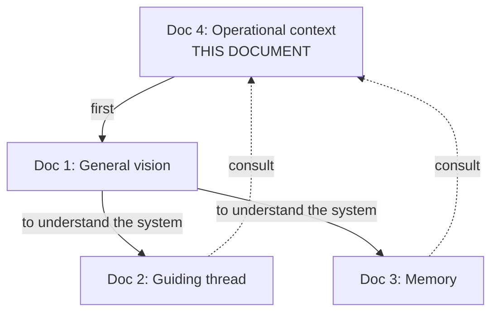

# Durin — Operational Context

> This document exists so that an agent (human or AI) can operate on the Durin project without reconstructing the path. It contains what the three technical documents assume as given.

> **Read this document before the other three.**

---

## 1. Five-line Summary

Durin is a work agent with two differentiators: a **persistent posture vector** (guiding thread) that biases all deliberation, and a **memory as graph** with dynamic projection to context. The goal is not super-intelligence or consciousness: it is **improving context management and goal tracking**. What distinguishes this system from any other agent with memory is that memory and the agent's character are coupled: posture biases what is remembered and how it thinks, not just how it responds. The technical stack is interchangeable; what matters is the architecture.

---

## 2. What It Is and What It Is Not

**Durin is:**
- An agent with stable character across tasks.
- A memory system with functional roles.
- An architecture on top of LLMs, not a new model.
- Conventional code with deterministic pieces and LLM-driven pieces.

**Durin is not:**
- An AGI nor an attempt at consciousness.
- A generic agent framework.
- A RAG wrapper.
- A system of "emotions" in the affective sense.
- A competitor to Letta, AutoGen, or LangGraph; it operates at a different level.

---

## 3. Glossary of Project-Specific Terms

| Term | Meaning in Durin |
|---|---|
| **Guiding thread** | 5-value vector representing the agent's posture/disposition. Persists between steps. |
| **Posture** | Operational synonym for guiding thread. It is the state, not a decision. |
| **Axis** | Each of the 5 dimensions of the vector (Caution, Exploration, Depth, Discipline, Conformity). |
| **Mean** | Stable set point of an axis. Defines the agent's personality. |
| **Typical variance** | How much an axis normally moves relative to its mean. Part of the personality. |
| **Return force** | Speed at which an axis returns to the mean when the stimulus ceases. |
| **Current value** | The momentary state of an axis. What effectively biases deliberation in this step. |
| **Stimulus** | Step event that produces delta in one or more axes (failure, success, ambiguity, etc.). |
| **Director** | Pure function (no LLM) that combines scores and chooses the winning proposal. |
| **Generators** | SLMs (pragmatic, explorer, critic) that produce proposals in parallel. |
| **Evaluators** | Functions that score each proposal on an axis (progress, reversibility). |
| **Synthesizer** | Heavy LLM that translates the winning proposal into concrete action. |
| **Live goal** | The active, mutable objective, with explicit completeness criteria. |
| **Pending** | Latent intention (prospective memory) that fires by context. |
| **Step** | A complete iteration of the cycle: deliberation + execution + writing. |
| **Milestone** | Compact entry of the cumulative summary. Gist of an important step. |
| **Gist** | Reconstructive summary (not a compressed copy). 1-3 sentences with the essence. |
| **Dynamic projection** | Selection of which graph nodes enter the context at each step, biased by posture. |
| **Hierarchical injection** | Strategy for long plans: plan posture / subplan / step. |
| **Decision under doubt** | Step accepted after exhausting rounds without exceeding threshold. Marked in the graph. |
| **Invalidation** | Mark of "no longer true" on a node. Not deleted, deactivated. |
| **Consolidation** | Periodic process (Phase 3) that distills patterns from the episodic graph. |

---

## 4. Operational Philosophy

These are the conceptual anchors of the project. If a future design decision contradicts them, the change must be explicitly defended.

**The director does not decide, it filters.**
There is no LLM choosing between options. There is a deterministic function that combines scores weighted by posture. Intelligence emerges from competition with bias, not from an intelligent arbiter.

**The guiding thread is state, not decision.**
Posture is not "calculated" from scratch each step. It lives between steps. It is updated by stimuli and brought back by homeostasis. It is what creates continuity of identity.

**What defines entity is the continuity of internal state, not the memory of facts.**
Two agents with the same graph but different active vectors behave differently. Memory is the library; posture is who consults it.

**The large LLM does not deliberate, it translates.**
By the time it reaches the synthesizer, the decision is already made. Its role is to convert the winning proposal into concrete action. If it deliberates, its bias overrides the rest.

**Diversity comes from prompts and postures, not models.**
Three generators with the same model and different prompts can yield more diversity than three different models with the same prompt. The value is in the configured postures, not in the model zoo.

**Memory reconstructs, it does not retrieve.**
The gist is not a compressed copy. It is a synthesis made in the moment from fragments. That is why milestones are 1-3 redacted sentences, not concatenations.

**Compaction is deliberate and per-step, not emergency.**
When a step leaves the recent queue, it decides whether to generate a milestone. It is an informed decision, not compression under pressure.

**The technical stack is irrelevant to the architecture.**
Which SLM, which database, which orchestrator — they change every month. The architecture (what each component does, how they connect, what is persisted) is what defines the project.

**We are not seeking super-intelligence.**
The objective is context management and goal tracking. Any feature justified with "it is more intelligent" without a concrete metric for context management or goal tracking must be reviewed.

---

## 5. Decisions Made and Discarded

### 5.1 Made (in approximate chronological order)

| # | Decision | Reason |
|---|---|---|
| 1 | Build, not integrate existing tools (Letta, etc.) | Architectural lock-in and inherited technical debt |
| 2 | Generalist domain (not specialized) | Broader validation of the design |
| 3 | 5-axis vector (not 3, not 10) | Big Five empirically validated |
| 4 | Honesty as a hard constraint, outside the vector | Never modulated, fixed weight |
| 5 | One personality per agent | Simplicity in Phase 1 |
| 6 | Each step adjusts current value, not means | Means are adjusted in Phase 3 with consolidation |
| 7 | Three generators with SLMs (pragmatic, explorer, critic) | Minimum for real diversity without excessive cost |
| 8 | Two evaluators on opposing axes (progress, reversibility) | A single evaluator only brakes; we need tension |
| 9 | Director as pure function, no LLM | Prevents the arbiter from overriding with its own bias |
| 10 | Memory as graph with 5 node types | Clear functional roles, not vector soup |
| 11 | Context as dynamic projection, not dump | Solves emergency compaction |
| 12 | Hierarchical injection in long plans | Reduces cost and cumulative drift |
| 13 | Vector persistence between sessions with decay | Continuity of identity without rigidity |
| 14 | Save losing proposals at each step | Needed for contrastive learning (Phase 3) |
| 15 | Save active vector at each step | Auditing and telemetry |

### 5.2 Discarded or Postponed

| Rejected Decision | Reason |
|---|---|
| Use Letta as base | Lock-in: the agent lives inside its runtime |
| Use only one axis (reversibility) | Only brakes, does not advance. Paralyzed agent |
| Large LLM as director / judge | Overrides with its bias. That is why pure function is used |
| Evolutionary algorithms (Mind Evolution style) in Phase 1 | Need to measure baseline before optimizing variation |
| Multiple configurable personalities | Complexity without immediate value |
| Modify vector means in Phase 1 | Need sufficient history to do it well |
| Model emotions (Plutchik, VAD, etc.) | Confusing language; "posture" is more operational |
| Extraversion axis | Irrelevant for agent without social presence |
| Neuroticism axis | Noise for agent without real emotion |
| Persistence/Flexibility axis | Emerges from combinations of other axes |
| Autonomy/Consultation axis | Interface, not trait |
| Affective Reactivity axis | Overlaps with persistence, adds nothing |
| SLM classifier as step 1 of the flow | Overkill; heuristic rules suffice |
| Flat conversational memory (vector RAG) | Does not capture trajectory or dependencies |

---

## 6. Anti-patterns

Things that look like improvements but break the design. If they come up in discussion, they must be recognized.

### 6.1 Converting the director into a "smarter" LLM

**Temptation**: "What if the director reasons about proposals instead of just summing scores?"
**Why it breaks**: the LLM in judge position overrides all options with its bias. Loses the diversity gained in generation.
**Correct solution**: if decisions are too simple, add more evaluators (more score axes), do not add intelligence to the director.

### 6.2 Making the critic veto proposals

**Temptation**: "The critic detects risk, it should be able to block the proposal directly."
**Why it breaks**: agent paralyzed by the most conservative agent. Absolute critiques make any risk block action.
**Correct solution**: the critic adds negative signal to the score. If the proposal has high value on other axes, it wins anyway. Friction is good; veto is not.

### 6.3 Saturating context with "everything relevant"

**Temptation**: "The graph has lots of valuable information, let's bring more into context."
**Why it breaks**: human focus is 3-4 chunks. An agent with 50 milestones loaded loses its north. More context is not more understanding.
**Correct solution**: respect the token budget of the active context. If you need more information for a step, query the graph on demand, do not load it by default.

### 6.4 Making evaluators "intelligent"

**Temptation**: "The evaluator could reason about why the proposal is reversible or not."
**Why it breaks**: latency, cost, and reintroduces deliberative bias where we only wanted raw signal.
**Correct solution**: evaluators are dumb and fast. They emit a number. If you need nuance, add it as another axis, not as reasoning inside the evaluator.

### 6.5 Changing the stack and calling it architecture

**Temptation**: "This new model is better, let's migrate the whole stack."
**Why it breaks**: the stack is commodity. The architecture (what each component does, how they connect) is the intellectual property. Swapping Qwen for Gemma is not an architectural decision.
**Correct solution**: treat stack as interchangeable configuration. The architecture changes only if what some component does changes, not what model implements it.

### 6.6 Modeling the guiding thread as "emotions"

**Temptation**: "These axes are basically fear, curiosity, etc. Let's call them that."
**Why it breaks**: affective language brings expectations (affect, valence, embodiment) that the system does not implement. Confuses whoever reads the code and whoever designs.
**Correct solution**: functional names. "Caution" is a decision weight, not a feeling. Psychological inspiration is valid; affective vocabulary is not.

### 6.7 Compacting when context fills up

**Temptation**: "Context is near the limit, let's compress it."
**Why it breaks**: emergency compaction is exactly the problem we want to avoid.
**Correct solution**: active context is bounded by design. If it is growing, something is wrong with the projection. Review projection rule, do not compact.

### 6.8 Mixing deliberation and translation in the large LLM

**Temptation**: "Let the synthesizer also decide if the proposal is good."
**Why it breaks**: rejoins the "what" and the "how" in a single place. This is the current LLM pattern we want to break.
**Correct solution**: the synthesizer receives an already-chosen proposal and translates it into action. If you doubt the proposal, the place to decide is the director, not the synthesizer.

---

## 7. Known Failure Modes

Things the system can do wrong. Documented so that whoever operates it recognizes the symptoms.

### 7.1 Cumulative vector drift

**Symptom**: after N steps in a long plan, the vector drifted so far from the means that the agent "changed personality."
**Cause**: stimuli in one direction without sufficient return.
**Mitigation**: verify return force; apply reinforced return between subplans; hierarchical persistence.
**When to accept**: if the drift reflects legitimate learning from the plan (entering a critical zone justifies more caution), do not correct.

### 7.2 Context poisoning

**Symptom**: the agent becomes increasingly conservative, avoids actions it previously did without issue.
**Cause**: graph full of `failure` and `alert` milestones, projection always brings them, posture raises Caution in a loop.
**Mitigation**: importance decay, balance between positive and negative milestones in projection, invalidation of obsolete alerts.

### 7.3 Threshold paralysis

**Symptom**: no proposal exceeds the threshold, rounds are exhausted, the system accepts one "decision under doubt" after another.
**Cause**: threshold too high for the active Depth, or genuinely difficult problem.
**Mitigation**: review threshold formula; allow that after two consecutive "under doubt" steps, the agent pauses and consults the user.

### 7.4 Persistent tie between progress and reversibility

**Symptom**: the director receives proposals with nearly identical scores. The final choice depends on minute details. Erratic behavior.
**Cause**: the current problem is at an equilibrium point where both axes are equally valid.
**Mitigation**: add tiebreaker rule (active posture, proposal seniority, controlled random seed); record in graph for auditing.

### 7.5 Identity loss

**Symptom**: the agent behaves very differently between two close sessions, without clear justification.
**Cause**: broken persistence; poorly calibrated decay; the vector was reset instead of continuing.
**Mitigation**: verify vector persistence between sessions; review decay `tau`; audit the vector version log.

### 7.6 Pending saturation

**Symptom**: pending list grows without being resolved. The agent "promises" a lot and delivers little.
**Cause**: pendings created without clear trigger criteria, or triggers too restrictive.
**Mitigation**: hard limit on the list; periodic review to promote some to subgoal or discard; logging of "orphaned" pendings.

### 7.7 Milestone inflation

**Symptom**: cumulative summary grows without limit; selection of relevant milestones becomes increasingly costly.
**Cause**: importance threshold for promotion too low; every step seems important.
**Mitigation**: adjust threshold; periodic consolidation (Phase 3) that distills old milestones into semantic memory.

### 7.8 Goal drift

**Symptom**: the goal was rewritten so many times that the agent lost sight of the original objective.
**Cause**: incremental changes without checking against root goal.
**Mitigation**: maintain immutable "root goal" separate from mutable "live goal"; alert when drift exceeds a certain semantic threshold.

---

## 8. Current Project State

**Current phase**: design closed. No code yet.

**What is closed:**
- General vision (document 1).
- Detailed design of the guiding thread (document 2).
- Detailed design of memory (document 3).
- Operational context (this document).

**What is logically next (not necessarily chronological):**
- Define concrete persistence schema (which technology, which tables/collections/nodes).
- Implement the vector and its operations (pure code, no LLMs).
- Implement the graph with the 5 node types.
- Connect the generators with a real use case to validate.
- Calibrate tables (stimuli, deltas, thresholds) against observed behavior.

**What we know will be learned by executing:**
- Whether the five axes are correct for the generalist domain.
- Whether the vector update formula is sufficient or needs more complexity.
- Whether the projection rule with posture bias actually changes behavior in a measurable way.
- How much the complete cycle costs in latency and money per step.

**What is left for later phases:**
- Periodic consolidation (Phase 3): distill episodic graph into semantic memory.
- Adjustment of vector means based on history.
- Contrastive learning success vs failure.
- Evolutionary exploration (Phase 4): proposal populations with mutation.
- Multi-agent with different personalities collaborating.

---

## 9. How to Use the Four Documents

**For someone new**: read this document first, then document 1 (vision), then documents 2 and 3 as needed.

**For implementation**: document 1 gives the map, documents 2 and 3 are the specification. This document is consulted when questions arise about philosophy, anti-patterns, or past decisions.

**For evolution**: any design change must be explained against this document. If it contradicts a decision made or falls into an anti-pattern, the change must be justified before implementing.

---

## 10. Question to Review Before Acting

Before proposing a change or adding a piece to the design, answer:

1. Which of the **decisions made** (section 5.1) does it impact?
2. Does it fall into any of the **anti-patterns** (section 6)?
3. Does it resolve any **known failure mode** (section 7)?
4. Is it coherent with the **operational philosophy** (section 4)?
5. How will it be measured if it worked?

If all five answers are clear, proceed. If any is not, discuss before implementing.
