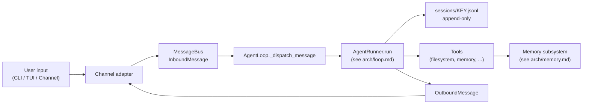

# Durin — Operational Architecture

> Reference for Durin's internals: what each system does and how it fits together.
> **Keep updated** when modifying core modules.
>
> For the *direction* and *discarded approaches*, see [01_roadmap.md](01_roadmap.md) and [02_bitacora.md](02_bitacora.md).

This is the top-level index. Component-level architecture lives in `arch/` to keep each surface scannable:

| Document | Scope |
|---|---|
| [arch/loop.md](arch/loop.md) | Iteration flow, runner guards, hooks, agent modes, long tasks, sessions, providers, sandboxing |
| [arch/memory.md](arch/memory.md) | Entity-centric memory, dream consolidation, alias + vector indexes, retrieval, drill-down, absorption |
| [arch/observability.md](arch/observability.md) | Telemetry, status, doctor, gateway daemon |
| [arch/ux.md](arch/ux.md) | Interactive CLI, Textual TUI, secrets subsystem, design system, lifecycle commands, config layout, distribution |

---

## 1. Origin and relationship with Nanobot

Durin is a fork of [Nanobot](../vendor/nanobot/) (lightweight agent framework). After the May 2026 prune, Durin is essentially Nanobot plus a small set of plumbing additions:

| Addition | What it provides |
|---|---|
| `providers/local_llama_provider.py` | Local LLM provider via `llama-cpp-python` |
| `telemetry/` | Generic JSONL logger + rate-limit telemetry |
| `durin_sdk.py` | Public SDK entry point (`Durin.from_config()`) |
| `memory/` | Entity-centric memory: typed entries, dream consolidator, alias + vector indexes, absorption — see [arch/memory.md](arch/memory.md) |
| `cli/memory_cmd.py` | `durin memory <subcommand>` for consolidation + drill-down |

What Durin no longer carries: a previous "smart layer" (posture vector, plan tier system, deliberation V3, phase-aware temperatures, hook factory) was empirically refuted across V3–V8 experiments and removed. See `02_bitacora.md` for full rationale and `archive/06_log_experiments.md` for raw data.

The fork model is retained because the memory work needs tighter integration than a plugin API allows.

---

## 2. Module map

```
durin/
├── agent/
│   ├── loop.py            # AgentLoop — outer state machine, dispatch, sessions
│   ├── runner.py          # AgentRunner — inner LLM/tool loop (see arch/loop.md)
│   ├── hook.py            # AgentHook + AgentHookContext + CompositeHook
│   ├── context.py         # ContextBuilder — system prompt + history + skills
│   ├── memory.py          # LEGACY MemoryStore + Dream over MEMORY.md / SOUL.md
│   ├── agent_mode.py      # Plan/Build/Explore permission-as-data modes
│   ├── progress_hook.py   # Streaming + tool-event progress + cache.usage event
│   ├── subagent.py        # Spawn parallel sub-agents + lifecycle status retention
│   ├── model_presets.py   # Named model + generation parameter sets
│   ├── skills.py          # Skill discovery, on-demand loading
│   └── tools/             # All tool implementations
│       ├── filesystem.py / search.py / shell.py / web.py / mcp.py / spawn.py
│       ├── cron.py / long_task.py / message.py / self.py / notebook.py
│       ├── plan_mode.py            # enter_plan_mode + exit_plan_mode
│       ├── todos.py                # todo_write (replace-list semantics)
│       ├── sleep.py                # bounded synchronous wait
│       ├── ask_user.py             # ask_user_question (yield-and-resume)
│       ├── session_search.py       # keyword/regex over session.messages
│       ├── subagent_lifecycle.py   # list / status / stop / output / monitor
│       ├── interpret_image.py      # vision aux-model bridge
│       ├── interpret_audio.py      # audio chat-multimodal aux-model bridge
│       ├── memory_ingest.py        # entity-centric: copy artifact, return content
│       ├── memory_store.py         # entity-centric: write entry + vector upsert
│       ├── memory_search.py        # entity-centric: vector + entity-aware rerank
│       ├── memory_drill.py         # entity-centric: resolve path#anchor
│       ├── repo_overview.py / output_spill.py / image_generation.py
│       └── context.py              # ToolContext + AuxProviderHandle
├── api/                   # HTTP/SSE/WebSocket transport layer
├── bus/                   # Internal message bus (InboundMessage, OutboundMessage)
├── channels/              # CLI, WebUI, Slack, Telegram, etc.
├── cli/                   # CLI entry, prompts, command dispatch
│   ├── commands.py        # Lifecycle (onboard, status, ...)
│   ├── config_cmd.py      # durin config get/set/edit
│   ├── doctor.py          # health checks
│   ├── memory_cmd.py      # durin memory dream/history/show/diff/.../absorb
│   ├── tui/               # Textual TUI app
│   └── ...
├── command/               # /commands router (/plan, /build, /mode, ...)
├── config/                # Config schemas, loader, validation
├── cron/                  # Scheduled task service
├── heartbeat/             # Background heartbeats and timers
├── memory/                # Entity-centric memory subsystem (see arch/memory.md)
│   ├── schema.py          # MemoryEntry pydantic model
│   ├── entities.py        # <type>:<value> validation + SUGGESTED_TYPES
│   ├── storage.py         # split_frontmatter + save_entry + load_entry
│   ├── store.py           # store_memory (used by memory_store tool)
│   ├── search.py          # grep fallback
│   ├── drill.py           # markdown URI → addressed section
│   ├── ingestion.py       # ingest_artifact
│   ├── embedding.py       # FastembedProvider (lazy ONNX)
│   ├── vector_index.py    # LanceDB-backed VectorIndex
│   ├── entity_page.py     # EntityPage parser (open-vocab frontmatter)
│   ├── aliases_index.py   # AliasIndex (rebuild-only, lazy)
│   ├── aliases_cache.py   # process-wide shared cache (doc 25 §2.C)
│   ├── entity_ranker.py   # RRF entity-aware reranker
│   ├── dream.py           # DreamConsolidator (LLM + pydantic + retry)
│   ├── absorption.py      # EntityAbsorption (merge + archive + deindex)
│   ├── provenance.py      # _MEMORY_AUTHOR ContextVar
│   ├── paths.py           # workspace-scoped directory helpers
│   ├── session_md.py      # <key>.jsonl → <key>.md formatter
│   ├── consolidator_tags.py # parse summary/entities/topics from consolidator
│   └── hot_layer.py       # identity + top headlines for stable prompt tier
├── pairing/               # Account pairing flow
├── providers/             # LLM provider adapters (see arch/loop.md §6)
├── security/              # Auth, permissions, network SSRF guard
│   └── secrets.py         # secret store + ${secret:} refs + redaction
├── session/               # Session storage + state helpers (see arch/loop.md §5)
├── skills/                # Built-in skill markdown files
├── telemetry/             # Generic JSONL logger (see arch/observability.md)
├── templates/             # Prompt templates
├── utils/                 # Helpers (no business logic)
│   └── git_repo.py        # GitRepo (dulwich) used by entity-centric memory
└── web/                   # Static web assets

scripts/
├── refresh_model_capabilities.py    # dev tool — regenerates capability snapshot
└── _vendor_sources.py               # Anthropic / Mistral / Gemini adapters
```

---

## 3. Iteration entry point



Channel-agnostic. The CLI, TUI, web, Slack, Telegram, Matrix, WhatsApp, DingTalk and MoChat surfaces all funnel through the same `MessageBus` and `AgentLoop`. The only thing that differs between channels is the I/O layer; agent behaviour is identical.

---

## 4. Testing

```
tests/
├── agent/          # Loop, runner, context, hooks, modes, capability bridges
├── agent/tools/    # Per-tool tests
├── api/            # HTTP/SSE/WebSocket
├── bus/            # Message bus
├── channels/       # Channel adapters
├── cli/            # CLI rendering + TUI pilot tests
├── command/        # Commands (/plan, /build, /mode, ...)
├── config/         # Schema and loader
├── cron/           # Cron service + cron tool update action
├── integration/    # End-to-end: phase 6 memory outcomes, etc.
├── memory/         # Memory subsystem (schema, dream, vector, ranker, absorption, T1 wiring E2E)
├── providers/      # Provider adapters + capabilities resolver + snapshot
├── session/        # Session lifecycle, goal state, todo_state, session_meta
├── skills/         # Skill loading + disable_model_invocation gating
└── telemetry/      # Generic logger + schema catalog + cache.usage event
```

Current: **4365 tests passing, 16 skipped** (Python) + **~140** (webui).

---

## Last updated: 2026-05-23 (post-T1 entity-centric memory + arch/ split)

> Doc history: this used to be a single 1000-line file. May 23, 2026 split it
> into the per-component docs under `arch/` with mermaid diagrams. The slim
> top-level keeps the module map and origin story; details moved.
>
> For the *why* behind each subsystem (what was tried, what was discarded),
> see `02_bitacora.md`. This document only describes the current state.
