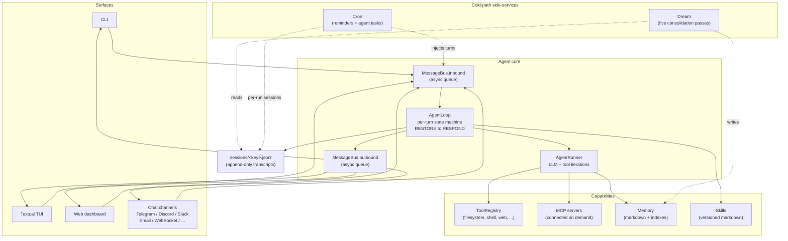

# durin documentation

## What durin is

durin is a personal-assistant **agent harness**: a local daemon that drives an
LLM (Claude, GLM, local llama.cpp models, and others) through long-running,
multi-turn work. It is more than a memory store — it bundles four things into one
runtime:

- **Memory** — persistent, cross-session knowledge kept as markdown that the
  agent can search without an LLM in the hot path.
- **Context** — a layered system prompt (stable + per-session + volatile) that
  feeds the model the right history, skills, and pinned facts each turn.
- **Adaptation** — runtime model/provider switching, permission-as-data agent
  modes (plan / build / explore), and MCP servers connected on demand.
- **Self-learning** — a cold-path *dream* that consolidates conversations into
  an entity graph and curated skills, plus *cron* for scheduled work.

Every chat surface — terminal CLI, the Textual TUI, the web dashboard, and chat
channels like Telegram, Discord, Slack, Email, and a raw WebSocket — funnels
through the same internal message bus and the same agent loop. Channels differ
only in their I/O; the agent's behaviour is identical regardless of where the
message came from.

## Where to go next

durin's documentation is split by audience.

### Guides — for users and operators

How to install, configure, and run durin.

- [Installation](guide/install.md) — install, the onboarding wizard, optional
  extras (memory, local models, audio), and running the gateway.
- [Configuration](guide/configuration.md) — every config key, its default, and
  what it does.
- [Channels](guide/channels.md) — connecting Telegram, Slack, Discord, email, and
  the other chat surfaces.
- [Providers & models](guide/providers.md) — choosing LLM providers and models,
  API keys, and aux-model presets.

### Internals — for contributors and curious readers

How durin works, subsystem by subsystem.

- [Internals overview](internals/README.md) — the architecture index, the
  source-of-truth invariant, and a link to every component doc.

Direct jumps to the most-read component docs:

- [Agent loop](internals/loop.md) — the per-turn state machine and runner.
- [Memory](internals/memory/00_overview.md) — entity-centric memory and search.
- [Skills](internals/skills/00_overview.md) — skill authoring, vetting, surfacing.
- [Channels & message bus](internals/channels.md) — how surfaces reach the loop.
- [Cron](internals/cron.md) — scheduled work (reminders and agent tasks).

### Project

- [Contributing](contributing.md) — dev setup, running tests, and the PR workflow.
- [Releasing](releasing.md) — how releases are cut.
- [Roadmap](roadmap.md) — direction, and what durin is deliberately not doing.

## Mental model

Three things to hold in your head:

1. **One agent loop, many surfaces.** Every message — from the terminal, the TUI,
   the web dashboard, Telegram, Slack, or any of the ~14 supported chat channels —
   arrives as an `InboundMessage` on the message bus and goes through the same
   `AgentLoop`. Channels differ only in I/O; the agent behaves identically
   regardless of origin.

2. **Markdown is the truth; indexes are derived.** Sessions live as
   `sessions/<key>.jsonl` transcripts. Memory lives as `.md` files under
   `memory/`. The SQLite FTS index and the LanceDB vector table accelerate search
   but are never authoritative — a corrupted index is recoverable by rebuilding
   from the files.

3. **Hot path vs cold path.** The hot path is the per-turn loop (receive →
   restore → respond → persist). The cold path runs offline: the dream job
   consolidates conversations into memory and skills; cron schedules reminders and
   agent tasks.

## The whole system at a glance

A message enters through a surface, crosses the message bus, runs through the
agent loop and runner, touches tools / MCP servers / memory / skills, and returns
the same way. **Cron** and **dream** are cold-path side-services: they do not sit
on the request path, but they read and write sessions and memory in the
background.

The agent core is channel-agnostic: the only contract between a surface and the
loop is an `InboundMessage` on the bus and an `OutboundMessage` back. To follow
any single arc in depth, start from the [internals overview](internals/README.md).
