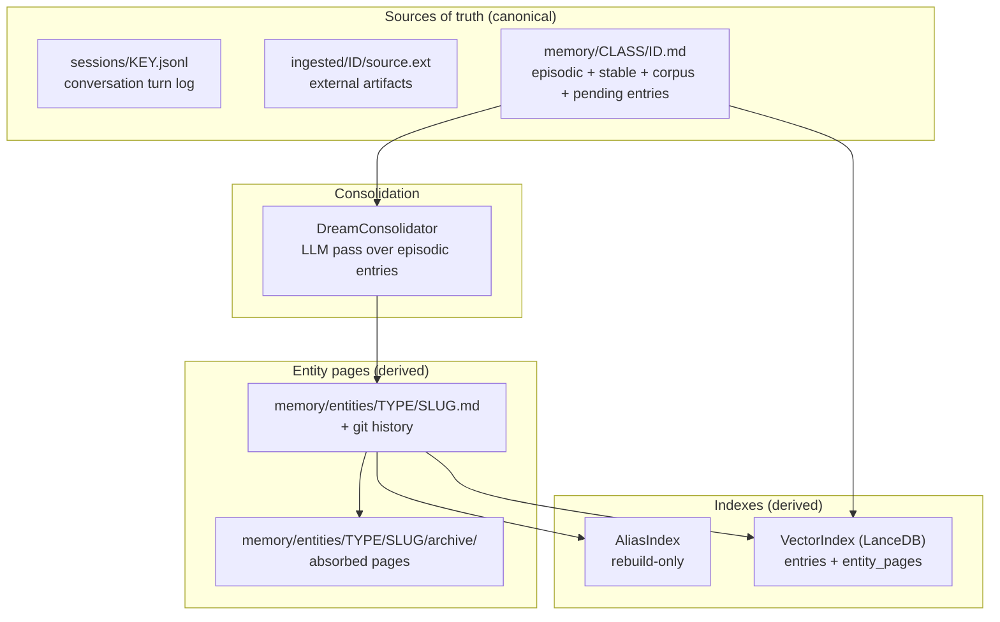
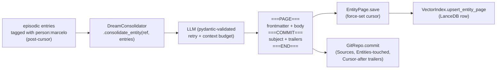
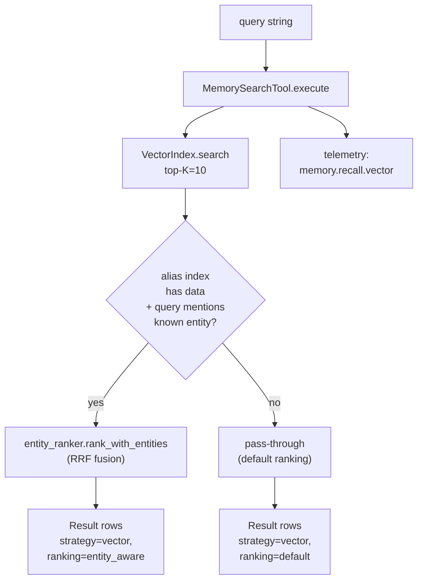
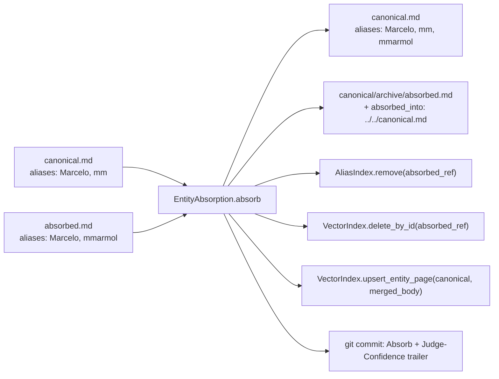
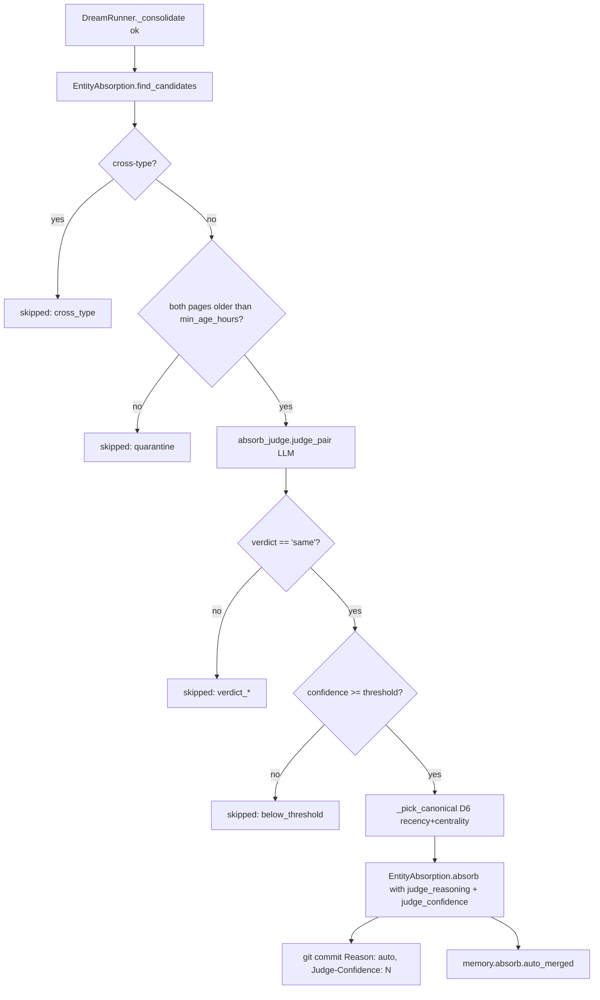

# arch / memory — memory subsystem, dream, entity-centric retrieval

> Durin's memory layer: how the agent records what it learns, consolidates
> it into navigable entity pages, and retrieves it at query time.
>
> Design source of truth: [../18_entity_centric_plan.md](../18_entity_centric_plan.md)
> (principles + schema + retrieval) and
> [../archive/19_implementation_plan.md](../archive/19_implementation_plan.md) (phases, ejecutado).
> Forward-looking deferred items in
> [../25_post_t1_state_and_t2_horizon.md](../25_post_t1_state_and_t2_horizon.md).

---

## 1. Layers and sources of truth



Three canonical sources of truth + two derived layers (entity pages + indexes). The agent's `memory_search` consults the indexes; the markdown is always reconstructible from the entries + dream.

| Kind | Where | Mutability |
|---|---|---|
| Sessions | `<workspace>/sessions/<key>.jsonl` | Append-only |
| Ingested docs | `<workspace>/ingested/<id>/source.<ext>` | Frozen at ingest |
| Memory entries | `<workspace>/memory/<class>/<id>.md` | Mutable (agent or user) |
| Entity pages | `<workspace>/memory/entities/<type>/<slug>.md` | LLM-produced (dream), git-versioned |
| Aliases index | rebuilt in-memory from entity pages | Lazy, no sidecar |
| Vector index | `<workspace>/memory/.index.lance` (LanceDB) | Incremental upserts |

The 6 utility classes from doc 19 §0a map onto directories `memory/stable/`, `memory/episodic/`, `memory/corpus/`, `memory/pending/` (procedural skills and the prospective time-trigger half live in `skills/` and `cron/`).

---

## 2. On-disk layout

```
<workspace>/
├── sessions/<key>.jsonl            # canonical conversation log
├── sessions/<key>.meta.json        # derived: lifecycle events + summary
├── sessions/<key>.md               # derived: navigable view w/ #turn-N anchors
├── ingested/<id>/source.*          # canonical external artifact
├── ingested/<id>/meta.json         # derived: summary + entities + relations
├── memory/
│   ├── stable/<id>.md              # long-lived learnings
│   ├── episodic/<id>.md            # per-event observations (dream input)
│   ├── corpus/<id>.md              # large bodies of reference text
│   ├── pending/<id>.md             # entries awaiting promotion
│   ├── entities/
│   │   ├── <type>/<slug>.md        # consolidated entity page
│   │   └── <type>/<slug>/
│   │       └── archive/<slug>.md   # absorbed pages (linked from canonical)
│   ├── .git/                       # git substrate over entity pages
│   ├── .index.lance/               # LanceDB vector index
│   └── history.jsonl               # consolidator narrative summaries
```

Git lives under `memory/.git/` and tracks the entity pages — not the whole workspace, not the indexes. `.gitignore` keeps `*.lance/`, `.aliases.json`, `.usage.json`, `.dream.lock` out.

---

## 3. Entry schema

`durin/memory/schema.py` defines a pydantic `MemoryEntry` with `extra="forbid"`. Frontmatter carries multi-resolution:

- `headline` (~10 words) — pulled in bulk into the hot layer.
- `summary` (~50 words) — returned by `memory_search(level="warm")`.
- `body` (~200-500 words) — returned by `memory_search(level="cold")` or by `memory_drill`.
- `entities: list[str]` — typed refs `<type>:<value>` (see §4).
- `class_name`, `valid_from`, `valid_until`, `source_refs`, `author` (`agent_created` | `user_authored`, driven by `_MEMORY_AUTHOR` ContextVar).

Markdown links in `source_refs` point to specific session turns (`sessions/<key>.md#turn-N`) or document sections (`ingested/<id>/source.md#section`).

---

## 4. Typed entities

Format: `<type>:<value>`. `<type>` is lowercase `[a-z][a-z0-9_]*`, `<value>` is anything non-empty after the first `:`. Validation in `durin/memory/entities.py`. Eight suggested types from doc 18 §4 (open vocabulary — types outside the suggested set are legal):

```
person   place      project   topic
event    artifact   stance    practice
```

`SUGGESTED_TYPES` in `entities.py` is a hint for the dream prompt, not an enforced enum.

**Two-tier validation policy** (per archived doc 14 §3.2):

- `memory_store` write path → **strict**: invalid refs raise `InvalidEntityRefError` and the error returns to the model so it can rewrite.
- `consolidator_tags` read path → **lenient**: invalid refs are dropped with a log warning; the entry survives.

A model that writes `decision:auth-rewrite` succeeds — the type is captured verbatim. Pruning is via **ranker weight**, not by rejecting writes.

---

## 5. Entity pages

```yaml
# Frontmatter (open vocabulary — extra fields allowed)
---
type: person
name: Marcelo Marmol
aliases: [Marcelo, marcelo, mmarmol]
identifiers:
  email: [mmarmol@mxhero.com]
  github: [mmarmol]
dream_processed_through: 2026-05-20T18:30:00+00:00
---

# Marcelo Marmol

## Current State
…

## History
…

## Sources
- [s1](../../sessions/k1.md#turn-12)
…
```

Parser: [durin/memory/entity_page.py](../../durin/memory/entity_page.py). Open vocabulary — anything beyond the well-known fields lands in `page.extra`. Loader is tolerant: malformed frontmatter returns `None` instead of raising.

---

## 6. Dream consolidation



**Manual trigger**: `durin memory dream [entity] [--dry-run]` in [durin/cli/memory_cmd.py](../../durin/cli/memory_cmd.py). Walks `memory/episodic/` for entries with entity tags newer than each entity page's `dream_processed_through` cursor, groups by entity, invokes the consolidator.

**Auto-trigger (doc 25 §2.A.1)**: `durin/memory/dream_runner.py` wraps the consolidator with an atomic lock (`memory/.dream.lock` via `O_CREAT|O_EXCL`, stale-recovery at 10min), a throttle (`memory/.dream.last_run` mtime + `min_seconds_between_runs`), and three telemetry events (`memory.dream.start` / `.end` / `.skipped`).

Trigger surface (`memory.dream.*` config block):

| Trigger | Status | Source |
|---|---|---|
| `cron_daily` | SHIPPED β.1 (2026-05-24) | system job `memory_dream` registered at `cli/commands.py` startup; default cron `0 3 * * *`. Routed via `asyncio.to_thread` in `on_cron_job` so the cron loop stays responsive during LLM calls. |
| `post_compaction` | SHIPPED β.2 (2026-05-24) | `Consolidator.on_post_compaction` callback. Fires when `maybe_consolidate_by_tokens` produces ≥1 summary. Wired in startup to a daemon thread spawning `DreamRunner.run(trigger="post_compaction")`. Gated by `memory.dream.post_compaction` (default True). |
| `session_close` | SHIPPED β.2 (2026-05-24) | `AgentLoop.on_session_close` callback. `cmd_new` (/new) invokes it after archiving the prior session. Wired in startup to a daemon thread spawning `DreamRunner.run(trigger="session_close")`. Gated by `memory.dream.on_session_close` (default True). Independent of `post_compaction` knob. |
| `threshold` | SHIPPED β.2 (2026-05-24) | `MemoryStoreTool._maybe_dispatch_threshold_dream` counts per-entity post-cursor entries after each successful write; spawns one daemon thread per entity that crosses `memory.dream.threshold_entries` (default 5) with `entity_filter=ref`. |
| `manual` | SHIPPED β.2 (2026-05-24) | `durin memory dream` CLI now routes through `DreamRunner` (`min_seconds_between_runs=0` so the user is never throttled). Manual + auto share the same lock, so concurrent runs cannot race. |

**Consolidator** ([durin/memory/dream.py](../../durin/memory/dream.py)) :

- Pydantic-validated LLM output (page + commit envelope).
- Retry on malformed response.
- Context budget guard (cap body shrink between revisions).
- `Cursor-after` trailer force-set on the page's `dream_processed_through` so the next pass excludes the entries we just absorbed.

**Commit envelope**:

```
Consolidate person:marcelo (rev 3)

Three observations merged: preference for pytest, ownership of durin,
glm-5.1 daily-driver.

Sources: e12, e15, e18
Entities-touched: person:marcelo
Entities-referenced: project:durin, topic:pytest
Cursor-after: 2026-05-20T18:30:00+00:00
```

Trailers are machine-readable and surfaced by `durin memory history` / `expand`.

---

## 7. Aliases index

`durin/memory/aliases_index.py`. **Rebuild-only** per archived doc 23 T1.4 — no `.aliases.json` sidecar, no save/load. Built in-memory on first call (sub-second for typical <100-page corpora).

Case-insensitive lookup keyed on `name` + `aliases` + identifying strings from each entity page's frontmatter (identifiers like email/slack/github included). Returns a `list[str]` of entity refs (not a single ref) so alias collisions (R6 in doc 18 §10) are surfaced rather than masked.

**Shared across consumers** via `durin/memory/aliases_cache.py` (doc 25 §2.C, shipped 2026-05-24). `MemorySearchTool`, `DreamConsolidator` and `EntityAbsorption` all resolve the same workspace-keyed instance through `get_shared_alias_index(memory_root)`:

- Double-checked locking guarantees one build under contention.
- Cold workspaces (no `entities/` subdir) get an empty index — still usable; callers check `idx.size() == 0` to skip downstream work.
- Mutation API (`refresh_for` / `remove`) updates the shared map in place, so a `DreamConsolidator.apply()` write becomes visible to the next `memory_search` call without any explicit invalidation step. `invalidate_alias_index(memory_root)` exists as a defensive escape hatch for out-of-band edits or tests.
- Tests inject their own `AliasIndex` via the consumer's `alias_index=` constructor parameter to bypass the cache entirely.

---

## 8. Vector index

`durin/memory/vector_index.py` wraps a LanceDB table at `<workspace>/memory/.index.lance`. Schema:

| Field | Source |
|---|---|
| `id` | `MemoryEntry.id` for entries; `<type>:<slug>` for entity pages |
| `class_name` | `stable` / `episodic` / `corpus` / `pending` / `entity_page` |
| `summary` | entry summary or `name + aliases` for pages |
| `headline` | entry headline or `name` for pages |
| `vector` | embedding of composed text (`name + aliases + body`, budget 1500 chars, no `<type>:` prefix per Phase 0.1 finding) |
| `valid_from` | ISO timestamp from the entry; empty for pages |
| `entities` | list of entity refs the entry references; empty for pages |
| `path` | workspace-relative path |

Two write paths:

- `upsert(entry, class_name, path)` — incremental, called by `memory_store` after a single entry is written.
- `upsert_entity_page(entity_ref, name, aliases, body, path)` — called by `DreamConsolidator.apply` so consolidated pages enter the index alongside entries.

Read path: `search(query, top_k=10)` returns the top-K nearest LanceDB rows (`L2` distance — embedding models we ship are normalized).

**Opt-in install** via `pip install durin[memory]` (adds `fastembed` + `lancedb`). Default model `sentence-transformers/paraphrase-multilingual-MiniLM-L12-v2` (220 MB, 384-dim, multilingual). For CJK-heavy users `intfloat/multilingual-e5-large` (2.24 GB, 1024-dim); for minimal English-only `sentence-transformers/all-MiniLM-L6-v2` (90 MB, 384-dim). Set via `memory.embedding.model` override.

On first vector call the model auto-downloads into `~/.cache/fastembed/` and stays resident for the process lifetime — no idle eviction in V1 per the data-driven decision recorded in archived `docs/archive/08_memory_phase2_proposal.md` §0d.2.

`VectorIndexDimensionMismatch` raised when the on-disk index has a vector dim that disagrees with the current provider, or when the schema lacks the `entities` column — caller is told to `durin memory reindex`.

---

## 9. Retrieval — entity-aware ranking



`durin/agent/tools/memory_search.py`. Strategy by `(scope, level)`:

| scope | level | strategy |
|---|---|---|
| `dreamed` | `warm` | vector only |
| `all` | `warm` | vector (memory entries + entity pages) + grep (sessions + ingested) — hybrid |
| any other | any | grep only (fallback path) |

Vector failures silently fall back to grep so search never returns nothing because of an index issue.

### Entity-aware ranker (RRF)

`durin/memory/entity_ranker.py`. When the query mentions a known alias (`extract_query_entities` resolves via `AliasIndex`), `rank_with_entities` fuses two ranks via Reciprocal Rank Fusion (k=60):

- **Distance rank** — order by `_distance` ascending (closer = better).
- **Entity-match rank** — entity_page rows for the matched ref come first, then entries that reference the matched ref in their `entities` field.

Pre-cursor entries (timestamp ≤ page's `dream_processed_through`) get a small demote — they should already be absorbed in the page. Numeric cursors (legacy `msg_idx`) are NOT comparable to ISO timestamps and skip the demote (fail-open). G3 fix from archived doc 23.

RRF replaces an earlier score-multiplier design that mishandled the negative-distance regime (cluster B). Score normalization is not needed with rank-based fusion.

### Tool response shape (§2.H fragment/canonical contract)

```json
{
  "results": [
    {
      "source": "memory",
      "uri": "memory/entity_page/person:marcelo",
      "headline": "Marcelo Marmol",
      "snippet": "...",
      "summary": "...",
      "kind": "canonical",
      "class_name": "entity_page",
      "entities": ["person:marcelo"],
      "rendered": "=== CANONICAL: memory/entity_page/person:marcelo (canonical entity page) ===\n...\n=== END CANONICAL ==="
    },
    {
      "source": "memory",
      "uri": "memory/episodic/e1f23a",
      "headline": "...",
      "snippet": "...",
      "kind": "fragment",
      "class_name": "episodic",
      "valid_from": "2026-05-23",
      "entities": ["person:marcelo"],
      "rendered": "=== FRAGMENT: memory/episodic/e1f23a (ts: 2026-05-23) ===\n...\nEntities: person:marcelo\n=== END FRAGMENT ==="
    }
  ],
  "total": 12,
  "strategy": "vector",
  "ranking": "entity_aware"
}
```

Per doc 25 §2.H: every result carries `kind ∈ {canonical, fragment, session, ingested}` and (when applicable) `class_name`, `valid_from`, `entities`. The `rendered` field wraps the content in an explicit `=== KIND: ... ===` block — same marker convention as the compaction `=== ARCHIVED SUMMARY ===` (bitácora 2026-05-19). The LLM can either parse the structured fields or pattern-match on the markers; either path tells it whether this is the authoritative "main memory" or a recent post-cursor amendment with a timestamp.

`strategy` and `ranking` are independent: downstream pattern-matches on `strategy=="vector"` don't break when the ranker activates.

### Telemetry

`memory.recall.vector` event payload:

| Field | Meaning |
|---|---|
| `query` | the query string |
| `scope` | `all` / `dreamed` / `undreamed` |
| `embedding_model` | resolved model name |
| `hit_count` | rows returned |
| `duration_ms` | wall-clock for the vector path |
| `ranking` | `default` or `entity_aware` |
| `query_entities_count` | how many refs resolved from the query |
| `reordered` | true iff top-1 changed pre vs post rerank |
| `top_1_id_before` / `top_1_id_after` | for offline tuning |

Aggregate `memory.recall` always fires too.

---

## 10. Drill-down and lifecycle commands

| Command | Purpose |
|---|---|
| `durin memory dream [entity] [--dry-run]` | Manually trigger consolidation. |
| `durin memory history <entity> [-n N]` | Chronological diff overview. |
| `durin memory show <entity> [--rev SHA]` | Page content at HEAD or a revision. |
| `durin memory diff <entity> <from>..<to>` | Unified diff between revisions. |
| `durin memory revert <commit>` | Reverse a consolidation (Phase 4 v1 prints guidance for `git revert`). |
| `durin memory expand <entity>` | Sources + related entities + archived absorptions in one view. |
| `durin memory absorb <canonical> <absorbed> [--reason …] [--yes]` | Merge two pages into one canonical, archive the absorbed, deindex from vector. |
| `durin memory absorb-suggest` | List candidate pairs that share at least one alias. |

Implementation: [durin/cli/memory_cmd.py](../../durin/cli/memory_cmd.py).

---

## 11. Absorption



[durin/memory/absorption.py](../../durin/memory/absorption.py). One git commit covers canonical update + absorbed deletion + archive create. Per doc 25 §2.D + glm peer review C4 (2026-05-24): vector index now does BOTH `delete_by_id(absorbed)` AND `upsert_entity_page(canonical, ...)` with the merged body — without the re-upsert the canonical's embedding stayed on its pre-merge content and semantic search returned stale results.

Idempotent — re-running when the absorbed page is already archived returns `None`.

`find_candidates()` returns pairs that share at least one alias in the current `AliasIndex`. Stronger overlap (more shared aliases) sorts first. Surface via `durin memory absorb-suggest`.

### 11.1 Auto-absorb post-dream (§2.D, SHIPPED 2026-05-24)

When `memory.dream.auto_absorb.enabled = true`, every dream pass that consolidated ≥1 entity invokes `_maybe_auto_absorb` afterwards:



Trigger details:

- **LLM judge** (`durin/memory/absorb_judge.py`): adversarial prompt — alias overlap is necessary but NOT sufficient. Default to "different" when content evidence is thin. Includes temporal context (file mtime + cursor) per page to mitigate self-consistency bias when `judge_model == dream_model`.
- **24h quarantine** (`min_age_hours` default 24): blocks the "premature consolidation" loop where a dream pass that just wrote two near-identical pages immediately judges them as same. Forces decisions on stable, observed state.
- **Threshold default 95** (`confidence_threshold`): favours precision over recall. Tunable from config as data arrives via `memory.absorb.judged` telemetry.
- **Canonical-slug picker D6**: newer `dream_processed_through` → episodic centrality count → alfa. Content from BOTH pages preserved via existing `_merge_pages()`; the picker only decides which URL wins.
- **Audit + restore**: reuses existing git substrate. Commit body carries `Judge reasoning: ...` + trailer `Judge-Confidence: N` so `durin memory history <entity>` shows the auto-merge with its rationale. Archived page on disk at `entities/<type>/<canonical>/archive/`. `durin memory revert <sha>` runs `git revert` + emits `memory.absorb.reverted` (the regret signal for §2.E).

Config (all under `memory.dream.auto_absorb`):

| Field | Default | Meaning |
|---|---|---|
| `enabled` | False | opt-in master switch |
| `confidence_threshold` | 95 | minimum LLM confidence for auto-merge |
| `min_age_hours` | 24 | quarantine window (0 disables) |
| `judge_model` | null | falls through to dream model |

Telemetry events (all under `memory.absorb.*`): `judged` (every LLM call), `auto_merged` (actual merge), `skipped` (with reason: `cross_type` / `quarantine` / `verdict_*` / `below_threshold` / `judge_failed` / `page_load_failed` / `absorb_failed`), `reverted` (user undid via `cmd_revert`).

---

## 12. Tool surface

| Tool | Module | Purpose |
|---|---|---|
| `memory_ingest` | `durin/agent/tools/memory_ingest.py` | Copy a markdown/text file to `ingested/<id>/` (content-hash idempotent) and return its content. |
| `memory_store` | `durin/agent/tools/memory_store.py` | Write a memory entry to `memory/<class>/<id>.md` with auto-headline + entity validation. Upserts into vector index. `author=agent_created` stamped via ContextVar. |
| `memory_search` | `durin/agent/tools/memory_search.py` | Vector + entity-aware rerank (when applicable) over dreamed + grep over undreamed. `read_only=True`. |
| `memory_drill` | `durin/agent/tools/memory_drill.py` | Resolve `path.md#anchor` to the addressed section. `read_only=True`. |

`memory_store` validates `entities` as `<type>:<value>` strictly (T1.1). Invalid refs are rejected at the tool boundary, not silently dropped.

---

## 13. Hot layer — eager delivery in the system prompt (§2.H)

`durin/memory/hot_layer.py` is the always-loaded memory block of the stable prompt tier, wired in `agent/context.py::_build_stable_layer`. It runs every turn (no tool call required) and is meant to change at most once per dream cycle so the upstream provider's prompt cache stays warm between consolidations.

Per doc 25 §2.H, the hot layer surfaces five sections in this order:

1. **Identity** — body of `memory/stable/IDENTITY.md` (~200 tokens).
2. **Canonical pages** — top N entity pages from `memory/entities/<type>/*.md`, each wrapped as `=== CANONICAL: <ref> (aliases: ...) === ... === END CANONICAL ===`. Sorted by `updated_at` desc (mtime fallback). Excludes anything under `<slug>/archive/`. ~600 tokens.
3. **Recent fragments (post-cursor)** — episodic entries that tag at least one entity and whose `valid_from` is strictly newer than every relevant entity page's `dream_processed_through`. Wrapped as `=== FRAGMENT: <refs> (ts: ...) === ... === END FRAGMENT ===`. ~300 tokens.
4. **Key Points** — legacy headline bullets from `memory/<class>/*.md`. ~300 tokens.
5. **Known Entities** — comma-separated entity refs deduped + alphabetised. ~150 tokens.

Total budget ≈ 1900 tokens. Markers match the `memory_search` `rendered` block convention so the LLM sees one delivery contract across both paths.

The pre-cursor filter is critical: if an episodic entry is already absorbed in a canonical page, surfacing it again as a fragment defeats the consolidation. The filter uses the same `_is_at_or_before` datetime parsing as `entity_ranker._is_pre_cursor` so a date-only cursor doesn't reject a same-day ISO-timestamp entry by string comparison.

---

## 14. Hooks into existing systems

- `SessionManager.save()` calls `regenerate_session_md(path)` after writing `.jsonl` so the navigable `.md` view (with stable `#turn-N` anchors) is always current.
- `SessionManager._DERIVED_METADATA_KEYS` includes `_last_tags`; per-session entity/topic tags emitted by the consolidator land in `<key>.meta.json::derived`.
- `Consolidator.archive()` returns `(summary, tags)` and `Consolidator._merge_session_tags` accumulates tags into `session.metadata["_last_tags"]` across compactions.
- `ContextBuilder._build_stable_layer` appends `read_hot_layer(workspace).render()` at the end of the stable prompt tier. Cache-friendly: the hot layer is read-only between dreams.

---

## 15. Telemetry events

| Event | Emitted by | Carries |
|---|---|---|
| `memory.ingest` | `memory_ingest` | `entry_id`, `size_bytes`, `suffix` |
| `memory.store` | `memory_store` | `entry_id`, `class_name`, `author`, `headline` |
| `memory.recall` | `memory_search` | `query`, `scope`, `level`, `result_count` |
| `memory.recall.vector` | `memory_search` (vector path) | see §9 |
| `memory.embedding.load` | first lazy load of the embedder | `model`, `duration_ms` |
| `memory.embedding.embed` | per batch | `model`, `batch_size`, `duration_ms` |

The schema-catalog meta-test in `tests/telemetry/test_schema_catalog.py` confirms emit sites and catalog stay in sync in both directions.

---

## 16. What we explicitly do NOT do (in T1)

Per doc 19 §14, deferred until evidence justifies:

- **Auto-trigger of dream** — manual `durin memory dream` only.
- **Identifier-based extraction in queries** — alias-only today; emails / Slack IDs / GitHub handles don't resolve.
- **Shared AliasIndex via ctx** — lazy per-tool today.
- **Auto-absorb post-dream** — manual CLI today.
- **L2+ retrieval** — graph traversal / cross-encoder / PageRank.
- **Sub-paging mega-hub** — single page per entity even when very large.
- **Obsidian-style viewer** — read with any markdown viewer.
- **User manual editing** — supported (markdown is markdown), but no UI to mediate.
- **Sync remoto** — local-only.

Roadmap for these items: [doc 25 §2](../25_post_t1_state_and_t2_horizon.md).

---

## 17. The "other" Dream (legacy MEMORY.md / SOUL.md)

`durin/agent/memory.py` carries a separate `Dream` class predating the entity-centric system. It processes `history.jsonl` and edits `MEMORY.md` / `SOUL.md` via an inner `AgentRunner` with read/edit tools. Cron-scheduled via `agent.dream.Dream` and registered as a system job by `cli/commands.py:1559`.

This is the legacy memory layer (per-workspace markdown files in the system prompt, not entity-centric). It coexists with the entity-centric system — they don't share state. Long-term plan is for entity-centric to subsume it, but no migration is in flight.

Don't confuse `durin.agent.memory.Dream` (legacy) with `durin.memory.dream.DreamConsolidator` (entity-centric).
