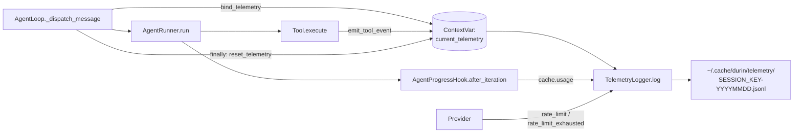
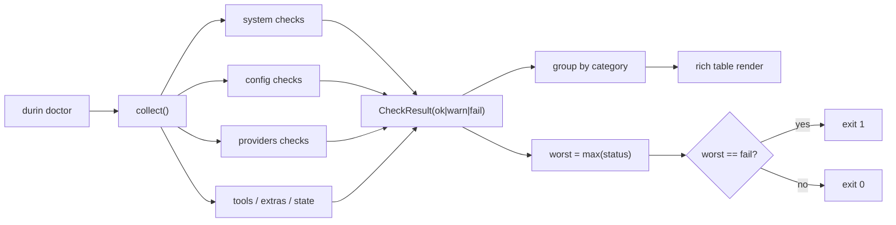

# arch / observability — telemetry, status, doctor, gateway

> Everything that lets the operator see what's happening: structured
> JSONL events, the `status` snapshot, the `doctor` diagnostics, and the
> long-lived gateway daemon.

---

## 1. Telemetry

`durin/telemetry/logger.py` provides:

- `TelemetryLogger` — append-only JSONL writer with event-count cap.
- `log(event_type, data)` — generic event emission.
- `log_rate_limit(...)` / `log_rate_limit_exhausted(...)` — provider rate-limit signal.
- `get_session_logger(session_key)` — date-suffixed per-session log files in `~/.cache/durin/telemetry/`.
- `bind_telemetry(logger)` / `current_telemetry()` / `reset_telemetry(token)` — ContextVar-based per-task binding so tools can resolve the active session's logger without explicit constructor wiring (parallels `bind_file_states`).

Wiring points:

- **Provider rate limits**: `provider.set_telemetry()` is called in `AgentLoop.from_config`; the provider emits `provider.rate_limit{,_exhausted}` events directly.
- **Per-task tool events**: `AgentLoop._dispatch_message` calls `bind_telemetry(get_session_logger(session_key))` before invoking the runner and `reset_telemetry(token)` in the finally block.

Tool-level instrumentation:

- `read_file` emits `tool.read_file` with `{path, offset, limit, total_lines, returned_lines, result_chars, kind, truncated, dedup}` on successful text-read and dedup paths.
- `grep` emits `tool.grep` with `{pattern_len, fixed_strings, case_insensitive, output_mode, limit, offset, glob_filter, type_filter, displayed, total_before_pagination, result_chars, truncated, size_truncated, skipped_binary, skipped_large}` on every non-error completion.
- `edit_file` emits `tool.edit_file` with `{path, match_strategy, matches, outcome, old_text_chars, new_text_chars}`. `outcome` ∈ `{edited, not_found, ambiguous}`; `match_strategy` ∈ `{exact, line_trimmed, line_trimmed_quote_normalized, quote_normalized, block_anchor, null}`.
- `repo_overview` emits `tool.repo_overview` with `{path, depth, ecosystems, package_manager, dependency_files_count, entrypoints_count, structure_lines, truncated, result_chars}`.
- `exec` emits `tool.exec.spill` when output exceeds the cap and gets spilled to disk.
- `ask_user_question` emits `ask_user.question_asked` when yielding control.
- `interpret_image` / `interpret_audio` emit `ask_vision.{start, error, end}` / `ask_audio.{start, error, end}` triples.
- `sleep` emits `sleep.start` then `sleep.cancelled` or `sleep.end`.

**Telemetry never changes tool defaults.** Events exist for visibility, not enforcement. Telemetry failures are silently swallowed inside `emit_tool_event` / `_FsTool._emit` so tool calls never break from a logging issue.

### Telemetry schema catalog

Centralised in `durin/telemetry/schema.py`. Each event has a `TypedDict` declaring its required + optional fields; the `EVENTS` dict at the bottom maps every event type to its TypedDict.

A meta-test in `tests/telemetry/test_schema_catalog.py` scans the source tree for `_emit("…")` / `.log("…")` / `emit_tool_event("…")` call sites and asserts the catalog stays in sync in **both directions** — emitted-but-uncatalogued AND catalogued-but-unemitted entries fail the test.

Conventions baked into the schema:

- `session_key: str | None` — present on every event from a loop-control or session-scoped service; absent from tool events and the rate-limit pair (which fire from outside the per-task context).
- `iteration: int` — present on every event from inside the runner's per-turn loop.
- Numeric units in field-name suffix: `*_chars`, `*_tokens`, `*_bytes`, `*_s` (seconds), `*_ms` (milliseconds).
- `snake_case` everywhere; event type strings use `namespace.action`.

---

## 2. Status vs Doctor

Two distinct surfaces, deliberately non-overlapping:

- **`durin status`** — factual snapshot. Sectioned (Model / Providers / Channels / Gateway / Memory / Config), shows only what's configured (no dump of all 25 registry providers), passes no judgement. The `git status` of durin.
- **`durin doctor`** — health diagnostics. Every check is `ok`/`warn`/`fail` with an actionable fix; exit code flips on `fail`. The `flutter doctor` of durin.

### Doctor checks

`durin doctor` runs a flat list of independent check functions, each returning a `CheckResult(name, status, message, fix?, category)` with `status ∈ {ok, warn, fail}`. The orchestrator collects results, groups by category, computes `worst = max(status)` and exits non-zero only when `worst == fail`. `warn` results show up with a suggested fix but don't break the exit code, so the command is safe to wire into CI.

Categories:

- **system** — Python version (≥3.11), durin version.
- **config** — `~/.durin/config.json` exists / parses as JSON / validates against the schema; workspace exists + is writable; both `~/.durin` and `~/.cache/durin` are writable.
- **providers** — at least one provider is usable (api_key, OAuth token file, or `api_base` for local); active model preset resolves.
- **tools** — `git` (warn if missing — needed for editable upgrades).
- **extras** — `fastembed`, `lancedb`, `mcp` import successfully (warn with the matching `pip install 'durin[extra]'` fix).
- **state** — `~/.cache/durin` byte count (warn at > 10 GB).
- **providers (opt-in via `--ping`)** — HTTP GET against the configured provider's `api_base` with 3 s timeout.

`durin doctor --fix` applies the safe subset of automated fixes: creates the workspace directory if missing and replays the config migration. Anything involving an API key or destructive action is left for the user.

---

## 3. Gateway daemon mode

`durin gateway` is a Typer sub-group. With no subcommand it honours `config.gateway.daemon`: `false` → foreground, `true` → detach.

Explicit lifecycle: `gateway start | stop | restart | status | logs`.

- PID file: `~/.durin/gateway.pid`
- Logs: `~/.durin/logs/gateway.log`

The webui dashboard is auto-served when `config.gateway.webui_enabled` is true (the websocket channel is enabled at runtime).

`durin doctor` verifies both the daemon and webui when config requests them.
