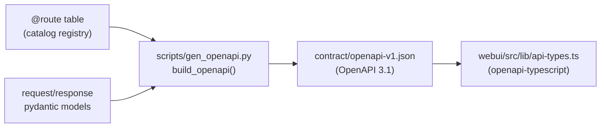

# arch / api — service core, ASGI gateway, OpenAPI contract, auth

> The HTTP surface: a transport-agnostic service core whose `@route`-decorated
> methods are collected into one table that drives both the pydantic-derived
> OpenAPI contract and the unified Starlette/uvicorn gateway. One server on the
> websocket port serves the WS chat endpoint, the generic `/api/v1` HTTP API,
> signed media/session reads, and the SPA. Auth is a persisted, hashed, scoped
> token store.
>
> See [loop.md](loop.md) for the agent loop the WS endpoint feeds,
> [observability.md](observability.md) for the gateway daemon lifecycle.

---

## 1. Transport-agnostic service core

`durin/service/` holds eleven domain services. Each method takes a validated
input DTO plus a `Principal` and returns a result DTO — `(Command|Query, Principal) -> Result` —
or raises a typed `DomainError`. Nothing under `durin/service/` imports
HTTP/WS; adapters map `DomainError.code` to their own status vocabulary.

### DTO bases and the error hierarchy

`durin/service/types.py`:

| Type | Role | Config |
|---|---|---|
| `ServiceModel` (`types.py:22`) | Base for every DTO | `alias_generator=to_camel`, `populate_by_name=True` — accepts snake_case Python names AND camelCase wire aliases off one model |
| `Command` (`types.py:34`) | Mutating input | `extra="forbid"` — an unknown field is a validation error, not a silent drop |
| `Query` (`types.py:44`) | Read-only input | `extra="forbid"` |
| `Result` (`types.py:50`) | Return value | extras allowed — built in code, stays forward-compatible |

`DomainError` (`types.py:59`) carries a class-level `code` and a `details`
dict. The subclasses and their HTTP mapping (the map itself lives in the
adapter, `asgi.py:107`):

| Error | `code` | HTTP |
|---|---|---|
| `UnauthenticatedError` | `unauthenticated` | 401 |
| `ForbiddenError` | `forbidden` | 403 |
| `NotFoundError` | `not_found` | 404 |
| `ConflictError` | `conflict` | 409 |
| `ValidationFailedError` | `validation_failed` | 422 |
| `UnavailableError` | `unavailable` | 503 |

`ValidationFailedError` is named to avoid colliding with
`pydantic.ValidationError`, which the adapter also handles (→ 422). Any
unmapped `code` falls through to 500.

### Principal and scopes

`durin/service/principal.py`. `Principal` is a frozen dataclass —
`subject`, `scopes: frozenset[str]`, `kind` (`"local" | "remote"`). Two
constructors: `Principal.local()` (in-process TUI/cron — full authority via
`Scope.ADMIN`, no token) and `Principal.remote(subject, scopes)` (token-derived).
`principal.require(scope)` raises `ForbiddenError` when the scope is absent;
`Scope.ADMIN` short-circuits every check (`principal.py:76`).

`Scope` (`principal.py:20`) is the single authorization vocabulary, named
`<domain>:<read|write>` — `settings`, `secrets`, `skills`, `cron`, `sessions`,
`config`, `memory`, `system`, plus `admin`. The route table references these
same values. Unused scopes are removed rather than left speculative, so chat has
no scope — chat flows through the WS endpoint, not `/api/v1`.

### The route table

`durin/service/registry.py`. The `@route` decorator (`registry.py:42`) stashes
a frozen `RouteSpec` (`registry.py:26`) on the method under `__route_spec__`
and returns the method **unchanged** — so it stays a plain awaitable the TUI
calls directly with `Principal.local()`. `RouteSpec` carries `verb`, `path`,
`scope` (a `Scope` value or `None`), `request_model`, `response_model`,
`summary`.

`ServiceRegistry.register(name, service)` (`registry.py:98`) walks the
instance's attributes, collects every `@route` method into a `BoundRoute`
(spec + service name + handler), and raises `ValueError` on a duplicate
service name or duplicate `(verb, path)` — wiring bugs fail loudly at startup.
`registry.routes` returns them in registration order.

Two builders consume the registry:

- `durin/service/wiring.py::build_service_registry` — the **functional**
  registry, wired to real `config` / `session_manager` / `cron_service` / `bus`.
  Registers all eleven services (`wiring.py:54`). Shared by the gateway front
  door and (historically) the WS channel so both serve the same service set.
- `durin/service/catalog.py::build_catalog_registry` — a **deps-less** registry
  for spec-reading only (the OpenAPI generator). Services are instantiated with
  inert `None`/stub deps because no method is ever called through it
  (`catalog.py:58`). `SERVICE_CLASSES` (`catalog.py:43`) is the canonical list.

### Representative services

A service is a plain class; methods carry `@route` and call `principal.require()`
first. Patterns worth noting:

- **secrets** (`service/secrets.py`) — `GET`/`POST`/`DELETE /api/v1/secrets`.
  Values never leave the store; results carry a masked `value_hint`. The sync
  `store_entry` (`secrets.py:110`) is the single write path shared by the HTTP
  route, the WS frame handler, and the TUI secret prompt — in-process callers
  are not forced onto the event loop to write a credential.
- **sessions** (`service/sessions.py`) — list/messages/webui-thread/delete/rename.
  Returns **unsigned** data; HMAC media-URL signing is an adapter concern the
  service must not perform (it needs the channel's per-process `_media_secret`).
  `webui_thread` (`sessions.py:185`) validates the key + enforces scope, then
  returns a sentinel — the adapter builds the real payload with the signing
  callback.
- **memory** (`service/memory.py`) — thin wrapper over `durin.memory.graph_api`.
  Built with a `workspace_resolver` callable (re-evaluated per call) rather
  than a captured path. `ForgetResult` (`memory.py:50`) carries a `status: int`
  that the adapter promotes to the HTTP code.

The full service set: `secrets`, `cron`, `sessions`, `settings`, `config`,
`skills`, `memory`, `health`, `commands`, `oauth`, `auth`.

---

## 2. The pydantic-derived OpenAPI contract



`scripts/gen_openapi.py` is the **only** source of `contract/openapi-v1.json`
— never hand-edited. `build_openapi` (`gen_openapi.py:66`) walks
`build_catalog_registry().routes`: each route becomes a path/verb operation
carrying `summary`, an `operationId` of `{service}_{method}`, an
`x-required-scope` extension (when scoped), and `requestBody` / `responses`
`$ref`s. `_collect_schemas` (`gen_openapi.py:39`) calls each model's
`model_json_schema`, hoists pydantic's `$defs` sub-models into
`components/schemas`, and leaves only `$ref` pointers behind. Output is sorted
JSON for a stable diff.

Today: **64 operations across 55 paths, 103 schemas** (GET/POST/DELETE).

**Drift gate.** `python scripts/gen_openapi.py --check` (`gen_openapi.py:154`)
re-derives the document and exits 1 if it differs from the committed file —
so a service-model change that isn't regenerated fails CI. **TypeScript
types** are generated from the committed contract via
`npm run gen:api-types` → `openapi-typescript ../contract/openapi-v1.json -o
src/lib/api-types.ts` (`webui/package.json:13`). The contract is the single
seam between the Python services and the TS client types.

---

## 3. Unified Starlette/uvicorn ASGI gateway

`durin/api/asgi.py`. One uvicorn server on the **websocket port** serves the
whole HTTP+WS surface. `build_gateway_http_app` (`asgi.py:470`) composes it;
the controller (`durin/cli/commands.py:1828`) builds the dependency-wired
registry, calls the factory, and runs `uvicorn.Server(...).serve()` as one
task in the gateway's event loop. The optional second-port server
(`gateway.api_port`, `schema.py:765`) is an off-by-default deployment knob
that mounts only `build_api_app` — not the primary door.

### What the gateway app assembles

`build_gateway_http_app` builds this route list (Starlette matches in list
order, first match wins — order is load-bearing), `asgi.py:623`:

| # | Route | Handler | Notes |
|---|---|---|---|
| 1 | `WebSocketRoute` at the channel's WS path | `chat_ws_endpoint` | Precedes HTTP so the upgrade isn't swallowed |
| 2 | `GET /api/v1/sessions/{key}/messages` | `v1_session_messages` | Calls the service, then signs media URLs |
| 3 | `GET /api/v1/sessions/{key}/webui-thread` | `v1_webui_thread` | Validates via service, builds payload with signing callback |
| 4 | `*api_app.routes` | `build_api_app` output | The generic `/api/v1` surface (below) |
| 5 | `GET /webui/bootstrap` | `bootstrap_handler` | Token-minting surface (§5) |
| 6 | `GET /api/media/{sig}/{payload}` | `media_handler` | Signed media fetch |
| 7 | `Mount("/", _SpaStaticFiles)` | SPA assets | Only when a built dist dir exists |

Routes 2–3 are registered **ahead of** the generic `/api/v1/sessions/*` routes
because media/transcript signing needs the channel's per-process
`_media_secret` — an adapter concern the generic handler cannot do. The WS
endpoint authenticates before `accept()` and closes with 1008 on reject
(`asgi.py:601`); `StarletteConnectionAdapter` (`asgi.py:59`) satisfies the same
interface as the channel's `ConnectionAdapter`, so `WebSocketChannel._run_connection`
works unchanged. `_SpaStaticFiles` (`asgi.py:665`) serves `index.html` on a
404 for SPA history-mode routing.

### The generic `/api/v1` surface — `build_api_app`

`build_api_app` (`asgi.py:366`) turns the route table into Starlette `Route`s:

- A hardcoded unauthenticated `GET /api/v1/health` liveness probe
  (`asgi.py:390`, distinct from `HealthService`, which serves
  `/api/v1/extras/*` and `/api/v1/logs`).
- One `Route` per **read** route — `_is_read_route` (`asgi.py:180`): GET whose
  scope ends in `:read` or is `None`.
- One `Route` per **write** route — `_is_write_route` (`asgi.py:188`): any
  non-GET verb.

**Route-ordering invariant.** `_route_order` (`asgi.py:399`) sorts routes so a
literal path segment is matched before a `{param}` at the same position: each
`{param}` segment maps to the high sentinel `￿`, sorting it after every
literal — "most specific first". Without it, GET `/skills/{name}` would shadow
literals like `/skills/search`, `/skills/quarantine` (the registry collects
methods in alphabetical attribute order).

**Read handler** (`_build_handler`, `asgi.py:220`): resolves the principal
(401 if missing); merges query params (multi-value via `.getlist`) with path
params (path wins); constructs `request_model` (422 on `ValidationError` via
`_build_422`); awaits the handler (`DomainError` → problem+json); serializes.

**Write handler** (`_build_write_handler`, `asgi.py:282`): same shape but the
input is `await request.json()` (absent/empty body → `{}`) merged with path
params (path wins). Used for POST/DELETE/PATCH.

`_result_response` (`asgi.py:205`) serializes `result.model_dump()` at status
200, except when the result carries an **integer** `status` attribute (only
`SkillsResult` and `ForgetResult` do), which becomes the HTTP code — e.g. 409
when a skill import needs confirmation.

### Wire-shape conventions

- **Input is camelCase-or-snake_case**: `ServiceModel` accepts both
  (`populate_by_name=True`), so the TS client sends camelCase and the request
  model parses it.
- **Output is `model_dump()` with no `by_alias`** — so responses come out in
  the model's **snake_case** field names. (The camelCase alias generator
  governs *input* aliasing; serialization defaults to field names.)

### Error mapping — RFC 9457

`_problem_response` (`asgi.py:126`) maps a `DomainError` to an
`application/problem+json` body:

```json
{ "type": "urn:durin:error:<code>", "title": "...", "status": <int>, "detail": "<message>" }
```

`_build_422` does the same for a pydantic `ValidationError`, with
`detail = exc.errors()`. `RequestIdMiddleware` (`asgi.py:351`) stamps
`X-Request-Id` on every response (echoing an inbound one or minting a UUID).

### Auth resolution

`resolve_principal_from_headers` (`asgi.py:146`) is the gateway's auth seam:

1. `Authorization: Bearer <token>` → `auth.resolve(token)` (persisted store).
2. Else, if the token equals a non-empty `static_token` → `Principal.remote("static", {ADMIN})`.
3. Else `None` → the handler returns 401.

The `static_token` is the websocket channel's configured `token`
(`commands.py:1840`). The legacy in-memory dual-accept and query-param token
live only in the WS channel's own handshake path, not here.

---

## 4. Persisted scoped auth

`durin/security/api_tokens.py::ApiTokenStore` — file-backed at
`~/.durin/api_tokens.json`. Each token stores a **per-token salt + SHA-256
hash** (`_hash_token`, `api_tokens.py:39`); the plaintext (`nbwt_<urlsafe>`)
is returned once at `issue` and never persisted. `resolve` (`api_tokens.py:142`)
re-hashes the candidate with the stored salt and compares with
`hmac.compare_digest`, skips expired entries, and stamps `last_used_at`.

| Concern | Mechanism |
|---|---|
| TTL | `issue(ttl_s=…)` sets `expires_at`; `resolve` rejects expired |
| Purge | `_purge_expired` (`api_tokens.py:81`) drops expired on every `issue` |
| Cap | `_enforce_cap` (`api_tokens.py:92`) keeps ≤ `_MAX_TOKENS` (10 000), evicting oldest |
| Atomic writes | `_write_text_atomic` (`api_tokens.py:78`) — crash-safe |
| Thread-safety | module-level `threading.Lock` wraps every op |
| Media secret | `get_or_create_media_secret` (`api_tokens.py:196`) stores the 32-byte HMAC media secret (base64) in the same file, so signed media URLs survive a restart |

`durin/service/auth.py::AuthService` wraps the store. `issue_token` /
`list_tokens` / `revoke_token` are scoped routes under `/api/v1/auth/tokens`
(`system:write` / `system:read`); `list_tokens` and the store's `list_tokens`
never return hashes or salts. `resolve(plaintext)` (`auth.py:146`) is **not** a
route — the gateway calls it to build a `Principal.remote` from the stored
scopes before dispatching.

**Token-minting surface.** `GET /webui/bootstrap` (`bootstrap_handler` →
`channel._handle_bootstrap`, `durin/channels/websocket.py:672`) mints an
`admin`-scoped token through the persisted store (`auth_svc._store.issue`,
`durin/channels/websocket.py:696`) and
returns `{token, ws_path, expires_in, model_name, requires_secret}`. Access is
gated: when a `token_issue_secret` or static `token` is configured the request
header must match it (works behind a reverse proxy); otherwise it is
localhost-only.

**CLI.** `durin auth token {list,issue,revoke}` (`durin/cli/auth_cmd.py`) is a
thin sync CLI over `ApiTokenStore`, no gateway required. `issue` validates
scopes against the `Scope` enum and prints the plaintext once.

---

## 5. How the three clients consume it

| Client | Transport | How |
|---|---|---|
| **webui** | same-origin `/api/v1` over HTTP | `webui/src/lib/api.ts` |
| **TUI** | in-process method calls + `MessageBus` for chat | direct `Service().method()` |
| **CLI** | direct store/service calls | e.g. `durin auth token` |

**webui** (`webui/src/lib/api.ts`). A `request<T>` wrapper (`api.ts:34`) adds
`Authorization: Bearer <token>` and `credentials: "same-origin"`, and on a 401
mints a fresh token (the gateway restarted) and retries once. `post`/`del`
(`api.ts:60`, `:68`) send `Content-Type: application/json` with a
`JSON.stringify(body)` — mutations are POST/DELETE with a JSON body (no more
GET-with-query). Every call targets `${base}/api/v1/...`; types come from the
generated `api-types.ts`.

**TUI** calls service methods directly — `@route` left them plain callables, so
e.g. the secret prompt invokes `SecretsService().store_entry(...)`
(`durin/cli/tui/screens/secret_prompt.py:102`) with no HTTP and no adapter
indirection; chat still flows through the `MessageBus` / `AgentLoop`.

**CLI** uses the same building blocks directly (the auth CLI operates on
`ApiTokenStore`; other commands call services or the config loader).

---

## Last updated: 2026-06-16 (as-built for the API platform; branch `worktree-api-platform`)
