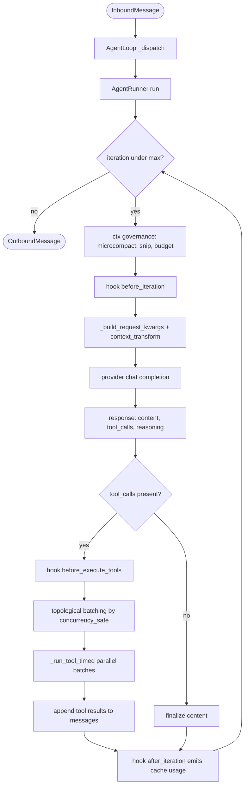
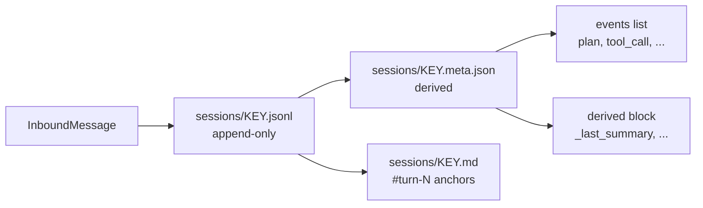

# arch / loop — agent loop, runner, sessions, providers

> The control-flow surface: how a turn flows from inbound message → LLM
> call → tool execution → response. Covers the iteration loop, runner
> guards, hook surface, agent modes, sessions, providers, sandboxing,
> and long-running goals.
>
> See [memory/00_overview.md](memory/00_overview.md) for the memory subsystem,
> [observability.md](observability.md) for telemetry/doctor/gateway,
> [ux.md](ux.md) for CLI/TUI surfaces.

---

## 1. Iteration flow



Driven by `AgentRunner.run()` in [durin/agent/runner.py](../../durin/agent/runner.py). Default `max_iterations = 200`. Hooks attach via the generic `AgentHook` interface — no hooks are bundled by default.

### Runner state-tracking + guards

All turn-scoped, defensive. They shape behaviour only when the model misbehaves or the environment fails.

| Guard | What it does | Where |
|---|---|---|
| **Loop detection** | `sha256(tool_name + sorted args)` of any HARD-failure tool call is cached for the turn; a repeat hit short-circuits with a synthetic "BLOCKED" tool result. Pytest-style soft failures are NOT recorded. | `runner.py::_run_tool` |
| **Topological tool ordering** | Walks the model's tool list in order, groups only CONSECUTIVE `concurrency_safe=True` tools into a parallel batch. Mutations + exclusives become singletons. Read-after-write semantics preserved. Tools default to `read_only=False` — opt-in safety. | `runner.py::_partition_tool_batches` |
| **Reasoning-phase truncation recovery** | When `finish_reason=length` and `content` blank but `reasoning_content` non-empty, append the partial reasoning + cue asking the model to wrap up. | `runner.py` length-handling branch |
| **Idle-timeout circuit breaker** | After `DURIN_MAX_CONSECUTIVE_IDLE_TIMEOUTS` (default 1, trips on 2nd) consecutive `error_kind=timeout` iterations, run terminates with `stop_reason=circuit_breaker_idle_timeout`. Forward progress resets. | `runner.py` top of iteration loop |
| **Per-block tool-result validation** | Text > 100 KB truncated in place; `image_url` data-URL > 5 MB → text placeholder; `input_audio` > 10 MB likewise. HTTP/HTTPS image refs pass through. | `utils/tool_result_validation.py` |
| **Re-sanitize after `context_transform`** | Runs `drop_orphan_tool_results` + `backfill_missing_tool_results` once more after the optional transform, so a dropped message mid-pair doesn't ship an invalid `tool_use`/`tool_result` mismatch. | `runner.py::_build_request_kwargs` |
| **Compaction grace window** | When `DURIN_LLM_TIMEOUT_S` is about to fire and `is_compacting` callback returns True, deadline extends once by `DURIN_COMPACTION_GRACE_S` (default 30s). Emits `compaction.grace_extended`. One-shot per request. | `runner.py::_await_with_compaction_grace` |
| **Per-model `parallel_tool_calls` gating** | `agents.defaults.parallel_tool_calls` is a substring-keyed dict mapping model name → bool. Provider injects the flag only on match AND when `tools` is non-null. Emits `provider.parallel_tool_calls_injected` once per unique triple per process. | `OpenAICompatProvider._resolve_parallel_tool_calls` |
| **Per-turn aggregate tool-result budget** (retroactive) | Sums tool result sizes; over `DURIN_TURN_BUDGET_CHARS` (default 200 KB) spills the largest not-yet-persisted results to disk, largest first, until aggregate fits. `=0` disables. Emits `turn_budget.enforced`. | `runner.py::_enforce_turn_budget` |
| **Live per-tool output spill** (at moment of overflow) | Distinct from the retroactive turn budget: when a single tool's output exceeds its own budget, the FULL content is written to `<ws>/.durin/spills/` *as it overflows* (not later during compaction), and the model gets a truncated head+tail plus a `read_file` reference. Used by `exec`/shell. | `agent/tools/output_spill.py::truncate_with_spill` |
| **Pre-emptive compaction trigger** | Fires when `estimated_tokens > preemptive_compact_ratio * context_window` (default 0.5; 1M-window models override to ~0.15). Emits `compaction.preemptive_trigger`. | `agent/memory.py::Consolidator` |
| **Mid-turn precheck signal** | After sanitize pipeline each iteration, estimates token cost; if over input budget, aborts with `stop_reason=mid_turn_precheck_overflow` BEFORE the LLM call. Emits `mid_turn_precheck.overflow`. | `runner.py::_mid_turn_precheck` |
| **Compaction lock aggregate timeout** | Per-session compaction lock bounded by `DURIN_COMPACTION_LOCK_TIMEOUT_S` (default 180s). `=0` disables. Emits `compaction.lock_timeout`. | `agent/memory.py::Consolidator._lock_timeout_s` |
| **Tool-call argument repair** | `html.unescape` (only on entity markers), strips ≤96 leading garbage chars + ≤3 trailing, then `json_repair.loads`. Bounded by 64 KB buffer. Emits `tool_call.argument_repair`. | `utils/tool_argument_repair.py` |
| **Unknown-tool loop guard** | Counts calls per unknown tool name per turn; over `DURIN_MAX_UNKNOWN_TOOL_ATTEMPTS` (default 2) terminates with `stop_reason=unknown_tool_loop_guard`. Surfaces real tool names in the error. Emits `unknown_tool.loop_guard`. | `runner.py` top of `should_execute_tools` |
| **History image/audio prune** | Keeps most recent `DURIN_HISTORY_IMAGE_PRESERVE_TURNS` (default 3) intact; older user/tool messages get media blocks replaced with `[image data removed - already processed by model]` (or audio equivalent). Idempotent. Emits `history_media.pruned`. | `utils/history_image_prune.py` |
| **3-tier system prompt** | Stable (identity → bootstrap → active-skills → catalog) + Context (active mode suffix) + Volatile (memory → recent history → archived summary), joined with `\n\n---\n\n`. Stable byte-identical across turns for cache hits. | `agent/context.py::ContextBuilder` |
| **Post-compaction loop guard** | Armed for `DURIN_POST_COMPACTION_GUARD_WINDOW` (default 3) tool calls after a compaction round. Same `(name, args_hash, result_hash)` triple repeating `window_size` times aborts with `stop_reason=post_compaction_loop`. Emits `post_compaction_loop.tripped`. | `utils/post_compaction_guard.py` |

**Orientation tool — `repo_overview`.** `agent/tools/repo_overview.py` returns a depth-bounded structure tree plus a detected ecosystem (package manager, entrypoints) so the model can orient before diving in. It is purely structural — no embeddings, no PageRank, no AST — and local-workspace only, reusing the filesystem `_IGNORE_DIRS` noise filter and emitting telemetry. (Adapted from the OpenCode pattern; durin's adjustments are local-path-only + ignore-dir reuse.)

**MCP tool deferral (P3, 2026-06-10).** After MCP servers connect, `AgentLoop._maybe_defer_mcp_tools` checks the aggregate schema size of registered MCP tools against `tools.mcp_deferral.threshold_tokens` (default 20k, ~10% of a 200k window; `enabled: true`). Above it, `agent/tools/mcp_deferral.py` flips the wrappers' `Tool.llm_visible` to False — they stay registered/executable but `ToolRegistry.get_definitions` excludes their schemas — and registers two bridges: `mcp_find_tools(query)` (its description embeds a one-line-per-tool catalog; returns full schemas for matches) and `mcp_invoke(name, arguments)` (proxy execution, args validated at run time). Built-in tools are never deferred — the curated capability surface (memory_search included) must stay structurally visible. Below the threshold nothing changes.

**Runtime MCP server control (2026-06-17).** The gateway runs a single long-lived `AgentLoop`; `_mcp_connections` holds one supervised connection per server, opened at startup for every server whose `MCPServerConfig.enabled` (default true) is set. `connect_mcp_server(name, cfg)` / `disconnect_mcp_server(name)` bring one server online/offline at runtime without a gateway restart (reusing the same supervised-connection path), and `_mcp_connect_errors` records per-server connect failures (cleared on a successful connect or an intentional disconnect). `durin/agent/mcp_runtime.py::McpRuntime` is the read/control handle the gateway passes to the `mcp` service so the webui can show live status, toggle servers, and surface a `failed` status with the connect error. See `arch/api` for the service + routes.

### Tool write durability and fuzzy-edit matching

- **Atomic writes**: every durable write performed by tools and the memory
  vault (`write_file`, `edit_file`, plan files, output spills, all
  `durin/memory/` page writes) goes through
  `durin/utils/atomic_write.py` — tempfile in the target directory + fsync +
  `os.replace`, preserving file mode and updating symlinked targets in place.
  A crash mid-write can no longer leave a truncated file. New durable write
  sites MUST use these helpers instead of `Path.write_text`.
- **edit_file block-anchor matching**: the block-anchor fallback scores
  candidate blocks by best-match containment of `old_text`'s middle lines
  (insertion-tolerant, truncation-rejecting), thresholds 0.66 (single
  candidate) / 0.85 (multiple). Non-exact matches are disclosed in the tool
  result so the model can re-verify. Calibration cases live in
  `tests/tools/test_edit_block_anchor.py`.
- **grep engine**: when ripgrep is installed it pre-filters candidate files
  (`rg -l --no-ignore --hidden`, same ignore dirs and size cap as the Python
  walk — gitignored agent dirs stay searchable); matching and formatting
  always run in Python, so results are identical with or without rg. The
  `tool.grep` telemetry event records which engine served each call.
- **Post-edit check**: after a successful `write_file`/`edit_file`, a
  user-configurable per-language linter (`tools.post_edit_check.checkers`,
  extension → command template with `{file}`; default `py → ruff check`)
  runs as a subprocess and its findings (capped at `max_lines`) are appended
  to the tool result — the non-LSP equivalent of opencode's post-edit
  diagnostics. Graceful skip on disabled config, unknown extension, missing
  binary, timeout or checker crash: a check failure never breaks an edit.
  `durin/agent/tools/post_edit_check.py`; telemetry `tool.post_edit_check`.

### Programmatic tool calling (execute_code)

`execute_code` runs a model-written Python script with RPC access to a
whitelisted, read-only/transform tool subset (read_file, write_file,
edit_file, grep, list_dir, web_search, web_fetch, memory_search) via a
generated `durin_tools` stub: tool results stay in the script's variables
and ONLY stdout returns to the model — token compression for batch
operations (one tool result instead of 30; e.g. query memory for many
topics and dedup/rank in-script). `durin/agent/tools/code_execution.py`:
asyncio UDS server on the agent's own loop (durin is async-native, so
hermes-agent's sync→async bridge is unnecessary; design otherwise adapted
from its code_execution_tool, MIT). Server-side enforcement: tool allowlist,
call cap (50), timeout (300 s), stdout 50 KB head/tail truncation; child env
is curated (no ambient secrets), socket 0600 in a private tempdir. v1 is
local + POSIX only (disabled on Windows); no exec stub (a script can already
use subprocess — the deny-list's value is agent-facing ergonomics, not
sandbox security). The allowlist is deliberately read-only/idempotent — no
message/memory-write/cron/spawn. Config: `tools.code_execution.*`.
Telemetry: `tool.execute_code` carries a per-tool call histogram
(`tool_calls`) + `code_chars` to show how the sandbox is actually used.

### Background processes (exec background=true)

`exec(background=true)` runs the full guard pipeline (deny patterns,
workspace boundary, env curation, sandbox wrap) and then hands the spawn to
`durin/agent/tools/process_registry.py`: the process gets its own process
group (`start_new_session=True`), stderr merged into stdout, and an asyncio
reader task feeding a rolling 200 KB tail buffer. The `process` tool
lists/polls/kills tracked processes (kill signals the whole group, SIGTERM →
SIGKILL escalation); discovery is pure polling — pair with the `sleep` tool.
Limits (configurable via `tools.process.{max_running, max_output_chars,
finished_ttl_s}`): 16 concurrent background processes, 200 KB tail buffer,
finished entries kept 30 min.
`AgentLoop.close_mcp` kills all tracked groups on shutdown. v1 limitation
(deliberate): no crash-recovery checkpoint — if the gateway dies, running
background processes are orphaned (keep running, untracked). Telemetry:
`process.spawn` / `process.exit` / `process.kill`. (Design adapted from
hermes-agent's process registry, MIT.)

---

## 2. Hooks system

`durin/agent/hook.py` defines:

```python
class AgentHook:
    async def before_iteration(self, context: AgentHookContext) -> None
    async def before_execute_tools(self, context: AgentHookContext) -> None
    async def after_iteration(self, context: AgentHookContext) -> None
    async def on_stream(...) / on_stream_end(...) / emit_reasoning(...)
    def finalize_content(self, context, content) -> str | None
```

`AgentHookContext` exposes `iteration`, `messages`, `response`, `usage`, `tool_calls`, `tool_results`, `tool_events`, `streamed_content`, `final_content`, `stop_reason`, `error`. Mutating `messages` is the supported way to inject system messages mid-turn (used by `Consolidator`).

`CompositeHook` fans out to a list of hooks with per-hook exception isolation, so a faulty third-party hook can't crash the loop.

No hooks are wired in by default after the prune.

---

## 3. Permission-as-data agent modes

Plan / Build / Explore modes selectable per session. The active mode filters the tool surface at the LLM boundary.

**Core** (`durin/agent/agent_mode.py`). `AgentMode` is a frozen dataclass with `allowed: frozenset[str] | None`, `denied: frozenset[str]`, and optional `prompt_suffix`. Three built-ins:

- `build` — default, no restriction
- `plan` — read-only + `exit_plan_mode` only; investigates and surfaces a plan for user approval
- `explore` — read-only for sub-agents (no exit affordance)

Session state lives in `session.metadata`:

- `agent_mode` — currently active mode name
- `pre_plan_mode` — set when entering plan mode, restored on exit

**Tool filtering in the runner** (`runner.py::_active_tool_definitions`). The runner accepts an optional `mode_provider` callable in `AgentRunSpec`; when present, it's called per iteration and the resulting mode filters the tool definitions sent to the LLM. When the model emits a cached tool name no longer allowed, `_run_tool` short-circuits with a clear denial.

**LLM-facing tools** (`durin/agent/tools/plan_mode.py`):

- `enter_plan_mode(reason?)` — switches into plan mode
- `exit_plan_mode(plan)` — writes the plan to `<workspace>/.durin/plans/plan_<timestamp>.md` and yields to the user for approval. Does NOT actually exit plan mode — the user runs `/build`.

**Verification lint (write-time)**. `exit_plan_mode` hard-rejects a plan without verification criteria: a `## Verification` heading or per-step `verify:` lines (`has_verification_criteria`). Presence check only — English format keywords like frontmatter keys, not content/language detection. Quality is judged by the human at `/build`: the approval gate covers the *definition of done*, not just the steps.

**Verification enters the todo cursor**. The `/build` synthetic trigger instructs seeding the todo list from the plan's steps *including its Verification items as final entries*. `clear_executing_plan_if_todos_done` is unchanged — "all todos completed" now implies verification executed.

**Stall stop-condition**. `update_plan_stall` (called per turn from `loop._state_save`, threshold `agents.defaults.plan_stall_turns`, default 8, 0 disables) fingerprints the todo list; after N consecutive turns without progress, `executing_plan_runtime_lines` appends a "reassess" line. Surfacing only — the V7/V8 PlanHook (forcing verify-before-complete via code) stays refuted; everything here is data the model and the user can see.

**File-based plan storage**. Plans live in `<workspace>/.durin/plans/<session-slug>/plan_<timestamp>.md`. One subdirectory per session, one file per `exit_plan_mode` call. The user can edit the plan file directly with any editor; `/build` picks up the file content as-edited.

**Plan flow with compaction survival**:

| Phase | What happens |
|---|---|
| `/plan` activates | Mode = plan. Prior `executing_plan_path` cleared. |
| `exit_plan_mode(plan)` | Writes plan + sets `session.metadata.active_plan_path`. |
| `/build` approves | `active_plan_path` → `approved_plan_path` (one-shot reminder) AND `executing_plan_path` (persistent pointer). Mode restored. |
| Next turn after /build | `ContextBuilder.build_messages` injects the one-shot `approved_plan_path` reminder, then pops it. |
| Every subsequent turn | `executing_plan_runtime_lines` re-derives a lightweight pointer from `session.metadata["executing_plan_path"]` and injects it into the runtime-context block — same store + cadence as the todo echo, so the "executing an approved plan" frame survives compaction. It points at the plan file (progress is tracked by the todo list); it does **not** splice plan content. A new `/plan` clears the pointer. |

**Telemetry**: `agent_mode.turn_start`, `agent_mode.switch` (`{from, to, trigger}`), `agent_mode.tool_denied` (`{tool, mode}`), `plan_mode.presented` (`{plan_chars, from_mode}`).

**Slash commands** (`durin/command/builtin.py`): `/plan`, `/build`, `/mode [name]`. All universal across channels via the shared `CommandRouter`.

---

## 4. Long tasks and goal state

`durin/agent/tools/long_task.py` defines `LongTaskTool` (register an objective) and `CompleteGoalTool` (close with a recap). Goal state stored in `session.metadata[GOAL_STATE_KEY]` and mirrored into the runtime-context block each turn via `durin/session/goal_state.py`.

After the prune, `complete_goal` no longer consults any plan-tier verification gate. Only requires an active goal.

**Turn budget (optional)**. `long_task(max_turns=N)` stores `max_turns`/`turns_used` on the goal blob; `increment_goal_turns` (per turn, from `loop._state_save`) bumps the counter and `goal_state_runtime_lines` mirrors `Turn budget: used/max`, switching to a wrap-up instruction (`complete_goal` with an honest recap, or renegotiate) once exceeded. Surfacing only — nothing is blocked. `deadline` budgets were considered and dropped (cron covers time-based triggers).

---

## 5. Sessions and persistence



`durin/session/manager.py` handles session lifecycle. Two files per session:

| File | Content | Purpose |
|---|---|---|
| `<key>.jsonl` | Message history + identity metadata (mode, plan path, todos, channel, title) on line 0 | **Source of truth.** Replayable; messages append-only, never trimmed. |
| `<key>.meta.json` | Lifecycle event timeline + a `derived` block (LLM projections) | **Derived state.** Regenerable from `.jsonl` + `memory/history.jsonl`. Safe to delete and rebuild. |

**Split rule**: if losing the file means you can't reconstruct it from the other, it's source-of-truth (`.jsonl`). Otherwise derived (`.meta.json`).

`Consolidator.maybe_consolidate_by_tokens` (in `durin/agent/memory.py`) advances a cursor (`last_consolidated`) when the prompt exceeds budget — generates a narrative summary, persists to `history.jsonl`, writes to `.meta.json::derived._last_summary`, advances the cursor. **The raw `session.messages` list is never modified in-place** — only the cursor advances. The LLM sees `messages[last_consolidated:]` (capped by `max_messages`) + the summary.

The session summary additionally carries a `Memory refs cited in this span` line (P5, 2026-06-10): refs surfaced by `memory_search`/`memory_drill` in the evicted turns, extracted mechanically from the tool results' section markers (`extract_cited_memory_refs`) and appended after the LLM output — the summarizer can't drop or hallucinate them. Pointers only; the model re-drills for bodies. `history.jsonl` (dream input) stays untouched.

`SessionManager._DERIVED_METADATA_KEYS` is the canonical set of `session.metadata` keys that route to the sidecar's `derived` block instead of line-0.

**In-memory per-turn shaping** (does not touch disk):

- `_microcompact` replaces older tool-result content (beyond the most recent `_MICROCOMPACT_KEEP_RECENT`) with a short, **recoverable** placeholder on the copy sent to the LLM: `[<tool> result omitted from context — full output (<N> chars) at <path>; use read_file to recover]`. Already-spilled results keep their existing spill path; never-spilled results are spilled to `.durin/tool-results/` on the spot so the omission is always recoverable. Only when no workspace is configured does it fall back to the opaque `[<tool> result omitted from context]`.
- `_snip_history` further trims the copy from the start when it still doesn't fit the context window.
- **Task-state anchor (concern B):** `build_messages` injects a `<task-state>` block every turn (`durin/agent/task_state.py`), grouping `goal_state`, the `decision_log`, and `todos`/`executing_plan` under `## Goal` / `## Decisions & findings` / `## Current focus`. All derive from `session.metadata`, so the block survives compaction. The `decision_log` (`durin/session/decision_log.py`) has two writers: the `note_decision` tool (real-time) and `Consolidator.extract_decisions`, which runs once per compaction over the just-archived span (`maybe_consolidate_by_tokens`). Caps (`decision_log_max_entries`/`decision_log_max_chars`) and the `decision_log_enabled` toggle are `AgentDefaults` config; writes emit `tool.note_decision` / `decision_log.extracted` / `decision_log.capped`.

### Session meta sidecar shape

```json
{
  "session_key": "websocket:chat42",
  "events": [
    {
      "type": "plan",
      "id": "plan_20260519_143022_123",
      "title": "Refactor authentication module",
      "plan_path": ".durin/plans/websocket_chat42/plan_20260519_143022_123.md",
      "created_at": "2026-05-19T14:30:22.123",
      "approved_at": "2026-05-19T14:35:12.456",
      "msg_index": { "approved": 240, "closed": null },
      "outcome": "executing"
    }
  ],
  "derived": {
    "_last_summary": { "text": "Compaction summary…", "last_active": "2026-05-19T14:35:12.456" }
  }
}
```

Two top-level blocks:

- `events` — lifecycle index. `type` is the discriminator for extensibility (today: `plan`, `tool_call`).
- `derived` — LLM-produced projections; whatever keys are in `_DERIVED_METADATA_KEYS` get persisted here instead of line-0. On load, `_merge_derived_from_sidecar` merges them back into the in-memory metadata dict.

**Plan lifecycle**:

- `exit_plan_mode` tool appends a fresh plan event with `outcome=pending` and extracted title.
- `/build` transitions to `outcome=executing`, recording `approved_at` and `msg_index.approved`.
- `/plan` slash command closes any prior executing plan with `outcome=superseded`.

**Atomic writes**: read → modify → write `.tmp` → `os.replace`. No partial states on disk.

**What does NOT go here**: per-turn telemetry (lives in `~/.cache/durin/telemetry/`), plan contents (own `.md` files), anything already in `session.jsonl`.

---

## 6. Providers

`durin/providers/` ships adapters for Anthropic, OpenAI-compat (Z.ai, OpenRouter, Azure, Ollama, LM Studio, Gemini, and 25+ others), Bedrock, GitHub Copilot, local llama-cpp, OpenAI Codex, and a fallback wrapper. `factory.make_provider(config)` resolves the active provider/model from config + presets.

### Runtime model switching (presets)

The active model is a **preset**, resolved through `loop.set_model_preset(name)`. Named presets (`config.model_presets`) and the reserved `default` (resolved from `agents.defaults.{provider,model}` via `config.resolve_default_preset()`) live in `loop.model_presets`. `/model` switches presets, `/effort` clones the active preset with a different `reasoning_effort`; the picker (`agent/model_picker.py`) commits a `default` ref or an explicit `provider model` pair.

The daemon re-reads the on-disk config at the start of every message (`_refresh_provider_snapshot`, via `factory.load_provider_snapshot`), so a model change in Settings takes effect without a restart. **`model_presets["default"]` is captured once at construction**, so that same refresh re-resolves it through `factory.load_default_preset` (the loop's `default_preset_loader`, wired only on the gateway). Without this, name-based resolution of `default` — which prefers the in-memory preset object over re-reading config (`factory._resolve_model_preset`) — would keep serving the model that was default at startup, silently reverting `/model default` and `/effort` to the previous model.

### OAuth providers (Codex / Copilot)

`is_oauth` providers carry no API key. The token lives in `oauth-cli-kit`'s
`FileTokenStorage` (`codex.json`) and is read at request time via `get_token()`
(which refreshes on its own). For **OpenAI Codex** the user authorizes their
ChatGPT plan instead of paying per token:

- **Authorize** — `durin/providers/codex_device_auth.py` ports the device-code
  flow (request → poll → exchange → persist). `should_use_device_code()` picks
  loopback PKCE (local, via the kit) vs device-code (remote/headless/webui);
  the CLI takes `--device/--loopback`, the webui is always device-code
  (`/api/oauth/codex/{status,start,poll,disconnect}`). An existing `~/.codex`
  session is detected and confirmed, never adopted silently
  (`import_codex_cli=False`).
- **Requests** — `openai_codex_provider.py` hits `chatgpt.com/backend-api/codex/responses`
  with `originator: codex_cli_rs` (avoids Cloudflare 403 on non-residential IPs)
  and `chatgpt-account-id` (re-derived from the access-token JWT so refresh can't
  drop it).
- **Models** — `codex_models.py` lists models live from the Codex backend with a
  static fallback; default `gpt-5.5`.

### Capability metadata

`get_model_capabilities(model, provider, overrides)` resolves a `ModelCapabilities` dataclass via a four-layer fallback:

1. **Explicit override** from `config.model_capabilities` — always wins. Use for private/custom models the snapshot doesn't know.
2. **Vendored consensus snapshot** at `providers/data/model_capabilities.json` (schema v2). Built by `scripts/refresh_model_capabilities.py` in two phases:
   - **Phase 1 community merge** (LiteLLM + OpenRouter + models.dev), filtered by TRUSTED_VENDORS whitelist. Aggregator providers (kilo, vercel, 302ai, etc.) filtered out. Booleans OR-merge; numerics MAX.
   - **Phase 2 vendor-API overlay** (opt-in). When `ANTHROPIC_API_KEY`, `MISTRAL_API_KEY`, `GEMINI_API_KEY` / `GOOGLE_API_KEY` are present, `scripts/_vendor_sources.py` hits the vendor's `/models` and OVERWRITES community values field-by-field. Vendor data is sparse: only fields the vendor explicitly asserts are applied. Each record carries `_authority` ∈ `{vendor, merge}` and `_vendor_sources` list.
3. **Heuristic by model prefix** — last resort for custom/local models (`claude-*` → vision, `glm-*` → text-only, etc.).
4. **Pessimistic default** — all False; safe under-promise.

The dataclass carries `source` naming the layer that produced it. Consumers needing authoritative data gate on `source in {"override", "snapshot"}`.

### Capability bridges (aux models)

When the primary model lacks a modality but the user has declared an `aux_model`, durin exposes a delegating tool:

- `aux_models.vision` → `interpret_image(image_path, question)` — base64-encodes PNG/JPEG/GIF/WEBP, ships as `image_url` block.
- `aux_models.audio` → `interpret_audio(audio_path, question)` — ships WAV/MP3/M4A/OGG/FLAC/WebM as `input_audio` block (chat-multimodal aux only).

Aux providers built once at startup by `loop._build_aux_providers(config)` and handed through `ToolContext.aux_providers`. Tools gate via `enabled(ctx)` classmethod — without an aux configured, the tool never appears in the model's tool list.

### Prompt caching

`_apply_cache_control` stamps Anthropic-style `cache_control: {type: ephemeral}` on system + last user content + last tool definition for providers with `supports_prompt_caching=True` (Anthropic, OpenRouter). Others using automatic prefix caching (Zhipu/MiniMax/DeepSeek/Qwen/Mistral/xAI/StepFun/Moonshot) need no markers — they cache transparently as long as the prefix is stable. `cached_tokens` normalized across all providers (`prompt_tokens_details.cached_tokens`, `cached_tokens`, `prompt_cache_hit_tokens`, `cache_read_input_tokens` all map to the same key). `AgentProgressHook.after_iteration` emits `cache.usage` per turn.

### Token accounting

`build_assistant_message(..., prompt_tokens=...)` stamps provider-reported `prompt_tokens` onto persisted assistant messages as `usage_prompt_tokens`. `latest_prompt_tokens_anchor(messages)` walks backward to find the most recent stamp; `estimate_prompt_tokens_chain` uses that as an authoritative baseline and tiktoken-estimates only the tail.

---

## 7. Sandboxing

Tool execution sandboxed via `durin/agent/tools/sandbox.py`. Three backends:

- `bwrap` — Linux namespace sandbox (production)
- `docker` — Docker container (benchmark-style isolation)
- `testbed` — conda-env wrapper for running inside benchmark containers

The exec tool routes through `wrap_command(sandbox, command, workspace, cwd)`.
