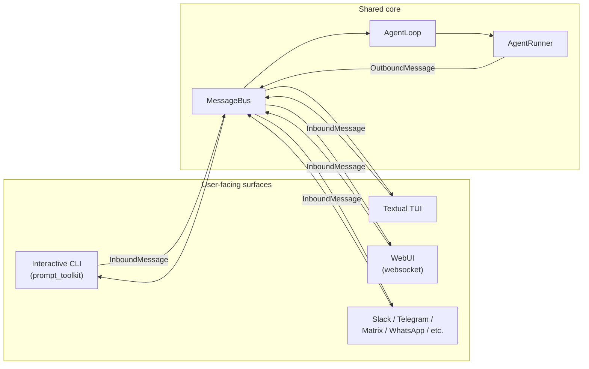
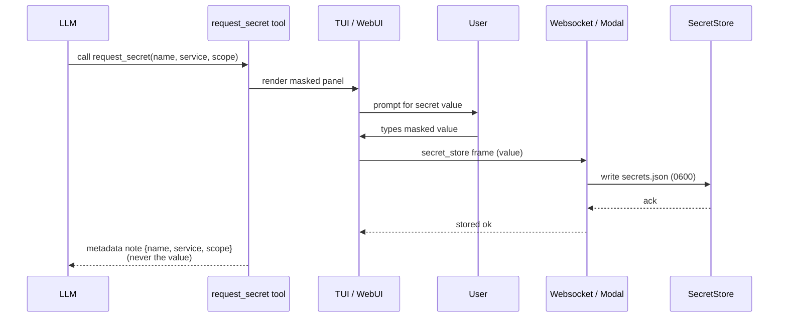

# arch / ux — CLI, TUI, secrets, design system, lifecycle commands

> The user-facing surfaces: interactive CLI, Textual TUI, secrets
> handling, design tokens, and the install/upgrade/uninstall lifecycle.

## Channel architecture



Every surface funnels through the same `MessageBus` + `AgentLoop`. Agent behaviour is identical across channels; only the I/O layer differs. Drag-and-drop (CLI/TUI), slash-command palettes, and per-channel autocomplete are the surface-specific bits.

---

## 1. Interactive CLI (daily driver)

The interactive CLI lives in `durin/cli/`. It routes input through the same `MessageBus` that all channels (Slack, Telegram, etc.) use, so agent behaviour is identical between channels. The CLI-specific ergonomics that make it usable as a daily driver:

### 1.1 Slash commands

`durin/command/builtin.py` registers the canonical set on `CommandRouter`. The handler returns an `OutboundMessage`; the CLI loop renders it.

| Command | Purpose |
|---|---|
| `/new` | Stop current task, start a fresh conversation. |
| `/stop`, `/restart`, `/status` | Process control + diagnostics. |
| `/model [preset]` | Show or switch the active model preset. |
| `/history [n]` | Print last N persisted messages. |
| `/goal <task>` | Mark a long-running goal. |
| `/plan`, `/build`, `/mode` | Agent-mode (plan / build / explore) control. |
| `/dream`, `/dream-log`, `/dream-restore` | Manual memory consolidation + history. |
| `/pairing` | Multi-device pairing flow. |
| `/sessions [filter]` | List saved sessions, sorted by `updated_at`. |
| `/resume <key>` | Switch the active chat to another session in-place (no restart). |
| `/compact [hint]` | Manually consolidate the unconsolidated tail. |
| `/copy` | Copy last assistant message to clipboard. |
| `/name <name>` | Set / show session display name. |
| `/hotkeys`, `/help`, `/quit` (alias `exit` / `:q`) | Discoverability. |

### 1.2 Editor ergonomics

`durin/cli/commands.py:_init_prompt_session` builds the `PromptSession` with three optional capabilities, each gated by what the caller passes:

- `workspace` → `FileReferenceCompleter`. Type `@` after whitespace to fuzzy-substring-match workspace files. Cached walk (max 1000 files) with sensible excludes (`.git`, `__pycache__`, `.venv`, `node_modules`, `.durin`, …).
- `presets_getter` → `ModelPresetCompleter` plus a Ctrl+L key binding that pre-fills the buffer with `/model ` to start a picker flow.
- `footer_getter` → `bottom_toolbar`-driven persistent footer (`durin/cli/footer.py`). On every redraw renders `session · model (preset) · ~tokens/window (%) · mem:N vec✓|✗`. Failures in the getter are swallowed so the prompt never blocks.

### 1.3 Drag-and-drop

`durin/cli/dragdrop.py` pre-processes user input before bus publish:

1. Scan for absolute paths in the typed text (bash-style escaped spaces handled, `~` expansion supported).
2. For each existing file:
   - **Image** (`.png`/`.jpg`/`.gif`/`.webp`/`.bmp`/`.svg`) or **audio** (`.mp3`/`.wav`/`.m4a`/`.flac`/`.ogg`/`.opus`) → copy to `<workspace>/.media/<sha>.<ext>` (idempotent by content hash), replace the path in the text, surface the workspace-relative path via `InboundMessage.media`.
   - **Document** (markdown / text / pdf) → leave the path untouched so the agent's `read_file` tool can resolve it directly.
3. Unsupported extensions, non-existent paths, and directories are left as-is.

### 1.4 Session switching mechanism

`/resume <key>` returns an `OutboundMessage` whose metadata carries `_switch_chat_id`. `run_interactive`'s `_consume_outbound` watches for that key and updates `cli_chat_id` via `nonlocal`. The next `bus.publish_inbound` uses the new key — no process restart needed. The persistent footer sees the change on its next redraw.

---

## 2. Textual TUI (opt-in)

Second interactive surface lives under `durin/cli/tui/`. Runs on top of the same `MessageBus` and `AgentLoop` as the legacy CLI; only the I/O layer differs. Launched via `durin agent --tui`.

### 2.1 Layout

```
┌─ HeaderBar ────────────────────────────────────────────────────┐
│ durin · <workspace> · <model> (<preset>)                       │
├────────────────────────────────────────────────────────────────┤
│                                                                │
│  ChatView (scrollable, mouse-friendly)                         │
│    MessageBubble role=user      "the user message"             │
│    MessageBubble role=assistant "streamed assistant reply"     │
│    MessageBubble role=tool      "tool call result"             │
│    MessageBubble role=system    "command / system note"        │
│                                                                │
├────────────────────────────────────────────────────────────────┤
│ InputArea  (suggester: /commands  and  @files)                 │
├────────────────────────────────────────────────────────────────┤
│ FooterBar  session · model · ~tokens/window (%) · mem · vec   │
└────────────────────────────────────────────────────────────────┘
```

Each piece is a separate widget in `durin/cli/tui/widgets/`. Widget CSS lives next to the widget; app-level CSS in `durin/cli/tui/durin.tcss`.

### 2.2 Bus integration

`DurinApp.on_mount` spawns two background tasks:

- `agent_loop.run()` — inbound dispatcher.
- `_consume_outbound` — drains `bus.consume_outbound()`, maps metadata flags to widget operations:

| metadata flag | effect |
|---|---|
| `_stream_delta` | append to the open assistant bubble |
| `_stream_end` | close the assistant bubble |
| `_streamed` | end-of-turn marker (no UI side-effect) |
| `_switch_chat_id` | mutate `cli_chat_id` + refresh footer / header |
| `render_as="text"` | render as a system bubble |
| (other) | render as an assistant bubble |

User submission goes through the same pipeline as the legacy CLI: surrogate-sanitize → drag-and-drop pre-processor → publish `InboundMessage(_wants_stream=True, media=[...])`.

### 2.3 Editor ergonomics (parity with CLI)

- `SlashCommandSuggester` — `/` prefix surfaces a known command (palette source: `BUILTIN_COMMAND_SPECS`).
- `AtFileSuggester` — `@<prefix>` matches workspace files (same exclude rules as `FileReferenceCompleter`).
- `MultiModeSuggester` — dispatcher between the two.
- Drag-and-drop pre-processor reuses `durin.cli.dragdrop.process_dragged_paths`.

### 2.4 Key bindings

| Binding | Action |
|---|---|
| `Ctrl+Q` / `Ctrl+D` | quit |
| `Escape` | abort: calls `agent_loop._cancel_active_tasks` and clears the open assistant bubble |
| `Ctrl+T` | toggle dark/light theme |
| `Ctrl+L` | open the model picker modal (`open_model_picker` pushes `ModelPickerScreen`) |

### 2.5 TUI Pilot harness

`durin/cli/tui/probe.py` adds `screen_text()` — plain-text capture of what the Textual TUI actually paints (via compositor strips) — plus `type_text()` / `run_step()` scripted-input helpers. `scripts/tui_smoke.py` wraps them into a CLI so the TUI can be driven headlessly and *seen* without a real terminal. `tests/cli/tui/` asserts on the rendered output through the same path.

---

## 3. Per-channel slash-command UX

Mode dispatch (`/plan`, `/build`, `/mode`) works in every channel. Native autocomplete varies:

| Channel | Status today | Improvement room |
|---|---|---|
| **CLI** | Dispatch works. | Add a `prompt_toolkit` completer reading `builtin_command_palette()`. |
| **WebUI** | Full autocomplete via `<SlashCommandPalette>` wired to `/api/commands` — `/plan`, `/build`, `/mode` appear automatically. | Optional visual badge in the composer header when `mode != build`. |
| **Telegram** | Dispatch works. Native `/` menu only lists commands explicitly registered via `BotCommand(...)` in `channels/telegram.py`. | Add `BotCommand("plan"/"build"/"mode", …)`. |
| **Slack / Matrix / WhatsApp / DingTalk / MoChat** | Dispatch works. Slash commands appear as plain messages, no native autocomplete (each channel's API differs). | Per-channel registration optional; dispatch already works. |

---

## 4. Secrets subsystem

Full design: archived `docs/archive/11_secrets_design.md`. API keys are no longer stored inline in `config.json`. The store is `~/.durin/secrets.json` (mode `0600`, outside the config tree). Each entry has two axes — `service` (classification, non-unique) and `scope` (consumer authorization) — plus account/description/origin.

**At-rest threat model — isolation, not encryption.** The store is plaintext on a `0600` file, deliberately *not* encrypted. A passphrase-encrypted store would buy little: `$HOME` is already user-readable and the agent needs the value in clear to use it, so encryption-at-rest is theatre unless backed by an OS keyring or an external manager (see §4.3). What actually moves the needle is the value living **only** in the store and in the env of the one subprocess that needs it — never in `config.*`, the model context, or the chat. The same posture is used by hermes (`~/.hermes/.env`, 0600) and openclaw (`~/.openclaw/*.json`, 0600); neither encrypts at rest either.

Config fields hold a `${secret:NAME}` reference; `resolve_secret()` turns it into plaintext lazily at the point of use, so the value never re-enters the `Config` object, logs, or telemetry. Wired into `Config.get_api_key()` and the provider factory.

`durin secret` manages the store; `durin secret migrate` moves pre-existing plaintext provider keys in. The onboard wizard writes new keys straight to the store as references.

Resolution is wired into providers, the web-search tool, and channel construction — secrets work everywhere config expects a credential.

**Phase 2 — redaction + exec injection**: before any tool result reaches the model the agent runner redacts it through `SecretRedactor`, two layers — **value-based** (exact stored values → `«redacted:NAME»`) and **pattern-based** (credential-*shaped* strings → `«redacted»`: vendor prefixes `sk-`/`ghp_`/`AKIA`/…, JWTs, PEM blocks, and `KEY=value`/JSON secret fields). The pattern layer (`_apply_patterns` in `security/secrets.py`) catches credentials the store does not know — notably ambient values surfaced via `exec.allowed_env_keys`. `exec` output is redacted **before** it is spilled to `<ws>/.durin/spills/` (the `redact=` hook in `output_spill.py`), so secret values never land on disk. `ExecTool` injects `exec`-scoped secrets into the subprocess env so scripts use them without the agent ever seeing the values.

**Agent tools** (`agent/tools/secrets.py`): `list_secrets` lets the agent discover available credentials (metadata only); `request_secret` declares one the agent needs. `durin doctor` flags dangling `${secret:}` references.

### 4.1 Interactive `request_secret`



When the agent calls `request_secret`, the TUI and web render a purpose-built panel (not the generic tool block) so the user can supply the value **without it ever entering the conversation**. The rule is two transport channels:

- **Agent channel** — the `request_secret` tool call, and afterwards a metadata-only "stored" note. Never the value.
- **Secret channel** — a masked input → client code → `SecretStore`. Only the value, and it stops at the store.

The web sends the value over the authenticated **websocket** as a `secret_store` frame (never a URL query — a GET query string leaks into history, proxies and logs); the gateway writes the store and replies with an ack. The TUI opens a masked `ModalScreen` and writes `SecretStore` directly. After a successful store the agent receives a metadata note (`name` / `service` / `scope`) so it knows the secret is available — as `$NAME` to `exec` — but is never told the value.

### 4.2 Managing stored secrets

Three write surfaces, all landing in the one `SecretStore`:

- **CLI** — `durin secret set / list / show / rm / grant / revoke / migrate` (`durin/cli/secret_cmd.py:39-196`); the value is typed at a hidden prompt. As a separate process the CLI just `save()`s — the next `durin` invocation loads it fresh, so no in-process reload is needed.
- **Web Settings** — the config view renders each `${secret:NAME}` reference as a `SecretRefRow` (`webui/src/components/settings/ConfigSettings.tsx:123`). *Rotate* opens a masked dialog that writes the new value over the same `secret_store` websocket frame as `request_secret`, never a query string (`ConfigSettings.tsx:154`). `GET /api/secrets` lists entries (metadata only — `_handle_secrets_list` never returns a value, `durin/channels/websocket.py:1287`); `/api/secrets/delete` removes one (`websocket.py:1313`).
- **TUI** — the masked `SecretPromptScreen` modal (`durin/cli/tui/screens/secret_prompt.py`), shared with the `request_secret` flow above.

Every **in-process** writer — `store_secret` (provider keys / onboard wizard), the `secret_store` envelope, and the TUI modal — calls `get_secret_store(reload=True)` after saving (`durin/security/secrets.py:350`, `websocket.py:2438`, `secret_prompt.py:112`), so resolution and redaction see a freshly stored secret on the very next use: `build_redactor()` rebuilds from the reloaded store (`secrets.py:408`). The CLI path does not reload — it is a separate process.

### 4.3 Future: third-party password managers

The store is intentionally one thin mechanism — the value always lives in `secrets.json`. A natural future extension, modelled on openclaw's `SecretRef {source, provider, id}` indirection, would let a `${secret:NAME}` reference resolve from an **external manager** instead of the local store: a `source` of `exec` (run `op read`, `pass show`, `security find-generic-password`, or a Vault client) or `file` (read a path managed elsewhere). Operators already running 1Password, `pass`, gopass, the macOS Keychain, or HashiCorp Vault could then keep the value out of durin's own files entirely, while the plaintext-`0600` store stays the zero-config default. It would be a user-configurable opt-in, not a replacement — and is **not implemented today**.

---

## 5. Design system

Durin's three visual surfaces share one palette system. Source of truth: `design/DESIGN.md` (the 9-section spec) + `design/tokens.css` (the token values). Two axes — palette (`ithildin` default, `forge`, `mithril`) × mode (`light`/`dark`), six token sets.

- **Web** — `webui/src/globals.css` carries all six sets, generated from `theme.py` by `scripts/gen_webui_tokens.py`. `useTheme` applies the `data-palette` attribute + `.dark` class; a selector lives in Settings.
- **TUI** — `durin/cli/theme.py` mirrors `tokens.css` and builds six Textual themes. `Ctrl+T` toggles light/dark, `/theme` picks the palette; `COLORFGBG` auto-detects the mode at boot.
- **Wizard** — borrows the accent for every `questionary` prompt; it prints onto the terminal so it never owns the background.

`config.appearance` (palette + mode) is the shared, persisted choice. `tests/cli/test_theme_tokens.py` pins `theme.py` to `tokens.css` so the Python mirror cannot drift from the CSS.

One-shot CLI commands (`status`, `doctor`, `config`) are intentionally **not** themed — they use rich's defaults; the system governs the surfaces you inhabit.

---

## 6. Lifecycle commands

`durin` ships dedicated commands for install/configure/upgrade/uninstall so the operator never has to hand-edit JSON or guess where state lives.

| Command | Module | What it does |
|---|---|---|
| `durin onboard [--wizard]` | `durin/cli/commands.py` (`onboard`) | Creates `~/.durin/config.json` + workspace; `--wizard` runs the questionary form. |
| `durin status` | same | High-level: paths, model, which providers are configured. |
| `durin config path \| show \| get \| set \| edit` | `durin/cli/config_cmd.py` | Read/write single keys via dotted paths. Secrets masked by default. |
| `durin upgrade [--check\|--migrate-only\|--ref]` | `durin/cli/upgrade.py` | Detects editable vs wheel install; pulls + reinstalls + replays config migration. |
| `durin uninstall [--purge --keep-* --workspace]` | `durin/cli/uninstall.py` | Enumerates state under `~/.durin` + `~/.cache/durin`, prompts, deletes. `--purge` self-uninstalls in a subprocess. |
| `durin doctor [--ping --fix --json]` | `durin/cli/doctor.py` | Runs a battery of small checks and exits non-zero on any `fail`. See [observability.md](observability.md). |
| `durin provider login/logout`, `durin channels login/status` | `durin/cli/commands.py` | OAuth + channel-specific auth (kept separate because not single-key edits). |
| `durin memory <subcommand>` | `durin/cli/memory_cmd.py` | Memory consolidation + drill-down + absorption. See [memory.md](memory.md). |

### Config edit pipeline

`durin config set <dotted.path> <value>` runs:

1. Read raw JSON from disk.
2. Validate via `Config.model_validate(...)`, then re-dump with `by_alias=True` to canonicalize alias form (camelCase). Guarantees one set of keys (avoids parallel `apiKey: null` + `api_key: "sk-…"` pollution that pydantic's alias-first resolution would silently drop).
3. Normalize the user's dotted path (snake_case → camelCase per segment) so `providers.zhipu.api_key` lands at `providers.zhipu.apiKey`.
4. Apply the mutation, re-validate the whole tree. On `ValidationError`, leave the file untouched and print the pydantic message.
5. Save through `durin.config.loader.save_config`, which re-runs `_apply_ssrf_whitelist` and any pending schema migrations.

### State paths the uninstaller knows about

Grouped by `--keep-*` flag:

- **`--keep-config`**: `~/.durin/config.json`, `~/.durin/config.json.bak`, `~/.durin/pairing.json`
- **`--keep-workspace`**: `~/.durin/workspace/`
- **`--keep-cache`**: `~/.cache/durin/{telemetry,models,archive}/`
- Always cleaned (no opt-out flag): `~/.durin/{sessions,history,cron,media,bridge,webui,logs}/`
- Only when `--workspace <path>` is passed: `<path>/.durin/{plans,spills,tool-results}/`

The plan table renders absolute paths + recursive byte counts before prompting, so the user sees the blast radius before consenting.

### Install-mode detection

`durin upgrade` inspects `Path(durin.__file__).parent.parent`. If that path contains a `pyproject.toml`, the install is treated as **editable**: `git pull --ff-only` (optionally preceded by `git checkout <ref>`) followed by `pip install -e .`. Otherwise (running from `site-packages/`), it's a **wheel** install and we run `pip install --upgrade durin`. `--check` prints the detected mode + version and exits without touching pip. `--migrate-only` skips the package step entirely and just re-saves the config through the load/validate/dump pipeline, picking up any new schema defaults.

---

## 7. Config layout — split files

The config lives as **per-topic files** under `~/.durin/config.json.d/` rather than one monolithic `config.json`:

```
~/.durin/
    config.json          # 1-line marker: {"_layout": "split"}
    config.json.d/       # per-topic files
        agents.json  providers.json  channels.json  memory.json
        gateway.json tools.json      api.json        install.json
    config.json.legacy   # backup of the pre-split monolith
```

- **Migration is automatic**: the first `load_config` on a legacy monolith splits it, backs the original up as `config.json.legacy`, and rewrites `config.json` as a marker. See `durin/config/loader.py`.
- **`save_config` writes only non-defaults** (`exclude_defaults=True`) then prunes noise: empty provider sections and disabled channels that match their shipped default are dropped. *Enabled* channels keep their full attribute set so every editable field stays discoverable.
- `read_persisted_config()` is the layout-agnostic reader used by tooling + tests.

---

## 8. Distribution

The PyPI distribution is **`durin-agent`** (the bare `durin` name was already taken by an unrelated robot-control project). The import package stays `durin` and the CLI command stays `durin`; only the `pip install` / `pipx install` argument changes.

Two artifacts ship per release, both produced by `python -m build`:

- `durin_agent-<version>.tar.gz` — source distribution
- `durin_agent-<version>-py3-none-any.whl` — pure-Python wheel

The wheel bundles the webui under `durin/web/dist/` via `hatch_build.py`; editable installs skip this hook since `cd webui && bun run dev` is the dev loop.

### Release pipeline

`.github/workflows/release.yml` fires on tags matching `v[0-9]+.[0-9]+.[0-9]+*`. The workflow:

1. **build** — checks out the repo, installs Python 3.11 + Node 20 (npm), asserts the tag matches `pyproject.toml`'s version, runs `python -m build`, uploads artifacts.
2. **github-release** — downloads artifacts and creates a GitHub Release with auto-generated notes. Marked `prerelease: true` when the tag carries an `aN`/`bN`/`rcN`/`devN` suffix (PEP 440).
3. **pypi-publish** — downloads the same artifacts and publishes them via `pypa/gh-action-pypi-publish` (OIDC trusted publishing — no API tokens stored in the repo). Marked `continue-on-error: true` so a misconfigured PyPI publisher doesn't block the GitHub Release.

Tag → release is the only path. There is no manual upload step. Maintainer instructions live in `docs/RELEASING.md`.

### CI pipeline

`.github/workflows/ci.yml` runs on every PR and every push to `main`. It installs durin with `[dev]` + lightweight extras and runs the full `pytest` suite with `--maxfail=5`.
