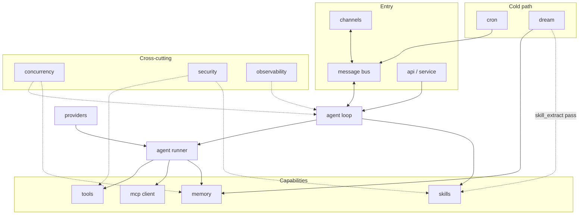

# durin internals

## 1. Purpose

This is the contributor's index to durin's internals: one how-it-works document
per subsystem, plus the invariants and dependency map that tie them together.
Start here, then jump to the document for the subsystem you need to understand or
change.

Every component doc follows the same shape so they stay scannable:

- **Purpose** — what the subsystem is and why it exists.
- **Mental model** — the two or three core concepts you must hold to reason
  about it.
- **Diagram** — at least one mermaid diagram (flowchart for structure, sequence
  for flow).
- **How it works** — the real end-to-end mechanism, naming the key types and
  files.
- **Key types & entry points** — a table mapping each symbol to its file and role.
- **Configuration & surfaces** — config keys plus the CLI / TUI / web / API
  surfaces that expose the subsystem.

Each doc is the source of truth for its own scope; facts are not duplicated
across docs, only cross-linked by relative path. These docs describe the system
as it is built, not its history — for direction and discarded approaches, see
[roadmap.md](../roadmap.md).

## 2. Mental model

Two invariants hold everywhere in the system:

**Markdown is authoritative; indexes are derived.** Sessions live as
append-only `sessions/<key>.jsonl` transcripts with a `<key>.meta.json` sidecar.
Memory lives as `.md` files under `memory/` (entity pages, fragments, session
summaries). The FTS5 SQLite index (`fts.sqlite`) and the LanceDB vector table are
built from those files, never the reverse. A corrupted index is a recoverable
condition — rebuild from the files.

**One loop, many surfaces.** All ~14 chat channels (Telegram, Discord, Slack,
Email, WebSocket, DingTalk, Feishu, Matrix, WeCom, and others), plus the CLI/TUI
and the HTTP API, converge on the same `AgentLoop`. Each surface posts an
`InboundMessage` to the `MessageBus`; the loop processes it identically regardless
of origin and replies via the outbound side of the same bus.

## 3. The source-of-truth invariant

durin has one load-bearing data invariant, and every subsystem assumes it:

> **Markdown and session files are authoritative. SQLite and LanceDB are derived
> indexes.**

Concretely:

- **Sessions** live as append-only `sessions/<key>.jsonl` transcripts plus a
  `<key>.meta.json` sidecar. These files are the truth for conversation content.
- **Memory** lives as `.md` files under `memory/` (entity pages, fragments,
  session summaries). These files are the truth for what durin knows.
- **The FTS5 SQLite index** (`fts.sqlite`) and the **LanceDB vector table** are
  *derived* from those files. They accelerate search and are never authoritative.
  Any divergence is resolved by rebuilding the index from the markdown, not by
  trusting the index.

This invariant is why memory edits are plain file writes, why a corrupted index
is a recoverable rather than fatal condition, and why concurrent writers
coordinate over the files (locks, content-addressed commits) rather than over the
indexes.

## 4. Subsystem dependencies

The agent loop is the hub. The runner executes LLM and tool iterations for it;
tools, MCP, memory, and skills are the capabilities it reaches. Channels and the
loop are decoupled by the message bus. Providers feed the runner. The API wraps a
service layer that talks to the same core. Cron and dream are cold-path services
that read and write sessions and memory off the request path. Concurrency,
security, and observability are cross-cutting concerns every subsystem touches.

Solid arrows are direct dependencies on the request or cold path. Dotted arrows
are cross-cutting concerns that apply across many subsystems rather than a single
call edge.

## 5. How the pieces fit together

End-to-end flow for a single inbound message:

1. **Surface → bus.** A channel adapter (e.g. `TelegramChannel`, `WebSocketChannel`)
   receives a message and posts an `InboundMessage` to `MessageBus.inbound`.
2. **Bus → loop.** `AgentLoop` pulls from the bus. It restores session state from
   `sessions/<key>.jsonl`, builds the layered system prompt (stable + per-session +
   volatile), and calls `AgentRunner`.
3. **Runner → LLM + tools.** `AgentRunner` drives the provider (Claude, GLM, local
   models, …) through one or more LLM iterations. Each tool call is dispatched via
   `ToolRegistry`; MCP servers are called via the MCP client; memory is searched
   via `memory_search`.
4. **Loop → bus → surface.** The loop appends the completed turn to the session
   transcript, posts an `OutboundMessage` to `MessageBus.outbound`, and the
   originating channel adapter delivers the reply.
5. **Cold path.** The dream cron job reads session transcripts, runs five
   consolidation passes (extract → derived_from → skill_extract → refine →
   always_on), and writes results back to `memory/` and skills files. The cron
   scheduler posts inbound messages for agent tasks and manages per-run sessions.

## 6. Core entry points

| Symbol | File | Role |
|---|---|---|
| `AgentLoop` | `durin/agent/loop.py` | Per-turn state machine: RESTORE → RESPOND → persist. Drives `AgentRunner` and owns session state. |
| `AgentRunner` | `durin/agent/runner.py` | LLM + tool iteration engine. Calls the provider, dispatches tool calls, enforces result budgets. |
| `MessageBus` | `durin/bus/queue.py` | Async inbound/outbound queues that decouple channel adapters from the agent loop. |
| `ToolRegistry` | `durin/agent/tools/registry.py` | Discovers, loads, and dispatches built-in tools; merges MCP tool schemas at runtime. |
| Memory | `durin/memory/` | Entity-centric markdown store, FTS + vector indexing, search pipeline, dream consolidation passes. |

## 7. Component documents

| Component | Document | Role |
|---|---|---|
| Agent loop | [loop.md](loop.md) | Per-turn state machine, runner guards, hooks, agent modes, session persistence, provider switching, personas and SOUL library. |
| Tools | [tools.md](tools.md) | Tool registry, built-in tools, schemas, result budgets and spill, sandbox boundaries. |
| MCP client | [mcp.md](mcp.md) | Connecting Model Context Protocol servers, exposing their tools, discovery and OAuth. |
| Cron | [cron.md](cron.md) | Scheduled work: reminders and agent tasks, per-run isolated sessions, run history. |
| Workflow engine | [workflow.md](workflow.md) | User-defined flow graphs: work/decision nodes, routing, loop-back, per-node model/context/tools, the `run_workflow` tool. |
| Channels & bus | [channels.md](channels.md) | Chat surfaces, the async message bus, inbound/outbound routing and session keys. |
| Voice | [voice.md](voice.md) | Conversational speech: gateway voice sessions, the STT→agent→TTS loop, spoken-rendition, the browser thin client. |
| Providers | [providers.md](providers.md) | LLM provider adapters, model presets, capability resolution, per-turn snapshots. |
| Memory | [memory/00_overview.md](memory/00_overview.md) | Entity-centric memory: markdown storage, vector + lexical indexes, search pipeline. |
| Dream | [memory/05_dream_cold_path.md](memory/05_dream_cold_path.md) | The five-pass cold-path consolidation that grows the entity graph and skills. |
| Skills | [skills/00_overview.md](skills/00_overview.md) | Skill authoring, vetting, discovery, three-tier surfacing, curation. |
| Security | [security.md](security.md) | Defense in depth: skill/MCP scanning, secrets, SSRF guard, permission gates. |
| API | [api.md](api.md) | Service core, the unified ASGI gateway, the OpenAPI contract, persisted auth. |
| Concurrency | [concurrency.md](concurrency.md) | Lock domains and the file-vs-index invariant under multi-process access. |
| Observability | [observability.md](observability.md) | Telemetry, status, `durin doctor`, the gateway daemon and its logs. |
| UX | [ux.md](ux.md) | The unified I/O layer: interactive CLI, Textual TUI, secrets UX, design system. |

## 8. Contributor notes

- **Keep these docs current** when you change a core subsystem. The doc for the
  subsystem you touched is part of the change, not a follow-up.
- **Docs may reference code**, and component docs cross-link each other by
  relative path — that direction is correct. Code should not reach back into
  working or archived docs.
- **Re-derive drift-prone numbers** rather than hard-coding them. Test counts,
  for example, change every pull request:
  - Python: `grep -rhoE '^\s*(async )?def test_' tests | wc -l`
  - WebUI (vitest): run the suite under `webui/`.
- **Tests run in isolation.** An autouse fixture runs every Python test in a
  throwaway `DURIN_HOME` temp directory, so the suite never touches a live
  `~/.durin` instance.
