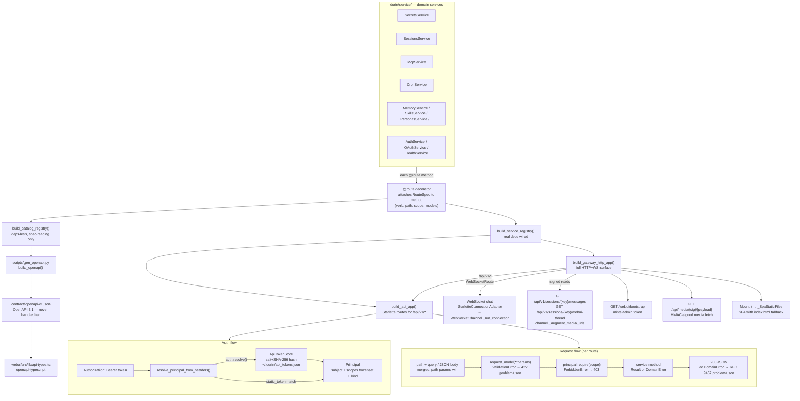

# API platform — service gateway, OpenAPI contract, scoped auth

> Related: [loop.md](loop.md) (agent loop the WS endpoint feeds),
> [observability.md](observability.md) (gateway daemon lifecycle),
> [mcp.md](mcp.md) (MCP server management exposed through this layer).

---

## 1. Purpose

The API platform is the HTTP and WebSocket front door for durin. It exposes a
set of domain services — managing sessions, memory, secrets, skills, cron jobs,
MCP servers, config, OAuth, auth tokens, and personas/souls — through a single unified
Starlette/uvicorn ASGI gateway. The same gateway also serves the WebSocket chat
endpoint, signed media reads, and the built SPA.

The design goal is **transport-agnostic services**: service methods know nothing
about HTTP or WebSocket. They accept validated Pydantic DTOs plus an identity
object (`Principal`) and return a result DTO or raise a typed error. HTTP
status codes, headers, and wire formatting are the adapter's concern. This lets
the TUI call service methods in-process with zero overhead while the HTTP
adapter and the OpenAPI generator both read the same metadata from each method's
`@route` decorator.

---

## 2. Mental model

**Transport-agnostic domain services.** Service classes live in
`durin/service/` (see `SERVICE_CLASSES` in `durin/service/catalog.py`). Each public method is decorated with `@route`, which stashes a
frozen `RouteSpec` on the method and returns it unchanged — the method stays a
plain awaitable. Nothing in `durin/service/` imports HTTP or WebSocket; adapters
map `DomainError` codes to their own status vocabulary. The TUI calls these
methods directly with `Principal.local()`.

**Single route registry feeds both the contract and the router.** At startup,
`ServiceRegistry.register()` walks each service instance's attributes, collects
`RouteSpec` objects into `BoundRoute` records, and rejects duplicate
`(verb, path)` pairs at wiring time. Two registry flavors exist: a deps-less
*catalog* registry (for OpenAPI generation and spec tooling) and a
dependency-wired *functional* registry (for the gateway). The generator and the
Starlette router read the same `registry.routes` list — adding a `@route` method
automatically extends the contract and the HTTP surface.

**Persisted, scoped, hashed token store.** Authentication uses
`ApiTokenStore` — a file-backed store that persists salted SHA-256 hashes, never
plaintext tokens. Tokens carry explicit scope grants (e.g.
`sessions:read`, `mcp:write`, `admin`). The store survives process restarts and
is shared between the gateway daemon and the CLI, so a token issued in one
context is valid in the other without any in-memory state.

---

## 3. Diagram

---

## 4. How it works

### Startup wiring

The gateway controller (`durin/cli/commands.py`) calls
`build_service_registry()` with real dependencies — `config`, `session_manager`,
`cron_service`, `bus`, and an optional live `McpRuntime` from the running
`AgentLoop`. It then calls `build_gateway_http_app(channel, registry, ...)` and
runs `uvicorn.Server(...).serve()` as one task in the gateway's asyncio event
loop. WS and HTTP share the same port.

### Request lifecycle

1. **Routing.** `build_gateway_http_app` assembles a Starlette route list in
   priority order: the WebSocket upgrade route first (so the WS handshake isn't
   swallowed by an HTTP catch-all), then the signed session-read routes, then the
   generic `/api/v1/*` routes from `build_api_app`, then the bootstrap and media
   handlers, and finally the SPA static mount. Starlette matches in list order;
   the first match wins.

2. **Auth.** `resolve_principal_from_headers()` extracts the `Authorization:
   Bearer` token and calls `auth.resolve(token)`. This re-hashes the candidate
   against every stored salt+hash pair using `hmac.compare_digest` (timing-safe).
   On a match it returns a `Principal.remote(subject, scopes)` with the stored
   scope grants. If no stored token matches but the token equals the configured
   `static_token` (plaintext bootstrap credential), it returns
   `Principal.remote("static", {ADMIN})`. Missing or invalid tokens return `None`,
   which the handler maps to a 401 problem+json response.

3. **Input construction.** For GET routes, the handler merges query-string
   parameters (multi-value via `request.query_params.multi_items()`) with URL path parameters, path params
   winning on collision, and constructs the `request_model`. For
   POST/DELETE/PATCH routes, the JSON body (absent or empty body treated as `{}`)
   is merged with path params the same way. A Pydantic `ValidationError` during
   model construction returns a 422 problem+json immediately.

4. **Scope enforcement.** The service method itself calls
   `principal.require(scope)`, which raises `ForbiddenError` when the principal's
   `scopes` frozenset does not contain the required value and does not contain
   `Scope.ADMIN` (which implies every scope). `Principal.local()` — used by the
   TUI and cron — holds `{ADMIN}` and therefore passes every check.

5. **Execution and response.** The handler awaits the service method. A returned
   `Result` is serialized with `result.model_dump()` and returned as a 200 JSON
   response. A raised `DomainError` is mapped by `_problem_response()` to an RFC
   9457 `application/problem+json` body: `type: urn:durin:error:<code>`, `title`,
   `status`, `detail`, and an optional `details` extension member carrying
   structured domain payload (e.g. the approval gate's `{refused, verdict,
   message}`). `RequestIdMiddleware` stamps `X-Request-Id` on every response.

### Signed media reads

The `GET /api/v1/sessions/{key}/messages` and
`GET /api/v1/sessions/{key}/webui-thread` routes are registered ahead of the
generic `/api/v1` routes because they need the channel's per-process
`_media_secret` to sign media URLs — an adapter concern the generic handler
cannot fulfill. Both routes call the service first (scope check, data fetch), then
call `channel._augment_media_urls()` or `build_webui_thread_response()` to
rewrite raw on-disk paths to HMAC-signed `/api/media/{sig}/{payload}` URLs. The
service never touches media URLs.

### Webhook trigger ingress

`POST /api/v1/hooks/{hook}` is the other non-bearer route: rather than
`Authorization: Bearer`, it is gated by an `X-Durin-Hook-Secret` header
compared (timing-safe) against a secret minted and persisted through the same
`ApiTokenStore` as regular API tokens (`get_or_create_hooks_secret()`).
External services calling in as webhook callers are not webui/CLI principals,
so there is no `Principal` to resolve on this route. A missing, non-ASCII, or
mismatched secret returns 401 before the request body is even parsed. On a
surface with no `hook_dispatcher` wired the route reports 503 rather than 404,
the same "not available here" shape the loops runtime's other routes use. See
[loops.md](loops.md) for what the dispatcher does with a matched request.

### WebSocket chat

The WebSocket route calls `chat_ws_endpoint`, which authenticates via
`channel._ws_auth_ok(query)` and rejects with code 1008 before calling
`websocket.accept()`. An accepted connection is wrapped in
`StarletteConnectionAdapter` — a thin adapter satisfying the same
`ConnectionAdapter` interface as the raw `websockets`-backed channel — and handed
to `channel._run_connection()`. The chat path is read from
`channel._expected_path()` at factory time, not hardcoded.

### OpenAPI contract

`scripts/gen_openapi.py` walks `build_catalog_registry().routes`. For each
`BoundRoute` it emits a path/verb operation with `summary`,
`operationId: {service}_{method}`, `x-required-scope` (when scoped), and
`requestBody` / `responses` `$ref`s. `_collect_schemas()` calls each model's
`model_json_schema()`, hoists Pydantic's `$defs` sub-models into
`components/schemas`, and strips nested `$defs` so the document contains only
top-level `$ref` pointers. Output is sorted JSON for a stable diff.

The committed file `contract/openapi-v1.json` is the **only source of truth** and
is never hand-edited. Run `python scripts/gen_openapi.py` (with
`PYTHONPATH=<worktree>` when running from a git worktree) to regenerate; run with
`--check` to verify — CI fails if the committed contract is out of date relative
to the route table. TypeScript types are generated from the contract via
`bun run gen:api-types` → `openapi-typescript`.

The contract operation count, path count, and schema count are derived directly
from the route table and change automatically when service methods are added or
removed. Run `python scripts/gen_openapi.py` to see the current totals.

### Token minting

`GET /webui/bootstrap` calls `channel.bootstrap(peer, headers)`, which checks
the peer IP (localhost-only unless a `token_issue_secret` header matches the
configured secret) and mints an `admin`-scoped token through
`ApiTokenStore.issue()`. The response includes `{token, ws_path, expires_in,
model_name, model_preset, requires_secret}`. The token is stored as a salted SHA-256 hash;
the plaintext is shown once and never persisted.

The `ApiTokenStore` also generates and persists a 32-byte HMAC secret for media
URL signing (`get_or_create_media_secret()`), stored base64-encoded in the same
`api_tokens.json` file so signed URLs survive gateway restarts.

---

## 5. Key types and entry points

| Symbol | File | Role |
|---|---|---|
| `ServiceRegistry` | `durin/service/registry.py` | Container for service instances and the collected `BoundRoute` list; rejects duplicate names and duplicate `(verb, path)` at registration time |
| `RouteSpec` | `durin/service/registry.py` | Frozen dataclass: `verb`, `path`, `scope`, `request_model`, `response_model`, `summary` — single source for OpenAPI generation and Starlette routing |
| `BoundRoute` | `durin/service/registry.py` | `RouteSpec` + `service_name` + handler callable; iterated by the ASGI adapter and the generator |
| `route` | `durin/service/registry.py` | Decorator that attaches a `RouteSpec` under `__route_spec__` and returns the method unchanged |
| `Principal` | `durin/service/principal.py` | Frozen dataclass: `subject`, `scopes: frozenset[str]`, `kind`; `Principal.local()` → `{ADMIN}`, `Principal.remote(subject, scopes)` → token-derived |
| `Scope` | `durin/service/principal.py` | String enum of permission values: `admin` plus `<domain>:<read\|write>` pairs (settings, secrets, skills, cron, sessions, config, memory, mcp, workflows, loops, system) |
| `ServiceModel` / `Command` / `Query` / `Result` | `durin/service/types.py` | Pydantic DTO bases: camelCase wire aliases via `to_camel`; `Command`/`Query` forbid extra fields, `Result` allows them |
| `DomainError` + subclasses | `durin/service/types.py` | Transport-agnostic error hierarchy: `UnauthenticatedError` (401), `ForbiddenError` (403), `NotFoundError` (404), `ConflictError` (409), `ValidationFailedError` (422), `TooManyRequestsError` (429), `UnavailableError` (503) |
| `build_service_registry` | `durin/service/wiring.py` | Factory for the functional registry: wires all services to real `config`, `session_manager`, `cron_service`, `bus`, optional `mcp_runtime` |
| `SERVICE_CLASSES` / `build_catalog_registry` | `durin/service/catalog.py` | Canonical list of HTTP-exposed service classes; deps-less registry factory for spec tooling and OpenAPI generation |
| `build_api_app` | `durin/api/asgi.py` | Starlette app for `/api/v1/*`: one `Route` per read (`_build_handler`) and write (`_build_write_handler`) route, ordered literals-before-params |
| `build_gateway_http_app` | `durin/api/asgi.py` | Full gateway app: assembles WS, signed reads, `/api/v1/*`, bootstrap, media, and SPA routes in priority order |
| `resolve_principal_from_headers` | `durin/api/asgi.py` | Extracts and verifies a bearer token; returns `Principal` or `None` |
| `StarletteConnectionAdapter` | `durin/api/asgi.py` | Wraps a Starlette `WebSocket` to satisfy the same `ConnectionAdapter` interface used by the `websockets` transport |
| `ApiTokenStore` | `durin/security/api_tokens.py` | File-backed token store (`~/.durin/api_tokens.json`): salted SHA-256 hashes, TTL/expiry, cap+purge, crash-safe atomic writes, 32-byte media HMAC secret |
| `gen_openapi.py` | `scripts/gen_openapi.py` | Reads catalog registry routes and Pydantic models; generates `contract/openapi-v1.json` (OpenAPI 3.1); `--check` flag for CI drift detection |

---

## 6. Configuration and surfaces

### Configuration keys

| Key | Description |
|---|---|
| `channels.websocket.token` | Plaintext static bearer token; accepted by the WS handshake and by `resolve_principal_from_headers` as a fallback when no stored token matches |
| `channels.websocket.token_issue_secret` | Header value (`Authorization: Bearer` or `X-Durin-Auth`) required to mint tokens via `/webui/bootstrap` when the request is not from localhost; enables reverse-proxy deployments |
| `channels.websocket.websocket_requires_token` | When true (default), the WS handshake must include a valid token (static or issued); when false, unauthenticated connections are allowed |
| `tools.mcp_servers` | List of MCP server configs; `McpService.update` (PATCH) and other MCP routes mutate this via `save_config` |
| Gateway host/port | Set via the `--port` flag or config; uvicorn runs in the agent event loop; WS and HTTP share the same port |

`TranscriptionService` exists in the codebase but is not HTTP-exposed (it
carries no `@route` decorator on any method). Its configuration
(`TranscriptionConfig`) is not part of the API surface.

### HTTP surface (`/api/v1/*`)

The route table is the authoritative source; the current operation set spans
secrets, cron, sessions, settings, config, skills, memory, MCP servers, health,
commands, agent modes (`/api/v1/modes`), OAuth flows, auth tokens,
personas/souls (`/api/v1/souls`, `/api/v1/personas`), workflows
(`/api/v1/workflows`), loops (`/api/v1/loops`), and background tasks
(`/api/v1/tasks`). Verbs in use: GET, POST, DELETE, and PATCH (used by
`McpService.update` and `CronService` for partial updates).

**`GET /api/v1/tasks?session=<key>`** (scope `sessions:read`) returns the
per-chat list of background tasks associated with a session. The response merges
two sources: in-flight sub-agent statuses from the in-process status manager
(with finished ones reconstructed durably from session lineage via
`children_of`) and workflow run manifests whose `root_session_key` matches the
session. Each task entry includes an optional `nodes` array (the workflow node
list for workflow-kind tasks) used by the work panel to render per-node and
per-branch progress. See the generated OpenAPI contract
(`contract/openapi-v1.json`) and `TasksService` (`durin/service/tasks.py`) for
the authoritative field definitions.

**`GET /api/v1/health`** is the only unauthenticated route *within the
bearer-gated API surface* (the special routes outside it — webui bootstrap,
signed media, the MCP OAuth callback — carry their own gating; see their
table below): a liveness probe
that also reports the running package `version` and process `uptime_s`
(marked by the app factory via `durin/utils/process_runtime.py`). Local CLI
tools use it to detect a gateway serving stale code after a reinstall —
`durin doctor` warns on a version mismatch and `durin doctor --fix` offers
the restart.

**`GET /api/v1/status`** (scope `system:read`, `HealthService.status`) is the
one-call runtime snapshot behind `durin status`: version, uptime, per-channel
enabled/running state (config overlaid with the live `ChannelManager`), and
the cron scheduler summary. Surfaces wired without a channel manager or cron
scheduler degrade to config-only data.

All mutations are POST/DELETE/PATCH with a JSON body; there are no
GET-with-query mutations. Responses use snake_case field names
(`model_dump()` without alias); inputs accept both camelCase and snake_case
(`populate_by_name=True`).

Every error response is RFC 9457 `application/problem+json` with
`type: urn:durin:error:<code>`.

### Special routes outside `/api/v1`

| Route | Description |
|---|---|
| `GET /webui/bootstrap` | Mints an admin-scoped token; gated by peer IP or `token_issue_secret` header |
| `GET /api/v1/mcp/oauth/callback` | OAuth provider redirect for gateway-driven MCP sign-in; gated by a single-use state token, not a bearer token |
| `GET /api/media/{sig}/{payload}` | HMAC-signed media fetch; signature verified against the per-process media secret |
| `POST /api/v1/hooks/{hook}` | Webhook trigger ingress for [loops](loops.md); gated by `X-Durin-Hook-Secret`, not a bearer token |
| WebSocket at `channel._expected_path()` | Chat endpoint; auth via query-param token before `accept()`; backed by `StarletteConnectionAdapter` |
| `Mount /` | SPA static files with `index.html` fallback for history-mode routing |

### CLI and in-process surfaces

- **`durin auth token {list,issue,revoke}`** — operates directly on
  `ApiTokenStore`, no gateway required; `issue` validates scopes against the
  `Scope` enum.
- **TUI** — calls service methods in-process via `Principal.local()` with
  `{ADMIN}` authority; chat flows through the `MessageBus` / `AgentLoop`.
- **TypeScript webui** — every authenticated call routes through
  `fetchWithReauth` (`webui/src/lib/http.ts`), which adds the bearer token header
  and retries once with a fresh bootstrap token on a 401. A guard test keeps any
  other module from calling `fetch` directly and bypassing that retry.

---

## 7. Rationale

The `@route` decorator was chosen over a separate route-registration call to
keep routing metadata co-located with the method it describes. The method-as-plain-callable property means the TUI pays no adapter overhead and tests can
call service methods directly with `Principal.local()`.

Two registry flavors (catalog and functional) exist so the OpenAPI generator can
import service classes and enumerate their routes without needing live
dependencies like a running session manager or cron scheduler. The catalog
instantiates services with inert stubs; the functional registry receives real
objects at gateway startup.

The service layer returns `Result` (never raises on success) so the ASGI adapter
has one unconditional success path (200 + `model_dump()`) and one error path
(problem+json). There is no `(ok, err)` union type or optional return — the
distinction between a missing resource and a permission error is always a raised
`DomainError` subclass, not a caller-inspected flag.

Media URL signing is intentionally excluded from service methods. The media HMAC
secret is per-process and lives in the `WebSocketChannel`; if the service signed
URLs, it would need a reference to the channel, inverting the dependency
direction. Instead, the two session-read routes in `build_gateway_http_app` call
the service for the scope check and data fetch, then hand the result to the
channel for signing before returning the response.
