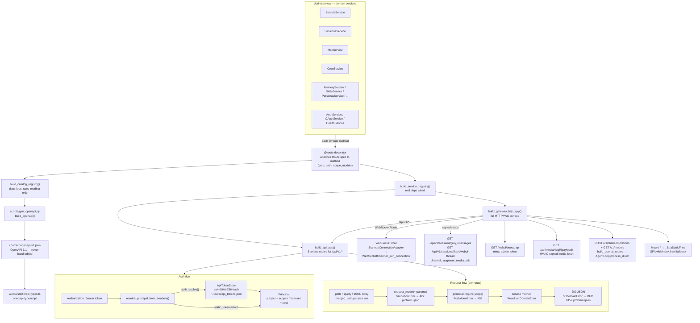

# API platform — service gateway, OpenAPI contract, scoped auth

> Related: [loop.md](loop.md) (agent loop the WS endpoint feeds),
> [observability.md](observability.md) (gateway daemon lifecycle),
> [mcp.md](mcp.md) (MCP server management exposed through this layer).

---

## 1. Purpose

The API platform is the HTTP and WebSocket front door for durin. It exposes a
set of domain services — managing sessions, memory, secrets, skills, cron jobs,
MCP servers, config, OAuth, auth tokens, and personas/souls — through a single unified
Starlette/uvicorn ASGI gateway. The same gateway also serves the WebSocket chat
endpoint, signed media reads, and the built SPA.

The design goal is **transport-agnostic services**: service methods know nothing
about HTTP or WebSocket. They accept validated Pydantic DTOs plus an identity
object (`Principal`) and return a result DTO or raise a typed error. HTTP
status codes, headers, and wire formatting are the adapter's concern. This lets
the TUI call service methods in-process with zero overhead while the HTTP
adapter and the OpenAPI generator both read the same metadata from each method's
`@route` decorator.

---

## 2. Mental model

**Transport-agnostic domain services.** Service classes live in
`durin/service/` (see `SERVICE_CLASSES` in `durin/service/catalog.py`). Each public method is decorated with `@route`, which stashes a
frozen `RouteSpec` on the method and returns it unchanged — the method stays a
plain awaitable. Nothing in `durin/service/` imports HTTP or WebSocket; adapters
map `DomainError` codes to their own status vocabulary. The TUI calls these
methods directly with `Principal.local()`.

**Single route registry feeds both the contract and the router.** At startup,
`ServiceRegistry.register()` walks each service instance's attributes, collects
`RouteSpec` objects into `BoundRoute` records, and rejects duplicate
`(verb, path)` pairs at wiring time. Two registry flavors exist: a deps-less
*catalog* registry (for OpenAPI generation and spec tooling) and a
dependency-wired *functional* registry (for the gateway). The generator and the
Starlette router read the same `registry.routes` list — adding a `@route` method
automatically extends the contract and the HTTP surface.

**Persisted, scoped, hashed token store.** Authentication uses
`ApiTokenStore` — a file-backed store that persists salted SHA-256 hashes, never
plaintext tokens. Tokens carry explicit scope grants (e.g.
`sessions:read`, `mcp:write`, `chat:write`, `admin`). The store survives process restarts and
is shared between the gateway daemon and the CLI, so a token issued in one
context is valid in the other without any in-memory state.

---

## 3. Diagram

```mermaid
flowchart TD
    subgraph services["durin/service/ — domain services"]
        S1["SecretsService"]
        S2["SessionsService"]
        S3["McpService"]
        S4["CronService"]
        S5["MemoryService / SkillsService / PersonasService / ..."]
        S6["AuthService / OAuthService / HealthService"]
    end

    route["@route decorator\nattaches RouteSpec to method\n(verb, path, scope, models)"]

    services -->|each @route method| route

    route --> catalog["build_catalog_registry()\ndeps-less, spec-reading only"]
    route --> functional["build_service_registry()\nreal deps wired"]

    catalog --> gen["scripts/gen_openapi.py\nbuild_openapi()"]
    gen --> contract["contract/openapi-v1.json\nOpenAPI 3.1 — never hand-edited"]
    contract --> ts["webui/src/lib/api-types.ts\nopenapi-typescript"]

    functional --> apiapp["build_api_app()\nStarlette routes for /api/v1/*"]
    functional --> gwapp["build_gateway_http_app()\nfull HTTP+WS surface"]

    gwapp -->|WebSocketRoute| ws["WebSocket chat\nStarletteConnectionAdapter\n→ WebSocketChannel._run_connection"]
    gwapp -->|signed reads| signed["GET /api/v1/sessions/{key}/messages\nGET /api/v1/sessions/{key}/webui-thread\nchannel._augment_media_urls"]
    gwapp -->|/api/v1/*| apiapp
    gwapp --> bootstrap["GET /webui/bootstrap\nmints admin token"]
    gwapp --> media["GET /api/media/{sig}/{payload}\nHMAC-signed media fetch"]
    gwapp --> openai["POST /v1/chat/completions + GET /v1/models\nbuild_openai_routes → AgentLoop.process_direct"]
    gwapp --> spa["Mount / → _SpaStaticFiles\nSPA with index.html fallback"]

    subgraph auth["Auth flow"]
        hdr["Authorization: Bearer token"]
        resolve["resolve_principal_from_headers()"]
        store["ApiTokenStore\nsalt+SHA-256 hash\n~/.durin/api_tokens.json"]
        principal["Principal\nsubject + scopes frozenset + kind"]
        hdr --> resolve
        resolve -->|"auth.resolve()"| store
        store --> principal
        resolve -->|"static_token match"| principal
    end

    apiapp --> auth

    subgraph reqflow["Request flow (per route)"]
        params["path + query / JSON body\nmerged, path params win"]
        model["request_model(**params)\nValidationError → 422 problem+json"]
        require["principal.require(scope)\nForbiddenError → 403"]
        handler["service method\nResult or DomainError"]
        resp["200 JSON\nor DomainError → RFC 9457 problem+json"]
        params --> model --> require --> handler --> resp
    end

    apiapp --> reqflow
```

---

## 4. How it works

### Startup wiring

The gateway controller (`durin/cli/commands.py`) calls
`build_service_registry()` with real dependencies — `config`, `session_manager`,
`cron_service`, `bus`, and an optional live `McpRuntime` from the running
`AgentLoop`. It then calls `build_gateway_http_app(channel, registry, ...)` and
runs `uvicorn.Server(...).serve()` as one task in the gateway's asyncio event
loop. WS, HTTP and the SPA share one address, the websocket channel's
(`channels.websocket.host`/`port`); `gateway.port` serves only `/health`.

### Request lifecycle

1. **Routing.** `build_gateway_http_app` assembles a Starlette route list in
   priority order: the WebSocket upgrade route first (so the WS handshake isn't
   swallowed by an HTTP catch-all), then the signed session-read routes, then the
   native chat stream routes (`build_chat_stream_routes`), then the generic
   `/api/v1/*` routes from `build_api_app`, then the MCP OAuth callback,
   bootstrap, signout, media and webhook handlers, then the OpenAI-compatible
   `/v1` routes (when an agent loop is wired), and finally the SPA static mount.
   Starlette matches in list order; the first match wins.

2. **Auth.** `resolve_principal_from_headers()` extracts the `Authorization:
   Bearer` token and calls `auth.resolve(token)`. This re-hashes the candidate
   against every stored salt+hash pair using `hmac.compare_digest` (timing-safe).
   On a match it returns a `Principal` with the stored scope grants:
   `Principal.webui(subject, scopes)` for the dashboard session token
   `/webui/bootstrap` mints (stored with `kind: "webui"`), and
   `Principal.remote(subject, scopes)` for every other token. If no stored
   token matches but the token equals the configured `static_token`
   (plaintext bootstrap credential), it returns
   `Principal.remote("static", {ADMIN})`. Missing or invalid tokens return
   `None`, which the handler maps to a 401 problem+json response.

3. **Input construction.** For GET routes, the handler merges query-string
   parameters (multi-value via `request.query_params.multi_items()`) with URL path parameters, path params
   winning on collision, and constructs the `request_model`. For
   POST/DELETE/PATCH routes, the JSON body (absent or empty body treated as `{}`)
   is merged with path params the same way. A Pydantic `ValidationError` during
   model construction returns a 422 problem+json immediately.

4. **Scope enforcement.** The service method itself calls
   `principal.require(scope)`, which raises `ForbiddenError` when the principal's
   `scopes` frozenset does not contain the required value and does not contain
   `Scope.ADMIN` (which implies every scope). `Principal.local()` — used by the
   TUI and cron — holds `{ADMIN}` and therefore passes every check.

5. **Execution and response.** The handler awaits the service method. A returned
   `Result` is serialized with `result.model_dump()` and returned as a JSON
   response — 200 by default, or the route's declared `status_code` (a write
   route hands off to background work, e.g. a detached launch, answers 202
   instead; see `RouteSpec.status_code` in `durin/service/registry.py`). A
   raised `DomainError` is mapped by `_problem_response()` to an RFC
   9457 `application/problem+json` body: `type: urn:durin:error:<code>`, `title`,
   `status`, `detail`, and an optional `details` extension member carrying
   structured domain payload (e.g. the skill import gate's `{refused, verdict,
   message}`). `RequestIdMiddleware` stamps `X-Request-Id` on every response.

### Signed media reads

The `GET /api/v1/sessions/{key}/messages` and
`GET /api/v1/sessions/{key}/webui-thread` routes are registered ahead of the
generic `/api/v1` routes because they need the channel's per-process
`_media_secret` to sign media URLs — an adapter concern the generic handler
cannot fulfill. Both routes call the service first (scope check, data fetch), then
call `channel._augment_media_urls()` or `build_webui_thread_response()` to
rewrite raw on-disk paths to HMAC-signed `/api/media/{sig}/{payload}` URLs. The
service never touches media URLs.

The webui-thread route also takes an optional `before` query parameter — a
byte cursor into the display transcript — so the webui can page through long
histories instead of loading the whole file. Each page is widened backward
from the target window to the nearest user-message line, so a turn's
trace/tool rows are never split from the user message that started it. The
response's `data.prevCursor` carries the cursor for the next older page, or
`null` once history is exhausted (the client chains pages by re-requesting
with `before=prevCursor`). An invalid `before` (non-integer or negative) is
rejected with a `validation_failed` problem response before the service is
even called. When no display transcript exists (non-websocket sessions), the
endpoint falls back to converting the raw session history instead — see
[channels.md](channels.md) for that path — and that fallback payload always
carries `prevCursor: null` since it is not byte-paged.

Display-transcript appends are buffered: the WS channel enqueues each streamed
event into a process-wide `TranscriptWriter`, which batches them to disk with
one fsync per session file per drain (≤ ~100 ms behind the stream). A turn's
output (replies, stream deltas, reasoning, `turn_end`) is enqueued whether or
not any client is subscribed to the chat, so a turn that finishes while the tab
is closed is there when the user returns; live-state frames (`goal_status`,
queued notices) are never persisted. The webui-thread route flushes the writer
for the requested key before reading, so a reloading client always sees every
event enqueued up to that moment.

### Webhook trigger ingress

`POST /api/v1/hooks/{hook}` is the other non-bearer route: rather than
`Authorization: Bearer`, it is gated by an `X-Durin-Hook-Secret` header
compared (timing-safe) against a secret minted and persisted through the same
`ApiTokenStore` as regular API tokens (`get_or_create_hooks_secret()`).
External services calling in as webhook callers are not webui/CLI principals,
so there is no `Principal` to resolve on this route. A missing, non-ASCII, or
mismatched secret returns 401 before the request body is even parsed. On a
surface with no `hook_dispatcher` wired the route reports 503 rather than 404,
the same "not available here" shape the automations runtime's other routes
use. See `durin/automations/hooks.py` for what the dispatcher does with a
matched request.

### Native chat

Three routes let any program converse in **webui conversations** — the same
sessions the dashboard shows (`websocket:<chat_id>`), not a separate kind:

| Route | Scope | Where it lives |
|---|---|---|
| `POST /api/v1/sessions/{key}/messages` | `chat:write` (+ `sessions:read` for the streaming form) | `ChatService.send` (in the contract) and a hand-mounted handler in `durin/api/chat_stream.py` that wins first match |
| `GET /api/v1/sessions/{key}/events` | `sessions:read` | hand-mounted SSE in `durin/api/chat_stream.py` |
| `POST /api/v1/sessions/{key}/stop` | `chat:write` | `ChatService.stop` (in the contract) |

**Sending** goes through the websocket channel's own submission path:
`ChatService.check` (scope, key, `allowFrom`, then
`WebSocketChannel.validate_chat_message`, the same rules as a WebSocket
`message` frame) and `ChatService.deliver`
(`WebSocketChannel.publish_chat_message`). The message carries
`webui: True`, a `client_msg_id` (minted when absent), and `origin: "api"`; the
sender id is `api:<token subject>`. The turn runs on the bus like a dashboard
turn, detached from the request, which answers `202`. A sender outside
`channels.websocket.allowFrom` is refused with `403` up front — the bus ingress
gate would otherwise drop it silently after the `202`. A body larger than
`channels.websocket.max_message_bytes` is refused with `413`, the WebSocket
frame limit.

**Watching** is an `SseSubscriber` attached to the channel's per-chat fan-out
next to WebSocket connections, so an SSE watcher receives the same frames
(`voice_*` excluded), named after their `event` field. Opening the stream
replays what a reattaching dashboard gets (`_hydrate_after_subscribe`: the goal
state, `goal_status: running` for a turn in flight). `send_text` never blocks
the channel: frames wait in a per-subscriber buffer bounded by bytes
(`SSE_BUFFER_LIMIT_BYTES`); when it is full, text previews (`delta`,
`reasoning_delta`) are dropped first, and a state frame that still does not fit
ends the stream with `lagged`. While idle the stream sends a `: keepalive`
comment every `SSE_KEEPALIVE_S`.

**The streaming send** (`Accept: text/event-stream`) attaches the subscriber and
delivers the message before returning the response, so a client that leaves at
once loses the stream, never the message. It ends after the `turn_end` that
answers the message: the one whose `client_msg_id` matches, or the first after
a `queued_consumed` that lists it (a message queued behind a running turn), or
the next one for a `steer`. Commands are refused in this form (`422`): they
answer inline and open no turn. An answer to a blocked `ask_user_question` is
acknowledged with `queued_consumed` (`AgentLoop._answer_pending_question`) for
the same reason.

**Stopping** cancels by the key the turn runs under: `AgentLoop.bus_turn_key`
folds the key into the unified session when `unified_session` is on, then
`AgentLoop.cancel_session_turns` cancels the turn and its subagents.

**Authority.** A turn with input from a token (`origin: "api"`) never asks the
person in the chat to approve a privileged action: skill and MCP changes
become pending requests for the Pending page or `durin approvals`, an exec command that needs
approval is refused, and a token's message never answers an approval the turn
waits on — see authority by context in the security internals.

### OpenAI-compatible `/v1` surface

`durin/api/openai_routes.py` builds `POST /v1/chat/completions` and
`GET /v1/models` through `build_openai_routes()`, spliced into the gateway app
ahead of the SPA mount. The routes exist only when `build_gateway_http_app` is
given an `agent_loop` — the gateway passes its live loop, so the API and every
chat surface share one agent, one memory, and one session store; an app built
without it simply has no `/v1`.

Both routes require `Authorization: Bearer` with the `chat:write` scope
(`admin` short-circuits as everywhere). The module never imports `asgi`: the
resolver is injected as a `resolve_principal(headers)` callable wrapping
`resolve_principal_from_headers`. Auth failures answer in OpenAI's error shape
(`{"error": {message, type, code}}`, `authentication_error` / `permission_error`)
rather than problem+json — an OpenAI client surfaces those cleanly, and callers
of this surface are OpenAI clients by definition.

The contract is session-oriented, which is the substantive difference from a
stateless OpenAI endpoint: exactly one user message per request, with history
held server-side under `api:{session_id}` (`api:default` when the caller sends
no id). A request carrying `tools`, `tool_choice`, `functions`, or
`function_call` is rejected with 400 — durin runs its tools inside the turn, and
silently ignoring the field would leave a caller waiting for tool-call callbacks
that never come.

Turns run through `AgentLoop.process_direct` under a per-session `asyncio.Lock`
held in the closure, so concurrent calls on one session queue instead of
colliding. Each turn runs in its own task (`_start_turn`, strongly referenced
in a closure set) and **outlives its request**: a client disconnect or a
non-streaming `504` (after `gateway.api_request_timeout`, via `asyncio.wait`,
which never cancels) leaves the turn to finish and be saved to its session. A
turn abandoned before it acquired the session lock is cancelled (`_abandon`),
so client retries do not pile up duplicate turns. A done-callback always
retrieves the task's outcome and logs a failure that happened after its request
ended. An empty final response is retried once before falling back to
`EMPTY_FINAL_RESPONSE_MESSAGE`. The turn gets a no-op `on_progress`: the OpenAI
format has no place for progress, and without a callback the loop would
publish it for the nonexistent `api` channel.

Streaming hands back a `StreamingResponse` fed by a queue that
`process_direct`'s `on_stream` callback fills. `on_stream_end` deliberately does
nothing: it marks generation-segment boundaries, and a tool-using turn continues
past them, so the HTTP stream closes only when the turn ends. A
completed stream emits a `finish_reason: "stop"` chunk then `data: [DONE]`; a
failed one emits a single `{"error": ...}` frame and **omits** `[DONE]`, which is
how a client distinguishes truncation from completion.

A turn has no idle clock of its own. Every way a turn can hang is already
bounded inside the agent — the provider's stream-silence watchdog on each LLM
call, each tool's own timeout, the per-turn tool-iteration cap — and a second
silence clock at the edge would kill waits those limits deliberately allow (a
local model evaluating a long prompt emits nothing for minutes). The only edge
bound is a hard ceiling, `gateway.api_turn_timeout` (`0` disables), on every
turn; it is an `asyncio.timeout` built after the session lock is acquired,
because `asyncio.timeout` fixes its deadline at construction and queueing
behind another turn must not spend the budget. A ceiling hit answers `504` /
an error frame `Turn exceeded {n}s limit`. A turn stopped from outside —
`process_direct` registers it with the running turns, so `/stop` and
`POST /api/v1/sessions/api:<id>/stop` reach it — answers `409 turn_stopped` /
an error frame `Turn was stopped`. While the queue is empty the stream emits an
SSE comment (`: keepalive`) on an interval (`_SSE_KEEPALIVE_S`), so proxies and
client read timeouts do not drop a connection whose turn is running a long
tool. A client disconnect makes Starlette close the generator; its `finally`
abandons the turn (cancelling it only if it never started).

Both response shapes carry real token usage, not a placeholder. The agent loop
accumulates `prompt_tokens`/`completion_tokens` across every LLM call in the
turn — including overflow-retry attempts — and exposes the sum on
`OutboundMessage.metadata["usage"]` (`_assemble_outbound` in
`durin/agent/loop.py`); `_response_usage()` here reshapes that into the
standard three-key OpenAI contract (`total_tokens` is always recomputed as
`prompt + completion`, never trusted from upstream). The non-streaming path
sums usage across the empty-response retry too, since both calls were
genuinely billed even though the first's content was discarded. Streaming
puts usage on the terminal `finish_reason: "stop"` chunk rather than a
separate frame after it; `stream_options.include_usage` isn't parsed, so
usage is always included.

These routes are hand-mounted, not registry routes, so — like bootstrap, media,
and hooks — they are outside the generated OpenAPI contract.

### WebSocket chat

The WebSocket route calls `chat_ws_endpoint`, which authenticates via
`channel._ws_auth_ok(query)` and rejects with code 1008 before calling
`websocket.accept()`. An accepted connection is wrapped in
`StarletteConnectionAdapter` — a thin adapter satisfying the same
`ConnectionAdapter` interface as the raw `websockets`-backed channel — and handed
to `channel._run_connection()`. The chat path is read from
`channel._expected_path()` at factory time, not hardcoded. The adapter reports a
send to a socket that is already gone as `ConnectionClosed` (Starlette raises
`WebSocketDisconnect` or `RuntimeError`), which the channel handles by dropping
the subscription and carrying on — so a message sent just before the client
left still reaches the agent instead of being aborted mid-processing.

### OpenAPI contract

`scripts/gen_openapi.py` walks `build_catalog_registry().routes`. For each
`BoundRoute` it emits a path/verb operation with `summary`,
`operationId: {service}_{method}`, `x-required-scope` (when scoped), and
`requestBody` / `responses` `$ref`s. `_collect_schemas()` calls each model's
`model_json_schema()`, hoists Pydantic's `$defs` sub-models into
`components/schemas`, and strips nested `$defs` so the document contains only
top-level `$ref` pointers. Output is sorted JSON for a stable diff.

The committed file `contract/openapi-v1.json` is the **only source of truth** and
is never hand-edited. Run `python scripts/gen_openapi.py` (with
`PYTHONPATH=<worktree>` when running from a git worktree) to regenerate; run with
`--check` to verify — CI fails if the committed contract is out of date relative
to the route table. TypeScript types are generated from the contract via
`bun run gen:api-types` → `openapi-typescript`.

The contract operation count, path count, and schema count are derived directly
from the route table and change automatically when service methods are added or
removed. Run `python scripts/gen_openapi.py` to see the current totals.

### Token minting

`GET /webui/bootstrap` calls `channel.bootstrap(peer, headers)` and mints an
`admin`-scoped token through `ApiTokenStore.issue()`. Who may mint depends on
whether a setup secret is configured — `token_issue_secret`, or the static
`token` when that is empty:

- **No secret:** only a loopback peer may mint (local mode), and only under a
  loopback `Host` name (`localhost`, `127.0.0.1` or `[::1]`, any port); any
  other peer or name gets 403. The `Host` check stops a DNS-rebinding page in
  the local browser from minting a token (see the security internals).
- **A secret is set:** every caller, localhost included, must present it
  (`Authorization: Bearer <secret>` or `X-Durin-Auth: <secret>`) or carry a
  valid `durin_session` cookie; otherwise 401. A sign-in with the secret sets
  that cookie — `httpOnly`, `SameSite=Strict`, holding an opaque session token
  that lives `webui_session_ttl_s` — so later bootstraps (page reloads)
  re-authorize through it and the browser never stores the secret.

The response includes `{token, ws_path, expires_in, model_name, model_preset,
requires_secret}`. The token is stored as a salted SHA-256 hash; the plaintext
is shown once and never persisted. It is stored with `kind: "webui"`: it is the
dashboard session, the one credential a route that needs a person (deciding an
approval) accepts. Only this path sets that kind — the token routes and
`durin auth token issue` always store `kind: "remote"`. `POST /webui/signout` revokes the session
token and clears the cookie.

The `ApiTokenStore` also generates and persists a 32-byte HMAC secret for media
URL signing (`get_or_create_media_secret()`), stored base64-encoded in the same
`api_tokens.json` file so signed URLs survive gateway restarts.

---

## 5. Key types and entry points

| Symbol | File | Role |
|---|---|---|
| `ServiceRegistry` | `durin/service/registry.py` | Container for service instances and the collected `BoundRoute` list; rejects duplicate names and duplicate `(verb, path)` at registration time |
| `RouteSpec` | `durin/service/registry.py` | Frozen dataclass: `verb`, `path`, `scope`, `request_model`, `response_model`, `summary`, `status_code` (default 200) — single source for OpenAPI generation and Starlette routing |
| `BoundRoute` | `durin/service/registry.py` | `RouteSpec` + `service_name` + handler callable; iterated by the ASGI adapter and the generator |
| `route` | `durin/service/registry.py` | Decorator that attaches a `RouteSpec` under `__route_spec__` and returns the method unchanged |
| `Principal` | `durin/service/principal.py` | Frozen dataclass: `subject`, `scopes: frozenset[str]`, `kind` (`local`, `webui`, `remote`); `Principal.local()` → `{ADMIN}` in-process, `Principal.webui(subject, scopes)` → the dashboard session, `Principal.remote(subject, scopes)` → any other token |
| `Scope` | `durin/service/principal.py` | String enum of permission values: `admin`, `<domain>:<read\|write>` pairs (settings, secrets, skills, cron, sessions, config, memory, mcp, workflows, automations, system), and the write-only `channels:write` and `chat:write` |
| `ServiceModel` / `Command` / `Query` / `Result` | `durin/service/types.py` | Pydantic DTO bases: camelCase wire aliases via `to_camel`; `Command`/`Query` forbid extra fields, `Result` allows them |
| `DomainError` + subclasses | `durin/service/types.py` | Transport-agnostic error hierarchy: `UnauthenticatedError` (401), `ForbiddenError` (403), `NotFoundError` (404), `ConflictError` (409), `ValidationFailedError` (422), `TooManyRequestsError` (429), `UnavailableError` (503) |
| `build_service_registry` | `durin/service/wiring.py` | Factory for the functional registry: wires all services to real `config`, `session_manager`, `cron_service`, `bus`, optional `mcp_runtime` |
| `SERVICE_CLASSES` / `build_catalog_registry` | `durin/service/catalog.py` | Canonical list of HTTP-exposed service classes; deps-less registry factory for spec tooling and OpenAPI generation |
| `build_api_app` | `durin/api/asgi.py` | Starlette app for `/api/v1/*`: one `Route` per read (`_build_handler`) and write (`_build_write_handler`) route, ordered literals-before-params |
| `build_gateway_http_app` | `durin/api/asgi.py` | Full gateway app: assembles WS, signed reads, `/api/v1/*`, bootstrap, media, and SPA routes in priority order |
| `resolve_principal_from_headers` | `durin/api/asgi.py` | Extracts and verifies a bearer token; returns `Principal` or `None` |
| `StarletteConnectionAdapter` | `durin/api/asgi.py` | Wraps a Starlette `WebSocket` to satisfy the same `ConnectionAdapter` interface used by the `websockets` transport |
| `ApiTokenStore` | `durin/security/api_tokens.py` | File-backed token store (`~/.durin/api_tokens.json`): salted SHA-256 hashes, each token's `kind` (`webui` for a dashboard session, `remote` otherwise), TTL/expiry, cap+purge, crash-safe atomic writes, 32-byte media HMAC secret |
| `PendingService` / `collect_pending` | `durin/service/pending.py` | `GET /api/v1/pending`: merges every source of items waiting on a person, each read through its own listing function, filtered by the caller's read scopes |
| `ApprovalsService` | `durin/service/approvals.py` | `POST /api/v1/approvals/{id}/decision`: a dashboard session decides a pending approval request through `approval.decide` |
| `gen_openapi.py` | `scripts/gen_openapi.py` | Reads catalog registry routes and Pydantic models; generates `contract/openapi-v1.json` (OpenAPI 3.1); `--check` flag for CI drift detection |

---

## 6. Configuration and surfaces

### Configuration keys

| Key | Description |
|---|---|
| `channels.websocket.token` | Plaintext static bearer token; accepted by the WS handshake and by `resolve_principal_from_headers` as a fallback when no stored token matches |
| `channels.websocket.token_issue_secret` | Setup secret for `/webui/bootstrap` (`Authorization: Bearer` or `X-Durin-Auth`). When set — or when the static `token` is set and this is empty — every bootstrap, localhost included, needs the secret or a valid `durin_session` cookie; enables reverse-proxy deployments |
| `channels.websocket.websocket_requires_token` | When true (default), the WS handshake must include a valid token (static or issued); when false, unauthenticated connections are allowed. A set static `token` always requires a valid token. The gateway sets it false when it creates the websocket section at runtime for the dashboard |
| `tools.mcp_servers` | List of MCP server configs; `McpService.update` (PATCH) and other MCP routes mutate this via `save_config` |
| App host/port | `channels.websocket.host` / `channels.websocket.port`; uvicorn runs in the agent event loop and serves WS, HTTP and the SPA on that one address. `gateway.port` (and `--port`) only bind the `/health` endpoint |
| `gateway.api_request_timeout` | How long (seconds) a non-streaming `/v1/chat/completions` request waits for its turn; an overrun answers 504 and the turn still completes |
| `gateway.api_turn_timeout` | Hard ceiling (seconds) on any `/v1/chat/completions` turn, counted from when the turn gets its session; `0` disables; a hit answers 504 or ends the stream with an error frame and no `[DONE]` |

`TranscriptionService` exists in the codebase but is not HTTP-exposed (it
carries no `@route` decorator on any method). Its configuration
(`TranscriptionConfig`) is not part of the API surface.

### HTTP surface (`/api/v1/*`)

The route table is the authoritative source; the current operation set spans
secrets, cron, sessions, settings, config, skills, memory, MCP servers, health,
commands, agent modes (`/api/v1/modes`), OAuth flows, auth tokens,
personas/souls (`/api/v1/souls`, `/api/v1/personas`), workflows
(`/api/v1/workflows`), automations (`/api/v1/automations`), background tasks
(`/api/v1/tasks`), everything waiting on a person (`/api/v1/pending`), and
approval decisions (`/api/v1/approvals`). Verbs in use: GET, POST, PUT, PATCH, and DELETE — PATCH
for partial updates (e.g. `McpService.update`, `CronService`), PUT for saving a
whole named resource (e.g. an automation or a workflow script). The generated
contract lists the verb of every operation.

**`GET /api/v1/tasks?session=<key>`** (scope `sessions:read`) returns the
per-chat list of background tasks associated with a session. The response merges
two sources: in-flight sub-agent statuses from the in-process status manager
(with finished ones reconstructed durably from session lineage via
`children_of`) and workflow run manifests whose `root_session_key` matches the
session. Each task entry includes an optional `nodes` array (the workflow node
list for workflow-kind tasks) used by the work panel to render per-node and
per-branch progress. See the generated OpenAPI contract
(`contract/openapi-v1.json`) and `TasksService` (`durin/service/tasks.py`) for
the authoritative field definitions.

**`GET /api/v1/pending`** (`PendingService`) is everything that waits on a
person, in one list: approval requests, skill imports in quarantine, automation
runs paused on an approval or a question, workflow runs waiting for input,
memory pairs the dream flagged, and skill suggestions. The route only
aggregates — each source is read through its own listing function, the one
behind its own route — and answers `{items, count, errors}`. A quarantined skill
import that a pending install request names is listed once, as that request:
deciding the request settles the import too. Each item is
`{source, id, kind, title, summary, created_at, resolve, data}`: `data` is the
source's own record in the shape its own route returns, and `resolve` names a
`form` and the `actions` that act on it (method, path, and the body fields the
item fixes; the rest of each body is that route's own contract). Approval
records are expired and pruned before they are listed, and a legacy record
(no payload) is left to `durin approvals discard`. A workflow run an
automation started is left out: it shows as that automation's paused run.
Each source is shown only to a principal holding the scope of its own listing
route (for approvals, the read scope of each request's kind); the contract
names `admin`, the one scope that covers every source, and a principal that
can read no source gets 403. A source that fails to load is reported in
`errors` while the others are still listed. The listing runs in a worker
thread, off the event loop.

**`POST /api/v1/approvals/{id}/decision`** (`ApprovalsService.decide`, body
`{decision: "approve" | "reject"}`) decides one approval request through
`approval.decide`, with the gateway's live handles
(`AgentLoop.approval_exec_deps`) and `decided_by: {"kind": "user",
"channel": "webui"}`. It re-implements none of `decide`'s rules. Only a
dashboard session (a `webui` principal) may call it — a token issued for the
API, the static token and in-process callers get 403 — and the decision takes
the scope of the change's domain: `skills:write` for a skill kind, `mcp:write`
for an MCP change, `admin` for anything else (the contract names `admin`, the
scope that covers every kind). The outcome maps to HTTP by one rule: **200**
with `{status, message, approval_id}` whenever the request was acted on —
`applied`, `rejected`, `pending` (handed to the turn still waiting on it),
`failed` (approved, but running it failed), `stale` (it expired, or its target
changed since it was reviewed) — and **409** when `decide` refused and left the
record as it was (`refused`: already decided, a legacy record, an exec request
outside its turn, a kind whose runner is missing here), with the same three
fields in the problem's `details`. An unknown id is 404, a malformed id or
decision 422. The decision runs as its own task that the request awaits, so a
client that disconnects does not cut an install off halfway; when it did not
go to a waiting turn, it posts a note into the chat session that filed the
request (see the security internals).

**`POST /api/v1/workflows/{name}/runs`** (scope `workflows:write`,
`WorkflowsService.launch`) starts a workflow run detached: it answers 202 with
`{run_id}` immediately, before the engine has run a single node, and never
waits for the run to finish. It reaches the engine through the same
`WorkflowsService.execute` the automations runtime fires through
(`workflow_exec=_automations_workflows_service.execute` in `durin/cli/commands.py`)
— `launch` just wraps that call in `asyncio.create_task` instead of awaiting
it, pre-generating the run id the way `run_workflow`'s agent-tool
`background=true` branch does (a separate implementation, since an agent turn
also streams progress and injects the result back into the chat — neither
applies to a bare API launch). A caller polls the existing read routes below
for status: this registry instance carries no `progress_publish` wiring (see
`workflow.md`'s service-path progress section), so unlike an automation-triggered run
— which does publish live per-node progress onto the `runs:feed` WebSocket
key — a run launched here pushes nothing to poll for in between. There is no
caller session to key the run to (unlike an agent
turn), so `root_session_key` is derived from the calling principal as
`api:{principal.subject}` — the same "key the run to whoever's asking" idea
the `/v1` chat endpoint applies to `session_id`. 404s on an unknown workflow
name before any task is spawned. The body accepts an optional `work_key`,
forwarded to `execute` and on to the engine unchanged — see `workflow.md`'s
reuse-gate entrances for what it does and why a plain launch with no key
never gets a stable folder to reuse against.

**`POST /api/v1/channels/post`** (scope `channels:write`,
`ChannelPostService`) posts a message through a running channel *and records it
in the session that conversation belongs to*. It exists because workflow script
nodes run as subprocesses and cannot reach the in-process `ChannelManager`;
without a door they post to the platform API directly, and the conversation
then exists only on the platform. Recording is the point of the route rather
than a side effect: a session is created solely by the loop consuming an
inbound message, so an outbound send alone leaves no chat behind. The key it
records under is the one the channel derives for that conversation
(`channel:chat_id`, plus `:thread_id` where the channel threads), so a later
human reply continues the same session instead of opening a second one beside
it. The transcript is written directly rather than published as an inbound
event — an inbound would run a turn and durin would answer its own post.

This carries the workflow's own prose, not automation status: where an
*outcome* goes is decided by `durin.automations.outcome.route`, which
deliberately refuses to report internal status to the external party a
channel origin identifies.
`channels:write` is its own scope because speaking outward as durin, to a
counterpart, is a different power from editing a session file.

**`GET /api/v1/health`** is the only unauthenticated route *within the
bearer-gated API surface* (the special routes outside it — webui bootstrap,
signed media, the MCP OAuth callback — carry their own gating; see their
table below): a liveness probe
that also reports the running package `version` and process `uptime_s`
(marked by the app factory via `durin/utils/process_runtime.py`). Local CLI
tools use it to detect a gateway serving stale code after a reinstall —
`durin doctor` warns on a version mismatch and `durin doctor --fix` offers
the restart.

**`GET /api/v1/status`** (scope `system:read`, `HealthService.status`) is the
one-call runtime snapshot behind `durin status`: version, uptime, per-channel
enabled/running state (config overlaid with the live `ChannelManager`), and
the cron scheduler summary. Surfaces wired without a channel manager or cron
scheduler degrade to config-only data.

All mutations are POST/DELETE/PATCH with a JSON body; there are no
GET-with-query mutations. Responses use snake_case field names
(`model_dump()` without alias); inputs accept both camelCase and snake_case
(`populate_by_name=True`).

Every error response is RFC 9457 `application/problem+json` with
`type: urn:durin:error:<code>`.

### Special routes outside `/api/v1`

| Route | Description |
|---|---|
| `GET /webui/bootstrap` | Mints an admin-scoped dashboard-session token (`kind: "webui"`); loopback-only without a setup secret, otherwise gated by the secret header or the `durin_session` cookie |
| `POST /webui/signout` | Revokes the webui session token and clears the `durin_session` cookie |
| `GET /api/v1/mcp/oauth/callback` | OAuth provider redirect for gateway-driven MCP sign-in; gated by a single-use state token, not a bearer token |
| `GET /api/media/{sig}/{payload}` | HMAC-signed media fetch; signature verified against the per-process media secret |
| `POST /api/v1/hooks/{hook}` | Webhook trigger ingress for automations; gated by `X-Durin-Hook-Secret`, not a bearer token |
| `POST /v1/chat/completions` | OpenAI-compatible chat; bearer token with the `chat:write` scope (see below) |
| `GET /v1/models` | Reports the configured model id; same `chat:write` gate |
| WebSocket at `channel._expected_path()` | Chat endpoint; auth via query-param token before `accept()`; backed by `StarletteConnectionAdapter` |
| `Mount /` | SPA static files with `index.html` fallback for history-mode routing |

### CLI and in-process surfaces

- **`durin auth token {list,issue,revoke}`** — operates directly on
  `ApiTokenStore`, no gateway required; `issue` validates scopes against the
  `Scope` enum.
- **TUI** — calls service methods in-process via `Principal.local()` with
  `{ADMIN}` authority; chat flows through the `MessageBus` / `AgentLoop`.
- **TypeScript webui** — every authenticated call routes through
  `fetchWithReauth` (`webui/src/lib/http.ts`), which adds the bearer token header
  and retries once with a fresh bootstrap token on a 401. A guard test keeps any
  other module from calling `fetch` directly and bypassing that retry. The
  freshest token lives in a module-level store in `http.ts` (`setCurrentToken`),
  updated by the proactive pre-expiry refresh and the 401 reauth path — never in
  React state, so a token rotation does not change the `token` prop and cannot
  re-fire `[token]`-keyed effects (which previously reset every view ~each TTL).

---

## 7. Rationale

The `@route` decorator was chosen over a separate route-registration call to
keep routing metadata co-located with the method it describes. The method-as-plain-callable property means the TUI pays no adapter overhead and tests can
call service methods directly with `Principal.local()`.

Two registry flavors (catalog and functional) exist so the OpenAPI generator can
import service classes and enumerate their routes without needing live
dependencies like a running session manager or cron scheduler. The catalog
instantiates services with inert stubs; the functional registry receives real
objects at gateway startup.

The service layer returns `Result` (never raises on success) so the ASGI adapter
has one unconditional success path (200 + `model_dump()`) and one error path
(problem+json). There is no `(ok, err)` union type or optional return — the
distinction between a missing resource and a permission error is always a raised
`DomainError` subclass, not a caller-inspected flag.

Media URL signing is intentionally excluded from service methods. The media HMAC
secret is per-process and lives in the `WebSocketChannel`; if the service signed
URLs, it would need a reference to the channel, inverting the dependency
direction. Instead, the two session-read routes in `build_gateway_http_app` call
the service for the scope check and data fetch, then hand the result to the
channel for signing before returning the response.
