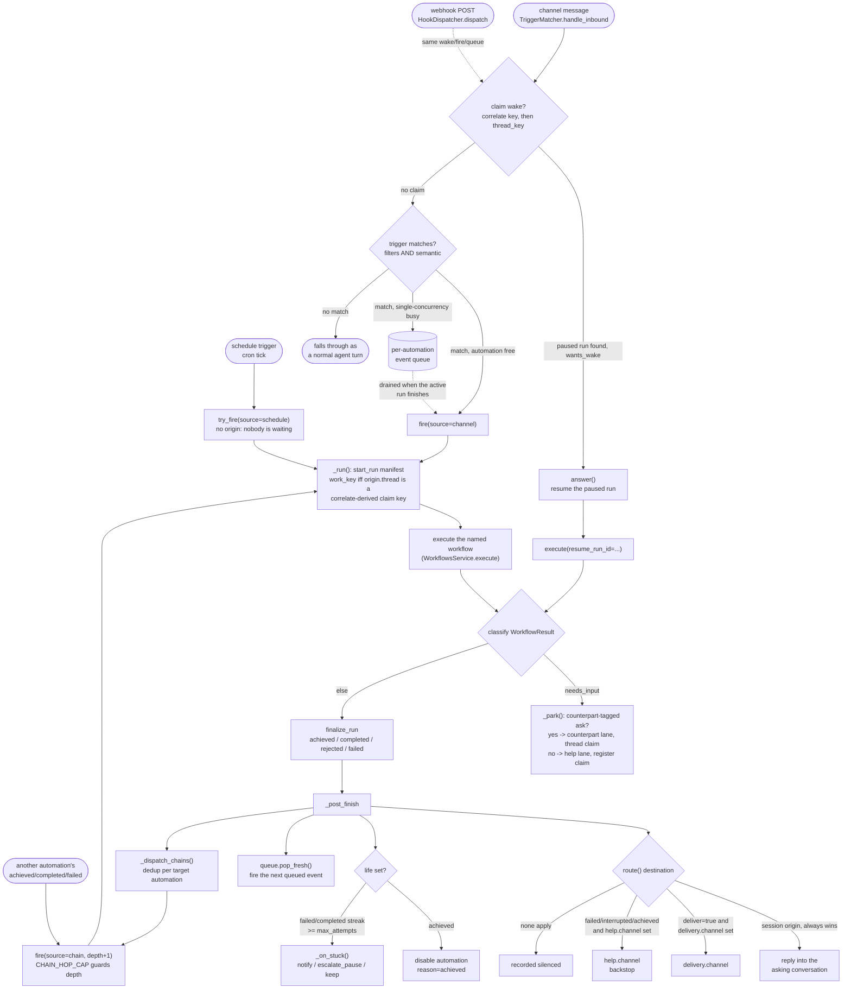

# Automations — standing triggers over workflows

## 1. Purpose

An **automation** is the contract between a workflow and the world: it binds one or
more **triggers** (a schedule, an inbound channel message, a webhook POST, or another
automation's outcome) to a **workflow** run by name, plus how that run's outcome is
**delivered**, how it asks for **help** mid-flight, and — optionally — a **life**
condition: a verifiable end state that disables the automation the moment it is
reached. Where a workflow is a graph that runs once when invoked, an automation is
what makes that graph *stand*: it keeps re-firing on events or a clock after the
conversation that defined it has ended, until its own life condition (if any) says
it's done.

Automations replace the **loops** subsystem, which has been deleted from this
codebase (`docs/internals/loop.md` is the unrelated per-turn agent-loop doc; there is
no loops document any more). The shape carries over — triggers bound to a workflow
body, a delivery/help lane, an optional goal condition, chaining, single-concurrency
queueing, claim-based conversation resumption — but three things changed at the
cutover: outcome classification is now **deterministic**, derived straight from the
workflow's own `WorkflowResult` (`durin.automations.classify`) instead of a
separate LLM goal-judge call; the trigger vocabulary (channel filters, `semantic`,
`correlate`) is shared verbatim with **webhook** triggers instead of being
channel-only; and the object itself is named for what it *is* (a binding, "an
automation") rather than for its execution shape ("a loop"). A workspace that still
has an on-disk `loops/` directory when the gateway boots is migrated automatically —
see §4f — so no manual conversion step exists.

For *when* an automation earns its place over a plain cron job, a `run_workflow`
call, or just doing the task now, see the `automations` skill
(`durin/skills/automations/SKILL.md`) — the value test and single-case doctrine live
there in the agent-facing voice; this document covers the mechanism.

## 2. Mental model

**An automation only ever names a workflow — it never touches workflow-engine
semantics.** `AutomationSpec.workflow` is a plain string; verification, routing, and
what counts as "done" all live *inside* the referenced workflow graph (a routing
node's cases, a script node's exit code, an approval gate). The automation layer's
own job is triggering, classifying the *shape* of what came back (paused / achieved
/ completed / rejected / failed / interrupted), and deciding what happens next —
never scoring the content.

**A fire is one execution; the automation is the standing definition around it.**
`AutomationsRuntime.fire`/`try_fire` start a **run** — one pass through
`AutomationSpec.workflow` — and a run's terminal status feeds three independent,
composable decisions: whether to **deliver** a notice (the `delivery` policy),
whether the automation's **life** condition is now met (auto-disabling it if so, or
counting a miss toward a stuck streak), and whether any **chain**-triggered
automation should fire next. None of these decisions block or retry the run itself —
an automation does not wrap a failed run in a retry loop; a `failed` run is reported
like any other outcome, and internal retry structure belongs inside the workflow.

**A `life` condition makes an automation single-case, not a template.** An
automation with no `life` can legitimately serve an ongoing, non-case-shaped purpose
("summarize this inbox every morning"). An automation *carrying* a `life` condition
is pursuing one specific, nameable end state ("invoice 4471 is paid") and disables
itself the instant `life.achieved_when` is satisfied — the doctrine is: one dedicated
automation per case, not one generic automation expected to track many unrelated
cases at once. See the `automations` skill for the full doctrine and examples.

## 3. Diagram

## 4. How it works

### 4a. The object (`durin/automations/spec.py`)

`AutomationSpec` is a frozen dataclass: `name`, `workflow`, `enabled`, a tuple of
`triggers`, `delivery`, `help`, an optional `life`, and `concurrency`
(`"single"` default, or `"parallel"`). `parse_automation`/`automation_to_dict` are
the only way in or out — every write goes through parse-time validation, and every
read is re-validated the same way (a hand-edited or legacy file that no longer
parses is skipped rather than trusted).

**Triggers** (`AutomationTrigger`) are OR-ed: any one of them firing starts a run. An
automation with none fires only manually (`fire`, from chat or the HTTP `.../fire`
route). Each trigger declares exactly one `source`, and the parser
enforces field ownership per source — setting a `channel`-only field on a `schedule`
trigger (or vice versa) is rejected at parse time, so the four shapes never mix:

- **`schedule`** — `schedule` (a `CronSchedule`-shaped dict: `kind` one of
  `at`/`every`/`cron`, plus the matching `at_ms`/`every_ms`/`expr`+`tz` keys — an
  unknown key for the given `kind` is rejected outright rather than surfacing later
  as a `TypeError` when `cron_sync` builds the real `CronSchedule`) plus `task`, the
  text the fired run's workflow receives. `cron` validates the expression with
  `croniter` when it's installed (import-guarded — silently skipped otherwise)
  and, whenever `tz` is set, always validates it with `zoneinfo` (stdlib, not
  optional — an unknown timezone raises regardless of whether `croniter` ran);
  either failure fails the save, not the first firing.
- **`channel`** — `channel` (`email`/`telegram`/`slack`/`discord`/`whatsapp`),
  `filters` (an open key→value map — see §4c for how a filter is matched and which
  keys each channel actually populates), an optional `semantic` condition (prose
  judged by the aux model), and `match` (`"wake_or_new"` default, or
  `"always_new"` — see §4c).
- **`webhook`** — `hook`, the name that maps to `POST /api/v1/hooks/{hook}` (§6).
  Shares `semantic` and `correlate` with the channel shape; has no `filters` or
  `match` (a webhook trigger always wakes a claim when one exists — see §4c).
- **`chain`** — `chain_automation` (the upstream automation's name) and
  `chain_when` (`"achieved"`/`"completed"`/`"failed"`/`"any"`, default `"any"` —
  meaning any of those three, never every possible outcome; see §4b/chains). Saving
  an automation whose chain edges would close a cycle is rejected outright
  (`durin.automations.chains.validate_chain_edges`, run inside `store.save_automation`
  before the candidate file lands), naming the cycle in the error.
- **`correlate`** (channel or webhook only) — a regex with exactly **one** capture
  group, validated at parse time. The captured text becomes part of a claim key (see
  §4c) that reunites messages carrying the same value (a ticket id, an invoice
  number) across unrelated threads, ahead of the channel's own thread key.

**`delivery`** (`Delivery`) governs whether a *routine* finished-run notice is worth
sending: `channel`/`to` (where), `notify` (`"always"` default,
`"failures_only"`, `"when_notable"`, or `"never"`), and `silent_labels` (default
`("NOTHING_TO_REPORT",)` — an explicit `[]` is a distinct, legal "silence nothing"
config, kept apart from "unset" so an empty list is never mistaken for the default).

**`help`** (`Help`) is the separate backstop lane: a paused run's question or
approval, an escalation, or — when `delivery` stayed quiet or has no channel at all
— a failure or an achieved goal that must still be heard (§4b).

**`life`** (`Life`, optional) is `intent` (prose naming the end state, purely
descriptive — nothing judges against it; see §4b), `achieved_when`
(`"any_completed"` default, or `"label:<LABEL>"` matching the workflow's own
`final_route_label`), `max_attempts` (`None` = never stuck), and `on_stuck`
(`"notify"` default, `"escalate_pause"`, or `"keep"`). An automation carrying `life`
is single-case, not a reusable template — §2 and the `automations` skill.

### 4b. Run flow (`durin/automations/runtime.py`)

`AutomationsRuntime` is the dispatcher. It never blind-retries: a fire happens
because a trigger delivered new information (a cron tick, a channel/webhook match, a
chain outcome, a manual/chat request) — insistence, when wanted, comes from the
trigger's own schedule plus `life`, not from a timer inside the runtime.

**`fire`** (manual/scheduled/chain entry) loads the spec, raises `AutomationBusy` if
`concurrency == "single"` and a run is already active, then runs. **`try_fire`**
(the cron dispatch path) additionally no-ops silently on a disabled automation or a
busy one, rather than raising — a scheduled tick that finds nothing to do is not an
error. Both mint a `run_id`, write the run's manifest via `run_log.start_run` with a
`cause` (`kind` = the trigger source, a capped `excerpt` of the task text) and the
`origin` (the trigger context: which channel/session/webhook/chain caused this,
used later for reply routing), then execute the workflow.

**The `work_key` rule.** A channel-triggered fire's `origin["thread"]` becomes the
workflow's `work_key` (the engine's stable-working-folder / reuse-gate entrance;
`docs/internals/workflow.md` §2) **only** when that thread is a
correlate-derived claim key — matcher-minted as `"custom:<automation>:<capture>"`,
the exact string `claims.register` used to park the run this fire might be waking.
A plain per-channel thread key never becomes a `work_key` on its own: it has no bound
entity behind it, so passing it through would let two unrelated conversations in the
same thread silently share a working folder. Every other fire (cron, manual, chain,
or a channel fire with no `correlate`) gets the engine's default per-run folder.

**Classification** (`durin.automations.classify.classify`) reads the workflow's
`WorkflowResult` in this precedence order — the checks are disjoint by
construction, so exactly one status always applies:

| Check (in order) | Status | Notes |
|---|---|---|
| `result.status == "needs_input"` | `paused` | routes to the help or counterpart lane, never through delivery |
| `result.rejected` is truthy | `rejected` | an approval pause answered "reject" — a deliberate human "no", not a failure |
| `result.status == "completed"` and `is_achieved(result, spec)` | `achieved` | `life.achieved_when` matched; disables the automation (this run's own delivery and chain dispatch still happen first) |
| `result.status == "completed"` | `completed` | |
| anything else (`exhausted`, `aborted`, `cancelled`) | `failed` | |

One case never reaches classification at all: if the workflow result is
`aborted`/`cancelled`, not a deliberate rejection, and the gateway is mid graceful
shutdown (`is_shutting_down()`), `_handle_result` leaves the run's manifest exactly
as `"running"` and reports nothing — a SIGTERM cutting a workflow short has not
failed, only not finished; the next boot's orphan sweep (§4d) is what finalizes and,
if warranted, relaunches it. A genuine approval rejection is excluded from this
carve-out even though it also carries `status == "cancelled"`, since that is a
deliberate human decision, not a shutdown artifact.

**Pausing (`_park`)** handles a `needs_input` result. A workflow's `needs_input`
text tagged with the literal prefix `[TO:counterpart]` is addressed to the external
party the automation corresponds with, not the operator; the tag is stripped before
storage. If the run's `origin` carries a thread, the run parks, a claim is
registered on that thread key, and the question is delivered on the triggering
channel via the counterpart lane (never the help channel) — a later reply on that
thread wakes this exact run. With no thread to reply into (e.g. a webhook or manual
fire with nobody to answer), the ask falls back to the ordinary help lane with a
note appended so it is never silently lost. An untagged ask is always operator-bound
and goes straight to the help lane, registering a claim on the receipt's thread key
(when the channel returns one) so a reply there also resumes the run.

**Delivery and the life/streak check (`_post_finish`)** run for every *terminal*
status (everything except `paused`). Delivery is computed first —
`should_deliver(status, final_route_label, delivery)` implements `notify`'s four
modes, with one override the caller applies on top: an `achieved` outcome always
counts as deliver-worthy regardless of `notify`, since reaching a goal a `life`
automation was configured to pursue must never be silenced by a routine-notice
policy meant for ordinary runs. `route()` (`durin.automations.outcome`) then picks
the actual destination, in this precedence:

1. A **session origin** ("somebody asked from a live conversation") always wins,
   regardless of delivery policy — the run answers back into that conversation, on
   success or failure alike. A channel/webhook/chain/schedule origin never triggers
   this: those identify what *caused* the run, not somebody waiting on it.
2. Otherwise, if delivery says "worth reporting" **and** `delivery.channel` is set,
   the notice goes there.
3. Otherwise, if the status is actionable (`failed`/`interrupted`) — never silently
   lost just because `notify` was `"never"` — **or** `achieved` — audible on a
   `help`-only automation exactly the way a stuck-escalation notice already is —
   **and** `help.channel` is set, the notice goes there as a backstop.
4. Otherwise nowhere; the run is recorded `delivery.result = "silenced"`.

Only after routing does `life` get evaluated, and only on THIS run's own status: an
`achieved` run disables the automation (future triggers stop; this run's delivery
and chain dispatch already happened above). A `failed`/`completed` run with a `life`
carrying `max_attempts` checks `run_log.consecutive_unachieved` — a streak that
skips active runs and is *transparent* to `interrupted`/`rejected`/`paused` runs
(neither breaking nor extending it, since none of the three is evidence about
whether the automation itself is working) — and, once the streak reaches
`max_attempts`, calls `on_stuck` (`"notify"` sends a help-channel notice and keeps
running; `"escalate_pause"` additionally disables the automation; `"keep"` does
neither). Housekeeping — pruning old runs to `automations.keep_runs`, and draining
one fresh event from the automation's queue if one piled up while it ran — happens
last and is contained: a housekeeping failure never makes the caller see a run's
already-delivered outcome as if none occurred. Draining is skipped when this same
run just disabled the automation (achieved or escalate-paused) — refiring something
that was just switched off would defeat the point.

**Chains (`_dispatch_chains`)** fire after everything above. `chain_targets`
(`durin.automations.chains`) returns every enabled automation whose `chain` trigger names this one and
whose `chain_when` accepts this outcome; only `achieved`/`completed`/`failed` are
ever chainable — `chain_when: "any"` means any of those three, not literally any
status, so an interrupted/rejected/paused finish never fires a chain. Depth is
carried through an explicit `chain_depth` counter, refused once it reaches
`CHAIN_HOP_CAP` (8) — cycle rejection at save time (§4a) makes the cap a backstop for
long acyclic chains, not the only thing standing between a bad graph and an infinite
fan-out. Multiple chain triggers naming the same downstream automation fire it once,
not once per matching trigger (deduplicated by target name within one dispatch). A
target that is busy (`AutomationBusy`) is queued rather than dropped, carrying its
`chain_depth` forward so the eventual drained fire resumes the same hop count instead
of silently restarting at zero.

**Answering (`answer` / `_answer`)** resumes a `paused` run. It re-stamps the run's
`owner` to the resuming process (a parked run is routinely answered by a different,
possibly-restarted process than the one that fired it) and releases the claim
*before* resuming — if the resumed workflow immediately asks another tagged
question, `_park` registers a fresh claim, so releasing first never races a
just-registered one. For an `ask_kind == "approval"` pause, an explicit `action`
(the agent tool's `resolution` parameter, the webui Automations inbox's
Aprobar/Corregir/Rechazar, or any other caller of the HTTP answer route passing
one) bypasses free-text parsing and synthesizes the canonical resume text
(`"approve"`/`"reject"`); with no
explicit action, `durin.workflow.approval.parse_approval_reply` interprets the reply
text, defaulting to `"revise"` when it doesn't parse as approve/reject — the same
one algorithm a direct workflow resume uses, so there is exactly one place free text
becomes an approval verdict. The resumed result re-enters `_handle_result` exactly
like a fresh fire's result — same classification, same delivery/life/chain handling.

### 4c. Matcher and webhook ingress (`durin/automations/matcher.py`, `hooks.py`)

`TriggerMatcher.handle_inbound` is registered as a bus inbound interceptor
(`durin/bus/queue.py`'s `add_inbound_interceptor`) and runs on every inbound message
before it is queued for a normal agent turn. `channel_meta.extract`
(`durin/automations/channel_meta.py`, alongside `spec.py` from §4a) first turns the channel-specific message into channel-neutral
`InboundFacts` (sender/text/title/thread_key/chat/… plus each channel's own open
`extra` bag); an unsupported channel (CLI, WebSocket, cron-injected, …) yields `None`
and the message passes straight through untouched.

**Decision order**, evaluated over automations sorted by `name` ascending so the
outcome is deterministic:

1. **Correlate-derived claim wake.** For every enabled automation's channel trigger
   matching this message's channel that declares `correlate`, derive
   `"custom:<automation>:<capture>"` from the message and try to wake a claim on it
   — structurally only; `semantic` is never evaluated here, because a claim already
   existing means a run is genuinely waiting, and `semantic` only gates whether a
   *new* run should open.
2. **Plain thread-key claim wake**, only if nothing woke above.
3. **Trigger match**, only if nothing woke: the first automation (ascending name)
   whose channel trigger matches this channel — every `filters` entry holds
   (`_contains` keys are case-insensitive substrings on prose; every other key is an
   exact, case-insensitive match on a core fact or a channel's own `extra` key — a
   filter naming a key the channel never populates matches nothing and was warned
   about at save time) — and whose optional `semantic` condition, if any, the aux
   model judges true (fail-closed: no judge configured or a judge error both mean
   no match) — wins. A match dispatches (fire or queue, next paragraph); no match
   lets the message fall through as an ordinary agent turn.

A woken claim honors the claim-holder automation's own `match` setting on this
channel: `"wake_or_new"` (default) resumes the parked run; `"always_new"` leaves the
claim alone and lets the message fall through to trigger matching instead, so that
automation always opens a fresh run per matching message rather than resuming one
mid-flight. A stale claim (its run is no longer `paused`, or has vanished) is
released and the message keeps looking for a match.

**Dispatch** (`_dispatch_match`) decides fire vs. queue for a matched trigger: not
busy → schedule a background fire task (a synchronous `_pending_fires` set closes
the race between two messages arriving back-to-back for the same single-concurrency
automation, since the busy check and the actual fire are not atomic across an
`asyncio.create_task` boundary); busy and a queue is wired → push the event onto
`durin.automations.queue`, drained by `_post_finish` once the active run ends; busy
with no queue wired → log a warning and let the message pass through as a normal
turn instead (the message is not silently eaten).

**`durin.automations.hooks.HookDispatcher`** gives `POST /api/v1/hooks/{hook}` the
identical wake/fire/queue decision instead of reimplementing it: it builds a
synthetic `InboundMessage`/`InboundFacts` pair (`channel="webhook"`) and calls the
matcher's own `_correlate_key`/`_try_wake`/`_semantic_match`/`_dispatch_match`
directly. Dispatch is two passes, mirroring the matcher's own wake-then-match
structure: a **wake pass** tries every enabled automation's matching webhook trigger
with a `correlate` that captures on the payload, purely structurally (same
semantic-blind reasoning as above); only if nothing woke does the **fire pass** run,
where `semantic` gates entry before `_dispatch_match` decides fire vs. queue. The
route answers `202` with `{"result": "woken"|"fired"|"queued", "automation": ...}`,
or `404` (`no_match`) when no enabled automation's webhook trigger accepts the
payload.

### 4d. Orphan sweep and shutdown semantics

`sweep_orphans` runs at gateway boot and periodically thereafter. It reads
`run_log.find_orphans` — every `"running"` manifest whose owning process is no
longer alive (or, for a manifest written before ownership tracking existed, older
than a generous age cutoff) — and, for each, asks one question: did the workflow's
own manifest ever get created? Existence, not a completed-node count, is the test,
since a node is only recorded once it finishes — a run killed inside its first node
shows an empty trace while being the *most* likely to have already posted somewhere
external, and treating "no nodes yet" as safe-to-relaunch would relaunch exactly
those. If work had started, the run finalizes `"interrupted"` with no replacement. If
nothing had started and the automation is still enabled, a replacement run id is
reserved and named in the interrupted notice. If the automation was disabled while
the gateway was down, the run finalizes `"interrupted"` with no replacement and says
why — `fire` itself ignores `enabled` (a manual run-now must still work on a paused
automation), so this sweep is the one place that switch is honored for a run nobody
explicitly asked for. Every orphan in a sweep pass is finalized and its outcome
delivered (through the same `_post_finish` path as an ordinary terminal run) *before*
any relaunch starts — a slow relaunch must not stall the notify step of every other
orphan behind it, and a `single`-concurrency automation's still-`"running"` manifest
would otherwise make a concurrent fire attempt see it as busy for the whole time.
Relaunches are then backgrounded together. A relaunch that loses the busy race, or
raises, retracts the run id it already promised (`report_no_outcome` — a best-effort
direct delivery bypassing `route()`, since there is no run manifest to attach a
delivery record to) so a recipient told "replacement X is coming" is also told when
X never happened, rather than waiting on a message that will never arrive.

**Shutdown vs. deliberate stop.** A graceful shutdown (SIGTERM/SIGINT/SIGHUP) cancels
every in-flight workflow the same way a deliberate `tasks(action='stop')` does —
both arrive at `_handle_result` as the same `WorkflowResult.status in
("aborted", "cancelled")`. They are told apart by `rejected` (only a deliberate
answer to a paused approval sets it) plus `is_shutting_down()`: a shutdown-caused
cancellation is left exactly as `"running"` (§4b) so the *next* boot's orphan sweep
is what finalizes, reports, and — if warranted — relaunches it, rather than this
process misreporting it as `"failed"` on its way down.

### 4e. Cron integration (`durin/automations/cron_sync.py`)

Each enabled automation's `schedule`-source triggers materialize as ordinary cron
jobs, one per trigger, with a deterministic id
(`automation:<automation-name>:<trigger-index>`) and
`payload.kind == "automation_trigger"`. `sync_automation_jobs` diffs the wanted set
against the automation's existing `automation:`-prefixed jobs and reconciles via
`register_system_job`/`remove_system_job`; it runs on every automation save and
delete (`durin.service.automations`, `durin.agent.tools.automations`), and
`sync_all` re-syncs every stored automation at gateway boot, additionally pruning
any orphaned `automation:*` job (owning automation deleted) and — unconditionally,
regardless of match — every surviving legacy `loop:*` job. A disabled automation, or
a trigger whose `source` isn't `schedule`, contributes no job.

Like a `system_event` job, an `automation_trigger` job **is** protected from the
public `remove_job`/`update_job` cron API (both refuse any job whose `payload.kind`
is one of those two) — it is owned by the automation, not directly user-editable —
so `cron_sync` writes and removes it through the same `register_system_job`/
`remove_system_job` bypass door `register_system_job` itself relies on for system
jobs (`docs/internals/cron.md` §4/§5 covers the general mechanism).

When an `automation_trigger` job fires, the gateway's cron dispatch calls
`AutomationsRuntime.try_fire(automation, source="schedule")` directly — no
`agent_turn` prompt is built, and no `origin` is passed: a scheduled fire has nobody
waiting on it, so its outcome is governed entirely by the automation's own
`delivery`/`help` configuration. A `payload.kind == "loop_trigger"` job — `CronPayload`
still parses this shape so an unmigrated or hand-edited persisted store loads without
crashing — is logged and skipped rather than falling through to the generic
`agent_turn` path (which has no handler for an empty free-form prompt): a belt-and-
suspenders safety net for the narrow window before `sync_all`'s unconditional prune
(above) and the boot migration's own prune (§4f) have run.

### 4f. Migration (`durin/automations/migrate.py`)

`migrate_loops` runs once at gateway boot, immediately before `cron_sync.sync_all`,
wrapped so an I/O failure never fails startup. It is idempotent on the presence of
`<workspace>/loops/`: nothing to migrate (never had one, or already migrated) is a
silent no-op returning `[]`.

A pre-existing `loops/*.json` is parsed by
`durin.automations._legacy_loop_spec.parse_loop` — a frozen copy of the deleted
loops package's own parser, kept alive for this one read only and never extended.
Each parsed `LoopSpec` is hand-converted to an automation dict and run through the
*real* `parse_automation` (full validation) and `store.save_automation` (chain-cycle
check, normal versioning) — never assembled by copying fields into an
`AutomationSpec` directly, so a migrated automation is validated exactly as strictly
as one hand-authored today. The trigger mapping:

| Loop trigger | Automation trigger | Note |
|---|---|---|
| `cron` (schedule, no task text) | `schedule` | loops had no `task` field; the migration synthesizes `"Run the <workflow> workflow"` and logs/reports the synthesized text as a real, user-visible behavior change |
| `channel` | `channel` | verbatim — `filters`/`semantic`/`correlate`/`match` all carry over unchanged |
| `webhook` | `webhook` | verbatim — `hook`/`semantic`/`correlate` carry over unchanged |

A loop's `goal.checks` (script/assertion pass-fail checks) have **no** automation
equivalent — a check's verdict cannot feed `life.achieved_when`, which reads a
workflow's own `final_route_label` — so every check is **dropped**, with a warning
naming the loop and the check, instructing that the verification move into the
referenced workflow as a final exit-0 labeler `cases` node. This is an exit-0
labeler, not a migration failure: the loop still converts, minus enforcement the
new object structurally cannot express the old way. `goal.intent` maps straight to
`life.intent`, with `achieved_when` always fixed to `"any_completed"` and `on_stuck`
to `"notify"` (loops had no per-label achievement concept, nor a stuck-mode choice);
`stuck_after`/`operator_channel`/`operator_to` map to `life.max_attempts` and both
`delivery`/`help`'s `channel`/`to` (delivery's own `notify` is fixed to
`"failures_only"` for a migrated definition, loops having had no separate
delivery-policy knob).

Alongside definitions, the migration relocates `loops-runs/` →
`automations-runs/` (`run_log.runs_root`), `loops/claims.json` →
`automations/claims.json` (skipped, with a note, if a claims file already exists at
the destination — never overwritten), and `loops/queue/` →
`automations/queue/`. `loops/` itself is then renamed to `loops-migrated/` (kept for
rollback, not deleted) rather than removed — the rename is what makes a second boot
see "nothing to migrate" and no-op. Finally every `loop:*` cron job is pruned
(`cron_service.remove_job` — a plain removal, since these are pre-cutover jobs, not
automation-owned ones), redundantly with `cron_sync.sync_all`'s own unconditional
`loop:*` prune (§4e) — deliberate belt-and-suspenders, both idempotent, not a
conflict. A loop file that fails to parse or convert is skipped with a logged error;
one bad file never aborts the boot.

## 5. Key types & entry points

| Symbol | File | Role |
|---|---|---|
| `AutomationSpec`, `AutomationTrigger`, `Delivery`, `Help`, `Life` | `durin/automations/spec.py` | The definition schema; `parse_automation`/`automation_to_dict` are the sole parse/serialize entrances, enforcing per-source field ownership |
| `AutomationsRuntime` | `durin/automations/runtime.py` | The dispatcher: `fire`/`try_fire`/`answer`, run→classify→park-or-finalize→deliver→life→chains, `sweep_orphans`, `report_no_outcome` |
| `classify`, `is_achieved`, `should_deliver` | `durin/automations/classify.py` | Pure functions: workflow result → automation status; delivery-policy decision |
| `AutomationOutcome`, `Destination`, `build_outcome`, `route` | `durin/automations/outcome.py` | What a finished run reports, and the destination-precedence decision (session > delivery > help backstop > silenced) |
| `TriggerMatcher` | `durin/automations/matcher.py` | Inbound bus interceptor: claim wake, trigger match, fire/queue/pass-through decision |
| `HookDispatcher` | `durin/automations/hooks.py` | Webhook POST ingress; reuses `TriggerMatcher`'s wake/fire/queue machinery |
| `channel_meta.extract`, `InboundFacts`, `CHANNEL_FILTER_KEYS`, `build_reply` | `durin/automations/channel_meta.py` | Per-channel adapter: inbound message → channel-neutral facts; captured origin → outbound reply |
| `claims` (`register`/`lookup`/`release`/`release_run`/`prune`) | `durin/automations/claims.py` | Thread/correlate key → paused-run index, `automations/claims.json` |
| `queue` (`push`/`pop_fresh`/`pending`) | `durin/automations/queue.py` | Per-automation event queue for a busy `single`-concurrency automation |
| `chain_targets`, `validate_chain_edges`, `CHAIN_HOP_CAP` | `durin/automations/chains.py` | Chain-trigger graph: save-time cycle rejection, runtime outcome-filtered targets |
| `load_automation`, `save_automation`, `delete_automation`, `list_automations` | `durin/automations/store.py` | Definition persistence, one JSON file per automation under `automations/`, versioned on every write |
| `run_log` (`start_run`/`finalize_run`/`find_orphans`/`consecutive_unachieved`/`prune_runs`) | `durin/automations/run_log.py` | Run manifests under `automations-runs/`, streak tracking, ownership-based orphan detection |
| `sync_automation_jobs`, `sync_all`, `remove_automation_jobs` | `durin/automations/cron_sync.py` | Keeps `automation_trigger` cron jobs in sync with `schedule` triggers |
| `migrate_loops` | `durin/automations/migrate.py` | Boot-time converter: a pre-existing `loops/` workspace becomes its `automations/` equivalent |
| `build_filter_prompt`, `parse_filter_verdict` | `durin/automations/judge.py` | The `semantic` trigger-filter judge's prompt and strict-JSON verdict parse |
| `AutomationVersionStore` | `durin/automations/version_store.py` | Git-backed version history for `automations/`, same mechanism as workflows/skills/memory |
| `AutomationsService` | `durin/service/automations.py` | HTTP surface: list/get/save/delete/fire/answer/runs/hooks-secret |
| `AutomationsTool` | `durin/agent/tools/automations.py` | Chat-facing tool: list/status/fire/answer/enable/pause/create |

## 6. Configuration & surfaces

### Telemetry

Five `emit_tool_event` events, bound to an `automation:<name>` session telemetry
logger whenever a call runs outside a live agent turn (cron dispatch, webhook POST):

| Event | Payload | Emitted when |
|---|---|---|
| `automations.fired` | `automation`, `source`, `skipped` | `fire`/`try_fire` starts a run (`skipped=True` when `try_fire` found the automation disabled or busy) |
| `automations.event_matched` | `automation`, `source_channel`, `action` | The matcher or hook dispatcher makes a decision — `action` one of `woke`/`fired`/`queued`/`passed_busy`/`drained` |
| `automations.run_finished` | `automation`, `run_id`, `status`, `final_route_label` | A run reaches a terminal status (`_post_finish`) |
| `automations.delivered` | `automation`, `run_id`, `channel`, `result` | An outcome is routed — `result` one of `delivered`/`failed`/`silenced` |
| `automations.escalated` | `automation`, `run_id`, `consecutive_unachieved` | `life.on_stuck` fires (`notify` or `escalate_pause`) |

See `docs/internals/observability.md` for the telemetry pipeline these events feed.

### Config keys

`agents.automations` (`AutomationsConfig`):

| Key | Default | Description |
|---|---|---|
| `automations.keep_runs` | `20` | Finalized run manifests kept per automation (a `paused` run is never pruned) |
| `automations.queue_ttl_s` | `3600` | How long a queued channel/webhook event stays fresh before the drain hook drops it unfired |
| `agents.aux_models.automations` | unset | Model preset for the `semantic` trigger-filter judge; unset rides whatever model is live in the interactive session by default rather than a separately resolved default preset |

**Legacy, migration-only.** `agents.loops` (`LoopsConfig`) and
`agents.aux_models.loops` no longer configure anything at runtime — the subsystem
they governed is deleted. Their `keep_runs`/`queue_ttl_s`/model fields are read
exactly once, at config load, to populate the matching `automations.*` field when a
config file sets the legacy key and leaves the new one unset; `loops.check_timeout_s`
has no automations equivalent (automations classifies a run's outcome from the
workflow's own result, not a separately timed goal-check pass) and is never
migrated. Both legacy sections are otherwise inert.

### The write barrier

`automations/` is one of the three registry directories (`skills`, `workflows`,
`automations`) a generic filesystem write tool refuses to touch
(`durin/agent/tools/filesystem.py`'s `_resolve_write`) — reads stay legitimate, but a
definition can only be written through the door that validates and versions it: the
`automations` tool's `create`/`enable`/`pause` actions, the webui's automations
editor, or a script calling the HTTP API directly — see the guide's "Managing
automations today". All three ultimately call the same `save_automation()` store
function (directly for the agent tool; through `AutomationsService.save` /
`PUT /api/v1/automations/{name}` for the webui editor and direct API callers), so
validation and versioning happen exactly once regardless of the door. This closes
the same gap that once let workflow edits land unvalidated and unversioned.

### Service surface

`AutomationsService` (`durin/service/automations.py`), scoped
`automations:read`/`automations:write` (`Scope.AUTOMATIONS_READ`/`_WRITE`):

| Method | Route | Scope |
|---|---|---|
| `list` | `GET /api/v1/automations` | read |
| `get` | `GET /api/v1/automations/{name}` | read |
| `save` | `PUT /api/v1/automations/{name}` | write |
| `delete` | `DELETE /api/v1/automations/{name}` | write |
| `fire` | `POST /api/v1/automations/{name}/fire` | write |
| `answer` | `POST /api/v1/automations/{name}/runs/{run_id}/answer` | write |
| `runs_feed` | `GET /api/v1/automations/runs` | read |
| `runs_list` | `GET /api/v1/automations/{name}/runs` | read |
| `hooks_secret` | `GET /api/v1/automations/hooks-secret` | write |

`list` additionally folds in each automation's live counts (`active_runs`, `paused`,
`pending_events` from the queue) and life state (`attempts`, `achieved`, `stuck`).
`fire`/`answer` need a live `AutomationsRuntime` wired onto the service (the gateway
does this; a runtime-less surface, e.g. spec-reading tooling, answers `503`). See
`docs/internals/api.md` for the general service/route/scope machinery and the
generated OpenAPI contract (`contract/openapi-v1.json`) for exact request/response
field shapes.

### Webhook ingress

`POST /api/v1/hooks/{hook}` (`durin/api/asgi.py`'s `hooks_handler`) is
secret-header gated (`X-Durin-Hook-Secret`, compared with `hmac.compare_digest`
against `ApiTokenStore.get_or_create_hooks_secret()`), **not** bearer-token
authenticated like the rest of `/api/v1` — a webhook caller is an external service,
not a webui/CLI principal. A missing, non-ASCII, or mismatched secret answers `401`
before the body is even parsed; a non-object JSON body answers `400`; a `hook_dispatcher`
missing from this surface answers `503`; otherwise the dispatch result (§4c) decides
the response — `no_match` answers `404`, anything else (`woken`/`fired`/`queued`)
answers `202` with the result body. The shared secret is fetched via
`GET /api/v1/automations/hooks-secret` (above).

### Agent tool

`automations` (`durin/agent/tools/automations.py`; `_scopes = {"core"}` — a
standing-state creator, gated like `cron`) exposes `list`/`status`/`fire`/`answer`/
`enable`/`pause`/`create` to chat. `fire` backgrounds the actual run and never blocks
the calling turn on its outcome: it returns the run id immediately. When the calling
context has a `session_key`, `set_context` stamps the tool's origin as
`{"kind": "session", "session_key": ..., ...}`, so the eventual outcome arrives back
as an injected follow-up message in the same conversation — the session-origin
destination §4b's `route()` always prefers. On a surface with no session wired, the
tool says so up front instead of promising a follow-up that can never arrive. See the
`automations` skill (`durin/skills/automations/SKILL.md`) for the full per-action
usage contract and the single-case doctrine.
