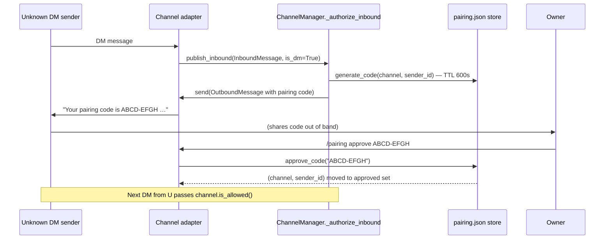

# Channels & Message Bus

## 1. Purpose

The channels subsystem is durin's input/output layer. It translates
platform-specific events (Telegram messages, Discord DMs, WebSocket frames,
emails, Slack events, and others) into a neutral `InboundMessage` that the
agent loop can process, and routes `OutboundMessage` responses back to the
originating platform without the agent ever knowing which platform it is
talking to.

Three concerns are handled here that belong nowhere else:

- **Plugin discovery** — new channel adapters can be added as Python packages
  and are loaded automatically at startup.
- **Permission and pairing** — inbound authorization is enforced once,
  centrally, at the message-bus ingress gate; unapproved DM senders are handed
  a time-limited pairing code; the owner approves or denies via `/pairing`.
- **Streaming and deduplication** — the outbound dispatcher coalesces stream
  deltas, gates progress and reasoning messages per channel capability, and
  retries on transient delivery failures, all in one place.

## 2. Mental model

**Decoupled bidirectional broker.** Two `asyncio.Queue` objects in
`MessageBus` are the only coupling between channels and the agent loop. Each
channel adapter runs its own async listener loop and pushes `InboundMessage`
objects onto `bus.inbound`; the agent loop consumes them and pushes
`OutboundMessage` objects onto `bus.outbound`. The outbound dispatcher
(`ChannelManager._dispatch_outbound`) consumes from `bus.outbound` and calls
the appropriate channel's `send` / `send_delta` methods. Neither side blocks
the other; the queues absorb timing differences.

**Plugin discovery with built-in priority.** `discover_all()` in
`durin/channels/registry.py` first scans the `durin.channels` package with
`pkgutil` to find built-in adapters, then loads external adapters registered
via the Python `entry_points` group `durin.channels`. Built-in adapters always
win if a plugin registers the same name. `ChannelManager._init_channels`
iterates the discovered classes, checks `config.channels.<name>.enabled`, and
instantiates the ones that are on.

**Inbound authorization and pairing.** Authorization is enforced once,
centrally, at the message-bus ingress via `MessageBus.publish_inbound`. When
`ChannelManager` starts it installs `_authorize_inbound` on the bus via
`bus.set_inbound_authorizer`. Every call to `publish_inbound` — from any
channel or internal publisher — runs through this gate before the message is
enqueued. Channels are pure transport and MUST NOT re-implement authorization
in their handlers.

The gate applies three rules in order: (1) messages whose channel name is not
in `ChannelManager.channels` (cli, cron, subagent, TUI — internal origins) are
always trusted; (2) for registered chat channels, `channel.is_allowed(sender_id)`
is called — star wildcard, allowlist, or pairing-store approval; (3) if denied
and the message is a DM (`is_dm=True`), a pairing code is generated via
`generate_code` and sent back to the sender; if denied and the message is a
group message, it is silently dropped.

`BaseChannel.is_allowed(sender_id)` checks three layers: a wildcard (`"*"`) in
`allow_from`, an exact match in the `allow_from` list, and a lookup in the
pairing store (`is_approved(channel, sender_id)`). Channels set `is_dm` on the
`InboundMessage` they publish so the gate can distinguish private from group
context. The pairing store is a small JSON file at `<durin_home>/pairing.json`
guarded by a `threading.Lock` plus `cross_process_lock` for cross-process
safety (see `durin/pairing/store.py`). The owner runs `/pairing approve <code>`
to move a sender from pending to approved.

## 3. Diagram

### Full message flow

```mermaid
sequenceDiagram
    participant P as Platform<br/>(Telegram / Discord / etc.)
    participant CH as Channel adapter<br/>(BaseChannel subclass)
    participant BUS as MessageBus<br/>publish_inbound → gate → inbound queue
    participant GATE as ChannelManager<br/>_authorize_inbound
    participant LOOP as AgentLoop
    participant MGR as ChannelManager<br/>(_dispatch_outbound)

    Note over CH: start() — long-running listener

    P->>CH: platform event (message / update)
    CH->>CH: _handle_message(sender_id, chat_id, content, is_dm=…)
    CH->>BUS: publish_inbound(InboundMessage)
    BUS->>GATE: _authorize_inbound(msg)
    alt channel unknown (cli/cron/subagent/TUI)
        GATE-->>BUS: True (trusted — internal origin)
    else channel.is_allowed(sender_id)
        GATE-->>BUS: True
    else not allowed + is_dm
        GATE->>CH: send(OutboundMessage with pairing code)
        Note over GATE: pairing code stored in pairing.json (TTL 600s)
        GATE-->>BUS: False (dropped)
    else not allowed + group
        Note over GATE: silently dropped
        GATE-->>BUS: False (dropped)
    end
    BUS-->>LOOP: consume_inbound() (allowed messages only)
    LOOP->>LOOP: process turn (state machine)
    LOOP->>BUS: publish_outbound(OutboundMessage)
    BUS-->>MGR: consume_outbound()
    alt _reasoning_delta / _reasoning_end / _reasoning
        MGR->>MGR: check channel.show_reasoning
        MGR->>CH: send_reasoning_delta / send_reasoning_end
    else _progress message
        MGR->>MGR: _should_send_progress (send_progress / send_tool_hints)
        MGR->>CH: send(msg) if allowed
    else _retry_wait
        MGR->>CH: send(msg) only for websocket channel
    else _stream_delta
        MGR->>MGR: _coalesce_stream_deltas (same channel+chat_id+_stream_id)
        MGR->>CH: send_delta(chat_id, content, metadata)
    else final response
        MGR->>MGR: _should_suppress_outbound (SHA1 dedup by origin_message_id)
        MGR->>CH: send(OutboundMessage)
    end
    CH->>P: platform-specific delivery (with retry backoff)
```

### Pairing approval sub-flow



### Plugin discovery and startup

```mermaid
flowchart TD
    A[gateway start] --> B[ChannelManager.__init__]
    B --> C[_init_channels]
    C --> D["discover_all()<br/>durin/channels/registry.py"]
    D --> E["pkgutil.iter_modules(durin.channels)<br/>built-in adapters"]
    D --> F["entry_points(group='durin.channels')<br/>external plugins"]
    E --> G{built-in wins on name clash}
    F --> G
    G --> H[for each discovered class]
    H --> I{config.channels.name.enabled?}
    I -- No --> J[skip]
    I -- Yes --> K["_resolve_section_secrets(section)<br/>expand \${secret:} refs"]
    K --> L[cls(config, bus, **kwargs)]
    L --> M[inject TranscriptionService]
    M --> N[set send_progress / send_tool_hints / show_reasoning]
    N --> O[channels dict]
    O --> P[start_all: asyncio tasks per channel<br/>+ _dispatch_outbound task]
```

## 4. How it works

### Startup

`MessageBus()` is constructed once per gateway process. `ChannelManager` is
constructed with the bus and the full `Config`. In `_init_channels` it calls
`discover_all()`, which combines built-in adapters found by
`pkgutil.iter_modules` with external adapters from `entry_points`. For each
enabled channel it resolves `${secret:}` credential references with
`_resolve_section_secrets` (so plaintext never lives in the shared config
object), constructs the channel, injects the shared `TranscriptionService`
(built once from `config.transcription`), and copies the global boolean
overrides (`send_progress`, `send_tool_hints`, `show_reasoning`). Per-channel
values in config can override the global defaults.

Once `start_all` is called, a dedicated asyncio task is created for
`_dispatch_outbound`, and one task per channel calls `channel.start()`.

### Inbound path

Every channel's `start()` implementation runs a platform-specific event loop
(polling, webhook, or persistent connection). When an event arrives, the
channel calls `self._handle_message(sender_id, chat_id, content, is_dm=…)`.

`_handle_message` is purely a transport helper: it attaches the
`"_wants_stream": True` flag when the channel supports streaming
(`config.streaming=True` AND the subclass overrides `send_delta`), constructs
an `InboundMessage`, and calls `bus.publish_inbound`. Authorization is not
performed in the channel.

`MessageBus.publish_inbound` runs the installed inbound-authorizer gate before
enqueuing the message. `ChannelManager` installs `_authorize_inbound` as the
gate at construction time. `publish_inbound` is the only path that enqueues to
`bus.inbound`, so any message that reaches the bus is gated and the gate cannot
be bypassed once a message is published.

The channel contract is to be **pure transport**: publish unconditionally with
`is_dm` set and let the gate authorize — a channel should NOT re-implement
`is_allowed`/pairing in its handlers. **Telegram is the reference implementation
of this contract.** Several other channels still pre-filter with their own
`is_allowed` check and early-`return` in their handlers (legacy behaviour,
unchanged here — those messages never reach the gate); migrating them to pure
transport so they route through the central gate is a follow-up. New channels
should follow the Telegram model.

The agent loop (`AgentLoop.run()`) consumes from `bus.inbound`. The
`InboundMessage.session_key` property returns `session_key_override` when set,
or `"{channel}:{chat_id}"` otherwise. This lets thread-scoped sessions (for
example, Slack threads) share a distinct session from the channel-level one.

### Outbound path

After completing a turn, the agent loop publishes one or more `OutboundMessage`
objects to `bus.outbound`. The `_dispatch_outbound` loop in `ChannelManager`
consumes these and applies a layered gating and transformation pipeline:

1. **Reasoning routing** — messages with `_reasoning_delta`, `_reasoning_end`,
   or `_reasoning` in metadata are routed only when `channel.show_reasoning`
   is true, and only channels that override `send_reasoning_delta` /
   `send_reasoning_end` render them (the default is a no-op).

2. **Progress gating** — `_progress` messages are passed through only when
   `channel.send_progress` is true. `_progress` messages with `_tool_hint=True`
   also check `send_tool_hints` (unless the channel renders structured tool
   payloads natively, in which case the gate is bypassed).

3. **Retry-wait gating** — `_retry_wait` messages are only delivered on the
   `websocket` channel (the webui shows a visible indicator; CLI/TUI users rely
   on the running indicator).

4. **Stream delta coalescing** — consecutive `_stream_delta` messages for the
   same `(channel, chat_id, _stream_id)` are merged into a single call via
   `_coalesce_stream_deltas`. This reduces API calls when the LLM generates
   faster than the platform can process. Coalescing stops at a stream-end
   marker or at the first message belonging to a different stream or target.

5. **Duplicate suppression** — for non-streaming final responses, the dispatcher
   computes a whitespace-normalized SHA1 fingerprint of the content and checks
   it against `_origin_reply_fingerprints` keyed by `(channel, chat_id,
   origin_message_id)`. Identical content for the same origin message is
   suppressed. Progress and streaming messages are exempt from this check.

6. **Delivery** — `_send_with_retry` dispatches to `_send_once`, which calls
   the appropriate channel method (`send_reasoning_end`, `send_reasoning_delta`,
   `send_delta`, or `send`). On failure it retries up to
   `config.channels.send_max_retries` times with exponential backoff delays of
   1s, 2s, and 4s.

### Channel adapter contract

Every channel is a subclass of `BaseChannel` with three abstract methods:

- `start()` — long-running async listener; pushes inbound messages to the bus
  via `_handle_message` (which calls `bus.publish_inbound`). Channels publish
  unconditionally and set `is_dm=True` when the message arrived in a private
  chat so the central gate can distinguish DM from group context.
- `stop()` — graceful shutdown.
- `send(msg: OutboundMessage)` — deliver a final response; raise on failure so
  the manager retries.

Two optional streaming methods default to no-ops: `send_delta(chat_id, delta,
metadata)` and `send_reasoning_delta(chat_id, delta, metadata)`. The
`supports_streaming` property returns `True` only when both `config.streaming`
is true and the subclass actually overrides `send_delta` (checked by identity
against `BaseChannel.send_delta`).

`is_allowed(sender_id)` is a policy method called by the central gate — NOT by
the channel itself. It checks: `"*"` in `allow_from`, exact match in
`allow_from`, and `is_approved(channel, sender_id)` from the pairing store.
Channels MUST NOT call `is_allowed` in their own handlers.

A channel registers its default configuration via the class method
`default_config()` which the onboarding flow uses to seed `config.json`.

### Audio transcription contract

When a channel transcribes incoming audio at the channel level, it must pass the
transcript text to the agent and **drop the audio path from `media`**. The raw
path is forwarded only when transcription fails, as a fallback for the
`interpret_audio` tool. This mirrors the TUI drag-drop path
(`durin/cli/dragdrop.py::transcribe_dragged_audio`) and the WhatsApp adapter
(`durin/channels/whatsapp.py`), and matches the agent loop's `audio_mode="auto"`
behaviour, which silently skips audio paths in `media`. Passing both the
transcript text and the raw path causes the model to invent a file path and call
`interpret_audio` on it — a hallucination the contract prevents.

WhatsApp is the reference implementation of this contract. Channels that
transcribe locally (currently Telegram, Matrix, Feishu, and Weixin) apply the
same idiom: on transcription success, return an empty `media` list and a
`[transcription: …]` content part; on failure, return the audio path so the
`interpret_audio` tool remains a usable fallback.

### Pairing store

The pairing store (`durin/pairing/store.py`) is a small JSON file at
`<durin_home>/pairing.json` with two top-level sections: `"approved"` (channel
→ set of sender IDs) and `"pending"` (code → `{channel, sender_id,
expires_at}`). All mutations use `threading.Lock` plus `cross_process_lock`
over the file path for cross-process safety. Expired pending entries are
collected lazily by `_gc_pending` on every read-modify-write; there is no
background worker. `approve_code` moves an entry from pending to approved;
`deny_code` removes it; `revoke` removes an approved sender.

## 5. Key types and entry points

| Symbol | File | Role |
|---|---|---|
| `BaseChannel` | `durin/channels/base.py` | Abstract adapter base. Owns `_handle_message` (publishes to bus; no auth), `is_allowed` (policy called by the gate, not the channel), `supports_streaming`, `send`, `send_delta`, `send_reasoning_delta`, `send_reasoning_end`, `transcribe_audio`. |
| `ChannelManager` | `durin/channels/manager.py` | Lifecycle and dispatch coordinator. `_init_channels` discovers and instantiates. `_dispatch_outbound` applies gating, coalescing, dedup, and retry. `start_all` / `stop_all` manage the asyncio task tree. |
| `MessageBus` | `durin/bus/queue.py` | Two `asyncio.Queue` objects (`inbound`, `outbound`). `publish_inbound` runs the installed inbound-authorizer gate before enqueuing; `set_inbound_authorizer` wires the gate. |
| `InboundMessage` | `durin/bus/events.py` | Channel-to-loop event: `channel`, `sender_id`, `chat_id`, `content`, `media`, `metadata`, `session_key_override`. `session_key` property returns override or `"channel:chat_id"`. |
| `OutboundMessage` | `durin/bus/events.py` | Loop-to-channel event: `channel`, `chat_id`, `content`, `reply_to`, `media`, `metadata`, `buttons`. Metadata carries routing and flag keys such as `_progress`, `_stream_delta`, `_reasoning_delta`, `_retry_wait`. |
| `discover_all` | `durin/channels/registry.py` | Returns merged dict of built-in (pkgutil scan) + external (entry_points) channel classes. Built-ins shadow plugins of the same name. |
| `generate_code` | `durin/pairing/store.py` | Creates a pairing code (`ABCD-EFGH` format, 8 chars) for an unapproved DM sender and writes it to `pairing.json` with a TTL. |
| `approve_code` | `durin/pairing/store.py` | Moves a pending code to the approved set; returns `(channel, sender_id)` or `None` if expired or absent. |
| `is_approved` | `durin/pairing/store.py` | Read-only check: is `sender_id` in the approved set for `channel`? |
| `handle_pairing_command` | `durin/pairing/store.py` | Pure function dispatching `/pairing list|approve|deny|revoke` subcommands. Used by both CLI and `CommandRouter`. |
| `format_pairing_reply` | `durin/pairing/store.py` | Returns the user-facing string sent to an unapproved DM sender containing their pairing code. |
| `TelegramChannel` | `durin/channels/telegram.py` | Telegram adapter using `python-telegram-bot`. Implements streaming via in-place message edits. |
| `WebSocketChannel` | `durin/channels/websocket.py` | WebSocket server channel that also hosts the embedded webui SPA. Handles token issuance, `websocket_requires_token`, and session/cron integration. |
| `EmailChannel` | `durin/channels/email.py` | IMAP+SMTP adapter. Polls for new messages and sends replies. |

## 6. Configuration and surfaces

### Global channel settings (`channels.*`)

| Config key | Type | Default | Effect |
|---|---|---|---|
| `channels.send_progress` | bool | `true` | Deliver intermediate progress messages to channels. Per-channel override allowed. |
| `channels.send_tool_hints` | bool | `false` | Deliver tool-call hint messages (e.g. `read_file("…")`). Per-channel override allowed. |
| `channels.show_reasoning` | bool | `true` | Route model reasoning content to channels that implement the reasoning primitives. Per-channel override allowed. |
| `channels.send_max_retries` | int | `3` | Total delivery attempts (includes initial send). Range 0–10. |
| `channels.transcription_provider` | str | `"groq"` | Voice transcription backend (`"groq"` or `"openai"`). Overridden by the `transcription.*` section for local/HTTP modes. |
| `channels.transcription_language` | str or null | `null` | ISO-639-1 language hint for audio transcription (e.g. `"en"`). |

### Per-channel settings

Each channel section is stored as an extra field on `ChannelsConfig`. Common
keys accepted by most adapters:

| Key | Effect |
|---|---|
| `enabled` | Boolean gate; channel is only instantiated when `true`. |
| `allow_from` | List of allowed sender IDs, or `["*"]` for open access. Also accepted as `allowFrom`. |
| `streaming` | Enable streaming output (requires that the channel implements `send_delta`). |
| `token` | API token or bot secret for the channel backend. Supports `${secret:<name>}` references. |

Channel-specific extensions:

- **Telegram**: no additional permission fields beyond `allow_from`.
- **Discord**: `allow_channels` — list of Discord channel IDs allowed to
  trigger the bot (empty means all).
- **Slack**: `dm.enabled`, `dm.allow_from`, `group_allow_from` — separate
  permission lists for DMs and group channels.
- **Email**: `imap_host`, `imap_port`, `imap_username`, `imap_password`,
  `imap_mailbox`, `imap_use_ssl`, `smtp_host`, `smtp_port`, `smtp_username`,
  `smtp_password`, `smtp_use_tls`, `smtp_use_ssl`, `auto_reply_enabled`.
- **WebSocket** (webui): `host`, `port`, `path`, `token`,
  `token_issue_secret`, `websocket_requires_token` (bool; default `true`),
  `allow_from` (default `["*"]`).

### Plugin channel registration

External channels are registered via the Python `entry_points` group
`durin.channels`. The entry point name becomes the channel's config key. A
plugin that declares:

```toml
[project.entry-points."durin.channels"]
mychannel = "mypkg.channels.mychannel:MyChannel"
```

will be discovered at startup and can be enabled with
`channels.mychannel.enabled = true` in `config.json`.

### CLI / TUI / webui surfaces

- **`/pairing list`** — show pending pairing requests with TTL remaining.
- **`/pairing approve <code>`** — approve an unapproved sender.
- **`/pairing deny <code>`** — reject and discard a pairing code.
- **`/pairing revoke <user_id>`** — remove an approved sender from the current
  channel; `revoke <channel> <user_id>` targets a specific channel.
- **Webui** — the WebSocket channel hosts the embedded single-page app at the
  configured `host:port/path`. Authentication is handled via `token` or
  `token_issue_secret` (reverse-proxy path).

## 7. Curated rationale

**Why two queues instead of direct calls?** The agent loop processes one turn
at a time per session (holding a per-session asyncio lock). Direct calls from a
channel to the loop would either block the channel's listener or require the
loop to expose a thread-safe API. The queue pair inverts the dependency: both
sides push and pull at their own pace, and neither knows the other's
implementation. This also makes it straightforward to add new channels without
touching the loop code.

**Why do built-in channels shadow external plugins?** This prevents a
third-party package from accidentally (or maliciously) overriding a built-in
adapter by registering the same name. Operators who want to replace a built-in
adapter must fork the package, not just install a plugin.

**Why is duplicate suppression keyed to `origin_message_id`?** The same
response can be published more than once if a session has multiple active
consumers (for example, the agent pushes an `OutboundMessage` and a background
task also triggers a response for the same original message). Fingerprinting by
`(channel, chat_id, origin_message_id)` limits suppression to the scope of a
single inbound message and avoids silently dropping a legitimately different
response sent later in the same chat.

**Why is pairing a JSON file rather than a database table?** The pairing store
is designed for private-assistant scale: a handful of channels and a small
number of users. A JSON file under `cross_process_lock` is sufficient, requires
no migration, and survives gateway restarts without a daemon. Operators who need
LDAP or SSO-style access control implement a custom channel adapter with a
custom `is_allowed` policy; the central gate calls it uniformly.

**Why is authorization enforced at the bus rather than in each channel?**
Putting the gate at `MessageBus.publish_inbound` gives a single enforcement
point that runs for every message a channel publishes — a pure-transport channel
cannot publish an unauthorized message past it, even if it gets its own DM
detection wrong, and the pairing logic lives in one place instead of being
re-implemented per channel. (A channel that still pre-filters with its own
`is_allowed` and early-returns short-circuits before publishing, so it never
reaches the gate; that is the legacy pattern the pure-transport migration
removes — Telegram first.)

**Why does stream coalescing key on `_stream_id` and not just `(channel,
chat_id)`?** Channels like Telegram forum topics or Discord threads can have
multiple independent streams open on the same `chat_id` simultaneously. Without
the `_stream_id` guard, deltas from stream B would be merged into the batch for
stream A, corrupting both messages.
