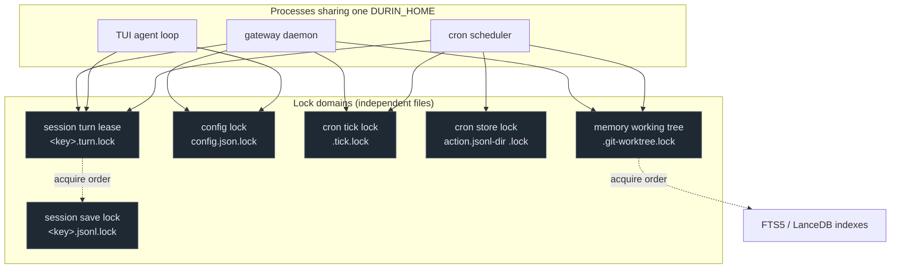

# Concurrency

## 1. Purpose

durin runs as several independent OS processes that share one `DURIN_HOME`
directory: the gateway daemon, the Textual TUI (which embeds its own
[agent loop](loop.md)), and the [cron](cron.md) scheduler. Any of them can be
writing the same session, the same config file, or the same memory entity at the
same instant. There is no central database server arbitrating those writes — the
files on disk are the shared state.

This document describes how durin keeps that shared state consistent: the
invariant that decides what is authoritative, the locks that serialize the
writes that touch it, and the lock-ordering rule that keeps those locks from
deadlocking each other.

## 2. Mental model

Three ideas explain every coordination decision in the codebase.

**Files are the source of truth; indexes are derived.** Session transcripts
(`sessions/<key>.jsonl` + `<key>.meta.json` + `<key>.md`) and memory markdown
(`memory/**/*.md`) are authoritative. The FTS5 SQLite index (`fts.sqlite`) and
the LanceDB vector table are *derived* projections that accelerate search. A
write must make the file correct; the index can always be rebuilt from the
files. This is what lets writers coordinate over the files alone — they never
have to keep a database schema consistent with the transcript, because the
transcript *is* the database.

**Disjoint critical sections get independent lock files.** durin does not have
one global lock. Each kind of write that must be serialized gets its own lock
file scoped to exactly what it protects: a turn lease per session, a save lock
per session, a config lock, two cron locks, and a memory working-tree lock. Two
processes editing two different sessions never contend; two processes editing
the *same* session serialize on that session's locks. The primitive underneath
is `cross_process_lock` in `durin/utils/file_lock.py` — an advisory `flock()`
that the OS releases automatically if the holding process dies.

**Load-per-turn, then save under lock.** A long-lived process must not trust its
in-memory copy of a session, because another process may have appended to it.
So at the start of each turn the loop calls `SessionManager.reload()`, which
drops the cache and re-reads from disk; the turn body runs; `save()` then writes
the result back under the session save lock. Reading fresh and writing under a
lock is what prevents a stale in-memory view from clobbering a peer's write.

**The gateway event loop is never blocked by synchronous work.** The gateway is
one ASGI app on one asyncio event loop; chat turns, subagents, background tasks,
and workflows fan out as concurrent tasks on it and overlap in wall-clock only
because each yields at every `await`. So any synchronous, blocking step — an LLM
round-trip, an embedding + vector search, a document conversion, a network fetch,
a `flock()` — must hop to a worker thread via `asyncio.to_thread`; run inline on
the loop it would freeze *every* concurrent session/subagent/workflow for its
duration. Tool `execute()` bodies that do such work wrap it accordingly. The
sync LLM helper (`durin/memory/llm_invoke.py::_run_blocking`) enforces this: if
it is reached on a thread that already has a running loop it **raises** rather
than blocking — turning a silent gateway freeze into a clean error that names the
offending caller. (Cold-path dream passes and curation likewise run under
`asyncio.to_thread`, so their LLM work never touches the gateway loop.)

Three per-request hot paths honor the invariant by *avoiding* the disk rather
than by hopping threads — a `to_thread` hop per request would just trade loop
stalls for executor contention:

- **Bearer-token auth** (`ApiTokenStore.resolve`): a per-process cache keyed by
  the token's own hash, validated against the store file's `(mtime_ns, size)`
  on every hit. A hit does no file I/O and takes no file lock; any writer — this
  process or a peer (CLI issue/revoke) — changes the file and thereby invalidates
  the cache on the next request. `last_used_at` is persisted at most once per
  minute per token instead of fsync-rewriting the store on every request.
- **`load_config()`**: a per-process cache validated against a stat snapshot of
  the marker file, the split dir, and every topic file. Hits return a deep copy
  so callers can mutate freely; any on-disk change (either process) misses.
- **WebUI display-transcript appends** (`TranscriptWriter`): streaming events
  are serialized at enqueue on the loop (fixing per-session order), buffered,
  and drained by a background task that writes each batch in a worker thread —
  one append + one fsync per session file per drain instead of one fsync per
  delta. Durability window ≤ the flush interval; the thread-read endpoint calls
  `flush()` first as a read barrier, and channel stop drains as the shutdown
  barrier.

## 3. Diagram

The lock domains and how the three processes use them. Each domain is an
independent lock file protecting a disjoint critical section. The dashed edges
show the strict acquisition order — it forms a directed acyclic graph, so no two
locks can be waited on in opposite orders and there is no deadlock cycle.

Two more orderings are in-process, so they do not appear as files but are part of
the same acyclic rule:

- An in-process `asyncio.Lock` per session is acquired **before** the turn lease,
  so same-process turns on one session never even reach the cross-process lock
  concurrently.
- An in-process `threading.RLock` per memory repo is acquired **before** the
  `.git-worktree` lock, making it the outermost memory lock.

Putting the full order in one line, from outermost to innermost:

> `asyncio.Lock` (session) → `.turn.lock` → `.jsonl.lock`, and separately
> memory `RLock` → `.git-worktree` → FTS5/LanceDB.

No path acquires these in the reverse direction, so the graph has no cycle.

## 4. How it works

### The turn path

A turn is the whole `RESTORE..SAVE` span of handling one inbound message. The
[agent loop](loop.md) serializes it like this:

1. **In-process gates first.** `_dispatch` acquires, in the same `async with`, a
   per-session `asyncio.Lock` from `self._session_locks`, the interactive-lane
   `ResizableSemaphore`, and the global-ceiling `ResizableSemaphore` (shared with
   `SubagentManager`, so subagents count against the same ceiling — see
   [loop](loop.md)). None of these do I/O; the session lock guarantees that
   within one process, two turns on the same session run one at a time, while the
   two semaphores bound how many turns and subagents run at once process-wide.

2. **Cross-process turn lease.** Still inside that lock, the loop enters
   `session_turn_lease(session_path)`
   (`durin/session/turn_lease.py`). The lease acquires
   `cross_process_lock(<key>.turn.lock)` — but via `asyncio.to_thread`, so the
   blocking `flock()` runs on a worker thread and the event loop keeps serving
   other sessions while it waits. The acquire timeout is generous (600 s,
   because tool-heavy turns routinely run for minutes). On timeout the loop
   catches `TimeoutError` and publishes a clear "session is busy in another
   window" message instead of dropping the turn silently.

3. **Load-per-turn.** Under the lease, the loop calls
   `SessionManager.reload(key)`, which pops the cache entry and re-reads the
   `.jsonl` and `.meta.json` from disk. Every turn therefore starts from the
   freshest on-disk state, even if a peer process appended turns since.

4. **Turn body.** The runner executes LLM iterations and tools. **No file lock
   is held across an LLM call** — the turn lease is the only cross-process lock
   held here, and it exists precisely so a peer waits rather than racing.

5. **Save under the save lock.** At turn end, `SessionManager.save()` acquires
   `cross_process_lock(<key>.jsonl)` — note the *different* lock file,
   `<key>.jsonl.lock`, distinct from the turn lease's `<key>.turn.lock`. Under
   it, the durable write is one atomic unit: write a temp file, `os.replace()`
   it over the `.jsonl`, and mirror derived metadata into the `.meta.json`
   sidecar. If anything fails the temp file is removed and the original is
   intact. The derived, non-durable tail — regenerating the navigable
   `<key>.md` view and incrementally FTS-indexing the new turns — is a full
   O(session) re-render, so on the per-turn hot path the loop **defers** it:
   `save(reindex=False)` skips the tail and the loop schedules a *coalesced
   background reindex* (`SessionManager.reindex_session()` run on a worker thread
   via `asyncio.to_thread`, under the same `<key>.jsonl.lock`), collapsing rapid
   successive saves into a single render so the event loop is never blocked on
   the markdown render. Out-of-turn savers (cron, session rename, webui
   title-generation) keep the inline tail — `save()` defaults to `reindex=True`.

6. **Release.** The lease releases in the loop's `finally`; the save lock
   releases when `save()` returns. If the process dies mid-turn, the OS releases
   both `flock()` locks automatically.

The turn lease and the save lock are deliberately **separate files**. `save()`
runs on the event-loop thread, while the lease was acquired on a worker thread
via `asyncio.to_thread`. The reentrancy guard in `cross_process_lock`
(`_held_set`, a `threading.local`) is per-thread and does **not** cross that
thread boundary — so if both used one file, `save()` would try to re-acquire a
lock held by a different thread and deadlock. Two files sidestep the problem
entirely.

Within a single thread the reentrancy guard *does* help: `save()` can be called
from inside another already-locked section on the same thread and the guard lets
it pass through without a second syscall.

All writers that touch a session outside the normal turn path acquire the same
lease and reload before saving: the HTTP session-rename handler, cron's direct
message handler, and the background webui title-generation save. None of them
can clobber a concurrent turn, because they queue behind its lease.

The session's `extract_cursor` (used by [dream](memory/05_dream_cold_path.md))
lives at a **top-level** key in `.meta.json`, not inside the `derived` block
that `save()` rebuilds, and its read-modify-write runs under the same
`.jsonl.lock`. That keeps a cursor advance from being erased by a concurrent
session save.

### Config writes

Config lives as a split-file layout (`config.json.d/agents.json`, `providers.json`,
…) with a marker `config.json`. `save_config()` wraps the *entire* multi-file
write — every per-topic file plus the stale-file cleanup — in
`cross_process_lock(config_path)`, so a concurrent reader under the same lock
never sees a half-written cross-section.

For read-modify-write, `mutate_config(mutator)` is the safe entry point: it takes
the config lock, reloads from disk under it, applies the mutator, and saves
(the inner `save_config` re-takes the same lock reentrantly on the same thread).
A direct `load_config() → edit → save_config()` that is *not* routed through
`mutate_config` is last-writer-wins across processes — an accepted trade-off for
that convenience path, not a coordinated write.

Reads are served from a per-process cache validated against a stat snapshot
(`mtime_ns`, size) of the marker file, the split dir, and every topic file, so
any write — from this process or a peer — is picked up on the next call. Cache
hits return a deep copy; the snapshot is taken *before* the read, so a write
that lands mid-read makes the next call re-read instead of trusting a torn
view.

### Cron

The cron scheduler uses two **separate** `FileLock` instances on two different
paths, and the distinction is load-bearing:

- `_tick_lock` (`.tick.lock`) guards at-most-once execution. `_on_timer`
  acquires it **non-blocking**; if another scheduler process is already ticking,
  this one skips the tick rather than queueing. It is held for the *whole* tick
  so a peer cannot pick up the same due job during the execution window.
- `_lock` (the cron store lock) serializes the load/save read-modify-write of
  `jobs.json` for every mutator (add, remove, enable, update).

The non-obvious part: `_on_timer` **releases `_lock` before running a job**, then
re-acquires it afterward to merge run-state deltas onto a freshly reloaded store.
This is required because `FileLock` is reentrant within a single instance on the
same thread but does **not** reenter across instances on the same path — if a job
callback constructed a second `CronService` and called a mutator, that mutator
would try to take `_lock` on a second instance pointing at the same file and
deadlock. Releasing before the (possibly minutes-long) job both avoids that and
keeps the store readable while the job runs. Due jobs have their `next_run`
advanced and saved *before* the lock is released, which is the at-most-once
guard: a racing scheduler reloads the already-advanced value and finds nothing
due.

Each cron run also executes as an isolated session (`cron:<id>:run:<ts>`) and
acquires the session turn lease through the shared turn path, so a cron job and
an interactive turn on the same key cannot run at once.

### Memory writes

A memory write (`write_entity` / `write_files_cas` in
`durin/memory/memory_writer.py`) edits the git-backed memory repo with two
nested locks:

1. **In-process `RLock` (outermost).** `_root_write_lock(root)` returns a
   process-wide `threading.RLock` keyed by the resolved repo path. The writer
   holds it across the entire read-apply-compare-and-swap-reset section. This
   serializes same-process writer *threads*: without it, one thread's working-tree
   reset (`reset --hard`) transiently makes the git ref stale, a peer thread reads
   that stale base, commits on it, and its compare-and-swap lands — silently
   orphaning the other write. It is an `RLock` so the two writer functions can
   nest on one thread, and being in-process it can never deadlock cross-process.

2. **`.git-worktree` lock (inner).** `cross_process_lock(git_worktree_lock_path(root))`
   serializes the working-tree mutation across processes. The actual ref update is
   a content-addressed `refs.set_if_equals` compare-and-swap that retries on
   conflict, so the durable commit is safe on its own; this lock guards the
   `reset --hard` that fast-forwards the working tree afterward.

The same `.git-worktree` lock is taken by the prune paths in the indexer and the
vector index. A `reset --hard` briefly removes and rewrites working-tree files,
which a concurrent indexer could misread as a genuine deletion. So the prune
paths acquire `.git-worktree` and then **re-check `is_file()` under the lock**: if
the file is present the reset has completed and the prune is skipped; if it is
genuinely absent the orphan row is removed. The in-process `RLock` is always
acquired before `.git-worktree`, and the prune paths only ever take
`.git-worktree` (never calling back into the writers), so there is no
opposite-order edge.

### Loops

The [loops](loops.md) subsystem adds its own on-disk artifacts under
`<workspace>/loops/` and `<workspace>/loops-runs/`, each locked at the
narrowest scope that needs it:

- **Loop definitions** (`loops/<name>.json`, `durin/loops/store.py`) follow the
  same per-name `cross_process_lock` model as workflow definitions — the
  webui, the agent tool, and the CLI may write concurrently, so `save_loop`/
  `delete_loop` lock on the loop's own name. Writers touching different loops
  never block each other; only same-name writers serialize.
- **Claims index** (`loops/claims.json`, `durin/loops/claims.py`) is a single
  JSON file mapping a correlation/thread key to the loop run waiting on it,
  rewritten atomically under one `cross_process_lock` on the whole file (not
  sharded per key). Registering a claim on a key that already holds a
  different run's claim overwrites it and logs the clobber — last write wins.
  `LoopsRuntime.answer()` releases a run's claim *before* resuming it
  (release-before-resume): the claim is stale the instant the answer arrives,
  and releasing early means a fresh claim registered by a follow-up question
  inside that same resume is never wiped by a stale trailing release. At
  gateway boot, a best-effort sweep prunes claims older than seven days, so a
  run that never got a reply (crash, or a counterpart that never answered)
  does not hold its key forever.
- **Per-loop event queue** (`loops/queue/<loop>.jsonl`, `durin/loops/queue.py`)
  holds inbound channel events a `single`-concurrency loop could not fire on
  immediately because a run was already active. `push`/`pop_fresh`/`pending`
  all take the same per-loop `cross_process_lock` (keyed on the loop's queue
  path — independent of the claims lock and of other loops' queue locks) and
  rewrite the file atomically. Freshness is decided at pop time against the
  caller's TTL, not baked in at enqueue time, so a `queue_ttl_s` config change
  takes effect immediately for events already sitting in the queue.
  `LoopsRuntime._post_finish` drains at most one event per completed run,
  scheduled via `asyncio.create_task` so a slow drained run cannot delay
  returning the just-finished run's own record to its caller.
- **Single-concurrency pending-fires guard** (`TriggerMatcher._pending_fires`,
  `durin/loops/matcher.py`) is in-process only, not a file lock. The busy
  decision for a `single`-concurrency loop reads `run_log.active_runs`
  synchronously, but the actual `runtime.fire()` call happens later, inside an
  `asyncio.create_task`'d coroutine — two channel messages arriving
  back-to-back would otherwise both read "not active" and both decide to
  fire. `_pending_fires` closes that window: the loop's name is added to the
  set synchronously, before the fire task is scheduled, and removed in the
  task's `finally`. No lock is needed because there is no `await` between the
  check and the add — a single-threaded asyncio event loop cannot interleave
  another message's decision in between.

Run manifests (`loops-runs/<loop>/<run_id>.json`, `durin/loops/run_log.py`) are
the one loops artifact with no lock at all: each run file has a single owning
writer (the runtime that fired it), so a full-file atomic rewrite is enough —
the same reasoning as workflow run logs. That single-writer assumption breaks
across a gateway restart mid-run, which can strand a manifest in `running`
status forever (a `single`-concurrency loop's `active_runs` check would then
refuse to fire again); a boot-time reconciliation sweep flips any `running`
manifest older than six hours to `error` to close that window, mirroring the
equivalent sweep for workflow run manifests.

### The SQLite index

The FTS5 index (`fts.sqlite`) is the one place durin opens a SQLite database with
concurrent cross-process writers, so it gets dedicated helpers in
`durin/utils/sqlite_util.py`:

- `connect()` opens in WAL mode (falling back to DELETE journaling on
  network filesystems that reject WAL), sets a `busy_timeout`, and uses
  `check_same_thread=False`.
- `execute_write()` runs each mutation inside `BEGIN IMMEDIATE … COMMIT`, which
  takes the write lock at transaction start so writers cannot interleave, and
  retries with jitter on `SQLITE_BUSY`.

These apply **only** to the derived SQLite index. Sessions and config are plain
`.jsonl`/`.json` files coordinated by `cross_process_lock`, not by SQLite
transactions.

### Provider snapshots

The gateway runs a single shared runner, and `/model` on one session mutates
`self.provider` for the whole process. To keep that from changing a different
session's model mid-turn, each turn captures a **per-turn provider snapshot**:
`_dispatch` resolves the effective provider once and passes it as the `provider`
field of `AgentRunSpec`. The runner pins `spec.provider or self.provider` at the
top of the run, so a concurrent swap on another session cannot alter a turn
already in flight. See [providers](providers.md) for how snapshots are resolved.

### Observability (concurrency snapshot)

The webui exposes live concurrency state through one global websocket event,
`concurrency_snapshot`, built by `AgentLoop.build_concurrency_snapshot()` from
`durin/agent/concurrency_snapshot.py`. Its payload is a handful of integers plus
a running-work list: per-lane `active`/`limit`/`waiting` for the interactive
lane, the ceiling, and sub-agents; a `queued` total (`interactive.waiting +
ceiling.waiting`); and a `work` array of the currently-running execution units.

The snapshot is bound by a cost contract:

- **In-memory only.** It reads the two `ResizableSemaphore` gates, the
  `SubagentManager`'s live task set, and `AgentLoop._active_tasks` — never disk.
  Because a global view must not touch session files, the `work` list enumerates
  only the in-memory execution units (interactive turns + running sub-agents);
  workflow *runs* live in on-disk manifests (read per-session by
  `durin/agent/background_tasks.py`) and are intentionally not enumerated
  globally. Workflow-driven work still appears as its turns/sub-agents, and the
  ceiling counts stay exact because that work acquires the ceiling through those
  same units.
- **Coalesced, never per-event.** `AgentLoop.mark_concurrency_dirty()` schedules
  a single build+publish on the next loop tick (a `loop.call_soon` guarded by a
  flag), so a burst of boundary events collapses to one frame. It is marked dirty
  at the sparse boundaries where occupancy changes: interactive turn start/end,
  sub-agent spawn/finish, and config hot-reload. No polling timer.
- **Subscriber-gated.** The frame fans out through the existing outbound-bus →
  websocket path (mirroring `dream_progress`) and is dropped when no connection
  is open; a fresh client is hydrated on subscribe. Publishing tolerates a full
  bus (the frame is droppable — the next boundary re-publishes the latest state).

A single **Concurrency settings card** consumes it — the live per-lane readouts
and the editable caps. (A session's running sub-agents and workflows surface in
the per-session Work panel, not here.) Editing a cap writes the config key
(`agents.defaults.max_concurrent_interactive`,
`concurrency_ceiling`, or `max_concurrent_subagents`); `ConfigService` fires
`reload_app_config` for those keys, so the change applies to the running gateway
without a restart (see [loop](loop.md)).

## 5. Key types & entry points

| Symbol | File | Role |
|---|---|---|
| `cross_process_lock` | `durin/utils/file_lock.py` | Reentrant cross-process advisory `flock` on `<target>.lock`; in-process `threading.Lock` fallback where `fcntl`/`msvcrt` are unavailable. |
| `_held_set` (thread-local) | `durin/utils/file_lock.py` | Per-thread set of held lock paths enabling same-thread reentrancy; does **not** cross `asyncio.to_thread`, which is why the turn lease and save lock use separate files. |
| `session_turn_lease` | `durin/session/turn_lease.py` | Async context manager holding `<key>.turn.lock` for a whole turn (600 s acquire timeout) via `asyncio.to_thread`; wraps interactive turns and all out-of-turn savers. |
| `SessionManager.reload` / `.save` | `durin/session/manager.py` | `reload` drops the cache and re-reads (load-per-turn); `save` does the atomic `.jsonl`/`.meta.json`/`.md` + FTS write under `cross_process_lock(<key>.jsonl)`. |
| `save_config` / `mutate_config` | `durin/config/loader.py` | `save_config` wraps the split-layout write in the config lock; `mutate_config` is the lost-update-safe read-modify-write entry point. |
| `CronService._lock` / `_tick_lock` | `durin/cron/service.py` | Two independent `FileLock` instances: store read-modify-write serialization, and non-blocking at-most-once tick guard. |
| `git_worktree_lock_path` | `durin/memory/memory_writer.py` | Canonical `.git-worktree` lock target shared by writers and the indexer/vector prune paths. |
| `_root_write_lock` (RLock dict) | `durin/memory/memory_writer.py` | In-process per-repo `threading.RLock`; outermost memory lock around the whole read-apply-CAS-reset section. |
| `sqlite_util.connect` / `execute_write` | `durin/utils/sqlite_util.py` | WAL + `busy_timeout` connection and `BEGIN IMMEDIATE` + retry write wrapper, for the derived FTS5 index only. |
| `loops.store.save_loop` / `.delete_loop` | `durin/loops/store.py` | Per-loop-name `cross_process_lock` around the atomic full-file rewrite of a loop definition. |
| `loops.claims` (`register`/`release`/`release_run`/`prune`) | `durin/loops/claims.py` | Single `cross_process_lock` over the whole `claims.json` file; last-claim-on-a-key wins. |
| `loops.queue` (`push`/`pop_fresh`/`pending`) | `durin/loops/queue.py` | Per-loop `cross_process_lock` over that loop's `queue/<loop>.jsonl`, independent of other loops' queues and of the claims lock. |
| `TriggerMatcher._pending_fires` | `durin/loops/matcher.py` | In-process-only `set`, not a file lock; closes the check-then-fire race for a `single`-concurrency loop between two back-to-back channel messages. |

## 6. Configuration & surfaces

Concurrency coordination is structural, not configured — there are no knobs to
turn locking on or off. A few related fields:

- **Per-turn provider snapshot** — `agents.defaults.model` / `agents.defaults.provider`
  feed the snapshot carried in `AgentRunSpec` so concurrent provider swaps do not
  reach an in-flight turn (see [providers](providers.md)).
- **Cron schedule** — each job's `schedule` (`kind`, `expr`, `tz`, `at_ms`,
  `every_ms`) and `payload` are stored in `jobs.json`, mutated under the cron
  store lock (see [cron](cron.md)).
- **Memory** — `memory.enabled` gates whether the memory writer runs at all (see
  [memory](memory/00_overview.md)).

**Surfaces.** The locks are invisible to users; their effects are not. The
gateway, TUI, and webui all operate over the same `DURIN_HOME`, so a session open
in two windows surfaces the "session is busy in another window" notice when a
second turn tries to start before the first releases its lease. Cron runs and the
API session-rename endpoint participate in the same turn-lease discipline.

**Out of scope by design.** OAuth provider token files (`oauth/<provider>.json`)
are written by the external provider SDK without `cross_process_lock`; refreshes
are last-writer-wins, which is acceptable for short-lived tokens that the next
request simply re-reads. The in-memory alias index in memory is rebuilt per
process at boot and is intentionally not shared across processes — each process
reconstructs it from the markdown, which is the authoritative source. These are
accepted trade-offs, not coordinated critical sections.

## 7. Curated rationale

durin keeps sessions and memory as plain files rather than moving them into a
database, even though a database would arbitrate concurrent writes for free. The
reason is the source-of-truth invariant: session transcripts are bounded (a few
thousand messages), so there is no scaling pressure forcing a database, and
keeping the truth in files preserves the ability to `grep`, `cat`, `git`, and
hand-recover state. The cost of that choice is that durin has to do its own
cross-process coordination — which is exactly what this subsystem is.

The recurring shape of every fix here is the same: serialize the narrowest thing
that can race, on its own lock file, in a fixed order. Independent lock files
keep unrelated work parallel; the fixed order keeps the locks from deadlocking;
the advisory `flock()` keeps a crashed process from wedging the system, because
the OS drops its locks. The two-file split between the turn lease and the save
lock, and the two-instance split between cron's tick lock and store lock, both
exist for the same underlying reason: a lock that is reentrant within a thread or
an instance is *not* reentrant across the thread or instance boundary that those
code paths actually cross, so the safe design is to give each boundary its own
lock rather than rely on reentrancy that does not hold.
