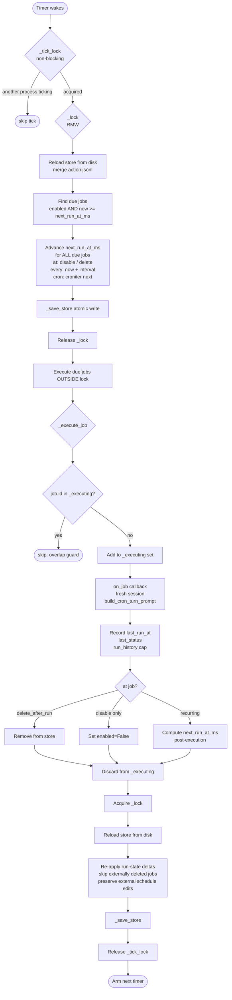

# Cron — Scheduled Work

## 1. Purpose

The cron subsystem is durin's single surface for scheduled and background work. It lets users and the agent schedule recurring jobs, one-shot reminders, and time-triggered tasks. It also hosts system jobs — the canonical example being the `memory_dream` pass that consolidates sessions into the entity graph each night.

Every job runs in a fresh, isolated session with its own session key, so cron executions leave a full conversation record and can be inspected, replayed, or cleaned up independently from interactive sessions. There is no separate heartbeat service; all scheduled work goes through the cron scheduler.

## 2. Mental model

**Jobs are persistent records with three schedule shapes.**
A `CronJob` is a plain dataclass persisted in `$DURIN_HOME/cron/jobs.json`. Each job carries an id, a name, an enabled flag, a `CronSchedule` (one of `at`, `every`, or `cron`), a `CronPayload` describing what to run, and a `CronJobState` recording the next and last run times with a capped run history. `at` jobs are one-shot; they disable (or delete) themselves after firing. `every` jobs repeat on a fixed millisecond interval. `cron` jobs fire on a standard cron expression with an optional IANA timezone.

**The scheduler is a timer-driven loop protected by two file locks.**
`CronService.start()` arms an async timer that wakes at the earliest `next_run_at_ms` across all enabled jobs (capped at `max_sleep_ms`, default five minutes). On each tick, the service acquires `_tick_lock` (non-blocking, cross-process at-most-once guard) and then `_lock` (serialised RMW), advances `next_run_at_ms` for every due job while the lock is held, saves the store, releases the lock, and only then executes the jobs. Advancing the timestamp before releasing the lock prevents a second scheduler process from seeing the same due job and double-firing it.

**Execution happens outside the lock in an isolated session.**
`_execute_job` invokes the `on_job` callback (wired in the gateway) with the `CronJob` value. For `agent_turn` jobs the gateway creates a fresh session keyed `cron:{id}:run:{timestamp_ms}` and dispatches the payload message through the agent loop using `build_cron_turn_prompt`. After all due jobs finish, the service reloads the store from disk and re-applies only the run-state deltas (last status, run history, next fire time) onto the freshly-loaded jobs, preserving any concurrent external edits to name, schedule, or payload.

## 3. Diagram

## 4. How it works

### Startup

`CronService.__init__` accepts a `store_path` (pointing to `$DURIN_HOME/cron/jobs.json`), an `on_job` async callback, `max_sleep_ms` (default `300_000` ms), and `run_history_max` (driven by `config.cron.run_history_max`, default `50`). Two `filelock.FileLock` instances are created: `_lock` guarding all store reads and writes, and `_tick_lock` guarding the timer tick itself. Both lock files live in the store's parent directory.

`start()` acquires `_lock`, loads the store (or raises on an unrecoverable corrupt store — see below), calls `_recompute_next_runs()` to recover jobs that fired while the service was down (jobs with a still-future `next_run_at_ms` are left untouched to preserve elapsed interval progress), saves, releases, and calls `_arm_timer()`.

### Offline mutations and the action log

When `CronService` is constructed without calling `start()` — as the webui and CLI do when they build a short-lived non-running instance — mutating calls (`add_job`, `remove_job`, `update_job`) write to `action.jsonl` in the same directory instead of directly editing `jobs.json`. On the next `start()` or `_load_store()` call by the live scheduler, `_merge_action` replays these entries in order, then clears the log. This lets the webui and CLI make changes that the running gateway scheduler picks up without requiring direct process communication.

### The timer tick

`_arm_timer` cancels any existing timer task and creates a new `asyncio.Task` that sleeps for `min(max_sleep_ms, ms_until_earliest_due_job)` seconds and then calls `_on_timer`.

`_on_timer` tries to acquire `_tick_lock` with `timeout=0` (non-blocking). If it fails, another scheduler process is already ticking and this tick is silently dropped. Once acquired, the method takes `_lock`, reloads the store, and finds all due jobs: those that are `enabled` and have `now >= next_run_at_ms`. For each due job, `next_run_at_ms` is advanced atomically (under `_lock`) before execution starts. This is the at-most-once guard: the second scheduler to look under `_lock` will find no due jobs. The store is saved. Then `_lock` is released.

### Execution

Each due job passes through `_execute_job`. The `_executing` set provides an in-process re-entrancy guard: if a `run_job` (manual trigger) fires the same job while a scheduled run is still in flight, the second call returns immediately. The `on_job` callback is awaited; the gateway implementation:

1. Sets `job.payload.session_key` to a fresh `cron:{id}:run:{timestamp_ms}` key.
2. Wraps `job.payload.message` with `build_cron_turn_prompt(mode, message)`. In `reminder` mode the prompt instructs the agent to deliver a brief user-facing message; in `task` mode the raw message is passed as-is and the agent executes it with full tools.
3. Marks the `cron` tool's `_in_cron_context` ContextVar so the agent cannot schedule new jobs from within an execution.
4. Dispatches through the agent loop with an optional per-job persona (`job.payload.persona`) or model override (`job.payload.model`) — the two are mutually exclusive (set one or the other). The persona is threaded as the cron-level persona, which wins over any conversation or global default.
5. If `job.payload.deliver` is true, delivers the result to the configured channel and recipient.

After `on_job` completes (or raises), `_execute_job` records `last_run_at_ms`, `last_status`, `last_error`, and appends a `CronRunRecord` to `run_history`. The history list is trimmed to `_run_history_max` (the newest entries are kept). For one-shot `at` jobs, `delete_after_run=True` removes the job from the store; `delete_after_run=False` sets `enabled=False`.

### Post-execution merge

After all due jobs finish, `_on_timer` acquires `_lock` again, reloads the store from disk (now with `_timer_active=False` so `_load_store` performs a real disk read), and re-merges the run-state deltas from the just-executed job objects onto the freshly-loaded store. Only state fields (`last_status`, `last_error`, `last_run_at_ms`, `run_history`, `next_run_at_ms`, `updated_at_ms`) are re-applied; all other fields come from the reloaded store so that any external schedule or payload edits made during execution are preserved. Jobs that were externally deleted during execution are not resurrected. One-shot deletions (`delete_after_run`) are re-applied on the reloaded store to handle the edge case where the job was re-added externally.

### Store durability

`_save_store` writes through `_atomic_write`: a temp file, `fsync`, `os.replace`, then `fsync` on the parent directory. This prevents a truncated or empty `jobs.json` on container shutdown. If the store file exists but cannot be parsed, it is renamed with a `.corrupt-<timestamp>` suffix and `start()` raises, refusing to boot with an empty job list.

### System jobs

`register_system_job` is an idempotent upsert called on every gateway start. It refreshes the job's schedule and payload from code while preserving the persisted run state and any still-future `next_run_at_ms` — a restart never resets an interval cron's elapsed progress. `prune_orphaned_system_jobs` removes any `system_event` job whose id is not in the registered set, cleaning up jobs removed from code.

System jobs (those with `payload.kind == "system_event"`) are protected: `remove_job` and `update_job` return `"protected"` without mutating the store. Only `register_system_job` and `prune_orphaned_system_jobs` manage them.

The canonical system job is `memory_dream`, registered at gateway start when `memory.dream.enabled` is true. Its execution path in the gateway runs all five Dream passes (extract, derived-from, skill-extract, refine, always-on) and then the session reaper (`reap_expired_run_sessions`) that deletes per-run sessions older than `cron.run_session_retention_hours`.

### Session retention

Every `agent_turn` execution creates a session keyed `cron:{id}:run:{timestamp_ms}`. These accumulate over time. The `memory_dream` cron pass runs `reap_expired_run_sessions` (in `durin/cron/reaper.py`) at the end of its execution, scanning session keys matching that pattern and deleting those older than `config.cron.run_session_retention_hours` (default 48 hours).

## 5. Key types and entry points

| Symbol | File | Role |
|---|---|---|
| `CronJob` | `durin/cron/types.py` | Root job record: id (8-char uuid), name, enabled, schedule, payload, state, timestamps, `delete_after_run` |
| `CronSchedule` | `durin/cron/types.py` | Schedule descriptor: kind (`at`/`every`/`cron`), `at_ms`, `every_ms`, `expr`, `tz` |
| `CronPayload` | `durin/cron/types.py` | Execution spec: kind (`agent_turn`/`system_event`), mode (`reminder`/`task`), message, model **or** persona override (mutually exclusive), deliver flag, channel routing, session key |
| `CronJobState` | `durin/cron/types.py` | Run state: `next_run_at_ms`, `last_run_at_ms`, `last_status`, `last_error`, `run_history` |
| `CronRunRecord` | `durin/cron/types.py` | One execution record: `run_at_ms`, status, `duration_ms`, error, `session_key`, model, persona, summary |
| `CronStore` | `durin/cron/types.py` | Persistent container: version, jobs list. Serialized to JSON at `store_path` |
| `CronService` | `durin/cron/service.py` | Main scheduler: lifecycle (`start`/`stop`), job CRUD, timer loop, two-lock tick, `on_job` callback wiring |
| `_compute_next_run` | `durin/cron/service.py` | Pure function: given a schedule and reference time, returns the next fire timestamp in ms (or `None` for expired one-shots and invalid expressions) |
| `_validate_schedule_for_add` | `durin/cron/service.py` | Rejects invalid schedules at add-time (bad cron expr, unknown tz) so jobs never silently fail to fire |
| `_execute_job` | `durin/cron/service.py` | Runs a single job: overlap guard, `on_job` call, run record, one-shot handling |
| `register_system_job` | `durin/cron/service.py` | Idempotent upsert of system jobs; preserves run state and future `next_run_at_ms` across restarts |
| `prune_orphaned_system_jobs` | `durin/cron/service.py` | Removes persisted system jobs whose id is no longer in the registered set |
| `CronTool` | `durin/agent/tools/cron.py` | Agent-facing tool exposing `add`/`list`/`remove`/`update` actions; enforces `_in_cron_context` guard and schedule validation |
| `build_cron_turn_prompt` | `durin/cron/prompting.py` | Frames the payload message for `reminder` (user-facing delivery framing) or `task` (raw message) mode |
| `select_expired_run_sessions` | `durin/cron/reaper.py` | Pure function identifying per-run session keys older than the retention window |
| `CronService` (service layer) | `durin/service/cron.py` | HTTP service wrapping the scheduler: routes for list, add, update, remove, toggle, run-now |

## 6. Configuration and surfaces

### Config keys

| Key | Default | Description |
|---|---|---|
| `cron.run_history_max` | `50` | Maximum run records kept per job (oldest are dropped) |
| `cron.run_session_retention_hours` | `48` | How long per-run cron sessions are kept before the reaper deletes them; `0` disables reaping |
| `memory.dream.enabled` | `true` | Controls whether the `memory_dream` system job is registered on gateway start |
| `memory.dream.cron` | `"0 3 * * *"` | Cron expression for the daily Dream pass (evaluated in `agents.defaults.timezone`) |
| `memory.dream.model_override` | `null` | Optional model preset for Dream LLM calls; falls back to `agents.defaults` |
| `memory.dream.min_seconds_between_runs` | `300` | Throttle window for reactive Dream triggers (post-compaction, session-close); independent of the cron schedule |
| `memory.dream.max_seconds_per_run` | `600` | Wall-clock cap for the Dream extract pass; the pass yields after the current session if exceeded |

### Agent tool (`cron`)

The `cron` tool (in `durin/agent/tools/cron.py`) is available to the agent when `cron_service` is wired in the tool context. It exposes four actions:

- **`add`** — requires `message` and exactly one of `every_seconds`, `cron_expr`, or `at`. Optional: `name`, `tz`, `deliver`, `mode` (`reminder`/`task`), and either `model` or `persona` (mutually exclusive).
- **`list`** — lists all enabled jobs with schedule, last/next run, and status.
- **`remove`** — removes a non-system job by `job_id`.
- **`update`** — updates name, message, schedule, deliver, mode, model, or persona on an existing non-system job.

Scheduling new jobs or updating existing ones from within a cron execution is blocked by the `_in_cron_context` ContextVar guard (returns an error rather than allowing nested scheduling).

### API routes

The HTTP API (in `durin/service/cron.py`) provides:

| Method | Path | Description |
|---|---|---|
| `GET` | `/api/v1/cron` | List all jobs (including disabled and system jobs) |
| `POST` | `/api/v1/cron` | Create a new `agent_turn` job |
| `PATCH` | `/api/v1/cron` | Update a non-system job |
| `DELETE` | `/api/v1/cron` | Remove a non-system job by id |
| `POST` | `/api/v1/cron/run` | Manually trigger a job immediately (non-blocking spawn) |
| `POST` | `/api/v1/cron/toggle` | Enable or disable a job without removing it |

All write routes require `CRON_WRITE` scope; the list route requires `CRON_READ`.

### Webui

The webui exposes a dedicated cron panel at the `/cron` route, showing each job's schedule label, mode, the persona or model it runs as, last/next run times, status badge, and run history. The panel provides a form to create new jobs, toggle, edit, remove, and manually trigger a run. System jobs are shown for inspection but their remove and edit actions are disabled.

## 7. Rationale

The two-lock design (`_tick_lock` + `_lock`) serves a specific purpose: `_tick_lock` prevents two scheduler processes from simultaneously entering the tick path (which would cause double execution), while `_lock` — released before `on_job` — prevents a deadlock when the job callback constructs its own non-running `CronService` and calls a mutator. Holding `_lock` across a potentially multi-minute execution would also block every concurrent reader (webui list, CLI status).

Advancing `next_run_at_ms` before releasing `_lock` — rather than after execution — is the correct at-most-once guarantee under the lock ordering: once a due job's timestamp is pushed into the future, any concurrent process that subsequently loads the store sees no due job and skips execution. Running and then advancing would leave a window for a second process to fire the same job.

The `action.jsonl` offline mutation log lets the webui and CLI modify the schedule through a non-running `CronService` instance without synchronising directly with the running gateway process. This avoids the need for a dedicated IPC channel between the webui backend and the scheduler, at the cost of a slightly delayed commit (applied on the next tick or the next `_load_store` call by the live scheduler).

Session keys of the form `cron:{id}:run:{ms}` give each job execution a stable, inspectable identity in the session store. The per-run session isolation means that a failing or long-running cron job never shares state with interactive sessions and its history can be independently cleaned up.
