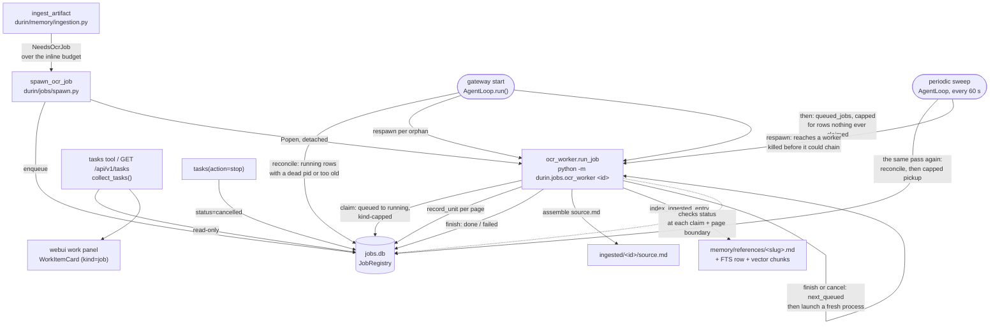

# Jobs — the long-work registry

## 1. Purpose

The job registry is durin's home for work too long to run inside a single
turn — minutes to hours of CPU, running in its own process, with progress a
user can come back and check. It is generic over a `kind` column, but it has
exactly one client today: transcribing a scanned PDF with local OCR (see
[Memory: agent tools](memory/04_agent_tools.md#memory_ingest) for the coverage
measurement and inline-vs-job decision that leads here). The registry does not
know anything about OCR, pages, or PDFs — it only knows a job has a total unit
count and a per-unit result, which is enough to host a second, unrelated kind
of long-running work without changing the table or the surfaces that render
it.

Jobs sit next to two other things durin already had, and deliberately does
not replace: [cron](cron.md) is for work triggered on a *schedule*; a
[workflow](workflow.md) run is a *graph* of nodes. A job is neither — it is a
flat queue of identical units (pages, today) that one worker process drains
in order, with no branching and no timer. Something that needs scheduling or
routing stays a cron job or a workflow; something that is just "a lot of the
same small task, done once, started now" is a job.

## 2. Mental model

**Progress is persisted per unit, not per job.** `jobs` holds one row per job
(status, label, the kind-specific payload, how many units total and done);
`job_units` holds one row per finished unit, keyed `(job_id, unit)`. Two
things fall out of that split: a worker killed partway through resumes at the
first undone unit instead of starting over, and a gateway restart can requeue
an interrupted job without losing the units it already finished.

**The worker is a separate OS process, not a coroutine.** `spawn_ocr_job`
enqueues a row and starts `python -m durin.jobs.ocr_worker <job_id>` as a
detached subprocess. The gateway's event loop never runs the transcription
loop itself; it only reads the rows the worker writes.

**At most one OCR worker runs at a time, and a finishing one chains to the
next.** This is a property of the `"ocr"` kind specifically, not the registry
or `reconcile` as a whole — `JobRegistry.claim` *supports* an atomic per-kind
cap via its optional `kind_cap` argument, but nothing requires a kind to pass
one, and today only the OCR worker does. OCR workers are heavy enough
(~2.1 GB peak RSS, ~4.8 cores measured) that several running together can
saturate a laptop or OOM a small server; the cap is the same transaction that
flips a row to `running` also counting how many of that kind already are, so
the database's own locking, not an external scheduler, decides who gets to
work. An OCR worker that finishes looks for the oldest still `queued` job of
its kind and launches a fresh process for it, so a backlog of several scanned
books drains one at a time instead of needing an outside trigger for every
one. See [below](#concurrency-cap-and-chaining).

**"Job" names two different things at two layers, on purpose.** The tray, the
`tasks` tool, and the HTTP route all merge three *categories* of background
work — sub-agents, workflow runs, and jobs — under a `kind` field whose value
is always the literal string `"job"` for anything sourced from this registry.
The registry's *own* `kind` column is one layer more specific: it names which
**client** of the job registry this row belongs to (`"ocr"` today). Reading
"job kind" in this doc always means the second one unless stated otherwise.

## 3. Diagram



## 4. How it works

### The table shape

Two tables, created in `JobRegistry.__init__` if missing:

```
jobs(
  id           TEXT PRIMARY KEY,   -- 12-char hex, uuid4-derived
  kind         TEXT NOT NULL,      -- "ocr" today
  status       TEXT NOT NULL,      -- queued | running | done | failed | cancelled
  label        TEXT NOT NULL,      -- human line for the tray; passed in by the caller, not
                                    -- derived from the payload path (that path is the entry's
                                    -- normalized copy, "source.<ext>" for every document)
  payload      TEXT NOT NULL,      -- kind-specific JSON: for OCR, {path, pages, sidecar_dir}
  session_key  TEXT,               -- who asked, for session-scoped listing
  units_total  INTEGER NOT NULL,
  units_done   INTEGER NOT NULL,
  pid          INTEGER,            -- claiming worker's pid; read by reconcile's liveness
                                    -- check, cleared on finish/cancel
  created_at, started_at, ended_at REAL,
  error        TEXT
)

job_units(
  job_id  TEXT NOT NULL,
  unit    INTEGER NOT NULL,        -- 1-based page number, for OCR
  text    TEXT NOT NULL,
  PRIMARY KEY (job_id, unit)
)
```

Both tables live in one SQLite database (`$DURIN_HOME/jobs/jobs.db`, resolved
by `durin.config.paths.jobs_db_path`), opened through
`durin.utils.sqlite_util` — the same WAL + `busy_timeout` + `BEGIN IMMEDIATE`
retry helpers the FTS5 index uses, so the gateway process and a worker
subprocess can both write it safely. See
[Concurrency](concurrency.md#sqlite-databases-with-cross-process-writers)
for the shared mechanism.

### Enqueueing and claiming

`spawn_ocr_job` (`durin/jobs/spawn.py`) writes the row with `status="queued"`
and immediately `Popen`s the worker with `start_new_session=True`, so the
worker outlives the request that launched it. If the `Popen` call itself
fails (e.g. the OS is out of processes), the row is left `queued` — the next
gateway start's queued-pickup loop finds it (`reconcile` only ever selects
`running` rows, so a `queued` job with no worker is invisible to it; see
[Restart reconciliation](#restart-reconciliation)).

A worker claims its own job rather than trusting the caller: `JobRegistry.claim`
runs `UPDATE jobs SET status='running', pid=? WHERE id=? AND status='queued'`
and reports whether that specific call won. This closes the gap between
"the worker checked the status" and "the worker started acting on it" — a
`stop` request landing in that gap flips the row to `cancelled` first, the
conditional `UPDATE` then matches zero rows, and the worker sees it lost the
claim and returns without transcribing anything.

### Concurrency cap and chaining

An OCR worker measured ~2.1 GB peak RSS and ~4.8 cores; a handful running
together can saturate a laptop or OOM a small server. `MAX_CONCURRENT_OCR_JOBS`
(`durin/jobs/spawn.py`, currently `1`) bounds how many `"ocr"` jobs may be
`running` at once. There is no config key for it — the number is a measured
resource budget, not a per-install preference.

The cap is enforced inside `claim` itself, not by a separate check before or
after it: passing `kind_cap=(kind, n)` adds `AND (SELECT COUNT(*) FROM jobs
WHERE kind = ? AND status = 'running') < ?` to the same conditional `UPDATE`
described above. The count and the write are one `BEGIN IMMEDIATE`
transaction (see [above](#the-table-shape)), so nothing can read the count,
decide there is room, and then lose a race before writing — the database's
own locking is what admits at most one claimant. A claim the cap refuses
returns `False` exactly like one the status guard refuses, and the worker
handles both identically at first: walk away, touch nothing. The row is left
precisely as it was.

A cap refusal specifically gets one more thing before the worker walks away:
the `running` row holding the slot might not really be running any more. Its
worker could have been OOM-killed, `kill -9`'d, or lost power without ever
reaching `finish()` — the very failure the cap makes *more* likely, since it
is now the one thing standing between "one worker" and the resource pressure
that kills workers. Left alone, that row would stay `running` forever and the
cap's own `COUNT` would keep counting it, wedging every later job of this
kind behind a row nothing is ever going to finish; gateway startup's
`reconcile` sweep ([below](#restart-reconciliation)) is the only other place
that would ever clean it, and that could be hours away. So a cap-refused
claim runs the same `reconcile(alive=_pid_alive)` probe right where it is —
inside `ocr_worker.run_job`, at the exact moment someone is actually being
blocked by a stale holder — and retries the claim once if reconcile requeued
anything. A dead holder is cleaned at exactly the moment its absence matters;
a live holder means reconcile requeues nothing and the retry refuses again
for the ordinary reason. This accepts the same edge gateway startup's own
`reconcile` call already does: the 6h age fallback can requeue a holder that
is genuinely alive but slow, briefly letting two workers hold one job —
`finish`'s `pid` guard and `record_unit`'s idempotence are what keep that
window safe, not this retry. The edge's likelihood changed with this
self-heal, though: `reconcile` used to run only at gateway startup, so a
job running past 6h tripped the fallback only if a restart happened to land
during that window. Now every cap refusal runs it too, so a >6h job with a
sibling queued behind it reliably trips the fallback the moment that
sibling's worker is spawned and refused, rather than rarely.

A worker looks for more work before it exits, from every point after a
successful claim where the row it held reaches a terminal state: its own
`finish()` succeeding, a cancellation noticed mid-loop (`registry.cancel`
already wrote `cancelled` by then), or `finish()` losing to something else.
The first two genuinely leave the row no longer `running`; the third might
not — a late cancel is terminal, but a takeover by a second worker via
`reconcile`'s age fallback leaves the row `running` under its new owner
instead. The worker chains regardless: it is safe because the worker
launched for the next queued job still has to win `claim`'s own atomic cap
check, so a chain fired while the slot is not really free just costs that
launched worker a refused claim — one wasted spawn, not a second worker on
the same job. `JobRegistry.next_queued(kind)` returns the oldest
still-`queued` job of its kind, and if one exists the
worker launches a fresh process for it through `_launch_worker`, the same
`Popen` call `spawn_ocr_job` and `respawn` use. The launch happens strictly
*after* the terminal write, never before — launching earlier could let the
cap briefly see two workers of one job's kind at once. Deliberately not
called from the refused-claim exit above: a worker whose own claim was
refused never held a slot to free, so chaining from there would be an extra
launch on top of whatever the live holder already does when it finishes —
the live holder owns the chain. This is how several scanned books drain one
at a time without an external scheduler: each terminal job hands off to the
next, and memory genuinely leaves the machine between books because every
worker is a fresh process. A launch failure here is logged and swallowed the
same way `spawn_ocr_job`'s own `Popen` failure is (above) — the row stays
`queued`. `reconcile` is not what retries it: that only ever selects `running`
rows and never sees a `queued` one. Three other things do, and any of them is
enough: the [periodic sweep](#the-periodic-sweep)'s pickup within the minute,
the identical pickup at the [next gateway start](#restart-reconciliation), or
the chain of whichever worker finishes next.

### Per-unit persistence and resumption

`record_unit` upserts one `job_units` row and then **recounts**
`units_done` from `COUNT(*)` rather than incrementing it. Re-recording a page
a resumed worker redoes must not inflate progress past the true count, which
an increment would risk. A worker's first act after claiming is to diff the
job's full unit list against `done_units()` and only work through what is
missing — so a worker restarted after crashing at page 380 of 400 transcribes
20 pages, not 400.

That unit list is widened before the diff. An OCR job's payload pages are a
floor rather than the whole set: the conversion path stops confirming empty
pages the moment a document is plainly over the inline budget (see
[the memory tools doc](memory/04_agent_tools.md)), and its cheap probe can miss
an empty page outright. So the worker runs the accurate per-page extraction
itself — seconds against the minutes of OCR that follow — and unions the empty
pages it finds with the payload's and with any page an earlier run already
recorded, which is what keeps the progress denominator from falling below its
numerator. The widened count is reported through `set_units_total`, a
`claim`-style guarded `UPDATE` that only writes while the row is still this
worker's running job, and only on a successful recompute.

That pass is **load-bearing, not best-effort**. Without it there is no way to
tell a floor from a finished list, so a worker that cannot read the document
fails the job with a recorded reason rather than transcribing the floor: doing
the latter would publish a forty-page book holding six pages and report it
`done`, with the pages left out decided by omission and nobody downstream able
to tell. The failure costs little — every path that enqueues one of these jobs
read the document with the same extractor first, and a document that stays
unreadable already fails this job at the sidecar step, which reads it the same
way. Failing at the check says so before spending the OCR, and leaves
`units_total` untouched rather than rewriting it down to the floor.

### Restart reconciliation

A gateway restart used to strand a `process_registry.py`-tracked background
`exec` forever (documented there as a known limitation); jobs fix this for
their own rows. On every gateway start, `AgentLoop.run()`
(`durin/agent/loop.py`) calls `JobRegistry.reconcile(alive=_pid_alive)` before
serving any traffic. `reconcile` finds every `running` row and requeues it
(clearing `pid`/`started_at`, keeping its finished units) when either:

- its `pid` is not alive (`os.kill(pid, 0)` raises), or
- it has been `running` longer than `RECONCILE_AGE_S` (six hours) regardless
  of what its `pid` looks like — a rebooted host restarts pid allocation from
  a low number, so a stale row's `pid` can coincidentally match a real,
  unrelated live process, and liveness alone would then misreport the job as
  fine.

Each requeued job is individually handed to `respawn()`, which re-`Popen`s
the right worker module for the job's `kind`. Both the reconcile call and each
individual `respawn` are wrapped so that one bad orphan (an unrecognized
`kind`, a `Popen` failure) cannot stop the rest from being respawned or take
the gateway down on the way up.

Reconcile only ever returns rows that were `running` with a dead or stale
pid — a row that never had a worker in the first place (its own spawn's
`Popen` call failed, or a cap-refused worker's chain launch crashed before it
could start one, see [above](#concurrency-cap-and-chaining)) is left `queued`
the whole time, and that loop never touches it. Right after it, the same
startup routine picks up jobs already `queued`: `JobRegistry.queued_jobs("ocr",
MAX_CONCURRENT_OCR_JOBS)` reads up to the cap's worth of them in one query and
`respawn`s each, un-stranding both of those cases. A `next_queued(kind)` loop
would not do here in place of `queued_jobs` — `respawn` never claims, so a row
it was just handed is still `queued` afterward, and a second `next_queued`
call in the same loop would return that identical row again instead of moving
on to the next one.

Startup is **not** bounded at "one worker per kind directly" overall — that
undercounts what actually happens. Reconcile's loop launches one `respawn`
per orphan it finds, uncapped by design (three dead-pid rows produce three
respawns; the cap does not gate *how many processes start*, only how many may
end up `running`); the pickup loop then adds up to `MAX_CONCURRENT_OCR_JOBS`
more launches on top of that. The two loops can also overlap on the very same
job: the oldest orphan reconcile just respawned is still `queued` until its
new worker actually claims it, so the pickup loop can pick that identical row
and launch a second, redundant process for it. For that specific case — two
launched processes racing to claim the *same* job — the decisive guard is the
ordinary `AND status = 'queued'` clause on `claim`'s `UPDATE`, not `kind_cap`:
the first process to write flips the row out of `queued`, and the second's
claim then fails that clause regardless of any cap (true even under
`kind_cap=None`). `kind_cap` is what matters once that is settled and the
launched processes reduce to two *different* jobs contending for the cap's
one shared slot — which, on any redundant launch, is what a same-job race
becomes the instant the winner's write lands. Either way the loser's launch
is cheap: a refused claim does no PDF work and exits almost immediately, and
its row is left exactly `queued`, for the chain or the next sweep to reach.

### The periodic sweep

Startup is not the only moment work strands, so `AgentLoop.run()` also starts
a background task that re-runs exactly the pass above — `reconcile`, then the
capped `queued_jobs` pickup — every `_JOB_SWEEP_INTERVAL_S` (60 seconds,
`durin/agent/loop.py`) for as long as the gateway serves. It runs off the
event-loop thread: the pass opens SQLite and may `Popen` a worker, and the
same process is serving chat.

It exists because the concurrency cap turned one hard kill into a stalled
queue. A worker killed outright — SIGKILL, an OOM kill, a `kill -9` — never
reaches its chain call, so nothing launches the next job; its row keeps
`running` with a dead `pid`, which holds the cap's only slot, so a worker that
does get launched has its claim refused; and neither of the two self-heals
covers that state, because `run_job`'s inline `reconcile` fires only when a
*new* worker is refused a claim, and the startup one fires only at startup.
Until a fresh ingest arrived or someone restarted the gateway, the whole
queue behind that dead holder waited. One sweep tick undoes it: `reconcile`
requeues the dead holder and the pickup launches workers again.

Each tick is guarded on its own, and a failure is logged (`periodic job sweep
failed`) instead of ending the task — a sweep that died on one locked database
would restore the very wedge it exists to prevent. The task is cancelled when
the loop stops, and also whenever the task running `AgentLoop.run()` completes
for any other reason, so a cancelled gateway does not leave it sweeping.

### Cancellation

`JobRegistry.cancel` sets `status='cancelled'`. There is no signal sent to the
worker process — cancellation is cooperative, and the worker only ever learns
of it by re-reading the row: at the top of every per-unit loop iteration, so a
cancel lands at the next page boundary at the latest, with a page already
being transcribed finishing first. The one case that loop never reaches — every
requested page already transcribed by an earlier run — is covered instead by
`claim`'s own conditional `UPDATE ... WHERE status='queued'` (see
[above](#enqueueing-and-claiming)): a cancel that lands between the worker's
pre-claim status read and the claim itself makes that `UPDATE` match zero
rows, so the worker still notices it lost the job rather than marking a
cancelled run "done".

The per-page loop is not the last thing a worker does, so its checks are not
the last word either: the sidecar write and the Library indexing that follow
chunk, index and embed a whole book, which is minutes with no cancellation
check in it. `finish` is therefore conditional the same way `claim` is —
`UPDATE ... WHERE id=? AND status='running' AND pid=?` — and returns whether
it wrote anything. A cancel landing in that window survives, `ended_at`
included, and the worker reports the row's real status instead of its own
result. The `pid` clause covers the other way two writers meet: the age
fallback above can requeue a job whose worker is genuinely alive, and the
superseded worker must not flip the outcome of the one that now owns the row.

A cancelled OCR job frees its cap slot exactly like a finished one, and the
worker chains to the next queued job from both cancellation exits — the
per-page loop noticing mid-run, and `finish()` losing to a cancel that landed
during the sidecar/indexing window (see
[Concurrency cap and chaining](#concurrency-cap-and-chaining)). This matters
under `MAX_CONCURRENT_OCR_JOBS=1` specifically: "one job running, one queued
behind it" is the ordinary state for a multi-book ingest, and stop is a
user-facing button — the queued sibling must not wait on a trigger that may
never come just because the job ahead of it was cancelled instead of
finishing.

Today the only caller is the agent's own `tasks` tool (`action="stop"`) — see
[Configuration and surfaces](#6-configuration-and-surfaces) below. There is no
webui button wired to it yet; the tray is read-only.

### The subprocess worker

`ocr_worker.run_job` (`python -m durin.jobs.ocr_worker <job_id>`) is a
subprocess rather than an in-process task for three reasons, in order of
weight: the OCR engine's ONNX runtime memory is released when the process
exits instead of sitting resident in the gateway for its whole uptime (the
gateway has already taken an OOM from resident model memory once); a
CPU-bound transcription loop never touches the gateway's asyncio event loop;
and progress needs no purpose-built IPC channel — the worker writes
`job_units` and `units_done` directly, and the gateway (or a CLI/API reader)
just reads the same database.

On success, a job whose payload carries a `sidecar_dir` (an ingested Library
entry) has the worker assemble `source.md` there: the document's per-page
text with every OCR'd page filled in, joined the same way the inline
conversion path joins pages — the same sidecar shape either way, just
produced later.

The worker then hands that entry back to the memory layer —
`index_ingested_entry` (`durin/memory/ingestion.py`) — which stores it as a
Library reference and indexes it, exactly as an inline ingest does at ingest
time. This is the step that makes a transcribed document *findable*, and it
belongs at the end of the job because this process is where the text first
exists: `memory_ingest` returned before any of it had been produced. The jobs
layer knows only that name; what a Library entry is and how it is indexed
stays behind it (see [Memory: agent
tools](memory/04_agent_tools.md#memory_ingest)).

A failure at any step — the completeness check, a page's transcription, the
sidecar assembly, or the Library indexing — is recorded as `status="failed"`
with an `error` string rather than left `running` forever; a resumed run that
finds nothing left to transcribe would otherwise hit the same broken step again
on every retry. The completeness check and the indexing both count as steps
that can fail the job on purpose: a job reported "done" whose document cannot
be found, or whose book was published with the pages nobody confirmed left out,
is the exact outcome each step exists to prevent. A pass that transcribed nothing at all fails there too — the inline
conversion path already refuses a document with no extractable text, and an
empty Library entry is no more useful for having arrived late.

### How a new job `kind` is added

The registry, `reconcile`, and the tray/tool rendering are already generic;
adding a second kind touches only the pieces that are inherently
kind-specific:

1. Define the payload shape that kind needs (OCR's is
   `{path, pages, sidecar_dir}`).
2. Write a worker entry point runnable as `python -m <module> <job_id>`,
   following `ocr_worker.run_job`'s claim → per-unit loop → `finish` shape.
3. Write a `spawn_<kind>_job` helper that enqueues and `Popen`s that worker —
   there is no shared generic "enqueue and launch" entry point today, only
   one worked example to copy (`spawn_ocr_job`); the registry's `enqueue`
   underneath it is already kind-agnostic.
4. Add a branch to `respawn()` (`durin/jobs/spawn.py`) so a restart can bring
   the new kind's worker back.

Unlike `reconcile` and the tray rendering, the concurrency cap, the
finish-time chain, and gateway startup's queued-job pickup are not generic
across kinds today: `MAX_CONCURRENT_OCR_JOBS`, the `kind_cap` passed to
`claim` in `ocr_worker.run_job`, and the `queued_jobs("ocr", ...)` call in
`AgentLoop.run()` are all specific to `"ocr"` (see [Concurrency cap and
chaining](#concurrency-cap-and-chaining)). A second kind that needs the same
protection adds its own cap constant and wires its own `kind_cap`, chain, and
startup pickup the same way — none of that is inherited automatically.

One more gap worth knowing before adding a second kind: `ocr_worker.run_job`'s
own inline `reconcile()` call (the cap-refusal self-heal, see
[above](#concurrency-cap-and-chaining)) is not scoped to `"ocr"` either —
`reconcile` itself takes no `kind` argument, so it requeues *any* kind's
orphaned `running` row it finds stale. But that call site only retries its
own claim on success; unlike gateway startup, it never calls `respawn()` for
the orphans it requeues. A second kind's job requeued by that inline call
sits `queued` with nothing launched for it until the next gateway restart,
or its own kind's chain/pickup mechanism if it wires one.

Nothing else needs to change to reach the tray: `collect_tasks` and
`TasksTool` render any registry row from its generic fields (label, status,
`units_total`/`units_done`) with no kind-specific branching, and the webui's
`WorkItemCard` already renders a job's progress as "N of M" — though its
current label text says "pages" specifically (`work.pages` in the i18n
catalog), so a kind whose units are not pages would want its own progress
copy there.

## 5. Key types and entry points

| Symbol | File | Role |
|---|---|---|
| `Job` | `durin/jobs/registry.py` | Frozen dataclass mirroring one `jobs` row. |
| `JobRegistry` | `durin/jobs/registry.py` | `enqueue`, `get`, `list_for_session`, `claim`, `next_queued`, `queued_jobs`, `set_units_total`, `record_unit`, `units`, `done_units`, `finish`, `cancel`, `reconcile`. |
| `RECONCILE_AGE_S` | `durin/jobs/registry.py` | Six hours — the pid-liveness-is-unreliable fallback age used by `reconcile`. |
| `MAX_CONCURRENT_OCR_JOBS` | `durin/jobs/spawn.py` | The per-kind concurrency cap `claim` enforces; currently `1`. No config key — see [Concurrency cap and chaining](#concurrency-cap-and-chaining). |
| `spawn_ocr_job` | `durin/jobs/spawn.py` | Enqueues an OCR job and launches its worker; called from `ingest_artifact` when a document needs more OCR than the inline budget. |
| `respawn` | `durin/jobs/spawn.py` | (Re)launches the worker for a job that needs one and is not this process's to claim: an orphan `reconcile` just requeued, or a row gateway startup found `queued` with nothing claiming it. Dispatches on `job.kind`. |
| `_launch_worker` | `durin/jobs/spawn.py` | The one `Popen` call shared by `spawn_ocr_job`, `respawn`, and the worker's own chain. |
| `run_job` | `durin/jobs/ocr_worker.py` | The OCR worker's whole lifecycle: kind-capped claim (self-healing a stale holder once via an inline `reconcile` on refusal), per-page transcribe loop, sidecar assembly, Library indexing, finish or cancellation, then chain to the next queued job. |
| `queued_jobs` | `durin/jobs/registry.py` | The oldest up to *n* still-`queued` jobs of a kind in one query; what the pickup loop uses instead of looping `next_queued`. |
| `_resume_jobs` | `durin/agent/loop.py` | The reconcile-then-capped-pickup pass itself, shared by gateway startup and the periodic sweep so the two cannot drift apart. |
| `AgentLoop._sweep_jobs_periodically` | `durin/agent/loop.py` | Re-runs that pass every `_JOB_SWEEP_INTERVAL_S`, guarded per tick; what un-wedges a queue whose cap slot is held by a worker that was killed outright. |
| `transcribe_page` | `durin/memory/ocr.py` | Renders one PDF page (`pypdfium2`) and runs it through the lazily-constructed, process-local `RapidOCR` engine. The worker calls this directly — its own process is already short-lived, so the engine's memory leaves with it. |
| `transcribe_pages_detached` | `durin/memory/ocr.py` | The inline conversion path's transcription entry point: runs `transcribe_page` per page inside a short-lived child (`durin/memory/ocr_subproc.py`), so the engine's memory never enters the long-lived gateway process. |
| `index_ingested_entry` | `durin/memory/ingestion.py` | Turns a finished `ingested/<id>/` entry into an indexed Library reference; the one memory-layer call the worker makes on success. |
| `collect_tasks` | `durin/agent/background_tasks.py` | Merges sub-agents, workflow runs, and jobs into the one list the tray and `tasks` tool both read. |
| `TasksTool` | `durin/agent/tools/tasks_tool.py` | Agent-facing `tasks` tool: `list` / `status` / `stop`, across all three background-work categories. |
| `TasksService` | `durin/service/tasks.py` | `GET /api/v1/tasks` — read-only HTTP mirror of `collect_tasks`. |
| `WorkItemCard` | `webui/src/components/work/WorkItemCard.tsx` | Renders one tray row; a `kind="job"` item shows "N of M pages". |
| `jobs_db_path` | `durin/config/paths.py` | `$DURIN_HOME/jobs/jobs.db`. |

## 6. Configuration and surfaces

### Config keys

Job-triggering behavior is configured on the OCR client, not the registry
itself — the registry has no config of its own.

| Key | Default | Effect |
|---|---|---|
| `documents.ocr.enabled` | `false` | Whether scanned pages are transcribed at all; also gates installing the `[ocr]` extra. |
| `documents.ocr.inline_max_pages` | `5` | Pages needing OCR at or under this are transcribed inline; more than this enqueues a job instead. |

### Agent tool (`tasks`)

`action="list"` shows every sub-agent, workflow run, and job in the calling
session; `action="status"` with an id gives a job's page progress
(`done/total`) alongside its status and age, plus the recorded reason when it
failed; `action="stop"` cancels a job (cooperative — see above). The id namespace is shared and resolved
automatically across all three kinds, so the agent does not need to know
which one it is asking about.

### API routes

| Method | Path | Description |
|---|---|---|
| `GET` | `/api/v1/tasks?session=<key>` | Read-only, session-scoped list merging sub-agents, workflow runs, and jobs. No job-specific write route exists yet — cancellation is agent-tool-only. |

### Webui and TUI

The web dashboard's work panel (opened from the chat header, or its
collapsed work-strip form) renders a job exactly like a workflow run or
sub-agent card, with a job-specific footer line showing pages transcribed of
pages total, and — for a failed job — the reason its worker recorded, verbatim
and untranslated. It is read-only today: no cancel button is wired to a job
row.
The Textual TUI's WORK sidebar section tracks only workflow runs and
sub-agents; it does not read the job registry, so a running job is not
visible there.

## 7. Rationale

**Per-unit rows, not a per-job progress counter alone.** A single integer
column could report "38 of 400" just as well right up until a worker dies —
at which point nothing says *which* 38 pages are done, so a resume has to
guess or restart from zero. Keeping each finished unit's own row is the
difference between "resume" and "restart with extra steps."

**A SQLite table, not a per-job JSON manifest file.** Workflow runs and cron
use one file per run/store, rewritten atomically under a file lock — a good
fit when one process owns a run's file for its lifetime. A job's row is
written by two different processes across its life (the gateway that
enqueues it, the worker that claims and updates it, possibly a second worker
after a respawn), and read by a third (the tray) while the second is still
writing — exactly the concurrent-writer situation `sqlite_util`'s WAL +
`BEGIN IMMEDIATE` pattern exists for, already proven by the FTS5 index.

**A subprocess, not an `asyncio.Task` on the gateway loop.** See
[above](#the-subprocess-worker) — memory release on exit and event-loop
isolation are both really "a CPU/memory-heavy model should not live inside
the one process serving every other session," which is also why Dream runs
as its own subprocess rather than a coroutine.

**Generic `kind` from day one, with exactly one caller.** The alternative —
hardcoding "OCR job" throughout — would mean redesigning the table, the
tray rendering, and the `tasks` tool the moment a second kind of long work
shows up. A `kind` column plus a JSON `payload` is the minimum generality
that avoids that redesign; it is not a speculative plugin framework, since
nothing here discovers or registers kinds dynamically — `respawn`'s dispatch
is a plain `if`, extended by hand.
