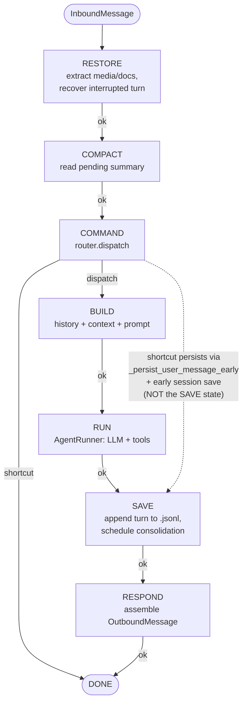
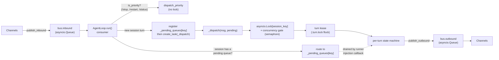
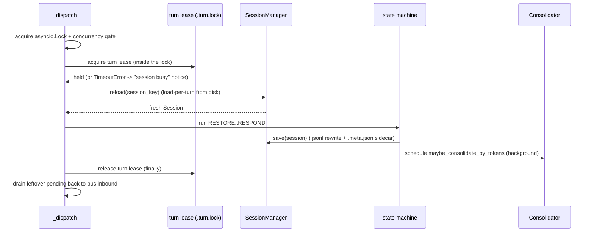

# Agent Loop

> The per-turn control-flow hub: how an inbound message becomes a state-machine
> turn, runs the LLM-plus-tools iteration, persists the result, and publishes a
> reply — channel-agnostically, one turn at a time per session.
>
> Sibling internals docs: [memory/00_overview.md](memory/00_overview.md) for the
> memory subsystem, [skills/00_overview.md](skills/00_overview.md) for skills,
> [concurrency.md](concurrency.md) for the cross-process locking model,
> [observability.md](observability.md) for telemetry, [ux.md](ux.md) for the
> CLI/TUI/webui surfaces.

---

## 1. Purpose

The agent loop is the engine that turns a message into a response. Every channel
— CLI, Telegram, Slack, the webui, cron — speaks to it through one contract: it
publishes an `InboundMessage` to a queue and reads back `OutboundMessage`s. The
loop owns everything in between.

For each inbound message it:

1. routes the message to the right session and serializes it against any turn
   already running for that session,
2. drives the message through a fixed per-turn state machine
   (restore → compact → command → build → run → save → respond),
3. delegates the LLM-and-tools iteration to a shared `AgentRunner`,
4. applies permission-as-data agent modes to the tool surface,
5. persists the turn to the session transcript and schedules background memory
   consolidation,
6. assembles and publishes the reply.

It exists so that the rest of the system — channels, tools, providers, memory —
does not have to know about turn ordering, persistence, compaction, or
concurrency. Those concerns live here, behind the bus.

The core type is `AgentLoop` in
[`durin/agent/loop.py`](../../durin/agent/loop.py). A single `AgentLoop`
instance is shared by the whole gateway and handles every session concurrently.

---

## 2. Mental model

Three ideas explain almost everything the loop does.

**1. A per-turn state machine.** Each turn walks eight states —
`RESTORE → COMPACT → COMMAND → BUILD → RUN → SAVE → RESPOND → DONE` — defined by
the `TurnState` enum. Transitions are data, not branches: each state handler
(`_state_restore`, `_state_compact`, …) returns an *event* string, and the
`_TRANSITIONS` table maps `(state, event)` to the next state. The one branch
that matters is in `COMMAND`: a matched shortcut command emits `"shortcut"` and
jumps straight to `DONE`, skipping the build/run/save states; a non-command
emits `"dispatch"` and continues to `BUILD`.

**2. Session-scoped serial execution, cross-session parallel.** Turns for the
*same* session run one at a time; turns for *different* sessions run
concurrently. This is enforced by two layers: an in-process `asyncio.Lock` per
`session_key` (cheap, same-process) and a cross-process turn lease
(`session_turn_lease`, a `.turn.lock` flock) that prevents the gateway and a TUI
or cron run from executing the same session at once. While a turn is running,
follow-up messages for that session do not spawn a competing task — they are
routed to a per-session pending queue and injected mid-turn.

**3. The message bus is the only channel contract.** Channels push
`InboundMessage` to `bus.inbound` and read `OutboundMessage` from `bus.outbound`
([`durin/bus/queue.py`](../../durin/bus/queue.py),
[`durin/bus/events.py`](../../durin/bus/events.py)). `MessageBus` is two plain
`asyncio.Queue`s with no routing logic. The loop never imports a channel; a
channel never imports the loop. The session a message belongs to is derived from
the message itself (`InboundMessage.session_key` = `session_key_override` or
`"channel:chat_id"`).

---

## 3. Diagrams

### 3.1 The per-turn state machine



The dotted edge is a note, not a transition: a shortcut command still writes the
turn to the session — it just does it inline in `_state_command` rather than
through the `SAVE` state. `/new` is the one exception (it clears the session, so
it deliberately persists nothing).

### 3.2 Concurrency topology



`run()` is a single consumer. For each message it picks exactly one path:
dispatch a priority command without any lock, route a follow-up into an existing
session's pending queue, or spawn a new `_dispatch` task. The pending queue is
registered *before* `create_task` so a same-session message that arrives in the
gap cannot spawn a competing task.

### 3.3 Session lifecycle within a turn



---

## 4. How it works

### The consumer: `run()`

`AgentLoop.run()` is one `while`-loop that consumes `bus.inbound`. On startup it
connects configured MCP servers (lazily, once) and warms the memory embedding
model in the background. For each message it decides the routing in order:

- **Priority command?** `commands.is_priority(raw)` matches the exact-match,
  no-lock tier (`/stop`, `/restart`, `/status`). These are dispatched
  immediately via `_dispatch_command_inline` so `/stop` can cancel a running
  turn — it never queues behind the lock.
- **Pending answer?** If a turn is blocked on `ask_user_question`, a plain-text
  reply is consumed as the answer (`_maybe_resolve_pending_answer`).
- **Mid-turn follow-up?** If the effective session key already has a pending
  queue, the message is routed there for injection (or, if it is itself a
  non-priority command, dispatched inline) instead of starting a new turn.
- **New turn.** Otherwise the loop registers a fresh pending queue for the
  session and `create_task(self._dispatch(msg, pending))`. The task is tracked
  per session so `/stop` can find and cancel it.

The effective session key (`_effective_session_key`) collapses to a single
unified key when `unified_session` is enabled and the message carries no
override.

### The turn: `_dispatch`

`_dispatch` is where serialization happens. It acquires, in order, the
per-`session_key` `asyncio.Lock`, the concurrency gate (a semaphore sized by
`DURIN_MAX_CONCURRENT_REQUESTS`), and then — *inside* the lock — the cross-process
turn lease via `session_turn_lease`. The lease is acquired inside the lock so an
in-process turn never even attempts the flock while a sibling task holds the
same lock; if the lease times out (another *process* holds the session), the
turn returns early with a "session is busy" notice. With the lease held, it
calls `sessions.reload(session_key)` — load-per-turn — so the turn always sees
the freshest on-disk state rather than a stale cached `Session`.

It then runs `_process_message`, publishes the result, and in a `finally` block
releases the lease and re-publishes any messages still sitting in the pending
queue back onto `bus.inbound` so a late follow-up is processed as a fresh turn
rather than lost.

### The state loop: `_process_message`

`_process_message` builds a `TurnContext` (mutable per-turn state — message,
session key, history, messages, callbacks, the pending queue, a diagnostic
`trace`) and runs the state machine. The driver is generic: it looks up
`_state_<name>`, calls it, records a `StateTraceEntry` (state, duration, event,
error), and follows `_TRANSITIONS[(state, event)]` until it reaches `DONE`. A
missing handler or an unmapped `(state, event)` raises immediately — the table
is the spec.

The handlers, in order:

- **`_state_restore`** — splits documents out of media, then materializes any
  interrupted turn. A crashed or `/stop`-ped turn leaves a `runtime_checkpoint`
  (mid-turn tool state) and/or a `pending_user_turn` flag in session metadata;
  `_restore_runtime_checkpoint` / `_restore_pending_user_turn` fold those into
  history so the conversation is consistent before the new turn.
- **`_state_compact`** — reads the consolidator's archived-summary marker
  (`_format_pending_summary`) so the build step can prepend it.
- **`_state_command`** — runs `commands.dispatch`. If a handler matches it
  persists the user message (`_persist_user_message_early`) plus the command's
  reply (both tagged `_command` so they are filtered out of LLM history),
  saves the session, and returns `"shortcut"` → `DONE`. Otherwise `"dispatch"`
  → `BUILD`.
- **`_state_build`** — runs `maybe_consolidate_by_tokens` (compacting before
  building so the prompt fits), sets the per-tool request context, slices
  history (`session.get_history`), and assembles the LLM message list via
  `context.build_messages`. It also persists the user message early so an
  interrupted run is recoverable.
- **`_state_run`** — calls `_run_agent_loop`, which delegates to
  `AgentRunner.run`. The result tuple
  `(final_content, tools_used, all_messages, stop_reason, had_injections, tool_events)`
  is stored on the context. An overflow that aborted *before any tool ran*
  (the consolidator budget is structurally tighter than the runner's, so a
  successful BUILD consolidation always fits — an iteration-0 overflow means it
  failed) triggers one bounded retry: force a fresh consolidation, rebuild the
  context, re-run (`overflow_retry.forced_consolidation`); skipped once a tool
  has run, so side-effecting tools never re-fire.
- **`_state_save`** — finalizes plan/stall/goal bookkeeping, records skill-usage
  signals, appends only the new turn's messages to the session
  (`_save_turn` rewrites the `.jsonl` and mirrors derived/volatile metadata to
  the `.meta.json` sidecar), then schedules a background
  `maybe_consolidate_by_tokens`.
- **`_state_respond`** — assembles the `OutboundMessage` (`_assemble_outbound`),
  suppressing it when the turn already streamed its answer through the
  `message` tool.

### The iteration core: `AgentRunner`

`_run_agent_loop` is the bridge from loop to runner. It builds the hook,
resolves the agent-mode provider, the compaction-grace probe, and any per-turn
model override, then calls `self.runner.run(AgentRunSpec(...))`.

`AgentRunner` ([`durin/agent/runner.py`](../../durin/agent/runner.py)) is the
shared, product-agnostic LLM loop. It iterates up to `max_iterations` (200 by
default): call the LLM → if the response has tool calls, execute them (with
topological batching) and loop; otherwise finalize the content and stop. Around
that core it layers guards and context governance — loop detection on repeated
failed calls, an unknown-tool breaker, an idle-timeout breaker, message
sanitization (dropping orphan tool results, backfilling missing ones),
per-result and per-turn tool-output budgets with spill-to-disk, and microcompact
/ media pruning of the in-flight message list. Crucially these reshape only the
copy sent to the model — the persisted transcript is untouched.

**Context budget.** The input budget reserves only a *capped* output headroom
(`_output_reservation`, not the full configured `max_tokens` ceiling), so a high
ceiling never collapses the usable input; the request then sends a *dynamic*
`max_tokens` sized to the room the prompt actually leaves (resolving the ceiling
from the provider when the spec leaves it unset). A mid-turn precheck estimates
the post-sanitize prompt each iteration: when it is over budget the runner
emergency-trims the largest string tool results on the model-facing copy and
proceeds if that fits (`mid_turn_precheck.recovered`); only when trimming can't
recover does it abort *before* the LLM call with
`stop_reason=mid_turn_precheck_overflow` and an overflow-specific placeholder.

Two behaviors connect the runner back to the loop:

- **Mid-turn injection.** The runner calls the loop's `_drain_pending` callback
  between iterations. Drained follow-up messages (and completed sub-agent
  results) are appended as user turns so the run continues without a new
  dispatch. Injection is bounded — at most `_MAX_INJECTIONS_PER_TURN` messages
  drained per cycle and `_MAX_INJECTION_CYCLES` cycles — so an injection chain
  cannot run forever.
- **Per-turn provider snapshot.** `AgentRunSpec.provider` carries the provider
  resolved for *this* turn. The gateway shares one runner, and a concurrent
  session's `/model` swap mutates `self.provider`; pinning the provider on the
  spec makes the turn immune to that mid-flight swap.

### Hooks

Every turn wires at least one hook. `_run_agent_loop` always constructs an
`AgentProgressHook`
([`durin/agent/progress_hook.py`](../../durin/agent/progress_hook.py)) for
streaming deltas, tool hints, reasoning, iteration counting, and cache-usage
capture. If the loop was built with extra hooks, they are wrapped together with
the progress hook in a `CompositeHook`
([`durin/agent/hook.py`](../../durin/agent/hook.py)), which fans out to each hook
with per-hook error isolation so a faulty hook cannot crash the turn.

### Personas & SOULs

#### SOUL library

A *SOUL* is a personality document that replaces the default `SOUL.md` in the
system prompt. `SoulStore` (`durin/souls/store.py`) is the file-backed library:
the `default` soul maps to the workspace-root `SOUL.md` (kept there for
backward compatibility and git-tracking); every other soul lives under
`workspace/souls/<slug>.md`. Souls are plain markdown — readable and editable
without any tooling.

On a fresh workspace, three example souls are pre-seeded under `workspace/souls/`
(`researcher`, `engineer`, `tutor`). They back the seeded example personas and
serve as templates for user-defined souls.

#### Persona records

A *persona* pairs a soul with an optional model. `PersonaConfig` in
`durin/config/schema.py` has three fields: `soul` (a `SoulStore` slug; omit to
use `"default"`), `model` (a model picker ref — a preset name or
`"provider model"` string — or `None` to inherit the global default model), and
`description` (free text shown in `/persona` listings).

Personas live in the `personas` map in `config.yml`, structurally identical to
`model_presets`. On first run, three example personas (`researcher`, `engineer`,
`tutor`) are seeded into that map (`durin/personas/builtin.py`'s
`seed_example_personas`, guarded by the `agents.defaults.personas_seeded`
marker) as ordinary entries — fully editable and deletable; a user who removes
one keeps it removed across restarts (the marker prevents re-injection).

`Config.resolve_persona(name)` looks the name up in the `personas` map and
returns `None` when it is unknown (the caller falls back to the default SOUL and
default model). `Config.persona_names()` lists the configured personas. The
persona listing (`GET /api/v1/personas` and the webui pane) additionally
surfaces a synthetic `default` entry — the base SOUL plus the default model —
last in the list, so the implicit fallback is visible and selectable; that
synthetic entry alone is not editable or deletable (`default`/`none` are
reserved persona names).

Example user config:

```yaml
personas:
  acme:
    soul: researcher
    model: fast        # a named preset
    description: "Research mode for Acme project"
```

#### Selection and precedence

The active persona for a turn is resolved once in `_state_build` by
`resolve_active_persona_name` (`durin/personas/resolve.py`):

1. **Per-conversation** — `session.metadata["persona"]`, set by `/persona
   <name>` and cleared by `/persona default`.
2. **Global default** — `agents.defaults.persona` in config (applies to every
   new conversation until overridden).
3. **No persona** — default `SOUL.md` and global default model, unchanged from
   pre-persona behavior.

The resolved persona's soul body replaces the default SOUL in the stable system-
prompt layer (via `ContextBuilder`). Its model ref is passed to the existing
per-turn model-override path alongside any explicit `/model` or cron per-job
model; the most-specific reference wins (`ctx.model_preset_override or
ctx.persona_model_ref`) — an explicit `/model` switch always overrides the
persona's model.

#### Surfaces

Souls and personas are manageable through three surfaces:

- **`/persona` slash command** — switches the active persona for the current
  conversation; `/persona default` reverts.
- **`agents.defaults.persona` in `config.yml`** — sets the global default persona
  applied to every new conversation.
- **Webui Personas settings section** — a SOUL library editor (create, edit,
  delete named soul files) and a Persona definitions panel (create/update
  personas with model picker and soul picker, delete user-defined personas, set
  or clear the global default). Backed by `PersonasService` (`durin/service/personas.py`)
  via the `/api/v1/souls` and `/api/v1/personas` route groups (see
  [api.md](api.md)).

  Two additional behaviors in this surface:

  - **Live model + SOUL test** — the persona form *and each persona row* (so
    any persona — including the seeded examples and the default — can be tested
    straight from the list) carry a "Test" action (`POST /api/v1/personas/test`) that
    runs the selected soul and model against a fixed short prompt and returns
    the model's reply. If the provider or model reference is invalid, the
    response carries an `ok: false` error message instead of raising an HTTP
    error; the webui shows it inline (below the form, or under the row).

  - **SOUL deletion** — every soul can be deleted except `default` (the
    workspace `SOUL.md`). A persona that still references a deleted soul falls
    back to the default SOUL at runtime (`SoulStore.read` returns empty →
    `_active_persona` yields `None` → the default SOUL is used), so deleting a
    referenced soul never breaks the agent. The webui still shows an "in use by
    N" hint on a referenced soul as a heads-up, but allows the delete.

#### Operating floor

durin's execution rules — tool-use discipline, planning hygiene, and operational
posture — live in `durin/templates/agent/operating_floor.md` and are injected
into the stable system-prompt layer by `ContextBuilder._build_operating_floor`
independent of which SOUL is active. Swapping a SOUL never removes these rules.
The only exception is backward compatibility: if the active SOUL already contains
a `## Execution Rules` section (a pre-existing workspace `SOUL.md` with embedded
rules), the floor injection is skipped to avoid duplication.

### Agent modes (permission-as-data)

Modes ([`durin/agent/agent_mode.py`](../../durin/agent/agent_mode.py)) are pure
data: a `name`, an optional `allowed` allowlist, a `denied` set, and a
`prompt_suffix`. The loop has no `if plan_mode` branches. Instead the runner
calls a `mode_provider` callback each iteration to read the active mode (from
`session.metadata["agent_mode"]`) and filters the tool definitions sent to the
LLM. Because it is read per iteration, a mid-run `/plan` or `/build` takes effect
on the very next iteration. If the model emits a tool call for a denied tool
anyway (e.g. a cached name), `_run_tool` returns a synthetic "not available in
this mode" result — tool-by-tool denial, not a stopped run. Built-ins:
`build` (full access), `plan` (read-only plus `exit_plan_mode`), and `explore`
(read-only, for sub-agents).

### Sessions

A `Session` ([`durin/session/manager.py`](../../durin/session/manager.py)) is an
append-only message list plus `metadata` and a `last_consolidated` cursor.
`SessionManager` persists it as a JSONL file: line 0 is the identity metadata
header (mode, todos, plan path, channel ownership), and the rest are messages.
Writes are atomic (`tmpfile` + `os.replace`) under a cross-process lock.

Two metadata splits matter:

- **Derived vs identity.** `_DERIVED_METADATA_KEYS` (LLM-projected state such as
  the compaction summary) and volatile per-turn keys
  (`runtime_checkpoint`, `pending_user_turn`) are written to the sibling
  `.meta.json` sidecar, not line 0. On load, `_merge_derived_from_sidecar`
  folds them back so consumers see one flat `metadata` dict. Keys *not* in those
  sets ride line 0 and survive compaction (the todo list, plan paths, goal
  state, mode).
- **Compaction never edits messages in place.** When the consolidator archives a
  span it advances `last_consolidated` and stores a summary; it never mutates
  `session.messages`. `get_history` always returns `messages[last_consolidated:]`,
  so the model sees the unconsolidated tail and the raw transcript stays intact
  for recovery.

### After DONE (post-processing in `_dispatch`)

Once the state machine returns, `_dispatch` publishes the outbound message,
serializes any pending interactive payloads for channels that cannot render
structured tool output, and for websocket clients emits a `_turn_end` signal
(carrying turn latency and goal state) and, for the webui, schedules background
title generation. It also emits a `turn.latency` breakdown — total wall-clock
split into `llm_ms` (model round-trips, accumulated in the runner and handed off
via `_pending_llm_ms`), `tools_ms`, and `local_ms` (everything else), plus the
per-state-machine durations from the `trace`. Finally it drains leftover pending
messages back to the bus and clears the per-session latency entry.

---

## 5. Key types & entry points

| Symbol | File | Role |
|---|---|---|
| `AgentLoop` | [`durin/agent/loop.py`](../../durin/agent/loop.py) | Core orchestrator; owns `run()`, `_dispatch`, the state handlers, and `from_config`. |
| `TurnContext` | [`durin/agent/loop.py`](../../durin/agent/loop.py) | Mutable per-turn state threaded through the state handlers. |
| `TurnState` | [`durin/agent/loop.py`](../../durin/agent/loop.py) | Enum of the eight turn states. |
| `StateTraceEntry` | [`durin/agent/loop.py`](../../durin/agent/loop.py) | Per-state diagnostic record (state, duration, event, error). |
| `MessageBus` | [`durin/bus/queue.py`](../../durin/bus/queue.py) | Two `asyncio.Queue`s decoupling channels from the loop. |
| `InboundMessage` | [`durin/bus/events.py`](../../durin/bus/events.py) | Channel input; derives `session_key`. |
| `OutboundMessage` | [`durin/bus/events.py`](../../durin/bus/events.py) | Agent reply with routing/trace metadata and optional buttons. |
| `CommandRouter` | [`durin/command/router.py`](../../durin/command/router.py) | Three-tier slash-command dispatch (priority / exact / prefix). |
| `CommandContext` | [`durin/command/router.py`](../../durin/command/router.py) | What a command handler receives (msg, session, key, raw, args, loop). |
| `AgentRunner` | [`durin/agent/runner.py`](../../durin/agent/runner.py) | Shared LLM-plus-tools iteration loop with guards and context governance. |
| `AgentRunSpec` | [`durin/agent/runner.py`](../../durin/agent/runner.py) | Per-run configuration, including the per-turn provider snapshot. |
| `Session` | [`durin/session/manager.py`](../../durin/session/manager.py) | Append-only conversation with metadata and a `last_consolidated` cursor. |
| `SessionManager` | [`durin/session/manager.py`](../../durin/session/manager.py) | Loads/saves sessions atomically; splits derived/volatile metadata to the sidecar. |
| `session_turn_lease` | [`durin/session/turn_lease.py`](../../durin/session/turn_lease.py) | Cross-process per-session turn lock held for the whole turn. |
| `ContextBuilder` | [`durin/agent/context.py`](../../durin/agent/context.py) | Builds the tiered system prompt and the LLM message list, including the active SOUL and operating floor. |
| `SoulStore` | [`durin/souls/store.py`](../../durin/souls/store.py) | File-backed SOUL library: `default` → `SOUL.md`, named souls → `souls/<slug>.md`. |
| `PersonaConfig` | [`durin/config/schema.py`](../../durin/config/schema.py) | A soul + optional model + description; lives in the `personas` config map. |
| `resolve_persona` / `persona_names` | [`durin/config/schema.py`](../../durin/config/schema.py) | Resolver (by name from the `personas` map) and listing method on `Config`. |
| `resolve_active_persona_name` | [`durin/personas/resolve.py`](../../durin/personas/resolve.py) | Precedence resolver: per-conversation metadata → global default → None. |
| `SEED_PERSONAS` / `seed_example_personas` | [`durin/personas/builtin.py`](../../durin/personas/builtin.py) | Example personas (`researcher`, `engineer`, `tutor`) seeded once into config on first run as ordinary editable/deletable entries. |
| `AgentMode` | [`durin/agent/agent_mode.py`](../../durin/agent/agent_mode.py) | Permission-as-data tool filter (build / plan / explore). |
| `AgentHook` / `CompositeHook` | [`durin/agent/hook.py`](../../durin/agent/hook.py) | Per-iteration lifecycle callbacks with fan-out and error isolation. |
| `AgentProgressHook` | [`durin/agent/progress_hook.py`](../../durin/agent/progress_hook.py) | The hook wired on every turn (streaming, tool hints, iteration count). |
| `Consolidator` | [`durin/agent/memory.py`](../../durin/agent/memory.py) | Memory archival; advances `last_consolidated` under a per-session lock. |
| `ToolRegistry` | [`durin/agent/tools/registry.py`](../../durin/agent/tools/registry.py) | Tool catalog and LLM-visible definitions; supports runtime MCP registration. |

---

## 6. Configuration & surfaces

### Config keys

Loop-relevant `agents.defaults.*` keys (see
[`durin/config/schema.py`](../../durin/config/schema.py)):

| Key | Default | Effect |
|---|---|---|
| `max_tool_iterations` | `200` | Hard cap on runner iterations per turn. |
| `max_messages` | `120` | History replay window (also token-budget bounded). |
| `unified_session` | `false` | Collapse all channels to one shared session. |
| `consolidation_ratio` | `0.5` | How far each compaction round reduces the prompt. |
| `preemptive_compact_ratio` | `0.5` | Fraction of the window that triggers preemptive compaction. |
| `plan_stall_turns` | `8` | Turns of no todo progress on an executing plan before a "reassess" reminder (`0` disables). |
| `agents.defaults.persona` | `null` | Default persona name for interactive conversations. Overridden per-conversation via `/persona`. |
| `context_window_tokens`, `context_block_limit`, `max_tool_result_chars` | — | Token/size budgets used when building and persisting. |

### Environment knobs

Read at runtime (mostly in the runner / loop):

| Variable | Default | Effect |
|---|---|---|
| `DURIN_MAX_CONCURRENT_REQUESTS` | `3` | Semaphore size for cross-session concurrency (`0` = unlimited). |
| `DURIN_LLM_TIMEOUT_S` | `300` | Wall-clock outer timeout per LLM request. |
| `DURIN_STREAM_IDLE_TIMEOUT_S` | — | Provider idle timeout for streaming (overrides wall-clock when set). |
| `DURIN_COMPACTION_GRACE_S` | `30` | One-shot deadline extension when consolidation is in flight. |
| `DURIN_MAX_CONSECUTIVE_IDLE_TIMEOUTS` | `1` | Idle-timeout circuit breaker (trips on the next timeout). |
| `DURIN_MAX_UNKNOWN_TOOL_ATTEMPTS` | `2` | Unknown-tool breaker (trips on the third call to a bad name). |
| `DURIN_TURN_BUDGET_CHARS` | `200000` | Aggregate per-turn tool-output budget (`0` disables). |
| `DURIN_HISTORY_IMAGE_PRESERVE_TURNS` | `3` | Keep media only in the most recent N turns. |
| `DURIN_HOME` | `~/.durin` | Workspace root for sessions, memory, and locks. |

### Surfaces

- **Slash commands** are registered in
  [`durin/command/builtin.py`](../../durin/command/builtin.py) via
  `register_builtin_commands`. Priority (no-lock) commands are `/stop`,
  `/restart`, `/status`. Mode/model controls relevant to the loop include
  `/plan`, `/build`, `/mode`, `/model`, `/effort`, `/new`, `/compact`.
  `/persona [name]` switches the active persona for the current conversation;
  `/persona default` reverts to the global default. Personas and souls are also
  managed through the webui Personas settings section — see the Surfaces
  subsection in "Personas & SOULs" above.
- **Bus** — any channel publishes/consumes through `MessageBus`; the loop is
  channel-agnostic. The CLI/TUI also use `process_direct` for a synchronous
  one-shot turn that mirrors `_dispatch`'s lease-and-reload semantics.
- **Webui/API** drive the same loop through the `websocket` channel, which adds
  streaming segments, the `_turn_end` signal, and background title generation.

---

## 7. Curated rationale

**Why session-scoped serial, cross-session parallel.** A single conversation
must stay linear — two turns interleaving the same transcript would corrupt
ordering and double-spend tokens. But unrelated conversations have no shared
state, so forcing them serial would waste the obvious parallelism of a
multi-channel agent. One lock per session key buys both: strict ordering where
it matters, full concurrency where it doesn't.

**Why the turn lease lives inside the in-process lock.** The `asyncio.Lock`
handles same-process contention cheaply and instantly; the cross-process flock
handles the rarer case of a second process (a TUI or a cron run) touching the
same session. Acquiring the flock only after the in-process lock is held means a
busy same-process session never pays the flock's blocking cost, and the lease
contends only across processes — exactly where it is needed.

**Why a per-turn provider snapshot.** The gateway shares one `AgentRunner` across
every concurrent session to keep connections and clients warm. That makes
`self.provider` shared mutable state, and a `/model` swap on one session would
otherwise change the provider under a turn already iterating on another session.
Pinning the provider onto the run spec converts shared state into a per-turn
value, so a model switch only affects turns that start after it.

**Why compaction advances a cursor instead of editing messages.** Treating the
transcript as append-only and immutable means an interrupted turn, a crash, or a
recovery read always has the full raw history to fall back on. The model sees a
compacted view through `get_history`, but the truth on disk is never destroyed —
which is also what lets the memory subsystem reconstruct everything from the
markdown source of truth.
