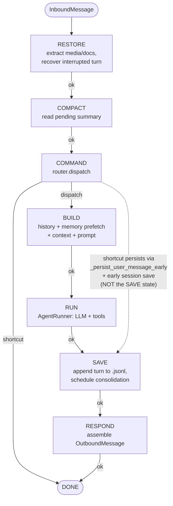
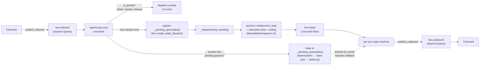
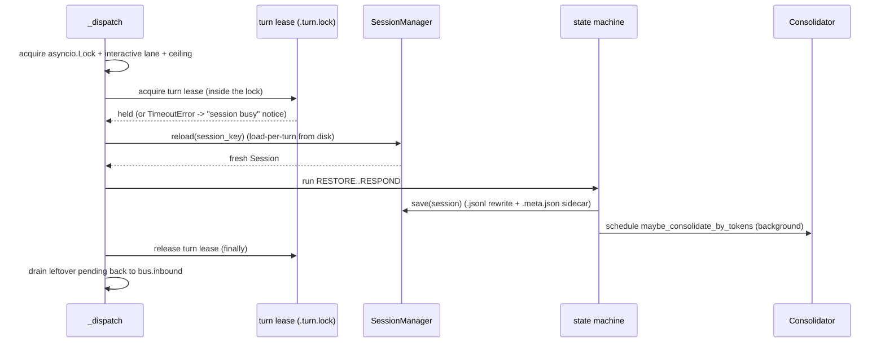

# Agent Loop

> The per-turn control-flow hub: how an inbound message becomes a state-machine
> turn, runs the LLM-plus-tools iteration, persists the result, and publishes a
> reply — channel-agnostically, one turn at a time per session.
>
> Sibling internals docs: [memory/00_overview.md](memory/00_overview.md) for the
> memory subsystem, [skills/00_overview.md](skills/00_overview.md) for skills,
> [concurrency.md](concurrency.md) for the cross-process locking model,
> [observability.md](observability.md) for telemetry, [ux.md](ux.md) for the
> CLI/TUI/webui surfaces.

---

## 1. Purpose

The agent loop is the engine that turns a message into a response. Every channel
— CLI, Telegram, Slack, the webui, cron — speaks to it through one contract: it
publishes an `InboundMessage` to a queue and reads back `OutboundMessage`s. The
loop owns everything in between.

For each inbound message it:

1. routes the message to the right session and serializes it against any turn
   already running for that session,
2. drives the message through a fixed per-turn state machine
   (restore → compact → command → build → run → save → respond),
3. delegates the LLM-and-tools iteration to a shared `AgentRunner`,
4. applies permission-as-data agent modes to the tool surface,
5. persists the turn to the session transcript and schedules background memory
   consolidation,
6. assembles and publishes the reply.

It exists so that the rest of the system — channels, tools, providers, memory —
does not have to know about turn ordering, persistence, compaction, or
concurrency. Those concerns live here, behind the bus.

The core type is `AgentLoop` in
[`durin/agent/loop.py`](../../durin/agent/loop.py). A single `AgentLoop`
instance is shared by the whole gateway and handles every session concurrently.

---

## 2. Mental model

Three ideas explain almost everything the loop does.

**1. A per-turn state machine.** Each turn walks eight states —
`RESTORE → COMPACT → COMMAND → BUILD → RUN → SAVE → RESPOND → DONE` — defined by
the `TurnState` enum. Transitions are data, not branches: each state handler
(`_state_restore`, `_state_compact`, …) returns an *event* string, and the
`_TRANSITIONS` table maps `(state, event)` to the next state. The one branch
that matters is in `COMMAND`: a matched shortcut command emits `"shortcut"` and
jumps straight to `DONE`, skipping the build/run/save states; a non-command
emits `"dispatch"` and continues to `BUILD`.

**2. Session-scoped serial execution, cross-session parallel.** Turns for the
*same* session run one at a time; turns for *different* sessions run
concurrently. This is enforced by two layers: an in-process `asyncio.Lock` per
`session_key` (cheap, same-process) and a cross-process turn lease
(`session_turn_lease`, a `.turn.lock` flock) that prevents the gateway and a TUI
or cron run from executing the same session at once. While a turn is running,
follow-up messages for that session do not spawn a competing task — they are
routed to per-session pending queues. Routing is two-tier: explicit steers
(`metadata["steer"]`, or a literal `[steer]` prefix normalized by the consumer)
and system-origin results (subagent / background-workflow completions) go to an
*inject* queue that enters the running turn at the next checkpoint; plain user
messages go to a *deferred* queue and only enter the conversation after the
turn's final response, so typing mid-turn queues instead of derailing the work
in flight.

**3. The message bus is the only channel contract.** Channels push
`InboundMessage` to `bus.inbound` and read `OutboundMessage` from `bus.outbound`
([`durin/bus/queue.py`](../../durin/bus/queue.py),
[`durin/bus/events.py`](../../durin/bus/events.py)). `MessageBus` is two plain
`asyncio.Queue`s with no routing logic. The loop never imports a channel; a
channel never imports the loop. The session a message belongs to is derived from
the message itself (`InboundMessage.session_key` = `session_key_override` or
`"channel:chat_id"`).

---

## 3. Diagrams

### 3.1 The per-turn state machine


```mermaid
flowchart TD
    In([InboundMessage]) --> Restore["RESTORE<br/>extract media/docs,<br/>recover interrupted turn"]
    Restore -->|ok| Compact["COMPACT<br/>read pending summary"]
    Compact -->|ok| Command["COMMAND<br/>router.dispatch"]
    Command -->|dispatch| Build["BUILD<br/>history + memory prefetch<br/>+ context + prompt"]
    Command -->|shortcut| Done([DONE])
    Build -->|ok| Run["RUN<br/>AgentRunner: LLM + tools"]
    Run -->|ok| Save["SAVE<br/>append turn to .jsonl,<br/>schedule consolidation"]
    Save -->|ok| Respond["RESPOND<br/>assemble OutboundMessage"]
    Respond -->|ok| Done
    Command -.->|"shortcut persists via<br/>_persist_user_message_early<br/>+ early session save<br/>(NOT the SAVE state)"| Save
```

The dotted edge is a note, not a transition: a shortcut command still writes the
turn to the session — it just does it inline in `_state_command` rather than
through the `SAVE` state. `/new` is the one exception: it clears the session and
the key's archived-context summary, and files the closed conversation as its own
indexed record (`<sanitized key, first 40 chars>_closed_<timestamp>` in the
session-summary store — searchable, never replayed), so the next conversation on
the key starts clean.

### 3.2 Concurrency topology


```mermaid
flowchart LR
    Ch[Channels] -->|publish_inbound| Inb["bus.inbound<br/>(asyncio.Queue)"]
    Inb --> RunLoop["AgentLoop.run()<br/>consumer"]
    RunLoop -->|"is_priority?<br/>(/stop, /restart, /status)"| Prio["dispatch_priority<br/>(no lock)"]
    RunLoop -->|"session has<br/>pending queues?"| Inject["route to _pending_queues[key]<br/>(steer/system → inject,<br/>user → deferred)"]
    RunLoop -->|"new session turn"| NewTask["register _pending_queues[key]<br/>then create_task(_dispatch)"]
    NewTask --> Disp["_dispatch(msg, pending)"]
    Disp --> Lock["asyncio.Lock[session_key]<br/>+ interactive lane + ceiling<br/>(ResizableSemaphore x2)"]
    Lock --> Lease["turn lease<br/>(.turn.lock flock)"]
    Lease --> SM[per-turn state machine]
    Inject -.->|"drained by runner<br/>injection callback"| SM
    SM -->|publish_outbound| Outb["bus.outbound<br/>(asyncio.Queue)"]
    Outb --> Ch2[Channels]
```

`run()` is a single consumer. For each message it picks exactly one path:
dispatch a priority command without any lock, route a follow-up into an existing
session's pending queues, or spawn a new `_dispatch` task. The queues are
registered *before* `create_task` so a same-session message that arrives in the
gap cannot spawn a competing task.

### 3.3 Session lifecycle within a turn


```mermaid
sequenceDiagram
    participant D as _dispatch
    participant L as turn lease (.turn.lock)
    participant SM as SessionManager
    participant ST as state machine
    participant C as Consolidator

    D->>D: acquire asyncio.Lock + interactive lane + ceiling
    D->>L: acquire turn lease (inside the lock)
    L-->>D: held (or TimeoutError -> "session busy" notice)
    D->>SM: reload(session_key)  (load-per-turn from disk)
    SM-->>D: fresh Session
    D->>ST: run RESTORE..RESPOND
    ST->>SM: save(session)  (.jsonl rewrite + .meta.json sidecar)
    ST->>C: schedule maybe_consolidate_by_tokens (background)
    D->>L: release turn lease (finally)
    D->>D: drain leftover pending back to bus.inbound
```

---

## 4. How it works

### The consumer: `run()`

`AgentLoop.run()` is one `while`-loop that consumes `bus.inbound`. On startup it
connects configured MCP servers (lazily, once; the time it took is logged as a
`Startup:` line), warms the memory embedding model in the background, and puts
back on the bus the messages the previous gateway journaled at shutdown
(`sessions/.inbound_journal.jsonl`, see `_dispatch` below); they re-enter the
queue directly, not through `publish_inbound`, because they already passed the
authorizer and the automation interceptors once. Only after it logs "Agent loop
started" does it start the memory health-check thread built with the loop, and
that thread's first check waits `_HEALTH_CHECK_FIRST_TICK_DELAY_S`: the first
check scans the whole memory store at once, and in the gateway `run()` starts
alongside the channels, uvicorn and the embedding warm-up, which the scan
would slow down. A loop that never runs `run()` (a one-shot `process_direct`
call) runs no health checks. At the same point it asks the memory file watcher
for its vector backfill, which builds the embedding provider and reads the
whole vector table, so that work never competes with gateway startup (see
[memory/02_indexing.md](memory/02_indexing.md)). For each message it decides
the routing in order:

- **Priority command?** `commands.is_priority(raw)` matches the exact-match,
  no-lock tier (`/stop`, `/restart`, `/status`). These are dispatched
  immediately via `_dispatch_command_inline` so `/stop` can cancel a running
  turn — it never queues behind the lock. They run under the effective session
  key, the key the turns they act on are registered under, so `/stop` and
  `/status` work with `unified_session` on; a command typed inside a direct
  session (`process_direct`) uses that session's own key.
- **Pending answer?** If a turn is waiting on the user (see "Waiting on the
  user" below), `_maybe_resolve_pending_answer` decides whether this message
  is the answer; a consumed message goes no further.
- **Mid-turn follow-up?** If the effective session key already has pending
  queues, the message is routed there instead of starting a new turn (or, if it
  is itself a non-priority command, dispatched inline). Steers and system
  results go to the inject queue; plain user messages go to the deferred queue,
  and the sender's surface is told (a `message_queued` websocket ack drives the
  webui chip; the CLI/TUI print or toast the notice).
- **New turn.** Otherwise the loop registers fresh pending queues for the
  session and `create_task(self._dispatch(msg, pending))`. The task is tracked
  per session so `/stop` can find and cancel it.

The effective session key (`_effective_session_key`) collapses to a single
unified key when `unified_session` is enabled and the message carries no
override.

**Stopping intake.** `stop_intake()` ends the consumer: it stops taking
messages at once (its current wait is ended rather than left to run out its
one-second poll) and `run()` returns. The gateway calls it as soon as it is
asked to stop, because it cancels the loop only after uvicorn has finished
its own exit. A message arriving from then on stays on the bus for the
shutdown drain (see `_dispatch` below), and the turns already running carry
on until that drain cancels them.

### Waiting on the user

A tool can hold its turn open until the person answers: `ask_user_question`
(when `agents.defaults.ask_user_blocking` is on) and the in-chat approval
asker (`durin/agent/approval_prompt.py`). Each registers one waiter per
session in `durin/agent/pending_answers.py`, typed by what it takes. A
`question` waiter takes the next plain-text reply verbatim. An `approval`
waiter takes only a yes/no verdict the loop parses (`parse_approval_reply`);
any other text makes it fall back, and the message continues as a normal
message. Slash commands and messages flagged `INBOUND_META_NOT_AN_ANSWER` (a
stored-secret note posted for the user) never answer a waiter, a message from
an API token (`origin: "api"`) never answers an approval, and a media reply
makes the waiter fall back. A system message (channel `system`, or any message
carrying `injected_event`: a sub-agent's result, a background workflow's
result, an automation's outcome, the note that says how an approval was
decided, all published under the chat's session key) neither answers a waiter
nor makes it fall back; it routes on into the running turn like any system
result, and the wait goes on. The reply to a system message goes to the chat
its `chat_id` names, in the thread its session key scopes: the loop re-derives
a Slack `thread_ts`, an email thread and a Telegram forum topic
(`message_thread_id`) from the key, since the message itself carries no
channel metadata. A system message that starts a turn of its own is a turn
of the session's: it runs on the model and with the SOUL of the session's
persona, resolved as BUILD resolves them, and its compaction checks and
history replay are sized by that model. Like BUILD, it reads the session
summary after its check, so a compaction that check ran is summarized in the
prompt it builds. It is saved
once, as its own entry: a sub-agent's result as the assistant message saved
before its prompt is built (its entry in the prompt carries only the runtime
context and is not saved), anything else as a user message; the run's
messages are saved from the end of the prompt actually built, which is one
entry shorter when the build merged the message into a trailing one of the
same role. An answer carries its
message's `origin` through `pending_answers.resolve`, and the waiting tool
notes it as the turn's input in the turn's own context
(`approval.note_turn_input`), so an API client's answer to a question marks
the turn as API input for what follows (see [security.md](security.md)).

A waiter only exists where it could be answered (`pending_answers.can_block`):
an interactive session, a live inbound consumer, and a surface that can send a
reply before the turn ends. The legacy REPL (`durin agent --legacy`) reads its
next line only after the turn, so it calls `set_mid_turn_replies(False)` and
nothing waits there. A wait that gets no answer falls back on the answer
timeout (`agents.defaults.ask_user_answer_timeout_s`), and when a webui chat
has had nobody watching it for a grace window (`_ANSWER_GRACE_S` in the
websocket channel; a page refresh re-subscribes inside it and keeps the wait;
see [ux.md](ux.md) for who counts as watching). A question then yields, and an
approval stays pending, except an exec request, which is closed as `expired`.

A wait does not survive a restart. `stop()` cancels the waiters, which ends
their turns, and the shutdown drain below journals the message each of those
turns was answering, so the next start runs the turn again and it asks again.

### The turn: `_dispatch`

`_dispatch` is where serialization happens. It acquires, in order, the
per-`session_key` `asyncio.Lock`, the **interactive lane** (`self._interactive_lane`,
a `ResizableSemaphore` sized by `agents.defaults.max_concurrent_interactive` —
`DURIN_MAX_CONCURRENT_REQUESTS` overrides it live), the **global ceiling**
(`self._ceiling`, sized by `agents.defaults.concurrency_ceiling`), and then —
*inside* the lock — the cross-process turn lease via `session_turn_lease`. The
lease is acquired inside the lock so an in-process turn never even attempts the
flock while a sibling task holds the same lock; if the lease times out (another
*process* holds the session), the turn returns early with a "session is busy"
notice. With the lease held, it calls `sessions.reload(session_key)` —
load-per-turn — so the turn always sees the freshest on-disk state rather than
a stale cached `Session`.

The lane and ceiling slots are one per-turn `TurnSlots` object
(`durin/agent/turn_slots.py`), bound to the turn's context. A turn waiting on a
person (see "Waiting on the user" above) gives its lane back while it waits
and takes it back before continuing: the approval asker and a blocking
`ask_user_question` wrap their wait in `released_while_waiting`. The session
lock and the lease stay held. A wait in a sub-agent or a background run the
turn started (which copied its context but works under another session key)
leaves the turn's slots alone, and so does anything after the turn ended.

The ceiling is shared with `SubagentManager`, which acquires it around each
subagent's LLM run (`_run_subagent`) — so subagents count against the same
global cap as interactive turns rather than running unbounded alongside them.
Subagents remain fire-and-forget: `spawn()` schedules `_run_subagent` via
`asyncio.create_task` and returns immediately, so a parent turn holding the
lane/ceiling while spawning a subagent never waits on that subagent — only the
subagent's own later ceiling acquire can block, which resolves once any
in-flight turn releases its slot. `reload_app_config` re-applies the caps live —
the interactive lane and the ceiling via `set_limit()`, and the sub-agent cap by
re-reading `max_concurrent_subagents` — so a `ConfigService` write to a cap key
takes effect without a process restart. See [Concurrency](concurrency.md) for the
full lock-ordering picture.

By default a spawned subagent inherits the parent session's model/provider
(the same pinning-at-spawn-time snapshot described above). Setting
`agents.aux_models.subagents` (an aux-model handle — `preset` or inline
`model`/`provider`, same shape as `aux_models.vision`/`audio`/`memory`) runs
subagents on a different model instead, e.g. a cheaper one for fire-and-forget
background work. `SubagentManager` resolves it fresh on every `spawn()` call
via a live `app_config` getter from the loop, so a hot-reloaded change applies
to the next spawn without a restart. Resolution failure (bad preset, missing
key) logs a warning and falls back to the inherited session model — spawning
must never break on a misconfigured aux model.

A child runs under the context window of the model it actually uses. The loop
hands `SubagentManager` its own `context_window_tokens` / `context_block_limit`
at construction and re-points the window on every provider snapshot swap; a
configured aux subagent model overrides it per spawn with that model's window
(capped by its fallbacks' windows, as the main loop's snapshot is). The window
goes on the child's `AgentRunSpec`, which is what turns on the runner's
mid-turn precheck, history snip, pruning of old tool results near the limit and
the window-scaled per-result cap for the child. The spec also carries the
workspace the child's own tools read, so an oversized or pruned result is saved
where the child can read it back. Without a window a child has no input budget,
and a long task would end in the provider's context-length error instead of
durin's own compaction. Each
finished child writes one `subagent.run` telemetry row (task id, label, model,
window, stop reason, iterations, summed prompt/completion tokens, duration) into
the spawning session's telemetry file, where the child's `provider.call` rows
already land; see [Observability](observability.md).

It then runs `_process_message`, publishes the result, and in a `finally` block
releases the lease and re-publishes any messages still sitting in the pending
queue back onto `bus.inbound` so a late follow-up is processed as a fresh turn
rather than lost.

That hand-off only helps while the process keeps consuming the bus. The bus
and the pending queues are in-memory, a stopping gateway never reads the bus
again, and no channel redelivers (Telegram confirms its offset before the
handler runs, Slack acks the envelope before publishing, email marks the
message seen inside the fetch), so every restart with a turn in flight used
to discard the follow-ups queued behind it. The gateway's shutdown now calls
`drain_inbound_for_shutdown()`: it records and cancels every turn in flight
first, across every session key, before awaiting any of them — awaiting one
would let the others run, and a turn whose own wait (an ask_user answer, an
approval) gets cancelled by that window ends before the drain reaches it,
losing its message instead of journaling it. With each session's turns it
takes that session's pending queues, before the turns are cancelled, so a
turn's `finally` has nothing left to put back on the bus. It then waits once,
for a bounded time, for all the cancelled turns to unwind together; a turn
stuck past that bound is logged and left behind rather than charging the
drain its own timeout again for every such turn. It collects what is on the
bus plus any queue whose turn is no longer running, drops trigger-only
messages (published for automation triggers, never a conversation), and
writes the rest to `sessions/.inbound_journal.jsonl` (`durin/bus/journal.py`).
Per session the journal holds the message each cancelled turn was answering
(the loop keeps it per task from `_start_turn_task` until the task finishes),
then the follow-ups queued behind it, then what was still on the bus. A
follow-up the turn's `finally` re-published would land behind a message sent
after intake stopped, which waits on the bus, and the next start would answer
the two out of order. The next start replays the journal into the bus, in
order, once —
a message older than a day at replay time is dropped with a log line rather
than answered out of the blue. The interrupted turn therefore runs again
after the restart. Its first attempt stays visible in the session: the user
message was persisted early with `pending_user_turn` set, and RESTORE closes
it as "interrupted" when no runtime checkpoint materialised partial work
first, so the history reads user message, the interruption, the same message
replayed, the answer. That closing line is the crash path's whole recovery
(a hard death journals nothing); the journal is what a graceful restart adds.

The journal file is shared by every process that can run an `AgentLoop`
against this workspace — not only the gateway, but also the TUI and the
legacy REPL when run locally against the same `DURIN_HOME`. Each entry is
written with its writer's `process_kind` (the gateway's default; the TUI/REPL
pass `"tui"`), and a replay only takes the entries tagged for its own kind —
an untagged entry (a journal file written before this existed) still matches
any kind. So a gateway starting up while the TUI has just journaled its own
turn does not steal it, and the reverse: the TUI's own next start still finds
it, undisturbed. `append` and `drain` both take `cross_process_lock` on the
file, so a concurrent writer during a drain waits instead of racing the
read-modify-write.

`/restart` takes the same graceful shutdown a SIGTERM does — the gateway's
signal handler and `/restart` both funnel through one path, so `/restart`
also stops MCP, cron, the dream and embed workers, drains the inbound
journal as above, stops the channels, and flushes sessions before the
process replaces itself. Because any one of those steps could hang (a stuck
MCP client, a turn whose dispatch never unwinds, `asyncio`'s own teardown of
leftover tasks), a restart also arms a watchdog on its own OS thread: past a
deadline, it re-execs the process regardless of what the graceful shutdown
is still doing, the way SIGKILL rescues a shutdown that ignores SIGTERM. A
real signal that lands while a restart's shutdown is running wins over it —
the process ends as a plain stop rather than restarting, and the watchdog is
cancelled so it can't fire a re-exec afterward.

### The state loop: `_process_message`

`_process_message` builds a `TurnContext` (mutable per-turn state — message,
session key, history, messages, callbacks, the pending queue, a diagnostic
`trace`) and runs the state machine. The driver is generic: it looks up
`_state_<name>`, calls it, records a `StateTraceEntry` (state, duration, event,
error), and follows `_TRANSITIONS[(state, event)]` until it reaches `DONE`. A
missing handler or an unmapped `(state, event)` raises immediately — the table
is the spec.

The handlers, in order:

- **`_state_restore`** — splits documents out of media, then materializes any
  interrupted turn. A crashed or `/stop`-ped turn leaves a `runtime_checkpoint`
  (mid-turn tool state) and/or a `pending_user_turn` flag in session metadata;
  `_restore_runtime_checkpoint` / `_restore_pending_user_turn` fold those into
  history so the conversation is consistent before the new turn.
- **`_state_compact`** — reads the consolidator's archived-summary marker
  (`_format_pending_summary`) so the build step can prepend it. BUILD re-reads
  it after its own consolidation: when that consolidation archives turns it
  also writes or extends the summary, and the history is re-derived without
  those turns, so the compacting turn's prompt must carry the summary of what
  it no longer sees rather than the one read here (`None` on a first
  compaction). The overflow-retry rebuild re-reads it for the same reason.
- **`_state_command`** — runs `commands.dispatch`. If a handler matches it
  persists the user message (`_persist_user_message_early`) plus the command's
  reply (both tagged `_command` so they are filtered out of LLM history),
  saves the session, and returns `"shortcut"` → `DONE`. Otherwise `"dispatch"`
  → `BUILD`.
- **`_state_build`** — resolves the active persona and the model the turn
  runs on (a per-turn ref, else the persona's model; `ctx.run_snapshot` when
  that is not the loop's own), then runs `maybe_consolidate_by_tokens` sized
  by that model (compacting before building so the prompt fits), sets the
  per-tool request context, slices history (`session.get_history`, within
  the same model's input budget), then resolves the session's frozen eager
  memory surface (the pinned block and hot layer rendered on the session's
  first build, `memory.eager_surface`) and binds it for the turn (task-scoped,
  released in `_state_save`) before any search runs, so `memory_search`'s
  in-context dedup — the loop's own prefetch included — judges the text this
  prompt carries rather than the live workspace. It then runs one automatic
  warm `memory_search` with the user's message and fences the hits into the
  wire copy of that message as reference data, and finally assembles the LLM
  message list via `context.build_messages` — handing it that surface so a
  write mid-session does not rebuild the provider's cached prefix, and, when
  the session had no snapshot yet, taking the freeze from this build and
  re-binding the turn to it. It also persists the user message early so an
  interrupted run is recoverable.

  The search is bounded and best-effort: skipped for slash commands, for
  messages under the configured minimum length, for sessions the runtime treats
  as autonomous, and when there is no index or no `memory_search` tool; a
  timeout or error is swallowed and suppresses the prefetch for a cooldown
  window, so the turn never waits on memory. Every outcome, hit or skip with its
  reason, is one `memory.prefetch` row.
- **`_state_run`** — calls `_run_agent_loop`, which delegates to
  `AgentRunner.run`. The result tuple
  `(final_content, tools_used, all_messages, stop_reason, had_injections, tool_events)`
  is stored on the context. An overflow before the turn's first model call
  (the consolidator's trigger ceiling is held strictly under the input budget
  of the run that follows, sized by the model the turn runs on, so a
  successful BUILD consolidation always fits — an iteration-0 overflow means
  it failed) triggers one bounded retry: force a fresh
  consolidation, rebuild the context, re-run
  (`overflow_retry.forced_consolidation`). The rebuild has BUILD's shape:
  the turn's own message, which BUILD has saved by then, stays out of the
  replayed history (`get_history` stops at the position BUILD saved it at)
  and is added once, as the current message. Only an attempt that appended
  nothing but the runner's overflow placeholder is retried, since the
  rebuild starts the turn over: a tool that ran would run again, an answer
  already given would be given twice, and a queued message the attempt took
  into the turn would be lost. The forced consolidation skips the
  idle check and the real-usage vetoes below: the overflow is newer proof
  than the provider's last count, and a vetoed retry would overflow again,
  as would every later turn of the session. An overflow the runner reports
  as unfixable by compaction (`fits_without_history=False`: the system
  prompt, the tool definitions and the request alone are over the budget) is
  not retried: a compaction only removes history, so the turn fails at once,
  its error naming the prompt's largest parts from the build's
  `context.composition` (AGENTS.md, the tool definitions, the message...).
- **`_state_save`** — finalizes plan/stall/goal bookkeeping, records skill-usage
  signals, appends only the new turn's messages to the session
  (`_save_turn` rewrites the `.jsonl` and mirrors derived/volatile metadata to
  the `.meta.json` sidecar), then schedules a background
  `maybe_consolidate_by_tokens`. The new messages are everything the run
  appended after the prompt it started from, so the save starts at that
  prompt's length whatever its shape: the build merges the current message
  into the last history message when both are user messages, and BUILD has
  already saved the current message itself. A turn that fails on an overflow
  saves the runner's overflow placeholder, an assistant message saying so,
  so the session does not end on the unanswered message and the next turn's
  message is not merged into it. A tool result too large for the persisted
  transcript is spilled to a recoverable file *before* it is truncated, and the
  pointer back to the full output leads the saved text, whose whole length
  stays within the cap. A later turn previews an over-cap entry from its head,
  so a trailing pointer would be the part that disappears. It also closes out the
  turn's memory bookkeeping: the prefetch's dedup binding is released here (a
  turn that never reached SAVE releases it in the state loop's `finally`
  instead), and a `turn.memory_usage` rollup is emitted for every turn.
- **`_state_respond`** — assembles the `OutboundMessage` (`_assemble_outbound`),
  suppressing it when the turn already streamed its answer through the
  `message` tool.

### The iteration core: `AgentRunner`

`_run_agent_loop` is the bridge from loop to runner. It builds the hook,
resolves the agent-mode provider and the compaction-grace probe, takes the
per-turn model BUILD resolved (the loop's own when there is none), then
calls `self.runner.run(AgentRunSpec(...))`.

`AgentRunner` ([`durin/agent/runner.py`](../../durin/agent/runner.py)) is the
shared, product-agnostic LLM loop. It iterates up to `max_iterations` (200 by
default): call the LLM → if the response has tool calls, execute them (with
topological batching) and loop; otherwise finalize the content and stop. A
caller whose tool call concludes the work (a workflow node's `route` verdict)
sets `AgentRunSpec.end_turn_after_tools`: called after each round of tool calls
with the run's messages so far, when it returns true the turn ends there with
the text sent alongside those calls as its final content (or, when that reply
has none, the latest text of the turn), and no further request is made. Around
that core it layers guards and context governance — loop detection on repeated
failed calls, an unknown-tool breaker, an idle-timeout breaker, message
sanitization (dropping orphan tool results, backfilling missing ones),
per-result and per-turn tool-output budgets with spill-to-disk, and microcompact
/ media pruning of the in-flight message list. Message sanitization,
microcompaction, media pruning and the precheck's trim reshape only the copy
sent to the model; the per-result and per-turn budgets replace an oversized
result in the run's own messages, so the saved transcript keeps the pointer to
the full copy.

**Context budget.** The input budget reserves only a *capped* output headroom
(`_output_reservation`, not the full configured `max_tokens` ceiling), so a high
ceiling never collapses the usable input; the request then sends a *dynamic*
`max_tokens` sized to the room the prompt actually leaves (resolving the ceiling
from the provider when the spec leaves it unset). When a request is over that
budget, the history snip (`_snip_history`) drops history, oldest first: the
messages before the run's own request, the last user message of the prompt it
started from. That request and everything after it, the system prompt, the
task state a request appends and the tool schemas are all sent, so the
history gets what they leave, starting at a user message on a legal tool-call
boundary. It counts each message as the precheck's estimate of the whole
request does, the newline that joins it to the next one included, so a
history of many short messages is not kept over the budget by a token a
message. A caller that compacts and retries sets
`caller_compacts_on_overflow`: the chat loop's turn does, on every attempt but
its last, so its first request keeps the replayed history whole and an
overflow there is answered by a compaction that summarizes what the snip
would have dropped; the last attempt snips rather than fail on a history
compaction could not shrink. A mid-turn precheck estimates
the post-sanitize request each iteration, the task state it appends
included, so neither the budget check nor the dynamic `max_tokens` it sizes
leaves that block out: when it is over budget the runner
emergency-trims the largest string tool results on the model-facing copy and
proceeds if that fits (`mid_turn_precheck.recovered`); only when trimming can't
recover does it abort *before* the LLM call with
`stop_reason=mid_turn_precheck_overflow` and an overflow-specific placeholder.
The abort leaves the request unfinished and nothing re-sends it; the error tells
the user to send it again, and the next turn runs on a compacted context.
Unless the request is over the budget even without the history before the
run's own request (the system prompt, the tool definitions and the run's own
messages alone, `mid_turn_precheck.overflow`'s `fixed_tokens`): no compaction
can make that fit, so the error says what the request needs and what each of
those parts takes instead, the placeholder says the request was not answered,
and the result carries `fits_without_history=False`.

The estimate (`estimate_prompt_tokens_chain`) prefers the provider's own count.
Every assistant message the runner persists is stamped with
`usage_prompt_tokens`, the provider's count for the prompt that *produced* it:
system prompt, tool definitions and every earlier message. The task state that
request appended is taken out of the stamp: the conversation never keeps it,
and each request appends the block as it is then, so a stamp that kept it
would count it twice. A reply from the no-tools finalization retry carries
the count of the request with tools whose blank answer the retry replaced,
not the two requests' counts added together. From the second call
of a turn onward the estimate is that stamp plus a tiktoken estimate of the
stamped message and everything after it, *without* the tool definitions, which
the stamp already contains. Before any call has been made (iteration 0, and the
consolidator, whose history carries no stamps) it is a tiktoken estimate of the
messages plus the tool definitions — the same basis on both sides, which is what
the iteration-0 overflow invariant above relies on.

**Microcompaction** replaces old tool results by a pointer to their saved
file only in rare batches (`_microcompact`, with a per-run `_PruneState`):
- **When.** A batch fires only when the prompt about to be sent is over
  `_MICROCOMPACT_PRESSURE_RATIO` (80%) of the input budget. Below it every
  result stays in full — it may still hold the answer to a question the user
  hasn't asked yet.
- **What.** Every result of `read_file`, `exec`, `grep`, `web_search`,
  `web_fetch` or `list_dir` older than the protected recent ones, at once.
  Skills, memory and other tools' results are never pruned, nor are results
  shorter than `_MICROCOMPACT_MIN_CHARS` or ones made of content blocks.
- **Protected.** The most recent prunable results — at most
  `_MICROCOMPACT_KEEP_RECENT`, and only while together they fit in
  `_MICROCOMPACT_PROTECT_RATIO` (20%) of the budget; the newest always.
- **Worth it.** A batch rewrites the prompt from its first pruned result on,
  which costs a prompt-cache write of everything after it, so it only fires
  when it frees at least `_MICROCOMPACT_MIN_FREED_RATIO` (5%) of the budget.
- **Sticky.** What a batch replaced stays replaced, with the same placeholder
  byte for byte, for the rest of the run. Between batches a request is the
  previous one plus new messages, which keeps the provider's prompt cache and
  the usage-anchored size estimate valid; a result never reappears after it
  was pruned. A new run starts with nothing pruned, so it prunes again only
  if it is over the threshold — unless it continues a previous run's messages
  and is given that run's state (`AgentRunSpec.prune_state`, from its
  `AgentRunResult.prune_state`): a workflow node's re-entry and synthesis runs
  keep what the work loop pruned, so their requests share its prefix.
- **Which usage stamps to trust.** Size estimates anchor on the latest usage
  stamp, but a run trusts only the stamps it produced after its last batch.
  The stamps on the messages it starts from measured another run's requests
  — possibly pruned ones: a workflow node's synthesis, re-entry or persistent
  revisit starts from an earlier run's messages, stamps included — and the
  stamps from before a batch measured prompts that still held the pruned
  results. Those are dropped from the model-facing copy (they are never
  sent), so the request is counted from scratch: the pruning check, the
  history snip and the mid-turn precheck see the prompt actually sent, never
  one that looks smaller or larger than it is.
- **No window, no pruning.** A run without a known context window has no
  budget to measure against and prunes nothing.
- **Telemetry.** Each batch writes one `tool_results.pruned` event (iteration,
  estimate, budget, pruned and protected counts, freed tokens).
- **Tools hear about it.** Before each request, the runner compares the
  model-facing copy with the run's messages. Each tool result that no longer
  reaches the model whole is reported once to its tool through
  `Tool.result_left_context(arguments)`: one a batch replaced, one the
  precheck cut, one the history snip dropped, or one the turn budget saved to
  disk. The turn budget replaces a result in the run's own messages, so both
  copies match there; a saved reference counts as not whole on its own.
  `read_file` uses the report to stop answering a repeat read of that file
  with the "unchanged since last read" stub, which would point at content the
  model no longer has. A tool call entry that is not well formed is skipped,
  and a failure here is logged without stopping the run.
- **A request after the run.** A caller that sends one more request from a
  finished run's messages — a workflow node's forced `route`, re-entry
  assessment or `deliver` call — builds it with
  `AgentRunner.request_view(spec, messages, result.prune_state)`: the governance
  and budget fit the run's next request would get, from the run's own prune
  state (`AgentRunResult.prune_state`), so what the run pruned stays pruned byte
  for byte and the request fits the run's input budget instead of carrying the
  whole unpruned history. It also returns the output cap that request would
  carry, chosen as the loop chooses it (`_request_max_tokens`): with a known
  window, the ceiling clamped to the room the messages leave in it; without
  one, the provider's own.

The placeholder is informative rather than opaque:
- it names the tool;
- it quotes a short head snippet of what the output began with (omitted when
  the content is already a persisted reference, since its head is marker
  boilerplate);
- it says the content is no longer shown and names the `read_file` call on the
  recoverable file, to read it back "before you use anything from it, instead
  of re-running the call" — a model that only sees "trimmed" can take it for a
  partial view and answer from memory. A result that was never saved is saved
  on the spot; a run without a workspace keeps an honest "no longer shown here
  and not saved" marker instead.

Runs that have tools but not the chat's operating floor — subagents and
workflow nodes — carry the same recovery rule (`agent/_snippets/tool_result_recovery.md`,
in the subagent system prompt and in a node's "Tool results" section): read a
trimmed or saved result back before using it, and state findings in your own
words as they come, since those runs have no `note_decision`.

**Task state mid-turn.** The prompt built for a turn carries the `<task-state>`
block: goal, decisions and findings, todos. The loop hands the runner a
`task_state_provider`. Before each request that offers tools, the runner
compares the current block with the conversation. When a `note_decision` or
todo update has changed it, the new block is appended to the end of that
request. Appending at the end keeps the cached prefix, and the block never
enters the saved transcript. That makes a finding recorded mid-investigation
survive the trimming of the older tool results it came from. The no-tools
finalization retry is sent without the block, so it ends with its own
instruction.

Two behaviors connect the runner back to the loop:

- **Mid-turn injection.** The runner calls the loop's `_drain_pending` callback
  at two kinds of checkpoint. After each tool batch it drains with
  `steer_only=True`: only the inject queue (steers, framed as mid-work
  guidance, plus sub-agent / workflow results) enters the running turn. After
  the final response it drains both queues — deferred user messages last, so
  the model answers them with all results already in context — and websocket
  clients get a `queued_consumed` ack. Drained messages are appended as user
  turns so the run continues without a new dispatch. When the call before
  that drain produced no reply (an error, or an empty reply after its
  retries), what the turn keeps without a queued message for that missing
  reply (the model-error placeholder, or the empty-reply text) is appended
  first, so a drained message is never merged into the user message before
  it: when the first call failed that is the turn's own message, which the
  loop does not save, and the drained message would reach the model but not
  the session. Injection is bounded — at
  most `_MAX_INJECTIONS_PER_TURN` messages drained per cycle and
  `_MAX_INJECTION_CYCLES` cycles — so an injection chain cannot run forever.
- **Per-turn provider snapshot.** `AgentRunSpec.provider` carries the provider
  resolved for *this* turn. The gateway shares one runner, and a concurrent
  session's `/model` swap mutates `self.provider`; pinning the provider on the
  spec makes the turn immune to that mid-flight swap.

### Hooks

Every turn wires at least one hook. `_run_agent_loop` always constructs an
`AgentProgressHook`
([`durin/agent/progress_hook.py`](../../durin/agent/progress_hook.py)) for
streaming deltas, tool hints, reasoning, iteration counting, and cache-usage
capture. If the loop was built with extra hooks, they are wrapped together with
the progress hook in a `CompositeHook`
([`durin/agent/hook.py`](../../durin/agent/hook.py)), which fans out to each hook
with per-hook error isolation so a faulty hook cannot crash the turn.

### Personas & SOULs

#### SOUL library

A *SOUL* is a personality document that replaces the default `SOUL.md` in the
system prompt. `SoulStore` (`durin/souls/store.py`) is the file-backed library:
the `default` soul maps to the workspace-root `SOUL.md` (kept there for
backward compatibility and git-tracking); every other soul lives under
`workspace/souls/<slug>.md`. Souls are plain markdown — readable and editable
without any tooling.

On a fresh workspace, a set of example souls is pre-seeded under
`workspace/souls/` (`researcher`, `engineer`, `tutor-feynman`,
`tutor-socratic`). They back the seeded example personas and serve as templates
for user-defined souls.

#### Persona records

A *persona* pairs a soul with an optional model. `PersonaConfig` in
`durin/config/schema.py` has three fields: `soul` (a `SoulStore` slug; omit to
use `"default"`), `model` (a model picker ref — a preset name or
`"provider model"` string — or `None` to inherit the global default model), and
`description` (free text shown in `/persona` listings).

Personas live in the `personas` map in `config.json`, structurally identical to
`model_presets`. On first run, the example personas (`researcher`, `engineer`,
`tutor-feynman`, `tutor-socratic`) are seeded into that map
(`durin/personas/builtin.py`'s
`seed_example_personas`, guarded by the `agents.defaults.personas_seeded`
marker) as ordinary entries — fully editable and deletable; a user who removes
one keeps it removed across restarts (the marker prevents re-injection).

`Config.resolve_persona(name)` looks the name up in the `personas` map and
returns `None` when it is unknown (the caller falls back to the default SOUL and
default model). `Config.persona_names()` lists the configured personas. The
persona listing (`GET /api/v1/personas` and the webui pane) additionally
surfaces a synthetic `durin` entry — the base SOUL plus the default model —
last in the list, so the implicit fallback is visible and selectable under its
real name instead of an anonymous "default"; that synthetic entry alone is not
editable or deletable (`durin`/`default`/`none` are reserved persona names —
the latter two remain accepted as reset keywords for compatibility).

Example user config:

```json
{
  "personas": {
    "acme": {
      "soul": "researcher",
      "model": "fast",
      "description": "Research mode for Acme project"
    }
  }
}
```

#### Selection and precedence

The active persona for a turn is resolved once in `_state_build` by
`resolve_active_persona_name` (`durin/personas/resolve.py`):

1. **Cron job** — `job.payload.persona`, set per job in the cron panel or the
   `cron` tool; applies only to that job's run (mutually exclusive with the
   job's per-run model).
2. **Per-conversation** — `session.metadata["persona"]`, set by `/persona
   <name>` and cleared by `/persona durin` (`default`/`none` also work as reset
   keywords).
3. **Channel** — the inbound message's channel section:
   `channels.<name>.chat_personas[chat_id]` (per-chat) first, then
   `channels.<name>.persona` (the channel-wide default), so a transport can
   carry its own identity and refine it per conversation.
4. **Global default** — `agents.defaults.persona` in config (applies to every
   new conversation until overridden).
5. **No persona** — default `SOUL.md` and global default model, unchanged from
   pre-persona behavior.

The resolved persona's soul body replaces the default SOUL in the stable system-
prompt layer (via `ContextBuilder`), and the compaction checks of the session's
turns measure the prompt with it (`maybe_consolidate_by_tokens(persona_soul=…)`),
as `/status` does: a persona's SOUL can be many times the default's size, and
measured with the default one the session would compact late and overflow.
Its model ref is passed to the existing
per-turn model-override path alongside any explicit `/model` or cron per-job
model; the most-specific reference wins (`ctx.model_preset_override or
ctx.persona_model_ref`) — an explicit `/model` switch always overrides the
persona's model.

#### Surfaces

Souls and personas are manageable through three surfaces:

- **`/persona` slash command** — switches the active persona for the current
  conversation; `/persona durin` reverts to the base persona (`default`/`none`
  are also accepted as reset keywords).
- **`agents.defaults.persona` in `config.json`** — sets the global default persona
  applied to every new conversation.
- **Webui Personas settings section** — a SOUL library editor (create, edit,
  delete named soul files) and a Persona definitions panel (create/update
  personas with model picker and soul picker, delete user-defined personas, set
  or clear the global default). Backed by `PersonasService` (`durin/service/personas.py`)
  via the `/api/v1/souls` and `/api/v1/personas` route groups (see
  [api.md](api.md)).

  Two additional behaviors in this surface:

  - **Live model + SOUL test** — the persona form *and each persona row* (so
    any persona — including the seeded examples and the synthetic `durin` base
    persona — can be tested straight from the list) carry a "Test" action (`POST /api/v1/personas/test`) that
    runs the selected soul and model against a fixed short prompt and returns
    the model's reply. If the provider or model reference is invalid, the
    response carries an `ok: false` error message instead of raising an HTTP
    error; the webui shows it inline (below the form, or under the row).

  - **SOUL deletion** — every soul can be deleted except `default` (the
    workspace `SOUL.md`). A persona that still references a deleted soul falls
    back to the default SOUL at runtime (`SoulStore.read` returns empty →
    `_active_persona` yields `None` → the default SOUL is used), so deleting a
    referenced soul never breaks the agent. The webui still shows an "in use by
    N" hint on a referenced soul as a heads-up, but allows the delete.

#### Operating floor

durin's execution rules — tool-use discipline, planning hygiene, and operational
posture — live in `durin/templates/agent/operating_floor.md` and are injected
into the stable system-prompt layer by `ContextBuilder._build_operating_floor`
independent of which SOUL is active. Swapping a SOUL never removes these rules.
The only exception is backward compatibility: if the active SOUL already contains
a `## Execution Rules` section (a pre-existing workspace `SOUL.md` with embedded
rules), the floor injection is skipped to avoid duplication.

### Agent modes (permission-as-data)

Modes ([`durin/agent/agent_mode.py`](../../durin/agent/agent_mode.py)) are pure
data: a `name`, an optional `allowed` allowlist, a `denied` set, and a
`prompt_suffix`, plus an optional `icon` and a `builtin` flag carried for the
UI. The loop has no `if plan_mode` branches. Instead the runner
calls a `mode_provider` callback each iteration to read the active mode (from
`session.metadata["agent_mode"]`) and filters the tool definitions sent to the
LLM. Because it is read per iteration, a mid-run `/plan` or `/build` takes effect
on the very next iteration. If the model emits a tool call for a denied tool
anyway (e.g. a cached name), `_run_tool` returns a synthetic "not available in
this mode" result — tool-by-tool denial, not a stopped run. Built-ins:
`build` (full access), `plan` (read-only planning), `explore` (read-only, for
sub-agents), and `read` (read-only with a neutral posture — no interactive
framing, for workflow nodes that inspect or judge). `explore` and `read` share
one read-only tool surface by design; only their `prompt_suffix` posture differs.

The restricted built-ins carry **hand-curated** allowlists (only `build` grows
automatically as new tools are added). `plan` allows read-only investigation plus
project-memory recall and capability discovery (skills/workflows), so it can
plan against what already exists; `explore`/`read` allow read-only investigation
plus memory recall. A new tool does **not** join these allowlists on its own — the
list is maintained deliberately, because "side-effect-free" (`read_only`) is not
the same as "appropriate for a restricted mode" (e.g. the secret-read tools are
`read_only` yet excluded).

Two gates apply to a read-only mode's effective surface: the mode allowlist AND
the tool's `_scopes` (see [tools.md](tools.md)). A subagent or workflow node loads
only `subagent`-scoped tools, then the mode allowlist filters that set — so a tool
must carry the `subagent` scope to be reachable there at all (the memory-recall
tools do, which is why `explore`/`read` can surface them).

The registered modes are listed over `/api/v1/modes` (`ModesService`), which the
webui composer's mode picker renders by `name`. The picker is mode-agnostic: it
shows whatever the registry holds, so it follows new modes without UI changes. The
same service exposes `GET /api/v1/tools` — the catalog of tools a mode allowlist
can reference (name, description, `read_only`, built-in vs MCP, plus `background`:
whether an entry can ever apply to a sub-agent or workflow node — built-ins need
the `subagent` scope, MCP tools always qualify because a node opts into them via
its `mcps` field), read from the live loop's registry so it matches exactly what
the agent can call. The settings editor uses it to offer a checklist of the real
tool set (rather than free-text tool names), to surface read-only tools left out
of an allowlist, and to badge background-capable tools so a custom mode's author
can see which entries will reach workflow nodes and sub-agents.

User-defined modes are persisted as `ModeConfig` entries under `agent_modes` in
config and registered into the same registry at startup (`register_config_modes`,
which never shadows a built-in). The same `ModesService` route handles
`POST`/`DELETE` to create, edit, and remove them (the settings UI), re-registering
after each mutation so a change takes effect without a restart; the three
built-ins are immutable.

### Default model (live-applied from settings)

Changing `agents.defaults.model`/`provider` through the settings UI
(`POST /api/v1/settings`, `SettingsService`) applies to the running loop without a
restart. After saving config the service calls its `on_default_changed` hook,
which the gateway binds to `AgentLoop.apply_default_model_live`
(`durin/agent/loop.py`). That method reloads the config snapshot
(`reload_app_config`), which rebuilds the always-present `default` preset from
the new `agents.defaults`, then applies the new default so the change is live on
the next turn. The apply path depends on the provider:

- For an **explicit provider** the `"provider model"` picker pair is resolved
  through the same raw-pair-safe path the `/model` command uses —
  `resolve_preset_ref` (registers an ad-hoc preset) then `set_model_preset`.
- For `provider == "auto"` (the schema default, and what the settings provider
  picker emits when left empty) it applies the rebuilt `default` preset directly,
  the same path cold-start uses. A bare model string is not a registered preset,
  so a synthetic `provider model` ref would raise `KeyError` out of
  `set_model_preset`.

An unresolvable ref logs a warning and no-ops rather than escaping the
`on_default_changed` handler. A local provider (ollama and friends) is accepted
as the default when its `api_base` is set, not by `api_key`.

### Sessions

A `Session` ([`durin/session/manager.py`](../../durin/session/manager.py)) is an
append-only message list plus `metadata` and a `last_consolidated` cursor.
`SessionManager` persists it as a JSONL file: line 0 is the identity metadata
header (mode, todos, plan path, channel ownership), and the rest are messages.
Writes are atomic (`tmpfile` + `os.replace`) under a cross-process lock.

**The live file is bounded; the history is not destroyed.** Every save rewrites
the whole `.jsonl` (and regenerates the `.md` projection), and the full message
list lives in RAM — so the live file must stay bounded, which is what
`enforce_file_cap` does when the list crosses its message limit. The trimmed
prefix is not deleted, though: it is appended to per-session **archive
segments** (`sessions/archive/<key>.NNNNNN.jsonl`, plain message lines in the
live file's serialization). Segments are append-only and never rewritten, so
retention costs disk only — no per-turn cost. They rotate at a size bound and
the per-session total is capped as insurance, pruning oldest-first but never
the segment just written. Writes are serialized under a per-session
cross-process lock (segment selection is a read-modify-write; two processes
can legally own turns of the same workspace). The sink is best-effort: if the
archive write fails, the trim still proceeds — the availability of the live
session outranks retention, and a disk that fails the archive is failing
`save()` too. `session_search` transparently continues from the live list into
these segments (newest first, byte-budgeted, off the event loop), labelling
archived hits with their timestamp instead of a live index, since indexes are
rebased on every trim.

Line 0 also carries a **preview**: the text of the most recent user message,
which is what labels the session's row in the WebUI list. It is stored rather
than derived at read time because the row is sorted and dated by `updated_at`,
so its label has to describe the same moment — and computing that from the body
would mean reading every listed transcript on every refresh, on an endpoint the
sidebar re-hits whenever any session changes. Storing it is free, since `save()`
rewrites line 0 regardless. Sessions written before the field existed are read
from the tail of the file instead, and heal on their next save.

The distinction matters most for long-lived keys. A Slack channel session
(`slack:<channel>`, no thread timestamp) accumulates for weeks, so labelling it
by its *first* message left it under "Today" wearing whatever opened it a month
earlier.

Two metadata splits matter:

- **Derived vs identity.** `_DERIVED_METADATA_KEYS` (LLM-projected state —
  consolidation's entity/topic tag accumulation, skill-usage counts, and the
  legacy `_last_summary` field kept only for pre-migration sessions) and
  volatile per-turn keys (`runtime_checkpoint`, `pending_user_turn`) are
  written to the sibling `.meta.json` sidecar, not line 0. On load,
  `_merge_derived_from_sidecar` folds them back so consumers see one flat
  `metadata` dict. Keys *not* in those sets ride line 0 and survive
  compaction (the todo list, plan paths, goal state, mode, and the decision
  log — see below).
- **Compaction never edits messages in place.** When the consolidator archives
  a span it advances `last_consolidated` and appends the span's summary as a
  new block (one per summarizing call, when the span took several; see the
  compaction thresholds below) onto the session-summary projection (bounded; oldest blocks
  evicted as the cap is hit, their discovered-path trailers salvaged into a
  synthetic head block rather than lost). Only the part of the span the
  nightly session-summary pass has not already summarized is sent to the LLM;
  a span it fully covered advances the cursor with no call and no new block.
  The exchanges of turns that produced no answer (a model error or an
  overflow placeholder, and the user message it stands in the answer to) are
  left out of what is summarized and of the decision and learnings
  extraction (`without_failed_exchanges`): in a bounded summary every block
  spent on them would evict an older, real one, and a span of nothing else
  makes no call. A failed turn that ran tools keeps that work.
  The projection's own bound is in characters, whatever the window, so a
  prompt carries the summary cut to a quarter of what the rest of the system
  prompt, the tool definitions and the turn's own message (its runtime
  context and task state included) leave of the turn model's input budget
  (`_SUMMARY_ROOM_SHARE`, `fit_summary_to_tokens`): its oldest blocks are
  left out first, after a line saying so, and it never makes the turn too
  large to send whatever history goes. On a small window the whole
  projection alone could otherwise leave a turn no room, or no turn room to
  be sent at all. The compaction probe measures the summary the same way,
  framed as the loop frames it (`pending_summary_for_session`), with its
  probe message in place of the turn's.
  Compaction never mutates
  `session.messages`. `get_history` always returns `messages[last_consolidated:]`,
  so the model sees the unconsolidated tail and the raw transcript stays intact
  for recovery. See [memory/01_data_and_entities.md](memory/01_data_and_entities.md)
  for the summary's on-disk shape and
  [memory/06_prompts_and_instructions.md](memory/06_prompts_and_instructions.md)
  for what the archive prompt extracts.
- **The decision log resists eviction pressure differently than the summary.**
  `session.metadata["decision_log"]` is a line-0 identity key (not derived),
  so it rides every save and survives compaction untouched by the sidecar
  split. Each compaction round that advances the cursor — the primary
  token-triggered loop, the replay-window overflow path, and early-return
  compactions alike — runs a best-effort LLM extraction over the span just
  archived and appends any decisions/findings found. When the log's
  entry/char caps are hit, auto-extracted entries are evicted first;
  a manually authored (`note_decision`) entry is only dropped once no
  auto-extracted entry remains to take its place. Two rules keep that priority
  from silently swallowing writes: the entry just appended is never the one
  evicted (otherwise an `auto` entry that overflows the char cap is the only
  `auto` present and evicts *itself*, making the write a no-op), and an `auto`
  append that could only fit by evicting a manual anchor is rejected instead —
  still counted as a drop, so `decision_log.capped` records the loss.
- **A finished goal still leaves a trace in the anchor.** A session rarely ends
  when its goal does, and rendering only `status == "active"` would erase the
  session's stated purpose the moment it succeeded, leaving the work that
  continues with no objective in context at all. A completed goal renders a compact
  `Goal (completed)` / `Outcome` pair (capped, `ui_summary` preferred over the
  full objective), and `complete_goal` additionally folds objective and recap
  into the decision log so they survive a later `long_task` overwriting the
  blob. Neither path touches `sustained_goal_active`, which gates the runner's
  wall-clock backstop and must stay false once a goal is done.

#### Compaction thresholds

Three numbers govern when the consolidator fires, and they are deliberately
distinct:

| Number | Formula | What it bounds |
|---|---|---|
| `_input_token_budget` | `window − max_completion_tokens − buffer`, and at most `context_block_limit − buffer` | Size of the text handed to one summarizing call. Reserves the *real* completion ceiling, because that call has to fit too. Sized by the loop's own model, which does the summarizing. |
| `_preemptive_ceiling` | `window − min(max_completion_tokens, reservation cap) − 2×buffer`, and at most `context_block_limit − buffer` | Hard upper bound on the trigger. Reserves only a *capped* output slice, mirroring the runner's `_output_reservation`, and stays strictly under the runner's input budget so the `_state_run` overflow invariant holds. A `context_block_limit` replaces the runner's window-derived budget outright when set, which is why the ceiling also stays one buffer under it. |
| `_preemptive_trigger_tokens` | `min(window × effective_ratio, preemptive_compact_max_tokens, ceiling)` | Where compaction actually fires. |

The history replayed into a turn is bounded the same way: by the window's input
budget, and by `context_block_limit` when that is set.

The trigger, its ceiling and the replay budget belong to the model the turn
runs on. A turn on another model than the loop's own (a cron job's per-job
model, a persona's model, also for a system message's turn on a persona
session) sizes its compaction and its history replay by that
model's window and output ceiling, and by its preset's ratio and cap
(`Consolidator.run_limits`), from BUILD to the compaction scheduled after
SAVE. Sizing it by the loop's model would put the trigger above the smaller
model's budget whenever the loop's model has the larger window. The context
gauges follow the same model: `/status` measures a session against the
trigger its next turn compacts at (`AgentLoop.session_compaction_trigger`
resolves the session's persona model as BUILD does), and the CLI footer,
which renders too often to build a provider snapshot each time, against the
trigger its latest check was sized by (`Consolidator.session_trigger`: the
loop's own model's until the session's first turn in the process). Every
check of a session's turns, a system message's included, is sized by the
model those turns run on, so the footer keeps the persona's trigger.

`_input_token_budget` does not follow the turn: the summary, the decision-log
extraction and the learnings extraction all run on the loop's own model. A
chunk sized by a turn on a larger window than the loop's, or the span several
rounds archived, can be many times that budget, so each is cut at message
boundaries into runs that fit it (`_summarizer_pieces`) and summarized one
run per call, each summary its own block. `/compact` and the record `/new`
files go through the same cut (`Consolidator.archive_pieces`): they summarize
the whole unconsolidated conversation at once, so a long one takes several
calls rather than being cut to what one takes. Only a single message larger
than the budget is still truncated.

The trigger is clamped against `_preemptive_ceiling`, not
`_input_token_budget`: the budget reserves the full completion ceiling, so on a
model whose catalog `max_tokens` is a large fraction of its window it would pin
every ratio above a low value to the same trigger.

`effective_ratio` applies a **raise-only** floor below
`_SMALL_CTX_WINDOW_LIMIT`. On a small window the incompressible part of a
prompt (system + tool schemas + summary + task state) is a large fraction of
the whole, so a low ratio leaves almost no runway between the post-compaction
floor and the next trigger, and the session thrashes. An explicitly configured
higher ratio is honoured, up to the absolute cap below; large-window models
are untouched, where a high ratio would mean shipping a huge prompt every turn.

**The absolute cap.** A ratio stops bounding cost on the largest windows: 0.5
of a 1M window fires only at 500K, so every long turn would ship up to half a
million tokens before anything is summarized. `preemptive_compact_max_tokens`
bounds the trigger in tokens whatever the window; `null` or `0` removes it (on
a preset `null` inherits, so there only `0` does). It only ever lowers the
trigger, so a window whose ratio trigger is already below it is unaffected. It
applies after the small-window floor: on a window under
`_SMALL_CTX_WINDOW_LIMIT` whose floored trigger would pass the cap, the cap
wins. As one more term of the `min` it cannot lift the trigger past the
ceiling, so the overflow invariant holds with it.

The cap never goes under `PREEMPTIVE_COMPACT_MIN_TOKENS`: a cap at or under the
prompt's fixed part (system prompt, tool schemas, summary) would compact on
every turn, each compaction able to archive only the turn before it. The schema
refuses a lower value on write, the loader raises a hand-edited one to the
minimum rather than reject the whole file, and the consolidator applies the
same floor to a loop built in code. No hand-edited value of the key can cost
the rest of the file or fail the load: the loader reads a number written as a
string as that number and drops anything that is no finite number (NaN, the
infinities JSON accepts, an exponent too large for a float), which then
takes the default.

A preset's own `preemptive_compact_ratio` and `preemptive_compact_max_tokens`
replace the `agents.defaults` ones while that preset is active; a key the
preset leaves unset takes the `agents.defaults` value, whatever the previous
preset set. The `agents.defaults` values travel in the provider snapshot
(`compaction_defaults`), and the snapshot's signature includes them and the
preset's own, so the per-turn snapshot refresh applies an edit to them on the
next turn. That refresh (`_refresh_provider_snapshot`) runs only in a loop
given the snapshot loaders, which the gateway wires and the TUI does not. A
preset's own values come from wherever it takes the preset. While the loop holds a
preset (`_active_preset`: the one `agents.defaults.model_preset` named at
start, which `from_config` activates, or one set with `/model`, the model
picker or the settings' default model) and the config still selects what it
selected when the loop last looked, the snapshot is rebuilt from the loop's
own preset object, which only `reload_app_config` replaces (a persona, the
default model or a concurrency limit saved through the settings) besides a
restart. The selection is `ProviderSnapshot.selection`: the name of the
preset the config selects and that preset's settings as configured, before
its window and output limit are resolved against the model catalog (a
catalog refresh changes no choice), recorded from the
config's snapshot, never from the held preset's (the gateway hands the loop
its startup snapshot's). Once it changes (another preset, or an edit to the
selected one, so also to the preset named at start), the loop drops the held
preset and takes the config's snapshot every turn. `agents.defaults`' own
ratio and cap are not part of it: they reach every turn through
`compaction_defaults` without dropping a runtime pick. The `default` preset
is re-read from the file every turn either way.

The cap governs the loop's session compaction only: workflow nodes and
subagents prune by the runner's input budget instead.

Compaction runs at turn boundaries: in BUILD, in the background after SAVE,
and on the overflow retry. Inside one long agentic turn the prompt grows with
every tool round, and there the runner's own microcompaction, at its pressure
share of the input budget, is what trims it. So the cap bounds what each turn
starts from, not what a single turn may reach.

`compaction.preemptive_trigger`, `compaction.deferred` and
`compaction.completed` name the bound that set the trigger in `trigger_bound`
(`ratio`; `floor` when the small-window floor raised the ratio; `cap`;
`ceiling`; `block_limit` when a `context_block_limit` held it under the
runner's budget) and carry the cap in force as `cap_tokens`, `null` when there
is none.

**The real-usage veto.** `estimate_session_prompt_tokens` probes the *raw*
unconsolidated tail — it does not apply microcompaction or the tool-result
budget, which the runner does apply to what it ships. The estimate therefore
runs conservatively high by design, and a rough number over the trigger does
not prove the real prompt is over it. Two vetoes, both keyed on the provider's
own `usage_prompt_tokens` rather than the local estimator, are checked before
consolidating (`compaction.deferred` records either):

- `provider_fit` — the last real count came in under the trigger and the rough
  estimate has drifted less than the tolerance since. The estimate is measuring
  padding the provider never receives.
- `post_compaction` — a compaction just advanced the cursor and no LLM call has
  happened since, so the newest anchor still describes the *pre*-compaction
  prompt. Without this, reading that stale anchor fires a second compaction
  against an already-shortened conversation. Parked for exactly one turn.

Neither veto applies to the consolidation forced after an iteration-0
overflow. The vetoes guard against a rough estimate that runs high; the
overflow is the runner's own measurement, taken after the provider's last
count, and it says the prompt does not fit.

**The fixed-prompt floor.** No minimum on the cap can know the prompt: a
large system prompt, many tool schemas or a long summary can put the part
compaction may not archive over the trigger, or just under it (a low ratio on
a big window is enough). Such a prompt cannot be compacted far enough under
the trigger: each compaction could archive only the turn before it, and the
next turn would compact again. When a compaction ends over its trigger, or
under it by less than a quarter of a normal cycle's runway (trigger −
target), the level it reached is remembered per session (in memory, bounded
like the veto state), and the session's next compaction waits until the
prompt has grown past that level by that runway, or reaches the ceiling
(`compaction.deferred` with reason `fixed_prompt`). Between two compactions
such a session's prompt therefore runs past its trigger, by up to a runway,
instead of compacting on every turn. The ceiling cuts that wait short: where
the fixed part leaves less than a runway under the ceiling, the session
compacts whenever its prompt reaches the ceiling, which with room for one
exchange of history means nearly every turn. A compaction that leaves more room
clears the level, and so does one that ran out of rounds while still
archiving: that is a backlog, which keeps compacting on the next turn. A
forced compaction ignores the level. The level is kept with the limits it
was reached under, and forgotten when it stops describing the prompt: by a
check under other limits (a turn on another model, another ratio or cap), by
a check that finds that much room under the trigger again (the fixed part
shrank: a shorter `AGENTS.md`, fewer tools), and by `/new` and `/compact`
(`Consolidator.forget_session`, which also drops the real-usage veto state).

### After DONE (post-processing in `_dispatch`)

Once the state machine returns, `_dispatch` publishes the outbound message,
serializes any pending interactive payloads for channels that cannot render
structured tool output, and for the webui schedules background title
generation. For websocket clients every turn ends with exactly one `_turn_end`
signal, on whichever path it exits: `outcome` is `completed` here, `stopped`
when the turn is cancelled (including while it is still queued behind the
session lock, the interactive lane or the ceiling), and `failed` on an error,
on a busy session lease, or on a failure outside the turn body. It carries the
turn latency, the goal state, and the `client_msg_id` of the message that
opened the turn, so a client waiting on its own message can tell its turn from
an earlier one. The outbound's metadata carries `_stop_reason` (the
runner's stop reason) so a direct caller such as the cron runner can tell a
provider failure delivered as reply text from an answer. A `turn.latency` breakdown is emitted by the state-machine
driver as soon as the machine reaches DONE — total wall-clock split into
`llm_ms` (model round-trips, accumulated in the runner and handed off via
`_pending_llm_ms`), `tools_ms`, and `local_ms` (everything else), plus the
per-state-machine durations from the `trace`. Finally `_dispatch` drains
leftover pending messages back to the bus and clears the per-session latency
entry.

---

## 5. Key types & entry points

| Symbol | File | Role |
|---|---|---|
| `AgentLoop` | [`durin/agent/loop.py`](../../durin/agent/loop.py) | Core orchestrator; owns `run()`, `_dispatch`, the state handlers, and `from_config`. |
| `TurnContext` | [`durin/agent/loop.py`](../../durin/agent/loop.py) | Mutable per-turn state threaded through the state handlers. |
| `TurnState` | [`durin/agent/loop.py`](../../durin/agent/loop.py) | Enum of the eight turn states. |
| `StateTraceEntry` | [`durin/agent/loop.py`](../../durin/agent/loop.py) | Per-state diagnostic record (state, duration, event, error). |
| `MessageBus` | [`durin/bus/queue.py`](../../durin/bus/queue.py) | Two `asyncio.Queue`s decoupling channels from the loop. |
| `InboundMessage` | [`durin/bus/events.py`](../../durin/bus/events.py) | Channel input; derives `session_key`. |
| `OutboundMessage` | [`durin/bus/events.py`](../../durin/bus/events.py) | Agent reply with routing/trace metadata and optional buttons. |
| `CommandRouter` | [`durin/command/router.py`](../../durin/command/router.py) | Three-tier slash-command dispatch (priority / exact / prefix). |
| `CommandContext` | [`durin/command/router.py`](../../durin/command/router.py) | What a command handler receives (msg, session, key, raw, args, loop). |
| `AgentRunner` | [`durin/agent/runner.py`](../../durin/agent/runner.py) | Shared LLM-plus-tools iteration loop with guards and context governance. |
| `AgentRunSpec` | [`durin/agent/runner.py`](../../durin/agent/runner.py) | Per-run configuration, including the per-turn provider snapshot. |
| `Session` | [`durin/session/manager.py`](../../durin/session/manager.py) | Append-only conversation with metadata and a `last_consolidated` cursor. |
| `SessionManager` | [`durin/session/manager.py`](../../durin/session/manager.py) | Loads/saves sessions atomically; splits derived/volatile metadata to the sidecar. |
| `session_turn_lease` | [`durin/session/turn_lease.py`](../../durin/session/turn_lease.py) | Cross-process per-session turn lock held for the whole turn. |
| `ContextBuilder` | [`durin/agent/context.py`](../../durin/agent/context.py) | Builds the tiered system prompt and the LLM message list, including the active SOUL and operating floor. |
| `SoulStore` | [`durin/souls/store.py`](../../durin/souls/store.py) | File-backed SOUL library: `default` → `SOUL.md`, named souls → `souls/<slug>.md`. |
| `PersonaConfig` | [`durin/config/schema.py`](../../durin/config/schema.py) | A soul + optional model + description; lives in the `personas` config map. |
| `resolve_persona` / `persona_names` | [`durin/config/schema.py`](../../durin/config/schema.py) | Resolver (by name from the `personas` map) and listing method on `Config`. |
| `resolve_active_persona_name` | [`durin/personas/resolve.py`](../../durin/personas/resolve.py) | Precedence resolver: cron → per-conversation metadata → channel (chat map, then channel default) → global default → None. |
| `SEED_PERSONAS` / `seed_example_personas` | [`durin/personas/builtin.py`](../../durin/personas/builtin.py) | Example personas (`researcher`, `engineer`, `tutor-feynman`, `tutor-socratic`) seeded once into config on first run as ordinary editable/deletable entries. |
| `AgentMode` | [`durin/agent/agent_mode.py`](../../durin/agent/agent_mode.py) | Permission-as-data tool filter (build / plan / explore / read). |
| `AgentHook` / `CompositeHook` | [`durin/agent/hook.py`](../../durin/agent/hook.py) | Per-iteration lifecycle callbacks with fan-out and error isolation. |
| `AgentProgressHook` | [`durin/agent/progress_hook.py`](../../durin/agent/progress_hook.py) | The hook wired on every turn (streaming, tool hints, iteration count). |
| `Consolidator` | [`durin/agent/memory.py`](../../durin/agent/memory.py) | Memory archival; advances `last_consolidated` under a per-session lock. |
| `ToolRegistry` | [`durin/agent/tools/registry.py`](../../durin/agent/tools/registry.py) | Tool catalog and LLM-visible definitions; supports runtime MCP registration. |

---

## 6. Configuration & surfaces

### Config keys

Loop-relevant `agents.defaults.*` keys (see
[`durin/config/schema.py`](../../durin/config/schema.py)):

| Key | Default | Effect |
|---|---|---|
| `max_tool_iterations` | `200` | Hard cap on runner iterations per turn. |
| `max_messages` | `480` | History replay window (token-budget is the effective bound on large-context models). |
| `unified_session` | `false` | Collapse all channels to one shared session. |
| `consolidation_ratio` | `0.5` | How far each compaction round reduces the prompt. |
| `preemptive_compact_ratio` | `0.5` | Fraction of the window that triggers preemptive compaction. Clamped by the trigger ceiling and floored on small windows — see [Compaction thresholds](#compaction-thresholds). |
| `preemptive_compact_max_tokens` | `256000` | Absolute cap on the preemptive trigger, in tokens (at least `64000`): compaction fires at the smaller of this and the ratio's trigger; `null` or `0` for the ratio alone — see [Compaction thresholds](#compaction-thresholds). |
| `plan_stall_turns` | `8` | Turns of no todo progress on an executing plan before a "reassess" reminder (`0` disables). |
| `agents.defaults.persona` | `null` | Default persona name for interactive conversations. Overridden per-conversation via `/persona`. |
| `context_window_tokens`, `context_block_limit`, `max_tool_result_chars` | — | Token/size budgets used when building and persisting. A set `context_block_limit` is the whole input budget of the loop's runs and its subagents', and compaction and history replay stay under it — see [Compaction thresholds](#compaction-thresholds). An unset `max_tool_result_chars` follows the model's context window (see [tools.md](tools.md), Paging under the run's cap). |
| `max_concurrent_interactive` | `4` | Interactive-lane cap: human-facing turns in flight at once, across all sessions. `DURIN_MAX_CONCURRENT_REQUESTS` overrides this at runtime. |
| `concurrency_ceiling` | `12` | Global ceiling: total in-flight turns *and* subagents across all lanes (see [Concurrency](concurrency.md)). |
| `max_concurrent_subagents` | `3` | Process-wide subagent-lane cap, checked at spawn time (`spawn.py`); independent of the global ceiling above. |

### Environment knobs

Read at runtime (mostly in the runner / loop):

| Variable | Default | Effect |
|---|---|---|
| `DURIN_MAX_CONCURRENT_REQUESTS` | unset | Overrides `max_concurrent_interactive` (the interactive lane's cap) when set; `0` or negative = unlimited. |
| `DURIN_LLM_TIMEOUT_S` | unset | Wall-clock outer timeout per LLM request; an explicit value applies everywhere, `0` disables. Unset: `1800` backstop on natively-streaming providers (the idle watchdog is the primary hang detector), `300` on the rest. |
| `DURIN_STREAM_IDLE_TIMEOUT_S` | `90` | Provider idle-stall watchdog: seconds of stream silence before the request is declared stalled. `0` disables. Local endpoints default to disabled. |
| `DURIN_COMPACTION_GRACE_S` | `30` | One-shot deadline extension when consolidation is in flight. |
| `DURIN_MAX_CONSECUTIVE_IDLE_TIMEOUTS` | `1` | Idle-timeout circuit breaker (trips on the next timeout). |
| `DURIN_MAX_UNKNOWN_TOOL_ATTEMPTS` | `2` | Unknown-tool breaker (trips on the third call to a bad name). |
| `DURIN_TURN_BUDGET_CHARS` | `200000` | Aggregate per-turn tool-output budget (`0` disables). |
| `DURIN_HISTORY_IMAGE_PRESERVE_TURNS` | `3` | Keep media only in the most recent N turns. |
| `DURIN_HOME` | `~/.durin` | Workspace root for sessions, memory, and locks. |

### Surfaces

- **Slash commands** are registered in
  [`durin/command/builtin.py`](../../durin/command/builtin.py) via
  `register_builtin_commands`. Priority (no-lock) commands are `/stop`,
  `/restart`, `/status`. Mode/model controls relevant to the loop include
  `/plan`, `/build`, `/mode`, `/model`, `/effort`, `/new`, `/compact`.
  `/persona [name]` switches the active persona for the current conversation;
  `/persona durin` reverts to the base persona (the global default). Personas and souls are also
  managed through the webui Personas settings section — see the Surfaces
  subsection in "Personas & SOULs" above.
- **Bus** — any channel publishes/consumes through `MessageBus`; the loop is
  channel-agnostic. The TUI publishes to the bus like a channel. The CLI's
  single-message mode, cron jobs, the automations judge, the OpenAI-compatible
  `/v1` endpoint and the SDK use `process_direct` for a one-shot turn that
  mirrors `_dispatch`'s lease-and-reload semantics. For the length of the turn
  the caller's task is registered under the session key with the running
  turns, so `/stop` and the chat stop route can cancel it and shutdown's drain
  bounds it — cancelled, never journaled, since it has no inbound message to
  replay. The caller's own task is registered, not a child task, so ContextVars
  the turn sets (the message tool's delivered flag, which cron reads to avoid
  delivering twice) reach the caller.
- **Webui** drives the same loop through the `websocket` channel, which adds
  streaming segments, the `_turn_end` signal, and background title generation.
  Generated titles are validated before persisting (reasoning models can leak
  meta text instead of a title); invalid output retries once, then falls back
  to the user's first message, and a stored implausible auto-title self-heals
  on the next turn.

---

## 7. Curated rationale

**Why session-scoped serial, cross-session parallel.** A single conversation
must stay linear — two turns interleaving the same transcript would corrupt
ordering and double-spend tokens. But unrelated conversations have no shared
state, so forcing them serial would waste the obvious parallelism of a
multi-channel agent. One lock per session key buys both: strict ordering where
it matters, full concurrency where it doesn't.

**Why the turn lease lives inside the in-process lock.** The `asyncio.Lock`
handles same-process contention cheaply and instantly; the cross-process flock
handles the rarer case of a second process (a TUI or a cron run) touching the
same session. Acquiring the flock only after the in-process lock is held means a
busy same-process session never pays the flock's blocking cost, and the lease
contends only across processes — exactly where it is needed.

**Why a per-turn provider snapshot.** The gateway shares one `AgentRunner` across
every concurrent session to keep connections and clients warm. That makes
`self.provider` shared mutable state, and a `/model` swap on one session would
otherwise change the provider under a turn already iterating on another session.
Pinning the provider onto the run spec converts shared state into a per-turn
value, so a model switch only affects turns that start after it.

**Why compaction advances a cursor instead of editing messages.** Treating the
transcript as append-only and immutable means an interrupted turn, a crash, or a
recovery read always has the full raw history to fall back on. The model sees a
compacted view through `get_history`, but the truth on disk is never destroyed —
the file cap moves old prefixes into append-only archive segments rather than
deleting them (see [Sessions](#sessions)) — which is also what lets the memory
subsystem reconstruct everything from the markdown source of truth.
