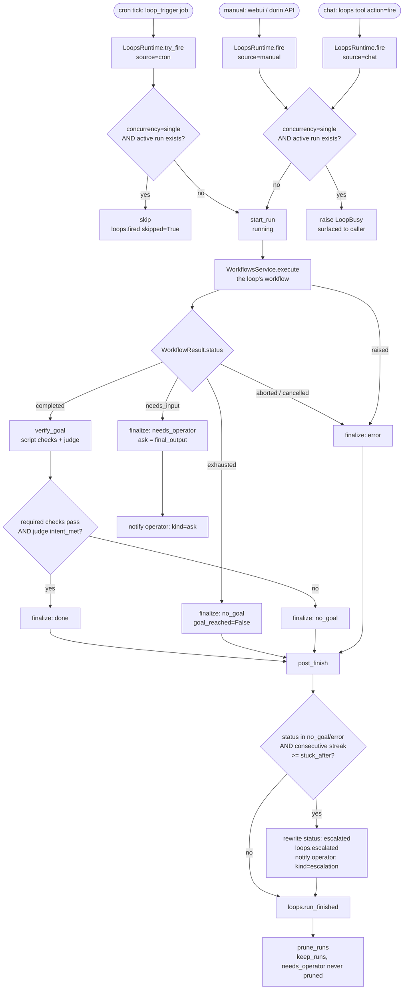

# Loops — Goal-Driven Recurring Work

## 1. Purpose

A loop wraps a **workflow** (see [workflow.md](workflow.md)) with a verifiable
goal and a trigger: fire the workflow, check whether the goal was actually
reached, and — if it wasn't, repeatedly — hand control to a human instead of
spinning forever. Where cron's `agent_turn` jobs fire a prompt and are done,
a loop's firing is interpreted: its body's terminal outcome is read, graded
against goal checks, and turned into one of a small set of loop-run statuses
that a human or the agent can act on.

A loop iterates on **new information**, not the clock: a fire always has a
concrete cause — a cron tick, a manual "run it now", or a chat request — never
a blind retry timer. The workflow supplies the actual work (steps, tools,
routing); the loop only supplies the goal, the trigger, and the
stuck/escalate contract around it.

## 2. Mental model

**Definition vs. run.** A `LoopSpec` (`durin/loops/spec.py`) is the durable
definition: which workflow it runs, its goal (an intent plus optional
checks), its triggers, its concurrency policy, and where to send an operator
when it needs one. Firing a loop produces a **run** — a JSON record
(`durin/loops/run_log.py`) tracking one execution of that definition from
`running` to a terminal status. A definition is edited rarely; runs
accumulate on every fire.

**The workflow is a black box the loop only reads the outside of.** A loop
never touches workflow-engine internals (nodes, routing, sessions) — it calls
`WorkflowsService.execute(workflow, task, resume_run_id=...)` and reads back a
typed `WorkflowResult` (`status`, `final_output`, `run_id`, `output_dir`).
Everything a loop does — deciding `done` vs `no_goal` vs `needs_operator` —
is a function of that one result plus the loop's own goal checks.

**Goal verification is evidence-first.** A goal has an `intent` (a sentence)
and optional `checks`: `script` checks are hard pass/fail shell commands
(deterministic, no LLM involved), `assertion` checks are sentences graded by
an LLM judge alongside the intent itself. A failing **required** script check
blocks `done` no matter what the judge concludes — the judge can never
override hard evidence to force a pass. The judge's own `intent_met` verdict
is a second, independent gate: a run can pass every check and still be
`no_goal` if the judge is not convinced the underlying intent was achieved.

**Runs are read, not driven.** The loop never blocks waiting on anything —
a workflow that pauses (`needs_input`) becomes a loop run parked at
`needs_operator`; a human (or the agent) answers it and the loop resumes the
same workflow run via `resume_run_id`, exactly the way a paused workflow is
normally resumed (see [workflow.md](workflow.md)). An ask tagged for the
other party in the conversation instead parks at `waiting_info` and waits on
a reply from that channel thread — see §4j — but the resume mechanics are
the same either way.

## 3. Diagram

## 4. How it works

### 4a. Storage layout

Loop definitions live one JSON file per loop under
`<workspace>/loops/<name>.json` (`durin/loops/store.py`), the same
files-are-truth model as workflows, workflows' definitions, and cron jobs.
Unlike workflow definitions, loop definitions are **not** git-versioned — a
loop is a thin binding (workflow + goal + triggers), not authored content
worth a diff history. Saves and deletes take a cross-process file lock
(`cross_process_lock`) because the webui, the `loops` agent tool, and any
future CLI surface can write concurrently; reads (`load_loop`, `list_loops`)
are lock-free and skip malformed files rather than failing a listing.

Runs live under `<workspace>/loops-runs/<loop>/<run_id>.json`
(`durin/loops/run_log.py`). Each run file has exactly one owning writer — the
`LoopsRuntime` instance that fired it — so, like workflow run manifests, a
full-file atomic rewrite needs no lock. A run's lifecycle is
`start_run` (status `running`) → zero or more `update_run` calls → one
`finalize_run` call that sets the terminal status and the goal-check
results.

### 4b. The lifecycle interpretation table

`LoopsRuntime._interpret` (`durin/loops/runtime.py`) is the sole place that
turns a workflow's terminal status into a loop-run status:

| Workflow (`WorkflowResult.status`) | Loop-run status | Notes |
|---|---|---|
| `needs_input` | `needs_operator` or `waiting_info` | The workflow's output becomes the run's `ask`. An untagged ask goes to `needs_operator` and notifies the operator (kind `ask`); a `[TO:counterpart]`-tagged ask on a run with a channel thread instead parks at `waiting_info` and is delivered to the counterpart — see §4j. |
| `completed` | `done` or `no_goal` | Goal verification runs (§4c); `done` iff the goal was reached, `no_goal` otherwise. |
| `exhausted` | `no_goal` | The node-visit budget ran out before completion; no goal verification is attempted — `goal_reached` is `False`. |
| `aborted` / `cancelled` | `error` | The workflow ended abnormally. |
| workflow execution raised | `error` | Any exception from `WorkflowsService.execute` (provider error, MCP failure, …) short-circuits straight to `error`. |
| goal verification raised | `error` | A judge/provider failure during `verify_goal` must not strand a `completed` run — it is recorded as `error`, not left `running`. |

`_post_finish` runs for the `done`, `no_goal`, and `error` outcomes: it checks
for **escalation** (§4g), emits `loops.run_finished` telemetry, prunes old
runs, and — for a `single`-concurrency loop — drains one fresh event off the
loop's queue if one is waiting (§4k). The `needs_input` → `needs_operator` /
`waiting_info` branches both return from `_interpret` before `_post_finish`
runs, so neither status emits a `loops.run_finished` event nor is pruned — a
run only reaches `_post_finish` once it is answered, the workflow is
resumed, and the result is re-interpreted to a `done`/`no_goal`/`error`
outcome.

### 4c. Goal verification

`verify_goal` (`durin/loops/checks.py`) is called once per `completed`
result, with the workflow's `final_output` as evidence and its `output_dir`
as the working directory for script checks:

1. **Script checks** run synchronously (`subprocess.run` off the event loop
   via `asyncio.to_thread`), each bounded by `loops.check_timeout_s`.
   Exit code `0` is a pass; a timeout counts as a fail with a `"timeout after
   Ns"` detail. Command output (stdout, falling back to stderr) is captured
   and truncated as the check's `detail`.
2. **Assertion checks** (plus the loop's overall `goal.intent`) are graded
   together in a single LLM judge call (`durin/loops/judge.py`): the judge
   answers `intent_met` for the run as a whole and a `true`/`false` per
   assertion text. A judge response that fails to parse as the expected JSON
   defaults to `intent_met=false` and no assertions passed — an unparseable
   verdict never accidentally passes a goal.
3. **The combination is a `required`-first AND.** Every check has a
   `required` flag (default `true`). If any required check (script or
   assertion) fails, `required_ok` is `False` regardless of the judge's
   `intent_met` — the judge can never override hard evidence to rescue a
   failing required check. The overall verdict, `reached`, is
   `required_ok AND intent_met`: the judge's own opinion of the goal is a
   second, independent bar even when every declared check passes. This is
   the "judge only gets to be stricter" rule the module's docstring states.

The per-check results (`kind`, `required`, the command/text reference,
`passed`, `detail`) are stored on the finalized run record as `checks`, so
the webui and the `loops status` tool action can show exactly which check
failed.

**`goal.checks_sufficient`** opts a loop out of the judge call entirely: when
`True`, `verify_goal` returns as soon as the script checks run, `reached` is
just `required_ok`, and the verdict's `intent_met` is `None` (the judge was
never consulted — never graded, not "graded and true"). Parsing enforces the
precondition rather than leaving it to `verify_goal` to degrade gracefully:
`checks_sufficient: true` requires every check to be a `script` (an `assertion`
always needs the judge, so the two are mutually exclusive) and at least one
`required` check (otherwise there is no hard evidence to call the goal reached
without asking the model).

### 4d. Cron integration

Cron is one of the three trigger sources (`LoopTrigger.source`: `cron`,
`channel`, or `webhook` — see §4h and §4m for the other two). A cron trigger's
`schedule`
is shaped exactly like a `CronSchedule` (`kind: at | every | cron`, plus the
matching fields), so the same schedule vocabulary cron jobs use applies to
loop triggers.

`durin/loops/cron_sync.py` keeps cron jobs in sync with a loop's stored
triggers:

- **`sync_loop_jobs(cron_service, spec)`** — called on every loop save —
  computes the set of cron jobs the definition currently wants (one per
  enabled trigger, id `loop:<name>:<index>`, `CronPayload(kind="loop_trigger",
  loop=<name>)`), removes any existing `loop:<name>:*` job no longer wanted,
  and registers the wanted ones via `cron_service.register_system_job` — the
  same idempotent-on-restart path the `memory_dream` system job uses, which
  preserves a job's run history and elapsed interval progress across a
  gateway restart rather than resetting it. A disabled loop (`enabled:
  false`) wants zero jobs, so saving one removes all of its triggers' jobs.
- **`remove_loop_jobs(cron_service, loop_name)`** — called on loop delete —
  removes every `loop:<name>:*` job outright.
- **`sync_all(cron_service, workspace)`** — called once at gateway startup —
  is the self-healing pass: it re-syncs every loop currently on disk (so a
  definition edited while the gateway was down is picked up), then removes
  any `loop:*` cron job whose loop file no longer exists (so a loop deleted
  by hand, or lost to a corrupted/removed file, doesn't leave an orphaned
  cron job firing into nothing). It only ever touches jobs with the `loop:`
  id prefix — other system jobs are untouched.

Because `loop_trigger` jobs use `payload.kind == "loop_trigger"` rather than
`"system_event"`, they are **not** protected the way `memory_dream` is: a
plain `cron_service.remove_job(job_id)` deletes one, no bypass needed.

On the firing side, the gateway's cron `on_job` handler special-cases
`payload.kind == "loop_trigger"`: instead of building a cron agent-turn
prompt and dispatching it through the agent loop, it calls
`loops_runtime.try_fire(job.payload.loop, source="cron")` directly and
returns — a loop trigger never goes through `build_cron_turn_prompt` or
channel delivery; all of that is the loop runtime's own concern.

### 4e. Concurrency semantics

A loop's `concurrency` field (`"single"`, the default, or `"parallel"`)
governs what happens when a trigger fires while a run is already active
(`running` or `needs_operator`):

- **`single`** — a cron-sourced fire (`try_fire`) **skips silently**: no run
  is started, and `loops.fired` is emitted with `skipped=True` so the skip is
  still observable in telemetry. A manual or chat-sourced fire (`fire`)
  instead **raises `LoopBusy`**, surfaced to the caller as an error (the
  webui's fire call gets a validation error; the `loops` tool returns
  `"Loop '<name>' is busy: …"`) — an explicit request to run gets an
  explicit refusal rather than being dropped quietly.
- **`parallel`** — no active-run check at all; multiple runs of the same
  loop can be in flight simultaneously (useful for a loop whose triggers
  are independent of each other, e.g. per-item checks that shouldn't queue
  behind one another).

### 4f. Operator contact

A `LoopSpec` optionally carries `operator_channel` and `operator_to` — a
channel name and recipient (chat id / user id) to notify when the loop needs
a human. `LoopsRuntime` calls an injected `on_operator_ask(loop, run_id,
kind, text)` callback for two situations: `kind="ask"` when a run parks at
`needs_operator`, and `kind="escalation"` when a run is escalated (§4g /
below). The callback is best-effort — any exception it raises is swallowed,
so a broken notification channel can never strand a run in an inconsistent
state.

The production wiring (in the gateway's startup path) resolves the loop's
`operator_channel`/`operator_to` and delivers the text as an
`OutboundMessage` on that channel; a loop with no `operator_channel`
configured simply receives no push notification. A `waiting_info` ask is
delivered separately, through its own injected `on_counterpart_ask(loop,
run_id, origin, text)` callback — best-effort in the same way — which sends
the question back into the originating channel thread (§4j) rather than to
`operator_channel`; the operator's own contact settings are unrelated to
that delivery. Either way, every
`needs_operator` (and any other) run is still visible and answerable without
a configured channel: the webui's Activity view and the `loops` tool's
`status`/`list` actions read the run log directly, independent of the notify
path.

### 4g. Escalation

`_post_finish` runs after every run finalized to `done`, `no_goal`, or
`error` — a `needs_operator` run skips it entirely (§4b). If the
just-finalized status is `no_goal` or `error`, it counts the loop's
**consecutive** `no_goal`/`error`
runs (`run_log.consecutive_no_goal`, most-recent-first, stopping at the first
run that is neither `no_goal` nor `error` nor still active). Once that streak
reaches the loop's `stuck_after` (default `3`), the just-finalized run's
status is rewritten to `escalated`, `loops.escalated` telemetry is emitted,
and the operator is notified (`kind="escalation"`) — the loop keeps
retrying on its own triggers, but a human now knows it isn't converging.

### 4h. Channel triggers, the adapter layer, and the inbound matcher

Besides `cron`, a `LoopTrigger` can have `source: "channel"`, with
`channel` one of `email`, `telegram`, `slack`, `discord`, or `whatsapp`. A
channel trigger is matched against every inbound message on that channel by
`TriggerMatcher.handle_inbound` (`durin/loops/matcher.py`), which is
installed as a bus inbound interceptor (§4i) rather than polled or
scheduled: routing happens the moment a message arrives.

**The adapter layer.** `durin/loops/channel_meta.py` isolates the matcher
from each channel's own metadata shape. `extract(msg)` turns a bus
`InboundMessage` into a channel-neutral `InboundFacts` (`sender`, `text`,
`title` — the email subject, `None` on every chat channel, `thread_key`, and
a raw `reply` dict carrying whatever channel-specific pieces `build_reply`
will need later, e.g. Slack's `thread_ts` or Telegram's `message_id`); a
channel `extract` doesn't recognize (`cli`, `websocket`, `cron`, …) returns `None`
and the message passes through untouched, never reaching the matcher at all.
`build_reply(origin, text)` is the inverse: given a captured reply origin
(built by `_dispatch_match`, stored on the run, and threaded through the
counterpart lane, §4j) it builds the `OutboundMessage` for that channel's
own reply contract — raising `ValueError` for a channel with no known reply
contract, a case the caller guards against.

**Per-channel thread-key semantics.** `thread_key` is the correlation key a
plain (non-`correlate`) claim wakes on — see the table below for the exact
format each channel produces, straight out of `channel_meta.extract`:

| Channel | `thread_key` when set | `thread_key` is `None` when |
|---|---|---|
| `email` | the thread digest itself, e.g. `a1b2c3d4e5f6a7b8` — no channel prefix (see "email bare-digest compat" below) | the message carries no thread metadata |
| `slack` | `slack:<chat_id>:<thread_ts>` | the message has no `thread_ts` (not a threaded reply) |
| `telegram` | `telegram:<chat_id>:topic:<message_thread_id>` for a forum-topic message, else `telegram:dm:<chat_id>` for a DM | a group message with no `message_thread_id` (non-forum groups, and a forum group's General topic) |
| `discord` | `discord:thread:<chat_id>` inside a thread, else `discord:dm:<chat_id>` for a DM | a plain (non-thread) channel message |
| `whatsapp` | `whatsapp:dm:<chat_id>` for a DM | the message is a group message (`is_group`) |

**Email bare-digest compat.** Every non-email channel's key is prefixed with
its channel name (`slack:…`, `telegram:…`, `discord:…`, `whatsapp:…`) so keys
from different channels can never collide. Email is the one exception: its
key is the bare thread digest (`durin.channels.email_threads.thread_digest`,
16 hex chars) with no `email:` prefix, matching the key shape email-triggered
loops have always used — changing it would silently orphan every claim
registered by a pre-`channel_meta` deployment.

**Claim-key prefixes.** A `correlate`-derived claim key (below) is always
`custom:<loop-name>:<captured-group>`, regardless of channel or trigger
source — the `custom:` prefix can never collide with a plain `thread_key`,
since none of the per-channel formats above start with it.

**Filter keys per source.** A channel trigger's `filters` accepts
`from_contains` / `sender_contains` (aliases — both test `facts.sender`,
case-insensitive substring), `subject_contains` (tests `facts.title`; always
false on a chat channel, since only email ever sets a title), and
`text_contains` (tests `facts.text`). Any, all, or none may be set, and they
apply identically regardless of which channel the trigger names — there is
no per-channel filter vocabulary. A `webhook` trigger has no `filters` field
at all (rejected at parse time, §4m) — its only structural narrowing is the
`hook` name itself plus an optional `correlate`/`semantic`.

**Correlate: custom correlation keys.** A trigger's optional `correlate`
field is a regex, validated at parse time (`spec._parse_correlate`) to
compile and have **exactly one capture group** — anything else is a
`LoopError` at save time, not a silent no-op at match time. When set, the
matcher derives a custom claim key before ever looking at the plain
`thread_key`: `_correlate_key` searches the title plus the first **2000
characters** of the message text (the cap keeps an arbitrarily long body
from inflating match cost), and on a match returns `custom:<loop>:<captured-group>`
(e.g. a loop matching `TICKET-(\d+)` against a message mentioning
`TICKET-42` derives `custom:my-loop:42`). This lets an operator-defined
correlation id — a ticket number mentioned anywhere in the text — reunite
replies that land in unrelated threads (different email threads, different
Slack channels, a webhook payload with no channel thread at all), instead of
being confined to whatever thread the first message happened to arrive on.

Each message is resolved through a fixed decision order:

1. **Claim wake — custom keys before the plain thread key.** For every
   enabled loop's channel trigger matching this message's channel that
   declares a `correlate` pattern, its derived custom key is tried first,
   in loop-`name` order; only if none of those wake a claim does the matcher
   fall back to the message's plain `thread_key`. This precedence means a
   loop using `correlate` is never accidentally woken by an unrelated
   thread-only match, and a thread-scoped reply still wakes a loop that
   never set `correlate`. If the resolved key has a registered claim (§4j)
   pointing at a run currently in `waiting_info`, the message is handed
   straight to that run as its answer — no loop or trigger is evaluated at
   all for that message — except the claim-holder loop's own channel
   trigger `match` policy, which the matcher checks first: a loop declaring
   `match: "always_new"` does not want thread replies resuming its parked
   runs, so the wake is skipped (the claim is left in place) and the message
   falls through to step 2 instead; a missing loop spec or trigger defaults
   to waking. A claim whose run has moved past `waiting_info` (or vanished)
   is stale and is released instead of acted on. **A trigger's `semantic`
   condition is never evaluated during claim wake** — it gates whether a
   *new* run opens in step 2, not whether an already-waiting run may resume;
   a claim that exists means a run is genuinely waiting, and any message
   correlating to it wakes it regardless of what `semantic` would have said.
2. **Trigger match.** Absent a claim wake, every *enabled* loop is checked in
   ascending `name` order, and the first one whose channel trigger fully
   matches wins — deterministic, first-match-wins. A trigger match is two
   gates in sequence: **structural filters** first (the per-source keys
   above), and only if those pass, an **optional semantic condition** — a
   sentence graded by an LLM call against a short summary of the message
   (sender, subject, and the start of the body), using the `loops` aux-model
   purpose (§6). A semantic condition with no judge configured, or whose
   judge call raises, is treated as a non-match rather than blocking the
   message: a broken judge fails closed for that trigger, not open. The
   matched trigger's own `correlate` (if any) is re-derived here and, when
   present, becomes the new run's origin thread in place of the plain
   `thread_key` — see step 3.
3. **Concurrency action.** A trigger match then resolves to fire, queue, or
   pass through, the same concurrency logic as a manual/chat fire (§4e): a
   `parallel` loop always starts a new run; a `single` loop fires only if no
   run is currently active, otherwise the event is pushed onto that loop's
   event queue (§4k) if one is wired, or — with no queue wired — the match is
   logged and the message falls through to a normal agent turn rather than
   being silently dropped.

Firing and answering both run as background tasks (`asyncio.create_task`):
the matcher's return value reflects only the routing decision, not the
eventual run outcome, so a slow workflow run never blocks bus dispatch. A
`pending_fires` set closes the race window this creates for a `single`
loop — two messages landing back-to-back would otherwise both see "no active
run" and both decide to fire before the first fire's own manifest write
lands; a loop name is added to the set the instant a fire is scheduled and
removed once that task finishes, so the second message's concurrency check
sees it as busy.

### 4i. The bus interceptor seam

`MessageBus.add_inbound_interceptor` (`durin/bus/queue.py`) registers a
handler run on every inbound message that has already passed the bus's
inbound authorizer — the channel-level allow/deny and pairing gate — but
before the message is enqueued for the normal agent turn. The matcher's
`handle_inbound` is registered here. An interceptor returning a truthy value
has **consumed** the message: it is not enqueued, and no later interceptor
runs. An interceptor that raises is treated as a pass-through, not a drop —
the exception is logged and the message still reaches the normal inbound
queue, so a bug in loop routing degrades to "the agent handles the message
directly" rather than losing it. Because the authorizer runs first, every
message a channel trigger ever sees has already cleared that channel's own
sender allowlist and pairing gate — a loop cannot be triggered by a sender
the channel itself would reject; an unpaired sender gets a pairing reply
(or is silently denied for a group message) and never reaches the matcher
at all.

### 4j. Claims index and the counterpart lane

Some workflow asks are meant for the other party in the conversation, not
the operator. A workflow's `needs_input` text that starts with the literal
tag `[TO:counterpart]` (case-sensitive, stripped before display) is that
signal (`durin/loops/runtime.py`). When such an ask fires on a run whose
origin has a thread — e.g. the loop was triggered by an inbound email, a
Slack thread reply, or a `correlate`-matched webhook payload — the run parks
at a new status, `waiting_info`, distinct from `needs_operator`:
the loop is not stuck waiting on a human, it is waiting on a reply from
whoever it is corresponding with. Parking a run this way also **registers a
claim**: an entry in `<workspace>/loops/claims.json`
(`durin/loops/claims.py`) mapping the thread key to `{loop, run_id}`, so the
next inbound message on that thread is recognized by the matcher's claim
wake (§4h step 1) instead of being evaluated as a fresh trigger match. The
claim lookup keys on the thread alone (`durin/loops/matcher.py`'s
`_try_wake`), with no sender check: any allowlisted sender replying into a
claimed thread wakes the run — the thread is the correlation key, not the
original sender. If the run's origin has no thread to correlate against (a
cron or manual fire has no counterpart to reply to), the counterpart-bound
ask degrades to the normal `needs_operator` lane instead, with a note
appended so the question is never silently lost.

Claims are a single JSON file, atomically rewritten under a cross-process
lock so the gateway, a cron process, and any future surface can register and
release claims concurrently without colliding. The policy on a key collision
is **last claim wins**: registering a claim on a thread that already has one
for a *different* loop or run silently overwrites it, and that overwrite is
logged as a warning — a thread can only ever correlate to one waiting run at
a time.

A claim's lifecycle is **release-before-resume**: when an answer arrives
(from the matcher's claim wake, or an operator's override answer through the
same `answer` call — see below), `LoopsRuntime.answer` releases the run's
claim *before* resuming the workflow, not after. The old claim is stale the
moment the answer is in hand, and releasing first means that if the resumed
workflow immediately asks another counterpart-bound question, the fresh
claim it registers is never wiped by a trailing release from the answer that
just resolved. There is no eager sweep beyond that: a claim whose run can
no longer be answered (for example, its loop was deleted) is cleaned up
lazily — released when the next message on that thread fails to wake it, or
expired by the seven-day prune at gateway boot.

Because a claim can otherwise live forever if a counterpart never replies (a
crashed process, an abandoned thread), the gateway prunes claims older than
seven days at startup (`durin/service/wiring.py`) — a flat, conversation-scoped
constant independent of `loops.queue_ttl_s`, which bounds a different thing
(queued channel events, §4k).

**Operator override.** A `waiting_info` run is not exclusively answerable by
the counterpart: it accepts the same `answer` call (webui, API, or the
`loops` tool) as a `needs_operator` run — `LoopsRuntime.answer` treats
`needs_operator` and `waiting_info` as the same answerable state. The webui's
Activity view surfaces this as an explicit "answer as operator" toggle on a
`waiting_info` row, so a human can step in and resolve a run the counterpart
never got back to, without waiting out the claim's prune window.

`waiting_info`, like `needs_operator`, is an **active** status
(`durin/loops/run_log.py`'s `ACTIVE_STATUSES`): a run parked there emits no
`loops.run_finished` telemetry and is never pruned by `prune_runs`,
regardless of the loop's `keep_runs` setting — it only reaches `_post_finish`
(§4b/4g) once it is answered, resumed, and re-interpreted to a terminal
status.

### 4k. The per-loop event queue

When a channel trigger matches a `single`-concurrency loop that already has
an active run, the event is not dropped — it is appended to that loop's
queue file, `<workspace>/loops/queue/<loop>.jsonl`
(`durin/loops/queue.py`), one append-only file per loop, push/pop/pending all
serialized under the same per-loop cross-process lock. The queue is a
holding area, not a workflow: nothing in it is running.

Freshness (`loops.queue_ttl_s`, §6) is evaluated **at pop time**, against the
event's stamped arrival time, not baked into the event when it was queued —
a change to `queue_ttl_s` takes effect immediately for events already
sitting in the queue, and an event popped after its window has passed is
dropped rather than fired.

The queue is drained **one event per run completion**: `LoopsRuntime._post_finish`
(§4b) pops at most one fresh event for the loop that just freed its
concurrency slot and fires it in the background. If several events piled up
while the loop was busy, each subsequent run's own completion drains the
next one — the backlog empties one fire at a time, not all at once.

A drained event can still lose the fire race (another trigger or a manual
fire took the slot first): that raises `LoopBusy`, and the event is pushed
back onto the queue rather than dropped. This re-queue is a fresh `push`,
which stamps a new arrival time — the event's TTL clock restarts from the
moment it was re-queued, not from when it was first received. An event that
keeps losing the race can in principle keep resetting its own clock and
outlive what its original `queue_ttl_s` window would suggest; in practice
this only matters for a loop that is busy often enough to keep losing races
against its own queue.

### 4l. Outcome stats (the stats route)

`GET /api/v1/loops/{name}/stats` (`LoopsService.stats`, backed by `_stats` in
`durin/service/loops.py`) is computed fresh on every request from the loop's
run manifests (`run_log.list_runs`) — nothing about it is persisted or
cached; the numbers only ever reflect whatever runs are still on disk
(subject to `keep_runs` pruning, §4a/§6). Five fields carry the actual
stats:

- **`outcomes`** — the loop's terminal runs (`done`, `no_goal`, `escalated`,
  `error` — never `running`, `needs_operator`, or `waiting_info`), newest
  first, capped to the most recent 20: `{run_id, status, goal_reached,
  started_at, finished_at}` each.
- **`convergence`** — `counts["done"] / terminal`, where `terminal` is the
  total count of retained terminal runs (not just the 20 returned in
  `outcomes`). `None` when the loop has no terminal runs yet, rather than
  dividing by zero.
- **`escalation_rate`** — `counts["escalated"] / terminal`, the same
  null-safety and the same `terminal` denominator as `convergence`.
- **`counts`** — a full tally across all seven statuses (`running`,
  `needs_operator`, `waiting_info`, `done`, `no_goal`, `escalated`,
  `error`), each starting at zero.
- **`pending_events`** — the loop's current queue depth (`queue.pending`,
  §4k), the same number the Definitions list's queued-count badge shows.

`counts` walks every retained run regardless of status; `outcomes`,
`convergence`, and `escalation_rate` only ever look at the terminal subset —
a loop with many retained runs but few terminal ones shows all of them
(up to the 20 cap) in `outcomes`, and computes the two rates over that same
terminal set, not over `counts`' full total.

The webui's Activity **board** view is a presentation-only layout over the
same run feed the List view uses (`GET /api/v1/loops/runs`), not the stats
route: a run's column is derived from its own `status` (five fixed columns —
see §6), so placement is system-owned and there is no drag-and-drop. The
sidebar's Loops badge is a third, narrower read of that same feed: it counts
only `needs_operator` runs, not `waiting_info` — a run waiting on its
counterpart (§4j) is not waiting on the operator.

### 4m. Webhook trigger ingress

A `LoopTrigger` with `source: "webhook"` (`hook`, plus optional `semantic`
and `correlate`; no `filters`, `channel`, `match`, or `schedule` — rejected
at parse time, §4h) fires off an external HTTP POST instead of a channel
message or a clock tick. `POST /api/v1/hooks/{hook}` is the ingress route
(`durin/api/asgi.py`'s `hooks_handler`), registered outside the generic
`/api/v1/*` service-registry table because its authentication is different:
external webhook callers aren't a webui/CLI/API principal, so the route is
gated on a shared secret header, `X-Durin-Hook-Secret`, compared against the
one secret every hook shares (`ApiTokenStore.get_or_create_hooks_secret`,
generated once and persisted — there is no per-hook secret). A missing or
wrong header is `401`; a request body that isn't valid JSON, or is valid
JSON but not an object, is `400`; a surface with no `HookDispatcher` wired
(e.g. a non-gateway process) is `503`.

Once authenticated, the body is handed to `durin.loops.hooks.HookDispatcher`
(`durin/loops/hooks.py`), which reuses `TriggerMatcher`'s own wake and
fire/queue decision rather than reimplementing the pending-fires race guard:
it builds a synthetic `InboundMessage`/`InboundFacts` pair with
`channel="webhook"` (`sender`/`title` set to the hook name, `thread_key`
always `None` — a webhook trigger only ever correlates via `correlate`, never
a plain thread) and calls the matcher's wake, semantic-match, and
dispatch-match logic directly. The payload text used for matching, the
semantic-judge summary, and the correlate search is `payload["text"]` when
it's a non-empty string, else the whole payload compacted to JSON — either
way capped at **4000 characters**.

**Two-pass dispatch, wake before fire.** Loops are evaluated in ascending
`name` order in each pass — first-match-alphabetical, same as the channel
matcher:

1. **Wake pass.** Every enabled loop's webhook trigger for this hook that
   declares a `correlate` is tried, purely structurally: `semantic` is never
   evaluated here, the same "semantic gates fires, never wakes" rule §4h
   describes for channel triggers — a claim already existing means a run is
   genuinely waiting, and `semantic` only gates whether a *new* run should
   open. `match: "always_new"` has no webhook equivalent (the field doesn't
   exist on a webhook trigger), so a webhook-origin message always wakes a
   matching claim when one exists.
2. **Fire pass.** Only if nothing woke, every enabled loop's webhook trigger
   for this hook is tried in order; `semantic` (fail-closed when unconfigured
   or erroring, same as channel triggers) gates entry, then the same
   fire/queue/pass-through concurrency decision as §4h step 3 runs, with the
   trigger's `correlate` (if any) becoming the new run's origin thread.

The response body reports the outcome, `202` on any of the three ways a
webhook POST is consumed:

| `result` | Meaning | HTTP status |
|---|---|---|
| `fired` | A new run was started; `loop` names it. | `202` |
| `queued` | A `single`-concurrency loop matched while already busy; the event was pushed onto its queue (§4k). | `202` |
| `woken` | A correlate-derived key matched a claim on a `waiting_info` run; `loop` and `run_id` identify it. | `202` |
| `no_match` | No enabled loop's webhook trigger matches this hook, or the one that structurally matches is busy with no queue wired (the same `passed_busy` outcome §4h describes, reported identically to no-match rather than as a fifth value). | `404` |

**A `[TO:counterpart]`-tagged ask on a webhook-origin run degrades quietly.**
`channel_meta.build_reply` has no webhook case — there is no address to POST
a reply to — so the production wiring (`durin/cli/commands.py`'s
`on_counterpart_ask` callback) special-cases `origin["channel"] ==
"webhook"` and skips calling it entirely rather than letting the `ValueError`
propagate: the run still parks at `waiting_info` and a claim is still
registered against its `correlate` key exactly as §4j describes, but no
outbound message is sent anywhere. The question is visible in the run's
Activity feed row like any other, and the counterpart "replies" the only way
a webhook counterpart can: another `POST` to the same hook whose payload
correlates to the same key, which the wake pass above resolves as `woken`.

### 4n. The hooks-secret route

`GET /api/v1/loops/hooks-secret` (`LoopsService.hooks_secret`,
`durin/service/loops.py`) is how an operator retrieves the shared ingress
secret to configure an external webhook sender — it returns `{secret,
path_template: "/api/v1/hooks/{hook}"}`, the caller substitutes the actual
hook name into the template. It requires `Scope.LOOPS_WRITE`, not the read
scope a `GET` would normally carry: exposing the credential that lets anyone
fire loops is a more sensitive read than a normal listing. The service is
constructed with the secret getter only on surfaces that have one (the
gateway); elsewhere the route raises `UnavailableError`.

## 5. Key types & entry points

| Symbol | File | Role |
|---|---|---|
| `LoopSpec`, `GoalCheck`, `LoopTrigger`, `parse_loop`, `loop_to_dict` | `durin/loops/spec.py` | The loop definition schema, its JSON parser/validator, and the round-trip serializer. |
| `load_loop`, `list_loops`, `save_loop`, `delete_loop`, `loops_dir` | `durin/loops/store.py` | Definition persistence: one JSON file per loop, cross-process locked on write. |
| `start_run`, `update_run`, `finalize_run`, `read_run`, `list_runs`, `list_all_runs`, `active_runs`, `consecutive_no_goal`, `prune_runs` | `durin/loops/run_log.py` | The per-run manifest: lifecycle writes, active/streak queries, and retention. |
| `verify_goal`, `GoalVerdict` | `durin/loops/checks.py` | Goal verification: script checks (hard evidence) plus an LLM judge (intent + assertions), combined required-first. |
| `build_prompt`, `parse_verdict` | `durin/loops/judge.py` | The judge prompt template and its strict-JSON verdict parser. |
| `LoopsRuntime`, `LoopBusy` | `durin/loops/runtime.py` | The lifecycle interpreter: fires a loop's workflow, reads the terminal status, verifies the goal, decides the loop-run status, and drives escalation. |
| `sync_loop_jobs`, `remove_loop_jobs`, `sync_all`, `loop_job_id` | `durin/loops/cron_sync.py` | Keeps `loop:<name>:<idx>` cron jobs in sync with stored loop definitions; the boot-time self-healing pass. |
| `LoopsService` | `durin/service/loops.py` | The HTTP surface: list/get/save/delete definitions, fire a run, answer a run awaiting an operator or a counterpart, read run feeds. |
| `LoopsTool` | `durin/agent/tools/loops.py` | The `loops` LLM tool (core scope): the same operations as `LoopsService`, available in chat when a live `LoopsRuntime` is wired onto `ToolContext`. |
| `TriggerMatcher` | `durin/loops/matcher.py` | Routes an inbound channel message to a claim wake, a fired/queued trigger match, or a pass-through to the normal agent turn; installed as a bus inbound interceptor. |
| `InboundFacts`, `extract`, `build_reply` | `durin/loops/channel_meta.py` | The per-channel adapter: turns an inbound bus message into channel-neutral facts the matcher can match/wake on, and turns a captured reply origin back into an outbound message. |
| `HookDispatcher` | `durin/loops/hooks.py` | Matches a `POST /api/v1/hooks/{hook}` payload against enabled loops' webhook triggers, reusing `TriggerMatcher`'s wake and fire/queue decision. |
| `register`, `release`, `release_run`, `lookup`, `prune` | `durin/loops/claims.py` | The thread-to-waiting-run index backing the counterpart lane: one JSON file, cross-process locked. |
| `push`, `pop_fresh`, `pending` | `durin/loops/queue.py` | The per-loop event queue for a `single`-concurrency loop's channel triggers: one JSONL file per loop, TTL evaluated at pop time. |

## 6. Configuration & surfaces

- **Definitions** live as JSON under `<workspace>/loops/<name>.json` (not
  git-versioned — see §4a).
- **Engine settings:** `loops.keep_runs` (default `20`) bounds how many
  finalized run records are kept per loop — pruning is best-effort and a
  `needs_operator` or `waiting_info` run is never pruned, since both are
  actionable pause points exactly like a workflow run stuck on
  `needs_input`. `loops.check_timeout_s` (default `60`, range `1`–`3600`)
  bounds how long a single script goal check may run before it counts as a
  failure. `loops.queue_ttl_s` (default `3600`, minimum `60`) bounds how long
  a channel-triggered event sits in a busy loop's queue (§4k) before the
  drain hook drops it unfired. All three live under `DurinConfig.loops`
  (`LoopsConfig`, `durin/config/schema.py`).
- **Aux model:** `agents.aux_models.loops` (`AuxModelConfig`, under
  `AuxModelsConfig`, `durin/config/schema.py`) picks the model used for
  goal-judge calls (§4c) and both channel and webhook triggers'
  semantic-condition calls (§4h, §4m — the same `TriggerMatcher._semantic_match`
  serves both). It is the one aux purpose that does not fall back to a
  separately resolved default preset when unset — those calls simply ride
  whatever model the agent is already configured with.
- **Service:** `LoopsService` (`durin/service/loops.py`) exposes the
  `/api/v1/loops*` routes and is registered under the `"loops"` service name
  — see the route table generated from the OpenAPI contract for the exact
  method/path/scope list. Read routes require `Scope.LOOPS_READ`; writes
  (save, delete, fire, answer) require `Scope.LOOPS_WRITE`. Firing and
  answering are only available when the service is constructed with a live
  `LoopsRuntime` (the gateway daemon); other surfaces get an
  `UnavailableError` for those two routes. The list response includes each
  loop's live counts: `active_runs`, `needs_operator`, `waiting_info`, and
  `pending_events` (the loop's queue depth, §4k). `GET
  /api/v1/loops/{name}/stats` reports outcome stats — see §4l for the exact
  field definitions. `GET /api/v1/loops/hooks-secret` (§4n) is also served
  from this registry, but the webhook ingress route itself,
  `POST /api/v1/hooks/{hook}` (§4m), is registered directly on the gateway
  ASGI app, not through the service registry — it authenticates on the
  shared secret header instead of a bearer-token principal.
- **Tool:** the `loops` LLM tool (core scope, `durin/agent/tools/loops.py`)
  — `list` / `status` / `fire` / `answer` / `enable` / `pause` / `create` —
  goes through the exact same `durin.loops.store` + `durin.loops.run_log` +
  `cron_sync` path as the webui, so a loop created or toggled from chat is
  indistinguishable from one managed through the webui. Only registered
  when the surface wires a `LoopsRuntime` onto `ToolContext.loops_runtime`.
- **Telemetry:** `loops.fired` (`loop`, `source`, `skipped`),
  `loops.run_finished` (`loop`, `run_id`, `status`, `goal_reached`),
  `loops.escalated` (`loop`, `run_id`, `consecutive_no_goal`), and
  `loops.event_matched` (`loop`, `source_channel`, `action`) — catalogued in
  `durin/telemetry/schema.py`. `action` on `loops.event_matched` is one of
  `woke` (a claim wake resumed a `waiting_info` run), `fired` (a trigger
  match started a new run), `queued` (a trigger matched a busy loop and the
  event went onto its queue), `passed_busy` (a trigger matched a busy loop
  with no queue wired, so the message fell through as a normal turn), or
  `drained` (a run finished and its loop's queue had a fresh event, fired
  next).
- **Web dashboard:** a **Loops** section with two panes — **Activity** (the
  global run feed, switchable between a **List** view — `needs_operator`
  runs surfaced first with an inline answer box, `waiting_info` runs shown
  read-only with an "answer as operator" override — and a **Board** view of
  five fixed columns, §4l; the choice persists in `localStorage`) and
  **Definitions** (create/edit/delete/run-now, with a form for triggers —
  cron, channel (any of the five supported channels, with filters, match
  policy, and optional semantic condition and correlate pattern), or webhook
  (hook name, the resulting `/api/v1/hooks/{hook}` path shown read-only,
  optional semantic condition and correlate pattern, and a per-row "show
  secret" reveal that fetches the shared ingress secret, §4n, on first use)
  — goal intent + checks, the workflow to run, concurrency, stuck threshold,
  and operator contact; a loop with events waiting in its queue shows a
  count badge, and each row shows an outcome strip sourced from §4l's stats
  route). The sidebar's **Loops** nav item carries a needs-you badge — the
  same `needs_operator` count described in §4l, polled every 30s.
  See [the user guide](../guide/loops.md) for the walkthrough.
- **Security.** A loop's workflow and checks are local, user-authored
  content — a script check runs a shell command with the same trust model as
  the workflow engine itself (see [security.md](security.md)); there is no
  additional sandboxing beyond what the workflow's own tool access already
  implies.
