# MCP Client

## 1. Purpose

durin's MCP subsystem connects to external [Model Context Protocol](https://modelcontextprotocol.io) servers, supervises their session lifecycles, wraps their tools as native durin tools available to the agent, manages server discovery and installation from a curated catalog, and enforces security and OAuth boundaries.

The problem it solves: MCP servers are external processes (or remote services) with independently managed protocols and lifetimes. Connecting to them requires transport negotiation, schema normalization, authentication, reconnect logic, and security screening — none of which belong in the agent loop itself. The MCP subsystem encapsulates all of this behind `ToolRegistry` so the agent sees MCP-provided tools exactly like built-in durin tools.

## 2. Mental model

**Long-lived supervised connections.** Each configured MCP server runs inside a dedicated `asyncio` task that owns the entire transport and session lifecycle. When a session drops, the task reconnects transparently. A per-connection circuit breaker prevents the agent from hammering a downed server. Wrappers re-resolve the live session on every call, so a reconnect in flight never strands an in-progress tool call ID.

**Discovery and install are decoupled from runtime.** Users browse a durin-owned catalog (a vendored floor JSON plus a periodically refreshed overlay) to find servers. Once a server is chosen, install converts registry metadata into a persisted `MCPServerConfig`. At the next gateway start (or immediately via the runtime control surface), the server connects and its tools register. The install step — including secret collection and OAuth capability probing — happens independently of the connection lifecycle.

**OAuth is headless.** During agent runs, durin never opens a browser. The mcp SDK's `OAuthClientProvider` handles RFC 9728 Dynamic Client Registration, PKCE, and token refresh. durin supplies `SecretsTokenStorage` to persist tokens across restarts and raises `NeedsInteractiveAuthError` when interactive sign-in is required — prompting the user to run `durin mcp login <server>` out of band.

## 3. Diagram

```mermaid
flowchart TD
    subgraph Startup
        A["config.tools.mcp_servers"] --> B["AgentLoop._connect_mcp"]
        B --> C["connect_mcp_servers"]
        C --> D["MCPServerConnection.start"]
        D --> E["run() task spawned"]
        E --> F["_serve_once\n(open transport + ClientSession)"]
        F --> G["_register_capabilities\n(list_tools/resources/prompts)"]
        G --> H["MCPToolWrapper / MCPResourceWrapper\n/ MCPPromptWrapper → ToolRegistry"]
        H --> I["_ready set\ntools available to agent"]
    end

    subgraph PerCall["Per-Tool Call"]
        J["Agent calls mcp_server_tool_name"] --> K["MCPToolWrapper.execute"]
        K --> L["MCPServerConnection.call_tool\n(breaker check → _rpc_lock → session resolve)"]
        L --> M{"transient\nerror?"}
        M -- "yes (once)" --> N["_recover_and_retry_tool\n(request reconnect, await fresh session)"]
        M -- "no" --> O["SDK ClientSession.call_tool\n(idle-timeout loop)"]
        N --> O
        O --> P["_render_tool_result\nor _ConnDown message"]
    end

    subgraph Reconnect["Reconnect & Circuit Breaker"]
        Q["_serve_once exits"] --> R{"error\ntype?"}
        R -- "auth error" --> S["fail fast\n(suggest durin mcp login)"]
        R -- "session expired\nor transient" --> T["request reconnect\n(immediate)"]
        R -- "other" --> U["backoff + retry\n(up to 5 reconnects)"]
        T --> V["run() loop → _serve_once"]
        U --> V
        W["error count >= 3"] --> X["breaker OPEN\n(60s cooldown)\n→ _ConnDown to model"]
    end

    subgraph Discovery["Discovery & Install"]
        Y["McpRegistrySearchQuery"] --> Z["mcp_catalog_store.search\n(verified tier first, then stars)"]
        Z --> AA["McpRegistryDescribeQuery\n→ adapter.describe"]
        AA --> AB["McpRegistryInstallCommand\n(env_values + auth_method)"]
        AB --> AC["collect_secret_env\n→ secret store ${secret:NAME}"]
        AC --> AD["build_server_config_from_detail\n→ MCPServerConfig persisted"]
        AD --> AE["background connect\n(next start or live runtime)"]
    end

    subgraph OAuth["OAuth Auto-Detect (headless)"]
        AF["MCPServerConfig.oauth set"] --> AG["_build_oauth_provider\n(OAuthClientProvider + SecretsTokenStorage)"]
        AG --> AH["SDK DCR flow on connect\n(RFC 9728)"]
        AH --> AI{"token\nstored?"}
        AI -- "yes" --> AJ["connect succeeds\n(SDK refreshes silently)"]
        AI -- "no" --> AK["NeedsInteractiveAuthError\n→ 'Run: durin mcp login SERVER'"]
        AK --> AL["durin mcp login\n(LoopbackCallback + browser)"]
        AL --> AM["token stored in secrets.json\n→ next connect succeeds"]
    end

    subgraph Runtime["Runtime Control"]
        AN["McpRuntime.live_status"] --> AO["RawConnState per server\n(breaker, tools, error)"]
        AN --> AP["McpService /api/v1/mcp/servers/*"]
        AP --> AQ["enable / disable / reconnect\n→ runtime.connect / disconnect"]
    end
```



## 4. How it works

### Startup connect

When `AgentLoop` initializes, it calls `_connect_mcp`, which calls `connect_mcp_servers` with all enabled entries from `config.tools.mcp_servers`. For each server, a new `MCPServerConnection` is instantiated and `start()` is called, which spawns an `asyncio` task running `run()` and waits up to 30 seconds for `_ready` to be set.

`run()` calls `_serve_once()` in a loop. `_serve_once` opens the transport (`stdio`, `sse`, or `streamableHttp` — auto-detected from `cfg.type` or inferred from the config shape), enters a `ClientSession` context, calls `session.initialize()`, registers capabilities, sets `_ready`, then parks in `_wait_for_lifecycle_event` until a shutdown or reconnect event fires. The transport and session context are entered and exited in the same task, so anyio cancel scopes created by the SDK are torn down where they were created.

After all servers have connected (or timed out), `maybe_defer_mcp_tools()` checks the aggregate schema token count. When it exceeds `tools.mcp_deferral.threshold_tokens`, the real tool definitions are hidden from the LLM and replaced by two bridge tools (`mcp_find_tools` and `mcp_invoke`). This decision is made once per process; changing the threshold requires a gateway restart.

### Capability registration

`_register_capabilities` calls `session.list_tools()`, `session.list_resources()`, and `session.list_prompts()` on the live session. Each item is wrapped in an `MCPToolWrapper`, `MCPResourceWrapper`, or `MCPPromptWrapper` and registered in the `ToolRegistry` under the name `mcp_<server>_<tool>` (sanitized: non-alphanumeric characters become underscores, runs of underscores collapsed). The `enabled_tools` allowlist filters which tools are registered; `["*"]` (the default) registers all.

Input schemas are normalized for model API compatibility: array `type` fields with `null` members become nullable scalars; `anyOf`/`oneOf` patterns with a null branch are unwrapped; `$defs` rewrites `definitions` references. Output schema validation is disabled wholesale — durin passes `structuredContent` to the model as a JSON appendix and never validates its shape.

When a `ToolListChangedNotification` arrives, `_schedule_refresh` queues a fresh `list_tools` under `_rpc_lock` and updates the registry incrementally (deregisters stale names, adds new ones).

### Per-tool execution

When the agent calls a registered MCP tool, `MCPToolWrapper.execute` passes the call to `MCPServerConnection.call_tool`. The call flow is:

1. **Breaker precheck.** If the breaker is `OPEN`, a `_ConnDown` sentinel is returned immediately with an explicit guidance message and cooldown estimate.
2. **Session resolve.** `_resolve_session()` returns the current live session. If `None`, the error count is bumped and a `_ConnDown` is returned.
3. **RPC lock.** `_rpc_lock` serializes concurrent calls on the same connection (preventing interleaved MCP request IDs).
4. **SDK call with idle timeout.** `_raw_call_tool` wraps `session.call_tool` in an idle-timeout loop: the timeout resets on each progress callback; if no progress arrives within `tool_timeout` seconds, the call is cancelled.
5. **Transient retry.** On `ClosedResourceError`, `BrokenPipeError`, session-expired markers, and similar transient errors, `_recover_and_retry_tool` requests a reconnect, waits up to 15 seconds for a fresh session (identity-based: waits for `session` to become a new non-None object), and retries once.
6. **Auth errors.** A 401 or `OAuthFlowError` on a tool call is not retried; a `_ConnDown` asking the user to re-authenticate is returned immediately.

The wrapper converts a `_ConnDown` sentinel to its `.message` string, renders `isError` results as `(MCP tool error) ...`, and renders successful `CallToolResult` content — text, images, audio, embedded resources, resource links — into a string or list of content blocks.

### Reconnect and circuit breaker

`run()` is an infinite loop over `_serve_once()`. Exceptions from `_serve_once` trigger backoff and retry:

- **Initial connect failures** (before `_ready` is set): up to 3 retries with exponential backoff (starting at 1 second, capped at 60 seconds). Auth errors at initial connect fail immediately without retry.
- **Post-connect drops**: up to 5 reconnect attempts.
- **Session-expired markers** (substring matches on `closedresourceerror`, `broken pipe`, `end of file`, etc.): trigger an immediate reconnect request via `_request_reconnect`, bypassing error count thresholds.

The per-connection circuit breaker counts consecutive errors. At 3 errors, the breaker opens for a 60-second cooldown. While open, all tool calls return a `_ConnDown` message without touching the server. A successful call resets the counter. The breaker is per-connection — one failing server does not affect others.

Idle keepalive: every `keepalive_interval` seconds (default 180), `_wait_for_lifecycle_event` pings the server — `list_tools` for servers that advertise tools, `send_ping` otherwise. A failed keepalive sets `_reconnect_event`, which triggers a reconnect on the next `run()` cycle.

### Discovery and install

The durin-owned catalog lives in `durin/agent/data/mcp_catalog.json` (the vendored floor). A periodically refreshed overlay (`mcp_catalog_cache.json`) replaces the floor when its `generated_at` timestamp is newer. `mcp_catalog_store.search` queries the active list with substring and fuzzy (SequenceMatcher ratio > 0.8) matching against name, owner, description, and topics. Results are ranked with verified (GitHub-curated) tier first, then by stars descending within each tier.

For install, `McpRegistryDescribeQuery` retrieves full `McpServerDetail` from a registry adapter. `build_server_config_from_detail` selects a local package (stdio via npx/uvx/docker) or a remote endpoint, pins the package version, and builds an `MCPServerConfig`. Secret environment variables are stored in durin's secret store under `${secret:NAME}` references — resolved to plaintext at spawn time, never persisted in config. For remote servers with no declared auth header, `autodetect_oauth` probes the endpoint with an unauthenticated MCP `initialize` request; a `401 Bearer` response sets `oauth=True` on the config so the SDK's sign-in flow takes over.

### OAuth flow

The `OAuthClientProvider` is built once per `MCPServerConnection` in `__init__`, so DCR state and refresh tokens persist across reconnects within the same process lifetime. `SecretsTokenStorage` backs the SDK's `TokenStorage` protocol: tokens and client registration are serialized as JSON into durin's secret store, keyed by a per-server hash of `(server_name, server_url)`.

In agent runs (`headless=True`), the redirect handler raises `NeedsInteractiveAuthError` the moment the SDK would open a browser — surfacing the `durin mcp login <server>` instruction to the user. The `durin mcp login` command spins up a `LoopbackCallback` server on localhost, builds an interactive provider, opens the authorization URL in a browser, and waits for the OAuth code. On success, tokens are stored and the next connection attempt succeeds without any user interaction.

### Security

**Injection scan.** Before registering any tool, resource, or prompt, `_scan_metadata` calls `mcp_security.scan_injection` on the name and description fields. The scan looks for structural markers only: forged role delimiters (`system:`, `<|im_start|>`), runnable tool-call fences (`` ```tool_call ``), base64 blobs of 200 or more contiguous characters, and data URIs. Findings are logged as warnings; tools are registered regardless — the scan is advisory, not a block.

**Spawn command screening.** Before opening a stdio transport, `_enforce_spawn_policy` calls `scan_spawn_command`. If the command is a shell interpreter (bash, powershell, etc.) and its inline arguments carry network-egress tools (curl, wget, nc, etc.), codes are returned. Under `spawn_egress_policy='refuse'`, the spawn is blocked with a `PermissionError`. Under the default `'warn'`, it logs and proceeds.

**Malware check.** For stdio servers launched via `npx`, `uvx`, or similar package runners, `check_package_for_malware` queries the OSV API for `MAL-*` advisories against the package name and ecosystem. Any `MAL-*` hit blocks the spawn. The check fails open on network errors — only confirmed malware blocks.

**SSRF guard.** HTTP transports are built through `ssrf_safe_async_client` unless `allow_private_url=True`. The client resolves and validates every request and redirect hop against blocked private, loopback, link-local, and metadata IP ranges, pinning the connection to the validated IP to prevent DNS rebinding. `tools.ssrf_whitelist` lists CIDR ranges globally exempt from the block (for use cases like Tailscale).

### Server-to-client capabilities

MCP servers can request sampling (asking durin's LLM to generate text), declare roots (the workspace directory), and emit log messages. These are wired via callbacks in `_session_kwargs`:

- **Roots.** `_make_list_roots_callback` returns a `ListRootsResult` containing the workspace directory URI, letting servers scope their file operations.
- **Logging.** `_make_logging_callback` maps RFC-5424 log levels to loguru levels and emits server log lines tagged with the server name.
- **Sampling.** Enabled only when `MCPServerConfig.sampling.enabled=True`. `SamplingRunner` mediates sampling requests: it enforces an RPM cap (`RpmLimiter`), translates MCP message shapes to OpenAI format, invokes durin's LLM provider under governance limits (`max_tokens_cap`, `allowed_models`, `max_tool_rounds`), and converts the response back to a `CreateMessageResult`.

## 5. Key types and entry points

| Symbol | File | Role |
|---|---|---|
| `MCPServerConnection` | `durin/agent/tools/mcp_connection.py` | Supervises one MCP server's session lifecycle in a dedicated asyncio task; owns reconnect/backoff, circuit breaker, keepalive, capability registration, and OAuth provider state. |
| `MCPToolWrapper` / `MCPResourceWrapper` / `MCPPromptWrapper` | `durin/agent/tools/mcp.py` | Wraps a single MCP tool/resource/prompt as a native durin `Tool`; normalizes schema for model API compatibility, calls the connection, renders results. |
| `BreakerState` | `durin/agent/tools/mcp_connection.py` | Enum: `CLOSED`, `OPEN`, `HALF_OPEN`. Breaker opens at 3 consecutive errors, cools down after 60 seconds. |
| `_ConnDown` | `durin/agent/tools/mcp_connection.py` | Sentinel returned when a call cannot be serviced (breaker open, not connected, auth required). Its `.message` is the model-facing text. |
| `McpRuntime` | `durin/agent/mcp_runtime.py` | Thin read-only handle passed to the service layer; snapshots live per-server status (`RawConnState`) and drives runtime connect/disconnect via the agent loop. |
| `RawConnState` | `durin/agent/mcp_runtime.py` | Snapshot of one connection: `breaker_state`, `error`, list of `(tool_name, description)` tuples. |
| `MCPServerConfig` | `durin/config/schema.py` | Full server config dataclass: transport, command/url, timeouts, OAuth, spawn egress policy, sampling governance, version pin, registry ref. |
| `MCPSamplingConfig` | `durin/config/schema.py` | Per-server sampling governance: `enabled` (default `False`), `max_tokens_cap`, `requests_per_minute`, `allowed_models`, `allow_tools`, `max_tool_rounds`. |
| `mcp_catalog_store` (module) | `durin/agent/mcp_catalog_store.py` | Loads vendored floor + optional cache overlay; searches by substring and fuzzy matching; ranks verified tier first then by stars. |
| `McpServerHit` / `McpServerDetail` | `durin/agent/mcp_registry.py` | Search result and full install metadata. `McpServerDetail` carries `PackageSpec` (stdio launchers) and `RemoteSpec` (HTTP endpoints). |
| `McpRegistry` (Protocol) | `durin/agent/mcp_registry.py` | Adapter contract: `search(query, limit)` and `describe(ref)`. Implemented by `OfficialMcpRegistry` (queries GitHub catalog). |
| `mcp_install` (module) | `durin/agent/mcp_install.py` | Converts `McpServerDetail` to `MCPServerConfig`; detects runtimes (npx/uvx/docker), pins versions, collects secrets, probes OAuth capability. |
| `SecretsTokenStorage` | `durin/agent/tools/mcp_oauth.py` | Implements the SDK's `TokenStorage` protocol; persists OAuth tokens and DCR client registration in durin's secret store, keyed per server + URL hash. |
| `NeedsInteractiveAuthError` | `durin/agent/tools/mcp_oauth.py` | Raised by the headless redirect handler when agent-run OAuth would require a browser; carries the `durin mcp login` instruction. |
| `LoopbackCallback` | `durin/agent/tools/mcp_oauth.py` | Localhost HTTP server for interactive `durin mcp login`; binds on 127.0.0.1 (and ::1), verifies the CSRF state via the SDK, resolves `(code, state)`. |
| `mcp_security` (module) | `durin/agent/tools/mcp_security.py` | Structural injection scanner (`scan_injection`), spawn command analyzer (`scan_spawn_command`), and OSV malware checker (`check_package_for_malware`). |
| `SamplingRunner` / `SamplingGovernance` | `durin/agent/tools/mcp_sampling.py` | Mediates server-initiated sampling requests; enforces RPM limits, model allow-lists, token caps, and tool-round limits. |
| `McpService` | `durin/service/mcp.py` | Service layer: CRUD for server config, live status overlay, registry search/describe/install, OAuth login/logout, update check. Exposes `/api/v1/mcp/*` routes. |

## 6. Configuration and surfaces

### Top-level config keys

| Key | Type | Default | Description |
|---|---|---|---|
| `tools.mcp_servers` | `dict[str, MCPServerConfig]` | `{}` | Configured servers; keyed by server name |
| `tools.mcp_deferral.enabled` | `bool` | `True` | Gate for tool deferral behind bridge tools |
| `tools.mcp_deferral.threshold_tokens` | `int` | `20000` | Hide MCP tool definitions when aggregate schema exceeds this; 0 disables |
| `tools.ssrf_whitelist` | `list[str]` | `[]` | CIDR ranges exempt from SSRF blocking (e.g. `["100.64.0.0/10"]` for Tailscale) |

### MCPServerConfig fields

| Field | Type | Default | Description |
|---|---|---|---|
| `enabled` | `bool` | `True` | Server-level on/off; disabled servers skip startup connect |
| `type` | `"stdio" \| "sse" \| "streamableHttp" \| None` | `None` | Transport; auto-detected if omitted (stdio when `command` set; HTTP otherwise) |
| `command` / `args` / `env` | `str / list / dict` | — | Stdio launch spec; `env` values may contain `${secret:NAME}` refs resolved at spawn |
| `url` / `headers` | `str / dict` | — | HTTP/SSE endpoint; `headers` values may contain secret refs |
| `tool_timeout` | `int` | `30` | Per-call idle timeout in seconds |
| `tool_timeouts` | `dict[str, int]` | `{}` | Per-tool override; keyed by raw MCP tool name |
| `catalog_timeout` | `float` | `1.5` | `tools/list` timeout at connect; prevents a hung server from stalling startup |
| `keepalive_interval` | `float` | `180.0` | Seconds between idle keepalive heartbeats |
| `enabled_tools` | `list[str]` | `["*"]` | Tool allowlist; accepts raw MCP names or `mcp_<server>_<tool>` wrapped names; `["*"]` = all |
| `oauth` | `bool \| MCPOAuthConfig \| None` | `None` | Mark server as OAuth-requiring; `True` = DCR defaults |
| `allow_private_url` | `bool` | `False` | Opt this server out of the SSRF private-IP block |
| `spawn_egress_policy` | `"warn" \| "refuse" \| "off"` | `"warn"` | Action when a stdio spawn command matches shell-interpreter + network-egress shape |
| `malware_check` | `bool` | `True` | Query OSV for `MAL-*` advisories before spawning; fail-open on network error |
| `sampling` | `MCPSamplingConfig` | (off) | Governance for server-initiated sampling requests; `enabled=False` by default |
| `version` / `source_ref` | `str` | `""` | Pinned version and registry ref; drives the update check |

### CLI verbs

```
durin mcp list                   # list configured servers with live status
durin mcp search <query>         # search the catalog
durin mcp install <ref>          # install from the catalog
durin mcp login <server>         # interactive OAuth sign-in (opens browser)
durin mcp logout <server>        # clear stored OAuth tokens
```

### Service API routes

All routes are under the gateway's service port:

| Method | Path | Description |
|---|---|---|
| `GET` | `/api/v1/mcp/servers` | List all configured servers with live status |
| `GET` | `/api/v1/mcp/servers/{name}` | Detail: config, status, registered tools |
| `POST` | `/api/v1/mcp/servers` | Add a server |
| `PATCH` | `/api/v1/mcp/servers/{name}` | Replace a server's config |
| `DELETE` | `/api/v1/mcp/servers/{name}` | Remove a server |
| `POST` | `/api/v1/mcp/servers/{name}/enable` | Enable and connect |
| `POST` | `/api/v1/mcp/servers/{name}/disable` | Disable and disconnect |
| `POST` | `/api/v1/mcp/servers/{name}/reconnect` | Reconnect (apply config changes or retry) |
| `POST` | `/api/v1/mcp/servers/{name}/oauth/login` | Start interactive OAuth; returns authorization URL |
| `POST` | `/api/v1/mcp/servers/{name}/oauth/logout` | Clear stored OAuth tokens |
| `POST` | `/api/v1/mcp/servers/{name}/registry-update` | Re-pin to registry's latest version |
| `GET` | `/api/v1/mcp/registry/search` | Search the catalog |
| `GET` | `/api/v1/mcp/registry/describe` | Full install metadata for one server |
| `POST` | `/api/v1/mcp/registry/install` | Install from the catalog by ref |
| `GET` | `/api/v1/mcp/registry/runtime` | Check whether host has the local runtime |
| `GET` | `/api/v1/mcp/registry/oauth-capability` | Whether zero-secret OAuth (DCR) is possible |
| `GET` | `/api/v1/mcp/registry/updates` | List configured servers with newer registry versions |

### Webui

The MCP management panel lists connected servers, shows per-server status (connected / needs_auth / failed / disabled), allows installing from the catalog with a form that collects secret inputs, and provides enable/disable/reconnect/logout controls. OAuth servers surface a sign-in button that opens the authorization URL in a popup and refreshes status on completion.

## 7. Curated rationale

**One task per connection.** The MCP SDK creates anyio cancel scopes inside transport and session context managers. If the session were created in one task and the transport torn down in another, the cancel scope would be orphaned, swallowing errors silently and preventing clean shutdown. Entering and exiting both in the same `asyncio` task (`_serve_once`) makes the SDK's cleanup model work correctly.

**Per-connection circuit breaker rather than global.** MCP servers are operationally independent — a GitHub MCP server timing out is unrelated to a local filesystem server working fine. A global breaker would suppress unrelated servers. A per-connection breaker surgically blocks only the failing server, allowing everything else to keep working and giving the model accurate guidance about which specific server is down.

**Headless OAuth: `NeedsInteractiveAuthError` instead of blocking.** Agent runs are non-interactive by design. Blocking an agent turn while waiting for a browser redirect would hang the session indefinitely. Raising an error immediately — naming the exact sign-in command — gives the user actionable information without blocking. After `durin mcp login`, the tokens are in the secret store and the next agent turn connects without user involvement.

**Deferral decided once per process.** The decision of whether to hide MCP tool definitions behind bridge tools depends on the aggregate schema size of all connected servers. This can only be computed after all servers have connected. Recomputing it on every turn would be expensive and could cause the tool surface to change mid-conversation. A single decision at startup is stable and predictable; changing the threshold is a deliberate operator action that warrants a restart.

**Injection scan is warning-only.** Blocking tool registration on injection findings would create a denial-of-service vector: a server operator could craft a description that causes durin to refuse to connect. Warnings let operators audit their servers while keeping the system operational. The defense against prompt injection from MCP tools lies in the agent's bounded tool permissions and the structural nature of the detection (forged role markers and runnable fences are absent from legitimate metadata).

**Catalog: vendored floor plus overlay.** A purely network-fetched catalog would make installs fail when offline or when the upstream registry is unavailable. A purely vendored catalog would miss newly published servers. The floor ensures availability; the overlay ensures freshness. The overlay only wins when its timestamp is at least as recent as the floor's — a stale or corrupted overlay degrades back to the floor, never to older data.
