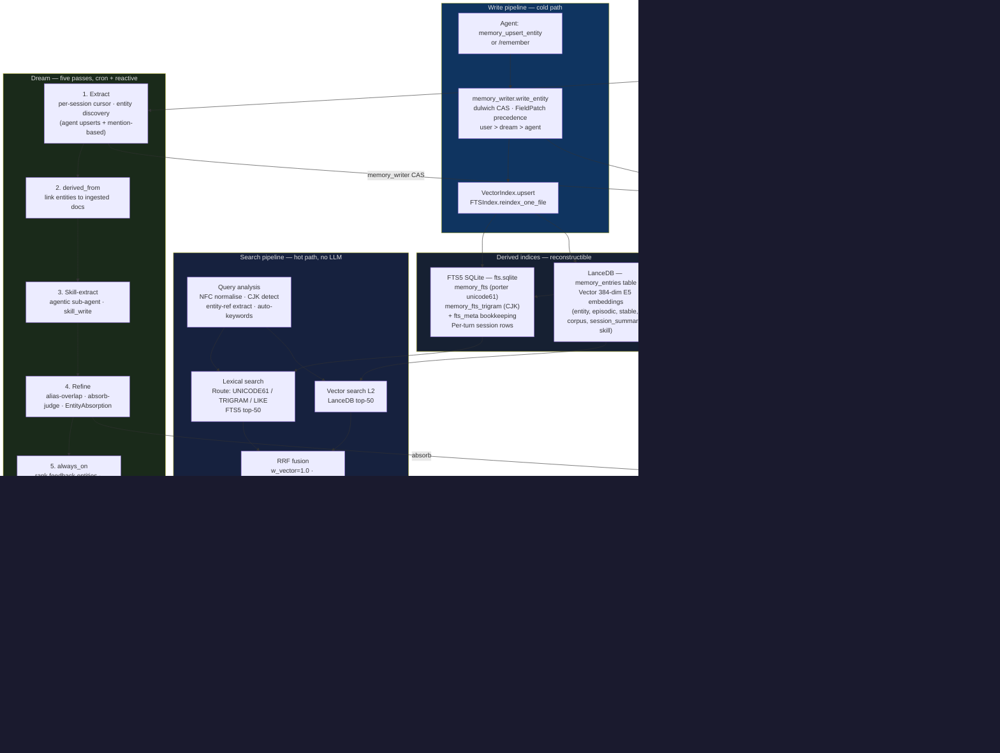

# Memory subsystem — overview

## 1. Purpose

The memory subsystem gives durin persistent, cross-session recall without requiring
an LLM in the hot-path retrieval loop. Every piece of knowledge lives in editable
markdown files under `memory/`; the vector and lexical indices that accelerate
search are derived from those files and can be fully reconstructed at any time.

Two coexisting tracks run through the same workspace:

- **Entity pages** — typed, consolidated knowledge the agent authors via
  `memory_upsert_entity` and the extract dream continuously enriches from session
  conversations. Stored at `memory/entities/<type>/<slug>.md`.
- **Raw fragments** — episodic notes, stable facts, corpus chunks, and session
  summaries. Appended and surfaced by search; never automatically folded into
  entity pages.

A cold-path Dream process (daily cron or reactive hook) runs five sequential
passes — extract, derived_from, skill-extract, refine, always_on — that grow the
entity graph, link knowledge to source documents, mine reusable skills, deduplicate
near-duplicate entities, and curate guidance pins. Crucially, Dream never blocks
the agent; all user turns see the most recent completed pass.

---

## 2. Mental model

**Markdown-first durability.** All knowledge lives in `.md` files. The LanceDB
vector table and the FTS5 SQLite database are indices — derived artifacts that can
be deleted and rebuilt without losing any information. The files are the source of
truth; the indices are a speed layer on top.

**Layered search with no LLM in the hot path.** A query passes through four stages:
(1) query analysis routes to the right lexical table; (2) vector search and lexical
search run in parallel; (3) Reciprocal Rank Fusion merges the two result lists; (4)
entity-aware rerank boosts hits matching query entities, and an optional cross-encoder
reranks the top-50 to a final top-10. Every stage is deterministic. The LLM receives
the structured, sectioned results and does the reasoning.

**Cold-path dream consolidation.** The extract pass reads every session with unprocessed
turns (tracked by a per-session cursor in `session.meta.json`) and discovers or enriches
entity pages. The refine pass finds alias-overlap pairs and, when auto-absorb is enabled,
merges duplicates. The always_on pass curates which guidance entities are pinned into every
prompt within a token budget. All dream writes go through `memory_writer.write_entity`,
which uses dulwich git plumbing and a compare-and-swap lock to prevent lost updates under
concurrent writers.

---

## 3. Architecture diagram



---

## 4. How it works

### Storage workspace layout

Everything lives under a single workspace directory (default `~/.durin/`):

```
<workspace>/
├── sessions/               raw session transcripts (.jsonl per session)
├── ingested/<id>/          source document chunks and metadata
├── memory/
│   ├── entities/<type>/    typed entity pages (one .md per entity)
│   ├── episodic/           atomic observations
│   ├── stable/             durable notes and stable facts
│   ├── corpus/             chunks extracted from ingested documents
│   ├── session_summary/    one .md per session (first-class indexed class)
│   ├── pending/            intake buffer — never indexed
│   └── archive/            absorbed or retired entries (not searched by default)
└── .durin/index/
    ├── lance/              LanceDB vector table (memory_entries)
    ├── fts.sqlite          FTS5 lexical index
    └── meta.json           IndexMeta (CURRENT_SCHEMA_VERSION = 7)
```

The `pending` class is an intake buffer; the indexer and walker skip it entirely.
`archive/` is excluded from all default search paths and is only visited when
`include_archive=True` is explicitly passed.

### Indexing

The vector index (`VectorIndex`, backed by LanceDB) holds one row per memory
artifact with fields: `id`, `class_name`, `summary`, `headline`, `vector`
(384-dim or 1024-dim E5 embeddings), `valid_from`, `entities`, `path`,
`body_length`. All record types — entity pages, fragment entries, session
summaries, and skills — share this table. L2 distance is used for search;
E5 models produce normalized vectors so L2 and cosine are equivalent.

The lexical index (`FTSIndex`, backed by FTS5 in SQLite) contains two virtual
tables:
- `memory_fts` — porter + unicode61 tokenizer with diacritic removal; handles
  Latin, Cyrillic, Arabic, and other whitespace-separated scripts.
- `memory_fts_trigram` — trigram tokenizer; handles CJK and substring queries.

Session turns are indexed one row per turn (uri `sessions/<key>.md#turn-N`),
so BM25 scores are not diluted by transcript length. Sessions are never
vector-indexed; `session_summary/` entries cover the semantic layer.

Schema version 7 (`CURRENT_SCHEMA_VERSION` in `durin/memory/index_meta.py`)
added Porter stemming to `memory_fts`. A schema version mismatch triggers an
automatic rebuild on startup.

### Search pipeline

1. **Query analysis** (`query_router.py`): NFC-normalize, count CJK characters,
   extract entity refs, detect identifier tokens (URLs, emails, UUIDs, file paths).
   Route: CJK ≥ 3 chars and all tokens ≥ 3 chars → TRIGRAM; CJK present with short
   tokens → LIKE_SUBSTRING fallback; otherwise → UNICODE61.

2. **Parallel retrieval**: vector search embeds the query with the `query: ` E5
   prefix and fetches the top-50 nearest rows by L2. Lexical search runs the routed
   FTS5 query against the appropriate table and also returns up to 50 hits.

3. **RRF fusion** (`rrf_fusion.py`): merge by reciprocal rank with weights
   `w_vector = 1.0`, `w_lexical = 0.7` (boosted to 2.5 when `keywords` are
   supplied), `w_grep = 0.3`. A session-type prior multiplies raw session turn
   scores by 0.85 so curated entries lead at comparable evidence.

4. **Entity-aware rerank** (`entity_ranker.py`): boost fused hits whose `entities`
   field overlaps with entity refs extracted from the query.

5. **Cross-encoder rerank** (opt-in, `cross_encoder.py`): a ~100M-param
   sentence-transformer model (`BAAI/bge-reranker-base` by default) rescores the
   top-50 and keeps top-10. Disabled by default because the model download must not
   happen implicitly in CI environments; the onboarding wizard recommends enabling it
   for production deployments.

6. **Sectioning** (`sectioned_output.py`): group results into four sections —
   CANONICAL (entity pages), FRAGMENT (episodic + stable + corpus), SESSION (session
   turns + summaries), INGESTED (source artifact chunks). A per-source cap (default 3)
   prevents a single long ingested document from monopolizing the top-K.

### Write pipeline

Agent and user writes both go through `memory_writer.write_entity`:

1. Read the entity page at HEAD via dulwich plumbing (no working-tree checkout).
2. Apply `FieldPatch` objects in precedence order: `user` > `dream` > `agent`.
   A field authored by the user is never overwritten by a dream pass.
3. Build and commit via `refs.set_if_equals` (compare-and-swap). Retry up to 30
   times on conflict; an in-process `RLock` serializes same-repo writes to reduce
   contention.
4. Fast-forward the working tree so file-based readers (Obsidian, the webui) see
   the latest content.
5. After a successful commit, `VectorIndex.upsert` and `FTSIndex.reindex_one_file`
   update both indices incrementally.

The `pending` class bypasses this path; it is a raw buffer that the indexer skips.

### Dream cold-path (five passes)

The `memory_dream` cron (default `0 3 * * *`) runs five sequential passes. Reactive
triggers (session compaction, session close) run only the extract pass, throttled by
`ReactiveDreamGate`.

1. **Extract** (`dream_passes.run_extract_pass`): iterate sessions ordered by name.
   For each session with turns beyond the stored `extract_cursor`, scan tool calls
   for `memory_upsert_entity` references (Stage 1), call an LLM to extract typed
   attributes, and write via `memory_writer`. Optionally (Stage 2, `discover_enabled`),
   discover entirely new entities from conversation mentions. Advance the cursor after
   each session batch.

2. **derived_from** (`dream_passes.run_derived_from_pass`): link entities to the
   ingested documents they were distilled from, for sessions where the write-time
   link is absent. Catch-and-repair pass; skips sessions with no ingested references.

3. **Skill-extract** (`dream_passes.run_skill_extract_pass`): an agentic sub-agent
   (spins `AgentRunner`) mines recent sessions and logged skill gaps for reusable
   procedures, then calls `skill_write` to author or update skills.

4. **Refine** (`dream_passes.run_refine_pass` → `refine_dream.run_refine`): find
   entity pairs sharing aliases via `AliasIndex`, skip cross-type / tombstoned /
   user-managed / quarantined pairs, judge survivors via `absorb_judge.judge_pair`
   (LLM returning same / different / unclear + confidence), and merge on
   `same + confidence ≥ threshold` via `EntityAbsorption.absorb`. ON by default
   (`memory.dream.auto_absorb.enabled = true`); a bad merge is recoverable via
   `git revert` of the absorb commit. Manual `durin memory absorb` is always available.

5. **always_on** (`always_on_dream.run_always_on_pass`): gather stance, practice, and
   feedback entity pages, rank them via an LLM judge that drops contradictions, fit the
   ranked list within `always_on_token_budget` tokens, and flip `always_on` flags.
   Only the flag changes; no entities are ever deleted by this pass. The principal
   resolver injects always_on entities into the pinned context on every agent turn.

---

## 5. Key types and entry points

| Symbol | File | Role |
|---|---|---|
| `EntityPage` | `durin/memory/entity_page.py` | Parsed representation of `memory/entities/<type>/<slug>.md`. Frontmatter: `type`, `name`, `aliases`, `attributes`, `relations`, `derived_from`, `author`, `created_at`, `updated_at`. Lenient on read; strict validation on `save()`. |
| `MemoryEntry` | `durin/memory/schema.py` | Pydantic model for fragment entries (`episodic`, `stable`, `corpus`, `session_summary`). Fields: `id`, `headline`, `summary`, `source_refs`, `related`, `entities`, `author`, `valid_from`, `body`. Validates entity refs as strict `<type>:<value>`. |
| `VectorIndex` | `durin/memory/vector_index.py` | LanceDB wrapper at `<workspace>/.durin/index/lance/`. Table `memory_entries`. Incremental `upsert` and full `rebuild_from_workspace`. L2 distance search. |
| `FTSIndex` | `durin/memory/fts_index.py` | SQLite FTS5 at `<workspace>/.durin/index/fts.sqlite`. Two virtual tables (`memory_fts` porter-unicode61, `memory_fts_trigram`) plus `fts_meta` bookkeeping. |
| `FastembedProvider` | `durin/memory/embedding.py` | ONNX embedding provider. Default `intfloat/multilingual-e5-small` (384-dim, 100+ languages). Lazy load; applies `passage:` / `query:` E5 prefix automatically. |
| `AliasIndex` | `durin/memory/aliases_index.py` | In-memory map `{alias_string → [entity_ref, …]}`. Rebuilt from `memory/entities/` on boot (sub-second). No disk persistence. `RLock` for thread-safe mutations during dream refresh. |
| `RoutingDecision` | `durin/memory/query_router.py` | Output of `decide_lexical_route`: `normalized_query`, `route` (UNICODE61 / TRIGRAM / LIKE_SUBSTRING), `cjk_chars`, `keywords`, `auto_keywords`. Pure deterministic function. |
| `EntityAbsorption` | `durin/memory/absorption.py` | Detects merge candidates (shared aliases) and absorbs: canonical receives merged content, loser moved to `memory/archive/entities/<type>/<slug>.md` with `archived_into` frontmatter. |
| `memory_writer.write_entity` | `durin/memory/memory_writer.py` | Single entity write path: read at HEAD → apply `FieldPatch` objects by precedence → dulwich plumbing commit → CAS via `refs.set_if_equals` → retry on conflict → fast-forward working tree. |
| `IndexMeta` | `durin/memory/index_meta.py` | Frozen dataclass persisted at `<workspace>/.durin/index/meta.json`. Tracks `schema_version` (currently 7), `embedding_model_id`, `last_full_rebuild`, `previous_models`. Schema mismatch triggers auto-rebuild. |
| `SectionedHit` | `durin/memory/sectioned_output.py` | Result wrapper carrying `uri`, `type`, `path`, `score`, `ts`, `snippet`, `summary`, `entities`. Grouped into CANONICAL / FRAGMENT / SESSION / INGESTED sections by the renderer. |
| `run_extract_for_session` | `durin/memory/extract_runner.py` | Per-session extract orchestrator: loads session JSONL, reads `extract_cursor` from `session.meta.json`, processes new turns, calls `extract_entity` + `discover_entities`, advances cursor. |
| `ReactiveDreamGate` | `durin/memory/dream_passes.py` | In-process lock + throttle for reactive extract triggers. `try_begin` is non-blocking; returns skip reason (`"locked"` / `"throttled"`) or empty string when the caller may proceed. |

For deeper coverage of individual subsystems, see the sibling docs:

- [01_data_and_entities.md](01_data_and_entities.md) — workspace layout, entity page format, fragment classes, provenance, archiving
- [02_indexing.md](02_indexing.md) — LanceDB table schema, FTS5 tables, incremental vs. full rebuild, schema version lifecycle
- [03_search_pipeline.md](03_search_pipeline.md) — query analysis, RRF weights, entity-aware rerank, cross-encoder, sectioning
- [04_agent_tools.md](04_agent_tools.md) — `memory_search`, `memory_upsert_entity`, `memory_ingest`, `memory_drill`, `memory_forget`
- [05_dream_cold_path.md](05_dream_cold_path.md) — five passes in depth, cursor mechanics, absorb-judge, always_on
- [06_prompts_and_instructions.md](06_prompts_and_instructions.md) — LLM-facing tool descriptions, result markers, identity context injection
- [07_telemetry_and_observability.md](07_telemetry_and_observability.md) — telemetry events, health check, webui dashboards
- [design_rationale.md](design_rationale.md) — decisions not taken and why

---

## 6. Configuration and surfaces

### Core config keys (`memory.*` in `durin/config/schema.py`)

| Key | Default | Effect |
|---|---|---|
| `memory.enabled` | `true` | Gates vector retrieval. When false, memory tools still work via grep-level recall but no embedding model is loaded. |
| `memory.owner` | `null` | Workspace owner entity ref (e.g. `person:marcelo`). Resolves the principal for pinned context; falls back to `person:anonymous`. |
| `memory.index_skills` | `true` | Includes `skills/<name>/SKILL.md` in the FTS and vector walk as the `skill` memory class. |
| `memory.embedding.model` | `intfloat/multilingual-e5-small` | E5 embedding model. Changing the model triggers a full vector rebuild on next startup. |
| `memory.embedding.provider` | `fastembed` | Embedding backend (currently only `fastembed`; future HTTP providers planned). |
| `memory.search.cross_encoder.enabled` | `false` | Enable the cross-encoder rerank step (downloads ~100 MB model on first use). |
| `memory.search.cross_encoder.model` | `BAAI/bge-reranker-base` | Sentence-transformer model for reranking. |
| `memory.search.sectioning.max_per_source` | `3` | Maximum corpus hits per `ingest_id` in the sectioned output. |
| `memory.file_watcher.enabled` | `true` | Reactive re-indexing when `.md` files under `memory/` are modified outside the agent (vim, git merge). |
| `memory.health_check.enabled` | `true` | Periodic consistency probe between the markdown source and the derived indices. |
| `memory.health_check.interval_seconds` | `3600` | How often the health check probe runs. |
| `memory.dream.enabled` | `true` | Master switch for cron and reactive dream triggers. Manual `durin memory dream` always works. |
| `memory.dream.cron` | `0 3 * * *` | Schedule for the daily five-pass dream run. |
| `memory.dream.post_compaction` | `true` | Run extract pass after a session is compacted. |
| `memory.dream.on_session_close` | `true` | Run extract pass when a session closes. |
| `memory.dream.discover_enabled` | `true` | Enable Stage 2 mention-based entity discovery in the extract pass. |
| `memory.dream.skill_signals_enabled` | `true` | Detect skill corrections and gaps in session turns during extract (feeds daily curation). |
| `memory.dream.min_seconds_between_runs` | `300` | Throttle window for reactive triggers; 0 disables. |
| `memory.dream.max_seconds_per_run` | `600` | Hard wall-clock cap per extract pass; 0 = unbounded. |
| `memory.dream.always_on_token_budget` | `1500` | Token ceiling for always-on pinned guidance; 0 disables the pin. |
| `memory.dream.auto_absorb.enabled` | `true` | ON by default; the refine pass auto-merges judged duplicates (recoverable via git revert + tombstone). Use `durin memory absorb-suggest` and `durin memory absorb` for manual control. |
| `memory.dream.auto_absorb.confidence_threshold` | `95` | LLM judge confidence floor (0–100) for auto-merge. |
| `memory.dream.auto_absorb.semantic_distance_threshold` | `0.20` | Embedding L2² distance below which a same-type entity is a semantic dedup candidate (refine + discovery); ≈ cosine 0.90; lower = stricter — the judge still decides the merge. |

### Principal resolution keys

| Key | Default | Effect |
|---|---|---|
| `principal_channel_map` | `{}` | Map of `channel_id → person:<name>` for resolving the interacting person entity per channel. |
| `principal_owner` | `null` | Fallback owner entity ref when the channel map has no entry. |

### CLI surfaces

```
durin memory search <query>         run a search (same pipeline as memory_search tool)
durin memory dream [--passes ...]   run all five dream passes manually
durin memory reindex                rebuild all indices from markdown
durin memory absorb-suggest         show alias-overlap candidates for manual review
durin memory absorb <ref> <into>    manually merge two entity pages
durin memory history <entity-ref>   show git history for an entity page
durin memory revert <sha>           revert an entity write via git revert
durin memory stats                  show index sizes and entry counts
```

### Agent tools

The agent accesses memory through six tools (see [04_agent_tools.md](04_agent_tools.md) for signatures and parameters):

- `memory_search` — query the search pipeline
- `memory_upsert_entity` — create or update an entity page
- `memory_ingest` — ingest a document into corpus chunks
- `memory_drill` — fetch the full body of a specific memory entry
- `memory_forget` — soft-delete a memory entry (sets a tombstone; `archive` not delete)
- `memory_store` — write a raw fragment (episodic, stable, or corpus class)

---

## 7. Curated rationale

**Markdown as source of truth.** Indices are fast, but markdown files are durable. A
corrupted LanceDB table is rebuilt with `durin memory reindex`. A file edited with vim
is picked up by the file watcher. This also makes the memory store portable — it is just
a directory of text files that any tool can read.

**No LLM in hot-path search.** Retrieval latency must be predictable regardless of
external API availability or cost. The cross-encoder reranker (a local ONNX model) is the
closest thing to inference in the search pipeline, and even it is optional. LLMs appear
only in the cold path (dream consolidation, ingestion) where latency is not per-user-turn.

**Temporal decay was removed.** The search pipeline no longer applies any recency
weighting. Every hit carries a `valid_from` field; the agent reasons about which
information is current given the question's intent. Pre-filtering by age without
knowing the question's temporal context produced incorrect results on factual,
atemporal queries.

**Five passes, not one monolithic consolidation.** Each dream pass has a bounded,
independent scope. Extract is idempotent (per-session cursors). Derived_from is a
catch-and-repair pass that runs after extract. Skill-extract is the only agentic pass
(spins its own runner). Refine is opt-in and conservative. Always_on only flips flags.
This separation means a failure in one pass does not abort the others, and each pass can
be triggered independently or inspected in isolation.

**Per-field authorship precedence.** Entity attributes carry an author tag
(`user_authored` or `agent_created`). A field authored by a human is never
overwritten by a dream pass — only agent-created or untagged fields are updated.
This prevents dream consolidation from silently overriding corrections the user made
by hand.
