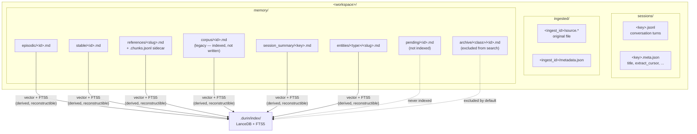

# Memory data types and entity model

## Purpose

This document describes what the memory system stores, where it lives, what shape each piece has, and how it moves through its lifecycle. Understanding the data model is the prerequisite for all other memory docs: the indexing, search, and dream consolidation layers all operate on the structures defined here.

The memory system stores two parallel tracks:

- **Track 1 — entities**: synthesized, canonical knowledge (`memory/entities/`). Written through a single git-CAS write path under per-field authorship precedence.
- **Track 2 — fragments**: raw, append-only observations (`memory/episodic/`, `memory/stable/`, `memory/session_summary/`). Surfaced by recency; never consolidated into entity pages.
- **Track 2 — references**: ingested documents kept whole (`memory/references/<slug>.md`). Written by `memory_ingest`; token-aware chunk index stored as a `.chunks.jsonl` sidecar. Legacy `corpus/` entries are still walked and indexed for historical content but `memory_ingest` no longer writes there.

Markdown files are the source of truth. Indices (LanceDB vector + SQLite FTS5) are derived and can be fully rebuilt from the files at any time.

---

## Mental model

**Open-vocabulary typed references.** Every entity is identified by a `<type>:<value>` reference where `type` is lowercase `[a-z][a-z0-9_]*` and the vocabulary of types is deliberately open — only the shape is enforced, not the set of allowed types.

**Authorship gates auto-management.** Every file carries an `author` field (`user_authored` or `agent_created`). The dream passes and auto-absorb logic never modify pages authored by a human. Field-level writes respect a three-tier precedence: user > dream > agent.

**Workspace layout is self-contained.** One `<workspace>/` directory holds all sessions, ingested documents, and the entire `memory/` subtree. Copying the directory is a complete backup.

---

## Diagram



---

## How it works

### Workspace layout

```
<workspace>/
├── sessions/
│   ├── <session_key>.jsonl          conversation turns (append-only)
│   └── <session_key>.meta.json      title, extract_cursor, timestamps
│
├── ingested/
│   └── <ingest_id>/
│       ├── source.<ext>             original file (PDF, HTML, TXT, …)
│       └── metadata.json            origin, ingest_time, mime_type
│
└── memory/
    ├── episodic/<id>.md             raw atomic observations
    ├── stable/<id>.md               user-marked durable notes
    ├── references/<slug>.md         ingested documents kept whole
    │   └── <slug>.chunks.jsonl      token-aware chunk index (vector units)
    ├── corpus/<id>.md               legacy — still indexed, no longer written
    ├── pending/<id>.md              intake buffer (never indexed)
    ├── session_summary/<key>.md     compaction summaries (vector-indexed)
    ├── entities/<type>/<slug>.md    synthesized canonical entity pages
    └── archive/<class>/<id>.md      retired entries (excluded from search)
```

`sessions/` and `ingested/` are immutable evidence — never modified after writing. `memory/` is mutable synthesis — written by the agent, the dream passes, or the user directly.

### Data classes

| Class | Path | Track | Indexed? | Mutability |
|---|---|---|---|---|
| Session | `sessions/<key>.jsonl` + `.meta.json` | Evidence | FTS5 per-turn rows; NOT vector-indexed | Append-only during session |
| Session summary | `memory/session_summary/<key>.md` | 2 — raw | Vector + FTS5 | Replaced on re-compaction |
| Ingested | `ingested/<ingest_id>/` | Evidence | Not directly; via references | Write-once |
| Reference | `memory/references/<slug>.md` | 2 — raw | Vector (chunks) + FTS5 (whole doc) | Replaced on re-ingest (idempotent by content hash) |
| Corpus (legacy) | `memory/corpus/<id>.md` | 2 — raw | Vector + FTS5 | No longer written by memory_ingest; historical entries are still indexed |
| Episodic | `memory/episodic/<id>.md` | 2 — raw | Vector + FTS5 | Append-only |
| Stable | `memory/stable/<id>.md` | 2 — raw | Vector + FTS5 | Semi-mutable (user-editable) |
| Pending | `memory/pending/<id>.md` | Buffer | Never indexed | Short-lived |
| Entity | `memory/entities/<type>/<slug>.md` | 1 — consolidated | Vector + FTS5 | Mutable via CAS write path |
| Archive | `memory/archive/<class>/<id>.md` | Terminal | Excluded by default | Frozen |

`pending` is an intake buffer not visible to search. `archive` is reachable only via explicit opt-in (`include_archive=True` in walkers, or `memory_search(..., scope='archive')`).

### Fragment schema (MemoryEntry)

Episodic, stable, corpus, and pending all share one Pydantic model (`durin/memory/schema.py::MemoryEntry`):

```yaml
---
id: <string, unique per class>
headline: <one-line title>
summary: <short paragraph>          # optional
source_refs: ["[[sessions/key#turn-5]]", ...]
related: ["[[episodic/other.md]]", ...]
entities: ["person:marcelo", "project:durin"]
author: "user_authored"             # or "agent_created"
valid_from: 2026-06-01              # optional date
---

<markdown body — free-form prose>
```

`entities` entries are validated as strict `<type>:<value>` at write time. `source_refs` and `related` are stored as Obsidian wikilinks on disk (`[[uri]]`) and stripped to plain strings in memory. `extra="forbid"` — no unknown frontmatter keys are allowed.

### Entity page schema (EntityPage)

Entity pages live at `memory/entities/<type>/<slug>.md`. Minimum required frontmatter:

```yaml
---
type: person
name: Marcelo
aliases: [Marcelo Marmol, Marce]
created_at: 2026-06-01T10:00:00
updated_at: 2026-06-01T11:30:00

# v2 fields (optional; populated by dream and agent):
attributes:
  email: marcelo@mxhero.com
  current_role: founder

relations:
  - to: project:durin
    type: maintains
    since: 2024-01

derived_from: ["reference:some-doc-slug"]  # source documents

provenance:
  attributes:
    email:
      source_ref: "sessions/abc123.jsonl#turn-5"
      extracted_at: 2026-06-01T11:00:00Z

author: agent_created   # omitted when user_authored (safe default)
---

<markdown body — free-form prose maintained by dream and agent>
```

`EntityPage` is lenient on read (malformed YAML returns `None`; unknown fields land in `extra` and survive round-trips) and strict on write (`_validate()` checks all field shapes before `to_markdown()`).

### Entity references: `<type>:<value>`

All references have the form `<type>:<value>`:

- `type` matches `[a-z][a-z0-9_]*`. The vocabulary is **open** — any well-formed type is accepted at runtime.
- Only the first `:` separates type from value; values may themselves contain colons (`file:src/auth.ts`).
- Eight broad types are suggested as a starter set (`SUGGESTED_TYPES` in `entities.py`): `person`, `place`, `project`, `topic`, `event`, `artifact`, `stance`, `practice`. These are hints for the dream prompt, not an enforced enum.

```python
ENTITY_REF_PATTERN = re.compile(r"^[a-z][a-z0-9_]*:[^\s].*$")
```

Validation policy: the `memory_store` write path is strict (invalid ref → error returned to the model); the `consolidator_tags` read path is lenient (invalid refs dropped with a log warning, entry survives).

### Slug normalization

A slug is derived from an entity's `name` by `slugify_name()` in `entities.py`:

1. Unicode NFC normalize.
2. Transliterate non-Latin scripts to ASCII via `unidecode` (e.g., 马塞洛 → `ma_sai_luo`).
3. Lowercase.
4. Replace runs of non-alphanumerics with a single underscore.
5. Strip leading/trailing underscores.
6. Truncate to 64 characters (re-strip trailing `_` at cut boundary).

Returns `"unnamed"` if the pipeline yields an empty string.

Collision resolution: when `memory/entities/<type>/<slug>.md` already exists, `resolve_slug_collision()` appends a numeric suffix (`_2`, `_3`, …). It checks both live and archived paths to avoid reviving a stale identity. Real dedup of distinct entities that share a name is handled by the dream refine pass.

### Authorship and precedence

Every memory write must declare its author via `author_scope()`. The mechanism is a Python `ContextVar` that propagates across `await` and `asyncio.create_task` boundaries within a logical request, isolated between concurrent tasks.

```python
from durin.memory.provenance import author_scope

with author_scope("agent_created"):
    write_entity(...)       # dream / agent tool paths

with author_scope("user_authored"):
    write_entity(...)       # /remember, manual UI surface
```

Calling `current_author()` outside an active scope raises `MissingAuthorScopeError` — there is no implicit default.

**Two authorship values** (`Author` literal, `provenance.py`):

| Value | Who uses it | Effect |
|---|---|---|
| `user_authored` | `/remember`, hand-edited `.md`, user UI surfaces | Dream and auto-absorb never modify or archive this entry |
| `agent_created` | Agent tools, dream passes | Dreams may extend, merge, or archive |

**Field-level precedence** (orthogonal to the page-level flag): when `write_entity` applies a `FieldPatch`, each field resolves its author as one of `user`, `dream`, or `agent`. The precedence rule is **user > dream > agent** — a value written at a higher tier is never overwritten by a lower-tier patch.

**Entity name** is an exception: the discovered entity name from the dream extract Stage 2 is last-writer-wins. Precedence applies to attributes and relations, not to `name`. An explicit user or agent correction simply overwrites a dream-discovered name guess.

**Page-level `author` field**: `EntityPage.author` defaults to `user_authored` when absent — hand-written pages without the field are treated as user content (safe default). Pages written by the dream or absorption carry `author: agent_created` explicitly.

### Entity write path

All entity mutations go through `write_entity()` in `memory_writer.py`:

1. Read the entity page blob at HEAD via dulwich plumbing.
2. Apply `FieldPatch`es in order, under per-field authorship precedence.
3. Serialize back to markdown (`to_markdown()`).
4. Build a commit via dulwich plumbing (no working-tree mutation).
5. Install with `refs.set_if_equals` CAS; retry up to 30 times on conflict.
6. Fast-forward the working tree to HEAD (so Obsidian and file watchers see the latest).

A process-wide `RLock` per repo root serializes in-process concurrent writes. A `cross_process_lock` on `.git-worktree` serializes the fast-forward step across processes.

Before any system write touches git, `_commit_dirty_as_user()` commits any uncommitted working-tree edits as `author: user` — protecting hand-edits in progress (e.g., a user editing a page in a text editor).

### Archive

When a fragment is retired (`memory_forget` / webui) or when the refine dream merges one entity into another, the file is moved to `memory/archive/<class>/<id>.md`. The archived file gains `archived_at` and `archived_into` frontmatter fields. Reference files at `memory/references/<slug>.md` are replaced in-place on re-ingest (idempotent by content hash) — the `memory/.git/` history preserves prior versions. Legacy corpus entries were deleted (not archived) on re-ingest under the old model.

Archive is excluded from all default search paths: the vector index, FTS5, the grep fallback, and all workspace walkers. Access requires explicit opt-in.

---

## Key types and entry points

| Symbol | File | Role |
|---|---|---|
| `MemoryEntry` | `durin/memory/schema.py` | Pydantic model for episodic / stable / corpus / pending. Validates `<type>:<value>` entity refs at construction. |
| `ingest_reference` | `durin/memory/reference.py` | Writes an ingested document whole to `memory/references/<slug>.md` and a token-aware `.chunks.jsonl` sidecar. Returns `ReferenceResult(ref, path, chunk_count)`. |
| `EntityPage` | `durin/memory/entity_page.py` | Dataclass for `memory/entities/<type>/<slug>.md`. Lenient on read (`from_text`), strict on write (`to_markdown` + `_validate`). Holds `extra` dict for emergent fields. |
| `Author` | `durin/memory/provenance.py` | `Literal["user_authored", "agent_created"]`. Used in both `MemoryEntry.author` and `EntityPage.author`. |
| `author_scope` | `durin/memory/provenance.py` | Context manager that sets the ambient write author via `ContextVar`. Required on every memory write path. |
| `current_author` | `durin/memory/provenance.py` | Returns the ambient author; raises `MissingAuthorScopeError` when called outside a scope. |
| `is_valid_entity_ref` | `durin/memory/entities.py` | Validates `<type>:<value>` shape via `ENTITY_REF_PATTERN`. |
| `parse_entity_ref` | `durin/memory/entities.py` | Parses a ref into `ParsedEntityRef(type, value)`. Only the first `:` separates. |
| `slugify_name` | `durin/memory/entities.py` | NFC → unidecode → lowercase → punct-to-underscore → truncate-64 pipeline. |
| `resolve_slug_collision` | `durin/memory/entities.py` | Appends `_2`, `_3`, … suffix to avoid collisions in both live and archived paths. |
| `SUGGESTED_TYPES` | `durin/memory/entities.py` | `frozenset` of 8 broad types as hints for the dream prompt. Not an enforced enum. |
| `FieldPatch` | `durin/memory/field_patch.py` | Dataclass for one structured entity edit: `(kind, key, value, author, source_ref, at)`. Applied by `write_entity` in order, under per-field authorship precedence. |
| `write_entity` | `durin/memory/memory_writer.py` | Single entity write path: read@HEAD → apply patches (precedence) → dulwich commit → CAS → fast-forward. Retries up to 30× on conflict. |
| `save_entry` | `durin/memory/storage.py` | Writes a `MemoryEntry` as markdown + YAML frontmatter (wikilink-wraps `source_refs`/`related` at the storage boundary). |
| `load_entry` | `durin/memory/storage.py` | Reads and parses a `MemoryEntry`; strips wikilink wrappers back to plain URIs. |
| `split_frontmatter` | `durin/memory/storage.py` | Low-level `---`-block splitter used by both `load_entry` and `EntityPage.from_text`. |

---

## Configuration and surfaces

| Config key | Default | Effect |
|---|---|---|
| `memory.enabled` | `true` | Master switch for all memory I/O. |
| `memory.owner` | — | Owner person ref for `resolve_principal()`; fallback from `principal_channel_map`. |
| `principal_channel_map` | `{}` | Maps `channel_id → person:<name>` for principal resolution per channel. |
| `memory.file_watcher.enabled` | `true` | Reactive re-embed when the user edits a `.md` file directly. |
| `memory.dream.auto_absorb.enabled` | `false` | Whether the refine pass auto-merges entity duplicates. When off, suggestions are logged for manual review. |
| `memory.dream.auto_absorb.min_age_hours` | `24` | Quarantine: freshly-created entities are skipped by auto-absorb. |

**CLI surfaces:**

- `durin memory reindex` — wipe `.durin/index/` and rebuild from all `.md` files.
- `durin memory absorb <ref1> <ref2>` — manually merge two entity pages via the absorb-judge.
- `durin memory expand <ref>` — render a canonical entity page plus its archived predecessors.
- `durin memory dream` — run all five dream passes manually.

**Agent tool surfaces:** `memory_upsert_entity` writes entity pages; `memory_store` writes fragments (currently disabled — replaced by `memory_upsert_entity`); `memory_forget` archives a fragment or entity page.

---

## Curated rationale

Markdown as source of truth, with derived indices, means the user can open any file in any editor and the system will catch up via the file watcher or a manual reindex. This is intentional: the memory workspace should be auditable by a human with standard tools, not locked in a binary format.

The open vocabulary for entity types (`<type>:<value>`) avoids the need for a central registry. Types like `bug:`, `deal:`, or `org:` emerge naturally in specific workspaces without any schema change. The eight suggested types are grounded in cognitive memory literature (Tulving's episodic/semantic split, CoALA) and cover the most common cases, but they are hints — not constraints.

The `user_authored` default on `EntityPage.author` when the field is absent means a hand-written page that predates the authorship field is always treated as user content. This is the conservative direction: the cost of incorrectly protecting a page is that the dream misses one update; the cost of incorrectly auto-managing a user-authored page is destroying stated intent.

Field-level precedence (user > dream > agent) applies to attributes and relations. Entity `name` is excluded from this rule: the name written by the dream's discovery pass is a guess, and a later explicit correction by the user or agent simply overwrites it. Making name precedence-protected would require a way to express "I want to keep this discovered name" — unnecessary complexity for a field that is trivially correctable.

See `02_indexing.md` for how these data structures are indexed, `03_search_pipeline.md` for how they are retrieved, and `05_dream_cold_path.md` for how the dream passes enrich entity pages from session evidence.
