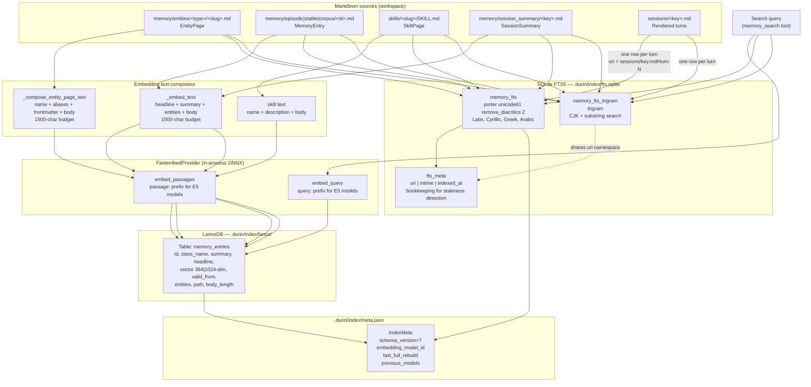

# Purpose

The indexing layer maintains two derived, reconstructible indexes that accelerate retrieval over the markdown source of truth: a **vector index** (LanceDB + E5 embeddings) for semantic search and an **FTS5 lexical index** (SQLite) for keyword and phrase search. Neither index stores information that is not already in the `.md` files. Deleting `.durin/index/` and running `durin memory reindex` restores an identical search state — this is the operational guarantee that makes "markdown is source of truth" real.

The indexer sits between the write path (tools, Dream, the file watcher) and the search pipeline (`03_search_pipeline.md`). Its job is to keep the derived indexes fresh so the search pipeline finds things; the search pipeline's job is to combine them intelligently.

---

## Mental Model

**Derived, reconstructible caches.** Both the LanceDB table and the FTS5 database are caches derived from `.md` files. No index column holds information absent from its backing file. Because of this, any index corruption is recoverable by rebuilding from disk.

**Per-type embedding composers.** The text fed to the embedding model differs by document type. Entity pages embed `name + aliases + rendered frontmatter + body`. Memory entries embed `headline + summary + entities + body`. Session turns are FTS-only (not vector-indexed). Each type has exactly one composer function; there is no shared generic path.

**Schema version as an integrity contract.** `index_meta.py` tracks `CURRENT_SCHEMA_VERSION` (currently `7`). On startup, `ensure_index_fresh` compares the on-disk schema version against the code's expected version. A mismatch triggers an automatic rebuild. This prevents the search pipeline from operating silently against a structurally stale index after an upgrade.

---

## Diagram

---

## How It Works

### Vector index (LanceDB)

The vector index lives at `<workspace>/.durin/index/lance/`. A single LanceDB table named `memory_entries` holds all record types: memory entries (episodic, stable, corpus, session_summary), entity pages, skills, and reference chunks. Rows share a common schema; the `class_name` column distinguishes types.

**Write path.** Fragment writes through the internal `store_memory` path (session summaries, compaction learnings, ingest chunks) call `VectorIndex.upsert` synchronously in the same call. Entity-page writes (`memory_upsert_entity`, Dream patches) commit via git only; the file watcher picks up the working-tree change and runs `upsert_entity_page` (with the health-check repair as the fallback when the watcher is disabled). An absorb merge refreshes its vector rows itself. Whenever invoked, the upsert embeds the composed text via `FastembedProvider.embed_passages` (applying the E5 `passage: ` prefix when the configured model is E5-family), then performs an atomic `merge_insert` on the table keyed by `id`. This replaces the prior row in a single commit — there is no window where the row is absent. A full rebuild via `VectorIndex.rebuild_from_workspace` walks four passes: memory entry classes, entity pages, skills, and reference document chunks.

**No `body` column.** The vector row carries `body_length` (for completeness hints to the renderer) but not the body text itself. When the search pipeline needs the full body (cold-tier requests), it reads the `.md` from disk. This keeps the vector index a pure derived cache with no drift risk from disk edits.

**E5 embedding convention.** The default model is `intfloat/multilingual-e5-small` (384-dim, 100+ languages, MIT). E5-family models require asymmetric prefixes: `passage: ` when embedding documents for storage, `query: ` when embedding a query for search. `FastembedProvider.embed_passages` and `embed_query` apply the correct prefix automatically. Non-E5 models pass through unchanged. Custom model registration via `_register_custom_models` makes `multilingual-e5-small` available to fastembed even though it is not in fastembed's default catalog.

**Dimension guard.** `VectorIndex._guard_dim_match` compares the on-disk table's vector dimension to the configured provider's dimension on every read and write. A mismatch raises `VectorIndexDimensionMismatchError`, which the search pipeline catches and degrades gracefully to lexical-only search.

### Embedding text composers

Each indexable type has exactly one composer. Both composers apply a 1500-character budget and a `\n\n` joiner, placing most-distilled signal first.

**Entity pages** — `VectorIndex._compose_entity_page_text`:
- `name` (most distilled)
- `Aliases: alias1, alias2` (when aliases are present)
- Rendered frontmatter as prose sentences: `Key: value.` for attributes (stateful attributes render `current` only; internal fields `created_at`, `updated_at`, `provenance` are skipped); relation entries render as `Type: slug (since date).`
- `body` (longest, most truncatable)

The entity type prefix (`project:`, `person:`) is intentionally omitted from the embedding text. Embedding the bare name against a natural-language query produces a significantly higher cosine similarity than embedding the type-prefixed URI.

**Memory entries** — `VectorIndex._embed_text`:
- `headline`
- `summary` (skipped when it is a body prefix to avoid double-weighting the same tokens)
- `Entities: ref1, ref2` (when entities are tagged)
- `body`

**Skills** — `name + description + body` (composed inline in `upsert_skill` and `_skill_record`).

### FTS5 lexical index

The FTS5 database at `<workspace>/.durin/index/fts.sqlite` contains two parallel virtual tables and a bookkeeping table.

**`memory_fts`** uses `porter unicode61 remove_diacritics 2`. Porter stemming means `write`, `writes`, and `writing` are indexed as the same root token, so morphological variants match without requiring the query to predict the exact form. `unicode61` tokenizes by word boundaries, serving Latin, Cyrillic, Greek, Arabic, and similar scripts. `remove_diacritics 2` normalizes accented forms so `café` matches `cafe`.

**`memory_fts_trigram`** uses the `trigram` tokenizer, which generates overlapping three-character sequences. This is necessary for CJK text (where word boundaries are not whitespace) and for substring queries.

Every write goes to **both** tables. The `FTSIndex.upsert` method deletes the prior row from both tables and `fts_meta` before inserting fresh rows, making it idempotent on `uri`. Query-time routing to the appropriate table is the search pipeline's concern (see `03_search_pipeline.md`).

**`fts_meta`** stores `uri`, `mtime`, and `indexed_at` for every indexed file. The health-check and staleness detection logic reads `fts_meta` to find rows whose backing file is gone (orphaned rows) or whose `mtime` has advanced since indexing (stale rows).

**BM25 text composition.** FTS5 indexes the full document text with no character budget. For entity pages: `name + aliases + rendered attributes + relations + body` (full body, not truncated). For entries: `headline + summary + entities + body`. For skills: `name + description + body`. The functions `_entity_text` and `_entry_text` in `indexer.py` build these strings.

### Session-turn FTS indexing

Raw session turns receive one FTS row per turn, not per session file. The URI shape is `sessions/<key>.md#turn-N`, matching the grep source's anchored URI so RRF fusion can accumulate both sources for the same turn. The turn header (role + timestamp) is included in the indexed text. Sessions are intentionally not vector-indexed because the embedding cost would be paid for each new conversation turn; the session summary (`memory/session_summary/<key>.md`) covers the semantic layer for compacted sessions.

The indexer's third pass in `rebuild_fts_index` walks `sessions/*.md` and yields per-turn payloads via `_session_turn_payloads`. The reactive path — `reindex_session_file` — is called by `SessionManager.save` after regenerating the rendered session file, inserting only turns whose URIs are not yet in `fts_meta`.

### Auto-rebuild on schema mismatch

`ensure_index_fresh` (called at startup) checks the on-disk `meta.json` schema version against `CURRENT_SCHEMA_VERSION = 7`. When they differ, it calls `rebuild_fts_index` and (if the embedding model also changed) `VectorIndex.rebuild_from_workspace`. After the rebuild, it saves a fresh `meta.json` recording the new schema version and model. Previous model identifiers are preserved in `previous_models` as a migration history.

### File watcher integration

`reindex_one_file` is the synchronous per-file indexing entry point called by the file watcher after any `.md` change under `memory/`. It skips files under `memory/archive/` and `memory/pending/`. When the file has vanished (genuine deletion), it deletes the FTS row and the corresponding LanceDB row symmetrically. To avoid incorrectly pruning files that are transiently absent during a dulwich `reset --hard`, it re-checks file presence under the git-worktree lock before deleting. `reindex_one_skill` mirrors this for `skills/<slug>/SKILL.md`.

---

## Key Types and Entry Points

| Symbol | File | Role |
|---|---|---|
| `VectorIndex` | `durin/memory/vector_index.py` | LanceDB wrapper. Write: `upsert`, `upsert_entity_page`, `upsert_skill`, `upsert_reference_chunk`; `rebuild_from_workspace` (full). Read: `search` (top-K L2 by query string), `search_by_vector` (pre-computed vector). |
| `VectorIndex._compose_entity_page_text` | `durin/memory/vector_index.py` | Entity-page embedding composer: `name + aliases + rendered_frontmatter + body`, 1500-char budget. Single authoritative source for entity centroid shape. |
| `VectorIndex._embed_text` | `durin/memory/vector_index.py` | Memory-entry embedding composer: `headline + summary + entities + body`, 1500-char budget. Skips summary when it is a body prefix. |
| `VectorIndex._render_frontmatter` | `durin/memory/vector_index.py` | Renders entity attributes and relations as prose sentences for the embedding centroid. Stateful attributes render `current` value only; internal metadata keys skipped. |
| `FTSIndex` | `durin/memory/fts_index.py` | SQLite FTS5 wrapper. Write: `upsert` (both tables + `fts_meta`), `delete_by_uri`, `delete_by_uris`; `clear`. Read: `search` (unicode61), `search_trigram` (trigram); `uris_with_prefix` (for incremental session indexing). |
| `fts_index_path` | `durin/memory/fts_index.py` | Returns the canonical `<workspace>/.durin/index/fts.sqlite` path. |
| `EmbeddingProvider` | `durin/memory/embedding.py` | Abstract base: `embed`, `embed_passages`, `embed_query`. Semantic surface for storage vs. retrieval contexts. |
| `FastembedProvider` | `durin/memory/embedding.py` | ONNX in-process embedding via fastembed. Validates model at construction. Applies E5 prefix in `embed_passages` / `embed_query` when `_is_e5_family` is true. Lazy load on first call, held for process lifetime. |
| `IndexMeta` | `durin/memory/index_meta.py` | Frozen dataclass: `schema_version`, `embedding_model_id`, `last_full_rebuild`, `previous_models`. Persisted atomically to `<workspace>/.durin/index/meta.json`. |
| `CURRENT_SCHEMA_VERSION` | `durin/memory/index_meta.py` | Integer constant, currently `7`. Bumped when indexer row shape or derivation rules change incompatibly. |
| `rebuild_fts_index` | `durin/memory/indexer.py` | Wipes and re-derives the entire FTS5 database from `walk_memory` + skill walk + session turn walk. Returns `IndexStats(indexed, errors)`. |
| `reindex_one_file` | `durin/memory/indexer.py` | Synchronous per-file FTS upsert (or delete) called by the file watcher and Dream apply. Skips archive and pending; symmetric vector delete on file vanish. |
| `reindex_one_file_vector` | `durin/memory/indexer.py` | Reactive entity-page vector upsert called by the file watcher. Covers `memory/entities/<type>/<slug>.md` only; other types are embedded at write time. Internal — not in `__all__`. |
| `reindex_one_skill` | `durin/memory/indexer.py` | Synchronous per-skill FTS upsert called by `skills_store` after create/edit/delete. |
| `reindex_session_file` | `durin/memory/indexer.py` | Incremental session FTS indexing: inserts only turns whose URIs are absent from `fts_meta`. Internal — not in `__all__`. |
| `ensure_index_fresh` | `durin/memory/indexer.py` | Startup gate: compares on-disk `schema_version` and `embedding_model_id` to current code; triggers rebuild on mismatch. Idempotent within one process via `_FRESHNESS_CHECKED` cache. |
| `detect_index_staleness` | `durin/memory/indexer.py` | Compares `fts_meta` to filesystem: reports `missing_row`, `mtime_lag`, and `row_for_missing_file` issues. Used by the health-check cron. |
| `IndexStats` | `durin/memory/indexer.py` | Frozen dataclass: `indexed` count, `errors` count. Returned by `rebuild_fts_index`. |

---

## Configuration and Surfaces

### Config keys

| Key | Default | Effect |
|---|---|---|
| `memory.embedding.model` | `intfloat/multilingual-e5-small` | Embedding model for all vector writes. Changing the model triggers a full vector rebuild on next startup (detected by `ensure_index_fresh` via `meta.json`). |
| `memory.index_skills` | `true` | Includes `skills/<slug>/SKILL.md` in both FTS and vector index walks. When disabled, existing skill rows are pruned by the next drift-repair pass. |
| `memory.file_watcher.enabled` | `true` | Starts the file watcher daemon that reactively re-indexes edited `.md` files under `memory/`. |
| `memory.health_check.enabled` | `true` | Enables the periodic health-check that runs staleness detection and orphan pruning. |
| `memory.health_check.interval_seconds` | `900` | How often the health-check tick runs. |

The schema version `CURRENT_SCHEMA_VERSION = 7` is a code constant, not a config key. Model migration history is tracked in `previous_models` inside `meta.json`.

### CLI surfaces

| Command | Action |
|---|---|
| `durin memory reindex` | Full rebuild of FTS and vector indexes. Accepts `--target {fts,lancedb,all}`. |
| `durin memory stats` | Shows indexed entry count (via `fts_meta`) and staleness issues. |

### API surfaces

The indexer has no direct API endpoint. Indexing is an internal side effect of memory write operations (`POST /memory/store`, `POST /memory/upsert_entity`). The search pipeline that reads the indexes is exposed via `POST /memory/search`.

### Webui

The webui's Memory view shows index health and a row count sourced from `fts_meta`. A "Reindex" action triggers `durin memory reindex` via the API.

---

## Curated Rationale

**No `body` column in the vector index.** The vector row carries `body_length` but not the body text. This keeps the index a pure derived cache: disk edits never create a drift window between what is on disk and what is in the index, because the index never holds a copy of the body. Cold-tier search enriches results by reading `.md` files on demand. The latency cost (a few milliseconds of file I/O for top results) is negligible against the LLM call that follows.

**Dual FTS5 tables.** A single FTS5 table must pick one tokenizer; no single tokenizer handles both Latin word-boundary search and CJK substring search well. Two tables with `porter unicode61` and `trigram` cover both cases, with the query pipeline routing to the right table per query. Every write goes to both tables so routing at query time is transparent to the writer.

**Porter stemming for the unicode61 table.** Without Porter stemming, `write`, `writes`, and `writing` are distinct BM25 tokens. A query using one form never matches documents using another. The stemmer collapses morphological variants to their root, which is the expected behavior for an assistant memory that records conversations. Porter is an English suffix-stripper and passes most non-English tokens through largely unchanged; CJK is routed to the trigram table and unaffected.

**Per-turn session FTS rows.** Indexing sessions as one row per file would dilute BM25 scores across an entire session transcript. One row per turn (`sessions/<key>.md#turn-N`) scopes relevance scoring to the turn that contains the query terms, which is what a user searching their conversation history expects. The URI scheme matches the grep path's anchored URI so RRF fusion accumulates contributions from both sources correctly.

**Schema version as a rebuild gate.** A silent schema mismatch produces wrong results without any error signal. Tracking `CURRENT_SCHEMA_VERSION` in code and `schema_version` in `meta.json` makes mismatches loud and self-healing: the indexer rebuilds automatically on startup rather than silently serving stale or structurally wrong search results.
