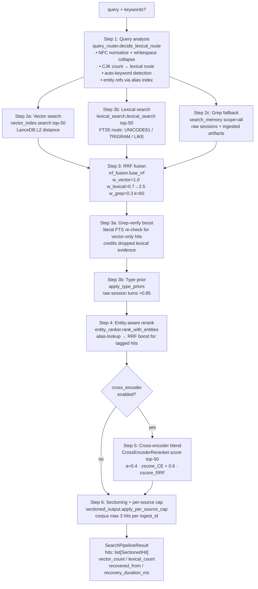

# Memory search pipeline

**Depends on:** [00_overview.md](00_overview.md), [01_data_and_entities.md](01_data_and_entities.md), [02_indexing.md](02_indexing.md)
**Related:** [04_agent_tools.md](04_agent_tools.md)

---

## 1. Purpose

The search pipeline transforms a raw query string into a ranked, sectioned list of memory hits — without invoking any LLM. It runs on every `memory_search` tool call and is the hot path for all retrieval.

Three retrieval sources run in parallel (vector, lexical, grep), their ranked lists are merged by Reciprocal Rank Fusion, an entity-aware boost is applied when the query mentions a known entity, and an optional cross-encoder reranker blends its score into the final order. The result is grouped into structural sections (CANONICAL, FRAGMENT, SESSION, INGESTED) for LLM consumption.

Temporal decay is intentionally not applied: the LLM receives `valid_from` on every hit and does its own temporal reasoning.

---

## 2. Mental model

**Three sources, one fused rank.** Vector search (LanceDB L2) and lexical search (FTS5) run to top-50 each; a grep fallback covers raw sessions and not-yet-indexed files. Reciprocal Rank Fusion merges all three in rank space — score-scale invariant, so BM25, L2, and grep all combine cleanly.

**Entity-aware nudge, not override.** When the query mentions a known alias, hits tagged with that entity receive an additional RRF contribution. Entity matching is a nudge to surface canonical pages and fresh tagged entries; it does not override semantic similarity.

**Blend, not replace.** The optional cross-encoder reranker (`BAAI/bge-reranker-base`, ~100M params, NOT an LLM) scores `(query, headline + date + summary)` pairs and blends its z-scored output into the RRF order at α=0.4. It nudges, it does not veto.

---

## 3. Diagram



---

## 4. How it works

### Step 1 — Query analysis

`decide_lexical_route` (`query_router.py`) runs synchronously before any retrieval:

1. NFC-normalizes and whitespace-collapses the query.
2. Counts CJK characters (Hiragana, Katakana, Hangul, CJK Unified and Extension blocks) to pick the FTS5 path:
   - No CJK → `UNICODE61` (`memory_fts`, BM25-ranked).
   - CJK ≥ 3 and all non-operator tokens ≥ 3 chars → `TRIGRAM` (`memory_fts_trigram`).
   - Any shorter CJK → `LIKE_SUBSTRING` (raw LIKE scan over `memory_fts`; no scoring).
3. Detects auto-keywords: URLs, file paths, UUIDs, and email addresses in the query are extracted verbatim and trigger the same lexical weight boost as an explicit `keywords` parameter.
4. Resolves entity refs by N-gram lookup against the shared alias index (see Step 4).

The output is a frozen `RoutingDecision` dataclass.

### Step 2a — Vector search

`VectorIndex.search(query, top_k=50)` embeds the query with the E5 `"query: "` prefix (multilingual-e5-small, 384-dim by default) and runs an L2 distance search over the `memory_entries` LanceDB table. The pipeline normalizes raw vector rows to a unified `memory/<class>/<id>` URI shape so the RRF step can fuse them with FTS rows for the same document.

Entity-page rows use their entity-ref URI directly (e.g. `person:deborah`); skill rows use the bare `skill/<slug>` fusion URI. Sessions are not vector-indexed; `session_summary` entries cover the semantic layer.

### Step 2b — Lexical search

`lexical_search(idx, decision, limit=50)` executes the route chosen in Step 1 against the FTS5 database:
- `UNICODE61` and `TRIGRAM` paths use `ORDER BY rank` (BM25) — the clause is load-bearing; without it SQLite returns rowid order, not relevance order.
- `LIKE_SUBSTRING` returns in table order (no scoring).

Non-operator query tokens are double-quoted before FTS5 to escape special characters (`%`, `*`, `:`). Balanced double-quoted phrases in the query are preserved as FTS5 phrase tokens.

### Step 2c — Grep fallback

`search_memory(workspace, query, scope="all", level="warm")` walks `memory/`, `sessions/`, and `ingested/` for literal matches. This is the only path for raw ingested artifacts (not in LanceDB or FTS5 by design) and a recovery path for not-yet-indexed files. Session turns are FTS-indexed since schema v6, so grep and FTS often produce overlapping URIs; RRF accumulates both contributions for the same URI.

### Step 3 — RRF fusion and adjustments

`fuse_rrf` merges the three ranked URI lists:

```
RRF_score(uri) = Σ over sources:  w_source / (k + rank_in_source(uri))
```

Weights: `w_vector = 1.0`, `w_lexical = 0.7` (boosted to `2.5` when `keywords` or auto-keyword fires), `w_grep = 0.3`. Constant `k = 60` (Cormack/Clarke/Buettcher 2009). A URI appearing in multiple sources accumulates contributions; deduplication is implicit.

After fusion, two adjustments run in order:

**Grep-verify boost:** For every fused hit that came from vector but not lexical, `_grep_verify_boost` runs a per-URI FTS MATCH using the same lexical route. A confirmed literal match gains `w_lexical / (k + rank_in_vector)` — crediting the lexical evidence the top-50 cutoff dropped.

**Type prior:** `apply_type_priors` multiplies each score by a per-type multiplier. Currently: raw session turns (`type="session"`) receive `×0.85`. Curated entries and entity pages are neutral. A session hit with strong enough evidence still wins; the prior demotes, it does not suppress.

### Step 4 — Entity-aware rerank

`extract_query_entities` tokenizes the query into N-gram windows (up to 4 words) and looks each up in the alias index (case-insensitive). When matches are found, `rank_with_entities` builds a second RRF over:
- **Entity-page sub-list:** canonical pages whose ID is in the query entity set.
- **Tagged-entry sub-list:** memory entries whose `entities` field overlaps with the query entities, sorted by `valid_from` descending.

The combined RRF of the vector list and this entity-match list produces `RankedCandidate` objects with an `adjusted_score`. The entity-match list is typically much shorter (3–5 items) than the vector list (50 items), so the entity signal is a nudge, not a veto.

When no entities are resolved (query mentions no known alias), this step is a no-op.

### Step 5 — Cross-encoder rerank (opt-in, off by default)

When `memory.search.cross_encoder.enabled = true`, `CrossEncoderReranker.score` takes the top-50 fused hits and scores each `(query, doc_text)` pair through a `sentence_transformers.CrossEncoder` model. `doc_text` is `<headline>. <valid_from>. <summary>` — enriched to prevent the reranker from being blind to dates and summaries.

The final order uses a z-score blend:

```
final(hit) = α · zscore(ce_score) + (1 − α) · zscore(rrf_score)   [α = 0.4]
```

The CE nudges the existing RRF order; it does not replace it. The default model is `BAAI/bge-reranker-base` (~100M params, MIT license, ~300–800ms CPU). If the model fails to load, the step is a no-op and the RRF order carries forward unchanged.

### Step 6 — Sectioning and per-source cap

`apply_per_source_cap` drops corpus hits beyond 3 per `ingest_id` (configurable via `memory.search.sectioning.max_per_source`) to prevent a single chunked document from monopolizing the top-K. Other classes pass through uncapped.

`SectionedHit` rows are grouped into five sections by type, rendered in order: skill → canonical → fragment → session → ingested. Empty sections are omitted. Each block carries structural markers (`=== CANONICAL: <uri> ===` … `=== END CANONICAL ===`) and a completeness qualifier when body length is known.

The pipeline returns `SearchPipelineResult` with the capped `hits`, source counts, and degradation information.

---

## 5. Key types and entry points

| Symbol | File | Role |
|--------|------|------|
| `run_search_pipeline` | `durin/memory/search_pipeline.py` | Pipeline orchestrator. Takes `workspace`, `query`, optional `keywords`, `vector_index`, `cross_encoder`. Returns `SearchPipelineResult`. Each step wrapped in try/except for graceful degradation. |
| `SearchPipelineResult` | `durin/memory/search_pipeline.py` | Frozen dataclass: `hits: list[SectionedHit]`, `vector_count`, `lexical_count`, `recovered_from`, `recovery_duration_ms`. |
| `decide_lexical_route` | `durin/memory/query_router.py` | Pure function: NFC-normalize, CJK-count, pick FTS5 route, detect auto-keywords. Returns `RoutingDecision`. No I/O. |
| `RoutingDecision` | `durin/memory/query_router.py` | Frozen dataclass: `normalized_query`, `route` (`UNICODE61` / `TRIGRAM` / `LIKE_SUBSTRING`), `cjk_chars`, `keywords`, `auto_keywords`. |
| `LexicalRoute` | `durin/memory/query_router.py` | Enum of three FTS5 paths: `UNICODE61`, `TRIGRAM`, `LIKE_SUBSTRING`. |
| `lexical_search` | `durin/memory/lexical_search.py` | Executes the routing decision against `FTSIndex`. BM25-ranked for FTS paths; insertion-order for LIKE. Returns `list[FTSHit]`. |
| `fuse_rrf` | `durin/memory/rrf_fusion.py` | Merges three ranked URI lists by RRF. `k=60`, `w_vector=1.0`, `w_lexical=0.7→2.5`, `w_grep=0.3`. Returns `list[FusedHit]`. |
| `apply_type_priors` | `durin/memory/rrf_fusion.py` | Multiplies fused scores by per-type priors. Session turns: ×0.85. Re-sorts in place. |
| `FusedHit` | `durin/memory/rrf_fusion.py` | Frozen dataclass: `uri`, `score`, `sources: tuple[str, ...]`, `ranks: dict[str, int]`. |
| `extract_query_entities` | `durin/memory/entity_ranker.py` | N-gram alias lookup against `AliasIndex`. Returns deduplicated list of entity refs mentioned in the query. |
| `rank_with_entities` | `durin/memory/entity_ranker.py` | RRF over vector ranking + entity-match sub-list. Returns `list[RankedCandidate]`. |
| `RankedCandidate` | `durin/memory/entity_ranker.py` | Dataclass: `record`, `base_score`, `adjusted_score`, `signals`. |
| `CrossEncoderReranker` | `durin/memory/cross_encoder.py` | Wraps `sentence_transformers.CrossEncoder` with lazy load, batching, retry-after-failure, and graceful degradation. `score(query, docs) -> list[float] | None`. |
| `DEFAULT_MODEL` | `durin/memory/cross_encoder.py` | `"BAAI/bge-reranker-base"` — MIT, ~100M params, multilingual. |
| `SectionedHit` | `durin/memory/sectioned_output.py` | Frozen dataclass: `uri`, `type`, `path`, `score`, `ts`, `snippet`, `summary`, `body`, `body_length`, `ingest_id`. Consumed by renderer. |
| `apply_per_source_cap` | `durin/memory/sectioned_output.py` | Drops corpus hits beyond `max_per_source` (default 3) per `ingest_id`. Other types pass through. |
| `render_sectioned` | `durin/memory/sectioned_output.py` | Groups hits by section type and renders structural markers for LLM consumption. |

---

## 6. Configuration and surfaces

| Key | Default | Effect |
|-----|---------|--------|
| `memory.search.cross_encoder.enabled` | `false` | Enables the cross-encoder rerank step (Step 5). Off by default; triggers model download on first search. |
| `memory.search.cross_encoder.model` | `"BAAI/bge-reranker-base"` | Any `sentence_transformers.CrossEncoder`-compatible model ID or local path. Validated dynamically via `probe_model`. |
| `memory.search.cross_encoder.batch_size` | `32` | Batch size for `CrossEncoder.predict` calls. |
| `memory.search.cross_encoder.top_n` | `10` | Retained for API compatibility; the blend reorders all top-50 candidates and downstream sectioning trims. |
| `memory.search.sectioning.max_per_source` | `3` | Max corpus hits per `ingest_id` in the final result. Prevents a single chunked document from monopolizing top-K. |

The pipeline is invoked by the `memory_search` tool (`04_agent_tools.md`). The tool wraps scope/level/limit logic around `run_search_pipeline`:

- `scope=undreamed` passes `vector_index=None` (skips Step 2a) and restricts hits to session/corpus types.
- `scope=dreamed` passes the vector index; grep fallback runs but the tool keeps all hit types.
- `level=cold` enriches each `SectionedHit` with the body read from disk after the pipeline returns.

The web dashboard exposes a cross-encoder toggle and model picker under Memory → Search settings. The onboarding wizard asks explicitly about enabling reranking, stating the download and latency cost.

---

## 7. Curated rationale

**RRF everywhere, not linear fusion.** Vector L2 distances and BM25 scores live on incompatible scales. RRF operates in rank space, making it scale-invariant and safe to combine across all three sources. Using the same algorithm at every fusion stage (sources, entity boost, CE blend) keeps the pipeline consistent.

**Grep as a third source.** The grep fallback is not a backup for when indices fail — it is a necessary third source for raw ingested artifacts and not-yet-indexed files, which no index covers. Its lower weight (`w_grep=0.3`) reflects that it is a best-effort literal scan, not a relevance-ranked signal.

**Lexical weight boost for identifiers.** When a query contains an email address, URL, UUID, or file path, or when the agent passes `keywords` explicitly, the lexical weight lifts from 0.7 to 2.5. This avoids a separate "exact-match pinning" mechanism and removes the need to measure keyword specificity — the presence of an identifier-shaped token is sufficient signal that the literal match matters.

**Grep-verify boost.** RRF can only credit lexical evidence within the lexical top-50 cutoff. A document that vector ranks high and literally contains the query terms — but sits just past the cutoff — would receive no lexical contribution, allowing a semantically-near distractor to outrank a literally-confirmed hit. The boost corrects this by re-verifying vector-only hits against the same FTS tables and crediting the dropped evidence at the vector rank's position.

**Cross-encoder blend, not replace.** Running the CE in full-replace mode (α=1) performed worse than RRF-only because the reranker was blind to dates and summaries when scored against bare snippets, causing it to demote gold hits. Enriching the input (`headline + valid_from + summary`) and blending at α=0.4 preserves the RRF order's accumulated evidence while letting the CE nudge on full-relevance grounds.

**Temporal decay removed.** Search must be faithful retrieval. The pipeline cannot know whether a query is temporal ("what is X doing now") or atemporal ("what does X prefer") without the LLM's context. Pre-judging recency pushes factually correct but older hits out of the top-K, causing the LLM to report absence of evidence for facts that exist. The LLM already receives `valid_from` on every hit and can reason about recency itself.
