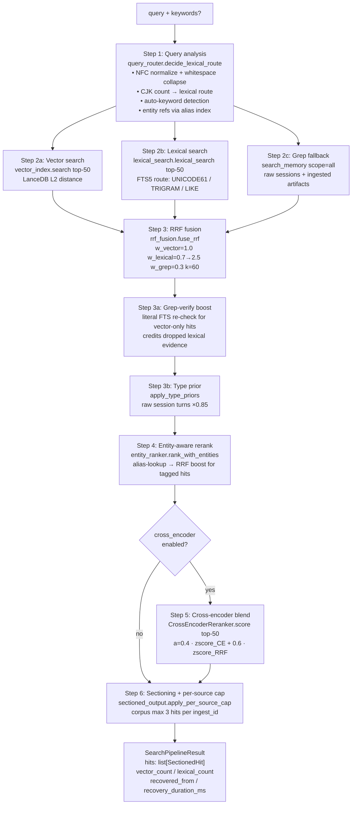

# Memory search pipeline

**Depends on:** [00_overview.md](00_overview.md), [01_data_and_entities.md](01_data_and_entities.md), [02_indexing.md](02_indexing.md)
**Related:** [04_agent_tools.md](04_agent_tools.md)

---

## 1. Purpose

The search pipeline transforms a raw query string into a ranked, sectioned list of memory hits — without invoking any LLM. It runs on every `memory_search` tool call and on the agent loop's own automatic search once per user turn, and is the hot path for all retrieval.

Three retrieval sources run over the same query (vector, lexical, grep), their ranked lists are merged by Reciprocal Rank Fusion, an entity-aware boost is applied when the query mentions a known entity, and an optional cross-encoder reranker blends its score into the final order. The result is grouped into structural sections (SKILL, CANONICAL, FRAGMENT, SESSION, INGESTED) for LLM consumption.

Temporal decay is intentionally not applied: the LLM receives `valid_from` on every hit and does its own temporal reasoning.

---

## 2. Mental model

**Three sources, one fused rank.** Vector search (LanceDB L2) and lexical search (FTS5) run to top-50 each; a grep leg covers raw ingested artifacts and the files the FTS index has not caught up with. For ordinary natural-language queries, lexical search ranks documents where loose tokens are OR-joined and scored by BM25, while double-quoted phrases and all `keywords` tokens are required. This produces matches on partial literal evidence (shared rare words) as well as exact phrases, creating a ranking independent of semantic similarity. Reciprocal Rank Fusion merges all three in rank space — score-scale invariant, so BM25, L2, and grep combine cleanly — ensuring fusion is a genuine multi-source consensus.

**Entity-aware nudge, not override.** When the query mentions a known alias, hits tagged with that entity receive an additional RRF contribution. Entity matching is a nudge to surface canonical pages and fresh tagged entries; it does not override semantic similarity.

**Blend, not replace.** The optional cross-encoder reranker (`BAAI/bge-reranker-base`, ~100M params, NOT an LLM) scores `(query, headline + date + summary)` pairs and blends its z-scored output into the RRF order at α=0.4. It nudges, it does not veto.

---

## 3. Diagram


```mermaid
flowchart TD
    Q["query + keywords?"] --> QA["Step 1: Query analysis\nquery_router.decide_lexical_route\n• NFC normalize + whitespace collapse\n• CJK count → lexical route\n• auto-keyword detection\n• entity refs via alias index"]

    QA --> VS["Step 2a: Vector search\nvector_index.search top-50\nLanceDB L2 distance"]
    QA --> LS["Step 2b: Lexical search\nlexical_search.lexical_search top-50\nFTS5 route: UNICODE61 / TRIGRAM / LIKE"]
    QA --> GR["Step 2c: Grep fallback\nsearch_memory scope=all\nraw sessions + ingested artifacts"]

    VS --> RRF["Step 3: RRF fusion\nrrf_fusion.fuse_rrf\nw_vector=1.0 w_lexical=0.7→2.5 w_grep=0.3 k=60"]
    LS --> RRF
    GR --> RRF

    RRF --> GVB["Step 3a: Grep-verify boost\nliteral FTS re-check for vector-only hits\ncredits dropped lexical evidence"]
    GVB --> TP["Step 3b: Type prior\napply_type_priors\nraw session turns ×0.85"]

    TP --> ER["Step 4: Entity-aware rerank\nentity_ranker.rank_with_entities\nalias-lookup → RRF boost for tagged hits"]

    ER --> CE{"cross_encoder\nenabled?"}
    CE -- "yes" --> CER["Step 5: Cross-encoder blend\nCrossEncoderReranker.score top-50\na=0.4 · zscore_CE + 0.6 · zscore_RRF"]
    CE -- "no" --> SEC
    CER --> SEC["Step 6: Sectioning + per-source cap\nsectioned_output.apply_per_source_cap\ncorpus max 3 hits per ingest_id"]

    SEC --> OUT["SearchPipelineResult\nhits: list[SectionedHit]\nvector_count / lexical_count\nrecovered_from / recovery_duration_ms"]
```

---

## 4. How it works

### Step 1 — Query analysis

`decide_lexical_route` (`query_router.py`) runs synchronously before any retrieval:

1. NFC-normalizes and whitespace-collapses the query, then **bounds it** to
   `MAX_QUERY_CHARS` / `MAX_QUERY_TOKENS` (keeping the head; `truncated` is set on the
   decision). The bound is a hard invariant for every downstream step: quoting each
   token of an unbounded text into one FTS5 MATCH makes sqlite allocate memory
   proportional to the term count (~800MB for a 380KB transcript passed as a query in
   the 2026-07-18 incident) while matching nothing. A caller holding a long text wants
   retrieval *about* it, not *of* it; callers that know which window matters (e.g. the
   dream's discovery pass passes the most recent turns) slice before calling.
2. Counts CJK characters (Hiragana, Katakana, Hangul, CJK Unified and Extension blocks) to pick the FTS5 path:
   - No CJK → `UNICODE61` (`memory_fts`, BM25-ranked).
   - CJK ≥ 3 and all non-operator tokens ≥ 3 chars → `TRIGRAM` (`memory_fts_trigram`).
   - Any shorter CJK → `LIKE_SUBSTRING` (raw LIKE scan over `memory_fts`; no scoring).
3. Detects auto-keywords: URLs, file paths, UUIDs, and email addresses in the query are extracted verbatim and trigger the same lexical weight boost as an explicit `keywords` parameter.
4. Resolves entity refs by N-gram lookup against the shared alias index (see Step 4).

The output is a frozen `RoutingDecision` dataclass.

### Step 2a — Vector search

`VectorIndex.search(query, top_k=50, where=...)` embeds the query with the E5 `"query: "` prefix (multilingual-e5-small, 384-dim by default) and runs an L2 distance search over the `memory_entries` LanceDB table. The scope predicate's `vector_where` clause, when the caller supplies one, prefilters the table before the top-k cut — the excluded population never competes for a slot. The pipeline normalizes raw vector rows to a unified `memory/<class>/<id>` URI shape so the RRF step can fuse them with FTS rows for the same document.

Entity-page rows use their entity-ref URI directly (e.g. `person:deborah`); skill rows use the bare `skill/<slug>` fusion URI. Sessions are not vector-indexed; `session_summary` entries cover the semantic layer.

### Step 2b — Lexical search

`lexical_search(idx, decision, limit=50, include_types=..., exclude_types=...)` executes the route chosen in Step 1 against the FTS5 database, restricted to the scope predicate's type set when the caller supplies one:
- `UNICODE61` and `TRIGRAM` paths use `ORDER BY rank` (BM25) — the clause is load-bearing; without it SQLite returns rowid order, not relevance order.
- `LIKE_SUBSTRING` returns in table order (no scoring).

Every route runs one expression, built by `build_fts_expression`: the query's loose tokens are OR-joined so bm25 ranks partial matches — a sentence finds the note that shares its rare words, not only a document containing every token. Balanced double-quoted phrases in the query, and every token of `keywords` (explicit or the router's own `auto_keywords`), are required (AND) — that is where exactness lives. `LIKE_SUBSTRING` expresses the same required/optional split as `LIKE` clauses instead of an FTS5 MATCH, since the trigram table can't tokenise the short CJK tokens that route to it. Every term is double-quoted before FTS5 to escape special characters (`%`, `*`, `:`) and to neutralise the FTS5 boolean keywords (`AND`/`OR`/`NOT`/`NEAR`) — the recall query is natural language, so a query beginning with a word like "not" must not reach the parser as a dangling operator.

An entity page's row also carries the slug half of each `derived_from` ref (see `02_indexing.md`), so an ordinary lexical query can match an entity purely through the document it was distilled from — a query for the document's title can surface an entity that never mentions that title in its own name or body.

### Step 2c — Grep fallback

`search_memory(workspace, query, scope="all", level="warm", coverage=…)` walks `memory/`, `sessions/`, and `ingested/` for literal matches. This is the only path for raw ingested artifacts (not in LanceDB or FTS5 by design) and the recovery path for files the FTS index has not caught up with. The pipeline hands the walk an `IndexCoverage` (`durin/memory/search.py`) built from `FTSIndex.indexed_paths()` — every indexed file with the mtime recorded when its newest row went in — and the walk reads only files with no row or newer on disk than their row: a fresh write the watcher has not drained, a session with turns since its last indexing, an edited page. Everything the index holds unchanged is skipped (the lexical leg already covers it); ingested artifacts are always read. Without `coverage` (the CLI's literal search) every file is read. The walk reports `grep_scanned` / `grep_skipped` on the pipeline result and the `memory.recall` row; on a workspace with thousands of entity pages the full walk cost seconds per search, the covered walk milliseconds. One consequence the full walk used to hide: an FTS row holds only uri, path and type, while headline, summary and body length ride on the vector row — so a memory entry only the lexical leg surfaced (no embedding model, no vector row yet, a row outside the vector top-k) carried nothing to render. The pipeline now reads those display fields from the entry on disk for such hits (`_entry_meta_from_disk`, the same summary rule the vector upsert materialises), one file per hit, bounded by the fused list.

`search_memory` addresses a canonical page by its display path (`memory/entity_page/<ref>`) — the shape drill-down and the webui expect — so `_safe_grep_fallback` rewrites it to the bare ref before fusion and carries the display path in `path`.

### The fusion-URI invariant

All three arms must key a document by the **same** string, or RRF treats one document as two: it occupies two of the caller's `limit` slots and splits its score, so a well-matched document can fall below top-K even though every arm found it. The fusion key is not always the display path — per class:

| Class | Fusion URI | Display path |
|---|---|---|
| Entity page | `<type>:<slug>` | `memory/entity_page/<type>:<slug>` |
| Skill | `skill/<slug>` | `skills/<slug>/SKILL.md` |
| Episodic / stable / corpus | `memory/<class>/<id>` | same |
| Reference document / chunk | `reference:<slug>` (FTS, whole document) · `memory/reference/<id>` (vector chunk + grep) | same |
| Session turn | `sessions/<key>.md#turn-N` | same |

The FTS indexer's `_payload_for` is the reference shape; the vector normaliser and the grep fallback both rewrite into it. The result layer re-derives the display path from the fusion URI.

### Step 3 — RRF fusion and adjustments

`fuse_rrf` merges the three ranked URI lists:

```
RRF_score(uri) = Σ over sources:  w_source / (k + rank_in_source(uri))
```

Weights: `w_vector = 1.0`, `w_lexical = 0.7` (boosted to `2.5` when `keywords` or auto-keyword fires), `w_grep = 0.3`. Constant `k = 60` (Cormack/Clarke/Buettcher 2009). A URI appearing in multiple sources accumulates contributions; deduplication is implicit.

After fusion, two adjustments run in order:

**Grep-verify boost:** For every fused hit that came from vector but not lexical, `_grep_verify_boost` runs one batched query per route — `MATCH ... AND uri IN (...)` (or the LIKE equivalent) — against the exact expression `lexical_search` would have run for that route — the same required/optional split, not a separate, stricter all-terms check, and not one query per candidate. A confirmed hit gains `"lexical"` in `sources` and `w_lexical / (k + rank_in_vector)` — crediting the lexical evidence the top-50 cutoff dropped.

**Type prior:** `apply_type_priors` multiplies each score by a per-type multiplier. Currently: raw session turns (`type="session"`) receive `×0.85`. Curated entries and entity pages are neutral. A session hit with strong enough evidence still wins; the prior demotes, it does not suppress.

### Step 4 — Entity-aware rerank

`extract_query_entities` tokenizes the query into N-gram windows (up to 4 words) and looks each up in the alias index (case-insensitive). When matches are found, `rank_with_entities` builds a second RRF over:
- **Entity-page sub-list:** canonical pages whose ID is in the query entity set.
- **Tagged-entry sub-list:** memory entries whose `entities` field overlaps with the query entities, sorted by `valid_from` descending.

The combined RRF of the vector list and this entity-match list produces `RankedCandidate` objects with an `adjusted_score`. The entity-match list is typically much shorter (3–5 items) than the vector list (50 items), so the entity signal is a nudge, not a veto.

When no entities are resolved (query mentions no known alias), this step is a no-op.

### Step 5 — Cross-encoder rerank (opt-in, off by default)

When `memory.search.cross_encoder.enabled = true`, `CrossEncoderReranker.score` takes the top-50 fused hits and scores each `(query, doc_text)` pair through a `sentence_transformers.CrossEncoder` model. `doc_text` is `<headline>. <valid_from>. <summary>` — enriched to prevent the reranker from being blind to dates and summaries.

The final order uses a z-score blend:

```
final(hit) = α · zscore(ce_score) + (1 − α) · zscore(rrf_score)   [α = 0.4]
```

The CE nudges the existing RRF order; it does not replace it. The default model is `BAAI/bge-reranker-base` (~100M params, MIT license, ~300–800ms CPU). If the model fails to load, the step is a no-op and the RRF order carries forward unchanged.

### Step 6 — Sectioning and per-source cap

`apply_per_source_cap` drops ingested-document hits — corpus and reference chunks — beyond the per-document cap (3 by default, configurable via `memory.search.sectioning.max_per_source`), so a single chunked document cannot monopolize the top-K. Corpus chunks group by `ingest_id`; reference chunks group by their parent document. Other classes pass through uncapped.

`SectionedHit` rows are grouped into five sections by type, rendered in order: skill → canonical → fragment → session → ingested. Empty sections are omitted. Each block carries structural markers (`=== CANONICAL: <uri> ===` … `=== END CANONICAL ===`) and a completeness qualifier when body length is known. At warm level every class's summary is cut to `memory.search.warm_excerpt_chars` — for fragment, session and ingested hits that bound applies to the materialized summary directly; for a canonical hit it covers the name/aliases line, the attributes line and the body TOGETHER (the name line always renders whole, the attributes line is cut first at a whole-attribute boundary, and the body gets whatever budget is left). Cold level renders the whole content instead. Exception: raw session turns keep their indexed excerpt at either level; their backing file is a transcript, not an entry, so the disk read that would fill `body` at cold cannot, and the warm summary is kept rather than falling through to the short snippet. The completeness qualifier compares the rendered text with the full, uncut length, so a cut hit shows `preview N/M` and an uncut one shows `complete`. A block outside the canonical and skill sections ends with an `Entities: …` tail listing the entity refs the hit is tagged with — the thread from a fragment or a session summary back to the canonical pages it is about; the refs travel from the vector row through `SectionedHit.entities` — a hit surfaced through the lexical (FTS) arm only carries no `entities` metadata to propagate, so its block has no tail.

A second, response-wide budget (`memory.search.warm_max_chars`) governs which blocks render in full. Hits render section by section, in the skill → canonical → fragment → session → ingested order, highest score first within each section — not one global ranking. Once a hit's full block would push the running total past the budget, that hit and every hit after it — in the current section and every section still to come — render as a one-line headline pointer instead (`- <headline> (<uri>; drill for the body)`), still grouped under its section: a one-way ratchet, not a per-hit re-check. The one exception is the very first block of the whole rendering (the highest-ranked hit overall): it always renders whole even when it alone exceeds the budget, so a rendering never comes back with zero content — the ratchet only starts from the second block on. Past that exemption, a block is never partially cut — a hit is either whole or a pointer. Section headers and pointer lines sit outside the budget check and always print, so it bounds the full blocks rather than capping the total rendered size. Cold level is not subject to this budget.

The pipeline returns `SearchPipelineResult` with the capped `hits`, source counts, and degradation information.

---

## 5. Key types and entry points

| Symbol | File | Role |
|--------|------|------|
| `run_search_pipeline` | `durin/memory/search_pipeline.py` | Pipeline orchestrator. Takes `workspace`, `query`, optional `keywords`, `vector_index`, `cross_encoder`, `scope`. Returns `SearchPipelineResult`. Each step wrapped in try/except for graceful degradation. |
| `SearchPipelineResult` | `durin/memory/search_pipeline.py` | Frozen dataclass: `hits: list[SectionedHit]`, `vector_count`, `lexical_count`, `recovered_from`, `recovery_duration_ms`. |
| `decide_lexical_route` | `durin/memory/query_router.py` | Pure function: NFC-normalize, CJK-count, pick FTS5 route, detect auto-keywords. Returns `RoutingDecision`. No I/O. |
| `RoutingDecision` | `durin/memory/query_router.py` | Frozen dataclass: `normalized_query`, `route` (`UNICODE61` / `TRIGRAM` / `LIKE_SUBSTRING`), `cjk_chars`, `keywords`, `auto_keywords`. |
| `LexicalRoute` | `durin/memory/query_router.py` | Enum of three FTS5 paths: `UNICODE61`, `TRIGRAM`, `LIKE_SUBSTRING`. |
| `lexical_search` | `durin/memory/lexical_search.py` | Executes the routing decision against `FTSIndex`. BM25-ranked for FTS paths; insertion-order for LIKE. Returns `list[FTSHit]`. |
| `fuse_rrf` | `durin/memory/rrf_fusion.py` | Merges three ranked URI lists by RRF. `k=60`, `w_vector=1.0`, `w_lexical=0.7→2.5`, `w_grep=0.3`. Returns `list[FusedHit]`. |
| `apply_type_priors` | `durin/memory/rrf_fusion.py` | Multiplies fused scores by per-type priors. Session turns: ×0.85. Re-sorts in place. |
| `FusedHit` | `durin/memory/rrf_fusion.py` | Frozen dataclass: `uri`, `score`, `sources: tuple[str, ...]`, `ranks: dict[str, int]`. |
| `extract_query_entities` | `durin/memory/entity_ranker.py` | N-gram alias lookup against `AliasIndex`. Returns deduplicated list of entity refs mentioned in the query. |
| `rank_with_entities` | `durin/memory/entity_ranker.py` | RRF over vector ranking + entity-match sub-list. Returns `list[RankedCandidate]`. |
| `RankedCandidate` | `durin/memory/entity_ranker.py` | Dataclass: `record`, `base_score`, `adjusted_score`, `signals`. |
| `CrossEncoderReranker` | `durin/memory/cross_encoder.py` | Wraps `sentence_transformers.CrossEncoder` with lazy load, batching, retry-after-failure, and graceful degradation. `score(query, docs) -> list[float] | None`. |
| `DEFAULT_MODEL` | `durin/memory/cross_encoder.py` | `"BAAI/bge-reranker-base"` — MIT, ~100M params, multilingual. |
| `SectionedHit` | `durin/memory/sectioned_output.py` | Frozen dataclass: `uri`, `type`, `path`, `score`, `ts`, `snippet`, `summary`, `body`, `body_length`, `ingest_id`, `entities`, `derived_from`. Consumed by renderer. |
| `apply_per_source_cap` | `durin/memory/sectioned_output.py` | Drops ingested-document hits (corpus and reference chunks) beyond `max_per_source` (default 3) per source document. Other types pass through. |
| `render_sectioned` | `durin/memory/sectioned_output.py` | Groups hits by section type and renders structural markers for LLM consumption. Optional `max_chars` bounds the total size — hits past the budget render as headline pointers instead of full blocks. |

---

## 6. Configuration and surfaces

| Key | Default | Effect |
|-----|---------|--------|
| `memory.search.cross_encoder.enabled` | `false` | Enables the cross-encoder rerank step (Step 5). Off by default; triggers model download on first search. |
| `memory.search.cross_encoder.model` | `"BAAI/bge-reranker-base"` | Any `sentence_transformers.CrossEncoder`-compatible model ID or local path. Validated dynamically via `probe_model`. |
| `memory.search.cross_encoder.batch_size` | `32` | Batch size for `CrossEncoder.predict` calls. |
| `memory.search.cross_encoder.top_n` | `10` | Retained for API compatibility; the blend reorders all top-50 candidates and downstream sectioning trims. |
| `memory.search.sectioning.max_per_source` | `3` | Max ingested-document hits (corpus and reference chunks) per source document in the final result. Prevents a single chunked document from monopolizing top-K. |
| `memory.search.warm_excerpt_chars` | `600` | Per-hit warm-level summary cut, in characters, applied to every class. The completeness qualifier reports how much of the full content that is. |
| `memory.search.warm_max_chars` | `8000` | Per-response warm-level rendering budget, in characters. Hits past it render as headline pointers instead of full blocks. Not applied at `level=cold`. |

The pipeline is invoked by the `memory_search` tool (`04_agent_tools.md`). The tool wraps scope/level/limit logic around `run_search_pipeline`:

- **Scope.** The tool builds one `ScopePredicate` from `scope` and `kinds` (`durin/memory/scope.py`) and passes it into `run_search_pipeline` as `scope=`. The predicate carries a `vector_where` clause and an FTS type set; the pipeline applies it inside both the vector leg (Step 2a) and the lexical leg (Step 2b) as a genuine prefilter, before either index's top-k cut. Library is a class set, not a single class: `reference` (ingested documents and their chunks) plus the legacy `corpus` class that predates the reference/ingest split — both `class_name`s on the vector leg, both FTS `type`s on the lexical leg. The grep leg walks files and has no index to filter, so it is filtered by uri instead, independently for each axis the predicate carries: Library material (both classes) by the `reference:…` / `memory/reference/…` / `memory/corpus/…` / `ingested/…` prefixes, skills by the `skill/…` prefix, session material by the `sessions/…` and `memory/session_summary/…` prefixes, and — for the dream's entity-pages predicate — entity material by uri shape (a bare `<type>:<slug>` ref, never a session or memory path) — all applied before RRF fusion so excluded material never enters the fused list. `scope=all` excludes the whole Library class set; `scope=dreamed` also excludes the session classes (`session`, `session_summary`); `scope=undreamed` is exactly those two classes; `scope=library` makes the Library the sole content; `kinds="skill"`/`"fact"` narrow `all` and `dreamed` further to skills-only or skills-excluded (ignored under `library` and `undreamed`, which never hold skills) — across all three legs.
- **Reference-hit content preview (`_attach_reference_bodies`).** A reference chunk's indexed `summary` is the head of its raw text — for scraped web/PDF docs that is the metadata header (title, URL, author, date), so the agent's preview would show page chrome, not substance. Before rendering, `memory_search` reads the actual chunk from the `.chunks.jsonl` sidecar and strips that leading boilerplate (`reference.strip_scraped_boilerplate`), so the preview leads with content; `body_length` stays the raw length so the block still shows `preview N/M` and the agent knows to drill for the rest. The embedding is left untouched — stripping the header from it measured neutral (the boilerplate does not move vector rank).
- Every indexed scope gets the vector index; raw session turns are FTS- and grep-only, so under `scope=undreamed` the vector leg contributes session summaries.
- `level=cold` enriches each `SectionedHit` with the body read from disk after the pipeline returns.
- **In-context dedup.** Hits whose text the caller's prompt already carries collapse to pointer lines instead of being rendered twice: the always-on guidance pages the pinned block renders whole, anything the turn's automatic search already fenced into the message, and any hit whose body is contained in its hot-layer block. The principal's page is judged by containment rather than membership, because the pinned block caps its body. Subagents, whose prompt carries no hot layer, skip the dedup entirely.

The web dashboard exposes a cross-encoder toggle and model picker under Memory → Search settings. The onboarding wizard asks explicitly about enabling reranking, stating the download and latency cost.

---

## 7. Curated rationale

**RRF everywhere, not linear fusion.** Vector L2 distances and BM25 scores live on incompatible scales. RRF operates in rank space, making it scale-invariant and safe to combine across all three sources. Using the same algorithm at every fusion stage (sources, entity boost, CE blend) keeps the pipeline consistent.

**Grep as a third source.** The grep leg is not a backup for when indices fail — it is a necessary third source for raw ingested artifacts and files the indexes have not caught up with, which no index covers. That is also why it reads only those files (index coverage, above): re-reading what the FTS index already holds duplicated the lexical leg at file-walk prices. Its lower weight (`w_grep=0.3`) reflects that it is a best-effort literal scan, not a relevance-ranked signal.

**Lexical weight boost for identifiers.** When a query contains an email address, URL, UUID, or file path, or when the agent passes `keywords` explicitly, the lexical weight lifts from 0.7 to 2.5. This avoids a separate "exact-match pinning" mechanism and removes the need to measure keyword specificity — the presence of an identifier-shaped token is sufficient signal that the literal match matters.

**Grep-verify boost.** RRF can only credit lexical evidence within the lexical top-50 cutoff. A document that vector ranks high and literally contains the query terms — but sits just past the cutoff — would receive no lexical contribution, allowing a semantically-near distractor to outrank a literally-confirmed hit. The boost corrects this by re-verifying vector-only hits against the same FTS tables and crediting the dropped evidence at the vector rank's position. It runs the identical expression the lexical leg would build for the query, so it is not a second, stricter matcher — a hit sharing only some of the query's loose words verifies exactly as it would in the lexical leg itself.

**Cross-encoder blend, not replace.** Running the CE in full-replace mode (α=1) performed worse than RRF-only because the reranker was blind to dates and summaries when scored against bare snippets, causing it to demote gold hits. Enriching the input (`headline + valid_from + summary`) and blending at α=0.4 preserves the RRF order's accumulated evidence while letting the CE nudge on full-relevance grounds.

**Temporal decay removed.** Search must be faithful retrieval. The pipeline cannot know whether a query is temporal ("what is X doing now") or atemporal ("what does X prefer") without the LLM's context. Pre-judging recency pushes factually correct but older hits out of the top-K, causing the LLM to report absence of evidence for facts that exist. The LLM already receives `valid_from` on every hit and can reason about recency itself.
