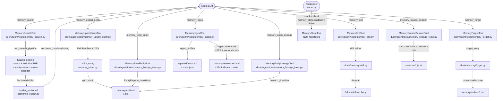

# Memory: Agent Tools

## Purpose

This document specifies the tool API surface that the agent LLM sees for memory
operations. Five core tools are live: `memory_search`, `memory_upsert_entity`,
`memory_ingest`, `memory_drill`, and `memory_forget`. Three additional
**read-only inspection tools** — `memory_read_entity`, `memory_entity_lineage`,
and `memory_source_session` — are registered in the same auto-discovery path and
available to the main agent as well as to the Dream Tier 2 sub-agent. A seventh
class, `memory_store`, is compiled into the codebase but disabled at load time —
it is documented here for completeness.

These are the **only** memory-related tools the agent can invoke. Everything
beyond this boundary — index internals, RRF coefficients, cross-encoder weights,
LanceDB schema — is invisible to the LLM.

---

## Mental model

**Read tool + write tools + delete tool + inspection tools.** `memory_search` is
the primary read surface. The two write tools split by target:
`memory_upsert_entity` for facts about a *thing* (a person, company, product,
topic, place), `memory_ingest` for whole documents. `memory_drill` fetches a
full body by URI when the search result was truncated. `memory_forget` archives
an entry and drops its index rows — the only correct in-band deletion path. The
three inspection tools (`memory_read_entity`, `memory_entity_lineage`,
`memory_source_session`) are general read-only capabilities for examining entity
pages and their provenance; they never modify state.

**Routing is internal.** The agent passes a plain `query` string to
`memory_search`; the tool routes internally through vector + lexical search,
RRF fusion, entity-aware rerank, and optional cross-encoder rerank (see
`03_search_pipeline.md`). The agent never chooses a search strategy.

**Write path is immediate.** Both write tools are synchronous: `memory_upsert_entity`
calls `write_entity` with a CAS commit before returning; `memory_ingest` stores
the verbatim file, writes a reference entry, and indexes it in the same call.
The agent does not need to wait for a Dream pass to make its writes searchable.

---

## Diagram



---

## How it works

### Tool registration

`ToolLoader` (`durin/agent/tools/loader.py`) scans the `durin.agent.tools`
package at startup. For each discovered `Tool` subclass it calls
`tool_cls.enabled(ctx)` before calling `create(ctx)`. `MemoryStoreTool.enabled()`
returns `False` unconditionally, so it is never instantiated and never appears
in the LLM's tool list. The five live tools return `True` (or inherit the
default `True` from `Tool.enabled`).

### `memory_search`

**File:** `durin/agent/tools/memory_search.py`

The tool accepts `query` (required) plus optional `scope`, `level`, `keywords`,
`limit`, and `kinds`. It delegates the full pipeline to
`run_search_pipeline` (`durin/memory/search_pipeline.py`), which handles query
routing, parallel vector + lexical retrieval, RRF fusion, entity-aware rerank,
and optional cross-encoder rerank.

The result is rendered by `render_sectioned` (`durin/memory/sectioned_output.py`)
into the `sectioned_rendered` string the LLM consumes. Raw result dicts are
omitted from the agent-path response (`include_raw_results=False` in `create()`)
to avoid doubling the token cost.

`scope='archive'` takes a separate code path: an on-demand substring walk of
`memory/archive/` with no vector or FTS involvement — a recovery surface only.

A context-dedup step (`durin/memory/context_dedup.py`) collapses hits whose
content is already present in the system-prompt hot layer into pointer lines,
preventing redundant injection. This is enabled on the agent path, disabled for
subagents (which have no hot layer in their prompt).

**Parameters:**

| Param | Default | Description |
|---|---|---|
| `query` | required | Natural-language or exact-identifier query. Short topical phrase preferred. |
| `scope` | `all` | `all` = dreamed + undreamed; `dreamed` = structured memory; `undreamed` = raw sessions + ingested grep; `archive` = on-demand recovery walk. |
| `level` | `warm` | `warm` = headline + summary; `cold` = full body (high token cost). |
| `keywords` | — | Literal string for exact-match boost (email, UUID, path). Biases RRF toward lexical. |
| `limit` | 10 | Final result count. Clamped to [1, 50] defensively even with schema bounds declared. |
| `kinds` | `all` | `all` = everything; `skill` = skill procedures only; `fact` = everything except skills. |

**Return shape** (agent path, `include_raw_results=False`):

```json
{
  "total": 5,
  "strategy": "hybrid",
  "ranking": "entity_aware",
  "sectioned_rendered": "=== CANONICAL: person:marcelo (complete) ===\n..."
}
```

`strategy` is derived from what the pipeline actually used (`hybrid` / `vector`
/ `lexical` / `grep`). `ranking` is `entity_aware` when the query contained
recognisable entity references, `default` otherwise. `recovered_from` and
`recovery_duration_ms` appear only when the pipeline recovered from a source
failure; they are absent on clean runs.

### `memory_upsert_entity`

**File:** `durin/agent/tools/memory_upsert_entity.py`

The primary write tool. The agent provides `ref` (`<type>:<slug>`), optional
`name`, `aliases`, `relations`, `derived_from`, and `body` prose. The tool
assembles `FieldPatch` objects for each field, clears any prior delete tombstone
for the ref, then calls `write_entity` under `author_scope("agent_created")`.

`write_entity` reads the current page at HEAD, applies patches with author
precedence (`user > dream > agent`), and commits via dulwich plumbing with a
CAS (`refs.set_if_equals`), retrying up to 30 times on contention.

Body is appended by default (`body_mode="append"`). A `body_mode="replace"` over
a user-authored body is demoted to an append by the write path.

The agent deliberately has no `attributes` parameter — the Dream extract pass
reads the prose `body` and writes typed attributes. This keeps the write
interface simple and lets the LLM focus on facts rather than schema.

**Return:**

```json
{"ref": "company:mxhero", "committed": true}
```

`committed` is the CAS result. `retries` is recorded in telemetry but not
returned to the agent.

### `memory_ingest`

**File:** `durin/agent/tools/memory_ingest.py`

Ingests a local file (markdown or plain text) into memory as a reference. The
storage model has three steps, all in a single call:

1. The verbatim file is copied to `ingested/<id>/source.*` + `meta.json`
   (always; grep-able via `scope="undreamed"`).
2. The whole document is written to `memory/references/<slug>.md` and
   FTS-indexed as one lexical unit via `reindex_one_file`.
3. The document is split into token-aware chunks (up to 512 tokens each, matching
   the E5 embedder's `max_seq`) and each chunk is vector-indexed keyed
   `<ref>#<idx>` via `upsert_reference_chunk`.

Steps 2 and 3 are best-effort: a failure does not roll back the verbatim copy.
When memory is disabled (no embedding model), only step 1 runs.

The `id` is `sha256(filename + "\0" + content)[:12]` — re-ingesting the same
file with the same name is idempotent. Renaming the file before re-ingest
produces a new id and a new entry.

`id` and `reference` are emitted first in the response so they survive the 16 KB
agent-result head-truncation on large documents.

**Return:**

```json
{
  "id": "a3f9c0112b44",
  "reference": "reference:my-doc-slug",
  "saved_to": "/abs/path/.durin/ingested/a3f9c0112b44/source.md",
  "meta_path": "/abs/path/.durin/ingested/a3f9c0112b44/meta.json",
  "size_bytes": 14200,
  "content": "…full text of ingested file…"
}
```

`reference` is present only when the reference write succeeded. `content` is
the full file text, returned so the agent can read it in the same turn without a
follow-up `memory_drill`.

**Scope is deliberately local files only.** URL fetch and inline content are not
supported. Web content should go through `web_fetch` first; facts about a
specific thing should go through `memory_upsert_entity`.

### `memory_drill`

**File:** `durin/agent/tools/memory_drill.py`

Reads the full content of one or more memory items by URI. Accepts either `uri`
(single string) or `uris` (list, max 10 — `MAX_BATCH_URIS`). The two are
mutually exclusive.

The batch form runs drills concurrently via `asyncio.gather` +
`asyncio.to_thread`. Individual failures in a batch return an `error` field on
the failing record without aborting the rest.

**When to call:** only when a `memory_search` result block is marked
`(preview N/M)` — N chars shown, M chars exist. When the block is marked
`(complete)`, drill returns the same text and wastes a round-trip.

**URI shapes accepted** (routed by `durin/memory/drill.py`):

| URI form | What it addresses |
|---|---|
| `memory/<class>/<id>` | Memory entries (episodic, stable, corpus, reference). `.md` appended automatically. |
| `memory/entity_page/<type>:<slug>` | Entity page URI shape that `memory_search` emits. Translated to `memory/entities/<type>/<slug>.md`. |
| `memory/entities/<type>/<slug>.md` | Direct on-disk entity page path. |
| `memory/archive/<class>/<id>.md` | Archived content from `scope='archive'` searches. |
| `sessions/<key>.md` (optionally `#turn-N`) | Session transcript, optionally a specific turn. |
| `ingested/<id>/source.md` (optionally `#anchor`) | Verbatim ingested document, optionally a markdown section. |
| `skills/<slug>/SKILL.md` | Skill file. |
| Any other workspace-relative path | Read as-is. |

**Return (single):**

```json
{"uri": "memory/entity_page/person:marcelo", "content": "---\ntype: person\n…"}
```

**Return (batch):**

```json
{
  "results": [
    {"uri": "…", "content": "…"},
    {"uri": "…", "error": "not found"}
  ]
}
```

### `memory_forget`

**File:** `durin/agent/tools/memory_forget.py`

Archives a memory entry and drops its FTS + vector index rows, making it stop
appearing in `memory_search`. This is the only correct in-band deletion path;
direct `rm` or `mv` under `memory/` would leave orphaned index rows.

The tool delegates to `forget_entry` (`durin/memory/forget.py`), which:
- Moves the file to `memory/archive/<class>/<id>.md`.
- Drops the FTS rows for the URI.
- Drops the vector index rows via `vector_index.delete_ids` — model-free, so
  forgetting never loads the embedding model.

Refusing entity pages (`memory/entities/…`) is intentional: entities have their
own lifecycle (absorb, revert) managed through `memory_upsert_entity` and the
Dream refine pass.

The archive is reversible: an archived entry can be recovered by moving it back
and calling `reindex_one_file`.

**Parameters:** `uri` (required, `memory/<class>/<id>` form) + optional `reason`
(recorded in archive frontmatter, defaults to `"agent_forget"`).

**Return:**

```json
{"uri": "memory/episodic/abc123", "archived_to": "memory/archive/episodic/abc123.md", "status": "forgotten"}
```

### `memory_read_entity`

**File:** `durin/agent/tools/memory_lineage_tools.py`

Reads the **full page** of a single entity — frontmatter, attributes, relations,
provenance map, and body — serialized via `EntityPage.to_markdown()`. This is a
deeper view than a `memory_search` result: search results can be truncated and
do not include raw provenance. Use `memory_read_entity` when you need the
complete current state of a known entity.

This tool is registered in the auto-discovery path and is available to the main
agent as well as to internal sub-agents (e.g. the Dream Tier 2 judge).

**Parameters:** `ref` (required) — entity ref in `<type>:<slug>` form (e.g. `person:marcelo`).

**Return:**

```json
{"ref": "place:torrent", "markdown": "---\ntype: place\nname: Torrent\n…"}
```

Returns `{"error": "no entity <ref>"}` when the ref does not exist.

### `memory_entity_lineage`

**File:** `durin/agent/tools/memory_lineage_tools.py`

Returns the **git commit history** of an entity page — up to 20 commits, each
with short SHA, ISO timestamp, author identity, and the full commit message
(including RFC822 trailers from absorb merges: `Absorbed:`, `Into:`, `Reason:`,
`Judge-Confidence:`). This lets the agent answer questions like: is this a newly
minted entity or a long-standing one? Has it ever been merged from another page?
Who last modified it and why?

**Parameters:** `ref` (required) — entity ref in `<type>:<slug>` form.

**Return:**

```json
{
  "ref": "place:torrent",
  "commits": [
    {"sha": "a3f9c0112b", "when": "2026-06-24T03:01:00+00:00",
     "author": "durin-dream <dream@durin.local>",
     "message": "absorb place:torrent-valencia into place:torrent\n\nAbsorbed: place:torrent-valencia\n…"}
  ]
}
```

Returns `{"error": "lineage unavailable: …", "commits": []}` when the entity
page has no git history (e.g. just created and not yet committed).

### `memory_source_session`

**File:** `durin/agent/tools/memory_lineage_tools.py`

Reads the **conversation turns** an entity was distilled from: the session turns
recorded in each patch's `source_ref` provenance chain plus the `derived_from`
reference documents. This is the primary surface for understanding *why* the
entity holds a particular fact — tracing it back to the exact conversation that
produced it.

**Parameters:** `ref` (required) — entity ref in `<type>:<slug>` form.

**Return:**

```json
{
  "ref": "place:torrent",
  "sources": [
    {"ref": "[[sessions/abc123.md#turn-5]]", "turn": 5,
     "content": "Torrent is the city in Valencia where Marcelo grew up…"}
  ]
}
```

Returns an empty `sources` list when no provenance source refs are recorded or
the referenced session files are no longer present.

---

### `memory_store` (disabled)

**File:** `durin/agent/tools/memory_store.py`

`MemoryStoreTool.enabled()` returns `False`. The loader skips it at startup;
the LLM never sees it. In the current entity-centric model, facts about things
are written via `memory_upsert_entity` and documents via `memory_ingest`;
session interactions are left for the Dream to distil.

The internal `store_memory` function the class wraps is still used by internal
callers (compaction summaries, ingest pipelines). The class is retained so a
future re-enable starts from a correct implementation.

---

## Key types and entry points

| Symbol | File | Role |
|---|---|---|
| `MemorySearchTool` | `durin/agent/tools/memory_search.py` | `memory_search` tool. Delegates to `run_search_pipeline`; builds cross-encoder lazily from config; renders output via `render_sectioned`. |
| `MemoryUpsertEntityTool` | `durin/agent/tools/memory_upsert_entity.py` | `memory_upsert_entity` tool. Assembles `FieldPatch` list, calls `write_entity` under `author_scope("agent_created")`. |
| `MemoryIngestTool` | `durin/agent/tools/memory_ingest.py` | `memory_ingest` tool. Three-step store: verbatim copy + reference write + FTS/vector index. |
| `MemoryDrillTool` | `durin/agent/tools/memory_drill.py` | `memory_drill` tool. Single or batch URI read, delegating to `drill()`. `MAX_BATCH_URIS = 10`. |
| `MemoryForgetTool` | `durin/agent/tools/memory_forget.py` | `memory_forget` tool. Delegates to `forget_entry`; drops FTS + vector rows without loading the embedding model. |
| `MemoryReadEntityTool` | `durin/agent/tools/memory_lineage_tools.py` | `memory_read_entity` tool. Returns `EntityPage.to_markdown()` for a single ref — complete page, no truncation. |
| `MemoryEntityLineageTool` | `durin/agent/tools/memory_lineage_tools.py` | `memory_entity_lineage` tool. Walks the dulwich git log for an entity page; returns up to 20 commits with SHA, timestamp, author, message. |
| `MemorySourceSessionTool` | `durin/agent/tools/memory_lineage_tools.py` | `memory_source_session` tool. Collects `source_ref` / `derived_from` provenance entries from an entity page and reads the matching session turns. |
| `MemoryStoreTool` | `durin/agent/tools/memory_store.py` | Disabled (`enabled()=False`). Internal `store_memory` function retained for compaction callers. |
| `ToolLoader` | `durin/agent/tools/loader.py` | Discovers `Tool` subclasses, calls `enabled(ctx)` + `create(ctx)`, registers into `ToolRegistry`. |
| `run_search_pipeline` | `durin/memory/search_pipeline.py` | Full search pipeline entry point called by `memory_search`. |
| `SectionedHit` | `durin/memory/sectioned_output.py` | Frozen dataclass carrying one result row into the renderer. |
| `render_sectioned` | `durin/memory/sectioned_output.py` | Groups hits by section bucket (SKILL / CANONICAL / FRAGMENT / SESSION / INGESTED) and renders structural markers. |
| `write_entity` | `durin/memory/memory_writer.py` | CAS entity write: read@HEAD → apply FieldPatches → dulwich commit → retry on contention. |
| `forget_entry` | `durin/memory/forget.py` | Archives entry to `memory/archive/`, drops FTS + vector rows. |
| `ingest_artifact` | `durin/memory/ingestion.py` | Verbatim file copy + meta.json (step 1 of `memory_ingest`). |
| `ingest_reference` | `durin/memory/reference.py` | Writes `memory/references/<slug>.md` + chunks sidecar (step 2). |
| `FieldPatch` | `durin/memory/field_patch.py` | Immutable patch: `kind`, `value`, `author`, `source_ref`, `at`. Applied with author precedence by `write_entity`. |

---

## Configuration and surfaces

### Config keys (from `durin/config/schema.py`)

| Key | Default | Effect |
|---|---|---|
| `memory.enabled` | `true` | Gates all memory I/O; when false, tools degrade to grep-only or verbatim-copy-only paths. |
| `memory.embedding.model` | `intfloat/multilingual-e5-small` | Embedding model for vector retrieval. A change triggers a vector index rebuild on next startup. |
| `memory.search.cross_encoder.enabled` | `false` | Enables cross-encoder rerank (top-50 → top-10). The reranker is a ~100 M-param sentence-transformer, not an LLM. |
| `memory.search.cross_encoder.model` | sentence-transformers default | Model ID for cross-encoder reranking. Any `sentence-transformers`-compatible model works. |
| `memory.search.sectioning.max_per_source` | 3 | Per-source cap: at most this many chunks from one ingested document per search result. |
| `memory.index_skills` | `true` | Include `skills/<name>/SKILL.md` in FTS + vector index. Flipping to `false` immediately suppresses skill hits at the tool boundary. |
| `memory.dream.enabled` | `true` | Master switch for cron + reactive Dream triggers. |
| `memory.dream.cron` | `0 3 * * *` | Daily schedule for all five Dream passes. |
| `memory.dream.post_compaction` | `true` | Reactive extract trigger after session compaction. |
| `memory.dream.on_session_close` | `true` | Reactive extract trigger on session close. |

### Webui surfaces

The web dashboard exposes three memory controls under **Settings → Memory**:

- **Cross-encoder toggle + model input** — enable/disable and set model id
  (`memory.search.cross_encoder.enabled` / `.model`). A "Test" button loads and
  scores the configured model live without restarting.
- **Dream controls** — `memory.dream.enabled`, cron schedule,
  `memory.dream.post_compaction`, `memory.dream.on_session_close`.
- **Read-only memory graph** — entity graph canvas view (nodes = entity pages,
  edges = relations + co-mentions); up to 500 nodes / 2 000 edges.

Settings not exposed in the UI (advanced) are config-file-only.

### Operator CLI commands

These are for human operators, not agent tools.

| Command | Purpose |
|---|---|
| `durin memory reindex [--target lancedb\|fts\|all]` | Wipe `.durin/index/` and rebuild from `.md` files. |
| `durin memory dream [entity] [--dry-run]` | Manually trigger all five Dream passes. `entity` is an optional positional arg (e.g. `person:marcelo`); per-entity filtering is not yet applied by the passes. |
| `durin memory absorb <canonical> <absorbed> [--reason/-r TEXT] [--yes/-y]` | Merge two entity pages: `canonical` survives, `absorbed` moves to archive. |
| `durin memory absorb-suggest` | List candidate pairs that share at least one alias (merge hints). |
| `durin memory stats [--days N] [--json]` | Aggregate memory telemetry and filesystem counts. |
| `durin memory forget <uri>` | Archive an entry + drop its index rows (same helper as the agent tool). |
| `durin memory history <entity>` | Git log for an entity's `.md` file. |
| `durin memory show <entity> [--rev SHA]` | Print entity page content at a given revision. |
| `durin memory diff <entity> [--from..to]` | Unified diff of an entity page between revisions. |
| `durin memory revert <commit>` | Undo a consolidation commit. |
| `durin memory expand <entity>` | Show sources, related entities, and archived versions for an entity. |

### Read-only webui API (not agent-facing)

Three HTTP endpoints are consumed by the webui for visualization. They are not
agent tools and never accept mutations.

| Endpoint | Source | Purpose |
|---|---|---|
| `get_entity_detail(uri)` | `durin/memory/graph_api.py` | Full entity page content + git history + per-field provenance events. |
| `get_edge_detail(from_uri, to_uri)` | `durin/memory/graph_api.py` | Co-mention evidence between two entities. |
| `search_memory_api(query, …)` | `durin/memory/graph_api.py` | Webui equivalent of `memory_search` (paginated; different return shape). |
| Graph canvas data | `durin/memory/graph.py::build_memory_graph` | Builds `{nodes, edges}` for the entity canvas. Caps at 500 nodes / 2 000 edges. |

---

## Rationale

**Single read tool, split write tools.** A single search entry point avoids
exposing routing internals to the LLM. The write split (`upsert_entity` vs
`ingest`) reflects a meaningful semantic difference: a thing with identity gets
an entity page (durable, deduped by Dream); a document gets stored whole as a
reference (coherent source material). Merging them would require the LLM to make
a storage-class decision the system should own.

**No `attributes` parameter on `memory_upsert_entity`.** Structured attributes
are extracted by the Dream pass from the prose `body`. The agent supplies
observations in natural language; the system extracts typed structure
asynchronously. This keeps the write contract simple and avoids a schema the
agent must learn.

**`memory_store` disabled, not deleted.** The internal `store_memory` function
is still used by compaction and ingest pipelines. Keeping the class (with
`enabled=False`) allows internal callers to remain on the same function without
branching, and lets a future re-enable start from a correct implementation.

**`memory_forget` instead of shell `rm`.** A raw deletion leaves FTS and vector
index rows pointing at a missing file. The auto-repair cannot reconstruct them
(it has no record of what was there). `memory_forget` moves the file to the
archive and drops the index rows atomically, keeping the indices consistent. The
archive is reversible; nothing is destroyed.

**Three read-only inspection tools, not just one.** `memory_drill` reads any
workspace URI by path; the three inspection tools (`memory_read_entity`,
`memory_entity_lineage`, `memory_source_session`) give named, semantically
distinct entry points into provenance data that would require non-obvious URI
construction and git plumbing to access via `memory_drill`. Separate tools let
the LLM (and the Dream Tier 2 sub-agent) ask a focused question ("what is this
entity's history?") without knowing the storage layout. They are general-purpose
and registered in the main auto-discovery path — not Dream-internal — so the
main agent can use them for any conversation involving entity provenance.

**Tool descriptions are canonical in code, not in docs.** The exact text the LLM
reads lives in each tool's `_PARAMETERS["description"]` and is delegated to the
`.description` property. `tests/memory/test_tool_description_sync.py` enforces
that the live tools stay in sync. Documentation here describes intent and
parameters; it does not copy the description text (which would create a third,
unguarded copy that can drift).
