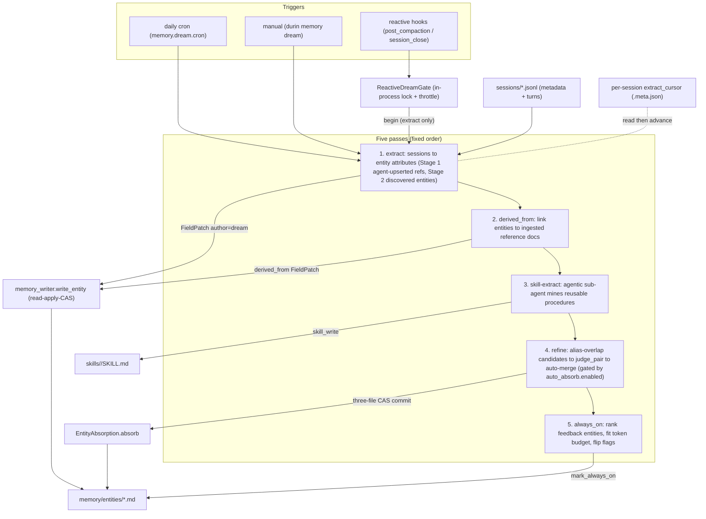

# Dream — cold-path consolidation

## 1. Purpose

**Dream** is the memory subsystem's **cold path**: an asynchronous process that
turns raw session transcripts into structured knowledge — entity pages,
curated skills, and standing guidance — without ever blocking the agent's
hot-path search or tool calls.

It exists because the agent should not pay a write-time latency or token cost to
keep its long-term memory tidy. Distilling a conversation into entity
attributes, linking entities to their source documents, mining reusable
procedures, deduplicating near-identical pages, and choosing which guidance to
pin all require LLM work. Doing that inline would tax every turn. Dream batches
it off the critical path instead.

**Core invariant: nothing Dream does blocks the hot path.** Search and tool
calls run against whatever state Dream has produced so far; Dream only improves
that state over time. A run can be skipped, throttled, time-boxed, or fail
mid-pass without losing data — the next run picks up where it left off.

## 2. Mental model

Three ideas explain the whole subsystem.

**1. Two-track memory — entities vs fragments.** durin keeps two disjoint
memory tracks, and Dream operates on only one of them.

| | Entity track (Dream's domain) | Fragment track (raw, append-only) |
|---|---|---|
| Storage | `memory/entities/<type>/<slug>.md` | `memory/episodic/*.md` + references in `memory/references/` |
| Producer | the agent authors name / aliases / relations / body via `memory_upsert_entity`; **Dream extracts attributes** | `/remember` (user-written facts) + session-close summaries |
| Consolidated by Dream? | **yes** — five passes refine and dedup the graph | **no** — fragments are never folded into pages |
| Lifecycle | pages evolve via CAS writes; duplicates merged via absorb | append-only; removed only by explicit `memory_forget` / webui |

Both tracks are searchable from write time (vector + lexical + grep — see
`02_indexing.md`, `03_search_pipeline.md`). Dream improves the *entity* track; it
does not gate recall of either. See `design_rationale.md` for why fragments stay
raw.

**2. Five sequential passes, three trigger paths.** Dream is five passes that
run in a fixed order — **extract → derived_from → skill-extract → refine →
always_on** — each reading sessions or entity pages and applying structured
updates. They are reached three ways: the **daily cron** runs all five; the two
**reactive hooks** (post-compaction / session-close) run the extract pass only,
throttled; the **manual** `durin memory dream` runs all five on demand.

**3. Per-session cursor → idempotent, lossless.** The extract pass tracks
progress with a single integer **per-session cursor** (turns already processed).
A re-run re-processes nothing already seen; a skipped or failed run is harmless
because the cursor only advances over turns that completed. Combined with
per-field author precedence on writes (user > dream > agent), re-running over the
same turns never corrupts a page.

## 3. Diagram

## 4. How it works

The five entry points live in `durin/memory/dream_passes.py`
(`run_extract_pass`, `run_derived_from_pass`, `run_skill_extract_pass`,
`run_refine_pass`) and `durin/memory/always_on_dream.py` (`run_always_on_pass`).
Each pass reads from `<workspace>/sessions/*.jsonl` or from `memory/entities/`,
writes through the shared CAS write path, and is best-effort per item: one bad
session or pair never aborts the whole pass.

### Pass 1 — extract: sessions to entity attributes

`run_extract_pass(workspace, *, llm_invoke, model, max_seconds, discover,
skill_signals)` iterates every `sessions/*.jsonl` and calls
`run_extract_for_session` (`durin/memory/extract_runner.py`) per session:

1. Load the session jsonl into `(metadata, messages)`; `messages[i]` is turn
   `i + 1`.
2. Read the **per-session cursor** via `get_extract_cursor`. If the total turn
   count is at or below the cursor, skip — no new turns.
3. Render the new turns (`messages[cursor:]`) as text.
4. **Stage 1 (extract).** `entity_refs_in_messages` scans the new turns'
   `tool_calls` for `memory_upsert_entity` and collects each call's `ref`. For
   each ref, `extract_entity` (`durin/memory/extract_dream.py`) loads (or
   creates) the `EntityPage`, builds a prompt from the entity's name, its
   *existing* attribute keys (for key reuse), its body, and the turns, invokes
   the LLM, and tolerantly parses a JSON object of scalar / list-of-scalar
   attributes (`parse_attributes` strips code fences and runs `json_repair`,
   dropping prose blobs and nested dicts). Each attribute becomes a
   `FieldPatch(kind="attribute", author="dream", source_ref=...)` applied via
   `memory_writer.write_entity(..., create=True)`. A deleted entity is honored
   (`is_deleted`) and never re-created.
5. **Stage 2 (discover, when `discover=True`).** `discover_entities` makes one
   LLM call over the *same* turns for durable identity-class facts (identity,
   roles, relationships, commitments, life events — ephemeral chatter excluded)
   about entities the agent did **not** upsert, and writes them as
   `author="dream"` pages, skipping refs already handled in Stage 1 and
   tombstoned refs. Each proposal from the discovery prompt is a **rich
   composite**: it includes the entity `name` and `attributes`, plus optional
   `aliases` (other names or spellings the turns use for this entity),
   `relations` (typed links to other entities mentioned in the turns), and a
   `significance` sentence that captures *why this entity is in the user's
   memory* — their relationship to it — rather than restating the attributes.
   The prompt requests all four components from the source turns only; none are
   invented. The proposal also includes a `turn` field: the turn number where
   the entity's durable fact first appears. Each patch written by `discover_entities`
   carries a `source_ref` of `[[sessions/<stem>.md#turn-N]]` using that per-entity
   turn number, so provenance points to the turn the fact came from rather than
   the session's window-end watermark. Before creating a new page, each proposal
   is resolved against the existing graph by name within the same entity type
   (via the alias index): a **unique** match updates that entity in place instead
   of minting a new slug; an **ambiguous** match (more than one candidate) creates
   a new page, deferring disambiguation to the refine pass. When lexical matching
   yields **no** match, discovery additionally consults the vector index for an
   **embedding-near same-type entity** (L2 distance within
   `semantic_distance_threshold`) and runs the LLM judge to confirm whether the
   proposal is the same entity under a variant name; a confirmed match reuses the
   existing entity instead of minting a new slug, preventing variant-name
   duplicates at birth. This semantic step is a no-op when the vector index is
   unavailable. The discovered `name` is set via `write_entity(name=...)`, which
   is **last-writer-wins** — a later explicit agent/user correction simply
   overwrites a discovered guess. Per-field precedence applies to *attributes*,
   not to the name. The extract pass builds a **single `AliasIndex`** once per
   pass (refreshed across all sessions processed in that run) and passes it to
   each `discover_entities` call; callers that omit it fall back to building
   their own.
6. **Stage 3 (skill signals, when `skill_signals=True`).** Skill corrections and
   gaps in the same turns are logged as observations for later skill curation
   (out of scope here — see the skills internals docs).
7. Advance the cursor to the total turn count via `set_extract_cursor`.

The `source_ref` in each patch's provenance points to the turn the fact came from.
Stage 1 (extract) uses the session window-end marker
`[[sessions/<stem>.md#turn-<N>]]` where N is the last processed turn. Stage 2
(discover) uses the per-entity `turn` from the LLM proposal when present,
producing a more precise `[[sessions/<stem>.md#turn-<M>]]` that anchors to the
specific turn where the entity's durable fact first appears; when the proposal
omits `turn`, it falls back to the same window-end marker. `max_seconds`
(0 = unbounded) is a hard wall-clock cap: when elapsed time crosses it the pass
yields **after the current session**, emits `memory.dream.max_seconds_reached`,
and the cursor resumes the remainder on the next trigger.

### Pass 2 — derived_from: link entities to source documents

`run_derived_from_pass` is a catch/repair pass. The agent's own
`memory_upsert_entity(derived_from=...)` is the primary write-time link; this
pass fills gaps. Per session, `link_derived_from_for_session`
(`durin/memory/derived_from_dream.py`) finds entities the agent authored whose
`derived_from` is still empty, harvests the `reference:<slug>` ids ingested in
that session (confirmed against `memory/references/<slug>.md`), and asks the LLM
which document(s) each entity was distilled from — reasoning over the
conversation, not temporal adjacency. The parsed `entity → [reference]` map is
applied as `derived_from` `FieldPatch`es (author `dream`). It is idempotent and
cheap: a session whose authored entities are already linked, or that ingested no
references, is skipped with no LLM call. **This pass runs only on the cron and
manual paths — never on the reactive hooks.**

### Pass 3 — skill-extract: sessions to reusable procedures

`run_skill_extract_pass(workspace, *, provider, model, max_sessions=3)` is the
**only agentic pass**: it spins up an `AgentRunner` sub-agent with
`ReadFileTool`, `EditFileTool`, `SkillWriteTool`, `SkillSearchTool`, and
`SkillAcquireSeedTool`, mining the newest sessions (plus any logged skill gaps)
for a recurring step-by-step **procedure**. When it finds one it prefers
acquiring a published skill (search a registry, pull a safe allowlisted seed)
over authoring from scratch, then calls `skill_write`. It does nothing on a
one-off, and reuses/extends an existing local skill instead of duplicating. It
is a sync wrapper over the async runner so the cron can call it in a thread.

### Pass 4 — refine: dedup duplicate entities

`run_refine_pass(workspace, *, llm_invoke, model, enabled, confidence_threshold,
run_started_at, vector_index=None)` is the graph-hygiene pass, gated by `enabled`
(wired from `memory.dream.auto_absorb.enabled`, **ON by default**). When disabled
it short-circuits — **no judge, no merge** — and logs the manual path
(`durin memory absorb-suggest` to surface, `durin memory absorb` to merge). When
enabled it delegates to `run_refine` (`durin/memory/refine_dream.py`).
`vector_index` is built once per run by the cron and CLI callers via
`dream_vector_index(workspace, cfg)` (`durin/memory/dream_passes.py`) and
threaded through; it is `None` when the vector index is unavailable.

`run_refine` assembles the candidate set from two sources:

1. `EntityAbsorption.find_candidates` (`durin/memory/absorption.py`) returns
   pairs that share at least one alias, strongest signal first.
2. When `vector_index` is provided, `EntityAbsorption.find_semantic_candidates`
   supplements the set with **embedding-near same-type pairs** whose L2 distance
   falls within `semantic_distance_threshold` (default 0.20), deduped against the
   alias pairs. This catches duplicates that share no alias — same entity,
   different name — and feeds them through the same judge. When the vector index is
   unavailable this step is a no-op.
2. Each pair is filtered out (with a `memory.absorb.skipped` reason) when:
   `cross_type` (different entity types), `tombstoned` (the user previously
   rejected the merge — recorded in `.refine_tombstones.json`), `load_failed`,
   `user_managed` (either page is `author == "user_authored"`), or `quarantine`
   (`run_started_at` is set and either page was created at or after the run
   started, checked via `created_at` then `updated_at`; no timestamp = treated
   as old, fail-open) — the run never merges its own fresh output; cross-run
   duplicates converge on the next pass.
3. For survivors, `judge_pair` (`durin/memory/absorb_judge.py`) renders both
   pages (file mtime, aliases, identifiers, body — the mtime lets it reason about
   staleness) and returns a verdict — `same`, `different`, or `unclear` — plus a
   confidence. The prompt treats alias overlap as *evidence, not proof* and
   defaults to `different` when content evidence is thin.
4. The pair is merged only when `verdict == "same"` **and**
   `confidence >= confidence_threshold`; otherwise it is kept separate.

`EntityAbsorption.absorb` does a deterministic structural merge (union of
aliases / attributes / relations / provenance; canonical wins attribute
conflicts; the absorbed body is appended under an `## Absorbed from <ref>`
section) and commits **three file operations in one atomic CAS commit** via
`write_files_cas`: the canonical page updated, the absorbed page deleted, and an
archived copy written to `memory/archive/entities/<type>/<slug>.md` with an
`archived_into` marker. It then refreshes the alias index and the vector index
(drop the absorbed row, re-upsert the canonical with the merged body). The
operation is idempotent — an already-archived absorbed page is a no-op.

### Pass 5 — always_on: curate the pinned guidance

`run_always_on_pass(workspace, *, token_budget, types, llm_invoke, model)`
(`durin/memory/always_on_dream.py`) chooses which **feedback entities** —
`stance` / `practice` / `feedback` types — are injected into *every* prompt (the
pinned "Always-on guidance" block built by `principal.build_pinned_context`). It
gathers and token-counts those pages, ranks them best-first via an LLM judge that
**drops any item contradicting a higher-priority one** (fallback when no LLM:
user-authored first, then most-recently-updated), fits the ranked list into
`token_budget` (a hard ceiling; a smaller later item may still fit, so overflow
*skips* rather than breaks), and flips the `always_on` flag on the survivors via
`principal.mark_always_on` while unmarking the rest. **Only the flag changes — no
entity is ever deleted**, so a pruned or contradicted item returns automatically
when the budget frees or the conflict resolves.

### Writes, provenance, and git history

No pass holds a lock for its writes. Every entity write goes through
`memory_writer.write_entity` — an optimistic multi-writer path that reads the
page at `HEAD`, applies `FieldPatch`es with per-field author precedence
(`durin/memory/field_patch.py`), builds a commit via dulwich plumbing (no
working-tree mutation), and commits with a `refs.set_if_equals` CAS that retries
on contention. An in-process re-entrant lock serializes same-repo writes within
the process; the CAS handles cross-process contention.

Git history carries provenance: entity writes are committed with author
`durin-memory <memory@durin.local>`; absorb merges with author
`durin-dream <dream@durin.local>` and RFC822 trailers (`Absorbed:`, `Into:`,
`Reason:`, `Judge-Confidence:`) that `durin memory history` / `durin memory
revert` parse. Each `FieldPatch` records its `source_ref` and author in the
page's provenance map.

A per-entity relation count is checked on every write (soft 50 / hard 200) and
emits a warning telemetry event on a crossing, but this is **alert-only** — no
write is blocked and no relation is dropped.

### Concurrency and the cursor

The reactive hooks each fire on a daemon thread in the gateway process.
`ReactiveDreamGate` (`durin/memory/dream_passes.py`) — one shared instance per
gateway — guards them with a non-blocking `try_begin(min_seconds)` that returns
`"locked"` (a pass is already running), `"throttled"` (one ended within
`min_seconds`), or `""` (run). A skipped reactive run is harmless: the
per-session cursor means those turns are picked up by the in-flight pass, the
next hook, or the daily cron. **The daily cron is never throttled** — it does not
go through the gate.

The per-session cursor is the **only** cursor in the dream system. It is an
integer stored as a **top-level `extract_cursor` key** in the session's
`<stem>.meta.json` sidecar — deliberately *outside* the `derived` block, because
`SessionManager.save()` rebuilds the `derived` block and would otherwise erase
it. `get_extract_cursor` falls back to a legacy `derived.extract_cursor`
location so pre-existing sessions are not re-processed from turn 0;
`set_extract_cursor` serializes its read-modify-write under the same
cross-process lock `SessionManager` uses for that session's sidecar.

## 5. Key types & entry points

| Symbol | File | Role |
|---|---|---|
| `run_extract_pass` | `durin/memory/dream_passes.py` | Extract pass entry: iterate sessions by cursor, run Stage 1 + Stage 2, yield on `max_seconds`. |
| `run_extract_for_session` | `durin/memory/extract_runner.py` | Per-session orchestrator: read cursor, process new turns, call extract + discover + skill-signals, advance cursor. |
| `extract_entity` | `durin/memory/extract_dream.py` | Core extractor: honor delete tombstone, build prompt, parse attributes, apply `FieldPatch`es as `dream`. |
| `discover_entities` | `durin/memory/extract_dream.py` | Stage 2 mention-based discovery: write dream-authored pages for entities the agent did not upsert; deduplicates against existing same-type entities by name before creating. |
| `run_derived_from_pass` | `durin/memory/dream_passes.py` | Catch/repair pass entry: link entities to ingested source documents. |
| `link_derived_from_for_session` | `durin/memory/derived_from_dream.py` | Per-session linker: find unlinked entities + ingested references, LLM-map entity to document, apply `derived_from` patches. |
| `run_skill_extract_pass` | `durin/memory/dream_passes.py` | Agentic skill-mining pass: `AgentRunner` sub-agent authors/acquires skills via `skill_write`. |
| `run_refine_pass` | `durin/memory/dream_passes.py` | Dedup gate: short-circuits when `auto_absorb` is off, else delegates to `run_refine`; accepts `vector_index` built by `dream_vector_index`. |
| `run_refine` | `durin/memory/refine_dream.py` | Dedup engine: alias-overlap + optional embedding-near candidate recall, filters, judge, merge via absorb; tombstone bookkeeping. |
| `dream_vector_index` | `durin/memory/dream_passes.py` | Builds a `VectorIndex` (or returns `None` when unavailable) for the refine semantic recall step; called once per run by the cron and CLI callers. |
| `judge_pair` | `durin/memory/absorb_judge.py` | LLM identity judge: returns `same` / `different` / `unclear` + confidence. |
| `run_always_on_pass` | `durin/memory/always_on_dream.py` | Pinned-guidance curation: rank feedback entities, fit budget, flip `always_on` flags. |
| `ReactiveDreamGate` | `durin/memory/dream_passes.py` | In-process lock + throttle for the reactive triggers. |
| `get_extract_cursor` / `set_extract_cursor` | `durin/memory/extract_runner.py` | Read / advance the per-session cursor (top-level key, legacy fallback). |
| `EntityAbsorption.find_candidates` / `.absorb` | `durin/memory/absorption.py` | Alias-overlap candidate discovery; deterministic merge via three-file CAS commit. |
| `memory_writer.write_entity` / `write_files_cas` | `durin/memory/memory_writer.py` | Single / multi-file CAS write path with per-field author precedence. |
| `FieldPatch` | `durin/memory/field_patch.py` | Immutable patch (kind, key, value, author, source_ref, at) applied by precedence. |
| `EntityPage` | `durin/memory/entity_page.py` | Parsed entity page (frontmatter + body) with per-author provenance. |
| `resolve_memory_model` | `durin/memory/model_resolve.py` | Resolve the dream model name across the precedence chain. |

## 6. Configuration & surfaces

All knobs live under `memory.dream.*` in `durin/config/schema.py`
(`MemoryDreamConfig`), with the dedup knobs nested under `auto_absorb`
(`AutoAbsorbConfig`).

| Setting | Default | Effect |
|---|---|---|
| `memory.dream.enabled` | `true` | Master switch for the cron + both reactive triggers. Manual `durin memory dream` works regardless. |
| `memory.dream.cron` | `0 3 * * *` | Daily schedule for the full five-pass run. |
| `memory.dream.post_compaction` | `true` | Arm the reactive extract trigger after a session is compacted. |
| `memory.dream.on_session_close` | `true` | Arm the reactive extract trigger when a session closes. |
| `memory.dream.discover_enabled` | `true` | Enable Stage 2 mention-based entity discovery in the extract pass. |
| `memory.dream.skill_signals_enabled` | `true` | Log skill corrections/gaps from extracted turns. |
| `memory.dream.model_override` | `null` | Override the dream model (resolved via `resolve_memory_model`). |
| `memory.dream.min_seconds_between_runs` | `300` | Throttle window for `ReactiveDreamGate`. 0 disables. The cron is never throttled. |
| `memory.dream.max_seconds_per_run` | `600` | Hard wall-clock cap; the pass yields after the current session and the cursor resumes. 0 = run to completion. |
| `memory.dream.always_on_token_budget` | `1500` | Token ceiling for the always-on pin. 0 disables the pin. |
| `memory.dream.auto_absorb.enabled` | `true` | ON by default; the refine pass auto-merges judged duplicates (recoverable via git revert + tombstone). |
| `memory.dream.auto_absorb.confidence_threshold` | `95` | LLM-judge confidence floor (0–100) for an auto-merge. |
| `memory.dream.auto_absorb.semantic_distance_threshold` | `0.20` | Embedding L2² distance below which a same-type entity is a semantic dedup candidate (refine + discovery); ≈ cosine 0.90; lower = stricter — the judge still decides the merge. |

The model every pass uses is resolved by
`resolve_memory_model(config)` (`durin/memory/model_resolve.py`):
`agents.aux_models.memory` (a preset or inline `model`) →
`memory.dream.model_override` → `None` (the caller's bundled default).

**Surfaces.**

- **Cron** — the daily run is registered as the system job `memory_dream`
  (`durin/cli/commands.py`), which runs all five passes in order (each offloaded
  to a thread so the cron loop stays responsive), then the skill-curation step.
  A failure logs and never crashes the cron loop.
- **Reactive hooks** — `agent.consolidator.on_post_compaction` and
  `agent.on_session_close` (wired in `durin/cli/commands.py`) call a closure that
  runs the **extract pass only** through the shared `ReactiveDreamGate`.
- **CLI** — `durin memory dream` (`durin/cli/memory_cmd.py`) runs the full
  five-pass sequence on demand and prints a one-line summary. Related recovery
  commands: `durin memory absorb-suggest`, `durin memory absorb`,
  `durin memory revert`, `durin memory history`.
- **Telemetry** — every pass emits best-effort `memory.dream.*` and
  `memory.absorb.*` events (defined in `durin/telemetry/schema.py`) for
  monitoring; see `07_telemetry_and_observability.md`.

## 7. Curated rationale

**Why a cold path at all.** Keeping memory tidy is LLM work — extraction,
linking, judging, ranking. Charging that to every conversation turn would tax
latency and tokens for a benefit the user does not see in the moment. Batching it
asynchronously means the user pays nothing at write time, and the entity graph
still converges toward a clean state in the background.

**Why five passes instead of one.** Each pass has a distinct input shape and
distinct write target — sessions to attributes, entities to source documents,
sessions to skills, pages to merges, feedback to flags. Folding them into one
prompt would blur those concerns, make failures all-or-nothing, and make each
pass harder to gate and tune independently. As separate passes they can run at
different cadences (extract is reactive; the rest are daily), be enabled or
disabled in isolation, and fail independently without aborting the run.

**Why the extract pass is the only reactive one.** The signal that changes after
a session is the new conversation turns, and extract is the pass that consumes
them. Refine, skill-extract, and always_on are workspace-wide passes that gain
nothing from per-session cadence — running them on every session close would be
pure waste. derived_from is cheap but still cron-only, since a missing source
link is not time-sensitive.

**Why writes carry author precedence.** A user-asserted fact must outrank a
dream-extracted one, and an extraction must outrank a casual agent write. Encoding
that as per-field author precedence (user > dream > agent) is what makes the
extract pass safe to re-run: it can re-derive attributes from the same turns
without ever clobbering something a human set by hand. The discovered entity
*name* is the deliberate exception — it is last-writer-wins, because a guessed
display name should yield immediately to any later explicit correction.

For the broader memory design decisions — markdown as the single source of truth,
why fragments are never consolidated, why auto-absorb defaults off, and the
mechanisms durin chose not to adopt — see `design_rationale.md`.
