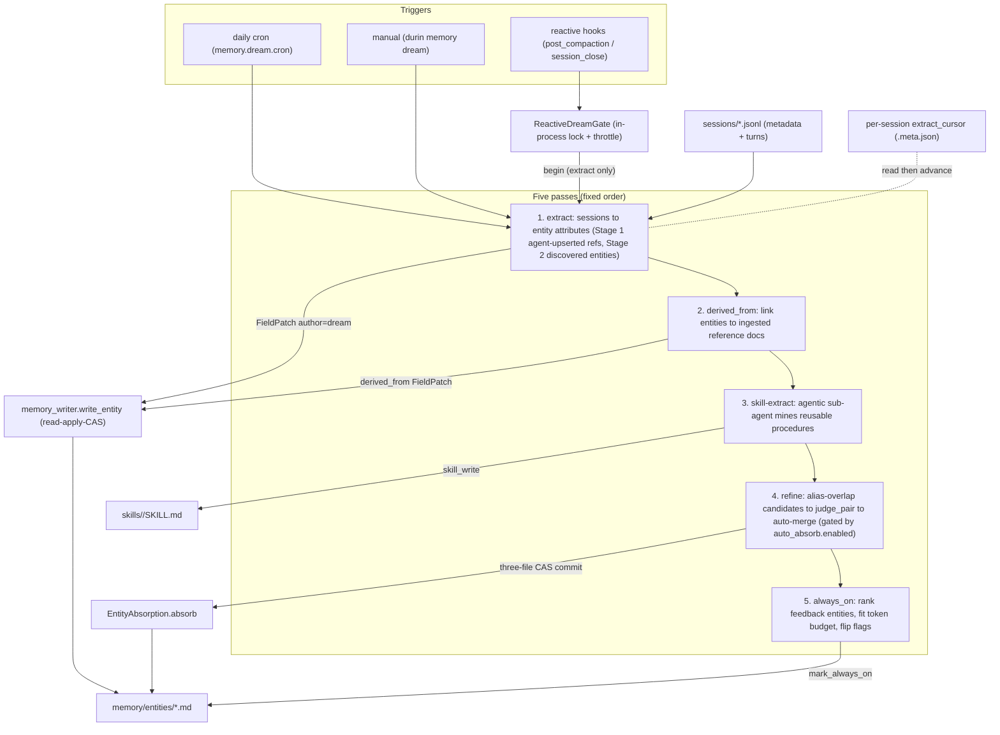

# Dream — cold-path consolidation

## 1. Purpose

**Dream** is the memory subsystem's **cold path**: an asynchronous process that
turns raw session transcripts into structured knowledge — entity pages,
curated skills, and standing guidance — without ever blocking the agent's
hot-path search or tool calls.

It exists because the agent should not pay a write-time latency or token cost to
keep its long-term memory tidy. Distilling a conversation into entity
attributes, linking entities to their source documents, mining reusable
procedures, deduplicating near-identical pages, and choosing which guidance to
pin all require LLM work. Doing that inline would tax every turn. Dream batches
it off the critical path instead.

**Core invariant: nothing Dream does blocks the hot path.** Search and tool
calls run against whatever state Dream has produced so far; Dream only improves
that state over time. A run can be skipped, throttled, time-boxed, or fail
mid-pass without losing data — the next run picks up where it left off.

## 2. Mental model

Three ideas explain the whole subsystem.

**1. Two-track memory — entities vs fragments.** durin keeps two disjoint
memory tracks, and Dream operates on only one of them.

| | Entity track (Dream's domain) | Fragment track (raw, append-only) |
|---|---|---|
| Storage | `memory/entities/<type>/<slug>.md` | `memory/episodic/*.md` + references in `memory/references/` |
| Producer | the agent authors name / aliases / relations / body via `memory_upsert_entity`; **Dream extracts attributes** | `/remember` (user-written facts) + session-close summaries |
| Consolidated by Dream? | **yes** — five passes refine and dedup the graph | **no** — fragments are never folded into pages |
| Lifecycle | pages evolve via CAS writes; duplicates merged via absorb | append-only; removed only by explicit `memory_forget` / webui |

Both tracks are searchable from write time (vector + lexical + grep — see
`02_indexing.md`, `03_search_pipeline.md`). Dream improves the *entity* track; it
does not gate recall of either. See `design_rationale.md` for why fragments stay
raw.

**2. Sequential passes, three trigger paths.** Dream runs passes in a fixed
order — **extract → derived_from → distill → skill-extract → refine →
always_on** — each reading sessions, reference documents, or entity pages and
applying structured updates. They are reached three ways: the **daily cron**
runs the full sequence; the two
**reactive hooks** (post-compaction / session-close) run the extract pass only,
throttled; the **manual** `durin memory dream` runs all five on demand.

**3. Per-session cursor → idempotent, lossless.** The extract pass tracks
progress with a single integer **per-session cursor** (turns already processed).
A re-run re-processes nothing already seen; a skipped or failed run is harmless
because the cursor only advances over turns that completed. Combined with
per-field author precedence on writes (user > dream > agent), re-running over the
same turns never corrupts a page.

## 3. Diagram

## 4. How it works

The five entry points live in `durin/memory/dream_passes.py`
(`run_extract_pass`, `run_derived_from_pass`, `run_skill_extract_pass`,
`run_refine_pass`) and `durin/memory/always_on_dream.py` (`run_always_on_pass`).
Each pass reads from `<workspace>/sessions/*.jsonl` or from `memory/entities/`,
writes through the shared CAS write path, and is best-effort per item: one bad
session or pair never aborts the whole pass.

### Pass 1 — extract: sessions to entity attributes

`run_extract_pass(workspace, *, llm_invoke, model, max_seconds, discover,
skill_signals)` iterates every `sessions/*.jsonl` and calls
`run_extract_for_session` (`durin/memory/extract_runner.py`) per session:

1. Load the session jsonl into `(metadata, messages)`; `messages[i]` is turn
   `i + 1`.
2. Read the **per-session cursor** via `get_extract_cursor`. If the total turn
   count is at or below the cursor, skip — no new turns.
3. Render the new turns (`messages[cursor:]`) as text.
4. **Stage 1 (extract).** `entity_refs_in_messages` scans the new turns'
   `tool_calls` for `memory_upsert_entity` and collects each call's `ref`. For
   each ref, `extract_entity` (`durin/memory/extract_dream.py`) loads (or
   creates) the `EntityPage`, builds a prompt from the entity's name, its
   *existing* attribute keys (for key reuse), its body, and the turns, invokes
   the LLM, and tolerantly parses a JSON object of scalar / list-of-scalar
   attributes (`parse_attributes` strips code fences and runs `json_repair`,
   dropping prose blobs and nested dicts). Each attribute becomes a
   `FieldPatch(kind="attribute", author="dream", source_ref=...)` applied via
   `memory_writer.write_entity(..., create=True)`. A deleted entity is honored
   (`is_deleted`) and never re-created.
5. **Stage 2 (discover, when `discover=True`).** `discover_entities` makes one
   LLM call over the *same* turns for durable identity-class facts (identity,
   roles, relationships, commitments, life events — ephemeral chatter and
   shown-not-asserted third-party content excluded by prompt rules)
   about entities the agent did **not** upsert, and writes them as
   `author="dream"` pages, skipping refs already handled in Stage 1 and
   tombstoned refs. Each proposal from the discovery prompt is a **rich
   composite**: it includes the entity `name` and `attributes`, plus optional
   `aliases` (other names or spellings the turns use for this entity),
   `relations` (typed links to other entities mentioned in the turns), and a
   `significance` sentence that captures *why this entity is in the user's
   memory* — their relationship to it — rather than restating the attributes.
   The prompt requests all four components from the source turns only; none are
   invented. The proposal also includes a `turn` field: the turn number where
   the entity's durable fact first appears. Each patch written by `discover_entities`
   carries a `source_ref` of `[[sessions/<stem>.md#turn-N]]` using that turn
   number, falling back to the window-end marker when the proposal omits `turn`,
   so provenance points to the turn the fact came from rather than the session's
   window-end watermark. Before creating a new page, each proposal
   is resolved against the existing graph by name within the same entity type
   (via the alias index): a **unique** match updates that entity in place instead
   of minting a new slug; an **ambiguous** match (more than one candidate) creates
   a new page, deferring disambiguation to the refine pass. When lexical matching
   yields **no** match, discovery additionally consults the vector index for an
   **embedding-near same-type entity** (L2 distance within
   `semantic_distance_threshold`) and runs the LLM judge to confirm whether the
   proposal is the same entity under a variant name; a confirmed match reuses the
   existing entity instead of minting a new slug, preventing variant-name
   duplicates at birth. This semantic step is a no-op when the vector index is
   unavailable. The discover prompt is **seeded with an `EXISTING ENTITIES`
   manifest** (up to 20 entries, retrieved by a query-mode search using the
   conversation turns): the LLM is instructed to reuse the exact ref of a known
   entity when the fact is about it, and to mint a new ref only for genuinely new
   entities. This prompt-level seeding is a first-pass guard that reduces
   duplicate slugs before any post-write resolution is attempted. The discovered
   `name` is set via `write_entity(name=...)`, which is **last-writer-wins** — a
   later explicit agent/user correction simply overwrites a discovered guess.
   Per-field precedence applies to *attributes*, not to the name. The extract
   pass builds a **single `AliasIndex`** once per pass (refreshed across all
   sessions processed in that run) and passes it to each `discover_entities`
   call; callers that omit it fall back to building their own.
6. **Stage 3 (skill signals, when `skill_signals=True`).** Skill corrections and
   gaps in the same turns are logged as observations for later skill curation
   (out of scope here — see the skills internals docs).
7. **Stage 4 (learnings sweep, when `learnings=True`).** `mine_learnings`
   (`durin/memory/extract_dream.py`) makes one LLM call over the same turns —
   reusing the compaction learnings prompt — to extract durable learnings:
   preferences, corrections, standing constraints, and stable project facts. It
   writes each result as a `feedback`, `stance`, or `practice` entity with
   `author="dream"` (never a `person` or other principal type). The prompt is
   **seeded with the full set of existing learning-type entities** (via
   `build_entity_manifest(types=[...])`) so the LLM can reuse a known ref instead
   of minting a new slug. Each proposed ref is additionally resolved against the
   alias index (and optionally the vector index) using the same lexical+semantic
   canonical resolution the discover path applies: a re-worded fact updates the
   existing entity in place rather than creating a duplicate slug. The refine pass
   remains the cross-run backstop for any duplicates that slip through. Gated by
   `memory.dream.learnings_sweep_enabled` (default true). Best-effort: an empty
   turn span, LLM failure, or parse failure yields an empty list without aborting
   the session.
8. Advance the cursor to the total turn count via `set_extract_cursor`.

The `source_ref` in each patch's provenance points to the turn the fact came from.
Stage 1 (extract) uses the session window-end marker `[[sessions/<stem>.md#turn-<N>]]`.
Stage 2 (discover) uses the per-entity `turn` from the LLM proposal when present,
producing a more precise `[[sessions/<stem>.md#turn-<M>]]` that anchors to the
specific turn where the entity's durable fact first appears; when the proposal
omits `turn`, it falls back to the same window-end marker. `max_seconds`
(0 = unbounded) is a hard wall-clock cap: when elapsed time crosses it the pass
yields **after the current session**, emits `memory.dream.max_seconds_reached`,
and the cursor resumes the remainder on the next trigger.

### Pass 2 — derived_from: link entities to source documents

`run_derived_from_pass` is a catch/repair pass. The agent's own
`memory_upsert_entity(derived_from=...)` is the primary write-time link; this
pass fills gaps. Per session, `link_derived_from_for_session`
(`durin/memory/derived_from_dream.py`) finds entities the agent authored whose
`derived_from` is still empty, harvests the `reference:<slug>` ids ingested in
that session (confirmed against `memory/references/<slug>.md`), and asks the LLM
which document(s) each entity was distilled from — reasoning over the
conversation, not temporal adjacency. The parsed `entity → [reference]` map is
applied as `derived_from` `FieldPatch`es (author `dream`). It is idempotent and
cheap: a session whose authored entities are already linked, or that ingested no
references, is skipped with no LLM call. **This pass runs only on the cron and
manual paths — never on the reactive hooks.**

### Pass 2b — distill: reference documents to outlines

`run_distill_reference_pass` (`durin/memory/distill_dream.py`) builds the "know
the book" index. For each ingested reference document it groups the
structure-aware chunks by breadcrumb (`Chapter › Section`), then a single LLM
call produces a whole-document abstract plus a one-to-two-sentence summary per
section. The result is written to a `memory/references/<slug>.outline.json`
sidecar, each section carrying the chunk indices it summarizes so a reader can
drill from a summary into the source chunks. Idempotent per document: the
outline records the `chunk_count` it was built from and a document is
re-distilled only when it is re-ingested (its chunk count changes). Gated by
`memory.dream.distill_references_enabled` (default on).

### Pass 2c — seed entities: documents to the entity graph

`run_seed_entities_pass` (same module) is the bridge that carries document
knowledge into the entity graph. It asks one selective LLM call for the KEY
entities the document is *about* (capped per document so a single book cannot
flood the graph) over the document's **actual section text** (the same chunks the
distil pass read) — not the outline's one-line summaries, so in-text aliases and
central entities are visible; the `outline.json` supplies the abstract and the
idempotency marker. It writes the entities as
dream-authored entity pages stamped `derived_from` = the document (a
`FieldPatch` of kind `derived_from`). Because distilled entities are first-class
in default recall while raw chunks are not, this is what lets a normal query
surface "durin knows this document is about X" and drill from there. Idempotent
via an `entities_seeded_chunk_count` marker on the outline; the refine pass
dedups the seeded entities against existing ones. Gated by
`memory.dream.seed_entities_from_docs_enabled` (default on).

### Pass 2d — curate topics: the library's subject map

`run_curate_topics_pass` (same module) maintains the library's topic index at
`memory/references/_topics.json` — the clean, stable `Covers:` map the always-on
Library awareness reads. One LLM call over the distilled abstracts produces
coherent **theme** labels (folding synonyms/translations, rolling granular
topics up) with the documents under each. The current index is fed back into the
prompt so the LLM **reuses** existing labels rather than regenerating — curation,
not drift. This is the quality tier over the on-the-fly `_library_subjects`
heuristic (which stays as the cold-start fallback until the first curation).
Idempotent: skipped when the set of distilled documents is unchanged (signature =
each document's slug + chunk_count). Gated by `memory.dream.curate_topics_enabled`
(default on).

### Pass 3 — skill-extract: sessions to reusable procedures

`run_skill_extract_pass(workspace, *, provider, model, max_sessions=3)` is the
**only agentic pass**: it spins up an `AgentRunner` sub-agent with
`ReadFileTool`, `EditFileTool`, `SkillWriteTool`, `SkillSearchTool`, and
`SkillAcquireSeedTool`, mining the newest sessions (plus any logged skill gaps)
for a recurring step-by-step **procedure**. When it finds one it prefers
acquiring a published skill (search a registry, pull a safe allowlisted seed)
over authoring from scratch, then calls `skill_write`. It does nothing on a
one-off, and reuses/extends an existing local skill instead of duplicating. It
is a sync wrapper over the async runner so the cron can call it in a thread.

### Pass 4 — refine: dedup duplicate entities

`run_refine_pass(workspace, *, llm_invoke, model, enabled, confidence_threshold,
run_started_at, vector_index=None, escalate_floor=0)` is the graph-hygiene pass,
gated by `enabled` (wired from `memory.dream.auto_absorb.enabled`, **ON by
default**). When disabled it short-circuits — **no judge, no merge** — and logs
the manual path (`durin memory absorb-suggest` to surface, `durin memory absorb`
to merge). When enabled it delegates to `run_refine` (`durin/memory/refine_dream.py`).
`vector_index` is built once per run by the cron and CLI callers via
`dream_vector_index(workspace, cfg)` (`durin/memory/dream_passes.py`) and
threaded through; it is `None` when the vector index is unavailable.

`run_refine` assembles the candidate set from two sources:

1. `EntityAbsorption.find_candidates` (`durin/memory/absorption.py`) returns
   pairs that share at least one alias, strongest signal first.
2. When `vector_index` is provided, `EntityAbsorption.find_semantic_candidates`
   supplements the set with **embedding-near same-type pairs** whose L2 distance
   falls within `semantic_distance_threshold` (default 0.30), deduped against the
   alias pairs. This catches duplicates that share no alias — same entity,
   different name — and feeds them through the same judge. When the vector index is
   unavailable this step is a no-op.
3. Each pair is filtered out (with a `memory.absorb.skipped` reason) when:
   `cross_type` (different entity types), `tombstoned` (the user previously
   rejected the merge — recorded in `.refine_tombstones.json`), `load_failed`,
   `user_managed` (either page is `author == "user_authored"`), or `quarantine`
   (`run_started_at` is set and either page was created at or after the run
   started, checked via `created_at` then `updated_at`; no timestamp = treated
   as old, fail-open) — the run never merges its own fresh output; cross-run
   duplicates converge on the next pass.
4. For survivors, `judge_pair` (`durin/memory/absorb_judge.py`) — the
   **Tier 1 cheap judge** — renders **the whole entity page** via
   `page.to_markdown()` (body capped at a configurable char budget; the full
   frontmatter, attributes, and relations are always included before the cap
   applies). Rendering the whole page rather than a curated field subset means a
   new field is visible to the judge by default: the failure mode is an extra line
   of context, not a silent blind spot. The judge returns `same`, `different`, or
   `unclear` plus a confidence.
5. **Tier 2 escalation (opt-in):** when `escalate_floor > 0`, a pair the
   Tier 1 judge cannot settle — verdict `"unclear"`, or verdict `"same"` with
   confidence in `[escalate_floor, confidence_threshold)` — is handed to a
   **bounded sub-agent** (`durin/memory/tier2_judge.py`). The sub-agent
   (`escalate_judge`) spins up an `AgentRunner` with four read-only tools —
   `memory_read_entity`, `memory_entity_lineage`, `memory_source_session`, and
   `memory_search` — and a fixed iteration ceiling. It investigates both entities
   in depth and returns the same `JudgeResult` envelope as the Tier 1 judge.
   `escalate_floor=0` (the default) leaves this path disabled; escalation must be
   opted in explicitly.
6. The pair is merged only when the deciding judge returns `verdict == "same"`
   **and** `confidence >= confidence_threshold`. Every other outcome keeps the
   pair separate.
7. **Flag surface:** when the Tier 2 sub-agent investigated a pair and did not
   confirm it as `"same"`, or a borderline pair hit the per-run escalation cap
   before it could be investigated, the pair is recorded in
   `memory/.flagged_pairs.json`. `durin memory absorb-suggest` and the webui
   Bandeja surface these so the operator can inspect and merge or dismiss them
   manually.

`EntityAbsorption.absorb` does a deterministic structural merge (union of
aliases / attributes / relations / provenance; canonical wins attribute
conflicts; the absorbed body is appended under an `## Absorbed from <ref>`
section) and commits **three file operations in one atomic CAS commit** via
`write_files_cas`: the canonical page updated, the absorbed page deleted, and an
archived copy written to `memory/archive/entities/<type>/<slug>.md` with an
`archived_into` marker. It then refreshes the alias index and the vector index
(drop the absorbed row, re-upsert the canonical with the merged body). The
operation is idempotent — an already-archived absorbed page is a no-op.

### Pass 4b — relations: keep the graph's edge vocabulary tidy

`run_consolidate_relations_pass` (`durin/memory/relation_hygiene.py`) canonicalises
entity-relation type labels so the same edge written different ways (`occurs-in`
vs `occurs_in`) collapses to one and graph edges line up. New writes are already
normalised at the choke point (`field_patch.normalize_relation_type` — every
producer, dream and agent tool, flows through it); this pass fixes relations that
predate that, re-keys their `(to, type)` provenance, and drops the duplicate an
edge-rename exposes. **Deterministic and direction-preserving:** it only merges
surface-form variants — inverse pairs (`treats` / `treated_by`) are the same fact
from both ends and are kept distinct (merging them would flip facts). Runs after
refine (which merges entities and their relations). It reports the relation
vocabulary each run (`types_before` → `types_after`, pages changed, duplicates
merged) to the cron log — **supervision**: a widening gap, or many merges,
signals that relations are being created sloppily upstream and the extraction
prompts need tightening. Gated by `memory.dream.consolidate_relations_enabled`
(default on). Folding genuine same-direction *synonyms* (an LLM job) is
deliberately left out until the vocabulary is large enough to warrant it.

### Pass 5 — always_on: curate the pinned guidance

`run_always_on_pass(workspace, *, token_budget, types, llm_invoke, model)`
(`durin/memory/always_on_dream.py`) chooses which **feedback entities** —
`stance` / `practice` / `feedback` types — are injected into *every* prompt (the
pinned "Always-on guidance" block built by `principal.build_pinned_context`). It
gathers and token-counts those pages, ranks them best-first via an LLM judge that
**drops any item contradicting a higher-priority one** (fallback when no LLM:
user-authored first, then most-recently-updated), fits the ranked list into
`token_budget` (a hard ceiling; a smaller later item may still fit, so overflow
*skips* rather than breaks), and flips the `always_on` flag on the survivors via
`principal.mark_always_on` while unmarking the rest. **Only the flag changes — no
entity is ever deleted**, so a pruned or contradicted item returns automatically
when the budget frees or the conflict resolves.

The pinned context (`principal.build_pinned_context`) also carries a **Library
awareness catalog** — one short line per ingested reference document (its title,
plus the distilled outline abstract when present). This is the always-on Tier-2
awareness: ingested documents are kept out of default recall, so this
line-per-document index is how the agent knows a document exists and can decide
to reach it with `memory_search(scope="library")` or a drill. It is capped
(`principal._MAX_LIBRARY_DOCS`) and truncates with a "…and N more" note.

The block also carries a bounded **subjects map** — a `Covers: …` line naming
what the library is about, so a document stays reachable (search its subject)
even past the per-document cap. There are two sources, preferred in order:

- **Curated topic index** (`_library_topics`, from the dream's
  `_topics.json` — see Pass 2d). Clean, stable theme labels; shown *always*
  because it is clean.
- **Heuristic fallback** (`_library_subjects`) while the dream has not curated
  the index yet: the distinct display names of entities the dream distilled
  *from* a document (`derived_from` links authored by `dream`; agent-linked refs
  such as a patient that merely cited a paper are excluded, so the library isn't
  mapped under the wrong things), ranked by how many documents share each. This
  is granular, so it is shown *only* once documents fall past the cap — where
  naming the subject-space prevents dead knowledge and breadth-ranking
  self-cleans; below the cap the per-document list already covers everything.

### Writes, provenance, and git history

No pass holds a lock for its writes. Every entity write goes through
`memory_writer.write_entity` — an optimistic multi-writer path that reads the
page at `HEAD`, applies `FieldPatch`es with per-field author precedence
(`durin/memory/field_patch.py`), builds a commit via dulwich plumbing (no
working-tree mutation), and commits with a `refs.set_if_equals` CAS that retries
on contention. An in-process re-entrant lock serializes same-repo writes within
the process; the CAS handles cross-process contention.

Git history carries provenance: entity writes are committed with author
`durin-memory <memory@durin.local>`; absorb merges with author
`durin-dream <dream@durin.local>` and RFC822 trailers (`Absorbed:`, `Into:`,
`Reason:`, `Judge-Confidence:`) that `durin memory history` / `durin memory
revert` parse. Each `FieldPatch` records its `source_ref` and author in the
page's provenance map.

A per-entity relation count is checked on every write (soft 50 / hard 200) and
emits a warning telemetry event on a crossing, but this is **alert-only** — no
write is blocked and no relation is dropped.

An LLM response that cannot be parsed at all (unloadable JSON, wrong top-level
type) emits `memory.dream.parse_failure` with the stage and source, and that
call yields an empty result — distinguishing "model returned garbage" from
"nothing to extract". The cursor still advances, so a persistent parse failure
surfaces in telemetry rather than blocking the pass. Each parse failure also
appears in the webui Dream feed as a `warning` item (one per unparseable
response, deep-linked to the entity when the source is an entity ref) — a run
full of them makes a misbehaving dream model loudly visible, which is the
intent.

A run that starts with vector memory enabled but no vector backend available
(lancedb not importable) emits `memory.dream.vector_unavailable` once from
`dream_vector_index` and surfaces the same way as a feed `warning`: semantic
dedup (refine + discovery) is degraded to alias matching for that run. A
deliberate `memory.enabled = false` stays silent — that degradation is chosen,
not accidental.

### Concurrency and the cursor

The reactive hooks each fire on a daemon thread in the gateway process.
`ReactiveDreamGate` (`durin/memory/dream_passes.py`) — one shared instance per
gateway — guards them with a non-blocking `try_begin(min_seconds)` that returns
`"locked"` (a pass is already running), `"throttled"` (one ended within
`min_seconds`), or `""` (run). A skipped reactive run is harmless: the
per-session cursor means those turns are picked up by the in-flight pass, the
next hook, or the daily cron. **The daily cron is never throttled** — it does not
go through the gate.

The per-session cursor is the **only** cursor in the dream system. It is an
integer stored as a **top-level `extract_cursor` key** in the session's
`<stem>.meta.json` sidecar — deliberately *outside* the `derived` block, because
`SessionManager.save()` rebuilds the `derived` block and would otherwise erase
it. `get_extract_cursor` falls back to a legacy `derived.extract_cursor`
location so pre-existing sessions are not re-processed from turn 0;
`set_extract_cursor` serializes its read-modify-write under the same
cross-process lock `SessionManager` uses for that session's sidecar.

## 5. Key types & entry points

| Symbol | File | Role |
|---|---|---|
| `run_extract_pass` | `durin/memory/dream_passes.py` | Extract pass entry: iterate sessions by cursor, run Stage 1 + Stage 2, yield on `max_seconds`. |
| `run_extract_for_session` | `durin/memory/extract_runner.py` | Per-session orchestrator: read cursor, process new turns, call extract + discover + skill-signals, advance cursor. |
| `extract_entity` | `durin/memory/extract_dream.py` | Core extractor: honor delete tombstone, build prompt, parse attributes, apply `FieldPatch`es as `dream`. |
| `discover_entities` | `durin/memory/extract_dream.py` | Stage 2 mention-based discovery: write dream-authored pages for entities the agent did not upsert; deduplicates against existing same-type entities by name before creating. |
| `run_derived_from_pass` | `durin/memory/dream_passes.py` | Catch/repair pass entry: link entities to ingested source documents. |
| `link_derived_from_for_session` | `durin/memory/derived_from_dream.py` | Per-session linker: find unlinked entities + ingested references, LLM-map entity to document, apply `derived_from` patches. |
| `run_skill_extract_pass` | `durin/memory/dream_passes.py` | Agentic skill-mining pass: `AgentRunner` sub-agent authors/acquires skills via `skill_write`. |
| `run_refine_pass` | `durin/memory/dream_passes.py` | Dedup gate: short-circuits when `auto_absorb` is off, else delegates to `run_refine`; accepts `vector_index` built by `dream_vector_index`. |
| `run_refine` | `durin/memory/refine_dream.py` | Dedup engine: alias-overlap + optional embedding-near candidate recall, filters, judge, merge via absorb; tombstone bookkeeping. |
| `dream_vector_index` | `durin/memory/dream_passes.py` | Builds a `VectorIndex` (or returns `None` when unavailable) for the refine semantic recall step; called once per run by the cron and CLI callers. |
| `judge_pair` | `durin/memory/absorb_judge.py` | Tier 1 LLM identity judge: renders the whole entity page via `to_markdown()` (body-capped), returns `same` / `different` / `unclear` + confidence. |
| `escalate_judge` | `durin/memory/tier2_judge.py` | Tier 2 sub-agent: spins up a bounded `AgentRunner` with 4 read-only tools to investigate a borderline pair; returns the same `JudgeResult` envelope. Opt-in via `escalate_floor > 0`. |
| `add_flagged` / `read_flagged` / `remove_flagged` | `durin/memory/refine_dream.py` | Write / read / delete entries in the `memory/.flagged_pairs.json` flag store: pairs the Tier 2 agent investigated but did not confirm as same. `remove_flagged` is called after the user resolves a pair (merge or separate) so it no longer appears in the Bandeja. |
| `run_always_on_pass` | `durin/memory/always_on_dream.py` | Pinned-guidance curation: rank feedback entities, fit budget, flip `always_on` flags. |
| `ReactiveDreamGate` | `durin/memory/dream_passes.py` | In-process lock + throttle for the reactive triggers. |
| `get_extract_cursor` / `set_extract_cursor` | `durin/memory/extract_runner.py` | Read / advance the per-session cursor (top-level key, legacy fallback). |
| `EntityAbsorption.find_candidates` / `.absorb` | `durin/memory/absorption.py` | Alias-overlap candidate discovery; deterministic merge via three-file CAS commit. |
| `memory_writer.write_entity` / `write_files_cas` | `durin/memory/memory_writer.py` | Single / multi-file CAS write path with per-field author precedence. |
| `FieldPatch` | `durin/memory/field_patch.py` | Immutable patch (kind, key, value, author, source_ref, at) applied by precedence. |
| `EntityPage` | `durin/memory/entity_page.py` | Parsed entity page (frontmatter + body) with per-author provenance. |
| `resolve_aux_preset` | `durin/memory/model_resolve.py` | Resolve the dream's full (provider, model) preset across the precedence chain — model and provider always travel together. |

## 6. Configuration & surfaces

All knobs live under `memory.dream.*` in `durin/config/schema.py`
(`MemoryDreamConfig`), with the dedup knobs nested under `auto_absorb`
(`AutoAbsorbConfig`).

| Setting | Default | Effect |
|---|---|---|
| `memory.dream.enabled` | `true` | Master switch for the cron + both reactive triggers. Manual `durin memory dream` works regardless. |
| `agents.defaults.compaction_learnings_enabled` | `true` | Gates the compaction backstop that distils durable learnings at compaction time. When false, no LLM call is made and no learning entities are written during consolidation. |
| `memory.dream.cron` | `0 3 * * *` | Daily schedule for the full five-pass run. |
| `memory.dream.post_compaction` | `true` | Arm the reactive extract trigger after a session is compacted. |
| `memory.dream.on_session_close` | `true` | Arm the reactive extract trigger when a session closes. |
| `memory.dream.discover_enabled` | `true` | Enable Stage 2 mention-based entity discovery in the extract pass. |
| `memory.dream.skill_signals_enabled` | `true` | Log skill corrections/gaps from extracted turns. |
| `memory.dream.learnings_sweep_enabled` | `true` | Enable Stage 4 of the extract pass: mine each session's new turns for durable learnings and write them as `feedback`/`stance`/`practice` entities (`author="dream"`). Dedup is delegated to the refine pass. |
| `memory.dream.model_override` | `null` | DEPRECATED — prefer `agents.aux_models.memory` (model + provider). A bare name here is placed by provider auto-detection from the name. |
| `memory.dream.min_seconds_between_runs` | `300` | Throttle window for `ReactiveDreamGate`. 0 disables. The cron is never throttled. |
| `memory.dream.max_seconds_per_run` | `600` | Hard wall-clock cap; the pass yields after the current session and the cursor resumes. 0 = run to completion. |
| `memory.dream.always_on_token_budget` | `1500` | Token ceiling for the always-on pin. 0 disables the pin. |
| `memory.dream.auto_absorb.enabled` | `true` | ON by default; the refine pass auto-merges judged duplicates (recoverable via git revert + tombstone). |
| `memory.dream.auto_absorb.confidence_threshold` | `95` | LLM-judge confidence floor (0–100) for an auto-merge. |
| `memory.dream.auto_absorb.semantic_distance_threshold` | `0.30` | Embedding L2² distance below which a same-type entity is a semantic dedup candidate (refine + discovery); ≈ cosine 0.85; lower = stricter — the judge still decides the merge. |
| `memory.dream.auto_absorb.escalate_floor` | `0` | **Opt-in.** Confidence floor (0–100) below which the Tier 1 judge's borderline verdicts escalate to a bounded sub-agent for deeper investigation. `0` (the default) disables Tier 2 entirely. Set to e.g. `60` to escalate pairs the cheap judge rated same at 60–94 confidence or returned `unclear`. |

The (provider, model) preset every pass uses is resolved by
`resolve_aux_preset(config, purpose="memory")` (`durin/memory/model_resolve.py`):
`agents.aux_models.memory` (a preset ref or inline model + provider) →
`memory.dream.model_override` (deprecated; bare name placed by provider
auto-detection) → the user's default preset. A model name no configured
provider serves falls back to the whole default preset — never a foreign name
on the default provider (see `docs/internals/providers.md`).

**Surfaces.**

- **Cron** — the daily run is registered as the system job `memory_dream`
  (`durin/cli/commands.py`), which runs all five passes in order (each offloaded
  to a thread so the cron loop stays responsive), then the skill-curation step.
  A failure logs and never crashes the cron loop.
- **Reactive hooks** — `agent.consolidator.on_post_compaction` and
  `agent.on_session_close` (wired in `durin/cli/commands.py`) call a closure that
  runs the **extract pass only** through the shared `ReactiveDreamGate`.
  Separately, the consolidator itself runs a **compaction backstop**
  (`Consolidator.extract_learnings`) immediately before firing the hook: it calls
  the LLM over the archived span to distil durable user learnings (preferences,
  corrections, standing constraints, stable personal facts) and writes them as
  `feedback`/`stance`/`practice`/`person` entities with `author="agent"`. This
  catches learnings that the live-agent capture directive may not have persisted
  during the session. It is best-effort — a failure never breaks consolidation —
  and dedup is delegated to the dream's refine pass. The backstop is gated by
  `agents.defaults.compaction_learnings_enabled` (default true).
- **CLI** — `durin memory dream` (`durin/cli/memory_cmd.py`) runs the full
  five-pass sequence on demand and prints a one-line summary. Related recovery
  commands: `durin memory absorb-suggest`, `durin memory absorb`,
  `durin memory revert`, `durin memory history`.
- **WebUI** — the **Dream** section (`/dream` route, `DreamView` +
  `DreamDrawer` in `webui/src/components/`) has two tabs.

  **Resumen tab** — headed by an **última corrida** card showing the most
  recent run's counts (sessions, entity updates, merges, new skills, improved
  skills — always shown, even all-zero, so an idle run is never blank; "new"
  comes from the skill-extract pass, "improved" from the curation pass), with a
  **Historial** feed below
  of prior runs and their activity (entity merges, entity and learning
  discoveries, skill changes). Each history card links to the affected entity or
  skill — clicking it opens an in-place peek drawer (`DreamDrawer`) that fetches
  and renders the entity page or skill detail without leaving the feed. The
  header carries a live **running** pulse while a run is in flight and a **Run
  now** button that triggers the `memory_dream` system cron job. That trigger is
  asynchronous (it returns immediately while the run takes minutes), so progress
  is driven by the live `dream_progress` websocket frames the cron handler
  emits: activity items stream into the feed as the dream produces them, and
  `run_finished` clears the indicator and reconciles against a fresh digest
  fetch. The digest is served by `GET /api/v1/memory/dream/digest`
  (`MemoryService.dream_digest`, `durin/service/memory.py`): the `last_run`
  headline and the per-run history come from the **durable run store**
  (`durin/memory/dream_runs.py` — a `record_dream_run` per run), so they survive
  the telemetry window and retention; the per-item activity feed (merges,
  discoveries, and each applied skill-curation action, naming the skill and the
  verb) is mapped from the telemetry JSONL. The run summaries used to be
  re-derived from telemetry, where a busy refine pass flooded the read window and
  the "última corrida" card silently vanished.

  **Bandeja tab** (inbox) — surfaces two categories of items that need human
  attention, with a badge on the tab when items are present.

  - *Flagged memory pairs* — pairs the Tier 2 merge judge investigated but did
    not auto-merge (stored in `memory/.flagged_pairs.json`). Each card shows
    both entity references, the judge's verdict, confidence, and reasoning. The
    user resolves each pair with **Merge** (absorb one entity into the other via
    `EntityAbsorption.absorb`) or **Keep separate** (write a tombstone via
    `add_tombstone` so the pair is never re-surfaced). Either action calls
    `POST /api/v1/memory/flagged-pairs/resolve` (`MemoryService.resolve_flagged`,
    `durin/service/memory.py`) with `action="merge"` or `action="separate"`,
    then removes the entry from the store via `remove_flagged`. The full list is
    fetched on tab load via `GET /api/v1/memory/flagged-pairs`
    (`MemoryService.flagged_pairs`).

  - *Quarantined skills* — the existing quarantine list surfaced as a secondary
    section. Each card shows the skill name and routes the user to the Skills
    section for the full triage workflow; the Bandeja does not duplicate the
    triage UI.

  - *Skill suggestions* — proposed curation actions (improve / retire)
    for `mode=manual` skills, generated by the post-dream curation step when
    `memory.dream.skill_suggestions_enabled` is on. Accepting applies the change;
    rejecting writes an expiring tombstone. Fuse (merging manual skills) is out
    of scope for this path; it remains available only in the auto-curation pass.
    See the skills internals doc for the full flow and tombstone semantics.
- **Telemetry** — every pass emits best-effort `memory.dream.*` and
  `memory.absorb.*` events (defined in `durin/telemetry/schema.py`). The dream
  runs outside the agent loop, so the cron and reactive triggers bind their own
  telemetry logger for the run — without it the events are silently dropped and
  the digest stays empty. See `07_telemetry_and_observability.md`.

## 7. Curated rationale

**Why a cold path at all.** Keeping memory tidy is LLM work — extraction,
linking, judging, ranking. Charging that to every conversation turn would tax
latency and tokens for a benefit the user does not see in the moment. Batching it
asynchronously means the user pays nothing at write time, and the entity graph
still converges toward a clean state in the background.

**Why five passes instead of one.** Each pass has a distinct input shape and
distinct write target — sessions to attributes, entities to source documents,
sessions to skills, pages to merges, feedback to flags. Folding them into one
prompt would blur those concerns, make failures all-or-nothing, and make each
pass harder to gate and tune independently. As separate passes they can run at
different cadences (extract is reactive; the rest are daily), be enabled or
disabled in isolation, and fail independently without aborting the run.

**Why the extract pass is the only reactive one.** The signal that changes after
a session is the new conversation turns, and extract is the pass that consumes
them. Refine, skill-extract, and always_on are workspace-wide passes that gain
nothing from per-session cadence — running them on every session close would be
pure waste. derived_from is cheap but still cron-only, since a missing source
link is not time-sensitive.

**Why writes carry author precedence.** A user-asserted fact must outrank a
dream-extracted one, and an extraction must outrank a casual agent write. Encoding
that as per-field author precedence (user > dream > agent) is what makes the
extract pass safe to re-run: it can re-derive attributes from the same turns
without ever clobbering something a human set by hand. The discovered entity
*name* is the deliberate exception — it is last-writer-wins, because a guessed
display name should yield immediately to any later explicit correction.

For the broader memory design decisions — markdown as the single source of truth,
why fragments are never consolidated, why auto-absorb defaults on, and the
mechanisms durin chose not to adopt — see `design_rationale.md`.
