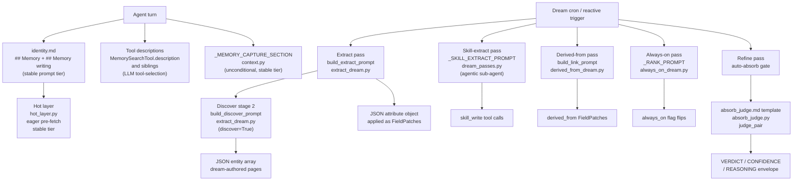

# Memory: Prompts and instructions

## 1. Purpose

This document specifies every LLM-facing text the memory system produces: the agent's identity prompt Memory sections, tool descriptions, the Dream pass prompts (extract, discover, always-on rank, skill-extract sub-agent), the absorb-judge template, the onboarding wizard text, and the structural marker conventions.

The goal of this catalog is a single source of truth so that changes to the live strings in code and template files are verified against a reference, and so that the design principles behind the choices are recoverable. Drift from code is a bug; the sync test (`tests/memory/test_tool_description_sync.py`) guards the tool descriptions.

---

## 2. Mental model

Three principles shape every LLM-facing string in the memory system.

**Structure over instruction.** Structural markers (`=== CANONICAL ===`, `=== FRAGMENT ===`), URI citations, and timestamps convey more than imperative instructions (`"USE BEFORE answering"`). Imperatives are weak signals that do not reliably change model behavior; descriptive metadata is parsed structurally by the model and generalizes without prompt engineering fragility.

**Declarative over imperative.** Agent-facing strings describe what the memory system holds and how results are organized, not commands to follow. Dream-pass prompts state what to extract and in what format; they do not embed decision trees. The absorb-judge prompt is adversarial by design: it defaults to `"different"` and demands content evidence beyond alias overlap.

**In-code prompts for passes, template file only for the judge.** The five Dream passes build their prompts in Python code (`extract_dream.py`, `dream_passes.py`, `always_on_dream.py`); only the absorb-judge prompt lives in a standalone template (`durin/templates/dream/absorb_judge.md`). This distinction reflects scope: the pass prompts are tightly coupled to the data they build and parse, while the judge prompt benefits from being a standalone inspectable document because a merge decision that goes wrong is traceable via `durin memory history`.

---

## 3. Memory tool descriptions

The blocks below are the canonical LLM-facing tool descriptions, kept in sync with code by `tests/memory/test_tool_description_sync.py`. Each tool class exposes a `description` property emitted as `function.description` in the OpenAI function-calling spec — the field the LLM reads when selecting a tool. Skills are a searchable memory pseudo-class surfaced via `memory_search kind=skill`; a matching `=== SKILL: <name> ===` result block contains steps to follow as a procedure, not facts to cite.

### 3.1 `memory_search`

```
Search durin's memory for content relevant to your question. Searches across canonical entity pages, recent observations, session summaries, and ingested documents in one call.

Usage:
- For most queries, use a single call with a natural-language `query`.
- For multi-part questions, issue 2-3 calls with different phrasings rather than one long query.
- For literal-match queries (emails, IDs, URLs), pass the literal string in `keywords` in addition to a natural-language `query`. This biases the search toward exact matches.
- For exact phrase matching, wrap the phrase in double quotes inside `query` — e.g. `"shooting percentage" basketball` requires the two words to appear adjacent and in order, while `basketball` matches anywhere. Words outside quotes stay as loose tokens. An unbalanced quote is treated as a typo and discarded.
- Use `level: "cold"` only when you need full body content (verbose; consumes many tokens). `warm` (default) returns headline + summary, enough for most tasks.
- `limit` defaults to 10. Reduce to 3-5 for chat-style short answers, raise to 20-30 for audit / investigative queries that need to see every relevant hit. Hard cap 50.

Results come pre-sectioned with structural markers:
- `=== SKILL: <name> ===` — a matching procedure; these are steps to FOLLOW, not facts to cite
- `=== CANONICAL: <uri> ===` — consolidated entity pages (durable knowledge)
- `=== FRAGMENT: <path> ===` — recent observations not yet consolidated
- `=== SESSION: <id> ===` — conversation summaries
- `=== INGESTED: <id> ===` — chunks of documents the user has loaded

Each marker also carries a completeness qualifier:
- `(complete)` — the body shown IS the full entry; do NOT call memory_drill on this uri, it returns the same text.
- `(preview N/M)` — N chars shown, M chars exist; call memory_drill on this uri only if you need the remaining body.
Markers without a completeness qualifier are rare (legacy / lexical-only hits) — use judgment.

When sources disagree, more recent fragments may reflect updates that have not yet been consolidated into the canonical entity page. Use timestamps in the markers to reason about recency.

State the source of any fact you cite (uri or section marker) in parentheses. Do not claim facts that are not in the search results.
```

### 3.2 `memory_store`

```
Persist an observation to memory. Use this when you learn a fact the user is likely to need again — preferences, decisions, facts about people/projects/ tasks, etc.

Storage class (default: episodic):
- `episodic`: working memory; short atomic observation. Most uses.
- `stable`: durable, identity-level. Use sparingly — only when the user has explicitly said "remember this" or the fact is clearly identity-level.
- `corpus`: chunks of inline reference text. For files on disk use memory_ingest instead — it preserves the original artifact and handles chunking.

Always populate `entities` with the URIs this observation mentions (format: `<type>:<value>`, e.g., `person:marcelo`, `project:durin`). This enables entity-aware retrieval later.

Keep `headline` short and specific — it can be omitted and the system will auto-generate one from the first ~10 words of `content`. `content` is the full body of the observation; don't truncate.

If the user is restating something already known, do NOT call this tool — it creates duplicates. The Dream consolidation process will eventually fold duplicates but in the meantime they pollute results. A near-duplicate (cosine ≥ 0.95 of an existing entry) returns a warning instead of persisting; pass `force=true` only when you intentionally want to re-affirm an existing fact.
```

### 3.3 `memory_ingest`

```
Add a local document (markdown or plain text) to durin's memory as a REFERENCE — coherent source material the user wants kept whole: research notes, transcripts, technical specs, exported pages, markdown books, etc.

`path` is the absolute or workspace-relative path to the file. The original is preserved verbatim and the document is indexed for retrieval. Re-ingesting the same file is idempotent — the id is a hash of (filename + content). The result includes a `reference:<slug>`; when you then author an entity distilled from this document, pass that ref in `memory_upsert_entity(derived_from=[...])` so the entity links back to its source.

For web content, use `web_fetch(url=...)` first to get clean markdown, then `memory_ingest` on the saved file. For a fact about a *thing* (a person, company, product, topic…), use `memory_upsert_entity` instead — `memory_ingest` is for whole documents, not individual facts.
```

### 3.4 `memory_drill`

```
Read the full content of one or more memory items by URI.

Pass either ``uri`` (single string) for one item, or ``uris`` (array, up to 10) for multiple items in one round-trip. With ``uris`` the response carries one ``{uri, content}`` record per request in the same order, plus an ``error`` field on entries that failed — individual failures don't abort the batch.

Use this ONLY when the corresponding memory_search result block is marked ``preview N/M`` in its section header — N chars were shown, M chars exist — i.e. more body is available beyond what you already have. Drill in that case to fetch the rest.

Do NOT drill when the block is marked ``complete``: the search already showed you the entire body and drill will return the same text, wasting tokens and an LLM round-trip. Blocks without an explicit completeness qualifier (rare; legacy / lexical-only hits) are best-guess — drill only if the visible content seems truncated.

Prefer the ``uris`` form whenever 2+ URIs from one search all need follow-up. Drill on URIs never expands the candidate set — use memory_search to find new candidates.
```

### 3.5 `memory_upsert_entity`

```
Author or update an entity (a person, company, product, topic, place, etc.) you have learned a fact about. Provide `ref` as `<type>:<slug>` (e.g. company:mxhero, person:marcelo), the display `name`, any `aliases`, `relations` to other entities ({to: '<type>:<slug>', type: 'partner'}), and prose `body` describing what you know. Merges into the existing entity if it exists, creates it otherwise. Do NOT pass structured attributes — the system extracts those from your prose. When this entity was distilled from a document you ingested, pass `derived_from` with the `reference:<slug>` ref(s) memory_ingest returned, so the entity links back to its sources. Use this for facts about a THING; use memory_ingest for documents. By default the `body` is APPENDED to what is already there (nothing is lost). Pass `body_mode: "replace"` only when you are rewriting the whole body to correct or clean it up — and only when you have the full current body in context. A replace cannot overwrite prose a user authored (it degrades to an append); git history preserves prior versions either way.
```

### 3.6 `memory_forget`

```
Remove a memory entry you no longer want surfaced. Archives it to memory/archive/<class>/<id>.md (reversible) and removes its search index rows so it stops appearing in memory_search.

This is the ONLY correct way to delete a memory entry — never rm or move files under memory/ via shell, which leaves the search indices pointing at a missing file.

Pass `uri` exactly as memory_search returned it. Refuses entity pages (memory/entities/...): those have their own absorb/revert lifecycle.
```

### 3.7 `memory_read_entity`

```
Read one entity's COMPLETE page (frontmatter + attributes + relations + provenance + body). Reach for this after memory_search points you at an entity and you need the whole structured page, not just the search preview. (For a quick body-only follow-up on a preview hit, memory_drill is enough.)
```

### 3.8 `memory_entity_lineage`

```
The git history of an entity: who changed it, when, and why (including absorb/merge commits). Use to gauge an entity before you rely on or edit it — is it long-established or freshly created, has it been merged from others.
```

### 3.9 `memory_source_session`

```
Read the original conversation turns an entity was distilled from (its provenance source_refs + derived_from). Use when a fact looks off, or when you need the exact wording and context that produced it, not the summary.
```

---

## 4. Architecture diagram



---

## 5. How it works

### 5.1 Agent identity prompt

`durin/templates/agent/identity.md` is the persistent identity file injected into every agent turn inside the stable prompt tier. It contains three memory-related sections.

**`## Memory`** describes the four memory tools and the four content types (entity pages, references, session summaries, skills). It instructs the agent to call `memory_search` rather than answering from cold recall, to state sources, and to issue 2–3 searches for compound questions.

**`## Working with search results`** (a peer `##` section at the same level as `## Memory`) provides hit-consumption guidelines: read every hit, verify the entity, combine facts across hits, do not reframe, answer multi-part questions partially, never invent identifiers, follow skill hits rather than citing them, and search for skills not in the working set.

**`## Memory writing`** routes by information type: entity facts go to `memory_upsert_entity`, whole documents go to `memory_ingest`, raw interactions require nothing (the session is already recorded). It instructs the agent to search before authoring to avoid duplicates.

The two `## Memory writing` rules about `body_mode` and `derived_from` are embedded inline in the `memory_upsert_entity` tool description (§3.5 and §5.2) and summarized here.

### 5.7 Always-present capture directive

`_MEMORY_CAPTURE_SECTION` (`durin/agent/context.py`) is a short Markdown section injected unconditionally into the stable prompt tier on every turn, immediately after the operating floor. It is not part of `identity.md`; it is assembled programmatically so it is always present regardless of SOUL or persona configuration.

**What it instructs.** The directive tells the agent to capture durable learnings in the moment — before acknowledging — rather than waiting to be asked. The salience criterion is: *save what stops the user from having to steer, correct, or re-explain later*. Concrete trigger: before writing an acknowledgement like "got it" or "noted", save the thing first.

**Entity taxonomy.** Each learning is authored as an entity via `memory_upsert_entity`:
- Corrections, preferences, and standing constraints on how to work → `feedback`, `stance`, or `practice` entity. The body must state WHY the preference matters and HOW to apply it, so the agent can judge edge cases rather than apply it blindly.
- Durable facts about who the user is (role, goals, stable personal context) → update the user's `person` entity.
- Work context or subject matter → a `project` or `topic` entity.

**Exclusions.** The directive explicitly excludes: content derivable from the code, repo, or git history; task progress and transient state; ephemeral artifacts (PR numbers, commit SHAs, today's status).

**Correct in place.** When the user corrects something already recorded, the agent updates that entity (overwrites the stale value) rather than stacking a contradicting entry on top.

**Expressivity.** The agent briefly tells the user what it saved ("noted — you prefer X"). When a recalled memory materially shaped a decision, it says so ("doing it this way because I recall you prefer Y") so the user can catch and correct a stale memory on the spot. Trivial recalls are not narrated.

### 5.2 Tool descriptions

Each tool class exposes a `description` property that delegates to `_PARAMETERS["description"]`. That string is emitted as `function.description` in the OpenAI function-calling spec — the field the LLM reads when selecting a tool. Both the `function.description` field and the `function.parameters.description` field carry the same string so there is no divergence between them.

The sync test (`tests/memory/test_tool_description_sync.py`) asserts that each tool's `.description` property matches the string in `_PARAMETERS["description"]`.

The six memory tools and their descriptions:

| Tool | Status | Key framing |
|---|---|---|
| `memory_search` | Active | Sectioned markers, warm/cold levels, keywords for literals, 2-3 searches for compound questions, do not claim facts not in results |
| `memory_upsert_entity` | Active | `ref` as `<type>:<slug>`, prose body (system extracts attributes), `body_mode` append vs replace, `derived_from` for ingested links |
| `memory_ingest` | Active | Whole documents, idempotent hash-based id, returns `reference:<slug>` for linking |
| `memory_drill` | Active | Fetch full body of a `(preview N/M)` hit; do not drill `(complete)` hits |
| `memory_forget` | Active | Archive-only removal; never use shell to delete memory files |
| `memory_store` | Disabled | `MemoryStoreTool.enabled()` returns False; description kept in sync but LLM never sees it |

### 5.3 Dream pass prompts

The five Dream passes each build their prompt in Python. No pass uses a multi-file template assembly; only the absorb-judge retains a standalone template file.

**Extract pass** (`build_extract_prompt` in `extract_dream.py`): Takes an entity page and rendered conversation turns. Asks the LLM to produce a bare JSON object mapping `attribute_key → scalar/list`. Uses an `EXISTING ATTRIBUTE KEYS` block to drive key-reuse and prevent schema drift. Slots: `{ref}`, `{name}`, `{existing}` (sorted keys or `(none)`), `{body}` (truncated to 4 000 chars), `{turns}` (truncated to 12 000 chars). Output parsed by `parse_attributes`: strips code fences, runs `json_repair`, keeps only scalar/list-of-scalar values.

**Discover pass** (`build_discover_prompt` in `extract_dream.py`): Takes the same conversation turns but no target entity. Asks the LLM to propose a JSON array of objects for entities with durable identity-class facts (who/what an entity is, stable roles or relationships, lasting preferences, commitments, life events). Each proposal carries `ref`, `name`, and `attributes`, plus three optional components synthesized from the source turns: `aliases` (other names or spellings for this entity that appear in the turns), `relations` (typed links to other entities mentioned in the turns), and `significance` — one sentence on *why this entity is in the user's memory* (their relationship to it), which must not restate the attributes. The proposal also includes `turn`: the turn number where the entity's durable fact first appears, used to anchor each patch's `source_ref` to that specific turn rather than the session window-end.
Ephemeral details are excluded by the prompt rules; only facts stated in the turns are used. Output parsed by `parse_discoveries` (same tolerant approach; malformed sub-values in the optional fields are dropped). Discovered entities are written as dream-authored pages; the entity name is last-writer-wins (later agent or user corrections simply overwrite it).

**Derived-from pass** (`build_link_prompt` in `derived_from_dream.py`): Per-session pass that identifies entities lacking a `derived_from` link and reasons over the session's ingested references to build those links. Applies the result as `derived_from` FieldPatches with `author="dream"`.

**Always-on pass** (`_RANK_PROMPT` in `always_on_dream.py`): Takes the candidate set of `stance`/`practice`/`feedback` entity pages, each rendered via `_render_pinned_block`. Asks the LLM to return refs in priority order (most load-bearing first), one per line, dropping items that contradict a higher-priority item. Output parsed line-by-line; only recognized refs are kept. When no LLM is configured or only one candidate exists, the pass falls back to `user_authored` first, then recency.

**Skill-extract pass** (`_SKILL_EXTRACT_PROMPT` in `dream_passes.py`): A system prompt for an agentic sub-agent that spins up an `AgentRunner` with `ReadFileTool`, `EditFileTool`, `SkillWriteTool`, `SkillSearchTool`, and `SkillAcquireSeedTool`. The sub-agent receives recent sessions as the user turn, optionally including logged gap observations. It decides whether to call `skill_write` based on whether the conversation reveals a genuinely reusable procedure. It may call `skill_search` first to acquire an existing published skill rather than authoring from scratch. All skills must be authored in English regardless of conversation language.

### 5.4 Absorb-judge template

`durin/templates/dream/absorb_judge.md` is loaded by `absorb_judge.py` at call time (`_load_template` extracts the largest fenced code block). It is the only surviving file under `templates/dream/`.

The template is adversarial: alias overlap is stated as necessary but not sufficient. The model is explicitly told to default to `"different"` when content evidence is thin, because a false positive merge has a higher cost than a false negative (the loser is archived but the slug changes and semantic search is affected).

Each page block includes:
- File last-modified timestamp (UTC ISO 8601), to let the judge reason about whether two pages observed years apart could plausibly be the same entity.
- Aliases list.
- Identifiers (email, Slack, GitHub, etc.) from `page.extra["identifiers"]` when present — these are globally unique and the strongest positive signal.
- The full page body.

The LLM produces an output envelope:
```
===VERDICT===
same | different | unclear
===CONFIDENCE===
<integer 0-100>
===REASONING===
<1-3 short sentences citing concrete signals>
===END===
```

`_parse_response` is tolerant: it uses regex with `re.DOTALL | re.IGNORECASE` and accepts surrounding prose. A verdict of `same` plus `confidence >= confidence_threshold` triggers a merge via `EntityAbsorption.absorb`. `unclear` or low-confidence results are skipped for that run (they may be re-evaluated when more evidence arrives). The reasoning is stored in the absorb commit body so `durin memory history` shows why the merge happened.

Up to `max_retries` (default 2) re-attempts are made on parse failure; each retry sends the same prompt without feedback (parse failures are usually transient model formatting errors). The function either returns a `JudgeResult` or raises `JudgeError`, giving the caller a single failure mode.

### 5.5 Hot layer

`durin/memory/hot_layer.py` eagerly assembles a memory context block that is injected into the stable prompt tier on every turn without any tool call. It renders five sections in order: Identity (from `memory/stable/IDENTITY.md`), Canonical pages (top 12 entity pages by `updated_at` desc), Recent fragments (top 8 post-cursor episodic/stable entries by `valid_from` desc), Key Points (top 12 headlines), and Known Entities (up to 50 entity URIs). Each section has a hard character budget; the total is approximately 1 900 tokens, sized to stay within a single prompt-cache window between Dream passes.

Canonical pages are wrapped in `=== CANONICAL: <uri> (consolidated <ts>) ===` markers; fragments in `=== FRAGMENT: <path> (ts <ts>) ===`. The intro sentence above the fragments section ("Reconcile with the canonical above using the timestamps.") cues the LLM to treat fragments as recent amendments rather than authoritative rewrites.

### 5.6 Structural markers

Structural markers appear in both hot-layer output and `memory_search` results. They communicate class and URI; they do not communicate trust level or relevance rank — those the model reasons from content and timestamps.

| Marker pattern | Class |
|---|---|
| `=== CANONICAL: <uri> (consolidated <iso_ts>) ===` | Entity pages |
| `=== FRAGMENT: <path> (ts <iso_ts>) ===` | Post-cursor episodic and stable entries |
| `=== SESSION: <session_id>/<turn_or_summary> (ts <iso_ts>) ===` | Session summaries and raw session hits |
| `=== INGESTED: <ingest_id>/<chunk_or_source> ===` | Corpus and raw ingested documents |
| `=== SKILL: <name> ===` | Skill procedures (follow, do not cite) |

Each `memory_search` result block also carries a completeness qualifier:
- `(complete)` — full body shown; `memory_drill` on this URI returns the same text.
- `(preview N/M)` — N chars shown, M total; call `memory_drill` to fetch the remainder.

Sections with zero hits are omitted entirely.

---

## 6. Key types and entry points

| Symbol | File | Role |
|---|---|---|
| `build_extract_prompt` | `durin/memory/extract_dream.py` | Builds the extract-pass prompt from an `EntityPage` and rendered turns; slot values truncated to 4 000 / 12 000 chars |
| `parse_attributes` | `durin/memory/extract_dream.py` | Tolerant parse of the extract LLM's JSON output: strips fences, runs `json_repair`, keeps scalars and lists of scalars only |
| `extract_entity` | `durin/memory/extract_dream.py` | Per-entity extract: respects delete tombstone, builds and invokes prompt, applies `FieldPatch`es via `memory_writer` |
| `build_discover_prompt` | `durin/memory/extract_dream.py` | Builds the discover-pass prompt from conversation turns; proposes entities with durable identity-class facts |
| `parse_discoveries` | `durin/memory/extract_dream.py` | Tolerant parse of the discover LLM's JSON array; validates `ref` format and filters attributes |
| `discover_entities` | `durin/memory/extract_dream.py` | Per-session discover: skips already-handled refs and tombstoned entities, writes dream-authored pages via `memory_writer` |
| `_RANK_PROMPT` | `durin/memory/always_on_dream.py` | Always-on pass prompt: ranks `stance`/`practice`/`feedback` candidates, drops contradictions, output is ordered refs one per line |
| `run_always_on_pass` | `durin/memory/always_on_dream.py` | Entry point: gathers candidates, calls `_rank`, fits token budget, flips `always_on` flags only (no deletions) |
| `_SKILL_EXTRACT_PROMPT` | `durin/memory/dream_passes.py` | System prompt for the skill-extract agentic sub-agent; includes `{existing}` skills and optional `{principles}` block |
| `run_skill_extract_pass` | `durin/memory/dream_passes.py` | Spins `AgentRunner` with skill tools; sync wrapper over async runner; closes matching gap observations after the run |
| `judge_pair` | `durin/memory/absorb_judge.py` | Loads template, renders page blocks, invokes LLM, parses `===VERDICT===` envelope with up to `max_retries` retries; returns `JudgeResult` or raises `JudgeError` |
| `JudgeResult` | `durin/memory/absorb_judge.py` | Frozen dataclass: `verdict` (same/different/unclear), `confidence` (0–100), `reasoning` (free-form, stored in absorb commit) |
| `_load_template` | `durin/memory/absorb_judge.py` | Extracts the largest fenced code block from `absorb_judge.md`; raises `JudgeError` if no block found |
| `_render_page_block` | `durin/memory/absorb_judge.py` | Renders one entity page for the judge: mtime, aliases, identifiers, body |
| `MemorySearchTool.description` | `durin/agent/tools/memory_search.py` | LLM-visible tool description; delegates to `_PARAMETERS["description"]`; guarded by sync test |
| `read_hot_layer` | `durin/memory/hot_layer.py` | Assembles the stable-tier memory block from disk on every prompt build; five sections with hard char budgets |

---

## 7. Configuration and surfaces

| Config key | Default | Effect |
|---|---|---|
| `memory.enabled` | `true` | Master gate for all memory I/O including Dream prompts and hot-layer injection |
| `agents.defaults.compaction_learnings_enabled` | `true` | Gates the compaction backstop (`extract_learnings`); when false, no LLM call is made at compaction time for durable learnings |
| `memory.dream.enabled` | `true` | Gates cron and reactive Dream triggers; `durin memory dream` (manual) always runs |
| `memory.dream.cron` | `"0 3 * * *"` | Daily schedule for all five passes |
| `memory.dream.discover_enabled` | `true` | Enables the discover pass (Stage 2 entity discovery) within the extract pass |
| `memory.dream.skill_signals_enabled` | `true` | Enables skill-signal detection during the extract pass |
| `memory.dream.always_on_token_budget` | `1500` | Hard token ceiling for always-on pinned guidance; `0` disables the pin |
| `memory.dream.auto_absorb.enabled` | `true` | ON by default; the refine pass auto-merges judged duplicates (recoverable via git revert + tombstone). When false, duplicates must be merged manually via `durin memory absorb` |
| `memory.dream.auto_absorb.confidence_threshold` | `95` | LLM judge confidence floor (0–100) for an auto-merge |
| `memory.dream.auto_absorb.semantic_distance_threshold` | `0.20` | Embedding L2² distance below which a same-type entity is a semantic dedup candidate (refine + discovery); ≈ cosine 0.90; lower = stricter — the judge still decides the merge |
| `memory.dream.min_seconds_between_runs` | `300` | Throttle window for `ReactiveDreamGate`; `0` disables; daily cron is never throttled |
| `memory.dream.max_seconds_per_run` | `600` | Wall-clock cap for the extract pass; it yields after the current session and the per-session cursor resumes on the next trigger |
| `memory.search.cross_encoder.enabled` | `false` | Enables the cross-encoder reranker (displayed in onboarding as an opt-in) |
| `memory.search.cross_encoder.model` | `BAAI/bge-reranker-base` | Cross-encoder model for reranking |

**CLI surfaces:**
- `durin memory dream` — run all five passes immediately (bypasses `ReactiveDreamGate`)
- `durin memory absorb-suggest` — surface alias-overlap candidates without auto-merging
- `durin memory absorb <ref-a> <ref-b>` — merge two entities manually
- `durin memory history` — show memory write history including absorb reasoning
- `durin init` — onboarding wizard; memory submenu configures vector-memory toggle, embedding model, cross-encoder opt-in, Dream auto-absorb, and aux model for memory tasks

**Onboarding wizard defaults:**
- Vector memory: ON (the semantic layer is the default experience)
- Cross-encoder reranker: OFF (opt-in; no aggregate quality gain on dialogue-style stores)
- Auto-absorb: OFF (a bad merge silently combines two distinct entities; recovery requires `git revert`)
- Memory model: same as agent (can be overridden via `aux_models.memory`)

---

## 8. Curated rationale

**Why declarative phrasing works.** The v2 form of the `## Memory` section — "call `memory_search` rather than answering from cold recall" plus "state the source of any fact you cite" plus "issue 2-3 searches for compound questions" — outperformed earlier imperative drafts ("USE BEFORE answering", "ALWAYS call memory first") by a measurable margin on retrieval accuracy. Imperatives that read as rules tend to be ignored or over-applied; descriptions that explain what the tool does and what good retrieval behavior looks like are structural rather than performative and generalize more reliably.

**Why the absorb-judge prompt is adversarial.** Alias overlap between two entity pages is the trigger for the judge, but it is a poor signal on its own: common names, shared acronyms, and generic placeholders (admin, user) produce false overlaps constantly. Instructing the model to default to `"different"` and to require positive content evidence (matching identifiers, consistent biographical details, a cross-reference between pages) keeps the precision of auto-merges high. The cost asymmetry supports this: a false positive merge moves a slug and disrupts semantic search; a false negative leaves a duplicate that can be resolved in the next pass or manually.

**Why prompts live in code rather than template files.** The extract and discover prompts depend on per-entity state (existing attribute keys, current body, target ref) that is assembled at call time from Python data structures. Keeping the prompt template as a module-level string constant alongside the build function and parse function makes the three — template, builder, parser — co-located and independently testable. The absorb-judge is an exception: its inputs are two rendered page blocks and it produces a structured envelope, making it suitable as a standalone document that operators can inspect to understand why a merge decision was made.

**Why the skill-extract pass is agentic.** Skill authoring requires judgment calls that do not reduce to a single LLM prompt: the agent must decide whether a procedure is genuinely reusable, search existing registries before authoring from scratch, adapt an acquired seed to the conversation's specifics, and choose a name consistent with the gap observation if one exists. A fixed prompt cannot handle this branching; an agentic sub-agent with tool access can. The cost is higher than a single LLM call, but the pass runs at most once per daily cron cycle and operates over a bounded window of recent sessions.
