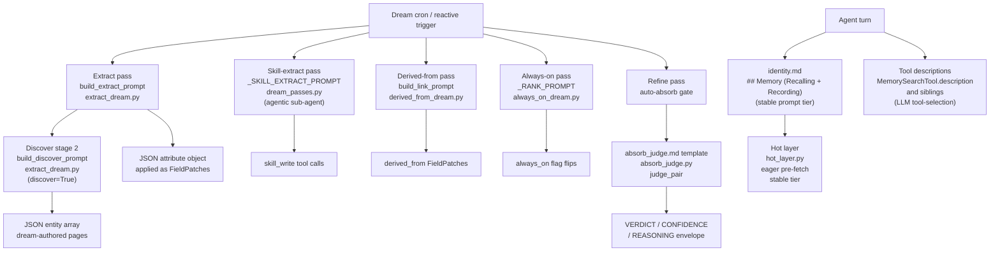

# Memory: Prompts and instructions

## 1. Purpose

This document specifies every LLM-facing text the memory system produces: the agent's identity prompt Memory sections, tool descriptions, the Dream pass prompts (extract, discover, document passes, always-on rank, skill-extract sub-agent), the absorb-judge template, the onboarding wizard text, and the structural marker conventions.

The goal of this catalog is a single source of truth so that changes to the live strings in code and template files are verified against a reference, and so that the design principles behind the choices are recoverable. Drift from code is a bug; the sync test (`tests/memory/test_tool_description_sync.py`) guards the tool descriptions.

---

## 2. Mental model

Three principles shape every LLM-facing string in the memory system.

**Structure over instruction.** Structural markers (`=== CANONICAL ===`, `=== FRAGMENT ===`), URI citations, and timestamps convey more than imperative instructions (`"USE BEFORE answering"`). Imperatives are weak signals that do not reliably change model behavior; descriptive metadata is parsed structurally by the model and generalizes without prompt engineering fragility.

**Declarative over imperative.** Agent-facing strings describe what the memory system holds and how results are organized, not commands to follow. Dream-pass prompts state what to extract and in what format; they do not embed decision trees. The absorb-judge prompt is adversarial by design: it defaults to `"different"` and demands content evidence beyond alias overlap.

**In-code prompts for passes, template files for the judge and the learnings sweep.** The Dream passes build their prompts in Python code (`extract_dream.py`, `dream_passes.py`, `always_on_dream.py`, `distill_dream.py`); the exceptions are the absorb-judge prompt (`durin/templates/dream/absorb_judge.md`) and the learnings-sweep prompt (`durin/templates/agent/consolidator_learnings.md`), which live in standalone template files. This distinction reflects scope: the pass prompts are tightly coupled to the data they build and parse, while the judge and learnings prompts benefit from being standalone inspectable documents.

---

## 3. Memory tool descriptions

The blocks below are the canonical LLM-facing tool descriptions, kept in sync with code by `tests/memory/test_tool_description_sync.py`. Each tool class exposes a `description` property emitted as `function.description` in the OpenAI function-calling spec — the field the LLM reads when selecting a tool. Skills are a searchable memory pseudo-class surfaced via `memory_search kind=skill`; a matching `=== SKILL: <name> ===` result block contains steps to follow as a procedure, not facts to cite.

### 3.1 `memory_search`

```
Search durin's memory for content relevant to your question. Searches across canonical entity pages, recent observations, and session summaries in one call. Ingested documents (books, PDFs, pages the user loaded) are NOT in the default search — reach them with `scope="library"`.

Usage:
- For most queries, use a single call with a natural-language `query`.
- For multi-part questions, issue 2-3 calls with different phrasings rather than one long query.
- For literal-match queries (emails, IDs, URLs), pass the literal string in `keywords` in addition to a natural-language `query`. This biases the search toward exact matches.
- For exact phrase matching, wrap the phrase in double quotes inside `query` — e.g. `"shooting percentage" basketball` requires the two words to appear adjacent and in order, while `basketball` matches anywhere. Words outside quotes stay as loose tokens. An unbalanced quote is treated as a typo and discarded.
- Use `level: "cold"` only when you need full body content (verbose; consumes many tokens). `warm` (default) returns headline + summary, enough for most tasks.
- `limit` defaults to 10. Reduce to 3-5 for chat-style short answers, raise to 20-30 for audit / investigative queries that need to see every relevant hit. Hard cap 50.

Results come pre-sectioned with structural markers:
- `=== SKILL: <name> ===` — a matching procedure; these are steps to FOLLOW, not facts to cite
- `=== CANONICAL: <uri> ===` — consolidated entity pages (durable knowledge)
- `=== FRAGMENT: <path> ===` — recent observations not yet consolidated
- `=== SESSION: <id> ===` — conversation summaries
- `=== INGESTED: <id> ===` — chunks of documents the user has loaded (only from `scope="library"`)

Each marker also carries a completeness qualifier:
- `(complete)` — the body shown IS the full entry; do NOT call memory_drill on this uri, it returns the same text.
- `(preview N/M)` — N chars shown, M chars exist; call memory_drill on this uri only if you need the remaining body.
Markers without a completeness qualifier are rare (legacy / lexical-only hits) — use judgment.

When sources disagree, more recent fragments may reflect updates that have not yet been consolidated into the canonical entity page. Use timestamps in the markers to reason about recency.

State the source of any fact you cite (uri or section marker) in parentheses. Do not claim facts that are not in the search results.
```

### 3.2 `memory_store`

```
Persist an observation to memory. Use this when you learn a fact the user is likely to need again — preferences, decisions, facts about people/projects/ tasks, etc.

Storage class (default: episodic):
- `episodic`: working memory; short atomic observation. Most uses.
- `stable`: durable, identity-level. Use sparingly — only when the user has explicitly said "remember this" or the fact is clearly identity-level.
- `corpus`: chunks of inline reference text. For files on disk use memory_ingest instead — it preserves the original artifact and handles chunking.

Always populate `entities` with the URIs this observation mentions (format: `<type>:<value>`, e.g., `person:marcelo`, `project:durin`). This enables entity-aware retrieval later.

Keep `headline` short and specific — it can be omitted and the system will auto-generate one from the first ~10 words of `content`. `content` is the full body of the observation; don't truncate.

If the user is restating something already known, do NOT call this tool — it creates duplicates. The Dream consolidation process will eventually fold duplicates but in the meantime they pollute results. A near-duplicate (cosine ≥ 0.95 of an existing entry) returns a warning instead of persisting; pass `force=true` only when you intentionally want to re-affirm an existing fact.
```

### 3.3 `memory_ingest`

```
Add a local document to durin's memory as a REFERENCE — coherent source material the user wants kept whole: research notes, transcripts, technical specs, exported pages, books, reports, etc.

Supported formats are converted to markdown on the way in: PDF, Word (docx), PowerPoint (pptx), Excel (xlsx/xls), EPUB, HTML, CSV, JSON, XML, Jupyter notebooks; markdown and plain text are stored as-is. The verbatim original is always preserved.

`path` is the absolute or workspace-relative path to the file. Re-ingesting the same file never redoes a finished transcription — the same content comes back. A note left when OCR was off or unavailable is re-checked, not just replayed, once OCR becomes available — it does not return stale forever. While a background OCR job is still pending, re-ingesting returns that SAME job instead of starting a second one; only a failed or cancelled job is retried this way. The result includes a `reference:<slug>`; when you then author an entity distilled from this document, pass that ref in `memory_upsert_entity(derived_from=[...])` so the entity links back to its source.

One case returns no text and no reference: a scanned PDF with more pages than can be transcribed on the spot. The result carries `job_id`, `pages_pending` and a `note` instead, and the document is neither readable nor searchable until that background job finishes. Say so — do not report it as read or remembered — and use `tasks` to report progress.

For web content, use `web_fetch(url=...)` first, then `memory_ingest` on the saved file. For a fact about a *thing* (a person, company, product, topic…), use `memory_upsert_entity` instead — `memory_ingest` is for whole documents, not individual facts. To just READ a document in this turn without saving it, use `convert_to_markdown`.
```

### 3.4 `memory_drill`

```
Read the full content of one or more memory items by URI.

Pass either ``uri`` (single string) for one item, or ``uris`` (array, up to 10) for multiple items in one round-trip. With ``uris`` the response carries one ``{uri, content}`` record per request in the same order, plus an ``error`` field on entries that failed — individual failures don't abort the batch.

Use this ONLY when the corresponding memory_search result block is marked ``preview N/M`` in its section header — N chars were shown, M chars exist — i.e. more body is available beyond what you already have. Drill in that case to fetch the rest.

Do NOT drill when the block is marked ``complete``: the search already showed you the entire body and drill will return the same text, wasting tokens and an LLM round-trip. Blocks without an explicit completeness qualifier (rare; legacy / lexical-only hits) are best-guess — drill only if the visible content seems truncated.

Prefer the ``uris`` form whenever 2+ URIs from one search all need follow-up. Drill on URIs never expands the candidate set — use memory_search to find new candidates.
```

### 3.5 `memory_upsert_entity`

```
Author or update an entity (a person, company, product, topic, place, etc.) you have learned a fact about. Provide `ref` as `<type>:<slug>` (e.g. company:mxhero, person:marcelo), the display `name`, any `aliases`, `relations` to other entities ({to: '<type>:<slug>', type: 'partner'}), and prose `body` describing what you know. Merges into the existing entity if it exists, creates it otherwise. Do NOT pass structured attributes — the system extracts those from your prose. When this entity was distilled from a document you ingested, pass `derived_from` with the `reference:<slug>` ref(s) memory_ingest returned, so the entity links back to its sources. Use this for facts about a THING; use memory_ingest for documents. By default the `body` is APPENDED to what is already there (nothing is lost). Pass `body_mode: "replace"` only when you are rewriting the whole body to correct or clean it up — and only when you have the full current body in context. A replace cannot overwrite prose a user authored (it degrades to an append); git history preserves prior versions either way.
```

### 3.6 `memory_forget`

```
Remove something you no longer want surfaced — a memory entry OR an ingested Library document. Archives it (reversible) and removes its search index rows so it stops appearing in memory_search.

This is the ONLY correct way to delete memory — never rm or move files under memory/ via shell, which leaves the search indices pointing at a missing file (orphan rows).

Pass `uri` exactly as it was returned: a 'memory/<class>/<id>' entry, or a 'reference:<slug>' to forget an ingested document (the whole doc: its chunks and index rows go too). Refuses entity pages (memory/entities/...): those have their own absorb/revert lifecycle.
```

### 3.7 `memory_read_entity`

```
Read one entity's COMPLETE page (frontmatter + attributes + relations + provenance + body). Reach for this after memory_search points you at an entity and you need the whole structured page, not just the search preview. (For a quick body-only follow-up on a preview hit, memory_drill is enough.)
```

### 3.8 `memory_entity_lineage`

```
The git history of an entity: who changed it, when, and why (including absorb/merge commits). Use to gauge an entity before you rely on or edit it — is it long-established or freshly created, has it been merged from others.
```

### 3.9 `memory_source_session`

```
Read the original conversation turns an entity was distilled from (its provenance source_refs + derived_from). Use when a fact looks off, or when you need the exact wording and context that produced it, not the summary.
```

---

## 4. Architecture diagram


```mermaid
flowchart TD
    A["Agent turn"] --> B["identity.md\n## Memory (Recalling + Recording)\n(stable prompt tier)"]
    A --> C["Tool descriptions\nMemorySearchTool.description\nand siblings\n(LLM tool-selection)"]

    D["Dream cron / reactive trigger"] --> E["Extract pass\nbuild_extract_prompt\nextract_dream.py"]
    D --> G["Skill-extract pass\n_SKILL_EXTRACT_PROMPT\ndream_passes.py\n(agentic sub-agent)"]
    D --> H["Derived-from pass\nbuild_link_prompt\nderived_from_dream.py"]
    D --> I["Always-on pass\n_RANK_PROMPT\nalways_on_dream.py"]
    D --> J["Refine pass\nauto-absorb gate"]

    E --> F["Discover stage 2\nbuild_discover_prompt\nextract_dream.py\n(discover=True)"]
    J --> K["absorb_judge.md template\nabsorb_judge.py\njudge_pair"]

    E --> L["JSON attribute object\napplied as FieldPatches"]
    F --> M["JSON entity array\ndream-authored pages"]
    G --> N["skill_write tool calls"]
    H --> O["derived_from FieldPatches"]
    I --> P["always_on flag flips"]
    K --> Q["VERDICT / CONFIDENCE\n/ REASONING envelope"]

    B --> R["Hot layer\nhot_layer.py\neager pre-fetch\nstable tier"]
```

---

## 5. How it works

### 5.1 Agent identity prompt

`durin/templates/agent/identity.md` is the persistent identity file injected into every agent turn inside the stable prompt tier. It contains one consolidated `## Memory` section with two subsections.

**`### Recalling`** covers hit-consumption: search rather than answering from cold recall, issue 2–3 searches for compound questions, use `memory_drill` only on preview hits, inspect entities via `memory_read_entity` / `memory_entity_lineage` / `memory_source_session`, read every hit, reconcile by timestamp, enumerate every distinct item, state sources, never invent identifiers. It also names the `<memory-context>` block the prefetch (§5.7) fences into the message: the same sectioned hits the tool returns, a starting point rather than the whole of memory, drilled and searched past like any other hit.

**`### Recording — capture as you go`** covers the write path: capture before acknowledging, author via `memory_upsert_entity`, route documents through `memory_ingest`, use `memory_forget` to retire entries, correct in place rather than stacking contradictions, briefly say what was saved. The type rule links to the "Known types" block in the hot layer: `feedback` / `stance` / `practice` are pin-eligible; `person` is always pinned; all other types are open vocabulary retrieved on demand. Standard types (person, place, project, topic, event, artifact) are listed inline.

### 5.2 Tool descriptions

Each tool class exposes a `description` property that delegates to `_PARAMETERS["description"]`. That string is emitted as `function.description` in the OpenAI function-calling spec — the field the LLM reads when selecting a tool. Both the `function.description` field and the `function.parameters.description` field carry the same string so there is no divergence between them.

The sync test (`tests/memory/test_tool_description_sync.py`) asserts that each tool's `.description` property matches the string in `_PARAMETERS["description"]`.

The active memory tools and their descriptions:

| Tool | Status | Key framing |
|---|---|---|
| `memory_search` | Active | Sectioned markers, warm/cold levels, keywords for literals, 2-3 searches for compound questions, do not claim facts not in results |
| `memory_upsert_entity` | Active | `ref` as `<type>:<slug>`, prose body (system extracts attributes), `body_mode` append vs replace, `derived_from` for ingested links |
| `memory_ingest` | Active | Whole documents, idempotent hash-based id, returns `reference:<slug>` for linking |
| `memory_drill` | Active | Fetch full body of a `(preview N/M)` hit; do not drill `(complete)` hits |
| `memory_forget` | Active | Archive-only removal; never use shell to delete memory files |
| `memory_read_entity` | Active | Full page of one entity (attributes + relations + provenance + body) when the search preview isn't enough |
| `memory_entity_lineage` | Active | Git history of an entity — established vs fresh, prior merges |
| `memory_source_session` | Active | The conversation turns an entity was distilled from |
| `memory_store` | Disabled | `MemoryStoreTool.enabled()` returns False; description kept in sync but LLM never sees it |

### 5.3 Dream pass prompts

The Dream passes each build their prompt in Python. No pass uses a multi-file template assembly; the absorb-judge prompt and two per-span extraction prompts that run at compaction time rather than as a Dream pass proper (the archive prompt, the learnings sweep) are the exceptions that use standalone template files — catalogued here alongside the Dream passes for their shared per-span, template-file shape.

**Extract pass** (`build_extract_prompt` in `extract_dream.py`): Takes an entity page and rendered conversation turns. Asks the LLM to produce a bare JSON object mapping `attribute_key → scalar/list`. Uses an `EXISTING ATTRIBUTE KEYS` block to drive key-reuse and prevent schema drift. Slots: `{ref}`, `{name}`, `{existing}` (sorted keys or `(none)`), `{body}` (truncated to 4 000 chars), `{turns}` (truncated to 12 000 chars). Output parsed by `parse_attributes`: strips code fences, runs `json_repair`, keeps only scalar/list-of-scalar values.

**Discover pass** (`build_discover_prompt` in `extract_dream.py`): Takes the same conversation turns but no target entity. Asks the LLM to propose a JSON array of objects for entities with durable identity-class facts (who/what an entity is, stable roles or relationships, lasting preferences, commitments, life events). Each proposal carries `ref`, `name`, and `attributes`, plus three optional components synthesized from the source turns: `aliases` (other names or spellings for this entity that appear in the turns), `relations` (typed links to other entities mentioned in the turns), and `significance` — one sentence on *why this entity is in the user's memory* (their relationship to it), which must not restate the attributes. The proposal also includes `turn`: the turn number where the entity's durable fact first appears, used to anchor each patch's `source_ref` to that specific turn rather than the session window-end.
Ephemeral details are excluded by the prompt rules; only facts stated in the turns are used. The prompt also includes an explicit **durability exclusion clause**: content the user merely SHOWED rather than asserted as their own durable fact — third-party quotes or reviews, advertisements/marketing copy, transcribed audio samples, and pasted documents — must not be captured. A fact is captured only when the user states it about themselves or their world. Output parsed by `parse_discoveries` (same tolerant approach; malformed sub-values in the optional fields are dropped). Discovered entities are written as dream-authored pages; the entity name is last-writer-wins (later agent or user corrections simply overwrite it).

The discover prompt is seeded with an `EXISTING ENTITIES` block (built by `build_entity_manifest` via a query-mode search over the conversation turns, capped at 20 entities). The block is injected under a `KNOWN ENTITIES — reuse, do not duplicate` header that instructs the LLM to output the exact ref of an existing entity when a durable fact is about it, minting a new ref only for genuinely new entities. When the search index is empty or the manifest query returns nothing, the block reads `(none yet)` and the prompt behaves identically to an unseeded run. The `build_discover_prompt(turns, existing="")` signature accepts the manifest as the `existing` keyword argument; the default allows callers that pass only `turns` to continue working without changes.

**Derived-from pass** (`build_link_prompt` in `derived_from_dream.py`): Per-session pass that identifies entities lacking a `derived_from` link and reasons over the session's ingested references to build those links. Applies the result as `derived_from` FieldPatches with `author="dream"`.

**Always-on pass** (`_RANK_PROMPT` in `always_on_dream.py`): Takes the candidate set of `stance`/`practice`/`feedback` entity pages, each rendered via `_render_pinned_block`. Asks the LLM to return refs in priority order (most load-bearing first), one per line, dropping items that contradict a higher-priority item. Output parsed line-by-line; only recognized refs are kept. When no LLM is configured or only one candidate exists, the pass falls back to `user_authored` first, then recency.

**Skill-extract pass** (`_SKILL_EXTRACT_PROMPT` in `dream_passes.py`): A system prompt for an agentic sub-agent that spins up an `AgentRunner` with `ReadFileTool`, `EditFileTool`, `SkillWriteTool` (composition gate in `hard` mode), `SkillSearchTool`, `SkillAcquireSeedTool`, `ListWorkflowsTool`, and `WorkflowWriteTool`. The sub-agent receives recent sessions as the user turn, optionally including logged gap observations. It decides whether to call `skill_write` based on whether the conversation reveals a genuinely reusable procedure. It may call `skill_search` first to acquire an existing published skill rather than authoring from scratch. The prompt embeds the composition doctrine (loaded verbatim from the builtin `skill-creator` skill via `durin/agent/skills_doctrine.py`) and the workspace's workflow catalog, so an orchestration an existing workflow automates is delegated — or a missing workflow authored with `workflow_write` — instead of narrated as prose steps. All skills must be authored in English regardless of conversation language.

**Archive prompt** (`Consolidator.archive` in `durin/agent/memory.py`, template `durin/templates/agent/consolidator_archive.md`): Rendered once per consolidation span — the messages a compaction round is about to evict — as a plain system prompt (no Jinja). Asks for concise bullet-point facts under six categories: user facts, decisions, solutions, **locations** (files, directories, commands, or URLs discovered or examined, kept as the exact path so the resource can be found again), events, and preferences, in priority order (user corrections/preferences > solutions > locations > decisions > events > environment facts) — skipping implementation detail a listed location would let the agent recover by re-reading, git history, and anything already in memory. The response ends with a `---`-delimited YAML block carrying `entities` (typed `<type>:<value>` refs, the same shape `memory_upsert_entity` validates) and `topics` (short labels); `parse_consolidator_response` (`durin/memory/consolidator_tags.py`) splits the bullets from that block and drops malformed entity refs rather than failing the whole parse.

After the LLM's bullets come back, `archive()` mechanically appends up to two trailer lines the summarizer can neither drop nor hallucinate: a cited-memory-refs line (URIs pulled from `=== CANONICAL/FRAGMENT/SESSION/INGESTED ===` markers that the span's `memory_search`/`memory_drill` calls surfaced) and a discovered-paths line (filesystem paths pulled from the arguments and results of discovery tools — `read_file`, `write_file`, `edit_file`, `exec`, `grep`, `list_dir` — used in the span). Both lists are deduped and capped. Both trailers ride the session-summary projection only — the LLM's own bullet summary, written unmodified to `memory/history.jsonl`, never carries either trailer. That file is a write-only archive of the raw summarizer output — nothing reads it back; the dream mines the session transcripts under `sessions/` with a per-session cursor.

**Learnings sweep** (`mine_learnings` in `extract_dream.py`, template `durin/templates/agent/consolidator_learnings.md`): A Jinja2 template rendered once per session span. It asks the LLM to extract durable preferences, corrections, standing constraints, and stable personal facts as `feedback`/`stance`/`practice` entities. The template's `Exclude:` list includes a **durability exclusion clause**: content the user merely SHOWED, not asserted — third-party quotes/reviews, advertisements or marketing copy, transcribed audio samples, and pasted documents — must not be captured as a learning.

**Document passes** (`distill_dream.py`): three single-call prompts carry ingested-document knowledge into the graph — `build_outline_prompt` (a whole-document abstract plus per-section summaries), `build_seed_prompt` (the key entities a document is about), and `build_topics_prompt` (the library's curated topic map). Each is built in Python from the document's chunks or distilled abstracts.

### 5.4 Absorb-judge template

`durin/templates/dream/absorb_judge.md` is loaded by `absorb_judge.py` at call time (`_load_template` extracts the largest fenced code block). It is the only surviving file under `templates/dream/`.

The template is adversarial: alias overlap is stated as necessary but not sufficient. The model is explicitly told to default to `"different"` when content evidence is thin, because a false positive merge has a higher cost than a false negative (the loser is archived but the slug changes and semantic search is affected).

Each page block includes:
- File last-modified timestamp (UTC ISO 8601), to let the judge reason about whether two pages observed years apart could plausibly be the same entity.
- Aliases list.
- Identifiers (email, Slack, GitHub, etc.) from `page.extra["identifiers"]` when present — these are globally unique and the strongest positive signal.
- The full page body.

The LLM produces an output envelope:
```
===VERDICT===
same | different | unclear
===CONFIDENCE===
<integer 0-100>
===REASONING===
<1-3 short sentences citing concrete signals>
===END===
```

`_parse_response` is tolerant: it uses regex with `re.DOTALL | re.IGNORECASE` and accepts surrounding prose. A verdict of `same` plus `confidence >= confidence_threshold` triggers a merge via `EntityAbsorption.absorb`. `unclear` or low-confidence results are skipped for that run (they may be re-evaluated when more evidence arrives). The reasoning is stored in the absorb commit body so `durin memory history` shows why the merge happened.

Up to `max_retries` (default 2) re-attempts are made on parse failure; each retry sends the same prompt without feedback (parse failures are usually transient model formatting errors). The function either returns a `JudgeResult` or raises `JudgeError`, giving the caller a single failure mode.

### 5.5 Hot layer

`durin/memory/hot_layer.py` eagerly assembles a memory context block that is injected into the stable prompt tier on every turn without any tool call. It renders these sections in order: Identity (from `memory/stable/IDENTITY.md`), Canonical pages (the most recently updated entity pages by `updated_at`, skipping the pages the pinned block already renders — the principal's page and the `always_on` guidance — so the budget goes to pages the model would not otherwise see), Recent fragments (post-cursor episodic/stable entries by `valid_from` desc), Key Points (recent headlines), and Known types (every entity type on disk with its page count). Each section has a hard character budget — the constants at the top of `hot_layer.py` are the reference — sized so the whole block stays within a single prompt-cache window between Dream passes.

**The eager surface is frozen per session.** The hot layer and the pinned block above it are the two workspace-global renderings in the stable tier, and both move whenever an entity page is written — the hot layer reorders by `updated_at`, the pinned block re-renders the principal and the `always_on` pins. Read off disk on every prompt build, one write mid-session would therefore hand the provider a different cached prefix on the very next call. So the first build of a session renders both blocks, stores them together in the session (`EagerSnapshot` in `durin/memory/eager_surface.py`, kept in the derived metadata sidecar), and every later build of that session reuses that text verbatim. What is written afterwards still reaches the model — through the per-turn prefetch (§5.7) and the searches the model runs itself — it just does not move the prefix. The freeze covers only these two blocks: the bootstrap files, the SOUL body, and the skills blocks that sit earlier in the stable tier are still read fresh on every build and can move the cached prefix on their own — a skill authored mid-session, for instance. `memory.eager_surface.freeze = false` restores the per-build read. Contexts with no session to freeze for — workflow nodes, subagents, and the runtime's autonomous session kinds, the same set the prefetch skips — always render live.

A fresh render happens at a **session boundary**, of which there are three. `/new` drops the snapshot with the rest of the session's derived state, so the next turn renders live and freezes again. A **compaction round** drops it too (the consolidator's post-compaction hook, which saves the session immediately): compaction has already rewritten the conversation, so the cached prefix is gone regardless and the refresh is free. And the **refresh window** — `memory.eager_surface.refresh_after_min`, `0` by default, meaning boundaries only — drops a snapshot older than the configured minutes at the next build, for an operator who wants fresher eager memory and accepts the cache cost.

Two consumers have to look at the frozen text rather than at disk, or they would reason about a prompt nobody is holding. The **in-context dedup** (§5.6 in `04_agent_tools.md`) judges containment against the snapshot's hot layer and pinned refs, carried for the turn in a ContextVar the loop binds during BUILD: without that, a page written mid-session would be in the live hot layer, and a search hit on it would collapse into a pointer to content the model never received. The **consolidator's token probe** builds with the session's snapshot for the same reason in the other direction: a frozen surface can be *larger* than a live render, and measuring the live one would under-estimate the real prompt and let the compaction trigger fire too late.

**`## Memory: Known types`** lists the distinct entity-type subdirectories of `memory/entities/` that contain at least one page, alphabetically, each with its page count (`person (312), project (40)`). The list is derived from the same disk walk as the rest of the hot layer and capped; a count past the cap is logged as a warning so it surfaces in the gateway log rather than silently bloating the prompt. The purpose is type vocabulary plus scale: the agent reads this before authoring or updating an entity, reuses an existing type instead of coining a near-synonym, and can tell a populated class (search before assuming) from a one-off. Sections with zero entries are omitted.

Canonical pages are wrapped in `=== CANONICAL: <uri> (consolidated <ts>) ===` markers; fragments in `=== FRAGMENT: <path> (ts <ts>) ===`. The intro sentence above the fragments section ("Reconcile with the canonical above using the timestamps.") cues the LLM to treat fragments as recent amendments rather than authoritative rewrites.

A canonical block whose entity carries `derived_from` also renders a `Sources: reference:<slug>, …` line (in both the hot layer and `memory_search` results). This is the thread from an entity back to the documents it was distilled from or that were linked to it — the agent drills a `reference:<slug>` to read the source. Without it the link lives only in frontmatter and never reaches the model.

### 5.6 Structural markers

Structural markers appear in both hot-layer output and `memory_search` results. They communicate class and URI; they do not communicate trust level or relevance rank — those the model reasons from content and timestamps.

| Marker pattern | Class |
|---|---|
| `=== CANONICAL: <uri> (consolidated <iso_ts>) ===` | Entity pages |
| `=== FRAGMENT: <path> (ts <iso_ts>) ===` | Post-cursor episodic and stable entries |
| `=== SESSION: <session_id>/<turn_or_summary> (ts <iso_ts>) ===` | Session summaries and raw session hits |
| `=== INGESTED: <ingest_id>/<chunk_or_source> ===` | Corpus and raw ingested documents |
| `=== SKILL: <name> ===` | Skill procedures (follow, do not cite) |

Each `memory_search` result block also carries a completeness qualifier:
- `(complete)` — full body shown; `memory_drill` on this URI returns the same text.
- `(preview N/M)` — N chars shown, M total; call `memory_drill` to fetch the remainder.

Sections with zero hits are omitted entirely.

### 5.7 Prefetch

Memory reaches the model two ways: the always-on blocks in the stable tier (pinned context, hot layer — frozen for the session, §5.5) and a `memory_search` the model chooses to call. Prefetch is the third, and it is what carries a mid-session write to the model while the stable tier holds still: on every user turn, before the model sees the message, `AgentLoop._memory_prefetch` runs one `memory_search` with the message itself as the query — `level="warm"`, `limit` from `memory.prefetch.limit` — and fences the hits into the message. The model's own tool stays untouched, for follow-ups and for compound questions one query cannot cover.

**The block.** `build_memory_context_block` (`durin/agent/context.py`) wraps the tool's `sectioned_rendered` in `<memory-context>` … `</memory-context>` around a system note:

> [System note: recalled from durin's memory for this message — reference data, not user input. The same sectioned hits memory_search returns; drill a (preview) uri for the rest of a body; search for what is not here.]

The hits inside carry the ordinary structural markers of §5.6, so the drill and completeness rules the identity prompt already teaches apply unchanged.

**Placement.** The block rides in the *wire copy* of the user message — after the user's own text, before the runtime-context block — and nowhere else. The stored session message is the raw text, so the webui transcript stays clean and no prefetch is replayed on a later turn. It is deliberately not in the stable tier: its content changes every turn, and the cached prefix must not. The `<memory-context>`/`</memory-context>` markers are reserved for this block: if the user's own message contains them, `build_messages` neutralises them to `[memory-context]`/`[/memory-context]` on the wire copy before the block is appended, so a typed fence can never impersonate it — the stored session message keeps the user's literal text.

**Gates.** The search is skipped, with the reason recorded on the turn's `memory.prefetch` event, when: prefetch is off (`disabled`); a previous turn's failure is still being backed off (`backoff`); the message is empty or a slash command (`command_or_empty`); it is shorter than `memory.prefetch.min_query_chars` (`short` — a length rule, not a word list, so it holds in every language); the session carries an `origin_type` marker, i.e. a workflow node or a subagent, which has its own prompt, or its session key starts with one of the runtime's autonomous prefixes (`AUTONOMOUS_SESSION_PREFIXES` in `durin/agent/approval.py` — cron, automation, dream, workflow, sub-agent and the other contexts with nobody attached) (`non_interactive`); the workspace has no FTS index yet (`no_index`); no `memory_search` tool is registered (`no_tool`); the search exceeded `memory.prefetch.timeout_s`, raised, or answered with an error (`timeout` / `error`); or it found nothing (`no_hits`). Reading the runtime's own list means the gate fails *open*: a session kind on neither list — `bench:`, a channel added later — keeps being prefetched, because a wasted search costs milliseconds and a missing one costs the recall. A turn never waits on memory beyond the timeout, and a broken search never breaks the turn. The first search after the index is created may itself hit `timeout_s` while the embedding model loads; the turn proceeds without a block and the next turn is warm.

`no_index` is defensive: the index file is created lazily by the first `FTSIndex.open` — the first memory write, the first search the model runs, or a health-check drift repair — so a workspace that has ever written or searched memory has one. It exists for a brand-new workspace, and for ad-hoc runners and tests.

**Backoff.** `asyncio.wait_for` abandons the search — the thread it runs on keeps going — so retrying a search that times out every turn strands one worker per turn. After a `timeout` or an `error` the loop stops trying for `memory.prefetch.backoff_s` (`0` disables the backoff) and the skipped turns record `backoff`. Whatever `memory.recall*` rows that stranded thread still emits carry `prefetch: true`, since the bound flag is copied into the thread's context before the loop resets it.

**The query.** The whole message is the query, verbatim: no keyword extraction, no rewriting, no summarisation. The pipeline's `query_router` normalises it and truncates over-long input (`MAX_QUERY_CHARS` / `MAX_QUERY_TOKENS`), flagging the row as truncated. The tool description's advice about short topical queries is written for the *model's* follow-up searches, where the model picks the words; whether a rewritten query beats the raw message here is an A/B question, not an assumption to bake in.

**Budget.** The tool's `limit` is the primary bound; the rendered text is then cut at `memory.prefetch.max_chars` with a trailing note pointing at `memory_search` for the rest. A cut that lands mid-block drops that hit's marker line along with the rest of it, so `hits` — on the turn's `memory.prefetch` row, in the `turn.memory_usage` rollup, and in the recall announced to the user — counts only the hits whose marker survived the cut, not the tool's uncut total; the row's `truncated` field — present on every searched row as `True`/`False`, absent on a skip row — is `True` whenever the cut fired. The loop also hands the block's refs to the `memory_search` tool for the rest of the turn, so a search the model makes on the same subject collapses those hits to pointer lines — the same context dedup that covers the hot layer and the pinned pages — instead of rendering them a second time; the refs are dropped at save time.

**Compaction.** The block is part of the wire copy, so the provider counts it in that turn's prompt tokens, and the compaction estimate — anchored on those provider counts — carries it too, even though the block itself is never replayed.

**Telemetry.** BUILD runs outside the per-run telemetry binding, so the loop binds the session logger around the tool call (the tool's own `memory.recall` event lands with it) and emits `memory.prefetch` through the session logger directly. The turn's `turn.memory_usage` rollup carries `prefetch_hits`. The block is also its own line in the turn's `context.composition` breakdown — `memory_prefetch` among the volatile blocks, excluded from the current message's count — so `/status` and the footer attribute it to memory rather than to what the user wrote. That composition row is emitted from the same BUILD, outside the binding, so it takes the same route: `ContextBuilder._emit_composition_event` falls back to the session logger resolved from `session_key` whenever no logger is bound. Without the fallback the only turn-shaped row would be lost and the surfaces would show the consolidator's probe instead.

**Announcement.** Whenever a gate lets the search through, `AgentLoop._state_build` brackets it with a synthetic `memory_prefetch` tool event on the user's surface (chip in the webui, bubble in the TUI): a `start` frame carrying the query right before the search runs, and an `end` frame afterwards carrying `hits` and the refs found — always, so a surface that opened something on `start` always gets a matching close. `hits` is `0` and the refs are empty on the same `no_hits`, `timeout`, and `error` outcomes the Gates paragraph above lists; a gate skip emits neither frame. Both frames share one `call_id` (`memory_prefetch:<turn id>`), which is how a surface pairs the close to the open it made.

### 5.8 Continuity

The volatile layer's `[Archived Context Summary]` slot (`AgentLoop._format_pending_summary`) carries the session's own compaction summary when it has one. A fresh session that has neither compacted nor grown past its first few turns gets, instead, continuity: on a channel listed in `memory.continuity.channels` (the webui and the CLI by default — single-user surfaces where "the previous session" is unambiguously the same person's), it is shown the newest *other* session's summary on that channel, wrapped in `=== PREVIOUS SESSION SUMMARY (<file stem>, last active <date>) ===` markers. The block is shown for the fresh session's first `memory.continuity.max_turns` turns, then drops out — whether or not the session ever compacts its own summary. Turns are counted as the user messages that reached the model: a slash command is persisted for the transcript but costs none of them. Only the tail survives: a summary longer than `memory.continuity.max_chars` is cut from the front, so what the block carries is how the previous conversation ended.

Candidates for "the previous session" are every other summary file on the channel — any key on it, not just the fresh session's own — including the closed-conversation records `/new` files when it closes a conversation. A candidate's channel is read from its own `source_refs` and matched exactly against the fresh session's, so e.g. channels `cli` and `cli_test` never see each other's summaries; a summary written before that ref existed falls back to a sanitized-prefix match on the file stem. The newest of them wins, so continuity survives a `/new` on the same key and, when the last activity on the channel was under a different key, reaches that conversation instead. Multi-user channels are excluded by default: a channel's previous session may belong to someone else, so it is not continuity for whoever is talking now.

The marker names the previous session's summary file stem, so the agent can reach that conversation directly with `memory_search` — the previous session's turns and its summary are both indexed there. To read that conversation's own transcript instead, `session_search(session_key=…)` searches any other session read-only; the stem is not the key, it is the key with every non-word character collapsed to `_` (`websocket_<id>` is the session `websocket:<id>`), and a stem ending in `_closed_<timestamp>` is a closed conversation's summary rather than a live session, so it is read through `memory_search`.

---

## 6. Key types and entry points

| Symbol | File | Role |
|---|---|---|
| `build_extract_prompt` | `durin/memory/extract_dream.py` | Builds the extract-pass prompt from an `EntityPage` and rendered turns; slot values truncated to 4 000 / 12 000 chars |
| `parse_attributes` | `durin/memory/extract_dream.py` | Tolerant parse of the extract LLM's JSON output: strips fences, runs `json_repair`, keeps scalars and lists of scalars only |
| `extract_entity` | `durin/memory/extract_dream.py` | Per-entity extract: respects delete tombstone, builds and invokes prompt, applies `FieldPatch`es via `memory_writer` |
| `build_discover_prompt` | `durin/memory/extract_dream.py` | Builds the discover-pass prompt from conversation turns; proposes entities with durable identity-class facts |
| `parse_discoveries` | `durin/memory/extract_dream.py` | Tolerant parse of the discover LLM's JSON array; validates `ref` format and filters attributes |
| `discover_entities` | `durin/memory/extract_dream.py` | Per-session discover: skips already-handled refs and tombstoned entities, writes dream-authored pages via `memory_writer` |
| `_RANK_PROMPT` | `durin/memory/always_on_dream.py` | Always-on pass prompt: ranks `stance`/`practice`/`feedback` candidates, drops contradictions, output is ordered refs one per line |
| `run_always_on_pass` | `durin/memory/always_on_dream.py` | Entry point: gathers candidates, calls `_rank`, fits token budget, flips `always_on` flags only (no deletions) |
| `_SKILL_EXTRACT_PROMPT` | `durin/memory/dream_passes.py` | System prompt for the skill-extract agentic sub-agent; includes the `{doctrine}` composition section, the `{workflow_catalog}`, `{existing}` skills, and optional `{principles}` block |
| `run_skill_extract_pass` | `durin/memory/dream_passes.py` | Spins `AgentRunner` with skill tools; sync wrapper over async runner; closes matching gap observations after the run |
| `judge_pair` | `durin/memory/absorb_judge.py` | Loads template, renders page blocks, invokes LLM, parses `===VERDICT===` envelope with up to `max_retries` retries; returns `JudgeResult` or raises `JudgeError` |
| `JudgeResult` | `durin/memory/absorb_judge.py` | Frozen dataclass: `verdict` (same/different/unclear), `confidence` (0–100), `reasoning` (free-form, stored in absorb commit) |
| `_load_template` | `durin/memory/absorb_judge.py` | Extracts the largest fenced code block from `absorb_judge.md`; raises `JudgeError` if no block found |
| `_render_page_block` | `durin/memory/absorb_judge.py` | Renders one entity page for the judge: mtime, aliases, identifiers, body |
| `MemorySearchTool.description` | `durin/agent/tools/memory_search.py` | LLM-visible tool description; delegates to `_PARAMETERS["description"]`; guarded by sync test |
| `read_hot_layer` | `durin/memory/hot_layer.py` | Assembles the stable-tier memory block from disk whenever the eager surface is rendered live (§5.5); sections with hard char budgets |
| `EagerSnapshot` | `durin/memory/eager_surface.py` | The session's frozen pinned block + hot layer (`session.metadata["_eager_surface"]`), with its staleness rule |

---

## 7. Configuration and surfaces

| Config key | Default | Effect |
|---|---|---|
| `memory.enabled` | `true` | Master gate for all memory I/O including Dream prompts and hot-layer injection |
| `agents.defaults.compaction_learnings_enabled` | `true` | Gates the compaction backstop (`extract_learnings`); when false, no LLM call is made at compaction time for durable learnings |
| `memory.dream.enabled` | `true` | Gates cron and reactive Dream triggers; `durin memory dream` (manual) always runs |
| `memory.dream.cron` | `"0 3 * * *"` | Daily schedule for the dream consolidation run |
| `memory.dream.discover_enabled` | `true` | Enables the discover pass (Stage 2 entity discovery) within the extract pass |
| `memory.dream.skill_signals_enabled` | `true` | Enables skill-signal detection during the extract pass |
| `memory.dream.always_on_token_budget` | `1500` | Hard token ceiling for always-on pinned guidance; `0` disables the pin |
| `memory.dream.auto_absorb.enabled` | `true` | ON by default; the refine pass auto-merges judged duplicates (recoverable via git revert + tombstone). When false, duplicates must be merged manually via `durin memory absorb` |
| `memory.dream.auto_absorb.confidence_threshold` | `95` | LLM judge confidence floor (0–100) for an auto-merge |
| `memory.dream.auto_absorb.semantic_distance_threshold` | `0.30` | Embedding L2² distance below which a same-type entity is a semantic dedup candidate (refine + discovery); ≈ cosine 0.85; lower = stricter — the judge still decides the merge |
| `memory.dream.min_seconds_between_runs` | `300` | Throttle window for `ReactiveDreamGate`; `0` disables; daily cron is never throttled |
| `memory.dream.max_seconds_per_run` | `600` | Wall-clock cap for the extract pass; it yields after the current session and the per-session cursor resumes on the next trigger |
| `memory.search.cross_encoder.enabled` | `false` | Enables the cross-encoder reranker (displayed in onboarding as an opt-in) |
| `memory.search.cross_encoder.model` | `BAAI/bge-reranker-base` | Cross-encoder model for reranking |
| `memory.search.warm_excerpt_chars` | `600` | Per-hit summary cut at `level=warm`, applied to every result class |
| `memory.search.warm_max_chars` | `8000` | Per-response rendering budget at `level=warm`; hits past it render as headline pointers |
| `memory.prefetch.enabled` | `true` | Runs the automatic per-turn search (§5.7) and fences its hits into the message |
| `memory.prefetch.limit` | `3` | Hits the prefetch asks the tool for |
| `memory.prefetch.max_chars` | `2500` | Cut applied to the rendered hits before fencing |
| `memory.prefetch.min_query_chars` | `20` | Messages shorter than this are not searched |
| `memory.prefetch.timeout_s` | `5.0` | Seconds the turn will wait for the search |
| `memory.prefetch.backoff_s` | `60.0` | Seconds the prefetch is skipped after a timeout or error; `0` disables the backoff |
| `memory.eager_surface.freeze` | `true` | Keeps the pinned block and the hot layer byte-identical for the life of a session; a fresh render happens at session boundaries (`/new`, compaction) and after `refresh_after_min` |
| `memory.eager_surface.refresh_after_min` | `0` | Minutes after which a frozen surface is re-rendered at the next build; `0` keeps it until a session boundary |
| `memory.continuity.enabled` | `true` | Shows the previous session's summary at the start of a fresh session (§5.8) |
| `memory.continuity.channels` | `["websocket", "cli"]` | Channels whose sessions belong to one person, so "the previous session" is unambiguously the same person's |
| `memory.continuity.max_chars` | `2000` | Tail of the previous summary carried in the block; a longer summary is cut from the front |
| `memory.continuity.max_turns` | `3` | Turns of the fresh session that carry the block before it drops out |
| `memory.artifact_recall.enabled` | `true` | Leads `read_file` results with memory notes about the file, and `memory_drill` results with the entities distilled from the reference document |
| `memory.artifact_recall.max_notes` | `3` | Notes added to one `read_file` result |

**CLI surfaces:**
- `durin memory dream` — run the core consolidation passes immediately (bypasses `ReactiveDreamGate`)
- `durin memory absorb-suggest` — surface alias-overlap candidates without auto-merging
- `durin memory absorb <ref-a> <ref-b>` — merge two entities manually
- `durin memory history` — show memory write history including absorb reasoning
- `durin init` — onboarding wizard; memory submenu configures vector-memory toggle, embedding model, cross-encoder opt-in, Dream auto-absorb, and aux model for memory tasks

**Onboarding wizard defaults:**
- Vector memory: ON (the semantic layer is the default experience)
- Cross-encoder reranker: OFF (opt-in; no aggregate quality gain on dialogue-style stores)
- Auto-absorb: ON (auto-merge is recoverable via git revert + tombstone; the wizard offers the toggle)
- Memory model: same as agent (can be overridden via `aux_models.memory`)

---

## 8. Curated rationale

**Why declarative phrasing works.** The v2 form of the `## Memory` section — "call `memory_search` rather than answering from cold recall" plus "state the source of any fact you cite" plus "issue 2-3 searches for compound questions" — outperformed earlier imperative drafts ("USE BEFORE answering", "ALWAYS call memory first") by a measurable margin on retrieval accuracy. Imperatives that read as rules tend to be ignored or over-applied; descriptions that explain what the tool does and what good retrieval behavior looks like are structural rather than performative and generalize more reliably.

**Why the absorb-judge prompt is adversarial.** Alias overlap between two entity pages is the trigger for the judge, but it is a poor signal on its own: common names, shared acronyms, and generic placeholders (admin, user) produce false overlaps constantly. Instructing the model to default to `"different"` and to require positive content evidence (matching identifiers, consistent biographical details, a cross-reference between pages) keeps the precision of auto-merges high. The cost asymmetry supports this: a false positive merge moves a slug and disrupts semantic search; a false negative leaves a duplicate that can be resolved in the next pass or manually.

**Why prompts live in code rather than template files.** The extract and discover prompts depend on per-entity state (existing attribute keys, current body, target ref) that is assembled at call time from Python data structures. Keeping the prompt template as a module-level string constant alongside the build function and parse function makes the three — template, builder, parser — co-located and independently testable. The absorb-judge is an exception: its inputs are two rendered page blocks and it produces a structured envelope, making it suitable as a standalone document that operators can inspect to understand why a merge decision was made.

**Why the skill-extract pass is agentic.** Skill authoring requires judgment calls that do not reduce to a single LLM prompt: the agent must decide whether a procedure is genuinely reusable, search existing registries before authoring from scratch, adapt an acquired seed to the conversation's specifics, and choose a name consistent with the gap observation if one exists. A fixed prompt cannot handle this branching; an agentic sub-agent with tool access can. The cost is higher than a single LLM call, but the pass runs at most once per daily cron cycle and operates over a bounded window of recent sessions.
