# Memory telemetry and observability

## 1. Purpose

The memory subsystem emits structured events at every decision point that could fail, degrade, or surprise an operator. Without these events, retrieval regressions are invisible, dream consolidation cost is unmeasurable, and index staleness is only discovered by accident.

Every event is a JSON record written to a per-session `.jsonl` file under `~/.cache/durin/telemetry/`. Events are also forwarded to an optional HTTPS push sink when configured. The event schema lives in `durin/telemetry/schema.py` as a catalog of `TypedDict` classes — the single source of truth. A companion test (`tests/telemetry/test_schema_catalog.py`) enforces, in both directions, that every emit site in the source tree has a catalog entry and vice versa.

This document covers:

- The event catalog for the memory subsystem (recall, store, ingest, dream, absorb, index, health).
- Metrics derivable from events.
- Retention and optional push configuration.

## 2. Mental model

Three ideas underpin the observability design:

**Events are the only window into runtime behavior.** The memory subsystem is a background service — no TUI, no blocking calls visible to the user. An operator learns what happened by querying the telemetry log after the fact.

**Hot-path and cold-path emit separately.** Each `memory_search` call emits a top-level `memory.recall` event and one sub-event per pipeline stage (vector, lexical, RRF, rerank). The extract, derived_from, and refine dream passes emit `memory.dream.start` / `memory.dream.end` pairs; the skill-extract and always-on passes emit their own named events (`memory.dream.skill_extract`, `memory.dream.always_on`) with no start/end envelope. This separation lets dashboards attribute latency or failure to the specific stage that caused it.

**The catalog is authoritative; this document annotates.** `EVENTS` in `schema.py` is the exhaustive list. This document explains the fields and usage patterns that need explanation; a new event shipping without a section here is expected, not drift — consult `schema.py` for the complete set.

## 3. Diagram

```mermaid
flowchart TD
    subgraph HotPath["Hot path (memory_search)"]
        MS[memory_search call]
        MS --> RE[memory.recall]
        MS --> RV[memory.recall.vector]
        MS --> RL[memory.recall.lexical]
        MS --> RR[memory.recall.rrf]
        MS --> RG[memory.recall.grep_verify]
        MS --> RK[memory.recall.rerank]
        MS --> SF[memory.search.failure\nif any stage raises]
    end

    subgraph WritePath["Write path (agent tools)"]
        WP[memory_store / memory_ingest /\nmemory_upsert_entity]
        WP --> SE[memory.store]
        WP --> IE[memory.ingest]
        WP --> UE[memory.upsert_entity]
        WP --> BD[memory.store.blocked_near_duplicate\nif dedup fires]
        WP --> IW[memory.index.write\nper FTS row]
    end

    subgraph DreamPath["Dream cold path (five passes)"]
        DS[Dream trigger\ncron / reactive / manual]
        DS --> DST["memory.dream.start\nkind=extract | derived_from | refine"]
        DST --> PA[memory.dream.patch_applied\nper entity written]
        DST --> DC[memory.dream.discover\nper session stage-2]
        DST --> DE[memory.dream.end]
        DS --> SK[memory.dream.skill_extract\nskill-extract pass, no start/end]
        SK --> SK2[memory.dream.skill_signals]
        DS --> AO[memory.dream.always_on\nalways-on pass, no start/end]
        DS --> TH[memory.dream.throttled\nif reactive gate skips]
        DS --> MX[memory.dream.max_seconds_reached\nif cap hit]
    end

    subgraph AbsorbPath["Refine / absorb (within dream)"]
        AB[Alias-overlap candidate]
        AB --> AJ[memory.absorb.judged]
        AJ --> AM[memory.absorb.auto_merged]
        AJ --> AS[memory.absorb.skipped]
        AM --> AR[memory.absorb.reverted\non durin memory revert]
    end

    subgraph IndexHealth["Index health"]
        HC[Health-check tick\nevery 15 min default]
        HC --> HE[memory.health_check]
        HC --> CR[memory.health.critical\non 3-strike escalation]
        HC --> SD[memory.index.staleness_detected\nper stale row]
        SD --> IW2[memory.index.write\nrepair re-index]
        HC --> IR[memory.index.rebuild\non durin reindex]
    end

    subgraph TurnRollup["Per-turn rollup"]
        TR[AgentLoop._state_save]
        TR --> TM[turn.memory_usage\nsearch_calls + drill_calls]
    end
```

## 4. How it works

### Infrastructure

`TelemetryLogger` (`durin/telemetry/logger.py`) is the central emit point for a session. Tools call `emit_tool_event(event_type, data)` from `durin/agent/tools/_telemetry.py`, which resolves the current logger from a `ContextVar`, auto-injects `session_key` and `iteration` from the bound context, truncates free-text fields to 200 characters via `_truncate_freetext`, and writes the JSON record. The JSONL write happens first; any push sink is secondary. A push-sink failure never breaks the JSONL write.

Storage: one `.jsonl` file per session per day under `~/.cache/durin/telemetry/`. Files older than 30 days are gzipped in place; archives older than 90 days are deleted. Retention runs on the health-check tick — no separate cron.

### Hot-path events (memory_search)

Each `memory_search` call emits:

- **`memory.recall`** — top-level event, once per call. Carries `query`, `scope`, `level`, `result_count`, `strategy`, `duration_ms`, `total_candidates`. Optional `in_context_deduped` (hits collapsed because content was already in the hot layer), and `recovered_from` / `recovery_duration_ms` on degraded runs.
- **`memory.recall.vector`** — vector retrieval sub-path. Fields include `query`, `scope`, `embedding_model`, `hit_count`, `duration_ms`. Entity-aware ranking fields (`ranking`, `query_entities_count`, `reordered`, `top_1_id_before/after`) are optional and present when entity-aware reranking ran.
- **`memory.recall.lexical`** — FTS5 path. `route` is `unicode61 | trigram | like_substring`, chosen by `query_router.py`. `cjk_chars` drives the routing decision. Raw `query` is intentionally omitted (already in `memory.recall`) to halve per-row storage on the hot path.
- **`memory.recall.rrf`** — RRF fusion step. Per-source hit counts (`vector_count`, `lexical_count`, `grep_count`), `fused_count` after dedup, and `boosted` (true when keywords shifted the lexical weight).
- **`memory.recall.grep_verify`** — grep-verify boost step. `candidates` checked, `verified` matched and boosted.
- **`memory.recall.rerank`** — cross-encoder rerank step, when enabled. `input_count`, `output_count`, `duration_ms`, `blend_alpha`, `fallback` (true when the cross-encoder failed and RRF order was kept).
- **`memory.search.failure`** — emitted when any of the three safe wrappers (`_safe_vector_search`, `_safe_lexical_search`, `_safe_grep_fallback`) catches an exception. `component` is the comma-joined list of failed sources; `recovery_succeeded` indicates whether the surviving sources still returned hits.

### Write-path events

- **`memory.store`** — one per successful `memory_store` call. Fields: `entry_id`, `class_name`, `author`, `headline`.
- **`memory.store.blocked_near_duplicate`** — emitted when the pre-persist dedup check refuses a write. The model can retry with `force=True`. Fields: `candidate_class_name`, `existing_id`, `distance`, `threshold`.
- **`memory.ingest`** — one per `memory_ingest` call. Fields: `entry_id`, `size_bytes`, `suffix`.
- **`memory.forget`** — one per `memory_forget` call. Fields: `uri`, `class_name`, `reason`.
- **`memory.upsert_entity`** — one per `memory_upsert_entity` tool write. Fields: `ref`, `committed`, `retries`.
- **`memory.index.write`** — one per FTS row written. `trigger` is `watcher` (file-watcher steady state), `dream_apply` (post-dream re-index), or `drift_repair` (health-check repair).

### Dream events (cold path — five passes)

Three of the five dream passes are wrapped with a `memory.dream.start` / `memory.dream.end` pair. The remaining two emit their own named events directly, with no start/end envelope.

**Passes that use `dream.start` / `dream.end`:**

- **Extract** (`kind="extract"`) — `dream.end` carries `entities_consolidated`, `entities_failed`, `sessions`, and `yielded` (true when `max_seconds_per_run` cut the pass short). Within the pass: `memory.dream.patch_applied` per entity written (Stage 1); `memory.dream.discover` per session processed (Stage 2: mention discovery, carries `proposed` / `written` / `skipped`).
- **Derived-from** (`kind="derived_from"`) — no dedicated event beyond the `dream.start/end` pair; attribute writes emit `memory.dream.patch_applied`. `dream.end` carries `links`, `sessions`, `errors`, `yielded`.
- **Refine** (`kind="refine"`) — `dream.end` carries `merged`, `kept`, `candidates`. Produces the absorb-judge events (see below).

**Passes that emit a single named event (no start/end):**

- **Skill-extract** — emits `memory.dream.skill_extract` (`skills_touched`, `gaps_closed`, optional `duration_ms`) and `memory.dream.skill_signals` (`proposed`, `logged`, optional `skills` list).
- **Always-on** — emits `memory.dream.always_on` (`selected`, `pruned`, `dropped`, `tokens`, `duration_ms`).

Additional dream events:

- **`memory.dream.max_seconds_reached`** — extract pass hit its wall-clock cap and yielded. `sessions_done` gives progress before yielding; the per-session cursor resumes on the next trigger.
- **`memory.dream.throttled`** — a reactive trigger (`post_compaction` or `session_close`) was skipped by the in-process gate. `reason` is `locked` or `throttled`.

### Absorb events

These fire during the refine pass and via the manual `durin memory` commands:

- **`memory.absorb.judged`** — a candidate pair reached the LLM judge. `verdict` is `same | different | unclear`; `confidence` is 0–100. Emitted for every pair that survived the cross-type filter and quarantine check.
- **`memory.absorb.auto_merged`** — pair was auto-merged (`verdict == same` and `confidence >= threshold`). `sha` is the merge commit.
- **`memory.absorb.skipped`** — pair was not merged. `reason` is one of: `cross_type`, `quarantine`, `below_threshold`, `verdict_different`, `verdict_unclear`, `judge_failed`, `page_load_failed`.
- **`memory.absorb.reverted`** — a prior auto-merge was undone via `durin memory revert`. This is the regret-rate signal: a high revert count indicates the confidence threshold is too low.

### Relation-cap events (alert-only)

`memory.entity_relation_cap_warned` fires when a write takes an entity's relation count past the soft cap (50). `memory.entity_relation_cap_rejected` fires at the hard cap (200). Both are alert-only — the write still proceeds, no relation is dropped. Fields on both: `entity_ref`, `current_count`, `new_count`.

### Embedding events

- **`memory.embedding.load`** — model loaded into memory, once per process lifetime. Fields: `model`, `duration_ms`.
- **`memory.embedding.embed`** — one per embedding batch. Fields: `model`, `batch_size`, `duration_ms`.

### Hot-layer failure

- **`memory.hot_layer.failure`** — the hot-layer renderer failed to assemble one context block (read error, parse error). `component` identifies which section degraded (`canonical_blocks`, `fragment_blocks`, `identity`, `headlines`, `entities`, or `canonical_blocks:<file>` for per-page parse failures). The whole layer never fails hard; the degraded section renders empty.

### Health events

- **`memory.health_check`** — emitted on every health-check tick (default interval: 900 seconds). Fields: `tick_id` (UUID, for log correlation), `status` (`ok | degraded | critical`), `components` (per-probe map: `fts`, `lance`), `drift_count` (rows repaired this tick), `duration_ms`, optional `errors` map.
- **`memory.health.critical`** — emitted once when a component crosses 3 consecutive failures. `component`, `consecutive_failures`, `last_error`, `manual_recovery_hint` (the CLI command to rebuild, e.g. `durin memory reindex --target fts`). Reset on the next successful tick.

### Per-turn rollup

- **`turn.memory_usage`** — emitted once per turn at save time (`AgentLoop._state_save`), including turns with zero tool calls. Fields: `search_calls`, `drill_calls`, `tool_calls_total`. Turns where `search_calls == 0` while the agent answered a query about prior information are the silent-miss signal.

### Additional catalog entries

The following events exist in the catalog without dedicated sections above — consult `schema.py` for their full field definitions:

- **`memory.fallback_tool_used`** — agent used a non-memory tool (grep, read_file, etc.) while a memory-enabled workspace was active. `is_bench_relevant` distinguishes filesystem-scanning fallbacks from other non-memory tools.
- **`memory.skill_miss`** — a `kinds="skill"` search returned zero results. `had_skill_candidate` is true when skills exist on disk but none were retrieved (a real silent-miss worth investigating).
- **`memory.index.staleness_detected`** — health-check found a row whose `fts_meta.mtime` lags behind the file's mtime, or a file with no row. `reason` is `missing_row | mtime_lag | row_for_missing_file`. `delta_seconds` is present only on `mtime_lag` and carries `current_file_mtime - indexed_mtime`.
- **`memory.index.rebuild`** — full index rebuild completed. Fields: `target`, `indexed`, `errors`, `duration_ms`.

## 5. Key types and entry points

| Symbol | File | Role |
|---|---|---|
| `EVENTS` | `durin/telemetry/schema.py` | Catalog dict `{event_type: TypedDict}`. Single source of truth for every event name and field contract. |
| `TelemetryLogger` | `durin/telemetry/logger.py` | Per-session append-only logger. Writes JSONL first; fans out to extra sinks (e.g. `PushSink`) in isolation. Bound to async context via `ContextVar`. |
| `emit_tool_event` | `durin/agent/tools/_telemetry.py` | Helper called by tools. Resolves logger from context, auto-injects `session_key` and `iteration`, truncates free-text fields to 200 chars via `_truncate_freetext`, then calls `logger.log()`. |
| `PushSink` | `durin/telemetry/push.py` | Optional HTTPS fan-out sink. Buffers events and POSTs in batches. Never breaks JSONL write on failure. |
| `wire_push_sink` | `durin/telemetry/wiring.py` | Called once per session by `AgentLoop`. Reads `telemetry.push.*` config, resolves bearer token from secret store, attaches `PushSink` to the logger. Degrades silently if misconfigured. |
| `run_retention` | `durin/telemetry/retention.py` | Applies the 30-day compression / 90-day deletion policy. Called on the health-check tick. Constants: `COMPRESSION_AGE_DAYS=30`, `DELETION_AGE_DAYS=90`. |
| `MemoryRecallEvent` | `durin/telemetry/schema.py` | TypedDict for `memory.recall`. Representative of the pattern all memory TypedDicts follow. |
| `HealthCheckScheduler` | `durin/memory/health_check.py` | Daemon thread that drives `HealthChecker.run_tick()` on the configured interval. Started by `AgentLoop.__init__` when `memory.health_check.enabled` is true. |

## 6. Configuration and surfaces

### Config keys

| Key | Default | Effect |
|---|---|---|
| `memory.health_check.enabled` | `true` | Master switch for the health-check daemon thread and its telemetry ticks. |
| `memory.health_check.interval_seconds` | `900` | Seconds between health-check ticks. Also controls the retention run cadence (piggybacked). |
| `memory.dream.max_seconds_per_run` | `600` | Hard wall-clock cap per extract pass; triggers `memory.dream.max_seconds_reached` and sets `yielded=true` on `memory.dream.end`. |
| `memory.dream.min_seconds_between_runs` | `300` | Reactive throttle window for `ReactiveDreamGate`; 0 disables throttling. |
| `memory.dream.auto_absorb.enabled` | `false` | When false, the refine pass runs but does not judge or merge — no `memory.absorb.*` events appear in the auto path. Manual `durin memory absorb` still works. |
| `memory.dream.auto_absorb.confidence_threshold` | `95` | LLM-judge confidence floor (0–100) below which a `same` verdict is skipped (`memory.absorb.skipped` with `reason=below_threshold`). |
| `memory.dream.auto_absorb.min_age_hours` | `24` | Entities younger than this are skipped by the refine pass (`memory.absorb.skipped` with `reason=quarantine`). |
| `telemetry.push.enabled` | `false` | Opt-in HTTPS push sink. When false, only local JSONL is written. |
| `telemetry.push.url` | `""` | HTTPS endpoint for push. Must be `https://`. |
| `telemetry.push.token_secret_name` | `""` | Name of the bearer token in `~/.durin/secrets.json`. Token never lives in config. |
| `telemetry.push.batch_size` | `10` | Events buffered before a POST. |

### CLI surfaces

| Command | What it emits |
|---|---|
| `durin memory stats [--days N] [--json]` | Reads `~/.cache/durin/telemetry/*.jsonl` and produces aggregated metrics (hot-path latency, dream counts, absorb rates). |
| `durin memory reindex [--target fts\|lancedb\|all]` | Triggers `memory.index.rebuild`. |
| `durin memory dream` | Runs all five passes manually; emits the full `memory.dream.*` event set. |
| `durin memory absorb-suggest` | Finds alias-overlap candidates without merging; useful when `auto_absorb.enabled=false`. |
| `durin memory revert <sha>` | Reverts an auto-merge commit; emits `memory.absorb.reverted`. |

### API and webui

Telemetry data is not directly exposed via the API or webui today. The `durin memory stats` CLI is the primary operational surface. The optional HTTPS push sink routes events to an external collector (Grafana/Loki, Datadog, or a custom endpoint) for dashboarding.

## 7. Metrics derived from events

The following aggregations are the key operational signals. `durin memory stats` computes them from the local JSONL.

### Hot-path health

| Metric | Source | Healthy range |
|---|---|---|
| `recall_p95_ms` | `memory.recall.duration_ms` | < 130 ms (cross-encoder OFF), < 900 ms (ON) |
| `recall_recovery_rate` | `memory.recall.recovered_from != null` / total | < 1% |
| `silent_miss_rate` | `turn.memory_usage` rows with `search_calls == 0` / turns with memory-relevant queries | context-dependent; baseline with bench |
| `strategy_distribution` | `memory.recall.strategy` | mostly `hybrid`; `grep` fallback rare |

### Cold-path / dream

| Metric | Source | Healthy range |
|---|---|---|
| `dream_extract_failure_rate` | `memory.dream.end.entities_failed / sessions` | < 2% |
| `dream_throttled_rate` | `memory.dream.throttled` / reactive triggers | < 30% |
| `dream_yield_rate` | `memory.dream.end.yielded == true` / extract passes | near 0 (persistent yields: raise `max_seconds_per_run`) |
| `always_on_tokens_per_pass` | `memory.dream.always_on.tokens` | < `always_on_token_budget` ceiling |

### Absorb / dedup

| Metric | Source | Healthy range |
|---|---|---|
| `absorb_merge_rate` | `auto_merged / judged` | 5–30% (depends on alias overlap density) |
| `absorb_reverts_per_week` | count of `memory.absorb.reverted` | 0–1 (higher = lower threshold needed) |

### Index health

| Metric | Source | Healthy range |
|---|---|---|
| `index_write_p95_ms` | `memory.index.write.duration_ms` | < 50 ms per row |
| `staleness_events_per_day` | count of `memory.index.staleness_detected` | < 10 (persistent > 0: watcher gap) |

### Suggested alerts

| Condition | Severity |
|---|---|
| `memory.search.failure` with `recovery_succeeded = false` | error |
| `memory.health.critical` (any component) | error |
| `absorb.reverted` > 3 in 24 h | error (judge making bad calls) |
| `recall_p95_ms` > 2× baseline for 1 hour | warn |
| `recall_recovery_rate` > 5% for 1 hour | warn |
| `memory.entity_relation_cap_rejected` (hard cap, alert-only) | warn |
| `dream_extract_failure_rate` > 5% rolling 24 h | warn |
