# Observability — telemetry, doctor, gateway daemon

Everything that lets an operator understand what durin is doing at runtime:
structured telemetry events written locally to JSONL, diagnostic health checks
via `durin doctor`, and the long-lived gateway daemon with its own rotating log.

---

## 1. Purpose

Operators need to understand durin's runtime state without modifying the agent
itself. Three independent surfaces cover this:

- **Telemetry** — structured JSONL events emitted at every decision point (tool
  calls, loop guards, compaction, memory operations). Local JSONL is the primary
  sink; an opt-in HTTPS push sink fans out to external infrastructure. Events
  exist for visibility only, never for enforcement.
- **Doctor** — a battery of independent health checks (`durin doctor`) that each
  return `ok` / `warn` / `fail` with an actionable fix. Exit code 0 unless a
  check fails, so it is safe to wire into CI.
- **Gateway daemon** — a long-lived detached process (`durin gateway`) that
  serves the webUI dashboard over its websocket channel, tracks its own PID, and
  writes a rotating JSONL log via loguru.

---

## 2. Mental model

**Telemetry as structured event log.** Every decision point (tool call, loop
guard, provider timeout, memory operation) emits a JSON event to a local JSONL
file under `~/.cache/durin/telemetry/`. Events carry `session_key` and
`iteration` so dashboards can correlate them across a turn. The push sink is
additive — the local JSONL always persists first; push is an extra fan-out that
can fail without breaking the tool call. Free-text fields (`query`, `text`,
`snippet`, `content`, `needle`) are truncated to 200 characters before
persistence so full user queries are never stored.

**Doctor as a flat, independent health snapshot.** Each `check_*` function is
stateless and idempotent. The orchestrator collects all results, groups them by
category, computes `worst = max(status)`, and exits 0 unless the worst is
`fail`. A `warn` result shows a fix hint but never flips the exit code.

**Gateway as daemon plus webUI delivery.** The gateway runs as a long-lived
process forked by `durin gateway start`. It writes its own JSONL log via loguru
(separate from telemetry), tracks its PID, and serves the dashboard over the
websocket channel when `gateway.webui_enabled` is true. Doctor can verify that
the daemon and webUI are actually up when the config requests them.

---

## 3. Diagram

```mermaid
flowchart TD
    subgraph "Flow 1: Telemetry pipeline"
        LC["AgentLoop.from_config\n(set_telemetry on provider)"]
        LR["AgentLoop._run_agent_loop\nbind_telemetry via ContextVar"]
        TE["Tool.execute\nemit_tool_event(type, data)"]
        TL["TelemetryLogger.log\nJSON appended to JSONL"]
        JL["~/.cache/durin/telemetry/\nSESSION_KEY-YYYYMMDD.jsonl\n(max 10k events/file)"]
        PS["PushSink\nbatched HTTPS POST\n(optional, additive)"]
        RET["run_retention\ncompress 30d / delete 90d\n(piggybacks health-check tick)"]
        LC --> LR
        LR --> TE
        TE -->|truncate freetext 200 chars| TL
        TL --> JL
        TL -->|fan-out on each write| PS
        JL -->|age-based| RET
    end

    subgraph "Flow 2: Doctor diagnostics"
        DC["durin doctor"]
        CHK["run_checks:\ncheck_python_version\ncheck_config_file\ncheck_workspace\ncheck_at_least_one_provider\ncheck_embedding_model\ncheck_gateway_daemon\n..."]
        CR["CheckResult\nname / status / message / fix / category"]
        GRP["group by category"]
        WORST["worst = max(status)"]
        RTBL["rich table render"]
        EX{"worst == fail?"}
        E0["exit 0"]
        E1["exit 1"]
        DC --> CHK
        CHK --> CR
        CR --> GRP
        CR --> WORST
        GRP --> RTBL
        WORST --> EX
        EX -- no --> E0
        EX -- yes --> E1
    end

    subgraph "Flow 3: Gateway daemon lifecycle"
        GS["durin gateway start"]
        SP["start_daemon:\ndetached subprocess\n(start_new_session=True)"]
        PID["~/.durin/gateway.pid\n(written by parent)"]
        FG["_run_gateway foreground\n(Starlette + AgentLoop)"]
        GLOG["configure_gateway_file_logging\nloguru JSONL sink\nenqueue=True, rotation 5 MB, gz, 7d"]
        GL["~/.durin/logs/gateway.log\n+ dream-worker.log\n(+ rotated .log.*.gz)"]
        STOP["durin gateway stop\nSIGTERM → SIGKILL grace\nremove PID"]
        STAT["daemon_status:\nrunning / not_running / stale_pid"]
        GS --> SP
        SP -->|PID| PID
        SP --> FG
        FG --> GLOG
        GLOG --> GL
        STOP -->|reads| PID
        STAT -->|probes| PID
    end
```



---

## 4. How it works

### Telemetry emission

`AgentLoop.from_config` calls `provider.set_telemetry(logger)` so the provider
can emit rate-limit events directly without going through `emit_tool_event`.

At the start of each turn, `AgentLoop._run_agent_loop` calls
`bind_telemetry(get_session_logger(session_key))`, which sets a ContextVar
(`_current_logger`) for the current async task. The binding token is stored and
reset in a `finally` block to prevent cross-turn leakage.

The gateway also emits a periodic `gateway.memory` footprint event (RSS,
children, threads, gc, host headroom) from a background thread wired at
service-registry build time, and serves the same snapshot on demand via
`GET /api/v1/diagnostics/memory` — the first-class instruments for "where is
the serving process' memory going", added after the 2026-07-18 incident
found a 2GB-resident gateway with no recorded footprint history. Background
threads that emit must bind a session logger first (`bind_telemetry(
get_session_logger(...))`) — `emit_tool_event` drops events without one.

Tools call `emit_tool_event(event_type, data)` from
`durin/agent/tools/_telemetry.py`. This free function:

1. Resolves `current_telemetry()` from the ContextVar. If `None` (outside a
   bound task), the event is silently dropped.
2. Truncates any top-level field named `query`, `text`, `snippet`, `content`, or
   `needle` to 200 characters (non-destructive — the caller's dict is not
   mutated).
3. Auto-injects `session_key` and `iteration` from the bound logger if the
   caller hasn't set them.
4. Calls `logger.log(event_type, safe_data)` inside `contextlib.suppress(Exception)` —
   telemetry must never raise from a tool call.

`TelemetryLogger.log` (in `durin/telemetry/logger.py`) appends a JSON line to
the per-session JSONL file and then iterates `extra_sinks`. Each sink runs in
its own try/except so a failing push never affects the JSONL write.

When `telemetry.push.enabled` is true, `wire_push_sink` (called from
`AgentLoop` during initialization) constructs a `PushSink`, resolves the bearer
token from the secret store by name (`token_secret_name`), and attaches it to
the session logger. `PushSink` buffers events and POSTs batches to the
configured URL when the buffer hits `batch_size` (default 10). Failed POSTs
restore the batch into the buffer for the next drain.

At the end of each turn the dispatch loop emits a `turn.latency` breakdown:
`total_ms` split into `llm_ms` (provider round-trips, accumulated in the runner
and handed to the loop via `_pending_llm_ms`), `tools_ms` (summed `tool_events`
durations), and `local_ms` (everything else — context build, memory, sanitize,
consolidation, save/respond), plus per-state-machine `states` durations. It
answers "where did the turn's wall-clock go: the model, tools, or local
processing?". It is logged via `get_session_logger` directly, because the
per-run `bind_telemetry` binding is already reset by the time the breakdown is
computed.

Retention runs inside the memory health-check tick: `run_retention` scans
`~/.cache/durin/telemetry/`, gzip-compresses `.jsonl` files older than 30 days,
and deletes `.jsonl.gz` files older than 90 days. These thresholds
(`COMPRESSION_AGE_DAYS`, `DELETION_AGE_DAYS`) are hardcoded in
`durin/telemetry/retention.py` and are not configurable via `config.json`.

### Event schema

All event types are declared in `durin/telemetry/schema.py`. Each event has a
`TypedDict` defining its fields. The `EVENTS` dict at the bottom maps every
event type string to its TypedDict and is the single source of truth. A
meta-test in `tests/telemetry/test_schema_catalog.py` enforces bidirectional
sync: emit sites without a catalog entry fail, and catalog entries without an
emit site also fail.

Event categories in `EVENTS`: loop control, compaction, provider / tool-arg
processing, cache / context engineering, agent mode, tool-level instrumentation
(filesystem, exec, web, interactive tools, background processes), and the full
memory subsystem (recall, store, ingest, embedding, dream, absorb, index,
health).

Conventions: `session_key` and `iteration` on all loop-scoped events; numeric
units in field-name suffixes (`*_chars`, `*_tokens`, `*_ms`, `*_s`);
`namespace.action` event type strings; `snake_case` throughout.

### Doctor diagnostics

`run_checks()` calls a flat list of independent `check_*` functions in sequence.
Each returns a `CheckResult` dataclass with `name`, `status` (`ok` / `warn` /
`fail`), `message`, an optional `fix` string, `category`, and optional
`extra`/`extras_list` for the `--install-missing` path.

Check categories and representative checks:

- **system** — Python version (≥ 3.11), durin version, `durin` on PATH
  (detects shadowing by multiple installs).
- **config** — config file exists, parses as JSON, validates against the Pydantic
  schema; workspace exists and is writable; `~/.durin` and `~/.cache/durin` are
  writable; `${secret:NAME}` references all resolve.
- **providers** — at least one provider is usable (api_key set, OAuth token on
  disk, or `api_base` for local backends); active model preset resolves without
  error.
- **extras** — optional extras (`fastembed`, `lancedb`, `mcp`, etc.) importable;
  cross-encoder available when enabled; STT packages and model cache.
- **state** — embedding model in catalog; embedding model actually loads and
  embeds a probe vector; cross-encoder loads and scores a pair; memory store
  document counts; `~/.cache/durin` byte count (warn at > 10 GB).
- **services** — when `gateway.daemon=true`, the PID file points at a live
  process; when `gateway.webui_enabled=true`, the dashboard HTTP endpoint
  returns 2xx.
- **models** — every configured specific-model knob (`skills.security.llm_judge`,
  `memory.dream.model_override`, `agents.aux_models.*`) resolves to a servable
  `(provider, model)`; an unservable knob silently falls back to the default preset.
- **tools** — external tool binaries durin relies on (e.g. `git`) resolve on `PATH`.
- **channels** — channel runtime dependencies are present (e.g. the WhatsApp
  bridge binary is cached).
- **stt** — speech-to-text engine importable; local model cached or cloud-provider
  keys present; a transcription round-trip succeeds.
- **tts** — text-to-speech engine importable and its model cached.
- **opt-in** — `--ping`: HTTP GET to provider's `api_base`; `--ping-model`: a
  real 3-token round-trip to the configured model.

`apply_safe_fixes()` (invoked by `--fix`) creates the workspace directory if
missing and replays config migration. It never touches API keys or destructive
state. Exit code 0 when `worst ∈ {ok, warn}`; exit 1 only when `worst == fail`.

### Gateway daemon lifecycle

`start_daemon` spawns a detached subprocess (`start_new_session=True`,
`close_fds=True`) that re-invokes `durin gateway --foreground`. The parent
writes the child's PID to `~/.durin/gateway.pid` and exits.

Every gateway run — daemon child, systemd `--foreground`, plain terminal —
attaches the loguru JSONL file sink via `configure_gateway_file_logging`
(`serialize=True`, `enqueue=True`) with size-based rotation (default 5 MB), gz
compression of rotated segments, and age-based deletion (default 7 days), so
the dashboard log viewer works regardless of how the process is supervised.
The human-readable stderr sink stays alongside it (that is what journald or
the terminal captures). Raw stdout/stderr additionally go to a
`gateway.boot.log` safety net (daemon mode only) for catastrophic pre-loguru
errors.

Not every subsystem logs through loguru directly — many (memory, security,
several tools, telemetry) use stdlib `logging.getLogger(__name__)`. At CLI
import `redirect_durin_logging` installs a bridge on the `durin` parent logger
that forwards every `durin.*` record into loguru, so those records reach the
same sinks (the stderr sink and, in daemon mode, the `gateway.log` JSONL sink).
Without the bridge their INFO would be dropped by stdlib's default level and
their WARNING/ERROR would fall through to stdout/stderr — i.e. `gateway.boot.log`,
which the Logs panel excludes. Third-party libraries are bridged selectively
instead, via `redirect_lib_logging` (e.g. `nio`, `botpy`, `Lark`, `websockets`),
to keep their noise out of `gateway.log`.

`daemon_status()` returns a `DaemonStatus` with `state ∈ {running, not_running,
stale_pid}`. A stale PID is detected when the PID file exists but `os.kill(pid,
0)` raises `ProcessLookupError`. The gateway also acquires an exclusive flock on
`~/.durin/gateway.lock` at startup (`acquire_gateway_singleton`); the OS
releases it automatically on exit, providing crash-safe singleton enforcement
that the PID file alone cannot guarantee.

`stop_daemon` sends SIGTERM, polls for exit within a grace window (default 5 s),
escalates to SIGKILL if needed, then removes the PID file.

---

## 5. Key types and entry points

| Symbol | File | Role |
|---|---|---|
| `TelemetryLogger` | `durin/telemetry/logger.py` | Append-only JSONL writer for one session. Owns `session_key` and per-turn `iteration` (updated via `set_iteration`). Holds `extra_sinks` list. `log(event_type, data)` is the canonical write path. |
| `bind_telemetry` / `current_telemetry` / `reset_telemetry` | `durin/telemetry/logger.py` | ContextVar binding so tools resolve the active logger without constructor threading. Token from `bind_telemetry` MUST be reset in a `finally` block. |
| `get_session_logger` | `durin/telemetry/logger.py` | Returns a `TelemetryLogger` at `~/.cache/durin/telemetry/SANITIZED_KEY_YYYYMMDD.jsonl`. |
| `emit_tool_event` | `durin/agent/tools/_telemetry.py` | Free function tools call to emit events. Resolves ContextVar, truncates free-text fields (200 chars), auto-injects `session_key` / `iteration`, swallows all exceptions. |
| `PushSink` | `durin/telemetry/push.py` | Optional HTTPS fan-out sink. Buffers events and POSTs in batches. Failed POSTs restore the batch for retry. Never breaks the local JSONL write. |
| `wire_push_sink` | `durin/telemetry/wiring.py` | Constructs and attaches a `PushSink` from config + secret store at agent startup. Returns the sink so callers can `flush()` it on shutdown. |
| `run_retention` | `durin/telemetry/retention.py` | Applies `COMPRESSION_AGE_DAYS` (30) and `DELETION_AGE_DAYS` (90) to `~/.cache/durin/telemetry/`. Returns `{compressed, deleted, errors}`. Called from the memory health-check tick. |
| `EVENTS` | `durin/telemetry/schema.py` | Dict mapping every event type string to its `TypedDict`. Single source of truth for the telemetry schema catalog. |
| `CheckResult` | `durin/cli/doctor.py` | Dataclass `(name, status, message, fix, category, extra, extras_list)`. `status ∈ {ok, warn, fail}`. Returned by every `check_*` function. |
| `run_checks` | `durin/cli/doctor.py` | Orchestrator: calls all `check_*` functions in sequence, returns a `DoctorReport`. Supports opt-in `--ping` and `--ping-model` checks. |
| `DaemonStatus` | `durin/cli/gateway_daemon.py` | Frozen dataclass `(state, pid, pid_file, log_file)`. `state ∈ {running, not_running, stale_pid}`. |
| `start_daemon` | `durin/cli/gateway_daemon.py` | Spawns detached child subprocess, writes PID file, exits parent. Raises `AlreadyRunningError` on live daemon. |
| `daemon_status` | `durin/cli/gateway_daemon.py` | Reads PID file and probes liveness via `os.kill(pid, 0)`. |
| `acquire_gateway_singleton` | `durin/cli/gateway_daemon.py` | Acquires exclusive flock on `~/.durin/gateway.lock`. Held for process lifetime; OS releases on exit. |
| `configure_gateway_file_logging` | `durin/cli/gateway_logging.py` | Attaches loguru JSONL file sink (`serialize=True`, `enqueue=True`, rotation + gz + retention). Called on every gateway run, and by the dream worker subprocess for its own `logs/dream-worker.log` (same rotation knobs) — a long dream run is auditable after the fact instead of a black box. |

---

## 6. Configuration and surfaces

### Config keys

| Key | Default | Description |
|---|---|---|
| `telemetry.push.enabled` | `false` | Enable HTTPS fan-out push sink. |
| `telemetry.push.url` | `null` | Remote endpoint for push batches. |
| `telemetry.push.token_secret_name` | `null` | Name of the secret in `~/.durin/secrets.json` holding the Bearer token. Never put tokens in `config.json`. |
| `telemetry.push.batch_size` | `10` | Events buffered before a POST. Range 1–1000. |
| `logging.max_file_mb` | `5` | Size at which `gateway.log` rotates. Applies only to the gateway log, not to telemetry JSONL. |
| `logging.retention_days` | `7` | Age at which rotated `gateway.log` segments are deleted. Applies only to `gateway.log`. |
| `gateway.daemon` | `false` | When `true`, `durin gateway` detaches to background. |
| `gateway.webui_enabled` | `true` | When `true`, the gateway serves the webUI dashboard over the websocket channel. |

Note: telemetry JSONL retention (`COMPRESSION_AGE_DAYS=30`, `DELETION_AGE_DAYS=90`) is hardcoded in `durin/telemetry/retention.py` and is NOT controlled by `LoggingConfig`.

### CLI surfaces

```
durin doctor [--ping] [--ping-model] [--fix] [--install-missing [-y]] [--json]
durin gateway [start | stop | restart | status | logs | --foreground]
durin status
```

`durin status` shows a factual snapshot (model, providers, channels, gateway,
memory, config) without health judgement. `durin doctor` runs the full check
battery with exit-code semantics. The two surfaces are deliberately distinct.

### WebUI

The gateway Logs panel reads `~/.durin/logs/gateway.log` (the loguru JSONL
sink). The sink is attached on every gateway run, so the panel works in daemon
mode, under systemd (`gateway --foreground`), and in a plain terminal alike.

The telemetry JSONL files are not surfaced in the webUI directly; they are
intended for operator tooling (Grafana, Loki, Datadog, custom dashboards).

---

## 7. Curated rationale

**Local JSONL first, push additive.** Telemetry must never be a dependency for
tool execution. Placing the local write before any fan-out means that a network
failure or endpoint outage cannot break the agent. Operators who want central
aggregation add a push sink; those who don't get the same local JSONL either way.

**Free-text truncation at the emit layer.** Truncating at `emit_tool_event` (200
characters, hardcoded) rather than inside `TelemetryLogger` means both the local
JSONL and any push sink receive the same truncated data. There is no code path
that persists a full user query. The truncation field list (`query`, `text`,
`snippet`, `content`, `needle`) is intentionally narrow — structured fields like
counts, paths, and status strings pass through untouched.

**Doctor independent checks.** Making every `check_*` function return a value
rather than raise means a failing check in one category cannot block the others.
An operator running `durin doctor` after a partial install gets a complete report
across all categories, not a stack trace from the first failing check. The exit
code flips only on `fail`, not `warn`, so a missing optional extra (e.g. the
cross-encoder package) shows a clear fix hint without breaking CI gates that
pipe on the exit code.

**PID file plus flock singleton.** The PID file provides human-visible state
(`durin gateway status`), but its liveness check is a best-effort `os.kill(pid,
0)` probe that has a TOCTOU window. The flock on `gateway.lock` provides the
authoritative singleton guarantee: if two processes race through `start_daemon`,
only the one that acquires the flock succeeds at binding the port. The OS
releases the flock on crash or clean exit, making the mechanism crash-safe
without any cleanup code in the daemon.

**Gateway and telemetry logs are independent.** `gateway.log` is a loguru sink
for the daemon process's own structured log (Starlette events, channel
connections, health ticks). The telemetry JSONL files are agent session events
(tool calls, compaction, memory operations). Keeping them separate lets operators
configure different retention policies for each without entangling the two log
streams.
