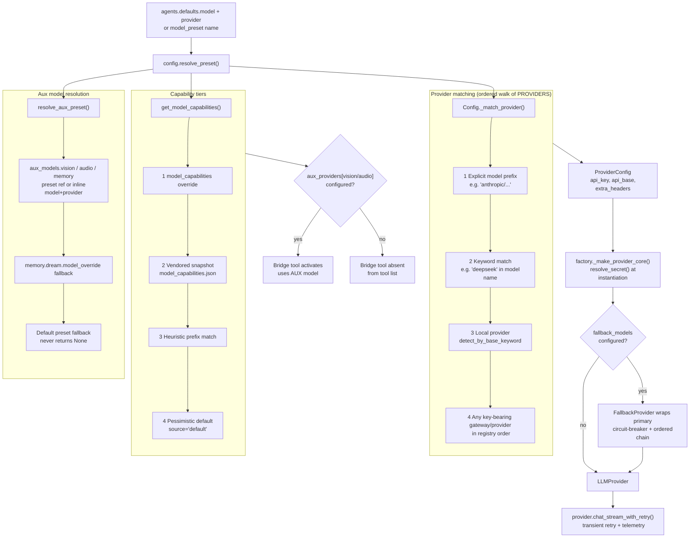

# Provider routing and capabilities

## 1. Purpose

The provider subsystem routes LLM requests to the right backend, resolves credentials
and API endpoints from config, and answers capability questions about models before
any request is sent.

Three responsibilities:

- **Routing.** Given a model name and optional provider hint, pick the correct backend
  implementation (Anthropic, OpenAI-compatible, Bedrock, Azure, OAuth-based, local).
- **Credential and endpoint resolution.** Pull `api_key`, `api_base`, and optional
  `extra_headers`/`extra_body` from the user's provider config, falling back to
  provider defaults or environment variables.
- **Capability metadata.** Determine what modalities and features a model supports
  so that bridge tools (vision, audio, memory dream) know whether to activate and
  which auxiliary model to use.

---

## 2. Mental model

**Provider detection is deterministic and ordered.** A single registry (`PROVIDERS`)
lists every supported provider as a `ProviderSpec`. Matching walks the list exactly
once: an explicit model prefix wins first (`anthropic/claude-opus-4-5` → `anthropic`),
then keyword match (`deepseek` in the model name → `deepseek`), then local-provider
detect-by-base-keyword, then any gateway or provider with a configured API key, in
registry order. First match wins. OAuth providers (GitHub Copilot, OpenAI Codex) are
skipped unless the provider is named explicitly.

**Capability resolution uses four tiers with a provenance field.** `get_model_capabilities`
tries: (1) a user-declared `model_capabilities` override, (2) the vendored consensus
snapshot merged from three public sources, (3) a heuristic by model-name prefix,
(4) a pessimistic default that assumes no vision, no audio, no PDF. The returned
`ModelCapabilities` dataclass always carries a `source` field (`"override"`,
`"snapshot"`, `"heuristic"`, or `"default"`). The `source` field is informational —
it is not inspected by bridge tools for activation decisions.

**Bridge tools gate on aux provider config, not capability source.** `InterpretImageTool`
and `InterpretAudioTool` register themselves only when `ctx.aux_providers["vision"]`
or `ctx.aux_providers["audio"]` is set (respectively). If the aux model is not
configured, the tool is absent from the LLM's tool list entirely. The capability
`source` field plays no role in bridge-tool activation.

**Auxiliary models resolve independently per purpose.** The `agents.aux_models.vision`,
`agents.aux_models.audio`, and `agents.aux_models.memory` config fields each accept
either a named preset reference or an inline `model + provider` pair. `resolve_aux_preset`
always returns a `ModelPresetConfig` — never `None` — degrading to the default preset
when no purpose-specific override is set.

**A model name only means something under its provider.** Every specific-model knob
(`skills.security.llm_judge`, `memory.dream.model_override` — deprecated in favor of
`aux_models.memory` — and inline aux entries with `provider: "auto"`) is *placed* by
`Config.match_provider_by_name`: explicit prefix, then registry keywords, over
CONFIGURED providers only — deliberately without `_match_provider`'s any-key-bearing
last resort. A name no configured provider recognizably serves falls back to the WHOLE
default preset (specific-or-default) with a loud log; pairing a foreign name with the
default provider is never correct (it produced silent per-call 404s in production).
Provider and model always travel together: consumers build their provider from the
same resolved preset (`make_provider(cfg, preset=...)`), and a failed purpose invoke
emits `aux.invoke_failure` naming the pair, because most aux consumers are
failure-open and would otherwise degrade invisibly. `durin doctor`'s "specific models"
check reports any configured knob that no longer resolves.

Cron per-job models are picker refs (`"provider model"` pairs or preset names)
resolved through the loop's override path and are pair-safe by construction. A
workflow node's bare `model` runs on the node runner's provider — for a
cross-provider node, use a `persona` (soul + model pair) instead.

---

## 3. Diagram



**PROVIDERS registry order** (first match wins on keyword walk):

| Tier | Entries |
|---|---|
| Direct / custom | `custom`, `azure_openai`, `bedrock` |
| Gateways | `openrouter`, `huggingface`, `aihubmix`, `siliconflow`, `volcengine`, `volcengine_coding_plan`, `byteplus`, `byteplus_coding_plan` |
| Standard | `anthropic`, `openai`, `openai_codex` (OAuth), `github_copilot` (OAuth), `deepseek`, `gemini`, `zhipu`, `zai_coding_plan`, `dashscope`, `moonshot`, `minimax`, `minimax_anthropic`, `mistral`, `stepfun`, `xiaomi_mimo`, `longcat` |
| Local | `vllm`, `ollama`, `lm_studio`, `atomic_chat`, `ovms` |
| Auxiliary | `nvidia`, `groq`, `qianfan` |

Gateways appear early in the registry but have no model-name keywords, so they only
match via key-prefix detection (`detect_by_key_prefix`) or explicit provider setting —
not by accident during keyword walk.

---

## 4. How it works

### 4.1 Preset resolution

Every turn starts with `config.resolve_preset(name)` (`durin/config/schema.py`). If
`agents.defaults.model_preset` is set, that named entry in `model_presets` is returned.
Otherwise `resolve_default_preset()` constructs an implicit preset from `agents.defaults`
fields, layering in any per-model parameter overrides declared under the active provider's
`models` dict and cross-referencing the capability snapshot for token bounds. The result
is a `ModelPresetConfig` — a frozen bundle of `model`, `provider`, `max_tokens`,
`context_window_tokens`, `temperature`, `reasoning_effort`, and
`preemptive_compact_ratio`. The per-(provider, model) catalog lookup
(`catalog_model_caps`, `durin/providers/provider_catalog.py`) supplies the token
bounds when no explicit override exists; `openai_codex` is not in the catalog, so
each codex slug inherits the matching `openai` entry's caps (window / output
limit) — resolution no longer skips the catalog for codex.

### 4.2 Provider matching

`Config._match_provider(model, preset)` in `durin/config/schema.py` walks `PROVIDERS`
in order:

1. If `preset.provider != "auto"`, look up that spec by name directly and return its
   `ProviderConfig`.
2. Otherwise extract the slash-prefix from the model name (e.g. `anthropic` from
   `anthropic/claude-opus-4-5`) and check whether it equals any `spec.name`; if it
   does and the spec has a key or is oauth/local/direct, return that spec.
3. Walk `PROVIDERS` testing each spec's `keywords` tuple against the model name
   (substring match, case- and hyphen-insensitive). Return the first match that has an
   API key (or is oauth/local/direct).
4. Fall back to local providers: prefer one whose `detect_by_base_keyword` matches the
   configured `api_base`, then any local provider with a configured base.
5. Final fallback: walk registry in order and return the first provider that has an API
   key, skipping OAuth specs.

The matched `ProviderConfig` carries the raw `api_key` string (may be a
`${secret:NAME}` reference), `api_base`, `extra_headers`, `extra_body`, and a per-model
`models` dict.

### 4.3 Provider instantiation

`factory._make_provider_core` (`durin/providers/factory.py`) selects the backend
implementation from `spec.backend`:

- `"anthropic"` → `AnthropicProvider` (uses Anthropic SDK)
- `"azure_openai"` → `AzureOpenAIProvider`
- `"openai_codex"` → `OpenAICodexProvider` (OAuth token flow, no API key)
- `"github_copilot"` → `GitHubCopilotProvider` (OAuth token flow)
- `"bedrock"` → `BedrockProvider` (AWS boto3 Converse API)
- `"openai_compat"` (default) → `OpenAICompatProvider`

Before instantiation, `resolve_secret()` expands any `${secret:NAME}` reference in
`api_key` and `extra_headers`/`extra_body`. The plaintext key reaches only the provider
instance and the wire — it never re-enters the `Config` object.

After construction, `provider.generation` is set from the preset's generation settings
(`temperature`, `max_tokens`, `reasoning_effort`). The `reasoning_effort` value is
translated into provider-specific extra_body fields (e.g. `{"thinking": {"type":
"enabled"}}` for providers with `thinking_style="thinking_type"`) only at request time.

### 4.4 Fallback chain

If `agents.defaults.fallback_models` is non-empty, `make_provider` wraps the primary
in `FallbackProvider` (`durin/providers/fallback_provider.py`). On each request,
`FallbackProvider` calls the primary; if the response has `finish_reason="error"` and
the error is classified as transient (rate limit, timeout, server error, quota — not
auth or content filter errors), it tries each fallback preset in order. Failover is
skipped when content has already started streaming. A circuit breaker trips the primary
after three consecutive failures and gates it for 60 seconds before retrying.

### 4.5 One transport: every completion streams

`chat_with_retry` (the request entry point every caller uses, directly or via
`chat_stream_with_retry`) rides the streaming transport internally even when the
caller consumes no deltas. The reason is connection survival, not UX: with a
non-streaming request no bytes flow while a long generation runs, and endpoints
kill such silent connections mid-response — out-of-loop callers (dream passes,
curation judge, consolidation) exhausted their retries this way on every long
generation. Streaming keeps bytes flowing, so the retry policy only has to guard
the stream open, and the provider-level idle timeout (`DURIN_STREAM_IDLE_TIMEOUT_S`)
covers stalls mid-stream. Providers without native streaming inherit the base
`chat_stream` fallback, which delegates to `chat()` and delivers the full content
as a single delta — behaviorally identical for those backends.

Providers whose `chat_stream` runs that idle watchdog declare it with the
`supports_native_streaming` class flag (Anthropic, OpenAI-compat and its
subclasses, Bedrock; `FallbackProvider` reports its primary's flag). The agent
runner reads the flag to decide liveness semantics per request: on a
natively-streaming provider a hung request is detected by stream *silence*, so
the runner relaxes the wall clock to a generous 30-minute backstop and an
actively-generating call may run as long as it needs (long workflow-synthesis
and dream calls died at the old tight cap mid-generation). The backstop is kept
rather than dropped because the watchdog counts chunks, not payload — a gateway
that emits heartbeat chunks can keep resetting it while the backend is wedged,
and unattended runs (workflows, dream, cron) need a hard upper bound. On
providers without the watchdog the runner keeps the tighter finite default. An
explicit `DURIN_LLM_TIMEOUT_S` overrides the flag-based default everywhere; `0`
disables the cap.

The idle watchdog itself has one exception: local endpoints (`is_local` specs,
loopback/LAN addresses) disable it by default, because local backends emit
nothing for minutes while evaluating a large prompt — stall detection would kill
healthy requests. A genuinely hung local server is still bounded by the HTTP
client timeout. An explicit `DURIN_STREAM_IDLE_TIMEOUT_S` re-enables it.

### 4.6 Capability lookup

`get_model_capabilities(model, provider, overrides)` (`durin/providers/capabilities.py`)
implements a four-tier fallthrough:

1. **Override**: if `overrides` contains a key matching the model name (bare or
   `provider/model`), that dict is layered on top of whatever the lower tiers return,
   and `source` is forced to `"override"`.
2. **Snapshot**: `_load_capabilities_snapshot()` reads `durin/providers/data/model_capabilities.json`
   once and caches it. The file is a consensus merge of LiteLLM, OpenRouter, and
   models.dev entries. Lookup normalizes the model name to a bare lowercase key
   (`_canonical_lookup_key`), stripping provider prefixes and Bedrock dot-prefixes. A
   snapshot hit sets `source="snapshot"`.
3. **Heuristic**: `_HEURISTIC_RULES` is a tuple of `(prefix, flags)` pairs covering
   well-known model families (claude-3, gpt-4o, gemini, etc.). First prefix match wins,
   `source="heuristic"`.
4. **Default**: all capability flags `False`, `source="default"`.

The `source` field is informational; bridge tools do not inspect it for activation.
`InterpretImageTool` and `InterpretAudioTool` gate purely on whether
`ctx.aux_providers["vision"]` or `ctx.aux_providers["audio"]` is configured — if
the aux model entry is absent, the tool is not registered in the tool list at all.

### 4.7 Per-provider model catalog

The picker and the Providers settings list read a per-provider catalog
(`provider_models`, `durin/providers/provider_catalog.py`) that is distinct from the
capability snapshot: it answers "which models can this provider serve", with the same
capability fields attached per entry. Sources, in overlay order:

1. **Vendored floor**: `durin/providers/data/provider_models.json`, regenerated by
   `scripts/refresh_model_capabilities.py` from models.dev's per-provider index.
2. **Daily user cache**: `catalog_refresh` re-fetches models.dev in the background and
   writes `provider_models_cache.json` under the data dir; a provider present in the
   cache replaces its floor entry wholesale. The scheduler derives its due time from
   the cache file's mtime (missing/overdue → immediate background fetch), so the
   daily cadence survives process restarts.
3. **Live listings** where the provider itself is authoritative: local providers
   (ollama, LM Studio, …) query their `/v1/models` at read time and fall back to the
   floor; `openai_codex` maps live codex slugs onto `openai` catalog caps.

**NVIDIA** gets live treatment at *build* time in both generation paths: its
`/v1/models` is public (no key), and models.dev drifts badly for this provider — stale
entries and re-spelled version separators (`3_1`/`v03` for NVIDIA's `3.1`/`v0.3`)
that the API 404s on. So the model ids come from NVIDIA's endpoint (ground truth) and
models.dev contributes only the capability metadata the endpoint doesn't expose,
matched separator-insensitively (`apply_nvidia_live_ids`,
`durin/providers/models_dev.py`). If the endpoint is unreachable, the dev script keeps
the models.dev list with a warning, while the daily refresh omits `nvidia` from the
cache so the overlay falls through to the (already ground-truthed) vendored floor
rather than resurrecting the drifted list.

The vendored floor is also refreshed weekly by the `model-catalog` workflow, which
runs the script with `--strict` (any source failing aborts before writing, so an
unattended run can never commit a partial merge or drifted ids) and lands the result
as an auto-PR for human review — never a direct push.

### 4.8 Auxiliary model resolution

`resolve_aux_preset(config, purpose="memory"|"judge")` (`durin/memory/model_resolve.py`)
resolves the model used by out-of-loop LLM calls (dream passes, skill security judge).
For purpose `"memory"`:

1. If `agents.aux_models.memory` is set — try the `preset` reference first, then the
   inline `model` field.
2. If `memory.dream.model_override` is set — use that model with the default preset's
   provider.
3. Otherwise — return the default preset unchanged.

The function always returns a `ModelPresetConfig`. Bridge tools and dream passes build
their provider from this preset using the same factory path as the primary model.

### 4.9 Per-turn provider snapshot

`build_provider_snapshot` (`durin/providers/factory.py`) wraps the full chain
(resolved preset + provider instance + fallback chain) into a `ProviderSnapshot`. The
snapshot carries a `signature` tuple computed from every config field that can affect
the provider (model, api_key, api_base, extra_headers, fallback presets, generation
settings). When a `/model` switch or config reload changes the signature, the agent
loop builds a fresh snapshot rather than reusing the stale one. This isolates each
turn from mid-session provider changes on other sessions.

### 4.10 Request hardening and reactive recovery

The OpenAI-compatible request is sent in the **OpenAI-standard shape by default**,
and only degraded for the specific endpoints that prove they need it — rather than
carrying per-model allowlists that rot as providers ship new models. Four behaviors
implement this:

- **Assistant content rides alongside `tool_calls`.** `_sanitize_messages` keeps the
  model's own narration on tool-call turns. Blanking it (the earlier default) hid
  what the model had already said, so models that narrate every step — GLM in
  particular — re-emitted the same acknowledgment on each tool step of a turn.
- **Surrogate scrub.** Lone UTF-16 surrogate code points emitted by byte-level
  reasoning models (GLM, Kimi, MiMo) are replaced with U+FFFD before the body is
  UTF-8 encoded; otherwise one bad code point raises `UnicodeEncodeError` and sinks
  the whole call.
- **DeepSeek reasoning pad is a single space.** When thinking mode requires a
  `reasoning_content` on replayed tool-call turns, the backfill is `" "`, not `""` —
  DeepSeek V4 Pro rejects the empty string ("must be passed back to the API"). A
  legacy `""` is upgraded on the way out.
- **Overload backoff.** `_is_overloaded_response` (Z.AI Coding Plan GLM returns
  HTTP 429 code `1305`, "service temporarily overloaded") switches the retry loop
  from the fast default schedule to a wider one (`_OVERLOAD_BACKOFF_DELAYS`) so it
  stops hammering a still-hot endpoint.

The self-healing net is `_recover_request_for_error(kw, response)`. On a
*non-transient* error the retry loop calls it once; a provider overrides it to strip
the piece the endpoint just rejected and return a mutated request the loop retries a
single time. The OpenAI-compat provider recovers three shapes: content sent alongside
`tool_calls` (blank it — the backstop for the default above), and an unsupported
`temperature` or token-limit param (drop it via the `_OMIT` sentinel that
`_build_kwargs` honors). A new model whose endpoint quietly drops support for a param
is absorbed here without a code edit; the base-class default is no recovery.

---

## 5. Key types and entry points

| Symbol | File | Role |
|---|---|---|
| `ProviderSpec` | `durin/providers/registry.py` | Frozen metadata for one provider: `name`, `keywords`, `env_key`, `backend`, gateway/local/oauth/direct flags, `strip_model_prefix`, `thinking_style`, `supports_prompt_caching` |
| `PROVIDERS` | `durin/providers/registry.py` | Ordered tuple of all `ProviderSpec` entries; order controls match priority |
| `LLMProvider` | `durin/providers/base.py` | Abstract base: `chat()`, `chat_stream()`, `chat_stream_with_retry()`, retry logic, message sanitization, `generation` settings |
| `LLMResponse` | `durin/providers/base.py` | Response dataclass: `content`, `tool_calls`, `finish_reason`, `usage`, structured error fields (`error_kind`, `error_status_code`, `error_should_retry`) |
| `GenerationSettings` | `durin/providers/base.py` | Frozen defaults: `temperature`, `max_tokens`, `reasoning_effort`; set on provider after construction |
| `AnthropicProvider` | `durin/providers/anthropic_provider.py` | Anthropic SDK backend; handles prompt caching, extended thinking, streaming |
| `OpenAICompatProvider` | `durin/providers/openai_compat_provider.py` | OpenAI-compatible backend; covers most providers including Bedrock gateway, gateways, local |
| `BedrockProvider` | `durin/providers/bedrock_provider.py` | AWS Bedrock Converse API via boto3 |
| `AzureOpenAIProvider` | `durin/providers/azure_openai_provider.py` | Azure OpenAI direct API |
| `GitHubCopilotProvider` | `durin/providers/github_copilot_provider.py` | OAuth token flow for GitHub Copilot |
| `OpenAICodexProvider` | `durin/providers/openai_codex_provider.py` | OAuth token flow for OpenAI Codex |
| `FallbackProvider` | `durin/providers/fallback_provider.py` | Wraps primary + fallback presets; circuit breaker + ordered failover |
| `ModelCapabilities` | `durin/providers/capabilities.py` | Frozen capability snapshot: vision, audio, pdf, video, function calling, reasoning, prompt caching, `source` provenance field |
| `get_model_capabilities` | `durin/providers/capabilities.py` | Four-tier capability lookup entry point |
| `model_capabilities.json` | `durin/providers/data/model_capabilities.json` | Vendored consensus snapshot (LiteLLM + OpenRouter + models.dev); keyed by bare lowercased model name |
| `ProviderSnapshot` | `durin/providers/factory.py` | Immutable result: `provider`, `model`, `context_window_tokens`, `signature`, `preemptive_compact_ratio` |
| `build_provider_snapshot` | `durin/providers/factory.py` | Primary factory: resolve preset → match provider → instantiate backend → wrap in FallbackProvider |
| `make_provider` | `durin/providers/factory.py` | Lower-level factory returning bare `LLMProvider` (used by fallback chain internally) |
| `ProviderConfig` | `durin/config/schema.py` | Per-provider user config: `api_key`, `api_base`, `extra_headers`, `extra_body`, `models` dict |
| `ProvidersConfig` | `durin/config/schema.py` | Container with one `ProviderConfig` field per provider name |
| `ModelPresetConfig` | `durin/config/schema.py` | Named preset: `model`, `provider`, `max_tokens`, `context_window_tokens`, `temperature`, `reasoning_effort`, `preemptive_compact_ratio` |
| `AuxModelConfig` | `durin/config/schema.py` | Aux bridge config: `preset` (named preset ref) or inline `model` + `provider` |
| `AuxModelsConfig` | `durin/config/schema.py` | Container: `vision`, `audio`, `memory` (each `AuxModelConfig | None`) |
| `Config._match_provider` | `durin/config/schema.py` | Ordered provider walk returning `(ProviderConfig, spec_name)` |
| `Config.resolve_preset` | `durin/config/schema.py` | Return `ModelPresetConfig` from named preset or implicit default |
| `resolve_aux_preset` | `durin/memory/model_resolve.py` | Resolve purpose-specific preset for out-of-loop calls; never returns `None` |

---

## 6. Configuration and surfaces

### Config keys

**Primary model and provider**

| Key | Default | Description |
|---|---|---|
| `agents.defaults.model` | `anthropic/claude-opus-4-5` | Active model ID |
| `agents.defaults.provider` | `auto` | `auto` (detect by model name) or an explicit provider name |
| `agents.defaults.model_preset` | `null` | When set, overrides `model`/`provider`/generation fields with the named preset |
| `agents.defaults.max_tokens` | `8192` | Max output tokens (inherited by default preset) |
| `agents.defaults.context_window_tokens` | `65536` | Context window used for compaction budgeting |
| `agents.defaults.temperature` | `0.4` | Sampling temperature |
| `agents.defaults.reasoning_effort` | `null` | Thinking effort: `low`/`medium`/`high`/`adaptive`/`none` |
| `agents.defaults.fallback_models` | `[]` | Ordered list of preset names or inline `{model, provider}` configs |
| `agents.defaults.parallel_tool_calls` | `{}` | Per-model-substring gate for the OpenAI `parallel_tool_calls` flag |

**Named presets**

```yaml
model_presets:
  fast:
    model: deepseek/deepseek-chat
    provider: deepseek
    max_tokens: 4096
    context_window_tokens: 65536
    temperature: 0.1
    reasoning_effort: null
    preemptive_compact_ratio: 0.5
```

**Provider credentials**

```yaml
providers:
  anthropic:
    api_key: "${secret:ANTHROPIC_API_KEY}"   # or literal
    api_base: null                            # uses Anthropic default
    extra_headers: {}
    extra_body: {}
    models:
      claude-opus-4-5:
        max_tokens: 16384
  openrouter:
    api_key: "sk-or-..."
    api_base: "https://openrouter.ai/api/v1"
```

Per-model entries (`ModelEntry`) hold `max_tokens`, `context_window_tokens`,
`temperature`, `reasoning_effort`, `request_timeout_s`, and the sampling params
`top_p` / `top_k` / `repeat_penalty` — each `null` inherits the catalog value,
then `agents.defaults`. `request_timeout_s` overrides the per-request LLM timeout
for that model (default `DURIN_OPENAI_COMPAT_TIMEOUT_S`, 300s); raise it for slow
local models (a large-context ollama/LM Studio model can take minutes to first
token). `top_p` is a standard param; `top_k` and `repeat_penalty` are non-standard
and ride in the request `extra_body` (ollama / LM Studio read them there), under
any provider-level `extra_body`. The Settings webui edits these under each provider
(except `request_timeout_s`, which is config-file only).

**Capability overrides**

```yaml
model_capabilities:
  my-local-llama:
    supports_vision: false
    supports_function_calling: true
    max_input_tokens: 128000
    max_output_tokens: 4096
```

Overrides are keyed by bare model name or `provider/model` form. Provider-qualified
keys win over bare names.

The Settings webui exposes the vision/audio/reasoning flags per model as a tri-state
selector (inherit / yes / no) that writes `provider/model`-keyed entries here via the
provider-model upsert API; "inherit" clears the override so the model falls back to
the snapshot/heuristic. Flags not surfaced in the editor (token bounds, function
calling, …) stay editable in YAML and are preserved across webui edits.

**Auxiliary models**

```yaml
agents:
  aux_models:
    vision:
      preset: fast          # reference a named preset
    audio:
      model: whisper-large  # inline model
      provider: groq
    memory:
      preset: fast
```

| Key | Default | Description |
|---|---|---|
| `agents.aux_models.vision` | `null` | Vision bridge model; disables interpret_image tool when unset |
| `agents.aux_models.audio` | `null` | Audio bridge model; disables interpret_audio tool when unset |
| `agents.aux_models.memory` | `null` | Dream pass model; falls back to `memory.dream.model_override` then default preset |
| `memory.dream.model_override` | `null` | Per-dream model name override (fallback when `aux_models.memory` not set) |

### Provider-selection surfaces

- **TUI / CLI `/model` command**: switches `agents.defaults.model` and `agents.defaults.provider`
  at runtime; the loop builds a fresh `ProviderSnapshot` when the signature changes.
- **Settings webui**: provider-first model picker writes `(provider, model)` pair to
  config; the provider field is `"auto"` unless the user selects a specific override.
- **`durin status`**: shows each configured provider, its credential status, and the
  active model.
- **`durin doctor`**: validates that the active provider has an API key and that the
  capability snapshot loaded.
- **API `PATCH /api/v1/config`**: updates config fields; a preset switch takes effect
  on the next turn.

### OAuth credential surfaces

Two shapes of provider OAuth live behind `/api/v1/oauth/*` (`OAuthService`,
`durin/service/oauth.py`) and `durin oauth login <provider>`:

- **Token-based** (`openai_codex`, `github_copilot`): the flow yields an OAuth
  token that the provider backend refreshes; no `api_key` exists. Codex offers
  loopback PKCE and a device-code fallback for remote/headless gateways.
- **Key-acquiring** (`openrouter`): OpenRouter's PKCE exchange returns a plain
  user-controlled API key (`durin/providers/openrouter_oauth.py`), stored like
  a manual paste — secret store + `${secret:}` reference in
  `providers.openrouter.api_key` — so the spec stays a normal api-key provider.
  OpenRouter has no device-code flow, but unlike Codex its `callback_url` is
  caller-chosen, so the connect flow resolves a redirect base the same way MCP
  OAuth does (config `gateway.public_url`, else the webui's own origin): with
  a base it routes through the gateway's own OAuth callback route for a
  one-click remote connect; without one, the loopback path stays local-only
  and remote gateways paste the key manually.

Loopback eligibility (`is_local`) is derived **server-side** from the transport
peer by the ASGI glue for any request model declaring the field — a client
cannot claim locality, it only follows from actually connecting via loopback.

---

## 7. Curated rationale

**Why ordered registry instead of a capability negotiation protocol?**
Provider APIs are not stable enough for a handshake-based dispatch. An ordered static
list with deterministic rules is reproducible, debuggable, and works offline. Operators
who need a specific routing can always pin `provider: "openrouter"` and bypass keyword
detection entirely.

**Why four capability tiers and a `source` field?**
Capability data degrades gracefully without crashing. A model the snapshot doesn't know
about still gets a `heuristic` or `default` result rather than an error. The `source`
field is useful for diagnostics and tooling — it tells observers whether a capability
answer came from a confirmed snapshot entry, a name-prefix heuristic, or a pessimistic
fallback. Bridge tool activation is governed separately: `interpret_image` and
`interpret_audio` register only when the user explicitly configures an aux provider for
that purpose, so the conservative choice — no aux config, no bridge — is enforced at
the config layer, not at runtime capability inspection.

**Why does prompt-caching support live on the provider spec, not on `ModelCapabilities`?**
Prompt caching requires the provider to proxy the `cache_control` field on content
blocks. A model that supports caching natively may be served through a gateway that
strips the field. Gating on the provider spec (not the model's inherent capability)
prevents sending cache markers to gateways that reject them.

**Why does `resolve_aux_preset` never return `None`?**
Bridge tools and dream passes are invoked from contexts that already own a running
provider. Forcing a fallback to the default preset means they always have a valid,
callable model — the user's own model, with the user's own credentials. Returning
`None` would push the "what model do we use?" decision to every call site, multiplying
the failure modes.
