# Security

## 1 Purpose

This document is a comprehensive reference for durin's defense-in-depth security
architecture. It covers five interlocking layers:

- **Secret storage and injection** — plaintext credentials live only in a
  mode-0600 file; config holds opaque references; subprocesses receive scoped
  values at execution time.
- **Skill and MCP import gates** — every externally-sourced skill passes a
  deterministic static scan before installation; an optional LLM semantic judge
  provides multilingual coverage.
- **Shell execution policy** — a layered guard pipeline (deny patterns, memory
  vault protection, workspace boundary, SSRF URL detection) runs before every
  subprocess; the environment is scrubbed to a minimal set plus explicitly
  authorized secrets.
- **SSRF network protection** — all outbound HTTP fetches resolve the target
  hostname once, validate it against a private-network blocklist, and pin the
  connection to the validated IP to close DNS-rebinding races.
- **API token and permission management** — bearer tokens carry salted SHA-256
  hashes; each token's scopes are checked against a fine-grained `Scope` catalog
  at every service route.

Each layer stands alone and also reinforces the others. No single configuration
mistake, LLM-generated command, or malicious skill can bypass all layers.

## 2 Mental model

**Secrets as lazy-resolved references.** Plaintext credentials never enter the
`DurinConfig` object. Config fields hold a `${secret:NAME}` reference string.
Every consumer that needs the value calls `resolve_secret()` at the point of use.
A second mechanism, *scoped auto-injection*, pushes matching secrets into
subprocess environments automatically — the scope field on each entry controls
which consumers qualify.

**Layered skill import gates.** Importing a skill passes two independent scan
stages. The first is deterministic: a regex and AST pass that always runs.
The second is an optional LLM semantic judge, which handles non-English and
paraphrased threats that regex cannot reach. The judge is capped at a configurable
severity ceiling and can never block a skill on its own — only the deterministic
scan produces a blocking verdict. A human confirmation step sits between a
suspicious scan result and installation.

**Execution policy as defense-in-depth.** The shell execution path is not a
single wall; it is a sequence of independent checks. A command that clears one
check still faces the next. Deny patterns, memory vault protection, workspace
boundary enforcement, and SSRF URL detection run in sequence. The subprocess
environment is assembled from scratch (no ambient API keys), with only explicitly
authorized values added back.

## 3 Diagram

```mermaid
flowchart TD
    subgraph "Secret lifecycle"
        U["User stores secret"] --> SS["secrets.json\nmode 0600"]
        SS --> REF["Config field:\n'${secret:NAME}'"]
        REF --> RS["resolve_secret()\nat point of use"]
        RS --> PTV["Plaintext value\n(never stored in Config)"]
        SS --> CF["collect_for('exec')\nPhase-2 auto-inject"]
        CF --> ENV["Subprocess env\n(scoped secrets only)"]
    end

    subgraph "Skill import gate"
        SRC["External source\n(github/clawhub/url)"] --> FETCH["Fetch to\nquarantine dir"]
        FETCH --> SCAN["scan_skill()\ndeterministic:\nregex + AST + OSV"]
        SCAN --> JUDGE{"LLM judge\n(if configured)"}
        JUDGE --> VERDICT["ScanReport.verdict\n(safe / caution / dangerous)"]
        VERDICT -->|"dangerous"| BLOCK["Blocked"]
        VERDICT -->|"caution or\ncarries code"| CONFIRM["Human confirm\nrequired"]
        VERDICT -->|"safe +\nallowlisted"| INSTALL["install_imported_skill()"]
    end

    subgraph "Shell execution policy"
        CMD["exec command"] --> GC["_guard_command()"]
        GC -->|"deny pattern\nmatch"| ERR1["Error: blocked"]
        GC -->|"memory/\nmutation"| ERR2["Error: use memory tools"]
        GC -->|"allow_patterns\nallowlist miss"| ERR3["Error: not in allowlist"]
        GC -->|"internal URL"| ERR4["Error: SSRF target"]
        GC -->|"path outside\nworkspace"| ERR5["Error: workspace boundary"]
        GC -->|"pass"| BE["_build_env()\nminimal + allowed_env_keys\n+ scoped secrets"]
        BE --> SW["sandbox wrap\n(if configured)"]
        SW --> PROC["subprocess"]
    end

    subgraph "API auth"
        BT["Bearer token\n(HTTP header)"] --> LH["hash lookup\nHMAC compare_digest"]
        LH -->|"match"| PR["Principal\n(subject, scopes, kind)"]
        LH -->|"no match"| UN["401 Unauthorized"]
        PR --> RQ["principal.require(Scope.X)\nat each route"]
        RQ -->|"missing scope"| FB["403 ForbiddenError"]
        RQ -->|"has scope\nor ADMIN"| OK["Authorized"]
    end

    subgraph "SSRF guard (outbound HTTP)"
        URL["Outbound URL"] --> RAV["resolve_and_validate(host)"]
        RAV -->|"private/internal IP"| SE["SSRFError raised"]
        RAV -->|"public IP"| PIN["SSRFGuardTransport\npins connection to IP\nre-validates on redirect"]
    end
```



## 4 How it works

### Secret store lifecycle

`SecretStore` (`durin/security/secrets.py`) owns all credential storage. Secrets
live in `secrets.json` at mode 0600 alongside the config file; plaintext never
enters the config tree. Every mutation — put, remove, scope change — is wrapped in
a `cross_process_lock` that performs a full load-mutate-save cycle to prevent
concurrent writers from losing each other's changes.

All user-facing writes funnel through `SecretsService.store_entry`
(`durin/service/secrets.py`) — the CLI, the webui panel, the TUI prompt, and the
websocket `secret_store` frame share its contract: create-or-update with full
metadata, an empty value as a metadata-only edit of an existing entry, and
`rotate=True` as the mirror case — a value-only replacement that preserves
service, account, description, scope, and origin, and never creates. Rotation is
what the agent's `request_secret` tool triggers with `update=true`: the agent
declares the intent in a structural flag (an existing secret is never touched
without it), the channel prompts the user, and the user supplies the new value
through the same secure paths — the value still never reaches the model.

Secret names must match `[A-Z][A-Z0-9_]*`, making them valid environment variable
names — intentional, because Phase-2 auto-injection uses them directly as env var
keys. A config field that holds `${secret:NAME}` is validated by `is_secret_ref()`
and resolved only at the point of use via `resolve_secret()`, which delegates to
the process-wide cached store. This keeps the plaintext out of the `Config` object,
logs, and telemetry.

The `scope` field on a `SecretEntry` governs auto-injection only, not
config-field resolution. When `ExecTool._build_env()` constructs the subprocess
environment, it calls `collect_for("exec")`, which returns only entries whose scope
authorizes the `exec` consumer. The scope check uses `scope_allows()`, which
supports exact matches (`exec`) and family wildcards (`skill:*` covers
`skill:deploy`). A `${secret:NAME}` reference written into a config field is itself
the authorization to resolve that credential; the scope field is a separate, additive
gate for automatic subprocess injection.

`SecretRedactor` (`durin/security/secrets.py`) scrubs tool output before returning it
to the model. Two layers run: a value-based pass that replaces known stored values
with `«redacted:NAME»` markers (skipping values shorter than 8 characters to avoid
false positives on common substrings), and an optional pattern-based pass that masks
credential-shaped strings by format — vendor prefixes (`sk-`, `ghp_`, `AKIA…`),
PEM blocks, `Authorization: Bearer` headers, env-style key-value assignments, and
JSON credential fields — regardless of whether the value is in the store.

### Shared GitHub credential

GitHub access — raising the API rate limit and reaching private repos — is one
credential shared by every general consumer, not a token configured per feature.
`resolve_github_token()` (`durin/security/github_auth.py`) is the single resolver:
it tries the `gh` CLI (`gh auth token`), then the environment (`GITHUB_TOKEN` /
`DURIN_GITHUB_TOKEN`), then the shared `GITHUB_OAUTH` secret written by the connect
flow, then any legacy per-feature secret name passed for migration. It returns `""`
(anonymous) and never raises, so GitHub access degrades rather than breaking. Skills
(`skill_resolve`) and MCP discovery (`mcp_github`) both read through it.

The connect flow is GitHub's OAuth **device flow** against durin's own OAuth App
(`durin/security/github_device_auth.py`): a public client id, no client secret — so
it is safe in this repo and works on a remote gateway. `request_device_code` starts
the flow and stashes the poll secret server-side behind an opaque `flow_id` (the
browser never holds the `device_code`); `poll_flow` exchanges it and, on success,
writes the raw token to the `GITHUB_OAUTH` secret. Default scope is minimal
(`read:user`); `repo` is requested only when private-repo access is needed. The
flow is transient-tolerant: a failed poll (network hiccup, GitHub 5xx/429) maps
to a `transient` status instead of an error — the flow stays pending on both
sides and polling continues until the code expires — and the dashboard's poll
loop likewise retries a bounded number of consecutive failures before aborting
visibly. Flow lifecycle (start / authorized / expired / denied, plus transient
poll failures) is logged, so a stuck connect can be diagnosed from the gateway
log. The
`OAuthService` exposes start / poll / status / disconnect (see [api.md](api.md)) —
status is a live probe that reports **where the token came from** (`gh` / env /
secret), the login, granted scopes, and rate budget, so the dashboard only offers a
"disconnect" for durin's own stored secret (a `gh`/env token is ambient, not durin's
to forget). The GitHub MCP server rides the same credential: at launch a
declared-but-empty GitHub-token env var (e.g. `GITHUB_PERSONAL_ACCESS_TOKEN`) is
filled from the resolver, and never added to a server that did not declare one.

### Skill import gate

Skill imports flow through two independent scan stages before installation.

**Deterministic scan** (`durin/security/skill_scan.py`, `scan_skill()`): runs
unconditionally. It applies body rules to `SKILL.md` (prompt injection patterns,
hidden-instruction HTML comments, sensitive path references, hardcoded secrets,
invisible Unicode codepoints) and code rules to every script file in the skill
tree (fetch-and-execute patterns, destructive commands, dynamic eval, reverse shell
primitives, data exfiltration shapes, privilege escalation, excessive agency,
safety-bypass flags). Python scripts also receive an AST behavioral pass
(`durin/security/skill_ast.py`). Install specs are validated against allowlist
patterns per ecosystem and looked up in the OSV malware feed (fail-open on network
errors). The result is a `ScanReport` whose `verdict` property maps the maximum
severity finding to `safe`, `caution`, or `dangerous`.

**LLM semantic judge** (`durin/security/skill_judge.py`, `judge_skill()`): runs
only when configured (`trigger = uncertain|always`). It receives the skill body
and script files (up to 12,000 characters), prompts the model to identify concrete
problems with exact evidence, and parses the structured response. The judge's
severity is capped at the configured `max_severity` (default `caution`). This
means the judge can force a confirmation step but can never produce a `dangerous`
verdict on its own — only the deterministic scan does that. If the judge errors or
times out, the deterministic report stands unchanged.

`ScanReport.verdict` merges both scans: when a `judge_verdict` is present it takes
precedence (within the severity cap), otherwise the findings list determines the
verdict.

Installation is governed by a `decide_action` gate in `durin/agent/skills_import.py`:
`dangerous` blocks unconditionally; `caution`, code-carrying skills, or sources
not matching the allowlist require explicit human confirmation; safe allowlisted
skills install without a confirmation step.

**Skill reviews** (`durin/security/skill_reviews.py`): a user or the LLM judge
can mark an active flagged skill as reviewed. The review stores a `content_hash`
(SHA-256 over `SKILL.md` and all script files) and a set of finding fingerprints.
`get_review()` returns a stored review only when both the content hash and the
acked finding fingerprints match the current scan results — a content edit or a
new scanner finding invalidates the review.

### Shell execution policy

`ExecTool.execute()` (`durin/agent/tools/shell.py`) runs every shell command
through a layered guard pipeline before spawning a subprocess.

**Workspace boundary on `working_dir`**: when `restrict_to_workspace` is enabled,
the requested `working_dir` is resolved and checked against the configured
workspace root before any guard runs. An LLM-supplied directory outside the
workspace is rejected immediately, preventing a caller from using `working_dir`
as a bypass.

**`_guard_command()`**: applies deny and allow patterns, then memory vault
protection, then SSRF URL detection, then workspace boundary on absolute paths.

- *Deny/allow logic*: when `allow_patterns` are configured they form an allowlist
  (commands not matching any pattern are blocked). When only `deny_patterns` are
  configured (the default), the list is an opt-out — matching commands are blocked
  unless an `allow_patterns` entry explicitly exempts them. Hardcoded deny patterns
  cover `rm -rf`, `dd`, disk operations, power commands, fork bombs, and direct
  writes to internal state files (`history.jsonl`, `.dream_cursor`).

- *Memory vault protection* (`_guard_memory_mutation()`): mutations of the
  `memory/` directory via `rm`, `mv`, `cp`, `tee`, `sed -i`, `dd`, and redirect
  operators are blocked entirely. This preserves FTS and vector index consistency —
  memory modifications must go through `memory_store`/`memory_forget` tools.

- *SSRF URL detection* (`contains_internal_url()`): URLs embedded in the command
  string are extracted and validated against the private-network blocklist. A
  command containing a URL that resolves to an RFC1918 or cloud-metadata address
  is blocked.

- *Workspace boundary on absolute paths*: when `restrict_to_workspace` is enabled,
  absolute paths extracted from the command string are resolved and checked against
  the workspace root. Symlinks are followed to their real path. Kernel device files
  (`/dev/null`, `/dev/stdout`, etc.) are exempt via `_BENIGN_DEVICE_PATHS`.

**`_build_env()`**: constructs the subprocess environment from scratch. On Unix,
only `HOME`, `LANG`, `TERM`, and `PYTHONUNBUFFERED` are forwarded; `bash -l`
sources the user's profile to populate `PATH` and other essentials. On Windows,
a curated set of system variables is forwarded. Ambient API keys and any other
parent-process environment variables are not inherited unless explicitly listed in
`allowed_env_keys`. Scoped secrets from `collect_for("exec")` are added last.

After the guard pipeline, the command is optionally wrapped by a sandbox
(`bwrap`, `docker`, or `testbed`; empty for none) before spawning.

### Workflow script nodes

A workflow's script node (`ScriptNode`, see [workflow.md](workflow.md)) runs an
inline `command` or a file under `<workspace>/workflows/scripts/` as a subprocess.
These are local, user-authored workflow definitions and script files, not
externally-sourced content — the same trust model as the agent's shell tool
(`ExecTool`): executing them is equivalent to the user running them directly. A
script node's subprocess does **not** go through `ExecTool`'s guard pipeline (deny
patterns, workspace boundary, SSRF URL detection) or a sandbox — there is no
sandboxing at all. Its environment is separate from `_build_env()` but follows the
same instinct: by default (`env: "clean"`, the node's default) the subprocess gets a
minimal allowlist (`PATH`, `HOME`, `USER`, `SHELL`, `LANG`, `LC_ALL`, `LC_CTYPE`,
`TERM`, `TMPDIR`, `DURIN_HOME` — only those present) plus the `DURIN_*` run-metadata vars, keeping
ambient provider keys and other gateway-process secrets out of the subprocess. A node
can opt into `env: "inherit"` to get the full gateway process environment
(`dict(os.environ)`) instead — consistent with the same local-trust model, but a
per-node choice rather than the default. Importing remote or third-party workflow
definitions (and the scripts they reference) is not supported in this scope.
`PUT /api/v1/workflows/scripts/{name}` (`workflows:write`) lets the editor create
or replace one of these script files over HTTP: the name is validated as a
single relative path segment (no `..`, no `/`) before it ever reaches the
filesystem, and content is capped at 256 KB — the write door is guarded, but a
principal with `workflows:write` can still land a script that a subsequent run
executes with the same local trust as one placed on disk by hand.

### SSRF network guard

All outbound HTTP fetches from durin's internal tools use `ssrf_safe_async_client()`
(`durin/security/network.py`), which builds an `httpx.AsyncClient` with
`SSRFGuardTransport` as the transport layer.

`resolve_and_validate(host)` resolves the hostname to IP addresses, normalizes
IPv4-mapped IPv6 addresses, and rejects any address in `_BLOCKED_NETWORKS` (which
covers `0.0.0.0/8`, loopback, RFC1918 ranges, link-local/cloud-metadata
`169.254.0.0/16`, carrier-grade NAT `100.64.0.0/10`, and IPv6 equivalents). It
returns the validated IP string. `SSRFGuardTransport.handle_async_request()` calls
`resolve_and_validate()` on every request, then replaces the URL's host with the
validated IP while preserving the original `Host` header (for name-based virtual
hosting) and the TLS SNI (for certificate verification). Because httpx routes every
redirect through the transport, redirect targets are re-validated automatically —
no per-hop manual check is needed.

For deployments on internal networks (e.g., Tailscale), `configure_ssrf_whitelist()`
accepts CIDR ranges that bypass the private-address block. The whitelist applies to
both `resolve_and_validate()` and `validate_url_target()`.

### API token and permission management

`ApiTokenStore` (`durin/security/api_tokens.py`) stores API tokens at
`~/.durin/api_tokens.json` (mode 0600). Each `issue()` call generates a random
plaintext token (`nbwt_` prefix, 32 URL-safe bytes), derives a 16-byte random
salt, and stores the salted SHA-256 hash — the plaintext is returned once and
never written to disk. Expired tokens are purged on every issue; the live set is
capped at 10,000 entries to bound store growth. `resolve()` iterates stored tokens
and uses `hmac.compare_digest()` for timing-safe comparison.

`Principal` (`durin/service/principal.py`) is an immutable dataclass carrying
`subject` (token id or `"local"`), `scopes` (a `frozenset[str]` of scope string
values), and `kind` (`"local"` or `"remote"`). In-process callers (TUI, cron)
use `Principal.local()`, which carries `Scope.ADMIN` and is never checked against
a token. Remote callers receive a `Principal` built from the verified token's
stored scopes. `principal.require(Scope.X)` raises `ForbiddenError` if the
principal lacks the scope (or `ADMIN`). The scope catalog is declared in the
`Scope` enum and covers paired read/write scopes for every service domain:
settings, secrets, skills, cron, sessions, config, memory, MCP, workflows,
loops, and system.

`AuthService` (`durin/service/auth.py`) owns token lifecycle routes; it calls
`principal.require(Scope.SYSTEM_WRITE)` before issuing or revoking tokens, so
only callers with system-write authority can manage other tokens.

## 5 Key types and entry points

| Symbol | File | Role |
|---|---|---|
| `SecretStore` | `durin/security/secrets.py` | File-backed persistent store; load/put/remove under `cross_process_lock`; `resolve()` for config-field use, `collect_for()` for Phase-2 injection |
| `SecretEntry` | `durin/security/secrets.py` | Pydantic model per stored secret: `value`, `service`, `account`, `description`, `scope`, `origin`, `created_at` |
| `SecretRedactor` | `durin/security/secrets.py` | Two-layer output scrubber: value-based (`«redacted:NAME»`) + pattern-based (`«redacted»`) for credential-shaped strings |
| `resolve_secret` | `durin/security/secrets.py` | Module-level function; resolves a `${secret:NAME}` ref via the process-wide cached store; raises `SecretNotFoundError` on a dangling reference |
| `ScanReport` | `durin/security/skill_scan.py` | Result of deterministic skill scan: `findings` list, `tools` list, `judge_verdict`; `.verdict` property merges both |
| `Finding` | `durin/security/skill_scan.py` | Single scan result: `category`, `severity` (info/caution/high/dangerous), `where` (file/location), `detail` |
| `scan_skill` | `durin/security/skill_scan.py` | Entry point for the deterministic scan; applies body rules to `SKILL.md` and code rules + AST pass to all script files |
| `JudgeOutcome` | `durin/security/skill_judge.py` | LLM judge result: `findings` (severity-capped), `verdict`, `summary`, `tools` |
| `judge_skill` | `durin/security/skill_judge.py` | Runs the LLM judge; capped at `max_severity`; raises `JudgeError` on parse failure (never blocks on error) |
| `audit_skill` | `durin/security/skill_judge.py` | Convenience entry point: deterministic scan merged with optional LLM judge |
| `ExecTool` | `durin/agent/tools/shell.py` | Shell execution tool; applies `_guard_command()`, builds scrubbed env via `_build_env()`, wraps with sandbox |
| `_guard_command` | `durin/agent/tools/shell.py` | Layered guard: deny/allow patterns → memory vault → SSRF URL → workspace boundary |
| `_guard_memory_mutation` | `durin/agent/tools/shell.py` | Blocks rm/mv/cp/tee/sed -i/dd/redirect targeting `memory/` paths |
| `_build_env` | `durin/agent/tools/shell.py` | Constructs minimal subprocess env + `allowed_env_keys` + scoped secrets |
| `Principal` | `durin/service/principal.py` | Immutable identity + authorization: `subject`, `scopes` (frozenset), `kind`; `require()` raises `ForbiddenError` |
| `Scope` | `durin/service/principal.py` | Enum of permission scopes (`domain:read`/`domain:write` pairs + `admin`) |
| `ApiTokenStore` | `durin/security/api_tokens.py` | File-backed hashed token store (mode 0600); `issue()` returns plaintext once; `resolve()` uses HMAC timing-safe compare |
| `SSRFGuardTransport` | `durin/security/network.py` | `httpx.AsyncHTTPTransport` subclass; resolves + validates hostname per request, pins connection to IP, re-validates on redirects |
| `resolve_and_validate` | `durin/security/network.py` | Resolves host to public IP; raises `SSRFError` for private/unresolvable targets |
| `skill_reviews` (module) | `durin/security/skill_reviews.py` | Per-workspace review overrides: keyed by `content_hash` + acked finding fingerprints; invalidated by any content change or new finding |

## 6 Configuration and surfaces

### Config keys

| Key | Default | Description |
|---|---|---|
| `tools.exec.enable` | `true` | Master switch for shell execution via `ExecTool` |
| `tools.exec.timeout` | `60` | Subprocess timeout in seconds (max 600) |
| `tools.exec.sandbox` | `""` | Sandbox backend (`bwrap`, `docker`, `testbed`, or empty for none) |
| `tools.exec.allowed_env_keys` | `[]` | Ambient `os.environ` keys to forward to the subprocess; all others are excluded |
| `tools.exec.allow_patterns` | `[]` | Regex patterns; when non-empty, become an allowlist (commands not matching any pattern are blocked) |
| `tools.exec.deny_patterns` | `[]` | Regex patterns appended to the hardcoded deny list |
| `tools.exec.path_append` | `""` | Directory prepended to `PATH` inside the subprocess |
| `tools.restrict_to_workspace` | `false` | When true, absolute paths in exec commands and the `working_dir` parameter are blocked outside the configured workspace root |
| `tools.ssrf_whitelist` | `[]` | CIDR ranges (e.g. `100.64.0.0/10` for Tailscale) to exempt from the SSRF private-address block |
| `skills.security.allowlist` | (vendor defaults) | Source-ref prefixes (e.g. `github:anthropics/`) that skip the source confirmation step; verdict and code gates have no opt-out |
| `skills.security.llm_judge.trigger` | `"off"` | When the LLM judge auto-runs: `off`, `uncertain` (only for caution/code-carrying/out-of-allowlist skills), or `always` |
| `skills.security.llm_judge.max_severity` | `"caution"` | Maximum severity the judge may assign (`caution` or `dangerous`) |
| `skills.security.llm_judge.model` | `""` | Aux model for the judge; empty resolves to the configured default |
| `skills.security.max_files` | `100` | Maximum files in a fetched skill archive |
| `skills.security.max_total_bytes` | `3145728` | Maximum total size of a fetched skill archive |

### CLI surfaces

```
durin secret set NAME --service SVC   # store a secret (value from a hidden prompt)
durin secret set NAME                 # rotate an existing secret's value (metadata preserved)
durin secret list                     # list stored secret names (no values)
durin secret show NAME                # metadata for one secret (value masked by default)
durin secret rm NAME                  # remove a secret from the store
durin secret grant NAME --to CONSUMER # add a consumer tag to a secret's scope
durin secret revoke NAME --from CONSUMER # remove a consumer tag from a secret's scope
durin secret migrate                  # move legacy config-embedded credentials into the store
```

### API surfaces

| Route | Scope required | Description |
|---|---|---|
| `POST /api/v1/auth/tokens` | `system:write` | Issue a new API token (plaintext returned once) |
| `GET  /api/v1/auth/tokens` | `system:read` | List token metadata (no hashes or plaintexts) |
| `DELETE /api/v1/auth/tokens` | `system:write` | Revoke a token (token_id in request body) |
| `GET  /api/v1/secrets` | `secrets:read` | List stored secret names and metadata |
| `POST /api/v1/secrets` | `secrets:write` | Create or replace a secret (name in request body) |
| `DELETE /api/v1/secrets` | `secrets:write` | Delete a secret (name in request body) |

### Web UI surfaces

The web dashboard exposes secret management under **Settings → Secrets** (view
names, set/delete entries, manage scopes). Skill security configuration is
available under **Settings → Skills → Security** (allowlist patterns, LLM judge
trigger). API tokens are managed under **Settings → API Tokens** (issue, list,
revoke).

## 7 Curated rationale

**Why plaintext in secrets.json and references in config?** The split keeps
config files safe to share (e.g. commit to a team repository) without leaking
credentials. The reference string `${secret:NAME}` is inert without access to the
secrets file — a stolen config is not a stolen credential. Resolving at the point
of use rather than at config-load time further limits how long the plaintext lives
in memory.

**Why two independent scan stages for skills?** Regex and AST rules are
deterministic, fast, and auditable, but they have bounded recall — they cannot
catch semantic manipulation, paraphrased injection, or non-English threats. The LLM
judge extends coverage to those cases. Keeping the stages independent means a judge
outage never prevents installation of safe skills, and a misbehaving judge can
never produce a blocking verdict on its own. Multilingual semantic coverage
therefore comes without increasing the false-positive rate for clean skills.

**Why is the LLM judge severity-capped?** A judge that could block unconditionally
would be a denial-of-service vector: a malicious or misconfigured model could
prevent all skill imports. The cap (default: `caution`) limits the judge to forcing
a confirmation step — the human remains in the loop for the final install decision.

**Why is the memory vault blocked from shell?** The FTS and vector indices maintain
pointers to memory files. A raw `rm` or redirect that removes or overwrites a file
leaves orphan index rows that auto-repair cannot reconstruct without a full rebuild.
Routing mutations through `memory_store` and `memory_forget` tools ensures the
index stays consistent.

**Why does the SSRF guard pin the connection to the validated IP?** Validating at
request time and then opening the connection separately creates a TOCTOU window:
DNS can return a different IP between the validation call and the TCP connect. By
resolving once and pinning the `httpx` connection to that exact IP,
`SSRFGuardTransport` closes this window regardless of TTL. Redirect targets receive
the same treatment through the transport layer, so no per-hop manual check is
needed.

**Why salted SHA-256 for API tokens?** The salt prevents rainbow-table attacks
against the stored hashes. Each token gets a fresh 16-byte random salt, so
identical tokens would still produce different stored hashes. Plaintext is returned
once at issuance and never persisted, so a compromise of the token file alone is
not sufficient to authenticate.
