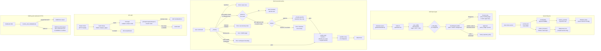

# Security

## 1 Purpose

This document is a comprehensive reference for durin's defense-in-depth security
architecture. It covers six interlocking layers:

- **Authority by context** — an action that adds or changes executable state is
  authorized by the execution context, never by a field in the tool call.

- **Secret storage and injection** — plaintext credentials live only in a
  mode-0600 file; config holds opaque references; subprocesses receive scoped
  values at execution time.
- **Skill and MCP import gates** — every externally-sourced skill passes a
  deterministic static scan before installation; an optional LLM semantic judge
  provides multilingual coverage. Adding, updating, installing or enabling an
  MCP server goes through the same authority-by-context approval channel, and
  a request can never carry a literal credential.
- **Shell execution policy** — a layered guard pipeline (hard floor, deny
  patterns, memory vault protection, workspace boundary, SSRF URL detection)
  runs before every subprocess; in a chat the person can approve one refused
  command once, and the hard floor never runs regardless; the environment is
  scrubbed to a minimal set plus explicitly authorized secrets.
- **SSRF network protection** — all outbound HTTP fetches resolve the target
  hostname once, validate it against a private-network blocklist, and pin the
  connection to the validated IP to close DNS-rebinding races.
- **API token and permission management** — bearer tokens carry salted SHA-256
  hashes; each token's scopes are checked against a fine-grained `Scope` catalog
  at every service route.

Each layer stands alone and also reinforces the others. The command filters in
particular are pattern-based and best-effort: they stop the common destructive
spellings, not every way to reach the same effect (an interpreter one-liner or a
script the agent writes and then runs is not matched). What keeps a refused
operation refused is the instruction that comes with the refusal — stop and ask
the user — together with the sandbox and workspace restriction where configured.
In a chat the exec tool does the asking itself: the person sees the exact
command and approves or declines it.

## 2 Mental model

**Secrets as lazy-resolved references.** Plaintext credentials never enter the
`DurinConfig` object. Config fields hold a `${secret:NAME}` reference string.
Every consumer that needs the value calls `resolve_secret()` at the point of use.
A second mechanism, *scoped auto-injection*, pushes matching secrets into
subprocess environments automatically — the scope field on each entry controls
which consumers qualify.

**Authority is a property of the context, not of the request.** `mcp_manage`,
`skill_import`, `skill_edit` and `skill_install_deps` introduce or rewrite
executable state, and `exec` can meet a command its safety policy refuses.
None of them takes a value the model writes as consent: their schemas carry no
`confirm` or `override` field. The server decides, in this order:

1. The exec tool refuses a command on its hard floor outright. It never runs,
   not even when approved.
2. The tool applies the authority the operator granted in config, out of band
   and ahead of the run: `install_policy: never` refuses an MCP change and only
   reports a dependency install, `install_policy: auto` runs an MCP change, a
   flagged skill install (never a `dangerous` one) or a dependency install, and
   exec `allow_patterns` exempt a command from the deny list. A request with
   nothing to decide runs as well: a clean skill install, or an edit to an
   `auto` skill whose scan needs no review.
3. The rest goes to `durin.agent.approval.request`. The configured skills
   judge may clear a `confirm` skill install (never `dangerous`) or an edit to
   an `auto` skill whose post-edit scan is `caution`; the record says
   `decided_by: judge`. It never clears a `manual` skill's edit, an install
   that replaces an existing skill, dependencies, MCP or exec.
4. In an interactive context the person in the chat is asked, and the turn
   waits on a typed `approval` waiter (`durin.agent.pending_answers`). Only
   the server resolves it: a webui `approval_decision` frame, or a yes/no
   reply the loop parses itself (`parse_approval_reply`), which is also what a
   TUI Approve / Reject row sends. Any other reply, the answer timeout, or a
   webui chat nobody watches ends the wait and leaves the request pending; an
   exec request that gets no verdict is closed as `expired` instead. When a
   wait ends with no verdict, the turn re-reads the record first: if someone
   decided it meanwhile (with `durin approvals`, from its own process), the
   model is told what it came to — applied, rejected or failed — and by whom,
   not that it is still pending.
5. Otherwise the request becomes a durable record in
   `<workspace>/.approvals/<id>.json`, bound by a `change_hash` to what was
   reviewed, and a person decides it later on the dashboard's Pending page or
   with `durin approvals`. An exec command is refused instead, with nothing
   filed: replaying a shell command outside the run that needed it is
   meaningless.

A pending record expires 14 days after it was filed: deciding it after that
(`approval.decide`) moves that one record `pending → expired` instead of
applying it. A resolved record (any terminal status) is pruned from disk 30
days after it was decided or expired; an expiry stamps `decided_at` like a
decision, so the window counts from it. A record still `approved` an hour
after its decision (`APPROVED_RUN_BOUND`) was left by a process killed
mid-run, since executors take minutes at most: it is moved to `failed` with
`result: {"error": "interrupted"}`, by compare-and-set, so a run that
finishes first keeps its result. The sweep over every record
(`approval_store.expire_and_prune`: expiry, interrupted runs, pruning) runs
when `durin approvals` or the Pending page lists records, when the gateway
starts, and every hour while it runs (`durin.service.housekeeping`), so a
person is never offered a stale request to approve.

The context is read from the runtime-minted session key (`websocket:`,
`cli:`, `slack:`, `unified:`… vs `cron:`, `cron_dream`, `workflow:`,
`system:`), a value the model cannot write, plus the flag that says an answer
could actually arrive mid-turn (a live inbound consumer on a surface that can
send one). An unrecognised session kind is autonomous: an unknown context is
not a person. `durin.agent.approval` owns this classification
(`human_reachable`), and `pending_answers.can_block` (the blocking
`ask_user_question` wait) delegates to it — a context that cannot authorize
cannot answer either.

A person's context loses that authority for a turn that received input from an
API token. A message sent through the native chat routes carries
`origin: "api"`; the agent loop marks the turn (`approval.note_turn_input`, on
a per-turn cell the loop sets in the turn's own task and shares with the tasks
that run its tools), for the opening message, for any message injected into
the turn, and for a message that answers a question the turn waited on (the
waiting tool reads the answer's origin from `pending_answers`), and
`approval.turn_has_api_input` reads the mark. Such a turn never asks in the chat: `make_chat_asker` returns no
asker, so each privileged tool takes the path of a context with no person. A
skill install, edit or dependency install and an MCP change become pending
requests that a person decides on the Pending page or with `durin approvals`,
and the pending note
tells the model why; an exec command that needs approval is refused, with
nothing filed. The operator's standing policy still applies — the configured
skills judge, and `install_policy: auto` — because it is not the turn's
authority. An API message never answers an approval either: while a turn
waits on one, a message marked `origin: "api"` neither decides it nor ends the
wait, and routes on like any other message sent during the turn. The Approve /
Reject click travels on the webui socket, and a token issued for the API (a
`chat:write` token, say) cannot open that socket: the handshake takes only the
configured static `token` (the operator's own secret) or the single-use token
`/webui/bootstrap` just minted. With `websocket_requires_token` off and no static `token`,
the handshake takes every connection that reaches the socket, token or not —
the operator's choice, which no API token changes. Only a socket opened with a
bootstrap-minted token — the dashboard session — decides an approval: the
handshake records which credential opened the connection (`_ws_auth`), and an
`approval_decision` frame on a socket opened with the static token or with no
token is refused (`refused`, the record left as it was). Such a socket may
still chat, and it does not keep an approval waiting when the dashboard tabs
have left. A `chat:write`
token may hold a conversation in the dashboard's sessions, but it is a
program, and it must not carry the person's authority to install or rewrite
executable state. The API-input rule narrows only approval, not answering: a
turn driven through the API may still wait for the answer to a question, which
the API client sends as a plain message.

Pauses that ask a person to approve follow the same rule. The model may
answer a workflow or automation run paused on a question, but
`automations(action="answer")` and `run_workflow(resume_run_id=…)` refuse a
run paused for approval. A person resolves it from the automations inbox, the
workflow's runs in the webui, the API, or a reply in the thread where it was
posted.

A decided record stores who decided it in `decided_by`, with the channel that
made the call: `{"kind": "operator", "channel": "cli"}` for `durin approvals`
on the CLI, `{"kind": "user", "channel": "websocket"}` for a click on a chat's
approval card, `{"kind": "user", "channel": "webui"}` for a decision from the
Pending page,
`{"kind": "user", "channel": <session key>}` for a reply typed in the chat
itself, and `{"kind": "judge"}` for the skills judge. A webui click that
lands while the turn that filed the request is still waiting hands its
verdict to that turn (`pending_answers`, in the same gateway process) so it
runs there, and the record still carries the real decider, not the chat it
was asked in. `durin approvals` runs in its own process and never reaches a
waiting turn: the CLI decides and runs the request itself, through an exec
tool built from the loaded config the way the gateway builds it (its
non-asking runner, so the same guards apply and no second approval opens),
and a chat turn still waiting on the request sees the result when its wait
ends. If that runner cannot be built, the approval is refused before the
record changes. Each kind declares what it needs from the handles it runs
with (`requires`, registered next to its executor in
`durin/agent/approval_executors.py`), and `approval.decide` checks it before a
record moves from `pending` to `approved`: a decision made where a handle is
missing is refused, the record is left as it was, and the refusal says where
it can be approved. An exec request can only be approved in the chat that
asked, since only that turn holds the literal command, so the CLI, the
Pending page and a late webui click are refused; the record closes when that
turn stops waiting. A dependency install needs a shell runner, so a decision
on a gateway with exec disabled (the Pending page, a late webui click) is
refused and points to `durin approvals approve`. An
action that `install_policy: auto` allowed files no record; a skill installed
that way carries `approved_by: policy` in its provenance and commit trailers.
`durin approvals approve` and `reject` refuse to run without a terminal (TTY),
and the exec hard floor refuses them at command position, so the agent cannot
decide its own request through a shell.

The Pending page decides over HTTP, through `POST
/api/v1/approvals/{id}/decision` (`ApprovalsService`), which hands the
verdict to `approval.decide` with the gateway's live handles and re-implements
none of its rules. Only a person's dashboard session may call it: the token
`/webui/bootstrap` mints is stored with `kind: "webui"` and resolves to a
`webui` principal, while every token issued for the API (whatever its scopes
or label), the configured static token and in-process callers — the agent's
own tools among them — are refused with 403. The kind is chosen by the server
path that mints the token; the token API and CLI never set it. On top of
that, the decision takes the scope of the change's domain: `skills:write` for
a skill kind, `mcp:write` for an MCP change, `admin` for anything else. An
exec request is still refused there (only its own turn holds the command).

A request decided outside the turn that filed it — from the Pending page, or a
chat card clicked after its turn stopped waiting — posts a system note into
the chat session that asked (`durin.agent.approval_notify`), the way a
background workflow's result is delivered, so the agent learns the outcome
("Approved: … — result: …", "Rejected: …") instead of believing the request
still waits. The record stores the chat the request came from (`origin`:
channel and chat id, from the tool's request context), and the note answers
there, in the session that asked — which is what reaches the right chat in
unified mode, where every channel shares one session key. A record filed
before origins were stored routes by its session key. A verdict handed to a
turn still waiting gets no note (that turn reports it), nor does a request
from a context with no person, one whose chat this process does not serve (a
TUI session belongs to its own process), or one decided with
`durin approvals` (it runs in its own process; the chat sees the result when
its wait ends, as above).

Self-approval is therefore blocked at every channel the agent controls: the
chat (a verdict never passes through the model), API input (it never
approves), HTTP (only a dashboard session decides), and the shell. That is a
best-effort limit, not a proof: the exec filters are pattern-based, so a
command that reaches the same effect another way (a script the agent writes
that rewrites a record under `.approvals/`, or one that mints a dashboard
session from loopback — `/webui/bootstrap` needs no secret there — and calls
the decision route or the socket, say) is a known gap until exec
runs in a sandbox.

**Layered skill gates.** Importing a skill passes two independent scan stages.
The first is deterministic: a regex and AST pass that always runs. The second is
an optional LLM semantic judge, which handles non-English and paraphrased threats
that regex cannot reach. The judge is capped at a configurable severity ceiling
and can never block a skill on its own — only the deterministic scan produces a
blocking verdict. Between a flagged scan result and installation sits a decision
the model cannot make: the operator's `install_policy: auto` (never for a
dangerous verdict), the configured judge within strict limits, or a person —
asked in the chat, or later on the Pending page or with `durin approvals`. The
same deterministic scan runs on every write that changes an installed skill,
before the write lands.

**Execution policy as defense-in-depth.** The shell execution path is not a
single wall; it is a sequence of independent checks. A command that clears one
check still faces the next. The hard floor, deny patterns, memory vault
protection, workspace boundary enforcement, and SSRF URL detection run in
sequence. Only the deny list and a configured allowlist can be lifted, and only
by a person in the chat approving that exact command once; the approval lifts
the rules that matched and nothing else — every other check still runs. The
subprocess environment is assembled from scratch (no ambient API keys), with
only explicitly authorized values added back.

## 3 Diagram


```mermaid
flowchart TD
    subgraph "Secret lifecycle"
        U["User stores secret"] --> SS["secrets.json\nmode 0600"]
        SS --> REF["Config field:\n'${secret:NAME}'"]
        REF --> RS["resolve_secret()\nat point of use"]
        RS --> PTV["Plaintext value\n(never stored in Config)"]
        SS --> CF["collect_for('exec')\nPhase-2 auto-inject"]
        CF --> ENV["Subprocess env\n(scoped secrets only)"]
    end

    subgraph "Skill import gate"
        SRC["External source\n(github/clawhub/url)"] --> FETCH["Fetch to\nquarantine dir"]
        FETCH --> SCAN["scan_skill()\ndeterministic:\nregex + AST + OSV"]
        SCAN --> JUDGE{"LLM judge\n(if configured)"}
        JUDGE --> VERDICT["ScanReport.verdict\n(safe / caution / dangerous)"]
        VERDICT -->|"dangerous"| BLOCK["Person only\n(chat, Pending page\nor durin approvals)"]
        VERDICT -->|"caution, code or\nuntrusted source"| CONFIRM["Approval:\npolicy / judge / person"]
        VERDICT -->|"safe +\nallowlisted"| INSTALL["install_imported_skill()"]
    end

    subgraph "Shell execution policy"
        CMD["exec command"] --> GC["_check()"]
        GC -->|"hard floor"| ERR0["Error: never runs"]
        GC -->|"deny pattern match\nor allowlist miss"| ASK{"person in\nthis chat?"}
        ASK -->|"no"| ERR1["Error: blocked,\nask the user"]
        ASK -->|"yes: approval card\nor yes/no reply"| DEC{"answer"}
        DEC -->|"approve"| GC2["_check() past the\nmatched rules only"]
        DEC -->|"decline / no answer"| ERR3["Error: declined,\ndo not retry"]
        GC -->|"memory/\nmutation"| ERR2["Error: use memory tools"]
        GC -->|"internal URL"| ERR4["Error: SSRF target"]
        GC -->|"path outside\nworkspace"| ERR5["Error: workspace boundary"]
        GC -->|"pass"| BE["_build_env()\nminimal + allowed_env_keys\n+ scoped secrets"]
        GC2 -->|"pass"| BE
        BE --> SW["sandbox wrap\n(if configured)"]
        SW --> PROC["subprocess"]
    end

    subgraph "API auth"
        BT["Bearer token\n(HTTP header)"] --> LH["hash lookup\nHMAC compare_digest"]
        LH -->|"match"| PR["Principal\n(subject, scopes, kind)"]
        LH -->|"no match"| UN["401 Unauthorized"]
        PR --> RQ["principal.require(Scope.X)\nat each route"]
        RQ -->|"missing scope"| FB["403 ForbiddenError"]
        RQ -->|"has scope\nor ADMIN"| OK["Authorized"]
    end

    subgraph "SSRF guard (outbound HTTP)"
        URL["Outbound URL"] --> RAV["resolve_and_validate(host)"]
        RAV -->|"private/internal IP"| SE["SSRFError raised"]
        RAV -->|"public IP"| PIN["SSRFGuardTransport\npins connection to IP\nre-validates on redirect"]
    end
```

## 4 How it works

### Secret store lifecycle

`SecretStore` (`durin/security/secrets.py`) owns all credential storage. Secrets
live in `secrets.json` at mode 0600 alongside the config file; plaintext never
enters the config tree. Every mutation — put, remove, scope change — is wrapped in
a `cross_process_lock` that performs a full load-mutate-save cycle to prevent
concurrent writers from losing each other's changes. The disk write itself is a
private method reachable only from inside that lock — there is no public raw-write
method, so a caller cannot persist a snapshot outside the lock and clobber a
concurrent writer's changes; every write to disk goes through one of the locked
mutators.

All user-facing writes funnel through `SecretsService.store_entry`
(`durin/service/secrets.py`) — the CLI, the webui panel, the TUI prompt, and the
websocket `secret_store` frame share its contract: create-or-update with full
metadata, an empty value as a metadata-only edit of an existing entry, and
`rotate=True` as the mirror case — a value-only replacement that preserves
service, account, description, scope, and origin, and never creates. Rotation is
what the agent's `request_secret` tool triggers with `update=true`: the agent
declares the intent in a structural flag (an existing secret is never touched
without it), the channel prompts the user, and the user supplies the new value
through the same secure paths — the value still never reaches the model.

Once the write lands, the agent is told the credential exists so it can resume.
That note is built by `secret_stored_notice` from the `SecretItem` the write
returned — the stored entry, never the request that wrote it. The distinction
matters because a rotation carries no metadata: a note assembled from the
request would report `scope=none` for a secret that kept its `exec` scope, and
the agent would stop using a credential it can still read. Every surface that
prompts for a secret (the websocket frame handler and the TUI prompt screen)
shares that one builder, and the TUI prompt dismisses with the stored entry
rather than a bare stored/cancelled flag so it has something truthful to pass.

Secret names must match `[A-Z][A-Z0-9_]*`, making them valid environment variable
names — intentional, because Phase-2 auto-injection uses them directly as env var
keys. A config field that holds `${secret:NAME}` is validated by `is_secret_ref()`
and resolved only at the point of use via `resolve_secret()`, which delegates to
the process-wide cached store. This keeps the plaintext out of the `Config` object,
logs, and telemetry.

`${secret:NAME}` is the only accepted spelling, and a near miss is an error rather
than a literal. `resolve_secret()` returns anything that is not a reference
untouched — correct for real literals, but a value like `{{secret:NAME}}`,
`$secret:NAME` or a lowercase name is nobody's credential, and passing it through
hands the placeholder itself to the consumer, which then fails with an opaque
auth error nowhere near the typo. Such a value raises `MalformedSecretRefError`
naming the canonical rewrite. A dangling reference already raised
`SecretNotFoundError`; a mistyped one is no more usable, so it fails the same way.

The same error covers a well-formed reference embedded in a larger string
(`Bearer ${secret:TOKEN}`). durin does not interpolate — a reference is the whole
field value — so the surrounding text would otherwise be shipped with the
reference still literal in it. The fix is to store the full value, prefix
included, as one secret and reference it alone.

The `scope` field on a `SecretEntry` governs auto-injection only, not
config-field resolution. When `ExecTool._build_env()` constructs the subprocess
environment, it calls `collect_for("exec")`, which returns only entries whose scope
authorizes the `exec` consumer. The scope check uses `scope_allows()`, which
supports exact matches (`exec`) and family wildcards (`skill:*` covers
`skill:deploy`). A `${secret:NAME}` reference written into a config field is itself
the authorization to resolve that credential; the scope field is a separate, additive
gate for automatic subprocess injection.

`SecretRedactor` (`durin/security/secrets.py`) scrubs tool output before returning it
to the model. Two layers run: a value-based pass that replaces known stored values
with `«redacted:NAME»` markers (skipping values shorter than 8 characters to avoid
false positives on common substrings), and an optional pattern-based pass that masks
credential-shaped strings by format — vendor prefixes (`sk-`, `ghp_`, `AKIA…`),
PEM blocks, `Authorization: Bearer` headers, env-style key-value assignments, and
JSON credential fields — regardless of whether the value is in the store.

The pattern pass matches on the *key* for its key-value heuristics, so it explicitly
spares a value that is exactly a `${secret:NAME}` reference. A reference is a pointer
into the store, not a credential — the same reason `mask_secrets` prints references
verbatim. Without that carve-out every referenced config field (`bot_token`,
`api_key`) read through a tool came back masked.

### Redaction never reaches disk

Redaction protects the model's context, and a marker is never a value worth keeping.
An agent that reads a config file and writes it back would otherwise persist the
masked view, replacing a working credential with placeholder text — a failure that
only surfaces later as an auth error from the channel or provider.

`save_config` (`durin/config/loader.py`) is the single choke point for every config
write (CLI, service routes, wizard), and it refuses the write when
`find_redacted_credentials` reports a credential-shaped key holding a marker,
raising `RedactedValueError` before anything is written. The check is scoped by
`CREDENTIAL_KEY_RE` — the same key pattern `mask_secrets` uses — so free-form config
such as a persona description may still contain the word.

### Shared GitHub credential

GitHub access — raising the API rate limit and reaching private repos — is one
credential shared by every general consumer, not a token configured per feature.
`resolve_github_token()` (`durin/security/github_auth.py`) is the single resolver:
it tries the `gh` CLI (`gh auth token`), then the environment (`GITHUB_TOKEN` /
`DURIN_GITHUB_TOKEN`), then the shared `GITHUB_OAUTH` secret written by the connect
flow, then any legacy per-feature secret name passed for migration. It returns `""`
(anonymous) and never raises, so GitHub access degrades rather than breaking. Skills
(`skill_resolve`) and MCP discovery (`mcp_github`) both read through it.

The connect flow is GitHub's OAuth **device flow** against durin's own OAuth App
(`durin/security/github_device_auth.py`): a public client id, no client secret — so
it is safe in this repo and works on a remote gateway. `request_device_code` starts
the flow and stashes the poll secret server-side behind an opaque `flow_id` (the
browser never holds the `device_code`); `poll_flow` exchanges it and, on success,
writes the raw token to the `GITHUB_OAUTH` secret. Default scope is minimal
(`read:user`); `repo` is requested only when private-repo access is needed. The
flow is transient-tolerant: a failed poll (network hiccup, GitHub 5xx/429) maps
to a `transient` status instead of an error — the flow stays pending on both
sides and polling continues until the code expires — and the dashboard's poll
loop likewise retries a bounded number of consecutive failures before aborting
visibly. Flow lifecycle (start / authorized / expired / denied, plus transient
poll failures) is logged, so a stuck connect can be diagnosed from the gateway
log. The
`OAuthService` exposes start / poll / status / disconnect (see [api.md](api.md)) —
status is a live probe that reports **where the token came from** (`gh` / env /
secret), the login, granted scopes, and rate budget, so the dashboard only offers a
"disconnect" for durin's own stored secret (a `gh`/env token is ambient, not durin's
to forget). The GitHub MCP server rides the same credential: at launch a
declared-but-empty GitHub-token env var (e.g. `GITHUB_PERSONAL_ACCESS_TOKEN`) is
filled from the resolver, and never added to a server that did not declare one.

### Skill import gate

Skill imports flow through two independent scan stages before installation.

**Deterministic scan** (`durin/security/skill_scan.py`, `scan_skill()`): runs
unconditionally. It applies body rules to `SKILL.md` (prompt injection patterns,
hidden-instruction HTML comments, sensitive path references, hardcoded secrets,
invisible Unicode codepoints) and code rules to every script file in the skill
tree (fetch-and-execute patterns, destructive commands, dynamic eval, reverse shell
primitives, data exfiltration shapes, privilege escalation, excessive agency,
safety-bypass flags). Python scripts also receive an AST behavioral pass
(`durin/security/skill_ast.py`). Install specs are validated against allowlist
patterns per ecosystem and looked up in the OSV malware feed (fail-open on network
errors). The result is a `ScanReport` whose `verdict` property maps the maximum
severity finding to `safe`, `caution`, or `dangerous`.

**LLM semantic judge** (`durin/security/skill_judge.py`, `judge_skill()`): runs
only when configured (`trigger = uncertain|always`). It receives the skill body
and script files (up to 12,000 characters), prompts the model to identify concrete
problems with exact evidence, and parses the structured response. The judge's
severity is capped at the configured `max_severity` (default `caution`). This
means the judge can force a confirmation step but can never produce a `dangerous`
verdict on its own — only the deterministic scan does that. If the judge errors or
times out, the deterministic report stands unchanged.

**The judge as an approver.** Besides raising a verdict at fetch time, the judge
may clear an approval request, within limits: only a `confirm` install, or an
edit to an `auto` skill whose post-edit scan is `caution`. Never `dangerous`,
never a `manual` skill's edit (the owner's consent is not a safety question),
never dependency installs, MCP changes or exec. It runs on the exact tree (a
throwaway copy of the post-edit tree for an edit) and may clear only what it
read: every file must be `SKILL.md` or under `scripts/`, every finding must point
at one of them, no install specs may be declared (the frontmatter is outside its
view), and the content must fit its character budget. A `safe` verdict that
still lists a finding above `info` does not clear. An unavailable or failing
judge falls through to a person. A cleared request is recorded with
`decided_by: judge` (`durin/agent/approval_kinds_skills.py`).

`ScanReport.verdict` merges both scans: when a `judge_verdict` is present it takes
precedence (within the severity cap), otherwise the findings list determines the
verdict.

Installation is governed by a `decide_action` gate in `durin/agent/skills_import.py`
(`install_gate` computes it exactly as the install enforces it): `allow` for a
safe, allowlisted skill without code; `confirm` for caution, code-carrying, or
out-of-allowlist skills; `block` for `dangerous`. `allow` installs directly from
any context. Anything else is a `skill_install` approval request the model cannot
resolve — `skill_import` has no `confirm` or `override` argument. It is decided,
in order, by:

- `skills.install_policy: auto`, which pre-authorizes `confirm` installs (never `block`);
- the skills judge, for a `confirm` install only (see above);
- the person in the chat (a card in the webui and TUI, a yes/no reply on text channels);
- otherwise a pending record, resolved later on the Pending page or with `durin approvals`.

The request is bound to the quarantine's content hash (`.scan.json` excluded), so
a re-fetched quarantine makes it stale. At execution the install re-derives the
gate and grants `override` only when the verdict the approver saw was
`dangerous`: a verdict that rose after the approval makes the install fail
instead of landing. Provenance and `import-audit.log` record `approval_id` and
`approved_by` (`user`, `judge`, `operator`, or `policy`; empty when no decision
was needed), and the commit carries `Approved-by` / `Approval` trailers.

An install request and the Skills triage settle the same import, so one
decision settles both. Rejecting the request discards the quarantined import
(the kind's `on_reject` hook, `approval_kinds_skills.reject_install`) and closes
any other request still pending for it. Installing or discarding the import
from the triage (`skills_store.web_skill_approve` / `web_skill_reject`) closes
the pending requests for it as `applied` or `rejected` by compare-and-set,
recorded as `{"kind": "user", "channel": "webui"}`. Every discard is appended to
`import-audit.log` as a `discarded` event, with the request it settled and who
decided it when known.

**Skill reviews** (`durin/security/skill_reviews.py`): a user or the LLM judge
can mark an active flagged skill as reviewed. Each acked finding is stored as
its fingerprint (`category|where|detail`) paired with a SHA-256 of the file it
anchors to. `get_review()` returns a stored review only while every current
finding was acked and its anchor file is unchanged — a new finding, or an edit
to a file that carries an acked finding, reopens the review; edits elsewhere in
the skill (a new script, an instruction tweak) leave it standing. Findings that
do not anchor to a real file (synthetic ones such as `import_verdict`) ack by
fingerprint alone. Entries written by the pre-v2 store (a whole-directory
`content_hash` plus a fingerprint list) keep their original all-or-nothing
semantics until re-recorded. In the web UI a valid review collapses the
security section to a neutral state with the acked findings behind a toggle.

**Provenance-pinned verdicts** (`apply_provenance_verdict()` in
`durin/agent/skills_surface.py`): the verdict recorded at import can be stricter
than what the deterministic scanner reproduces later — an LLM-judge finding or
the unverified-origin sweep's synthetic finding, neither of which persists in
the skill directory. Every active-skill scan surface (the inventory, the user
review endpoint, the LLM audit path) pins the stricter provenance verdict and
prepends a synthetic `import_verdict` finding naming its origin, so the security
report explains the warning badge and the review store has a fingerprint to ack.
A weaker provenance verdict never lowers the live scan's verdict — the scanner's
current view of the content wins. A user review adopts the skill: the review
endpoint stamps `provenance.verdict_cleared = {by, at}` into `SKILL.md`
(committed to the skills store; the original `verdict` stays as the audit
trail), which disables the pin until a later write adds findings (see Re-scan on
skill writes) — only an explicit user review clears it, the LLM audit path never
does. The deterministic scanner keeps running on every listing regardless, so new
or edited content is still judged on its own.

**Re-scan on skill writes.** Every write that changes an installed skill's
`SKILL.md` or a code file is scanned before it lands: `scan_skill_write`
(`durin/agent/skills_store.py`) scans a throwaway copy with the write applied,
next to the skill as it stands. A write needs review when the result is not
`safe` and it is either worse than the current verdict or carries a finding the
current skill does not have; keeping an already accepted risk as it was passes.
What happens then depends on who writes:

- `skill_edit` (the agent): an `auto` skill's edit that needs no review lands.
  Otherwise, and always for a `manual` skill, it becomes a `skill_edit` approval
  request (the judge for a `caution` edit to an `auto` skill, then the person,
  then a pending request for the Pending page or `durin approvals`). The request is bound to the
  target file's content (durin's own provenance and curation stamps in the
  frontmatter excluded) plus the change.
- Curation `evolve` (nobody to ask): the judge may clear a `caution` edit;
  otherwise a pending `skill_edit` request is filed and nothing is written.
- Dream restructure: a whole-body rewrite cannot be filed as a bounded edit, so a
  result that needs review is refused with its findings and the live skill stays
  as it was.
- New skills (`skill_write`, `skill_publish`, a fuse target) are scanned whether
  or not they bundle files; a verdict other than `safe` quarantines them.
- A person's save in the web editor, or a suggestion they accepted: a result that
  needs review and is `dangerous` is refused with its findings; a `caution` one
  is saved and its findings are returned.

Any write that adds findings drops `provenance.verdict_cleared`, so the
import-time verdict pin returns until someone reviews the skill again.

### MCP server changes

`mcp_manage` (`durin/agent/tools/mcp_manage.py`) adds, updates, installs,
enables, disables, reconnects and removes MCP servers. Add, update, install and
enable put a server's command or endpoint into the agent's tool surface, so
they go through `tools.mcp_discovery.install_policy`: `never` refuses, `auto`
runs (authority the operator granted in config ahead of time), and `approve`
(the default) files an `mcp_change` approval request. In a chat the person
approves or declines it there; with nobody to ask it waits on the Pending
page and in `durin approvals`. The tool has no `confirm` parameter: nothing in a call can
approve it. Remove, disable and reconnect add no executable state and are not
gated — except that the agent's own `reconnect` refuses instead of connecting
whenever the on-disk config does not match the config a person or an approved
request last put in place (`McpRuntime.approved_config`, tracked from boot and
kept current on every add/update/enable and every actual connect); a person's
own dashboard/REST reconnect always applies whatever is on disk.

The request records the exact change (`durin/agent/approval_kinds_mcp.py`). An
install is resolved against the registry when it is requested, so the person
approves the config that will be written, not a ref whose content could change
underneath; enable carries a full snapshot of the server's current config, the
same detail shown for add/update, and applies that exact snapshot rather than
whatever the disk says when it runs. The request's hash covers the server's
current config entry, so a request whose server changed after it was filed is
stale and does not run. A request never holds a credential:
`secret_safe_config` replaces an env, header or OAuth value that equals a
stored secret with its `${secret:NAME}` reference (only `env`/`headers` are
ever resolved back from a reference), and refuses any other credential outright
— by key name, or by the shapes the redactor recognizes — telling the model to
call `request_secret` instead. A missing local runtime for a stdio install runs
through the exec tool's own non-asking entry point (the same one
`skill_install_deps` uses), so it never opens a second approval nested inside
the one already being carried out. An approval decided outside the running
gateway (the CLI) writes the config only; the gateway applies it on restart or
when the server is reconnected.

### File-tools write guard

The write-capable file tools (`write_file`, `edit_file`, `notebook_edit`)
refuse a path under a registry that owns its own validated, versioned write
door (`skills/`, `workflows/`, `automations/` — see
[skills/00_overview.md](skills/00_overview.md) and
[automations.md](automations.md)), under `.approvals/` or
`.durin/import-quarantine/` (neither owns a door at all — a writable record in
either would let the model forge its own approval or its own import scan
verdict), or under durin's own config/secret/token/pairing stores wherever
`DURIN_HOME` actually is (`config.json` and its `.d/` split-layout directory,
`secrets.json`, `api_tokens.json`, `pairing.json`): an out-of-band edit there,
followed by an ungated action that reloads config from disk (an MCP
`reconnect`, say), would otherwise run whatever got written with none of the
tool-specific approval gates ever seeing it. The comparison is by filesystem
identity (`is_under()` in `durin/agent/tools/path_utils.py`), not path text, so
a case variant of any segment (`CONFIG.JSON`, `.APPROVALS`) cannot slip past
the guard on a case-insensitive filesystem (macOS APFS by default, most
Windows volumes); a denied path that does not exist yet is still guarded, by
its nearest existing ancestor. Reads are unaffected. Only writes through these
tools are covered — a shell command run via `exec` could still overwrite
`config.json` directly, which is why the MCP reconnect gate above checks for
config drift independently; guarding that path is an exec sandbox's job, not
this guard's.

### Shell execution policy

`ExecTool.execute()` (`durin/agent/tools/shell.py`) runs every shell command
through a layered guard pipeline before spawning a subprocess.

**Workspace boundary on `working_dir`**: when `restrict_to_workspace` is enabled,
the requested `working_dir` is resolved and checked against the configured
workspace root before any guard runs. An LLM-supplied directory outside the
workspace is rejected immediately, preventing a caller from using `working_dir`
as a bypass.

**`_check()`**: runs in a worker thread (`_check_off_loop`, via
`asyncio.to_thread`), so a slow check — a long command, the DNS lookups of the
private-URL guard — delays its own call while the event loop keeps serving
other chats between the guard's steps. A single regex call holds the GIL for
its duration, so the loop runs between pattern calls, not during one. Real
long commands are cheap to check, but adversarial repetition of an anchor word
is quadratic for several patterns, and a thread cannot preempt a regex call. So
`MAX_CHECKED_COMMAND_CHARS` is sized to that worst case, and a longer command
is refused first, unchecked. The refusal is not approvable (nothing checked the
command) and tells the model to write long content with `write_file` and run
the file. Then
it applies the hard floor, then deny and allow patterns, then
memory vault protection, then SSRF URL detection, then workspace boundary on
absolute paths. It returns a `CommandRefusal` naming the kind of refusal and,
for the policy checks, the rules that matched; `_guard_command()` (kept for
callers that only want the text) wraps it.

- *Hard floor* (`_HARD_FLOOR_PATTERNS`): recursive `rm` of `/`, `/*`, `~` or
  `$HOME`; `mkfs` and `diskpart`; `dd` or a redirect onto a whole-disk device;
  a fork bomb; `shutdown`, `reboot`, `poweroff` and `init 0` in command
  position; and `durin approvals approve`/`reject` itself (so the model cannot
  approve its own pending request through a shell — the CLI's own TTY
  requirement behind it is a second, independent layer). These never run: not
  with `allow_patterns`, not with the user's approval. The refusal says so and
  tells the model the user must run it outside durin if it is really needed.

- *Deny/allow logic*: when `allow_patterns` are configured they form an allowlist
  (commands not matching any pattern are blocked). When only `deny_patterns` are
  configured (the default), the list is an opt-out — matching commands are blocked
  unless an `allow_patterns` entry explicitly exempts them. Hardcoded deny patterns
  cover `rm -rf`, `dd`, disk operations, power commands, fork bombs, and direct
  writes to the append-only `history.jsonl` archive. A refusal names every matched
  rule and tells the model this is the exec safety policy: it must not reach the
  same result another way. The runner recognizes these refusals (and the hard
  floor's) as a policy boundary, like SSRF and workspace blocks, so it does not
  append its generic "try a different approach" retry hint to them.

- *Approval in a chat*: when a person is reachable in the session
  (`approval.human_reachable`), a deny match or allowlist miss becomes an
  `exec_command` approval request instead of a refusal
  (`durin/agent/approval_kinds_exec.py`). The person sees the command, its
  working directory and the matched rules; the record itself holds only a
  redacted copy of the command (known secrets, plus common inline-credential
  shapes such as a bearer token or a `user:pass@` URL) and never the command's
  output. Approved, the command runs once, past exactly those rules — the hard
  floor and every other guard still apply. Declined or unanswered, the model
  gets the refusal plus a "do not retry" note, and the request is closed
  (`rejected`, or `expired` when no verdict came back, the turn's cancellation
  included): an exec request never stays pending, because replaying a shell
  command outside the turn that needed it has no defined meaning. In cron,
  workflow and sub-agent runs nobody is asked and the refusal stands.

- *Memory vault protection* (`_guard_memory_mutation()`): mutations of the
  `memory/` directory via `rm`, `mv`, `cp`, `tee`, `sed -i`, `dd`, and redirect
  operators are blocked entirely. This preserves FTS and vector index consistency —
  memory modifications must go through `memory_upsert_entity`/`memory_forget` tools.

- *SSRF URL detection* (`contains_internal_url()`): URLs embedded in the command
  string are extracted and validated against the private-network blocklist. A
  command containing a URL that resolves to an RFC1918 or cloud-metadata address
  is blocked.

- *Workspace boundary on absolute paths*: when `restrict_to_workspace` is enabled,
  absolute paths extracted from the command string are resolved and checked against
  the workspace root. Symlinks are followed to their real path. Kernel device files
  (`/dev/null`, `/dev/stdout`, etc.) are exempt via `_BENIGN_DEVICE_PATHS`.

**`_build_env()`**: constructs the subprocess environment from scratch. On Unix,
only `HOME`, `LANG`, `TERM`, and `PYTHONUNBUFFERED` are forwarded; `bash -l`
sources the user's profile to populate `PATH` and other essentials. On Windows,
a curated set of system variables is forwarded. Ambient API keys and any other
parent-process environment variables are not inherited unless explicitly listed in
`allowed_env_keys`. Scoped secrets from `collect_for("exec")` are added last.

After the guard pipeline, the command is optionally wrapped by a sandbox
(`bwrap`, `docker`, or `testbed`; empty for none) before spawning.

### Workflow script nodes

A workflow's script node (`ScriptNode`, see [workflow.md](workflow.md)) runs an
inline `command` or a file under `<workspace>/workflows/scripts/` as a subprocess.
These are local, user-authored workflow definitions and script files, not
externally-sourced content — the same trust model as the agent's shell tool
(`ExecTool`): executing them is equivalent to the user running them directly. A
script node's subprocess does **not** go through `ExecTool`'s guard pipeline (deny
patterns, workspace boundary, SSRF URL detection) or a sandbox — there is no
sandboxing at all. Its environment is separate from `_build_env()` but follows the
same instinct: by default (`env: "clean"`, the node's default) the subprocess gets a
minimal allowlist (`PATH`, `HOME`, `USER`, `SHELL`, `LANG`, `LC_ALL`, `LC_CTYPE`,
`TERM`, `TMPDIR`, `DURIN_HOME` — only those present) plus the `DURIN_*` run-metadata vars, keeping
ambient provider keys and other gateway-process secrets out of the subprocess. A node
can opt into `env: "inherit"` to get the full gateway process environment
(`dict(os.environ)`) instead — consistent with the same local-trust model, but a
per-node choice rather than the default. Neither mode carries **stored secrets** —
those live in the secret store, never the gateway environment. A node that must
authenticate declares the names it needs in `secrets`: each is injected only when
the store entry's `scope` allows the `exec` consumer (the same grant `ExecTool`'s
auto-injection honours), an unknown or scope-denied name aborts the run pre-flight,
and the subprocess's stdout/stderr are redacted against the store before becoming
edge text — so a script echoing a credential cannot persist it into sessions,
manifests, or memory. The improve pass's pre-apply smoke run keeps the clean
allowlist and never receives declared secrets. Importing remote or third-party workflow
definitions (and the scripts they reference) is not supported in this scope.
`PUT /api/v1/workflows/scripts/{name}` (`workflows:write`) lets the editor create
or replace one of these script files over HTTP: the name is validated as a
single relative path segment (no `..`, no `/`) before it ever reaches the
filesystem, and content is capped at 256 KB — the write door is guarded, but a
principal with `workflows:write` can still land a script that a subsequent run
executes with the same local trust as one placed on disk by hand.

### SSRF network guard

All outbound HTTP fetches from durin's internal tools use `ssrf_safe_async_client()`
(`durin/security/network.py`), which builds an `httpx.AsyncClient` with
`SSRFGuardTransport` as the transport layer.

`resolve_and_validate(host)` resolves the hostname to IP addresses, normalizes
IPv4-mapped IPv6 addresses, and rejects any address in `_BLOCKED_NETWORKS` (which
covers `0.0.0.0/8`, loopback, RFC1918 ranges, link-local/cloud-metadata
`169.254.0.0/16`, carrier-grade NAT `100.64.0.0/10`, and IPv6 equivalents). It
returns the validated IP string. `SSRFGuardTransport.handle_async_request()` calls
`resolve_and_validate()` on every request, then replaces the URL's host with the
validated IP while preserving the original `Host` header (for name-based virtual
hosting) and the TLS SNI (for certificate verification). Because httpx routes every
redirect through the transport, redirect targets are re-validated automatically —
no per-hop manual check is needed.

For deployments on internal networks (e.g., Tailscale), `configure_ssrf_whitelist()`
accepts CIDR ranges that bypass the private-address block. The whitelist applies to
both `resolve_and_validate()` and `validate_url_target()`.

### API token and permission management

`ApiTokenStore` (`durin/security/api_tokens.py`) stores API tokens at
`~/.durin/api_tokens.json` (mode 0600). Each `issue()` call generates a random
plaintext token (`nbwt_` prefix, 32 URL-safe bytes), derives a 16-byte random
salt, and stores the salted SHA-256 hash — the plaintext is returned once and
never written to disk. Expired tokens are purged on every issue; the live set is
capped at 10,000 entries to bound store growth. `resolve()` iterates stored tokens
and uses `hmac.compare_digest()` for timing-safe comparison.

Because `resolve()` runs on every authenticated HTTP request, hits are served
from a per-process cache keyed by the *hash* of the presented token (the
plaintext is never held), validated against the store file's `(mtime_ns, size)`
on every request — so a revoke or issue from any process invalidates it by the
very next request. `last_used_at` is informational and persisted at most once
per minute per token; the old behavior rewrote the whole store with fsync on
every request.

`Principal` (`durin/service/principal.py`) is an immutable dataclass carrying
`subject` (token id or `"local"`), `scopes` (a `frozenset[str]` of scope string
values), and `kind`: `"local"` for in-process callers, `"webui"` for the
dashboard session, `"remote"` for every other token. In-process callers (TUI,
cron, the agent's own tools) use `Principal.local()`, which carries
`Scope.ADMIN` and is never checked against a token. Remote callers receive a
`Principal` built from the verified token's stored scopes; a token stored with
`kind: "webui"` (only `/webui/bootstrap` mints one) becomes `Principal.webui`,
which a route that needs a person — deciding an approval — requires. `principal.require(Scope.X)` raises `ForbiddenError` if the
principal lacks the scope (or `ADMIN`). The scope catalog is declared in the
`Scope` enum: paired read/write scopes for the service domains (settings,
secrets, skills, cron, sessions, config, memory, MCP, workflows, automations,
system) plus two write-only powers — `channels:write` (speaking as durin in a
conversation with an external party) and `chat:write` (conversing with durin
through the native chat routes and `/v1`; an API-originated turn never carries
a person's authority to approve privileged actions).

`AuthService` (`durin/service/auth.py`) owns token lifecycle routes; it calls
`principal.require(Scope.SYSTEM_WRITE)` before issuing or revoking tokens, so
only callers with system-write authority can manage other tokens.

## 5 Key types and entry points

| Symbol | File | Role |
|---|---|---|
| `SecretStore` | `durin/security/secrets.py` | File-backed persistent store; load/put/remove under `cross_process_lock`; `resolve()` for config-field use, `collect_for()` for Phase-2 injection |
| `SecretEntry` | `durin/security/secrets.py` | Pydantic model per stored secret: `value`, `service`, `account`, `description`, `scope`, `origin`, `created_at` |
| `SecretRedactor` | `durin/security/secrets.py` | Two-layer output scrubber: value-based (`«redacted:NAME»`) + pattern-based (`«redacted»`) for credential-shaped strings; both spare `${secret:NAME}` references |
| `find_redacted_credentials` | `durin/security/secrets.py` | Returns the dotted paths of credential-keyed fields holding a redaction marker; used by `save_config` to refuse the write |
| `RedactedValueError` | `durin/security/secrets.py` | Raised when a config write would persist a redaction marker into a credential field |
| `resolve_secret` | `durin/security/secrets.py` | Module-level function; resolves a `${secret:NAME}` ref via the process-wide cached store; raises `SecretNotFoundError` on a dangling reference and `MalformedSecretRefError` on a near-miss spelling |
| `MalformedSecretRefError` | `durin/security/secrets.py` | Raised when a config value is a placeholder naming a secret (`{{secret:X}}`, `$secret:X`, lowercase name) but not the canonical `${secret:NAME}`, or embeds a reference in a larger string |
| `secret_stored_notice` | `durin/service/secrets.py` | Builds the agent-facing resume note from the stored `SecretItem` (never the write request), so a rotation still reports the scope the entry kept |
| `ScanReport` | `durin/security/skill_scan.py` | Result of deterministic skill scan: `findings` list, `tools` list, `judge_verdict`; `.verdict` property merges both |
| `Finding` | `durin/security/skill_scan.py` | Single scan result: `category`, `severity` (info/caution/high/dangerous), `where` (file/location), `detail` |
| `scan_skill` | `durin/security/skill_scan.py` | Entry point for the deterministic scan; applies body rules to `SKILL.md` and code rules + AST pass to all script files |
| `JudgeOutcome` | `durin/security/skill_judge.py` | LLM judge result: `findings` (severity-capped), `verdict`, `summary`, `tools` |
| `judge_skill` | `durin/security/skill_judge.py` | Runs the LLM judge; capped at `max_severity`; raises `JudgeError` on parse failure (never blocks on error) |
| `audit_skill` | `durin/security/skill_judge.py` | Convenience entry point: deterministic scan merged with optional LLM judge |
| `install_gate` | `durin/agent/skills_import.py` | The import gate's decision (verdict, action, findings) computed exactly as `install_imported_skill` enforces it |
| `WriteScan` / `scan_skill_write` | `durin/agent/skills_store.py` | Scan of a skill before and after a proposed write; `needs_review` is the shared write gate |
| `approval_kinds_skills` (module) | `durin/agent/approval_kinds_skills.py` | `skill_install` / `skill_edit` / `skill_deps` approval kinds (prepare, hash, execute) and the skills judge as a limited approver |
| `ExecTool` | `durin/agent/tools/shell.py` | Shell execution tool; applies `_check()`, asks the person in a chat to approve a deny/allowlist refusal, builds scrubbed env via `_build_env()`, wraps with sandbox |
| `_check` / `_guard_command` | `durin/agent/tools/shell.py` | Layered guard: hard floor → deny/allow patterns → memory vault → SSRF URL → workspace boundary; `_check` returns a `CommandRefusal` with the matched rules, `_guard_command` its text |
| `_HARD_FLOOR_PATTERNS` | `durin/agent/tools/shell.py` | Commands that never run, not even when approved |
| `_guard_memory_mutation` | `durin/agent/tools/shell.py` | Blocks rm/mv/cp/tee/sed -i/dd/redirect targeting `memory/` paths |
| `_build_env` | `durin/agent/tools/shell.py` | Constructs minimal subprocess env + `allowed_env_keys` + scoped secrets |
| `approval` (module) | `durin/agent/approval.py` | Authority by context: `request` (judge / person / pending) returning an `Outcome`, `outcome_to_tool_result` (what a gated tool returns), `decide` (resolve a record from outside the turn), `human_reachable` / `is_interactive` (the context classification), `note_turn_input` / `turn_has_api_input` (a turn with API-token input is never asked in the chat) |
| `approval_store` (module) | `durin/agent/approval_store.py` | Persists approval records under `<workspace>/.approvals/`; `create`, `find_pending`, `transition` (compare-and-swap on status), `get`, `list_records`, `discard`, `expire_and_prune` (pending → `expired` past `PENDING_TTL`; `approved` → `failed` past `APPROVED_RUN_BOUND`; terminal records deleted past `RESOLVED_RETENTION`). A record in the earlier per-subsystem layout (`.approvals/<subsystem>/<id>.json`) is listed as `legacy:<subsystem>`; it carries no payload, so it can be discarded but never approved |
| `approval_executors` (module) | `durin/agent/approval_executors.py` | Per-kind hash + execute registry (`register`, `execute`, `current_hash`); `ExecDeps` carries the runtime handles (`exec_run`, `mcp`, `extra`) an executor needs |
| `approval_prompt` (module) | `durin/agent/approval_prompt.py` | `ChatHandles` / `make_chat_asker`: asks the person in the current chat and waits, bounded by `agents.defaults.ask_user_answer_timeout_s` |
| `approval_kinds_exec` (module) | `durin/agent/approval_kinds_exec.py` | `exec_command` approval kind: redacts the command before it is ever recorded, binds the request to command + cwd + session, runs only inside the turn that asked |
| `approval_kinds_mcp` (module) | `durin/agent/approval_kinds_mcp.py` | `mcp_change` approval kind: resolved server config, hash over the current config entry, `secret_safe_config` credential scrub |
| `approval_notify` (module) | `durin/agent/approval_notify.py` | `origin_note` / `notify_origin`: the system note that tells the chat that asked how a request decided outside its turn ended; `chat_route` maps a session key to the chat its replies go to |
| `ApprovalsService` | `durin/service/approvals.py` | `POST /api/v1/approvals/{id}/decision`: a dashboard session decides a request through `approval.decide`; per-kind scopes (`decision_scope`, `read_scope`); 200 when acted on, 409 when refused |
| `sweep_workspace` / `WorkspaceJanitor` | `durin/service/housekeeping.py` | Expire and prune approval records and prune stale automation claims, at gateway boot and hourly while it runs |
| `is_under` / `resolve_workspace_path` | `durin/agent/tools/path_utils.py` | Filesystem-identity containment check (case-insensitive-safe) behind the file tools' registry, `.approvals/`, import-quarantine and durin-store write guards |
| `Principal` | `durin/service/principal.py` | Immutable identity + authorization: `subject`, `scopes` (frozenset), `kind`; `require()` raises `ForbiddenError` |
| `Scope` | `durin/service/principal.py` | Enum of permission scopes (`domain:read`/`domain:write` pairs, the write-only `channels:write` and `chat:write`, and `admin`) |
| `ApiTokenStore` | `durin/security/api_tokens.py` | File-backed hashed token store (mode 0600); `issue()` returns plaintext once and records the token's `kind` (`webui` for a dashboard session, `remote` otherwise); `resolve()` uses HMAC timing-safe compare |
| `SSRFGuardTransport` | `durin/security/network.py` | `httpx.AsyncHTTPTransport` subclass; resolves + validates hostname per request, pins connection to IP, re-validates on redirects |
| `resolve_and_validate` | `durin/security/network.py` | Resolves host to public IP; raises `SSRFError` for private/unresolvable targets |
| `skill_reviews` (module) | `durin/security/skill_reviews.py` | Per-workspace review overrides: per-finding acks (fingerprint + anchor-file hash); reopened by a new finding or an edit to a file carrying an acked finding |

## 6 Configuration and surfaces

### Config keys

| Key | Default | Description |
|---|---|---|
| `tools.exec.enable` | `true` | Master switch for shell execution via `ExecTool` |
| `tools.exec.timeout` | `60` | Subprocess timeout in seconds (max 600) |
| `tools.exec.sandbox` | `""` | Sandbox backend (`bwrap`, `docker`, `testbed`, or empty for none) |
| `tools.exec.allowed_env_keys` | `[]` | Ambient `os.environ` keys to forward to the subprocess; all others are excluded |
| `tools.exec.allow_patterns` | `[]` | Regex patterns; when non-empty, become an allowlist (commands not matching any pattern are blocked, or put to the person in a chat). They never exempt the hard floor |
| `tools.exec.deny_patterns` | `[]` | Regex patterns appended to the hardcoded deny list |
| `tools.exec.path_append` | `""` | Directory prepended to `PATH` inside the subprocess |
| `tools.restrict_to_workspace` | `false` | When true, absolute paths in exec commands and the `working_dir` parameter are blocked outside the configured workspace root |
| `tools.ssrf_whitelist` | `[]` | CIDR ranges (e.g. `100.64.0.0/10` for Tailscale) to exempt from the SSRF private-address block |
| `tools.mcp_discovery.install_policy` | `"approve"` | `mcp_manage` add/update/install/enable: `never` refuses, `approve` needs a person's approval (asked in chat, else a pending request for the Pending page or `durin approvals`), `auto` runs |
| `skills.security.allowlist` | (vendor defaults) | Source-ref prefixes (e.g. `github:anthropics/`) that skip the source confirmation step; verdict and code gates have no opt-out |
| `skills.security.llm_judge.trigger` | `"off"` | When the LLM judge runs: `off` (only on demand; it never clears approvals), `uncertain` (at fetch time for caution/code-carrying/out-of-allowlist skills) or `always`; when not `off` it is also consulted for the approvals it may clear |
| `skills.install_policy` | `"approve"` | Who authorizes flagged skill installs and dependency installs: `approve` (the user; the judge may clear a non-dangerous install), `auto` (pre-authorized; a dangerous skill still needs the user), `never` (dependency installs only reported) |
| `skills.security.llm_judge.max_severity` | `"caution"` | Maximum severity the judge may assign (`caution` or `dangerous`) |
| `skills.security.llm_judge.model` | `""` | Aux model for the judge; empty resolves to the configured default |
| `skills.security.max_files` | `100` | Maximum files in a fetched skill archive |
| `skills.security.max_total_bytes` | `3145728` | Maximum total size of a fetched skill archive |

### CLI surfaces

```
durin secret set NAME --service SVC   # store a secret (value from a hidden prompt)
durin secret set NAME                 # rotate an existing secret's value (metadata preserved)
durin secret list                     # list stored secret names (no values)
durin secret show NAME                # metadata for one secret (value masked by default)
durin secret rm NAME                  # remove a secret from the store
durin secret grant NAME --to CONSUMER # add a consumer tag to a secret's scope
durin secret revoke NAME --from CONSUMER # remove a consumer tag from a secret's scope
durin secret migrate                  # move legacy config-embedded credentials into the store
durin approvals                       # list pending approval records (--all for resolved too)
durin approvals approve|reject ID     # decide one; needs a terminal (TTY), refused through exec
durin approvals discard ID            # delete a record without deciding it
```

### API surfaces

| Route | Scope required | Description |
|---|---|---|
| `POST /api/v1/auth/tokens` | `system:write` | Issue a new API token (plaintext returned once) |
| `GET  /api/v1/auth/tokens` | `system:read` | List token metadata (no hashes or plaintexts) |
| `DELETE /api/v1/auth/tokens` | `system:write` | Revoke a token (token_id in request body) |
| `GET  /api/v1/secrets` | `secrets:read` | List stored secret names and metadata |
| `POST /api/v1/secrets` | `secrets:write` | Create or replace a secret (name in request body) |
| `DELETE /api/v1/secrets` | `secrets:write` | Delete a secret (name in request body) |
| `POST /api/v1/approvals/{id}/decision` | by kind: `skills:write`, `mcp:write`, else `admin` | Approve or reject a pending approval request; a dashboard session only |
| `GET  /api/v1/pending` | each source's own read scope (`admin` covers all) | Everything that waits on a person, approval requests included |

### Web UI surfaces

The web dashboard exposes secret management under **Settings → Secrets** (view
names, set/delete entries, manage scopes). The **Pending** page lists approval
requests with everything else that waits on the person and decides them
through the decision route above. Skill security configuration is
available under **Settings → Skills → Security** (allowlist patterns, LLM judge
trigger). The dashboard has no API-token screen: tokens are managed with
`durin auth token issue|list|revoke` or the `/api/v1/auth/tokens` routes above.

## 7 Curated rationale

**Why plaintext in secrets.json and references in config?** The split keeps
config files safe to share (e.g. commit to a team repository) without leaking
credentials. The reference string `${secret:NAME}` is inert without access to the
secrets file — a stolen config is not a stolen credential. Resolving at the point
of use rather than at config-load time further limits how long the plaintext lives
in memory.

**Why two independent scan stages for skills?** Regex and AST rules are
deterministic, fast, and auditable, but they have bounded recall — they cannot
catch semantic manipulation, paraphrased injection, or non-English threats. The LLM
judge extends coverage to those cases. Keeping the stages independent means a judge
outage never prevents installation of safe skills, and a misbehaving judge can
never produce a blocking verdict on its own. Multilingual semantic coverage
therefore comes without increasing the false-positive rate for clean skills.

**Why is the LLM judge severity-capped?** A judge that could block unconditionally
would be a denial-of-service vector: a malicious or misconfigured model could
prevent all skill imports. The cap (default: `caution`) limits the judge to forcing
a decision step instead of deciding the block itself.

**Why may the judge clear approvals at all?** An unattended run (cron, dream) that
needs a flagged but benign change would otherwise wait for a person every time.
The judge clears only `confirm` installs and `caution` edits to `auto` skills,
only content it actually read, and never what only a person may accept
(`dangerous`, a `manual` skill's edit, dependency installs). A wrong `safe` from
the judge therefore admits at most what the deterministic scan rates `caution`.

**Why is the memory vault blocked from shell?** The FTS and vector indices maintain
pointers to memory files. A raw `rm` or redirect that removes or overwrites a file
leaves orphan index rows that auto-repair cannot reconstruct without a full rebuild.
Routing mutations through `memory_upsert_entity` and `memory_forget` tools ensures the
index stays consistent.

**Why does the SSRF guard pin the connection to the validated IP?** Validating at
request time and then opening the connection separately creates a TOCTOU window:
DNS can return a different IP between the validation call and the TCP connect. By
resolving once and pinning the `httpx` connection to that exact IP,
`SSRFGuardTransport` closes this window regardless of TTL. Redirect targets receive
the same treatment through the transport layer, so no per-hop manual check is
needed.

**Why salted SHA-256 for API tokens?** The salt prevents rainbow-table attacks
against the stored hashes. Each token gets a fresh 16-byte random salt, so
identical tokens would still produce different stored hashes. Plaintext is returned
once at issuance and never persisted, so a compromise of the token file alone is
not sufficient to authenticate.
