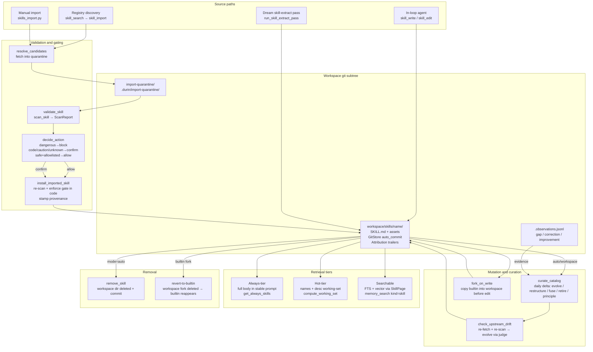

# Skills — architecture overview

> Single as-built reference for durin's skills subsystem: what it does today,
> how the pieces fit, and where each lives in code. For the SKILL.md format
> contract, see [`01_format_and_interop.md`](01_format_and_interop.md); for the
> cold-path lifecycle (skill-extract, observations, curation, suggestions), see
> [`02_lifecycle_and_curation.md`](02_lifecycle_and_curation.md); for the
> `skill.*` telemetry and how usage/effectiveness reach the webui, see
> [`03_telemetry_and_effectiveness.md`](03_telemetry_and_effectiveness.md).
> Citations are **file + symbol** (grep-stable).

---

## 1. Purpose

A skill is a markdown plugin that teaches durin how to perform a class of
tasks — installed once, refined over time, surfaced to the agent precisely
when it is needed. The subsystem manages the full lifecycle: authoring new
skills from session experience, importing verified skills from external
registries, curating and evolving skills based on live usage feedback, and
retiring skills that are no longer needed. Three properties define it:

- **Git-backed versioning.** Every skill lives in a git-tracked directory
  (`workspace/skills/<name>/`). Every mutation — create, edit, import, fuse —
  is a committed diff. History is an audit trail; rollback is `git revert`.
- **Single mutation chokepoint.** All writes go through
  `durin/agent/skills_store.py`. External sources (import, discovery,
  dream-create) pass through an explicit validate + scan + gate pipeline before
  any commit is made.
- **Three-tier retrieval.** Skills reach the agent via always-injection (full
  body, every turn), a usage-ranked hot-tier (names and descriptions), or
  on-demand FTS and vector search — matched to context window cost versus
  coverage needs.

---

## 2. Mental model

**Skills are versioned markdown plugins with two homes.** Builtins ship with
the durin package (`durin/skills/`; managed as `BUILTIN_SKILLS_DIR`). The
workspace git subtree (`workspace/skills/`) is the mutable layer: user-created,
imported, and dream-evolved skills live here. A workspace skill of the same name
shadows its builtin counterpart. Removing the workspace copy restores the
builtin.

**One chokepoint enforces the gate.** `durin/agent/skills_store.py` is the
single write path for every origin — the in-loop agent tool, the daily dream
pass, import, and curation all converge on the same commit machinery.
The import gate (`decide_action` in `durin/agent/skills_import.py`) is enforced
in code, never in prompt: dangerous sources are blocked, code-carrying or
cautioned sources require human confirmation, and only safe allowlisted sources
auto-proceed. The gate runs again at install, even if an earlier scan said safe.
The webui import finishes the job for an `allow` verdict (auto-install rather
than parking in quarantine) and short-circuits an already-installed skill before
the costly fetch. First-party **builtins** (`source == "builtin"`) are exempt
from the inventory scan — they ship vetted, so carrying scripts never flags them
caution/insecure; a *forked* builtin lives in the workspace and is scanned like
any other.

**Three retrieval tiers match context cost to need.** Always-tier (`always:
true`) injects the full SKILL.md body into the stable system prompt every turn —
high cost, maximum incentive. The hot-tier lists names and descriptions for the
usage-ranked working set, letting the agent pull full bodies on demand with the
`skill_view` tool. The
searchable tier indexes every skill as a memory class (FTS and vector) reachable
via `memory_search(kind=skill)` — zero marginal cost until queried.

---

## 3. Diagram

---

## 4. How it works

### Create

Two paths produce new skills:

**In-loop agent.** The `skill_write` core tool calls
`skills_store.dream_create_skill`, which stamps provenance frontmatter
(`source`, `created_at`), fills in a missing `name` or `description` derived
from the body when the caller omitted them (refusing outright if no
description can be derived either way), initializes the `SKILL.md`, and calls
`GitStore.auto_commit` with Attribution trailers (Actor, Session, Agent).
`skill_edit` (bounded update) forks a builtin into the workspace via
`fork_on_write` before applying the diff, so the builtin package is never
touched. Both paths call `_sync_index` to update FTS and vector after the
commit. See `02_lifecycle_and_curation.md` for the derivation contract and why
create derives while import (below) refuses instead.

**Dream skill-extract pass.** `durin/memory/dream_passes.py::run_skill_extract_pass`
runs a sub-agent (`AgentRunner`, `max_iterations=8`) over recent sessions plus
any logged `new:*` gap observations. When the sub-agent finds a recurring
multi-step procedure it calls `skill_write` — the same tool as the in-loop
agent, routing through the same chokepoint. The pass returns early without an
LLM call when there are no sessions and no gap observations.

### Import

All external sources (registry hits, GitHub refs, HTTPS URLs, local paths) share
one pipeline in `durin/agent/skills_import.py`:

1. `resolve_candidates(source)` resolves the ref to one or more candidates.
2. `fetch_candidate` downloads into `.durin/import-quarantine/<name>/` (zip-slip
   safe, SSRF-safe, file size and count capped by `skills.security` limits).
3. `validate_skill` checks the agentskills.io format (name, description, code
   detection via `iter_code_files`).
4. `scan_skill` (`durin/security/skill_scan.py`) runs a deterministic static
   scan: body regex rules (prompt injection, hidden instructions, sensitive
   paths, secrets, unicode bidi) plus an AST behavioral pass on bundled Python
   scripts (shell exec, dynamic eval, reverse shell patterns). Returns a
   `ScanReport` with `findings` and a `verdict` of `safe`, `caution`, or
   `dangerous`.
5. `decide_action(source, verdict=..., carries_code=..., allowlist=...)` applies
   the trust-times-verdict gate: `dangerous` → block; `carries_code` OR
   `caution` OR source not in allowlist → confirm; safe + allowlisted → allow.
6. `install_imported_skill` re-runs the scan on the quarantined copy (fresh, in
   case of tampering since the initial scan), enforces the gate a second time in
   code, stamps `metadata.durin.provenance`, and calls `GitStore.auto_commit`.
   `_sync_index` updates the search indices.

The optional LLM judge (`durin/security/skill_judge.py`,
`skills.security.llm_judge.trigger`, default `off`) adds a semantic layer after
the static scan for paraphrased or non-English injection patterns. It is
opt-in; the static scan is always the primary gate.

### Discover

`durin/agent/skill_registry.py` provides a `SkillRegistry` protocol and two
adapters: `SkillsShRegistry` (queries `skills.sh/api/search`) and
`ClawHubRegistry` (queries clawhub's ranked `/api/v1/search?q=` endpoint — not
its recency list). `search_registries` queries both adapters in parallel
(SSRF-safe), deduplicates by ref, and round-robin interleaves results using a
stable `crc32` tiebreak so no registry permanently owns the top slot.

A preview call (`describe` endpoint / `web_skill_describe`) reads only the
SKILL.md body from the remote source — it never installs or executes anything
and degrades gracefully on network errors. This lets users inspect a skill
before routing it through the import gate.

### Evolve

`durin/agent/skill_curation.py::curate_catalog` runs as the final step of the
daily dream cron. Before anything is judged, it deterministically backfills any
`auto` skill missing a frontmatter description (derived from the body — see
Create above) and folds those repairs into the delta. It then reviews the
change-gated delta: `mode="auto"` AND `source="workspace"` skills that
`needs_curation` (body changed since last pass, **or** the stored
`curation_rules` stamp is older than the current `CURATION_RULES_VERSION`,
which forces a one-time recheck of the whole set after a rules change), plus
any auto workspace skill with an OPEN observation even if its body is
unchanged. An LLM judge proposes `evolve` (surgical edit), `restructure`
(agentic doctrine repair via `restructure_skill_agentic`), `fuse` (merge
near-duplicates via `dream_fuse_skills`), `retire` (delete via `remove_skill`,
git-recoverable), `principle` (add a cross-cutting rule), or `retire_principle`
actions. The judge receives OPEN observations as evidence and DECLINED history
to prevent re-proposing rejected changes. Imported skills are `mode=manual` and
are not auto-curated — instead, they are handled by the suggestion path
described below. See `02_lifecycle_and_curation.md` for the full delta-build
sequence, the observation queue and skill-signal hindsight detection that feed
it, and `03_telemetry_and_effectiveness.md` for the `skill.*` events each step
emits.

The judge is also told which reviewed skills carry a **recent user hand-edit**,
read straight from the skill git editorial: `user_edits_since_curation` returns
each `Actor: user` commit since the last `curated @` stamp **with its unified
diff**, so the judge sees exactly what the user changed by hand, not merely that
a change happened. `auto` means dream *may* improve a skill, not that
the user is locked out of it: a user may edit an auto skill directly (see the
web editor note under Format & interop), and the edit stays `auto`. The judge
is instructed to treat such edits as intentional — it may still evolve them for
a concrete, stated reason, but must not revert or undo a user edit silently.

#### Skill suggestions (manual skills)

When `memory.dream.skill_suggestions_enabled` is on (the default), the daily
curation pass also evaluates `mode=manual` workspace skills and, where it
would propose `evolve` or `retire`, enqueues the proposal as a
**suggestion** in the dream bandeja rather than applying it directly. The user
can accept or reject each suggestion from the webui; nothing is applied
without explicit acceptance. Fuse suggestions (merging two manual skills into
one) are out of scope for the suggestion path for now; they remain an action
type available only in the auto-curation pass.

Each suggestion carries:
- the proposed action and the judge's reasoning
- for content changes (`evolve`), a unified-diff patch rendered by the
  `DiffViewer` component in the webui — the reusable display seam for future
  history views as well

Rejecting a suggestion writes an **expiring tombstone** (approximately 30 days)
so the same conclusion is not re-proposed within that window. This is a
time-limited signal, distinct from the `do_not_absorb` tombstone used by the
refine pass, which is permanent. Once the tombstone expires the curation judge
re-evaluates the skill normally on the next applicable run.

Auto skills and the in-loop `skill_edit` path are unaffected: they are curated
and applied as before.

**Observation queue.** `durin/agent/skill_observations.py` persists live
feedback from the `skill_observe` core tool (`correction`, `gap`,
`improvement`, `simplify` kinds) to `skills/.observations.jsonl` inside the
git subtree. Edits via `skill_edit` on auto skills auto-log an improvement
observation. A hindsight pass during the dream extract
(`discover_skill_signals` in `durin/agent/skill_signals.py`) scans the
**tail** of post-cursor session turns (tail-windowed, not head, so corrections
at the end of long sessions are not missed). Observations accumulate with
dedup-by-count; `count >= 2` is the recurrence signal that licenses curation
action. See `02_lifecycle_and_curation.md` for the full observation lifecycle
(OPEN/APPLIED/DECLINED, paraphrase-tolerant dedup, archival) and
`03_telemetry_and_effectiveness.md` for how usage and observation counts reach
the webui Skills panel.

**Cross-cutting principles** are promoted by the curation judge into
`skills/.principles.jsonl` (capped at 12 entries). They are injected into both
the curation prompt and the skill-extract prompt so new and evolved skills are
born compliant.

**Upstream drift.** `durin/agent/skill_drift.py::check_upstream_drift` is
wired into `curate_catalog`. For a skill whose `provenance.source` is a real
repo, it re-fetches + re-scans; if the content changed and the gate says allow,
the upstream body is fed to the curation judge to merge via `evolve` while
preserving local edits. Confirm or block sources are left for human review.

### Remove

`skills_store.removable_action` classifies the target:

| Case | Condition | Action | Effect |
|---|---|---|---|
| Created / imported / dream | workspace dir, no builtin of same name | `remove` | dir deleted, git commit, `_unsync_index` |
| Forked builtin | workspace dir exists and builtin of same name exists | `revert` | workspace copy deleted, git commit, `_unsync_index` |
| Pure builtin | no workspace dir | `null` | refused — package is not touched |

On revert, `_unsync_index` is correct: workspace skills are the only ones
indexed (builtins are never indexed), so dropping the fork's FTS and vector
rows restores the builtin's pre-fork un-indexed state. No re-index of the
builtin is needed.

Removal is not exposed as an LLM-callable tool — it is an admin action
reachable from the web panel, the CLI (`durin skill remove <name>`), and the
chat command (`/skills remove <name>`).

### Retrieve

`durin/agent/skills.py::SkillsLoader` loads skills for context assembly:

1. **Always-tier.** `get_always_skills()` returns skills with `always: true`
   in frontmatter. `load_skills_for_context(names)` injects full SKILL.md
   bodies (without frontmatter) into the stable system prompt every turn.
   `disable_model_invocation` skills are excluded from the visible catalog but
   the always-tier is not filtered by the visible catalog — it is a stable
   injection that bypasses hot-tier and searchable logic.

2. **Hot-tier.** `durin/agent/skill_usage.py::compute_working_set` aggregates
   `skill_calls` from session sidecars — view events (`skill_view`), read
   events (`read_file` on a `SKILL.md`), and edit events (`skill_edit`) — to produce a usage-ranked set
   of names. The set is split into a `frequent` slice (top N by call count over
   a 7-day window) and a `recent` slice (top N over 24 hours), deduped and
   filled with remaining candidates. Sizes are controlled by
   `agents.defaults.skills_hot_tier`. The hot tier injects names + descriptions
   into `templates/agent/skills_section.md`; the agent loads full bodies on
   demand with the `skill_view` tool (`durin/agent/tools/skill_view.py`), which
   also returns the skill's bundled-file map and a readiness check, or a raw
   `read_file`. The computed set is memoized in `ContextBuilder` keyed on the
   candidate name-set: usage re-ranking never churns the cache-stable prefix
   turn to turn, but installing or removing a skill changes the key, so the
   catalog reflects it on the next turn without a process restart.

3. **Searchable.** `durin/memory/skill_page.py::SkillPage` is the memory class
   for skills: it wraps the SKILL.md frontmatter and body for FTS and vector
   indexing. When `memory.index_skills` is on (default), every workspace skill
   is reachable via `memory_search(kind=skill)`. `disable_model_invocation`
   skills are indexed but excluded from searchable results the model sees.

### Sweep and quarantine

`durin/agent/skill_lifecycle.py::sweep_unverified_skills` runs at
`ContextBuilder.__init__` and on surface calls. It relocates any workspace skill
that arrived without `metadata.durin.provenance` (a registry CLI or manual file
drop) to `.durin/import-quarantine/`, prepends an `unverified_origin` finding
to the scan report, and makes it inert for the agent. Approve re-gates through
`install_imported_skill`; reject deletes.

---

## 5. Key types and entry points

| Symbol | File | Role |
|---|---|---|
| `SkillsStore` functions (`_store`) | `durin/agent/skills_store.py` | Single write chokepoint for all skill mutations. Provides `dream_create_skill`, `install_imported_skill`, `remove_skill`, `fork_on_write`, `mark_curated`, `needs_curation`. All writes call `GitStore.auto_commit` with `Attribution` trailers. |
| `Attribution` | `durin/agent/skills_store.py` | Actor, Session, Agent trailers stamped on every skill git commit. |
| `SkillsLoader` | `durin/agent/skills.py` | Loads skills from workspace (shadows builtins). `list_skills`, `load_skill`, `get_always_skills`, `build_skills_summary`, `load_skills_for_context`. |
| `decide_action` | `durin/agent/skills_import.py` | Trust-times-verdict gate: dangerous → block; carries_code / caution / not-allowlisted → confirm; else allow. Enforced in code at install. |
| `scan_skill` / `ScanReport` | `durin/security/skill_scan.py` | Deterministic static scan: body regex rules + AST behavioral pass. Returns `findings` and `verdict` (safe / caution / dangerous). |
| `SkillRegistry` protocol + adapters | `durin/agent/skill_registry.py` | Protocol: `search(query, limit)` → list of `SkillSearchHit`. Two adapters: `SkillsShRegistry` (skills.sh) and `ClawHubRegistry` (clawhub). `search_registries` queries both in parallel with round-robin interleave. |
| `SkillCandidate` / `resolve_candidates` / `fetch_candidate` | `durin/agent/skill_resolve.py` + `durin/agent/skills_import.py` | Resolve a source ref to candidates, fetch into quarantine (zip-slip safe, SSRF-safe, size-capped), validate SKILL.md format. |
| `validate_skill` | `durin/agent/skills_import.py` | Checks agentskills.io format (name, description, code detection). Returns `ValidationReport` with `carries_code`. |
| `skill_observe` / observation queue | `durin/agent/skill_observations.py` | Task-observer pattern. In-session feedback: `correction`, `gap`, `improvement`, `simplify`. Store: `skills/.observations.jsonl`. States: OPEN → APPLIED / DECLINED. Principles: `skills/.principles.jsonl` (cap 12). |
| `curate_catalog` | `durin/agent/skill_curation.py` | Daily delta-curation over `mode="auto"` workspace skills. LLM judge proposes evolve / restructure / fuse / retire / principle. Change-gated: never scales with full catalog size. |
| `SkillPage` | `durin/memory/skill_page.py` | Memory class for skills. Wraps SKILL.md frontmatter and body for FTS and vector indexing. Enables `memory_search(kind=skill)`. |
| `run_skill_extract_pass` | `durin/memory/dream_passes.py` | Daily dream pass: sub-agent mines recent sessions and gap observations, calls `skill_write` for recurring procedures. Agentic (uses `AgentRunner`). |
| `sweep_unverified_skills` | `durin/agent/skill_lifecycle.py` | Relocates no-provenance workspace skills to quarantine, prepends `unverified_origin` finding. Runs at ContextBuilder init and on surfaces. |
| `compute_working_set` | `durin/agent/skill_usage.py` | Hot-tier sizing: frequent (7-day window) + recent (24-hour window) skill calls from session sidecars. Returns list of skill names. |
| `get_always_skills` / `load_skills_for_context` | `durin/agent/skills.py` | Always-tier retrieval: filter for `always: true`, inject full bodies into stable prompt. |
| `skills_inventory` / web routes | `durin/agent/skills_surface.py` | Read model for CLI and web. Augments skill list with verdict and findings (pinning a stricter import-time provenance verdict via a synthetic `import_verdict` finding), removable action, review overrides, requirements resolution. No mutations. |
| `check_upstream_drift` | `durin/agent/skill_drift.py` | Re-fetches and re-scans a skill's source repo. If changed and gate allows, feeds upstream body to curation judge for surgical evolve. |

---

## 6. Configuration and surfaces

### Configuration keys (`durin/config/schema.py`)

| Key | Default | Meaning |
|---|---|---|
| `skills.security.allowlist` | `DEFAULT_SKILL_ALLOWLIST` (first-party orgs) | Source-ref prefixes that skip the source-confirmation step. Code and dangerous gates have no opt-out. |
| `skills.security.github_token_secret` | `""` | Name of the durin secret holding a GitHub API token for authenticated fetches. |
| `skills.security.max_files` | 100 | Per-fetch file count cap. |
| `skills.security.max_total_bytes` | 3 MB | Per-fetch total size cap. |
| `skills.security.max_file_bytes` | 1 MB | Per-file size cap. |
| `skills.security.llm_judge.trigger` | `"off"` | When to run the semantic LLM judge: `off` (never auto), `uncertain` (when already cautioned), `always`. |
| `skills.discovery.registries` | skills.sh + clawhub enabled | List of `SkillRegistryConfig` entries. Both adapters enabled by default. |
| `skills.discovery.search_limit` | 10 | Max hits returned per registry search. |
| `skills.install_policy` | `"approve"` | Governs `skill_install_deps`: `never` (report only), `approve` (dry-run then confirm), `auto` (run without per-call confirm). All policies execute through ExecTool. |
| `memory.index_skills` | `true` | Index workspace skills as a searchable memory class (FTS + vector). |
| `agents.defaults.skills_hot_tier.enabled` | `true` | Enable the usage-ranked hot-tier. False restores full-catalog injection. |
| `agents.defaults.skills_hot_tier.frequent` | 30 | Top N skills by call count over the frequent window. |
| `agents.defaults.skills_hot_tier.recent` | 15 | Top N skills by call count over the recent window. |
| `agents.defaults.skills_hot_tier.frequent_window_hours` | 168 (7 days) | Window for the frequent slice. |
| `agents.defaults.skills_hot_tier.recent_window_hours` | 24 | Window for the recent slice. |
| `agents.defaults.disabled_skills` | `[]` | Skill names excluded from loading entirely. |
| `memory.dream.cron` | `"0 3 * * *"` | Schedule for the daily dream cron (all consolidation passes + skill curation). |
| `memory.dream.max_seconds_per_run` | 600 | Hard wall-clock cap per extract pass (yields after current session; cursor resumes on next trigger). |
| `memory.dream.skill_signals_enabled` | `true` | Run `discover_skill_signals` over post-cursor session turns during the extract pass. |
| `memory.dream.skill_suggestions_enabled` | `true` | When on, curation proposes actions for `mode=manual` skills as bandeja suggestions (accept/reject) rather than applying them directly. Disable to exclude manual skills from curation entirely. |

### CLI surfaces

| Command | What it does |
|---|---|
| `durin skill list` | List available and quarantined skills with verdict and availability. |
| `durin skill search <query>` | Search configured registries; returns ranked hits with ref and source. |
| `durin skill remove <name>` | Remove or revert-to-builtin (admin action; not an agent tool). |
| `durin memory dream` | Run the core dream passes manually (extract → derived_from → skill_extract → refine → always_on). `curate_catalog`, the document/relation passes, and workflow-improve run only in the gateway cron job, not by this command. |

### Agent tools (in-loop, `scope="core"`)

| Tool | Purpose |
|---|---|
| `skill_write` | Create a new skill (routes to `dream_create_skill`). Also registered in the dream's skill-extract sub-agent. |
| `skill_edit` | Bounded edit (mode-gated; forks builtins). |
| `skill_search` | Search registries; returns hits and refs. Never installs. |
| `skill_import` | Import from a source through the gate. |
| `skill_audit` | Run the static scan on an installed skill. |
| `skills_list` | List available and quarantined skills. |
| `skill_install_deps` | Install a skill's declared dependencies (dry-run by default; governed by `install_policy`; executes via ExecTool). |
| `skill_observe` | Log live skill feedback to the observation queue. Logs only — no skill is mutated in-session. |

`skill_acquire_seed` declares `_scopes={"dream"}` but is unreachable to the
in-loop agent because `ToolLoader.load` is only called with `scope="core"` or
`scope="subagent"`. The in-loop acquire-on-gap path uses `skill_search` +
`skill_import` + `ask_user_question` instead. The daily skill-extract pass
registers `skill_acquire_seed` directly — it is not loaded via `ToolLoader`.

### Web and API surfaces

`durin/agent/skills_surface.py` exposes the read model (inventory, quarantine,
verdict, review overrides) to the web panel and CLI. Web routes:
`GET /api/v1/skills` (inventory), `GET .../describe` (preview before import),
`POST .../review` (user override for a flagged active skill),
`DELETE .../review` (reopen review), `GET .../observations` (the OPEN
observation backlog behind the panel's count badge, filterable by skill),
`POST .../observations/{id}/resolve` (manual resolution: `applied` or
`declined`). Removal routes trigger `remove_skill` or revert-to-builtin.

---

## 7. Curated rationale

**Single chokepoint over multiple paths.** Create, import, dream-create, and
curation all converge on `skills_store.py` and `GitStore.auto_commit`. This
keeps the git history coherent — every skill's provenance is a commit message
with attribution trailers — and makes the security gate a single code path
rather than a per-caller responsibility.

**Git is the original copy.** There is no separate `original/` directory. The
first commit of an imported or created skill is its canonical original. Rollback
and diff are native git operations. This avoids a second storage layer and keeps
recovery human-readable.

**Gate is in code, not prompt.** `decide_action` is a pure function called in
`install_imported_skill`. The LLM judge is an optional additive layer; the
deterministic rules (dangerous block, code/caution confirm) cannot be overridden
by a prompt or a model output. This reflects the principle that security floors
should not depend on model cooperation.

**Delta-only curation.** `curate_catalog` reviews only skills whose body changed
since the last pass or that have open observations. This means curation cost
is proportional to activity, not catalog size — a stable catalog costs nothing
to run, and a busy day's edits are reviewed without a full re-scan.

**Retrieval tiers match cost to context.** Always-injection is reserved for
skills that are genuinely load-bearing every turn. The hot-tier reduces prompt
size on the stable prefix (cache-friendly). The searchable tier is zero-cost
until the agent queries it. The three tiers together let a large skill library
coexist with a bounded context window.
