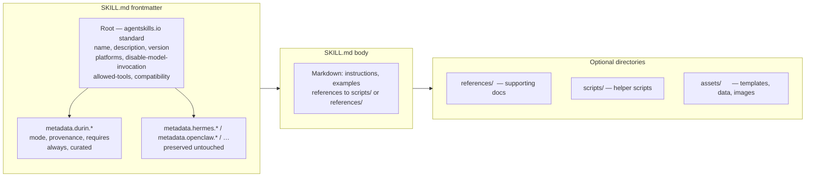

# Skills — format and interop contract

> For the full skills subsystem (lifecycle, dreams, security, retrieval, runtime),
> see [`00_overview.md`](00_overview.md). This file covers the SKILL.md
> **format contract** only.

---

## 1. Purpose

durin's SKILL.md format is the
[agentskills.io](https://agentskills.io/specification) open standard plus
durin's own behavior under the `metadata.durin.*` vendor namespace. Skills are
portable: importing from any compliant tool or marketplace is a near-no-op, and
durin's own skills are usable elsewhere. The keystone is **round-trip fidelity**
— durin never drops a field it does not understand.

---

## 2. Mental model

**One format, two layers.** The agentskills.io root frontmatter is the shared
surface that every compliant agent (Hermes, OpenClaw, Pi, Claude Code, Codex,
Cursor, and others) can read. The `metadata.durin.*` namespace is where durin
adds its own behavior fields without conflicting with other vendors' namespaces.
A Hermes skill with `metadata.hermes.*` fields imports into durin intact;
durin's `metadata.durin.*` additions survive export back to Hermes.

**Description is load-bearing.** The `description` field is not cosmetic — it
is the searchable handle for FTS and the line shown in the hot-tier working-set
and the skills catalog. A skill with a missing or vague description is
effectively undiscoverable in the searchable tier.

**Write path preserves foreign fields.** All mutations (`dream_create_skill`,
`apply_skill_edit`, `save_skill_content`, `set_mode`, `mark_curated`,
`dream_fuse_skills`) round-trip through `split_frontmatter` → mutate → `join_frontmatter(sort_keys=False)`.
Unknown root keys and every `metadata.<vendor>` block survive byte-equivalently.

---

## 3. Diagram



---

## 4. How it works

### On-disk layout

```
workspace/skills/<name>/
├── SKILL.md            # required — frontmatter + markdown body
├── references/         # optional — supporting documents, loaded on demand
├── scripts/            # optional — helper scripts
├── assets/             # optional — templates, data, images
└── templates/          # optional
```

`<name>` is the directory name and the skill identifier. Builtin skills live in
the durin package; a workspace copy of the same name takes precedence and is
forked on first write (`fork_on_write`). Subdirectories are preserved on import
and reachable via `read_file`.

### Root frontmatter — agentskills.io standard

| Field | Required | durin behavior |
|---|---|---|
| `name` | **yes** | 1–64 chars, lowercase letters/digits/hyphens, matches directory name. |
| `description` | **yes** | ≤1024 chars. Load-bearing for retrieval — used as the searchable handle and the hot-tier catalog line. |
| `version` | no | Preserved; surfaced in `list_skills_info`. |
| `license` | no | Preserved; surfaced in `list_skills_info`. |
| `compatibility` | no | Free-form environment requirements (≤500 chars). Preserved; advisory only (not enforced). |
| `allowed-tools` | no | Space-separated pre-approved tools. Preserved; advisory only (not enforced). |
| `platforms` | no | OS restriction: `[macos, linux, windows]`. Honored — a skill is hidden on a non-matching OS. Aliases accepted: `darwin`→macos, `win32`→windows. No field means all platforms. |
| `disable-model-invocation` | no | Truthy hides the skill from the model's catalog and working-set (still loadable programmatically). Snake_case (`disable_model_invocation`) and camelCase (`disableModelInvocation`) also accepted. |

Any other root key (for example `author`, `tags`, `x-anything`) is preserved
untouched across durin edits — never required, never rejected.

### `metadata.durin.*` — durin's behavior namespace

durin keeps its own fields under `metadata.durin`, following the same
`metadata.<vendor>` pattern Hermes uses for `metadata.hermes` and OpenClaw for
`metadata.openclaw`:

| Field | Meaning |
|---|---|
| `metadata.durin.mode` | `manual` (dream only *proposes* edits, via the suggestion bandeja) or `auto` (dream may author and patch it directly). The mode governs the **dream/system** side only — it is not a user lock. The user can edit a skill in either mode from the web editor; a user edit to an `auto` skill stays `auto` and is committed with `Actor: user`, which the curation judge is told to respect. Default by origin: dream-created → auto, user-created → manual, imported → manual. |
| `metadata.durin.provenance` | `{ source, created_at, content_hash, … }` — where the skill came from and the gate decision at install. `source: "dream"` means crystallized from session experience; `source: "github:owner/repo/…"` means imported. |
| `metadata.durin.requires` | `{ bins: [...], env: [...] }` — availability gate. A skill with an unmet CLI tool or missing env var is shown as `(unavailable: …)` and excluded from retrieval. |
| `metadata.durin.always` | Truthy → full SKILL.md body is injected into the stable system prompt every turn (the always-on tier), not just name and description. |
| `metadata.durin.curated` | Dream-curation bookkeeping (last-curated timestamp, body hash). Read by `needs_curation`; not meaningful to authors. |

Other vendors' `metadata.<vendor>.*` blocks (for example `metadata.hermes.requires_toolsets`)
are preserved untouched and ignored functionally — durin does not act on another
vendor's behavior fields.

### Round-trip fidelity guarantee

Every durin mutation preserves all foreign frontmatter: unknown root keys and
every `metadata.<vendor>` block survive byte-equivalently. Writes route through
`_update_md` (`split_frontmatter` → mutate the parsed dict →
`join_frontmatter(sort_keys=False)`) or overwrite user-supplied content
verbatim. Enforced by `tests/agent/test_skill_interop_roundtrip.py`.

An imported Hermes or Claude-Code skill can be edited, curated, and re-exported
by durin and still round-trips back to its origin without data loss.

### Import posture

Because durin shares the open standard, importing is "copy the directory and
stamp the durin namespace":

1. Fetch the skill (URL, GitHub, marketplace) — copy `SKILL.md` plus any
   `references/`, `scripts/`, `assets/`, `templates/` directories.
2. Stamp `metadata.durin.provenance.source` and `metadata.durin.mode`.
3. Optionally map a foreign requirement declaration
   (`metadata.hermes.requires_*`, `required_environment_variables`,
   `metadata.openclaw.requires`) to `metadata.durin.requires` if durin should
   gate on it.

Everything else works because the format is shared. The security gate that
precedes the stamp is covered in [`00_overview.md`](00_overview.md) §4 Import.

---

## 5. Key types and entry points

| Symbol | File | Role |
|---|---|---|
| `split_frontmatter` / `join_frontmatter` | `durin/agent/skills_frontmatter.py` | Parse SKILL.md into `(data_dict, body)` and reassemble. `sort_keys=False` preserves field order; unknown keys survive unchanged. |
| `ensure_durin` | `durin/agent/skills_frontmatter.py` | Ensure `metadata.durin` dict exists in a frontmatter dict before writing durin-specific fields. |
| `validate_skill` | `durin/agent/skills_import.py` | Format validator: checks name/description presence, name shape, code detection. Returns `ValidationReport` with `carries_code`. |
| `_update_md` | `durin/agent/skills_store.py` | Mutation helper used by all write paths: read → `split_frontmatter` → mutate → `join_frontmatter` → write. Foreign fields survive. |
| `SkillPage.from_file` | `durin/memory/skill_page.py` | Parses a SKILL.md for indexing: extracts name, description, body, mode, and disabled flag. Returns `None` for unreadable files so rebuild walkers skip silently. |
| `get_skill_metadata` | `durin/agent/skills.py` | Reads and parses SKILL.md frontmatter via `yaml.safe_load`. Returns native Python types. |
| `_is_model_invocation_disabled` | `durin/agent/skills.py` | Checks `disable_model_invocation`, `disableModelInvocation`, and `disable-model-invocation` spellings. |

---

## 6. Configuration and surfaces

Format parsing and enforcement are driven by the same loaders and mutation paths
documented in [`00_overview.md`](00_overview.md). The relevant config keys for
format behavior:

| Key | Default | Effect |
|---|---|---|
| `agents.defaults.disabled_skills` | `[]` | Exclude named skills from loading entirely (before format parsing). |
| `memory.index_skills` | `true` | Index the SKILL.md body and description for FTS and vector search. |

The `quick_validate.py` script shipped inside the `skill-creator` builtin skill
(`durin/skills/skill-creator/scripts/quick_validate.py`) is the creation-time
mechanical validator. It reports all issues in one pass: format errors (name
constraints, description presence, root directory shape, markdown link
resolution) at ERROR level, and style warnings (undiscoverable files,
over-length body) at WARNING level. Scripts are parsed for syntax
(`compile()` for `.py`, `bash -n` for `.sh`) but never executed. This is
creation-time tooling; the runtime loader accepts what it finds.

---

## 7. Curated rationale

The agentskills.io standard exists because the agent-skills ecosystem converged
on a common format independently. durin adopts it wholesale rather than defining
a proprietary format — this means every skill from a compliant registry can be
imported without a conversion step, and skills authored in durin are immediately
usable by other compliant agents.

The `metadata.<vendor>` namespace pattern is the ecosystem's answer to
behavioral extension without collision. durin follows it precisely to avoid
overloading shared root keys with behavior that other tools do not understand or
respect. The round-trip guarantee is the practical consequence: a skill that
passes through durin's hands is not modified in ways its origin would reject.
