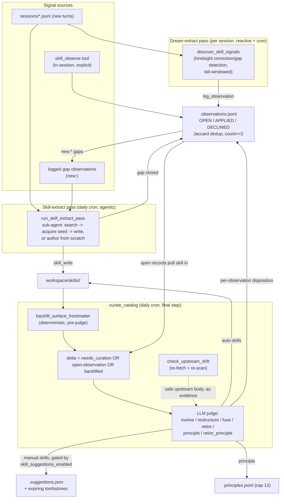

# Skills — cold-path lifecycle and curation

## 1. Purpose

**00_overview.md** describes the skills subsystem as it appears in a single
turn: create, import, retrieve. This document is the **cold path** — the
asynchronous machinery that keeps the catalog usable over weeks of drift: a
sub-agent that mines conversations for reusable procedures, a feedback queue
that captures live corrections, and a daily judge that decides what to evolve,
fuse, retire, or leave alone.

It exists because a skill's quality is only visible in hindsight. Whether a
skill's steps are still accurate, whether two skills have drifted into
duplicates, whether a skill nobody uses should be retired — none of that is
knowable at write time. The cold path answers those questions asynchronously,
off the interactive turn, the same way Dream's memory passes consolidate the
entity graph (see `../memory/05_dream_cold_path.md`).

## 2. Mental model

**1. Two feedback channels feed one judge.** A skill can drift for two
reasons: its own body goes stale, or live usage surfaces a problem. The
curation judge in `durin/agent/skill_curation.py` is the single place both
converge — a changed body pulls a skill into the review delta, and so does an
open observation, even when the body itself is untouched.

**2. Observations are logged in the moment, judged later.** The
`skill_observe` tool and a hindsight dream pass both write to the same
append-only queue (`skills/.observations.jsonl`). Logging is cheap and
non-judgmental — deciding whether an observation warrants a change is deferred
to the daily curation pass, which has the whole catalog and the whole day's
signal in view.

**3. Create derives; import rejects.** The two paths that bring a skill's
frontmatter into existence make an opposite trust call. `skill_write` /
`dream_create_skill` and `dream_fuse_skills` **derive** a missing `name` /
`description` from the body — self-authored content is repaired, because the
author is durin itself and the content is already trusted. `skills_import.py`
does the reverse: `validate_skill` treats a missing name or description as a
hard error and `install_imported_skill` raises `SkillImportRefused` rather
than guessing — third-party content is refused, not patched, because inventing
metadata for text durin didn't write would launder an untrusted skill into the
catalog under a fabricated description.

**4. Curation reviews the delta, not the catalog.** `needs_curation` per skill
plus the open-observation set define what changed since the last pass. A
stable skill costs nothing to leave alone; curation's cost scales with how
much changed, not with how large the catalog has grown.

## 3. Diagram

## 4. How it works

### Skill-extract: sessions to reusable procedures

`run_skill_extract_pass` (`durin/memory/dream_passes.py`) is the only agentic
dream pass in the skills subsystem — it spins up an `AgentRunner` sub-agent
rather than making a single structured LLM call. `_skill_extract_messages`
assembles its input from two sources and returns `None` (skipping the LLM call
entirely) when both are empty:

1. **Recent sessions.** `_recent_sessions_text` renders the newest
   `max_sessions` session transcripts (workflow session files excluded), newest
   first. A long combined transcript is **head+tail windowed**: the first 6000
   characters, a truncation marker, then the last 6000 characters. This keeps
   late-session procedures from being silently dropped — a plain head-truncate
   would lose exactly the material near the end of a long session, which is
   where a just-established procedure is most likely to sit.
2. **Logged gaps.** Any OPEN observation whose `skill` field starts with
   `new:` — a coverage gap flagged in hindsight (see below) — is surfaced as a
   `LOGGED GAPS` block with its working name and issue text.

The sub-agent (`ToolRegistry` built by `_build_skill_extract_tools`) carries
`ReadFileTool`, `EditFileTool`, `SkillWriteTool`, `SkillSearchTool`,
`SkillAcquireSeedTool`, `ListWorkflowsTool`, and `WorkflowWriteTool`, and runs
with a bounded `max_iterations=8`. Its system prompt
(`_SKILL_EXTRACT_PROMPT`) fixes a strict frontmatter and size contract
before it ever writes: every skill it authors MUST carry `name` and
`description` in YAML frontmatter, the description is described as the *only*
text the agent later reads to decide when a skill applies, and the skill
should stay under roughly 150 lines — reference material bundled or linked
rather than inlined. The prompt also instructs the sub-agent to prefer
*acquiring* a published skill (`skill_search` then `skill_acquire_seed`) over
authoring from scratch, and — when closing a logged gap — to use the gap's
working name **verbatim**, which is what lets gap-resolution match by name
afterward. Authorship must always be in English, with descriptions stating that
their triggers apply regardless of the conversation's language, even when the
mined conversation was not in English.

The prompt also embeds the **composition doctrine**, the workspace's
**workflow catalog**, and the **workflow authoring reference**
(`durin/agent/skills_doctrine.py`). None of these are paraphrases:
`composition_doctrine()` loads the "Before building: is a skill even the right
tool?" section of the builtin `skill-creator` skill verbatim at assembly time,
and `workflow_authoring_reference()` loads the builtin `workflows` skill's
authoring schema (every node kind, including the deterministic `script` node)
the same way — the sub-agents' file tools are workspace/staging-scoped and
cannot read the packaged skill, so the schema travels in the prompt instead of
as an unreachable pointer. Both authoring surfaces (the skill-extract pass and
the agentic restructure) read the same single source. The
instruction it carries: a step an existing workflow automates must be
*delegated* (the skill contributes the domain layer and calls `run_workflow`);
a recurring orchestration no workflow covers is authored with `workflow_write`
and then delegated to; deterministic transformations become bundled scripts
(`skill_write`'s `files`); only knowledge and judgment stay as prose. The
extract sub-agent's `SkillWriteTool` runs the composition gate (below) in
`hard` mode — an autonomous write of a narration-only body is rejected
absolutely, with no override.

After the sub-agent run, `_resolve_gap_observations` walks the OPEN `new:*`
observations and marks a gap `APPLIED` when a skill now exists under its
working name. Matching is **tolerant**, not exact-only: an exact match closes
the gap, and failing that, both the gap's working name and every existing
skill name are passed through `_norm` (lowercase, non-alphanumeric collapsed to
hyphens, trimmed) for a normalized comparison — so a gap logged as `"Release
Runbook"` still closes against a skill authored as `release-runbook`. An
unmatched gap stays OPEN and is offered again to the next pass. The count of
gaps closed this way travels on the pass's own telemetry event as
`gaps_closed` (`03_telemetry_and_effectiveness.md`), alongside `skills_touched`.

`run_skill_extract_pass` is a sync wrapper (`asyncio.run`) over the async
`AgentRunner` flow so the cron loop, which calls dream passes from a thread,
can invoke it without an event loop of its own.

### skill_write and skill_publish: bundled files, the scan, and the composition gate

`skill_write` accepts optional bundled `files` (path → content) next to
SKILL.md, and a draft promoted via `skill_publish` carries whatever files the
agent already wrote under `skill-drafts/<name>/` — either way, this is the
authoring path for scripts the doctrine prefers over prose steps. Bundled
paths are confined to the skill directory (relative-only, no parent escapes),
and `_finalize_skill` (`00_overview.md` §4) runs `scan_skill` on any skill
carrying bundled files — the same scanner imports pass through — **before the
skill activates**: a `safe` verdict installs with the verdict stamped in
provenance; `caution`/`dangerous` relocates the whole directory to the import
quarantine with a `.scan.json` (`source: "authored:agent"`), where the
existing approve/reject surfaces review it. Self-authored prose is trusted;
self-authored *code* earns the same gate as third-party code, regardless of
which ramp produced it.

Prompts are guidance; the **composition gate** (`judge_composition`,
`durin/agent/skills_doctrine.py`) is the enforced invariant — the same pattern
as the plan-verification lint and the import scan gate. At create time
(`dream_create_skill`) or publish time (`publish_draft_skill`), a judge model
(the `judge` aux preset; injectable in tests) checks the body for the two
doctrine violations: a prose-only `NARRATION` of a workflow-shaped procedure —
manual multi-source fan-out, gathering, synthesis or a verification loop —
with nothing delegated and nothing bundled, or `INLINE_CODE`, a deterministic
transformation inlined into the body that should be a bundled script. Either
verdict rejects the save and returns the judge's reason, so the author retries
with feedback. The gate is deliberately narrow (it errs toward accepting
judgment-heavy bodies) and **failure-open**: no judge configured, a judge
error, or an unparseable reply all accept — infrastructure trouble must never
cost a skill.

Before either gate runs, both `dream_create_skill` and `publish_draft_skill`
apply the same body/description integrity floor — an empty body, one with
no derivable description, or a frontmatter block that fails to parse as YAML
(an unquoted `:` in a plain scalar) is refused outright (`_skill_md_integrity`
for publish; the equivalent inline check for create), draft or fresh content
left untouched. The iterative ramp does not get to skip a check the quick one
enforces just because the body was assembled over several tool calls instead
of one. Bounded edits (`apply_skill_edit`) bypass the whole-body floor but
carry the one check a single-occurrence replace still needs: an edit whose
result breaks a previously-valid SKILL.md frontmatter is refused before
anything is written.

Who may override differs by door. The in-session `SkillWriteTool` runs in
`override` mode: after a rejection, the agent surfaces the reason, and if the
user explicitly insists on prose, a retry with `override_composition=true`
saves it — the system warns, the user's word wins (the import gate's trust
model). `skill_publish` shares this same override door and trust model —
there is no dream-side "hard" variant for it, because drafts are only ever
built by the in-loop agent. The dream's `skill_write` instance runs in `hard`
mode instead: the override parameter is ignored and an autonomous
narration-only write cannot land — but the bounce is never silently lost. The
hard door queues the rejected body in the suggestions bandeja as a `create`
card (`skill_suggestions.add_gate_bounce`): the full body as a diff, the
gate's reason, and an accept action that IS the user's explicit override
(`apply_suggestion` replays it with `composition_override=True`, actor=user).
A later compliant landing of the same skill name clears the stale card
(`clear_gate_bounces`), so only genuinely unresolved bounces await review. Curation `evolve`
output is not re-gated: the curation judge itself carries the doctrine and the
catalog in its prompt, so gating its output would re-judge the same judge.

### Skill signals: hindsight corrections and gaps

The agent rarely calls `skill_observe` mid-task — judging whether a correction
*generalizes* beyond the current task is hard to do in the moment. Stage 3 of
the memory extract pass (`discover_skill_signals`, `durin/agent/skill_signals.py`)
compensates by re-reading a session's turns after the fact, once the whole
trajectory (including the user's reaction) is visible.

The prompt distinguishes two kinds of signal, both required to **generalize**
— a one-off nitpick specific to the current task is explicitly excluded:

- **`correction`** — while a skill was loaded (visible in the turns'
  `SKILLS LOADED` list, built from turn-indexed `skill_calls`), the user
  redirected or corrected the output in a way that implies the skill itself
  should change.
- **`gap`** — the agent completed a multi-step procedure that no loaded skill
  covered and that looks likely to recur; its `skill` field is normalized to
  `new:<working-name>`.

Unlike entity discovery (which **head**-truncates, because identity facts tend
to appear early), the skill-signal prompt **tail**-truncates the turns —
corrections land at the end of an interaction, where the user reacts to what
the agent just did. Each parsed signal is written via `log_observation`, so
signals inherit the same dedup and recurrence semantics as directly-logged
observations.

### Observations: the live feedback queue

`durin/agent/skill_observations.py` is a task-observer pattern: log at the
moment feedback occurs, judge later. Records live in
`skills/.observations.jsonl`, committed through the same skills `GitStore`
subtree used for the skills themselves, so every append or status change has
provenance.

- **Kinds.** `correction`, `gap`, `improvement`, `simplify`.
- **Sources.** The `skill_observe` core tool (explicit, in-session); an
  auto-logged `improvement` observation whenever `skill_edit` modifies an
  `auto` skill; and the hindsight `discover_skill_signals` pass above.
- **Dedup.** `log_observation` compares a new observation's issue text against
  every OPEN record for the same skill via `_same_issue`: exact/substring
  containment catches short rewordings, and a Jaccard word-overlap ratio (over
  a similarity threshold) catches paraphrases — LLMs rarely phrase a recurring
  complaint identically twice. A match bumps `count` and `last_seen` on the
  existing record instead of creating a duplicate; `count >= 2` is the
  recurrence signal curation looks for.
- **Lifecycle.** `OPEN` → `APPLIED` or `DECLINED`, set in bulk by
  `apply_dispositions` from the curation judge's per-observation verdicts, or
  one at a time by `resolve_observation` when the user resolves a record by
  hand (see the API surface below). `DECLINED` records are kept **active**
  (not archived) — they are the judge's memory against re-proposing something
  already rejected, and a user's manual decline feeds that same memory.
  `APPLIED` records are moved to `.observations.archive.jsonl` by
  `archive_resolved`, called at the **start** of the next curation pass so an
  applied record gets one full cycle of visibility (e.g. in the webui backlog)
  before leaving the active file.
- **Skill-ref validity.** A `skill` value is either an existing skill name,
  the literal `"all"` (a cross-cutting record not scoped to one skill), or
  `new:<name>` (a coverage gap, consumed by skill-extract rather than
  curation).

**Cross-cutting principles.** The curation judge can promote a generalizable
lesson into `skills/.principles.jsonl` via the `principle` action (and retract
one via `retire_principle`). Active principles are capped at
`skill_observations.PRINCIPLES_CAP` — retiring one is required to add another
past the cap — and the active set is injected into both the curation prompt
and the skill-extract prompt, so newly authored and newly evolved skills are
born compliant with standing rules rather than learning them one violation at
a time.

### Curation: the daily delta judge

`curate_catalog` (`durin/agent/skill_curation.py`) runs as the final step of
the daily dream cron, after the consolidation passes. It reviews only
`mode="auto"` **workspace** skills — dream-created and forked-from-builtin
skills, never pristine builtins and never `manual` skills (those go through
the suggestion path below).

**Step 1 — deterministic backfill, before the judge sees anything.** For every
candidate `auto` skill whose frontmatter `description` is empty,
`skills_store.backfill_surface_frontmatter` derives one from the body (see
`_derive_description` below) and commits the fix with `Attribution(actor=
"curation")`. This runs first and unconditionally — a skill with no
description is invisible to the agent (the description is the only text used
to decide when a skill applies), so this repair happens before any LLM
judgment, not as one of its proposals. A skill backfilled this way is added to
the delta explicitly, since the fix only touches frontmatter, not the body,
and so does not itself flip `needs_curation`.

**Step 2 — build the delta.** A skill enters the day's review set if any of:
- `needs_curation` is true for it (see the rules-version + body-hash gate
  below);
- it was just backfilled in step 1;
- it has at least one OPEN observation record.

An empty delta returns immediately with `reviewed=0` and no LLM call.

**Step 3 — cap and defer.** `selected = delta[:budget]` (`budget` defaults to
`skill_curation.DEFAULT_BUDGET`). Anything beyond the cap is **deferred**, not
dropped — it remains in `needs_curation` / the observation queue and is
naturally picked up by a later run. A deferral is logged and reflected in the
run's `deferred` count.

**Step 4 — optional upstream drift, as evidence only.** When a `drift_check`
callable is supplied (wired to `check_upstream_drift` — see below), each
selected skill's upstream source is re-fetched. A body whose re-fetch gate
says `allow` is handed to the judge as `upstream_json` context, to be
incorporated via `evolve` if the judge chooses; a `confirm`/`block` outcome is
left for human review and never auto-incorporated.

**Step 5 — build the prompt and call the judge.** `_build_prompt` renders
`templates/agent/skill_curation.md` with: the selected skills' full content,
light usage context, the upstream drift bodies (if any), the OPEN observations
scoped to the selected skills plus any `"all"` cross-cutting record, a compact
DECLINED history (so the judge doesn't re-propose something already rejected),
active principles, the **composition doctrine and workflow catalog** (the same
runtime-loaded `skill-creator` section the extract pass embeds). The judge is
told the two doctrine violations it may repair, exactly like the
English-normalization rule: a prose narration of a workflow-shaped procedure
(licensed to `evolve` into a delegating wrapper when a workflow exists, or to
`restructure` — authoring the workflow first — when none does), and inline
deterministic code that should be a bundled script (licensed to `restructure`,
lifting the code into a `scripts/…` file the body invokes). And — critically —
**user hand-edits since the last curation**.

`user_edits_since_curation` (`durin/agent/skills_store.py`) walks the skill's
git subtree log newest-first, stopping at the last `curated @` stamp, and
returns every `Actor: user` commit found in between **together with its
unified diff** (capped per commit at `_USER_EDIT_DIFF_CAP` characters). The
judge is told to treat these as intentional: `auto` mode means dream *may*
improve a skill, not that a user hand-edit is provisional — the judge may still
propose a change for a concrete, stated reason, but must not revert or
overwrite a user's edit silently. A user can edit an `auto` skill directly (see
`01_format_and_interop.md`'s web-editor note); the edit stays `auto`, so dream
keeps curating it going forward.

**Step 6 — apply actions.** The judge's parsed JSON response lists actions,
each validated to stay in scope (its named skill(s) must be in `selected`)
before it is applied:

| Action | Effect | Guard |
|---|---|---|
| `evolve` | `apply_skill_edit` — bounded find/replace on the skill body | target must be in `selected` |
| `restructure` | `restructure_skill_agentic` — the judge supplies only an `intent`; an agentic sub-agent authors the fix (bundle a script, author a workflow to delegate to) in an **isolated staging copy** using real tools, the result is validated (integrity floor + composition gate + security scan), and only a validated, complete skill is applied to live via the locked commit — else discarded, live untouched | target must be in `selected`; requires a non-empty `intent`; the judge never emits whole artifacts inline (that shape corrupted a skill when a completion truncated) |
| `fuse` | `dream_fuse_skills` — merge multiple skills into a new one, preserving source bundled scripts | every source must be in `selected`; `dream_fuse_skills` itself refuses any `manual` source and runs the composition gate + scan on the merged result |
| `retire` | `remove_skill` — delete outright (git-recoverable) | target must be in `selected` |
| `principle` | `add_principle` | capped at `PRINCIPLES_CAP` |
| `retire_principle` | `retire_principle` | id must reference an active principle |

`restructure` exists as a distinct action from `evolve` because a text
find/replace cannot add bundled files or author a workflow — the two moves the
composition doctrine requires to lift inline code into a script or convert a
narration into a delegating wrapper when no workflow yet exists. Unlike `evolve`,
`restructure` is executed by an agentic sub-agent with tools (read the skill's
files, write a script, author a workflow) working in isolation and validated
before it touches live — the judge decides the intent, it does not hand-write the
artifacts. The sub-agent's file tools run against that isolated tempdir copy
with the generic `skills/` write-guard (`00_overview.md`) turned off for the
copy specifically: the copy mirrors `skills/<name>/` only so the sub-agent's
path references line up, and the guard exists to protect the live registry,
which this copy never touches directly — the validated result reaches
`skills/` only through the locked commit above. `retire`
exists as a distinct action from `evolve` because an `evolve`-only model can only
push a fully-obsolete skill toward an empty body, leaving dead clutter;
`remove_skill` is the same git-recoverable delete used by the manual admin
removal path.

**Step 7 — resolve observation dispositions.** The judge's response also
carries a per-observation verdict (`applied` / `declined` / `keep`) for each
OPEN record it was shown; dispositions for ids the judge was **not** shown are
ignored, and `apply_dispositions` writes the batch in one commit.

**Step 8 — stamp.** Every skill still present in `selected` after the actions
run gets `mark_curated`, which stamps `provenance.dream_processed_through`
(the current body hash) and `curation_rules` (the current
`CURATION_RULES_VERSION`) into its frontmatter.

### The rules-version recheck

`needs_curation` (`durin/agent/skills_store.py`) is true when **either**:

- the skill's body hash no longer matches the hash stored in
  `provenance.dream_processed_through` at the last curation (the ordinary
  change-detection path), **or**
- the skill's stored `curation_rules` value is absent, or older than the
  module constant `CURATION_RULES_VERSION`.

The second condition exists so that adding a new curation rule (a new judge
instruction, a new action type, a new evidence channel) doesn't silently skip
every skill whose body happens to be unchanged — bumping
`CURATION_RULES_VERSION` pulls the entire `auto` catalog back through the
judge exactly once, on the next run after the bump, even for skills whose body
hash still matches. A skill only pays this recheck cost once per rules-version
bump; after `mark_curated` stamps the current version, the body-hash check
alone governs until the constant changes again.

### Frontmatter derivation and anti-collision

`_derive_description` (`durin/agent/skills_store.py`) builds a description
from a skill body when the author (self-authored: the in-loop agent or the
skill-extract sub-agent) omitted one: the first prose paragraph after the H1
title, plus a collapsed rendering of a `## Triggers` section if present,
capped at 500 characters. Two details matter:

- **Whitespace collapse.** The derived description joins the paragraph's
  internal newlines into a single line (`" ".join(prose.split())`) rather than
  keeping the wrapped markdown as-is. A multi-line paragraph landing verbatim
  in the frontmatter would create a **second, identical occurrence** of that
  text in the file (once in the body, once in the frontmatter); a later
  `skill_edit` targeting that paragraph by exact-match text would then find
  two matches and fail the uniqueness check `apply_skill_edit` enforces. The
  fix is a formatting change to the *derived copy* only — the body itself is
  untouched. Where a real duplicate still occurs (e.g. the author quoted the
  same line twice), `apply_skill_edit` returns a descriptive error pointing at
  the frontmatter/body ambiguity rather than a bare "not unique".
- **`_ensure_surface_frontmatter`** is the single function that fills a
  missing `name` (from the skill's directory name) and/or `description` (via
  `_derive_description`). It runs inside `_finalize_skill` (`00_overview.md`
  §4), so every path that converges there — `dream_create_skill` and
  `publish_draft_skill` alike — backfills the frontmatter before the security
  scan and provenance stamp; it also runs directly in `dream_restructure_skill`
  and `dream_fuse_skills` (neither routes through `_finalize_skill`), and via
  `backfill_surface_frontmatter` for curation's deterministic repair step.
  `dream_create_skill` additionally refuses outright when neither the raw
  frontmatter nor the derived fallback yields any usable description — an
  empty derivation means the body itself has no prose to summarize, which is
  a stronger signal than a merely-missing frontmatter field.

### Skill suggestions: the manual-skill path

`suggest_manual_skills` (`durin/agent/skill_curation.py`) is a parallel
curation pass over `mode="manual"` workspace skills, gated by
`memory.dream.skill_suggestions_enabled` (default on). It runs the same kind
of LLM judge as `curate_catalog`, but **never applies an action directly** —
manual mode means the skill is the user's to control. Instead:

1. The delta is `manual` skills where `skill_suggestions.needs_suggestion` is
   true (an evaluation cursor tracks what's already been proposed, without
   ever writing to the user's skill file).
2. The judge proposes only `evolve` or `retire` for manual skills — `fuse`
   (merging skills) and `principle` stay actions available only to the
   auto-curation path, since fusing or asserting a cross-cutting rule against
   a user-owned skill without consent is a stronger claim than adjusting one.
3. Each proposal is reduced to a stable `fingerprint` (action type + target +
   a normalized signature of the change, deliberately independent of the
   judge's rationale wording, since the judge may phrase the same conclusion
   differently run to run) and checked against
   `skill_suggestions.is_tombstoned` before being enqueued.
4. A surviving proposal is written to `.suggestions.json` with a rendered
   unified diff (`make_patch`) for `evolve`, and surfaced in the webui Dream
   Bandeja for the user to accept or reject.

Accepting a suggestion replays the recorded action against the live skill
(`skill_suggestions.apply_suggestion`) and removes it from the queue. A failed
replay leaves the suggestion queued (retriable) and surfaces the concrete
reason as a 409 whose `detail` the webui shows verbatim. One failure mode gets
a machine-readable shape: when the suggestion's skill has meanwhile been swept
into the import quarantine, the accept endpoint answers with
`details.reason = "skill_quarantined"` and the webui renders a localized
"approve or reject it in Skills first, then retry" message — the suggestion
becomes applicable again the moment the skill is approved back in.
Rejecting writes an entry to `.suggestion_tombstones.json` with a
**`DEFAULT_TTL_DAYS`-day expiry** (`skill_suggestions.py`) — a fixed window
after which the same conclusion may be re-proposed, distinct from the refine
pass's permanent `do_not_absorb` tombstone (see
`../memory/05_dream_cold_path.md`). The expiry exists because a rejected
skill suggestion may become correct later — the skill's content or the user's
needs can change — whereas a rejected entity-merge decision about two distinct
real-world things does not become more correct with time.

### Upstream drift

`check_upstream_drift` (`durin/agent/skill_drift.py`) is the function curation
wires in as its optional `drift_check` callable. For a skill whose
`provenance.source` names a real upstream repository, it re-fetches and
re-scans that source. If the content has changed since the skill was
installed **and** the re-scan gate result is `allow`, the fresh upstream body
is handed to the curation judge as evidence for an `evolve` action that
merges the upstream change while preserving the skill's local edits. A
`confirm` or `block` gate result on the re-fetch is **not** auto-incorporated
— it is logged and left for a human to review through the ordinary import
surfaces, the same asymmetry the import gate enforces everywhere else: trust
decisions about external content are never made silently.

## 5. Key types & entry points

| Symbol | File | Role |
|---|---|---|
| `run_skill_extract_pass` / `_skill_extract_async` | `durin/memory/dream_passes.py` | Agentic dream pass: mine sessions + logged gaps, author or acquire skills via a sub-agent. |
| `_skill_extract_messages` | `durin/memory/dream_passes.py` | Assembles the sub-agent's input (sessions + gaps); returns `None` when there's nothing to mine. |
| `_recent_sessions_text` | `durin/memory/dream_passes.py` | Head+tail windowing of recent session transcripts for the extract prompt. |
| `_resolve_gap_observations` / `_norm` | `durin/memory/dream_passes.py` | Closes `new:*` gap observations by exact or normalized name match against newly-authored skills. |
| `discover_skill_signals` | `durin/agent/skill_signals.py` | Hindsight pass: detects generalizing corrections/gaps from a session's turns, tail-truncated; logs via `log_observation`. |
| `log_observation` / `open_observations` / `declined_observations` | `durin/agent/skill_observations.py` | Append-with-dedup, and read the OPEN/DECLINED views the curation judge consumes. |
| `apply_dispositions` / `archive_resolved` | `durin/agent/skill_observations.py` | Bulk status transition from judge verdicts; move APPLIED records to the archive file at the next pass's start. |
| `resolve_observation` | `durin/agent/skill_observations.py` | Single-record manual resolution (`applied`/`declined`) behind `POST /api/v1/skills/observations/{id}/resolve`; emits `skill.observation_resolved`. |
| `add_principle` / `retire_principle` / `active_principles` | `durin/agent/skill_observations.py` | Cross-cutting principles store, capped at `PRINCIPLES_CAP`. |
| `curate_catalog` | `durin/agent/skill_curation.py` | Daily delta curation over `auto` workspace skills: backfill, delta build, judge, apply, stamp. |
| `suggest_manual_skills` | `durin/agent/skill_curation.py` | Parallel curation pass over `manual` skills that enqueues suggestions instead of applying them. |
| `backfill_surface_frontmatter` | `durin/agent/skills_store.py` | Deterministic pre-judge repair of a missing frontmatter `name`/`description`. |
| `_derive_description` / `_ensure_surface_frontmatter` | `durin/agent/skills_store.py` | Body-derived description (whitespace-collapsed to avoid edit-uniqueness collisions) and the shared frontmatter fill, run by `_finalize_skill` for both authoring ramps. |
| `needs_curation` / `mark_curated` | `durin/agent/skills_store.py` | Delta gate (body-hash mismatch OR stale `curation_rules`) and the post-curation stamp. |
| `CURATION_RULES_VERSION` | `durin/agent/skills_store.py` | Module constant; bump to pull the whole `auto` catalog back through curation once. |
| `user_edits_since_curation` | `durin/agent/skills_store.py` | Reads `Actor: user` commits (with diffs) since the last curation stamp, for the judge prompt. |
| `dream_fuse_skills` / `apply_skill_edit` / `remove_skill` | `durin/agent/skills_store.py` | The mutation primitives curation actions call into (fuse / evolve / retire). |
| `fingerprint` / `is_tombstoned` / `add_tombstone` / `apply_suggestion` | `durin/agent/skill_suggestions.py` | Manual-skill suggestion identity, expiring-tombstone check, and accept-time replay. |
| `check_upstream_drift` | `durin/agent/skill_drift.py` | Re-fetch + re-scan a skill's upstream source; feeds a safe changed body to curation as evidence. |
| `SkillImportRefused` / `validate_skill` | `durin/agent/skills_import.py` | The import-side rejection path — the deliberate asymmetry with the create-side derivation described above. |

## 6. Configuration & surfaces

| Setting | Default | Effect |
|---|---|---|
| `memory.dream.skill_signals_enabled` | `true` | Gates Stage 3 of the memory extract pass (`discover_skill_signals`) — hindsight correction/gap detection. |
| `memory.dream.skill_suggestions_enabled` | `true` | Gates `suggest_manual_skills`; when off, manual skills are excluded from curation review entirely (they still receive no direct mutation regardless). |
| `skill_curation.DEFAULT_BUDGET` | 50 | Per-day cap on how many delta-selected `auto` skills `curate_catalog` reviews; the rest defer to a later run. |
| `skill_observations.PRINCIPLES_CAP` | 12 | Max active cross-cutting principles; adding past the cap requires retiring one first. |
| `skill_suggestions.DEFAULT_TTL_DAYS` | 30 | Expiry window for a rejected manual-skill suggestion's tombstone. |
| `skills_store.CURATION_RULES_VERSION` | (module constant, bumped per rules change) | Forces a one-time recheck of every `auto` skill through curation when incremented. |

**Surfaces.**

- **Cron** — the daily `memory_dream` system job runs the dream consolidation
  passes (including skill-extract), then `curate_catalog` and
  `suggest_manual_skills` as the final steps. See `../memory/05_dream_cold_path.md` for the cron/
  reactive/manual trigger paths shared with the rest of Dream.
- **In-session tool** — `skill_observe` (`scope="core"`) is the only
  in-loop entry point that writes to the observation queue directly; it logs
  only and never mutates a skill (see `00_overview.md`'s tool table).
- **WebUI** — the Dream section's Bandeja tab surfaces manual-skill
  suggestions (accept/reject) alongside flagged memory pairs and quarantined
  skills; see `../memory/05_dream_cold_path.md` §6 for the shared Bandeja
  layout. The Skills panel (`SkillsView`) shows each skill's open-observation
  count as a badge and 30-day usage summary (see
  `03_telemetry_and_effectiveness.md` for what feeds those numbers).
- **CLI** — `durin memory dream` runs the core consolidation passes but **not**
  `curate_catalog` / `suggest_manual_skills` — those run only from the cron
  job, matching the note already in `00_overview.md`'s CLI surfaces table.

## 7. Curated rationale

**Why derive on create but reject on import.** The two paths differ in what
they're trusting. A create-path skill's *content* was already accepted the
moment it was written — by the in-loop agent acting on the user's session, or
by the skill-extract sub-agent acting on durin's own conversation history. A
missing description there is a formatting gap, not a trust question, so
deriving one is the right repair. An import-path skill's content has not been
vetted at all yet; inventing a plausible-looking description for text durin
did not write would let an under-specified or adversarial skill glide past the
one signal (`description`) the agent uses to decide when to invoke it.
Rejecting forces a human or the explicit confirm flow to look at it instead.

**Why observations are dedup'd by paraphrase, not exact text.** An LLM
re-describing the same correction on its second occurrence in slightly
different words is not a new problem — it's the same problem recurring, which
is exactly the signal curation should treat as evidence. Requiring exact text
match would systematically undercount recurrence and delay legitimate
curation action; Jaccard overlap on top of containment catches the common
paraphrase case without needing a second LLM call just to dedup.

**Why curation is delta-only.** A catalog that hasn't changed costs nothing to
leave alone. Reviewing every skill on every run would make the daily cron's
cost scale with catalog size rather than with how much actually happened that
day, and would burn LLM budget re-confirming skills nobody touched. The
rules-version recheck is the deliberate exception: a new curation rule needs
to see the whole catalog once, but only once, not forever.

**Why manual skills get suggestions instead of direct action.** `manual` is
the user's explicit signal that they own a skill's content. Curation still
reviews manual skills for the same value it reviews auto ones — surfacing
staleness or a dedup opportunity — but the trust asymmetry means the judge's
conclusion is a proposal, not an action, mirroring the same never-silently
principle the import gate enforces for external content.

For how skills reach the agent's context (always/hot/searchable tiers) and how
the security gate is enforced in code, see `00_overview.md`. For the
underlying Dream trigger machinery (cron/reactive/manual, cursor semantics,
telemetry conventions) shared across the dream passes, see
`../memory/05_dream_cold_path.md`.
