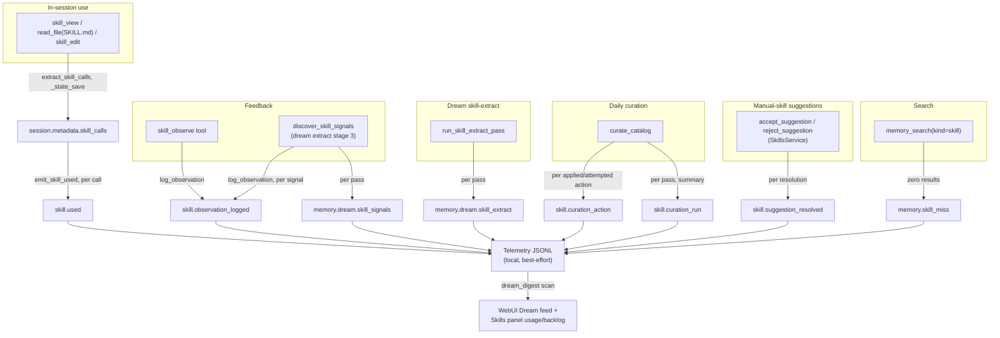

# Skills — telemetry and effectiveness

## 1. Purpose

A skill can be authored, curated, and never used — or used constantly and
never corrected — and neither loop knows about the other unless something
measures it. This document describes the telemetry that closes that gap: five
`skill.*` events that instrument the loop end to end (used → observed →
curated → suggested), plus three pre-existing `memory.dream.*` /
`memory.skill_miss` events that were already tracking the skill-related parts
of Dream and search. Together they answer three questions an operator or a
future curation change needs answered empirically, not by inference:

- **Are skills used?** — which skills the agent actually loads, how often, how
  recently.
- **Is feedback flowing?** — is the observation queue receiving corrections
  and gaps, or sitting empty because nothing is being logged.
- **What did curation do?** — on a given run, what was reviewed, what was
  applied, what was deferred, and how the user resolved any suggestions.

## 2. Mental model

**Telemetry is a byproduct, never a dependency.** Every emit call in the
skills subsystem is wrapped in a best-effort try/except — a telemetry
failure must never break an observation write, a curation action, or a skill
mutation. This mirrors the convention already established for Dream's
`memory.dream.*` events (see `../memory/05_dream_cold_path.md` §4).

**Five events, four loop stages.** `skill.used` marks the *use* signal (a
skill was loaded or edited during a turn). `skill.observation_logged` marks
the *feedback* signal (something was noted for later review). `skill.
curation_action` and `skill.curation_run` mark the *judgment* signal (what the
daily judge did, item-by-item and in aggregate). `skill.suggestion_resolved`
closes the loop for manual skills specifically — it records what the *user*
decided about a suggestion the judge could not apply unilaterally.

**The three pre-existing events cover what the five don't.**
`memory.dream.skill_extract` and `memory.dream.skill_signals` instrument the
two dream-side production stages — new skills authored, and observations
logged in hindsight — that predate this event set and already fed the webui
Dream digest. `memory.skill_miss` instruments retrieval failure — a
`memory_search(kind=skill)` query that found nothing — which is a different
kind of signal from the other eight: absence of a match, not a completed
action.

## 3. Diagram

## 4. How it works

### `skill.used` — the use signal

Emitted once per entry returned by `extract_skill_calls`
(`durin/agent/skill_usage.py`), right after `AgentLoop._state_save` records
those entries into `session.metadata["skill_calls"]`. A "call" is one of three
things the agent did to a skill during a turn:

- `view` — the `skill_view` tool loaded the skill.
- `read` — a raw `read_file` targeted a `skills/<name>/SKILL.md` path (the
  fallback path when the agent reads a skill file directly instead of using
  `skill_view`).
- `edit` — `skill_edit` modified the skill.

Each event payload is the call dict itself: `{skill, op, turn}`, optionally
carrying `iteration` and `session_key`. Because this fires per call rather than
per turn, a turn that views two skills and edits one emits three separate
`skill.used` events. `emit_skill_used` is best-effort and a no-op on an empty
call list.

### `skill.observation_logged` — the feedback signal

Emitted from `log_observation` (`durin/agent/skill_observations.py`) every
time an observation is appended **or** an existing OPEN record is bumped by
dedup. The payload — `{skill, kind, dedup_bumped, count}` — makes the two
cases distinguishable: `dedup_bumped=False, count=1` is a brand-new
observation; `dedup_bumped=True, count=N` is the Nth time the same issue (by
the paraphrase-tolerant `_same_issue` match) has recurred for that skill. A
dashboard tracking this event over time can see whether observation volume for
a skill is growing (a real, recurring problem) or was a one-off that never
repeated.

This event fires from both sources that write to the queue: the in-session
`skill_observe` tool and the hindsight `discover_skill_signals` dream pass —
the event itself doesn't distinguish which source logged it (the accompanying
`memory.dream.skill_signals` event, below, is what isolates the hindsight
volume specifically).

### `skill.curation_action` — one applied (or attempted) action

Emitted once per action `curate_catalog` (`durin/agent/skill_curation.py`)
processes, including the deterministic frontmatter backfill that runs before
the LLM judge is invoked. The `action` field takes one of: `backfill`,
`evolve`, `restructure`, `fuse`, `retire`, `principle`, `retire_principle`.
`applied` is a boolean — a judge-proposed action that fails validation (an
out-of-scope skill name, a fuse with a manual source, a principle proposal
past the cap) is still emitted with `applied=false`, so the event stream
captures judge proposals that didn't stick, not only successful mutations.
`skill` names the target when the action has one (absent for a bare `principle`
add).

### Judge parse failures — `memory.dream.parse_failure` with `stage=curation|suggestions`

When the curation judge's raw output cannot be parsed at all (unloadable JSON
or wrong top-level type — a degraded provider, prose instead of the action
object), the pass emits the shared `memory.dream.parse_failure` event with
`stage=curation` (auto path) or `stage=suggestions` (manual path) and stops
without stamping: the reviewed skills keep their stale curation marker and the
suggestion cursor does not advance, so the same delta re-enters the next run
instead of the review being silently consumed as a no-op. A valid response with
empty `actions` is a completed review and stamps normally. The event surfaces
in the webui Dream feed as a `warning` item via the shared digest mapping, and
the run's summary carries `judge_parse_failed: true`.

### `skill.curation_run` — the pass summary

Emitted once per `curate_catalog` invocation, whether or not the delta was
empty. `{reviewed, applied, deferred, backfilled}`: `reviewed` is the size of
the selected (budget-capped) delta, `applied` counts the actions from
`skill.curation_action` that succeeded, `deferred` is how much of the delta
exceeded `skill_curation.DEFAULT_BUDGET` and rolled to a later run — a
`deferred > 0` reading is the visible sign that curation throughput is behind
the rate skills are changing — and `backfilled` is how many skills got a
deterministic frontmatter repair this run. An empty-delta run still emits with
all-zero counts, so a dashboard reading this event can distinguish "curation
ran and found nothing to do" from "curation didn't run at all."

### `skill.suggestion_resolved` — user resolution of a manual-skill suggestion

Emitted from `SkillsService.accept_suggestion` / `.reject_suggestion`
(`durin/service/skills.py`) — the webui Bandeja actions for a
`suggest_manual_skills`-produced suggestion (see
`02_lifecycle_and_curation.md` §4). `{skill, action, resolution}`: `action` is
the suggestion's original type (`evolve` / `retire`), and `resolution` is
`"accepted"` or `"rejected"`. This is the only skill-loop event whose actor is
the **user**, not the dream — it measures how often the judge's manual-skill
proposals actually match what the user wants, which `skill.curation_action`
cannot answer for `auto` skills (those get applied without a human gate).

### Pre-existing events this document also covers

**`memory.dream.skill_extract`** (`durin/telemetry/schema.py`:
`MemoryDreamSkillExtractEvent`) is emitted once per
`run_skill_extract_pass` invocation with `{skills_touched, duration_ms}`.
`skills_touched` counts `skill_write` tool calls the sub-agent made — the
production-side counterpart to the five loop events above, answering "how
many new skills did the dream author this run." The webui Dream digest
(`durin/memory/dream_digest.py::map_dream_event`) surfaces this only when
`skills_touched > 0`, since the pass runs on every dream cycle and a
zero-result run is not feed-worthy noise.

**`memory.dream.skill_signals`** (`MemoryDreamSkillSignalsEvent`) is emitted
once per `discover_skill_signals` call with `{proposed, logged, skills}`:
`proposed` is what the LLM returned before parsing/dedup, `logged` is what
`log_observation` actually wrote (a difference between the two indicates
parse failures or a signal below the log threshold). This is the aggregate
counterpart to the per-observation `skill.observation_logged` events the same
call produces — `skill.observation_logged` tells you *which* skill and
whether it was a dedup bump; `memory.dream.skill_signals` tells you the
hindsight pass's overall proposal-to-logged yield for one session.

**`memory.skill_miss`** (`MemorySkillMissEvent`,
`durin/telemetry/schema.py`) is emitted whenever a `kinds="skill"`
`memory_search` call returns zero results, with `{query, result_count,
had_skill_candidate}`. `had_skill_candidate=true` distinguishes a real silent
miss — skills exist on disk but the search surfaced none of them, worth
investigating as a ranking or indexing problem — from the expected case of an
empty catalog. This is a retrieval-health signal, not a loop-production
signal; see `../memory/03_search_pipeline.md` and
`../memory/07_telemetry_and_observability.md` for the broader search
telemetry it belongs to.

### From telemetry to webui

All eight events are best-effort JSONL writes via `emit_tool_event`
(`durin/agent/tools/_telemetry.py`), read back by whichever surface needs
them — there is no separate skills-specific telemetry sink.

- The **Dream digest** (`GET /api/v1/memory/dream/digest`,
  `MemoryService.dream_digest` in `durin/service/memory.py`) scans the local
  telemetry JSONL for `memory.dream.*` types and maps them through
  `dream_digest.map_dream_event` into feed items; `memory.dream.skill_extract`
  becomes a `"created"` item ("Created N new skill(s) from session patterns")
  and `memory.dream.skill_signals` becomes an `"improved"` item, each
  deep-linking to the named skill when a specific one is identified. This is
  the same digest DreamView renders for entity merges and discoveries — see
  `../memory/05_dream_cold_path.md` §6 for the full Resumen/Bandeja layout.
- The **Skills panel** (`SkillsView.tsx`) reads `use_count`, `last_used_ms`,
  and `open_observations` per skill from `GET /api/v1/skills`, enriched
  server-side by `_enrich_usage`
  (`durin/service/skills.py`) via `skill_usage.collect_usage_and_last_used` —
  a single glob-and-read pass over `sessions/*.meta.json` within a 30-day
  (720-hour) window, summing each skill's `view`+`read`+`edit` op counts for
  `use_count` and tracking the newest matching sidecar mtime for
  `last_used_ms`. `open_observations` is a separate count of OPEN records
  whose `skill` field names that skill exactly (`new:*`/`all` records are not
  attributed to any installed skill). These read-model fields are *derived
  from* the skill-call and observation data the `skill.*` events also
  describe, not from the events themselves — the panel reads current sidecar
  state rather than replaying the telemetry stream. Behind the count badge,
  the skill detail pane lists the OPEN records themselves (issue, proposed
  improvement, recurrence) from `GET /api/v1/skills/observations?skill=<name>`
  and offers manual resolution via
  `POST /api/v1/skills/observations/{id}/resolve` — `applied` marks the issue
  handled, `declined` keeps the record as the curation judge's memory against
  re-proposing it.
- **`last_used_ms` is a disclosed approximation.** Session sidecars carry only
  an aggregated `derived.skill_calls` list, not a per-call timestamp, so the
  sidecar file's own mtime is the closest available signal for "when was this
  skill last touched." The webui surfaces this honestly: the "last used" label
  carries a tooltip (`skills.lastUsedApprox`) rather than presenting the value
  as an exact timestamp.
- **`skill.curation_action`** *does* have a dedicated reader: it is a member of
  `dream_digest.DREAM_ACTIVITY_TYPES`, and `map_dream_event` turns each
  *applied* action into a Dream-feed item — `kind: "retired"` for a `retire`,
  `kind: "improved"` for every other verb — deep-linked to the named skill and
  surfaced through the same `GET /api/v1/memory/dream/digest` path as the
  `memory.dream.*` events above. The other `skill.*` events —
  `skill.used`, `skill.observation_logged`, `skill.curation_run`,
  `skill.suggestion_resolved`, and `skill.observation_resolved` — have no
  dedicated webui reader as of this writing; they exist as a queryable telemetry stream (local JSONL) for offline
  analysis of the loop's effectiveness, the same as many `memory.*` events that
  predate any webui surface for them.

## 5. Key types & entry points

| Symbol | File | Role |
|---|---|---|
| `SkillUsedEvent` | `durin/telemetry/schema.py` | `{skill, op, turn, iteration?, session_key?}` — one skill touch. |
| `SkillObservationLoggedEvent` | `durin/telemetry/schema.py` | `{skill, kind, dedup_bumped, count}` — one observation append or dedup bump. |
| `SkillCurationActionEvent` | `durin/telemetry/schema.py` | `{action, skill?, applied}` — one curation action attempt. |
| `SkillCurationRunEvent` | `durin/telemetry/schema.py` | `{reviewed, applied, deferred, backfilled?}` — one curation pass summary. |
| `SkillSuggestionResolvedEvent` | `durin/telemetry/schema.py` | `{skill, action, resolution}` — user's accept/reject of a manual-skill suggestion. |
| `SkillObservationResolvedEvent` | `durin/telemetry/schema.py` | `{skill, kind, disposition}` — user's manual resolve/dismiss of an open observation. |
| `MemoryDreamSkillExtractEvent` | `durin/telemetry/schema.py` | `{skills_touched, duration_ms?}` — pre-existing; one skill-extract pass summary. |
| `MemoryDreamSkillSignalsEvent` | `durin/telemetry/schema.py` | `{proposed, logged, skills?}` — pre-existing; one hindsight-pass summary. |
| `MemorySkillMissEvent` | `durin/telemetry/schema.py` | `{query, result_count, had_skill_candidate, iteration?, session_key?}` — pre-existing; a zero-result skill search. |
| `emit_skill_used` | `durin/agent/skill_usage.py` | Emits `skill.used` per call in a turn's `skill_calls`. |
| `collect_usage_and_last_used` | `durin/agent/skill_usage.py` | Single-pass sidecar scan producing per-skill op counts and last-touched mtime; backs the webui usage line. |
| `log_observation` | `durin/agent/skill_observations.py` | Emits `skill.observation_logged`; the single write path for the observation queue. |
| `curate_catalog` | `durin/agent/skill_curation.py` | Emits `skill.curation_action` per action and `skill.curation_run` once per pass. |
| `_enrich_usage` | `durin/service/skills.py` | Server-side join of usage + observation counts onto the `GET /api/v1/skills` payload. |
| `SkillsService.accept_suggestion` / `.reject_suggestion` | `durin/service/skills.py` | Emit `skill.suggestion_resolved` on user resolution of a Bandeja suggestion. |
| `resolve_observation` | `durin/agent/skill_observations.py` | Emits `skill.observation_resolved` on the user's manual resolution of an observation. |
| `discover_skill_signals` | `durin/agent/skill_signals.py` | Emits `memory.dream.skill_signals`; also drives `skill.observation_logged` via `log_observation`. |
| `run_skill_extract_pass` | `durin/memory/dream_passes.py` | Emits `memory.dream.skill_extract`. |
| `map_dream_event` | `durin/memory/dream_digest.py` | Maps `memory.dream.skill_extract` / `.skill_signals` (and other Dream events) into webui feed items. |

## 6. Configuration & surfaces

Telemetry emission for these events is unconditional wherever the underlying
action occurs — there is no separate on/off switch for the `skill.*` events
themselves. What gates whether the *producing* action happens at all is
documented in `02_lifecycle_and_curation.md` §6
(`memory.dream.skill_signals_enabled`, `memory.dream.skill_suggestions_enabled`,
`skill_curation.DEFAULT_BUDGET`).

- **Local JSONL sink** — every event goes through the same
  `emit_tool_event` best-effort writer used across durin's telemetry surface;
  see `../memory/07_telemetry_and_observability.md` for the sink's file
  location and rotation behavior, which is not skills-specific.
- **`GET /api/v1/skills`** (`SkillsService.list`, `durin/service/skills.py`) —
  returns each skill's inventory row enriched with `use_count`,
  `last_used_ms`, and `open_observations`. Run off the event loop
  (`asyncio.to_thread`) because both the catalog scan and the sidecar glob are
  blocking filesystem work.
- **`GET /api/v1/memory/dream/digest`** (`MemoryService.dream_digest`,
  `durin/service/memory.py`) — includes `memory.dream.skill_extract` /
  `.skill_signals` activity in the same feed as entity merges and discoveries;
  see `../memory/05_dream_cold_path.md` §6 for the full digest and live
  websocket (`dream_progress`) behavior shared across all Dream passes.

## 7. Curated rationale

**Why per-item events in addition to per-run summaries.** `skill.
curation_action` and `skill.used` fire once per item rather than being folded
into a single per-run aggregate, because the interesting question is usually
*which* skill — which one keeps generating corrections, which one nobody
loads, which one the judge keeps trying to evolve. A per-run count alone
cannot answer "which skill" without re-deriving it from raw session data;
emitting the per-item event once is cheaper than reconstructing it later.

**Why `applied=false` actions are still emitted.** A judge proposal that fails
validation (wrong scope, manual fuse source, principle cap) is still useful
signal — it can mean the judge is drifting from the actual delta it was shown,
or that a cap needs raising. Silently dropping failed proposals from the event
stream would make that drift invisible.

**Why `last_used_ms` is disclosed as approximate rather than hidden or made
exact.** The alternative to an honest approximation is either adding a new
per-call timestamp write path (cost: an extra write on every skill touch, for
a UI-only benefit) or hiding the signal (cost: the user loses "roughly how
recently was this used," which is useful even imprecise). Disclosing the
approximation in the UI lets the value stay useful without overstating its
precision.

**Why `skill.suggestion_resolved` exists separately from `skill.
curation_action`.** `curation_action` measures what the *judge* decided to
apply to `auto` skills, unilaterally. `suggestion_resolved` measures what the
*user* decided about a manual-skill proposal the judge could not apply on its
own. Conflating the two would erase the distinction the whole suggestion path
exists to preserve — judge autonomy over `auto` skills, human gate over
`manual` ones — from the telemetry that measures it.

For the underlying observation queue, curation delta, and suggestion lifecycle
these events instrument, see `02_lifecycle_and_curation.md`. For the general
telemetry event-catalog conventions (naming, best-effort emission, schema
registration), see `../memory/07_telemetry_and_observability.md`.
