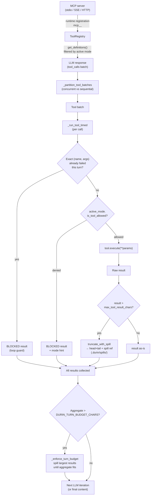

# Tools subsystem

> How durin exposes a curated native tool surface to the model, executes tool
> batches, enforces output budgets, and bridges MCP servers.

---

## 1. Purpose

The tools subsystem is the interface between the LLM and every side-effecting
capability durin offers: reading and writing files, running shell commands,
searching the web, querying memory, scheduling cron jobs, spawning sub-agents,
running user-defined workflows (see [workflow.md](workflow.md)), and more. It provides:

- **A single catalog** (`ToolRegistry`) that holds both built-in tools and
  dynamically registered MCP-backed tools, with stable LLM-facing schemas.
- **A permission gate** (`AgentMode`) that restricts which tools are visible to
  and callable by the model based on the active session mode — without any
  special-cased logic in the runner loop.
- **Result governance** — two complementary mechanisms that prevent tool outputs
  from overflowing the model's context window: per-tool spill-to-disk for large
  single results, and a per-turn aggregate budget that retroactively spills the
  largest results when the total exceeds the configured limit.

---

## 2. Mental model

**1. The registry as a unified catalog.**
`ToolRegistry` is the single source of truth for everything the model can call.
Built-in tools are registered at startup by `ToolLoader`, which scans the
`durin/agent/tools/` package and instantiates every concrete `Tool` subclass
whose `enabled()` class method returns `True` for the current config. MCP tools
are registered later — after server connections are established — under the
`mcp_<server>_<tool>` naming convention. The registry caches the LLM-facing
definition list (`get_definitions()`) between changes, splitting built-in and MCP
schemas into a stable sorted prefix + suffix so identical requests benefit from
prompt caching.

**2. Mode-as-data permission filtering.**
`AgentMode` is a pure data object: a name, a description, a frozenset of allowed
tool names, an optional frozenset of denied names, and a prompt suffix. There is no conditional code in
the runner that says "in plan mode, skip edits." Instead, `_active_tool_definitions()`
filters the definition list to what the active mode allows before each LLM call,
so the model never sees disallowed schemas. At execution time, `_run_tool()` applies
a second check so that a model using a cached schema from a previous mode gets a
`BLOCKED` synthetic result rather than a real execution — not a model error or a
silent no-op.

**3. Result governance — per-tool spill and per-turn budget.**
Two independent mechanisms protect context:
- **Per-tool spill (live):** when a single tool result exceeds `max_tool_result_chars`,
  `truncate_with_spill()` writes the full content to `<workspace>/.durin/spills/`
  and returns a head+tail rendering that references the spill path. The model can
  recover any omitted section with `read_file`.
- **Per-turn aggregate budget (retroactive):** after all tool results for a turn
  are collected, if their combined size exceeds `DURIN_TURN_BUDGET_CHARS`
  (default 200 000 chars), `_enforce_turn_budget()` spills the largest not-yet-spilled
  results to disk in size order until the aggregate fits.

---

## 3. Diagram

---

## 4. How it works

### Tool discovery and registration

At startup, `ToolLoader.load()` scans `durin/agent/tools/` with `pkgutil.iter_modules`,
importing each module and collecting concrete `Tool` subclasses. Modules listed in
`_SKIP_MODULES` (`base`, `schema`, `registry`, `context`, `loader`, `config`,
`file_state`, `sandbox`, `mcp`, `__init__`, `runtime_state`) are skipped because
they export infrastructure, not tools. For each discovered class:

1. The class's `_scopes` set is checked against the requested scope (`core` for
   the main agent, `subagent` for spawned workers).
2. `tool_cls.enabled(ctx)` is called with the `ToolContext`, which carries the
   resolved config, workspace path, and provider handle.
3. `tool_cls.create(ctx)` instantiates the tool with config-derived parameters
   (timeout, sandbox mode, API keys, etc.).
4. The instance is handed to `ToolRegistry.register()`.

External tools can be registered via `entry_points(group="durin.tools")` in a
package's `pyproject.toml`; the loader discovers these after built-ins.

MCP tools are registered separately via `durin/agent/tools/mcp.py` after server
connections are established. Each remote tool becomes a native `Tool` instance
named `mcp_<server>_<tool>`, callable directly. When the aggregate MCP schema
size exceeds `tools.mcp_deferral.threshold_tokens`, `maybe_defer_mcp_tools()`
sets `_llm_visible = False` on every MCP tool and injects two bridge tools —
`mcp_find_tools` and `mcp_invoke` — so the model can discover and call deferred
tools without paying for all their schemas up front.

### The registry cache and definition ordering

`ToolRegistry.get_definitions()` returns a cached list of `to_schema()` dicts for
every tool whose `llm_visible` property is `True`. Built-in schemas (names not
starting with `mcp_`) appear first, sorted alphabetically; MCP schemas follow,
also sorted. The cache is invalidated on every `register()` or `unregister()` call.
This stable ordering helps providers that support prompt caching recognize identical
tool arrays across turns.

### Per-iteration dispatch

Each iteration begins with `_active_tool_definitions(spec)`, which calls
`spec.mode_provider()` to obtain the current `AgentMode` and filters the cached
definitions to only those allowed by the mode. The filtered list is what the LLM
actually sees. When `mode_provider` is `None` or the mode has no restrictions
(the default `BUILD_MODE`), the unfiltered cache is returned directly.

After the LLM responds with tool calls, `_execute_tools()` partitions them into
batches. Tools whose `concurrency_safe` property is `True` may run in parallel
(`asyncio.gather`); tools marked `exclusive` (like `exec`) run alone. Both the
main loop's operating floor (see [loop.md](loop.md)) and the subagent system
prompt instruct the model to emit independent tool calls together in a single
turn — that is what produces the multi-call batches this partitioning
parallelizes. Both run specs set `concurrent_tools=True`.

MCP tools opt into the parallel batch via the spec's `readOnlyHint` tool
annotation: a server that declares a tool read-only marks the wrapper
`read_only=True`; absent or false, the wrapper runs alone (the safe default for
tools that may mutate remote state).

Each turn that issues ≥1 tool call emits a `tools.parallelism` telemetry event
(`_emit_parallelism_telemetry`) recording the batch shape so the actual
parallelisation rate is measured, not assumed. It counts all three forms of
parallelism: harness batching (`max_batch_size` > 1), intra-tool list fan-out
(`fanout_calls`/`fanout_items`, via each tool's `fanout_size()`), and background
launches (`background_launches`, tools whose `launches_background` is true, like
`spawn`). `parallelized` is true if any of them occurred.

**Structural fan-out (list parameters).** Beyond harness-level parallelism, some
read-only tools accept a list and fan out internally with `asyncio.gather`,
turning N independent calls into one guaranteed-parallel call regardless of
whether the model batched: `memory_drill` (`uris`), `web_fetch` (`urls`),
`web_search` (`queries`), `read_file` (`paths`), and `memory_search` (vector +
FTS + grep in one call). Each takes the single form OR the list form (not both),
caps the list, and returns one record per item in order with a per-item `error`
field so one failure does not abort the batch.

For each tool call, `_run_tool()` applies checks in this order:

1. **Loop-detection guard:** if the same `(name, arguments)` hash appeared as a
   failed call earlier this turn (tracked in `seen_failed_calls`), return a
   `BLOCKED` synthetic result immediately, avoiding a doomed re-execution.
2. **Mode gate:** if `active_mode.is_tool_allowed(tool_call.name)` returns
   `False`, return an informative `BLOCKED` result explaining the mode restriction.
   This fires only when the model uses a cached schema after a mode switch.
3. **Preparation:** `ToolRegistry.prepare_call()` resolves the tool, casts
   parameter types via `tool.cast_params()` (e.g., `"60"` → `60` for integer
   fields), and validates against the JSON Schema. A validation error returns an
   error string without executing the tool.
4. **Execution:** `tool.execute(**params)` runs the tool. Exceptions and
   `"Error: ..."` return values are both recorded in `seen_failed_calls` so
   identical retries are short-circuited.

### Message-history sanitization

Before each LLM call, the runner sanitizes the message history to satisfy provider
role-alternation requirements:

- `_drop_orphan_tool_results()` removes any `role: tool` message whose
  `tool_call_id` does not match a declared `tool_use` block in an earlier
  assistant message. These can appear when a `context_transform` hook prunes
  the history.
- `_backfill_missing_tool_results()` inserts a synthetic error message for any
  assistant `tool_use` block that has no corresponding `role: tool` reply.

Both passes also run after the `context_transform` hook to repair any new
mismatches it introduces.

### Spill mechanics

`truncate_with_spill()` in `durin/agent/tools/output_spill.py` is the per-tool
overflow path. When output exceeds `max_chars`:

1. If a `redact` callback is provided (always the case for `exec`), secrets are
   scrubbed from the full content before anything is written to disk.
2. The full (redacted) content is written atomically to
   `<workspace>/.durin/spills/<tool>_<timestamp>_<hash>.txt`.
3. The rendered result keeps `head_ratio` (default 70%) of the budget as the
   head, the remainder as the tail, and inserts a footer with the spill path and
   a `read_file(path=...)` recovery hint.

If the spill write fails (unwritable temp dir), the tool falls back to plain
head+tail truncation with an error note — the tool call never fails because of a
spill failure.

`ExecTool` uses `truncate_with_spill` directly inside its `execute()` method (cap
of 10 000 chars) and emits a `tool.exec.spill` telemetry event when truncation
occurs. The runner also applies `maybe_persist_tool_result()` in
`_normalize_tool_result()` for the general case.

### Turn-budget enforcement

After all tool results for a turn are collected, `_enforce_turn_budget()` sums
their sizes. If the total exceeds `DURIN_TURN_BUDGET_CHARS`, it sorts the
not-yet-persisted results by size (largest first) and spills each one via
`maybe_persist_tool_result()` until the aggregate is back under budget. The
mutation is in-place on the `completed_tool_results` list (which is the same list
already appended to `messages`), so the persisted references enter the conversation
history automatically. A `turn_budget.enforced` telemetry event is emitted once
when budget enforcement fires.

### Secret redaction

`_normalize_tool_result()` calls `redact_secrets()` on every tool result before
it enters the model context. This strips any stored secret value whose `scope`
grants access to the tool that produced the result.

---

## 5. Key types and entry points

| Symbol | File | Role |
|---|---|---|
| `ToolRegistry` | `durin/agent/tools/registry.py` | Central catalog: `register`, `unregister`, `get`, `get_definitions`, `prepare_call`, `execute` |
| `Tool` | `durin/agent/tools/base.py` | Abstract base class; defines `name`, `description`, `parameters`, `execute`, `cast_params`, `validate_params`, `to_schema`, `llm_visible`, `read_only`, `exclusive`, `concurrency_safe` |
| `tool_parameters` | `durin/agent/tools/base.py` | Class decorator that attaches a JSON Schema to a `Tool` subclass without writing a `@property` |
| `ToolLoader` | `durin/agent/tools/loader.py` | Package scanner that discovers, filters, and registers all built-in `Tool` subclasses at startup; also discovers external plugins via `entry_points` |
| `ExecTool` | `durin/agent/tools/shell.py` | Shell command execution (`exec` tool); implements deny patterns, workspace boundary enforcement, sandbox wrapping, background process support, and per-output spill |
| `truncate_with_spill` | `durin/agent/tools/output_spill.py` | Overflow helper: writes full content to `.durin/spills/`, returns head+tail+spill-ref rendering |
| `emit_tool_event` | `durin/agent/tools/_telemetry.py` | Free function for structured telemetry from tool code; privacy-trims free-text fields; silently no-ops when no session logger is bound |
| `AgentMode` | `durin/agent/agent_mode.py` | Frozen dataclass holding `name`, `description`, `allowed` / `denied` frozensets, and `prompt_suffix`; `is_tool_allowed(name)` is the single permission check called by both the definition filter and the execution gate |
| `AgentRunner` | `durin/agent/runner.py` | Inner LLM/tool loop; owns `_execute_tools`, `_run_tool`, `_normalize_tool_result`, `_enforce_turn_budget`, `_drop_orphan_tool_results`, `_backfill_missing_tool_results`, and `_active_tool_definitions` |
| MCP tool wrappers | `durin/agent/tools/mcp.py` | Wraps each remote MCP tool as a native `Tool` instance registered as `mcp_<server>_<tool>`; see [mcp.md](mcp.md) for the full MCP integration |

---

## 6. Configuration and surfaces

### Config keys (`durin/config/schema.py` — `ToolsConfig`)

| Key | Type | Default | Effect |
|---|---|---|---|
| `tools.restrict_to_workspace` | `bool` | `false` | Prevents all file and shell tools from accessing paths outside the session workspace |
| `tools.exec.enable` | `bool` | `true` | Enables/disables the `exec` shell tool |
| `tools.exec.timeout` | `int` | `60` | Default subprocess timeout in seconds (max 600) |
| `tools.exec.sandbox` | `str` | `""` | Sandbox backend (`firejail`, `bubblewrap`, or empty for none) |
| `tools.exec.deny_patterns` | `list[str]` | (hardcoded set) | Regex patterns that block matching commands before execution |
| `tools.exec.allow_patterns` | `list[str]` | `[]` | Regex patterns that exempt matching commands from the deny list |
| `tools.exec.allowed_env_keys` | `list[str]` | `[]` | Extra env vars forwarded to subprocesses (beyond the minimal curated set) |
| `tools.my.enable` | `bool` | `true` | Enables/disables the `my` self-inspection tool |
| `tools.my.allow_set` | `bool` | `false` | When `true`, `my(action="set", ...)` can mutate config values at runtime |
| `tools.web.enable` | `bool` | `true` | Enables/disables both `web_search` and `web_fetch` |
| `tools.web.search.provider` | `str` | `"duckduckgo"` | Search provider (`brave`, `tavily`, `searxng`, `jina`, `kagi`, `olostep`, `duckduckgo`) |
| `tools.post_edit_check.enable` | `bool` | `true` | Runs configurable linters/formatters after each `edit_file` call |
| `tools.post_edit_check.checkers` | `dict[str, str]` | built-ins for `py` (ruff) and `json` (`json.tool`) | Map of file extension → shell command; `{file}` is substituted with the edited path. User entries merge over the built-ins. A checker whose binary is absent is skipped silently |
| `tools.post_edit_check.max_lines` | `int` | `20` | Maximum checker output lines returned to the model |
| `tools.code_execution.enable` | `bool` | `true` | Enables/disables the `execute_code` sandboxed Python tool (Unix only) |
| `tools.code_execution.timeout_s` | `int` | `300` | Maximum run time for a code execution in seconds |
| `tools.mcp_deferral.enabled` | `bool` | `true` | Activates MCP schema deferral when aggregate MCP token cost exceeds the threshold |
| `tools.mcp_deferral.threshold_tokens` | `int` | `20000` | Token threshold above which MCP tools are hidden behind `mcp_find_tools` / `mcp_invoke` |
| `tools.ssrf_whitelist` | `list[str]` | `[]` | CIDR ranges exempted from the SSRF block on `web_fetch` and `exec` (e.g. `["100.64.0.0/10"]` for Tailscale) |

### Environment variables

| Variable | Default | Effect |
|---|---|---|
| `DURIN_TURN_BUDGET_CHARS` | `200000` | Per-turn aggregate tool result budget; set to `0` to disable retroactive spill |

### CLI / TUI / webui surfaces

Tools are not configured directly through the CLI or webui — they take effect via
`durin config set tools.<key> <value>` or by editing `~/.durin/config.toml`. The
webui Settings panel surfaces the MCP server list (add, remove, toggle) which
controls which MCP tools are registered.

### Tool name catalog (grouped by purpose)

| Group | Tools |
|---|---|
| Filesystem | `read_file`, `write_file`, `edit_file`, `list_dir` |
| Search | `grep`, `repo_overview` |
| Shell | `exec`, `process` |
| Web | `web_search`, `web_fetch` |
| Memory | `memory_search`, `memory_store`, `memory_forget`, `memory_ingest`, `memory_drill`, `memory_upsert_entity` |
| Session & planning | `session_search`, `todo_write`, `enter_plan_mode`, `exit_plan_mode`, `note_decision` |
| Agent control | `ask_user_question`, `long_task`, `complete_goal`, `sleep`, `message` |
| Background work | `spawn`, `run_workflow`, `list_workflows`, `workflow_write`, `tasks` (list / status / stop, over sub-agents + workflow runs), `subagent_monitor`, `subagent_output` |
| Skills | `skills_list`, `skill_search`, `skill_import`, `skill_write`, `skill_edit`, `skill_audit`, `skill_observe`, `skill_acquire_seed`, `skill_install_deps` |
| MCP management | `mcp_manage`, `mcp_search` |
| Capability bridges | `interpret_image`, `interpret_audio`, `execute_code`, `notebook_edit` |
| Secrets | `list_secrets`, `request_secret` |
| Scheduling | `cron` |
| Self-inspection | `my` |

---

## 7. Curated rationale

**Why mode filtering rather than code-gating?**
Encoding "plan mode = no edits" as an `if` branch in the runner would require
every new mode to touch the loop logic. Treating modes as data (frozensets of
allowed/denied names) means a new mode is a few lines in `agent_mode.py` — no
runner changes. The double-check at execution time (definition filter at request
build time, mode gate at `_run_tool` time) closes the window where a model using
a cached schema from a previous mode might still execute a disallowed tool.

**Why two spill mechanisms?**
Per-tool spill (live, in `truncate_with_spill`) and per-turn budget enforcement
(retroactive, in `_enforce_turn_budget`) address different failure modes. A single
`exec` call that returns 5 MB of build output needs live truncation so the result
message itself never becomes huge. But when the LLM batches ten medium-sized tool
calls each returning 25 000 chars, no individual result triggers the per-tool cap
yet the aggregate (250 000 chars) overflows the context. The retroactive pass
catches that. The two mechanisms are independent and composable: a result that
was already spilled per-tool is marked as persisted and skipped by the aggregate
pass.

**Why deferred MCP tools?**
MCP servers are third-party and unbounded in number. Shipping every MCP tool
schema to the model on every request is wasteful when most tools are never called.
Below the threshold, all MCP schemas ship as before — a single small server does
not pay the discovery indirection. Above it, `mcp_find_tools` gives the model a
searchable catalog and `mcp_invoke` executes any deferred tool by name. Built-in
tools are never deferred because durin's curated surface (including `memory_search`)
must stay structurally visible to the model.

**Why stable sorted ordering in `get_definitions()`?**
Provider-side prompt caching (Anthropic, OpenAI) hashes the messages including the
`tools` array. An unstable order (e.g., insertion order) produces cache misses on
every MCP registration or tool toggle. Sorting built-ins alphabetically and MCP
tools alphabetically within their own suffix produces an ordering that is stable
across turns as long as the registered set does not change.
