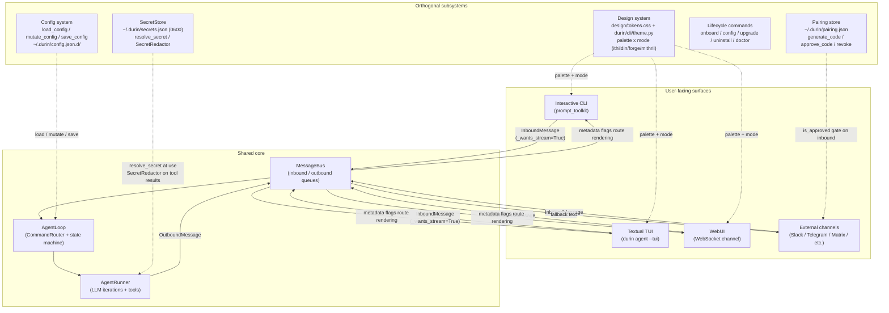

# UX subsystem — unified I/O layer

## 1 Purpose

The UX subsystem is the unified I/O layer that sits between humans and the
agent core. It covers:

- **Three interactive surfaces** (CLI, TUI, WebUI) plus **broadcast channels**
  (Slack, Telegram, Matrix, WhatsApp, and others) that all funnel input into
  the same `MessageBus` and receive output from it.
- **Config and secrets**: the split-file config layout under
  `~/.durin/config.json.d/` and the separate secret store at
  `~/.durin/secrets.json` (plaintext, mode 0600), each accessed through
  atomic primitives to prevent concurrent-process corruption.
- **Design system**: the token-driven palette that keeps CLI, TUI, and WebUI
  visually consistent.
- **Lifecycle commands**: the operator-facing tools for onboarding, configuring,
  upgrading, and uninstalling durin.

## 2 Mental model

**Three interactive surfaces + channels, one bus.** Every surface — interactive
CLI, Textual TUI, WebUI over WebSocket, and external channels like Slack or
Telegram — publishes `InboundMessage` objects into the `MessageBus` and
consumes `OutboundMessage` objects from it. `AgentLoop` and `AgentRunner`
process messages without any awareness of which surface sent them. Agent
behavior is uniform; only rendering differs.

**Config and secrets are separate concerns.** Config is a split-file layout
on disk (`~/.durin/config.json.d/*.json`), validated and loaded through
`load_config`, written through `save_config` / `mutate_config` under a
cross-process lock. Secrets live in a distinct plaintext-0600 file
(`~/.durin/secrets.json`), never in the config tree, and are resolved lazily
at the point of use via `resolve_secret`. Both stores use atomic write
primitives to prevent partial reads on concurrent access.

**Design tokens and lifecycle commands are orthogonal to the agent.** The
two-axis token system (palette × mode) governs the visual surfaces but has no
effect on agent behavior. Lifecycle commands (`durin onboard`, `durin config`,
`durin upgrade`, etc.) operate on the installation state, not on live sessions.

## 3 Diagram

## 4 How it works

### Input pipeline

User input at any surface is sanitized and published as an `InboundMessage`:

1. **Surrogate sanitization** (CLI/TUI on Windows): lone surrogate code points
   from console input are repaired or replaced by `_sanitize_surrogates` before
   anything else sees the text.
2. **Drag-and-drop pre-processing** (CLI/TUI): `durin/cli/dragdrop.py` scans
   the input for absolute file paths. Image and audio files (`.png`, `.jpg`,
   `.gif`, `.webp`, `.bmp`, `.svg`, `.mp3`, `.wav`, `.m4a`, `.flac`, `.ogg`,
   `.opus`) are copied to `<workspace>/.media/<sha>.<ext>` (idempotent by
   content hash) and surfaced via `InboundMessage.media`. Document paths (text,
   Markdown, PDF) are left in the text so the agent's `read_file` tool can
   resolve them directly. Dragged audio may be transcribed to text before the
   message is published; on success the audio path is dropped from `media`.
3. **Bus publish**: the CLI and TUI set `metadata={"_wants_stream": True}` so
   the loop wires up streaming callbacks for that turn.

### Command routing

`AgentLoop` calls `CommandRouter.is_priority` first. Priority commands (`/stop`,
`/restart`, `/status`) are dispatched outside the session lock — they can
interrupt an active turn. All other slash commands match exact or longest-prefix
tiers inside the lock; non-commands enter the agent path.

### Agent execution

`AgentRunner` iterates LLM calls and tool batches. During execution:

- **Streaming**: text delta chunks are published as `OutboundMessage` with
  `metadata["_stream_delta"] = True`; the final chunk carries `_stream_end`.
- **Tool events**: structured `tool_events` frames (start / end / result) flow
  to every subscriber; rich channels hoist certain tool payloads as first-class
  widgets.
- **Special interactive tools** (`ask_user_question`, `request_secret`,
  `exit_plan_mode`, `todo_write`) follow a payload-canonical contract: the tool
  *arguments* carry all display content; the tool *result* is model-directed
  bookkeeping. Rich channels (`RICH_PAYLOAD_CHANNELS = {"websocket", "cli"}`)
  render the structured payload directly (question panel with option chips,
  masked secret prompt, plan card, todo checklist). All other channels receive
  a serialized plain-text fallback at turn end from
  `AgentLoop._maybe_publish_interaction_fallback`.
- **Blocking ask_user**: when `agents.defaults.ask_user_blocking` is true
  (the default), `ask_user_question` awaits the user's next plain-text reply
  *inside the same turn* via the `durin/agent/pending_answers.py` future
  registry. The loop's inbound consumer resolves the future; the answer returns
  as the tool result and the model continues without a turn boundary. On answer
  timeout, media reply, absent loop consumer, or non-interactive session
  (`cron:`/`system:` prefixes), the tool degrades to yield semantics: it
  returns early and the next user message carries the answer.
- **Secret redaction**: `SecretRedactor` processes every tool result before it
  reaches the model or is spilled to disk. Two layers: value-based (exact stored
  secret values become `«redacted:NAME»`) and pattern-based (credential-shaped
  strings — vendor prefixes `sk-`/`ghp_`/`AKIA`, JWTs, PEM blocks,
  `KEY=value` fields — become `«redacted»`).

### Outbound routing

Metadata flags on `OutboundMessage` route behavior at each surface:

| Flag | Effect |
|---|---|
| `_stream_delta` | Append text to the active assistant bubble / stream buffer |
| `_stream_end` | Close / finalize the current streaming bubble |
| `_streamed` | End-of-turn marker; no visible side-effect |
| `_switch_chat_id` | In-place session switch; `run_interactive` / `DurinApp` updates `cli_chat_id` |
| `_pairing_code` | Channel-level pairing code delivery (external channels only) |
| `_progress` | Progress note; not rendered as a full message in WebSocket channel |
| `_turn_end` | Carries latency and goal-state; triggers WS `turn_end` frame |
| `render_as="text"` | Render as a plain system bubble instead of an assistant bubble |

### Work-visibility surfaces (WebUI)

Three surfaces make background work visible inside a chat without navigating
away from it.

**Goal banner.** A pinned strip at the top of the chat thread renders the
session's `goal_state` — the agent-maintained description of what it is trying
to accomplish for this turn. The banner is persistent: it stays visible while
the agent runs and is cleared when the turn ends with no active goal. It draws
from the `_turn_end` frame's `goal_state` field.

**Tasks tray.** A per-chat panel mirrors all background tasks associated with
the current session. It polls `GET /api/v1/tasks?session=<key>` every few
seconds and displays a live section (running tasks) and a finished fold
(completed, failed, or needs-input tasks). The list is durable across a page
reload or gateway restart: finished sub-agent sessions are reconstructed from
session lineage (`children_of`) and workflow results from run manifests, so the
tray reflects the full history of the chat's background work, not just what
happened since the last page load. **Task detail is shown inline** — sub-agent
and workflow results are surfaced directly in the thread; the tray does not open
a separate chat for the child session. Drilling into a child session as a new
chat was deliberately dropped in favour of keeping all context in one place.

**Inline live blocks.** Background tasks also appear as live blocks in the
message thread itself:

- A **sub-agent block** shows the sub-agent's announced goal and streams its
  status (`running` → result text) as frames arrive, then folds to a compact
  summary when the sub-agent completes.
- A **workflow block** shows the node list and advances each node's indicator
  (`running` → `done`/`failed`) as the engine emits per-node progress frames
  (see [workflow.md](workflow.md) §4g). Both block types are rendered from
  `tool_events` frames on the WebSocket channel and persist in the thread after
  the turn ends.

### Config flow

`load_config()` detects the layout (split directory or legacy monolith) and
returns a validated `Config`. On a legacy monolith it auto-migrates once:
splits per-topic files into `~/.durin/config.json.d/`, backs up the original
as `config.json.legacy`, and rewrites `config.json` as a one-line marker
`{"_layout": "split"}`. The section set is derived from the serialized config
(every non-default top-level key) so newly added sections are never silently
dropped.

`save_config()` writes only non-default fields (`exclude_defaults=True`) back
to the split directory. `mutate_config()` performs an atomic
load-modify-save under `cross_process_lock` so concurrent processes serialize.

### Secrets flow

`SecretStore` loads and persists `~/.durin/secrets.json` (mode 0600) under
`cross_process_lock`. Config consumers hold `${secret:NAME}` references;
`resolve_secret()` turns them into plaintext at the point of use — the value
never re-enters the `Config` object, logs, or telemetry. The `ExecTool`
injects execution-scoped secrets into subprocess environments via
`collect_for(consumer)` so scripts access credentials without the agent ever
seeing the values. After any in-process write the store is reloaded and the
redactor is rebuilt so the next tool result immediately picks up the new secret.

### Pairing flow

External channels gate unrecognized DM senders. When a new sender contacts a
channel, `BaseChannel._handle_message` checks `is_approved(channel, sender_id)`.
If the sender is not in `pairing.json` and there is no `allowFrom` match, the
channel generates a time-limited pairing code (`generate_code`, 10-minute TTL)
and sends it back as a formatted message. The account owner then issues one of
these commands to approve or manage access:

| Subcommand | Effect |
|---|---|
| `/pairing list` | Show pending codes with their expiry |
| `/pairing approve <code>` | Approve the sender; adds them to `pairing.json` |
| `/pairing deny <code>` | Discard a pending code without approving |
| `/pairing revoke <user_id>` | Remove an approved sender from the current channel |
| `/pairing revoke <channel> <user_id>` | Remove an approved sender from a specific channel |

These subcommands are handled by `handle_pairing_command` in `durin/pairing/store.py`.
The store uses a module-level `threading.Lock` plus `cross_process_lock` so
operations are safe from both async channel handlers and sync CLI contexts.

## 5 Key types and entry points

| Symbol | File | Role |
|---|---|---|
| `MessageBus` | `durin/bus/queue.py` | Two `asyncio.Queue`s (inbound / outbound); pure async decoupler between surfaces and agent |
| `InboundMessage` / `OutboundMessage` | `durin/bus/events.py` | Message envelope: `channel`, `chat_id`, `content`, `media`, `metadata` (routing flags); `InboundMessage.session_key` property derives the session key |
| `AgentLoop` | `durin/agent/loop.py` | Per-turn state machine and command dispatcher; polls `bus.inbound`, routes to `CommandRouter` or agent; publishes `bus.outbound` |
| `AgentRunner` | `durin/agent/runner.py` | LLM iteration core: tool batches, streaming, redaction, context governance |
| `CommandRouter` | `durin/command/router.py` | Three-tier dispatch (priority / exact / longest-prefix); `is_priority()` gates lock-free commands |
| `BuiltinCommandSpec` / `cmd_*` | `durin/command/builtin.py` | Slash-command metadata (`BUILTIN_COMMAND_SPECS` tuple) and async handlers for `/new`, `/stop`, `/restart`, `/status`, `/model`, `/effort`, `/history`, `/goal`, `/help`, `/plan`, `/build`, `/mode`, `/sessions`, `/resume`, `/compact`, `/copy`, `/name`, `/hotkeys`, `/memory`, `/skills`, `/remember`, `/forget`, `/sources`, `/audit`, `/why`, `/version` |
| `DurinApp` | `durin/cli/tui/app.py` | Textual TUI app; `on_mount` spawns `agent_loop.run()` and `_consume_outbound`; maps metadata flags to widget operations |
| `run_interactive` | `durin/cli/commands.py` | Interactive CLI loop: `PromptSession`, surrogate-sanitize, drag-drop pre-process, bus publish, `_consume_outbound` render |
| `Config` | `durin/config/schema.py` | Pydantic `BaseSettings` root: `agents`, `providers`, `channels`, `tools`, `memory`, `gateway`, `api`, `telemetry`, `appearance`, `model_presets`, `skills`, etc. |
| `load_config` / `save_config` / `mutate_config` | `durin/config/loader.py` | Config I/O: layout-transparent (split or legacy monolith); atomic cross-process write; auto-migration to split on first use |
| `SecretStore` | `durin/security/secrets.py` | Plaintext-0600 JSON store; `SecretEntry` fields: `value`, `service`, `account`, `description`, `scope`, `origin`, `created_at` (`name` is the map key, not a model field) |
| `resolve_secret` / `SecretRedactor` | `durin/security/secrets.py` | `resolve_secret()` dereferences `${secret:NAME}` at use; `SecretRedactor` applies value-based + pattern-based redaction on tool results |
| `handle_pairing_command` | `durin/pairing/store.py` | Pure function executing `/pairing` subcommands (list / approve / deny / revoke); `generate_code` / `approve_code` / `revoke` manage `~/.durin/pairing.json` under `threading.Lock` + `cross_process_lock` |
| `ask_user_question` / `request_secret` / `exit_plan_mode` / `todo_write` | `durin/agent/tools/ask_user.py`, `durin/agent/tools/secrets.py`, `durin/agent/tools/plan_mode.py`, `durin/agent/tools/todos.py` | Interactive tools; payload-canonical contract (arguments carry display content); rich channels render widgets, dumb channels get serialized fallback |
| `pending_answers` | `durin/agent/pending_answers.py` | Per-session `asyncio.Future` registry for blocking `ask_user_question`; `can_block()` gates in-turn blocking by checking consumer activity and session prefix |
| `RICH_PAYLOAD_CHANNELS` | `durin/agent/user_payloads.py` | Set of channel names that render structured tool payloads natively: `{"websocket", "cli"}` |
| `theme.py` / `tokens.css` | `durin/cli/theme.py` / `design/tokens.css` | Six Textual themes (ithildin/forge/mithril × light/dark) mirroring the CSS token values; a test pins the two together so they cannot drift |
| `process_dragged_paths` | `durin/cli/dragdrop.py` | Scans input for absolute file paths; copies media to `<workspace>/.media/<sha>.<ext>`; returns `(cleaned_text, media_list)` |

## 6 Configuration and surfaces

### Launch surfaces

| Surface | How to start |
|---|---|
| Interactive CLI | `durin agent` |
| Textual TUI | `durin agent --tui` |
| WebUI (gateway) | `durin gateway` — serves WebSocket channel + SPA on `gateway.host:gateway.port` |

### Key config keys

**Channels**

| Key | Default | Effect |
|---|---|---|
| `channels.send_progress` | `true` | Stream agent text progress to the channel |
| `channels.send_tool_hints` | `false` | Stream tool-call hint messages to the channel |
| `channels.show_reasoning` | `true` | Surface model reasoning when the channel implements it |
| `channels.send_max_retries` | `3` | Max outbound delivery attempts (initial send included) |
| `channels.transcription_provider` | `"groq"` | Voice transcription backend (`"groq"` or `"openai"`) |
| `channels.transcription_language` | `null` | Optional ISO-639-1 hint for audio transcription |

**Appearance**

| Key | Default | Effect |
|---|---|---|
| `appearance.palette` | `"ithildin"` | Color palette: `ithildin` / `forge` / `mithril` |
| `appearance.mode` | `"auto"` | Light/dark mode: `auto` (detects `COLORFGBG` or browser `prefers-color-scheme`) / `light` / `dark` |

**Agent interaction**

| Key | Default | Effect |
|---|---|---|
| `agents.defaults.ask_user_blocking` | `true` | Enable in-turn blocking ask_user (awaits answer inside the same turn without a turn boundary) |
| `agents.defaults.ask_user_answer_timeout_s` | `300` | Seconds before blocking ask_user falls back to yield semantics |

**Gateway**

| Key | Default | Effect |
|---|---|---|
| `gateway.host` | `"127.0.0.1"` | Bind address for the gateway server |
| `gateway.port` | `18790` | Port for the gateway server |
| `gateway.daemon` | `false` | Run gateway detached (PID file + log file) |
| `gateway.webui_enabled` | `true` | Auto-enable WebSocket channel so the embedded WebUI is served |

**Other**

| Key | Default | Effect |
|---|---|---|
| `model_presets` | `{}` | Named `ModelPresetConfig` entries; `/model <preset>` switches at runtime |
| `agents.defaults.unified_session` | `false` | Share one session across all channels |

### Filesystem paths

| Path | Contents |
|---|---|
| `~/.durin/config.json` | One-line marker `{"_layout": "split"}` after migration |
| `~/.durin/config.json.d/*.json` | Per-topic config files (one per non-default top-level section) |
| `~/.durin/config.json.legacy` | Backup of the pre-split monolith (written once, not updated) |
| `~/.durin/secrets.json` | Plaintext secret store, mode 0600 |
| `~/.durin/pairing.json` | Approved senders + pending pairing codes per channel |
| `<workspace>/.media/` | Workspace-local copies of dragged/dropped media files |

## 7 Curated rationale

**One bus for all surfaces.** Every surface routing through the same
`MessageBus` means a new channel (say, a Discord adapter) gets the full agent
behavior for free — slash-command routing, interactive tool payloads, streaming,
session management — without touching agent code. The only surface-specific work
is rendering.

**Payload-canonical interactive tools.** Encoding the display content in tool
*arguments* rather than having the model re-present it in prose creates a
reliable rendering contract. The channel sees the structured payload and renders
it as a native widget; the model never gets a chance to misstate the question or
reformat the plan. For channels that cannot render widgets, the serialized
fallback reproduces the same content from the stored session metadata rather
than re-asking the model.

**Config split-layout.** Keeping one JSON file per top-level section means a
diff to `channels.json` does not touch `providers.json`. The section set is
derived from the serialized config at write time so newly added top-level fields
are never silently dropped by a hardcoded list.

**Secrets isolated from config.** A `${secret:NAME}` reference in config is
inert on disk and inert in the `Config` object. The value only materializes at
the moment a provider or tool calls `resolve_secret()`, and it goes straight to
the consumer without touching any persisted path. This means accidentally
committing or sharing `config.json` leaks only a reference, not the credential.

**Pairing as a channel-level gate.** Unrecognized DMs never reach the agent.
`BaseChannel._handle_message` checks `is_approved` before publishing to the bus
and sends a pairing code reply instead of an error — so the channel appears
responsive to the new user and the owner can approve them at leisure.
