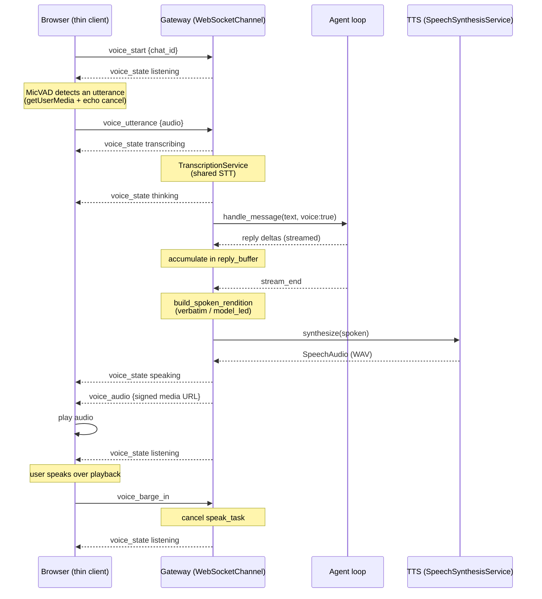

# Voice — Conversational Speech

## 1. Purpose

The voice subsystem lets a user talk to durin hands-free in the web dashboard: speak, durin transcribes, the agent answers, and durin speaks the reply back. It layers a real-time conversational loop on top of the existing speech-to-text (STT) transcription that channels already use, and adds text-to-speech (TTS) for the reply.

Two design choices shape everything else. **The gateway owns the conversation state**, not the browser — a `VoiceSession` per chat lives in the WebSocket channel, so the browser is a thin client that only captures the microphone and plays audio. And **what durin speaks is not what it displays**: a long answer full of code and tables is rendered to a short, speakable form for the voice while the full text stays on screen.

## 2. Mental model

**A voice session is a small state machine, one per chat.**
`voice_start` creates a `VoiceSession` keyed by `chat_id` inside the WebSocket channel's `_voice` map; `voice_stop` removes it. The session carries a `state` (`idle → listening → transcribing → thinking → speaking`), the in-flight TTS task (`speak_task`, so it can be cancelled for barge-in), and a `reply_buffer` that accumulates the streamed assistant reply. State transitions are pushed to the browser as `voice_state` events so the orb reflects them.

**The browser is a thin client; the gateway drives the loop.**
The browser captures the mic, runs voice-activity detection (VAD) to find utterance boundaries, and posts a complete audio clip as `voice_utterance`. Everything else — transcription, the agent turn, building the spoken reply, synthesis — happens in the gateway. The reply audio comes back as a signed media URL in a `voice_audio` event, which the browser plays. Because the gateway holds the state, a page reload or a transient socket drop reconnects to the same session without losing it: the session is torn down only after a grace window passes with no client re-subscribing.

**Spoken text is derived from displayed text, never equal to it.**
A deterministic `speakable_transform` is the always-on floor: code blocks, tables, images, and URLs are *described* ("the code is on screen") rather than read aloud. On top of that floor, a long reply gets a policy: `verbatim` reads the whole thing; `model_led` speaks only the opening and appends a pointer ("The full answer is on screen.") while the full text remains in the chat thread.

**Engines warm at gateway start, not on first use.**
The local STT and TTS engines each load a model the first time they run (and self-download it if absent). The channel manager warms both in the background as the gateway starts, so the first real utterance or spoken reply is instant instead of stalling on a one-time download. For an *enabled* subsystem whose extra isn't installed yet, the same warmup downloads the extra first (gated by `auto_install_extras`) rather than waiting for first use — enabling voice in config is enough to provision it.

## 3. Diagram

## 4. How it works

### Session lifecycle

`voice_start` validates the `chat_id` and emits `voice_state listening`. It is **idempotent**: if a session already exists for the `chat_id` it is reused, not replaced — so the reconnect self-heal (below) re-sending `voice_start` never discards an in-flight reply buffer or speak task. Only a missing session creates a fresh one. `voice_stop` pops the session, cancels any in-flight speak task, and emits `idle`. The session is held only in memory on the channel; it is not persisted, because it is transient interaction state, not conversation content (the transcript and replies persist through the normal session store like any other chat).

Three mechanisms keep the session honest across the unreliable parts — silence, and a flaky socket. An **idle timeout** (`voice.idle_timeout_s`, `0` = never) closes the session after that many seconds with no activity; the clock lives in `useVoiceSession` and resets on every state transition, so a turn in progress never trips it. On the gateway side, a disconnect does **not** tear the session down at once: `_cleanup_connection` schedules a deferred teardown (`_VOICE_GRACE_S`, ~30 s), and a client that re-subscribes to the chat within that window cancels it via `_attach`. This is what lets a wifi blip or a backgrounded tab survive instead of ending the call. As a second layer, the browser hook watches the connection status and re-sends `voice_start` on a reconnect (down → open) while voice is active; combined with the idempotent handler, that resumes audio on the same session without losing state even if the grace window had elapsed.

### Capturing speech

The browser hook (`useVoiceSession`) builds a `MicVAD` (Silero VAD via `@ricky0123/vad-web`, running in-browser on ONNX/WASM) over a `getUserMedia` stream opened with `echoCancellation`, `noiseSuppression`, and `autoGainControl` so durin's own playback does not feed back into the mic. The VAD's `positiveSpeechThreshold` comes from `voice.vad_threshold`; end-of-turn silence from `voice.end_of_turn_silence_ms`. When the VAD reports an utterance, the hook sends it as `voice_utterance` with the audio clip. The hook also exposes a live `amplitude` that drives the orb's audio-reactive animation.

The VAD model and ONNX-runtime WASM are several megabytes, fetched lazily the first time `MicVAD.new` runs — which made the first mic click stall. To hide that, `prefetchVoiceAssets` (`webui/src/lib/voiceAssets.ts`) warms the HTTP cache for those files during browser idle whenever conversational voice is **enabled** in config (gated on `voiceCfg.enabled`, not `available` — so the assets preload even before the TTS/STT extras finish installing), so the download is already done by the time the user opens a call. Building the VAD is wrapped in error handling: a denied mic permission or a failed model load tears down the half-built session (closing the `AudioContext`) and returns the orb to idle so the user can retry, rather than leaking contexts toward the browser's per-page cap.

### Transcription

`voice_utterance` requires an active session. The channel saves the audio, sets `voice_state transcribing`, and calls the shared `TranscriptionService.transcribe_and_cache` — the same backend STT that file/audio messages use (see [channels.md](channels.md) for how the service is built from `config.transcription` and injected). An empty transcript silently returns to `listening`. A non-empty transcript moves the session to `thinking` and is dispatched into the agent loop via `_handle_message` with `metadata={"voice": True}`, so downstream code can tell the turn originated from voice.

### Speaking the reply

The assistant reply reaches the WebSocket channel as a stream of deltas, not a single final message. Each delta is appended to the session's `reply_buffer`; on `stream_end`, `take_reply()` drains the buffer and the full text is handed to `_speak`. (A discrete, non-streamed final message hits the same `_speak` hook.) This streamed path is the one that makes a voice reply audible — speaking only on a discrete send would leave a streamed reply silent.

`_speak(chat_id, text, *, full=False)` no-ops unless a `speech_synthesis` service is present and the chat still has an active session. It emits `voice_state speaking`, builds the spoken rendition (or, when `full=True`, applies only the deterministic `speakable_transform`), synthesizes it to a WAV via the TTS service, writes the audio to the media directory and signs a short-lived URL, and sends a `voice_audio` event with that URL. The task is stored as `speak_task` so barge-in can cancel it. When it finishes (or is cancelled), the session returns to `listening`.

### Spoken rendition

`speakable_transform` (in `durin/voice/rendition.py`) is a pure, always-on pass that replaces non-speakable markdown with short descriptions: fenced code → "the code is on screen", tables → "a table", images/links → their alt text or "a link", and it strips headings, horizontal rules, emphasis markers, and list bullets. The descriptive phrases live in a `SpeakableLabels` dataclass so they can be localized.

`build_spoken_rendition` then applies the long-reply policy. A reply at or under `voice.spoken_render.long_threshold_words` is always spoken in full. Above that, `mode` decides: `verbatim` speaks the entire speakable text; `model_led` speaks the first paragraph and appends the `pointer` sentence, leaving the rest on screen. The result records whether it summarized and whether a usable lead was found, for telemetry. (An earlier `aux_summary` mode was never wired — it always degraded to `model_led` — so a config persisted with that value is coerced to `model_led` on load.)

### Barge-in, read-all, and preview

`voice_barge_in` cancels the in-flight `speak_task` and returns the session to `listening`, so the user can interrupt durin mid-sentence by speaking over it. `voice_read_all` synthesizes a given text in full (`_speak` with `full=True`) — the escape hatch for "read me the whole thing" regardless of the long-reply mode. `voice_preview` synthesizes a short sample with a chosen voice/language and returns it as `voice_preview_audio`; it powers the "test voice" button in settings and reports `tts_unavailable` when the `[tts]` extra is absent.

### Warmup at startup

`ChannelManager._warmup_speech` runs as a background task during `start_all`. For each of the transcription and speech services it warms the engine when the subsystem is `enabled`; cloud providers warm to a no-op. When an `enabled` local subsystem's extra is **not installed**, the manager downloads it first via `ensure_or_note` (gated by `config.install.auto_install_extras`, run off-thread because it shells out and pulls the model) instead of deferring the install to first use — so enabling voice in config is enough to make it ready after a restart. If that install is disabled or fails, warmup is skipped (the use-time install prompts still apply). Warming a local engine then builds it and downloads its model if absent. The warmup is deliberately background so the gateway serves the dashboard immediately rather than blocking on a download; the trade-off is a window on the first start after enabling where a voice request waits for the install/download to finish.

### TTS providers

`SpeechSynthesisService.from_config` builds a provider by string dispatch (mirroring the transcription service): `local` → `LocalSupertonicProvider` (on-CPU ONNX via the `supertonic` package, which self-downloads its model), `openai` → `OpenAISpeechProvider` (`/v1/audio/speech`). When `tts.fallback` names a different provider, both are wrapped in a `FallbackSpeechProvider` so a local failure can fall through to cloud. The provider is built lazily on first synth or warmup, and `synthesize` returns a `SpeechAudio` (a complete WAV plus its sample rate).

## 5. Key types and entry points

| Symbol | File | Role |
|---|---|---|
| `VoiceSession` | `durin/voice/session.py` | Per-chat voice state: `state`, `speak_task`, `reply_buffer`; `cancel_speak`, `take_reply` |
| `speakable_transform` | `durin/voice/rendition.py` | Always-on deterministic floor: describe non-speakable content instead of reading it |
| `build_spoken_rendition` | `durin/voice/rendition.py` | Long-reply policy: `verbatim` or `model_led` (short replies always verbatim) |
| `SpeakableLabels` | `durin/voice/rendition.py` | Localizable descriptive phrases injected into the transform |
| `SpeechSynthesisService` | `durin/service/speech.py` | Builds a TTS provider from `TtsConfig`, lazy build, `synthesize` + `warmup` |
| `SpeechSynthesisProvider` | `durin/providers/speech.py` | Structural TTS interface (`synthesize`, no-op `warmup`) |
| `LocalSupertonicProvider` | `durin/providers/speech.py` | On-CPU Supertonic ONNX; self-downloads its model |
| `OpenAISpeechProvider` | `durin/providers/speech.py` | Cloud TTS via OpenAI `/v1/audio/speech` |
| `FallbackSpeechProvider` | `durin/providers/speech.py` | Wraps a primary + fallback provider |
| `SpeechAudio` | `durin/providers/speech.py` | Synthesized WAV bytes + sample rate |
| `TranscriptionService` | `durin/service/transcription.py` | Shared backend STT, reused by the voice loop (see [channels.md](channels.md)) |
| `_dispatch_envelope` (voice cases) | `durin/channels/websocket.py` | Handles the `voice_*` protocol messages |
| `_speak` | `durin/channels/websocket.py` | Builds the spoken rendition, synthesizes, emits `voice_audio` |
| `_warmup_speech` | `durin/channels/manager.py` | Background warm of STT/TTS at gateway start |
| `_schedule_voice_cleanup` | `durin/channels/websocket.py` | Deferred (grace-window) session teardown on disconnect; cancelled by a reconnect's `_attach` |
| `useVoiceSession` | `webui/src/components/voice/useVoiceSession.ts` | Browser thin client: VAD capture, playback, audio-reactive amplitude |
| `prefetchVoiceAssets` | `webui/src/lib/voiceAssets.ts` | Idle-time warm of the VAD model + ONNX WASM so the first session is fast |
| `OrbState` | `webui/src/components/voice/VoiceOrb.tsx` | The voice-UI state type imported by the composer; the shipping voice indicator is a span-based dot in `VoiceInputControl`/`ThreadComposer` (the `VoiceOrb` component in this file is not rendered in the app) |

## 6. Configuration and surfaces

### Config keys

`transcription.*` (the STT side) is documented in [configuration.md](../guide/configuration.md). The voice-specific blocks:

| Key | Default | Description |
|---|---|---|
| `tts.enabled` | `true` | Master toggle for text-to-speech |
| `tts.provider` | `"local"` | `"local"` (Supertonic) or `"openai"` (cloud) |
| `tts.language` | `null` | ISO-639-1 hint (`es`, `en`, …); empty = auto |
| `tts.fallback` | `"none"` | `"openai"` to fall through to cloud when local fails |
| `tts.local.engine` | `"supertonic"` | Local engine identifier |
| `tts.local.voice` | `"F4"` | Preset voice (`F1`–`F5`, `M1`–`M5`) |
| `tts.local.model_dir` | `null` | Override the model location; `null` = self-download (~260 MB) |
| `tts.local.quality` | `"normal"` | `normal`/`high` — defined in schema but currently inert (no provider reads it) |
| `tts.openai.api_key` / `api_base` | `null` | Cloud TTS credentials |
| `voice.enabled` | `true` | Master toggle for hands-free conversational mode |
| `voice.barge_in` | `true` | Allow interrupting playback by speaking over it |
| `voice.vad_threshold` | `0.5` | Browser VAD positive-speech threshold |
| `voice.end_of_turn_silence_ms` | `700` | Silence that ends an utterance |
| `voice.idle_timeout_s` | `300` | Auto-exit voice after silence; `0` = never |
| `voice.spoken_render.mode` | `"model_led"` | Long-reply speech: `model_led` or `verbatim` |
| `voice.spoken_render.long_threshold_words` | `60` | Replies at/under this many words are always read in full |
| `voice.spoken_render.pointer` | "The full answer is on screen." | Appended in `model_led` mode |

### WebSocket protocol

Client → gateway:

| Type | Payload | Effect |
|---|---|---|
| `voice_start` | `chat_id` | Create session, emit `listening` |
| `voice_stop` | `chat_id` | Remove session, cancel speak, emit `idle` |
| `voice_utterance` | `chat_id`, `media` | Transcribe → dispatch agent turn |
| `voice_barge_in` | `chat_id` | Cancel in-flight speech, emit `listening` |
| `voice_read_all` | `chat_id`, `text` | Synthesize the full text aloud |
| `voice_preview` | `voice`, `language`, `text?` | Synthesize a sample for the settings test button |

Gateway → client:

| Event | Payload | Meaning |
|---|---|---|
| `voice_state` | `chat_id`, `state` | State machine transition (drives the orb) |
| `voice_audio` | `chat_id`, `url`, `mime` | Spoken reply, as a signed media URL to play |
| `voice_preview_audio` | `url`/`mime` or `error` | Preview sample (or `tts_unavailable` / `synthesis_failed`) |

### Extras and the webui

Local STT needs the `[stt]` extra; local TTS needs `[tts]` (the `supertonic` package + `onnxruntime`). Both are opt-in — installed during `durin onboard` if the user enables voice, or from the settings pane's install button. Cloud providers need only an API key. The "Voz" settings pane configures provider, engine/voice, language, the conversational toggles, and the long-reply mode, and shows whether each extra is installed. Voice is entered from a **chevron dropdown next to the mic** in the composer — its **hands-free** menu item starts the call, while the mic itself does dictation; the voice session is owned by the app shell. While a call is active (or when dictation is unavailable) the control collapses to a single **orb dot** that is the on/off toggle, and the composer shows a **status strip** (`listening / thinking / speaking` plus a barge-in hint) — there is no separate floating panel — so there is no second stop button competing with the turn-stop. It binds to the active chat's `chat_id`, closes itself after the idle timeout, and re-establishes its session automatically after a socket reconnect (the gateway holds the session through a short grace window so a brief drop never ends the call). (The active-call indicator lives in the chat composer, so it is not shown while another view is open; the call keeps running.)

## 7. Rationale

**The gateway owns the session, the browser is thin.** Keeping `VoiceSession` in the gateway means the conversation state survives a page reload, lives next to the agent loop that produces replies, and has one authoritative copy. The browser only does what must happen in the browser — microphone capture, VAD, and playback — and communicates through a small message protocol. This mirrors how the rest of the dashboard treats the gateway as the source of truth.

**Spoken is derived from displayed.** Reading a long technical answer verbatim — code, tables, URLs — is unusable as speech. The deterministic `speakable_transform` floor guarantees durin never reads code aloud, independent of any model decision, and the `model_led` policy keeps spoken replies short while the full text stays available on screen. Removing the unwired `aux_summary` mode left two honest options; the conversational immediacy of `model_led` (speak the opening now) was preferred over a summarizer that would add a silent pause before every long reply.

**Warm at startup, in the background.** The original failure was a model download stalling the first use. Warming at gateway start fixes that for the always-on process that serves voice. Doing it in the background (rather than blocking startup) keeps the dashboard available immediately; the cost is a narrow first-start window where a voice request waits for the download, after which the model is cached.
